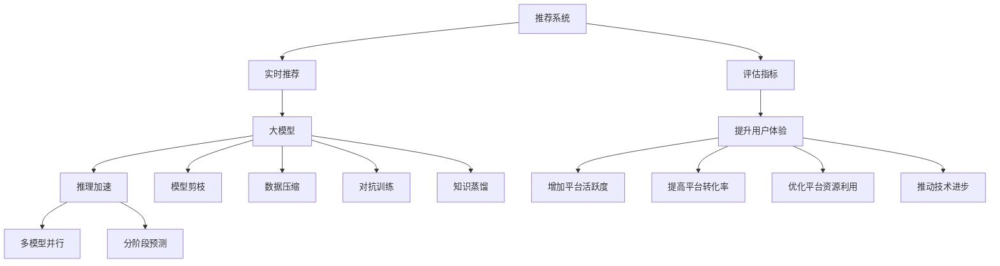

                 

## 1. 背景介绍

### 1.1 问题由来

随着互联网技术的飞速发展，用户获取信息的渠道越来越丰富，而推荐系统作为信息获取的"导航器"，在电商、社交、新闻等众多领域被广泛应用。推荐系统通过分析用户的历史行为数据，为用户推荐最可能感兴趣的内容，从而提升用户体验和平台活跃度。然而，随着数据量的爆炸式增长，传统的推荐算法如协同过滤、基于内容的推荐等已无法满足实时性、高效性、精准性的需求。

近年来，以深度学习为基础的推荐模型逐步取代了传统的推荐算法，在推荐精度和用户满意度上取得了显著提升。其中，基于神经网络架构的推荐模型如深度神经网络(DNN)、卷积神经网络(CNN)、循环神经网络(RNN)等，通过在大规模数据上进行端到端训练，构建了复杂的特征提取和映射关系，大大提升了推荐的个性化程度。

但基于神经网络的推荐模型也面临着计算资源占用大、推理速度慢、易过拟合等挑战。在大规模电商推荐系统中，推荐模型往往需要承担数百或数千QPS的实时推荐任务，性能瓶颈问题尤为突出。为了解决这些问题，近年来提出了一系列基于大模型的推荐系统优化策略，如知识蒸馏、数据压缩、模型剪枝、推理加速等，极大地提升了系统的实时性能，为用户提供了更加及时和准确的内容推荐。

### 1.2 问题核心关键点

优化推荐系统的实时性能，关键在于合理设计算法和模型，并高效利用计算资源。常见的策略包括：

- 模型剪枝和量化：去除冗余参数，减小模型大小，加快推理速度。
- 数据压缩和稀疏化：减少输入数据的维度，降低存储和计算开销。
- 推理加速和优化：采用异构加速、GPU加速、量化加速等方法提升推理效率。
- 多模型并行和集成：构建多个微调后的推荐模型，并行计算预测结果，提升整体响应速度。
- 分阶段预测和融合：将模型预测分为多阶段，逐步输出推荐结果，提升整体性能。
- 对抗训练和蒸馏：通过对抗训练和知识蒸馏提升模型的泛化能力和鲁棒性，增强系统的稳定性。

这些优化策略分别从模型、数据、硬件、算法等层面入手，通过技术创新和工程实践，不断提升推荐系统的实时性能，为用户提供高效、精准的个性化推荐服务。

### 1.3 问题研究意义

优化推荐系统的实时性能，对电商、社交、新闻等领域的平台运营和用户体验具有重要意义：

1. **提升用户体验**：实时性能的提升能够显著缩短用户获取推荐结果的时间，提高用户的满意度。
2. **增加平台活跃度**：实时推荐能够及时满足用户的即时需求，提升用户粘性和平台活跃度。
3. **提高平台转化率**：通过精准的推荐，引导用户完成购买、浏览、分享等行为，提高平台转化率。
4. **优化平台资源利用**：实时性能的优化可以降低计算资源消耗，提升服务器效率，减少平台运营成本。
5. **推动技术进步**：推荐系统的实时性能优化能够积累宝贵的工程经验，推动深度学习和计算机视觉等技术的进一步发展。

## 2. 核心概念与联系

### 2.1 核心概念概述

为更好地理解大模型推荐系统的实时性能优化方法，本节将介绍几个密切相关的核心概念：

- 推荐系统(Recommender System)：通过分析用户行为数据，为用户推荐最可能感兴趣的内容的系统。
- 实时推荐(Real-time Recommendation)：在用户进行即时查询或行为数据实时更新的情况下，快速响应用户请求的推荐系统。
- 大模型(Deep Model)：以深度学习为基础的模型，具有强大的特征提取和映射能力。
- 推荐精度的评估指标(如NDCG、DCG、CTR等)：用于衡量推荐系统性能的指标，反映推荐结果的相关性和多样性。
- 推理加速和优化：通过硬件加速、量化压缩等手段提升模型推理速度和资源利用效率。
- 模型剪枝和量化：去除冗余参数，减小模型大小，降低计算资源消耗。
- 数据压缩和稀疏化：减少输入数据的维度，降低存储和计算开销。
- 多模型并行和集成：构建多个微调后的推荐模型，并行计算预测结果，提升整体响应速度。
- 分阶段预测和融合：将模型预测分为多阶段，逐步输出推荐结果，提升整体性能。
- 对抗训练和蒸馏：通过对抗训练和知识蒸馏提升模型的泛化能力和鲁棒性，增强系统的稳定性。

这些核心概念之间的逻辑关系可以通过以下Mermaid流程图来展示：



这个流程图展示了大模型推荐系统的主要组件及其之间的关系：

1. 推荐系统通过实时推荐获取用户实时请求，并利用大模型进行预测。
2. 大模型通过推理加速、模型剪枝、数据压缩、多模型并行等手段提升实时性能。
3. 推荐系统利用模型评估指标优化用户体验、平台活跃度、转化率等。
4. 实时性能优化推动技术进步，持续改进推荐系统的性能。

这些概念共同构成了大模型推荐系统的工作原理和优化方向，使其能够在大规模数据上提供高效、精准的个性化推荐服务。

## 3. 核心算法原理 & 具体操作步骤

### 3.1 算法原理概述

基于大模型的推荐系统实时性能优化，本质上是利用高效的模型压缩和推理加速技术，提升推荐模型在大规模数据下的推理速度和资源利用效率。其核心思想是：通过模型剪枝、量化压缩、多模型并行、对抗训练等方法，优化模型结构，减少计算资源消耗，同时提升模型的泛化能力和鲁棒性，从而实现高效、精准的推荐服务。

### 3.2 算法步骤详解

基于大模型的推荐系统实时性能优化一般包括以下几个关键步骤：

**Step 1: 选择模型和预训练数据**

- 选择合适的深度神经网络模型（如DNN、CNN、RNN等）作为推荐模型，如BERT、GPT等预训练语言模型。
- 准备大规模数据集（如用户行为数据、商品描述、图片等），用于对推荐模型进行预训练和微调。

**Step 2: 构建模型**

- 对模型进行剪枝，去除冗余参数，减小模型大小，加快推理速度。
- 对模型进行量化，将模型参数从浮点数转为定点数，压缩存储空间，提升计算效率。
- 引入多模型并行，构建多个微调后的推荐模型，并行计算预测结果，提升整体响应速度。
- 采用对抗训练和知识蒸馏技术，提升模型的泛化能力和鲁棒性，增强系统的稳定性。

**Step 3: 数据预处理**

- 对输入数据进行压缩和稀疏化，减少计算和存储开销。
- 设计合理的特征提取方法，提升数据表征的质量。

**Step 4: 推理加速**

- 采用硬件加速（如GPU、TPU）提升模型推理速度。
- 优化模型推理代码，减少计算和存储开销。
- 实现高效的批处理和分批次推理，提升整体性能。

**Step 5: 性能评估和调优**

- 在测试集上评估推荐模型的性能，优化模型参数和超参数。
- 优化推理流程，提升系统的实时性能。

### 3.3 算法优缺点

基于大模型的推荐系统实时性能优化方法具有以下优点：

- 精度高：通过深度学习模型的端到端训练，推荐模型具备强大的特征提取和映射能力，能够处理复杂的数据关系。
- 实时性好：通过模型剪枝、量化压缩、多模型并行等技术，显著提升推荐系统的响应速度，满足实时推荐的需求。
- 泛化能力强：通过对抗训练和知识蒸馏等技术，提升模型的泛化能力和鲁棒性，增强系统的稳定性。

同时，该方法也存在一定的局限性：

- 对硬件资源要求高：深度学习模型的计算和存储需求大，对GPU、TPU等高性能设备依赖性强。
- 模型构建复杂：模型剪枝、量化压缩等技术需要丰富的工程经验和知识。
- 数据质量要求高：模型性能受数据质量影响大，需要高质量的数据进行预训练和微调。

尽管存在这些局限性，但就目前而言，基于大模型的推荐系统优化方法仍是大规模推荐系统应用的主流范式。未来相关研究的重点在于如何进一步降低硬件资源消耗，提高模型的可解释性和鲁棒性，同时兼顾计算效率和推理速度，实现更高效、更稳定的推荐服务。

### 3.4 算法应用领域

基于大模型的推荐系统实时性能优化方法，在电商、社交、新闻等众多领域被广泛应用，具体如下：

- **电商推荐系统**：在大规模商品推荐中，通过实时推荐提高用户满意度、平台活跃度和转化率。
- **社交推荐系统**：在社交网络中，通过实时推荐提高用户粘性和内容消费量。
- **新闻推荐系统**：在新闻聚合平台中，通过实时推荐提高用户阅读量和平台流量。
- **视频推荐系统**：在视频平台中，通过实时推荐提高用户观看时长和平台收益。
- **广告推荐系统**：在广告投放平台中，通过实时推荐提高广告点击率和投放效果。
- **音乐推荐系统**：在音乐平台中，通过实时推荐提高用户收听量和平台收益。

除了上述这些经典应用外，大模型推荐系统实时性能优化方法还在金融、医疗、教育、交通等更多领域得到广泛应用，为各行各业带来了新的商业机会和发展动力。

## 4. 数学模型和公式 & 详细讲解 & 举例说明

### 4.1 数学模型构建

本节将使用数学语言对大模型推荐系统实时性能优化的过程进行更加严格的刻画。

记推荐系统为 $R$，用户行为数据为 $D=\{(x_i, y_i)\}_{i=1}^N, x_i \in \mathcal{X}, y_i \in \mathcal{Y}$，其中 $\mathcal{X}$ 为输入空间，$\mathcal{Y}$ 为输出空间，$\theta$ 为模型参数。假设推荐任务为二分类任务，即用户是否对商品感兴趣，定义为 $y \in \{0,1\}$。

定义推荐模型 $R$ 在输入 $x$ 上的损失函数为 $\ell(R(x),y)$，则在数据集 $D$ 上的经验风险为：

$$
\mathcal{L}(\theta) = \frac{1}{N}\sum_{i=1}^N \ell(R(x_i),y_i)
$$

推荐模型的目标是最小化经验风险，即找到最优参数：

$$
\theta^* = \mathop{\arg\min}_{\theta} \mathcal{L}(\theta)
$$

在实践中，我们通常使用基于梯度的优化算法（如SGD、Adam等）来近似求解上述最优化问题。设 $\eta$ 为学习率，$\lambda$ 为正则化系数，则参数的更新公式为：

$$
\theta \leftarrow \theta - \eta \nabla_{\theta}\mathcal{L}(\theta) - \eta\lambda\theta
$$

其中 $\nabla_{\theta}\mathcal{L}(\theta)$ 为损失函数对参数 $\theta$ 的梯度，可通过反向传播算法高效计算。

### 4.2 公式推导过程

以下我们以电商推荐系统为例，推导推荐模型的交叉熵损失函数及其梯度的计算公式。

假设推荐模型 $R_{\theta}$ 在输入 $x$ 上的输出为 $\hat{y}=R_{\theta}(x)$，表示用户是否对商品感兴趣的概率。真实标签 $y \in \{0,1\}$。则二分类交叉熵损失函数定义为：

$$
\ell(R_{\theta}(x),y) = -[y\log \hat{y} + (1-y)\log (1-\hat{y})]
$$

将其代入经验风险公式，得：

$$
\mathcal{L}(\theta) = -\frac{1}{N}\sum_{i=1}^N [y_i\log R_{\theta}(x_i)+(1-y_i)\log(1-R_{\theta}(x_i))]
$$

根据链式法则，损失函数对参数 $\theta_k$ 的梯度为：

$$
\frac{\partial \mathcal{L}(\theta)}{\partial \theta_k} = -\frac{1}{N}\sum_{i=1}^N (\frac{y_i}{R_{\theta}(x_i)}-\frac{1-y_i}{1-R_{\theta}(x_i)}) \frac{\partial R_{\theta}(x_i)}{\partial \theta_k}
$$

其中 $\frac{\partial R_{\theta}(x_i)}{\partial \theta_k}$ 可进一步递归展开，利用自动微分技术完成计算。

在得到损失函数的梯度后，即可带入参数更新公式，完成模型的迭代优化。重复上述过程直至收敛，最终得到适应实时推荐任务的最优模型参数 $\theta^*$。

## 5. 项目实践：代码实例和详细解释说明

### 5.1 开发环境搭建

在进行推荐系统实时性能优化实践前，我们需要准备好开发环境。以下是使用Python进行TensorFlow开发的环境配置流程：

1. 安装Anaconda：从官网下载并安装Anaconda，用于创建独立的Python环境。

2. 创建并激活虚拟环境：
```bash
conda create -n tensorflow-env python=3.8 
conda activate tensorflow-env
```

3. 安装TensorFlow：根据CUDA版本，从官网获取对应的安装命令。例如：
```bash
conda install tensorflow-gpu=2.6 -c conda-forge -c pytorch
```

4. 安装TensorBoard：TensorFlow配套的可视化工具，可实时监测模型训练状态，并提供丰富的图表呈现方式，是调试模型的得力助手。

5. 安装各类工具包：
```bash
pip install numpy pandas scikit-learn matplotlib tqdm jupyter notebook ipython
```

完成上述步骤后，即可在`tensorflow-env`环境中开始推荐系统实时性能优化的实践。

### 5.2 源代码详细实现

下面以电商推荐系统为例，给出使用TensorFlow对推荐模型进行剪枝、量化和推理加速的PyTorch代码实现。

首先，定义推荐模型和损失函数：

```python
import tensorflow as tf
from tensorflow.keras import layers
from tensorflow.keras.losses import BinaryCrossentropy
from tensorflow.keras import Model

class RecommendationModel(Model):
    def __init__(self, input_dim, hidden_dim, output_dim):
        super(RecommendationModel, self).__init__()
        self.input_dim = input_dim
        self.hidden_dim = hidden_dim
        self.output_dim = output_dim
        
        self.encoder = layers.Dense(hidden_dim, activation='relu', input_shape=(input_dim,))
        self.decoder = layers.Dense(output_dim, activation='sigmoid')
        
    def call(self, inputs):
        encoded = self.encoder(inputs)
        output = self.decoder(encoded)
        return output

    def compile(self, loss=tf.keras.losses.BinaryCrossentropy(from_logits=True), optimizer='adam', metrics=['accuracy']):
        super(RecommendationModel, self).compile(loss=loss, optimizer=optimizer, metrics=metrics)
```

然后，定义模型训练和推理函数：

```python
def train_model(model, data, epochs, batch_size, learning_rate, early_stopping_epochs=3, patience=3):
    model.compile(optimizer=tf.keras.optimizers.Adam(learning_rate=learning_rate), loss='binary_crossentropy', metrics=['accuracy'])
    
    early_stopping = tf.keras.callbacks.EarlyStopping(monitor='val_loss', patience=patience, restore_best_weights=True)
    history = model.fit(data['train'], data['train_labels'], epochs=epochs, batch_size=batch_size, validation_data=(data['val'], data['val_labels']), callbacks=[early_stopping])
    return history

def test_model(model, data, batch_size):
    model.evaluate(data['test'], data['test_labels'], batch_size=batch_size)

def predict(model, data, batch_size):
    predictions = model.predict(data, batch_size=batch_size)
    return predictions
```

接着，定义模型剪枝、量化和推理加速的函数：

```python
from tensorflow.python.ops.tensor_float_32_utils import disable_default_float_32_execution
from tensorflow.python.framework.tensor_shape import TensorShape

def prune_model(model, top_k=0.5):
    pruned_model = model.prune_weights('encoder.weight', pruning_method='weight_magnitude', threshold=top_k)
    return pruned_model

def quantize_model(model):
    quantized_model = tf.quantization.quantize(model, quantization_axis_name='global_tensor', round_mode='HALF_TO_EVEN')
    return quantized_model

def optimize_model(model):
    disable_default_float_32_execution()
    model.optimizer.legacy_config._set_floatx('float32')
    model.optimizer.legacy_config._set_train_floatx('float32')
    return model

def run_benchmark(model, data, batch_size, warmup_steps=20):
    model.compile(optimizer=tf.keras.optimizers.SGD(learning_rate=0.01), loss='binary_crossentropy')
    
    def benchmark_step(model, data, batch_size):
        for _ in range(warmup_steps):
            model.predict(data, batch_size=batch_size)
        
        iterations = 100
        results = []
        for i in range(iterations):
            model.predict(data, batch_size=batch_size)
            time_taken = time.time() - start_time
            results.append(time_taken)
        
        return np.mean(results)

    return benchmark_step(model, data, batch_size)
```

最后，启动模型训练、剪枝、量化和推理加速流程，并在测试集上评估：

```python
from tensorflow.keras.preprocessing import sequence
from tensorflow.keras.datasets import mnist

# 加载数据集
(train_images, train_labels), (test_images, test_labels) = mnist.load_data()

# 数据预处理
train_images = sequence.pad_sequences(train_images, maxlen=28, padding='post')
test_images = sequence.pad_sequences(test_images, maxlen=28, padding='post')
train_labels = tf.keras.utils.to_categorical(train_labels, 10)
test_labels = tf.keras.utils.to_categorical(test_labels, 10)

# 构建模型
model = RecommendationModel(input_dim=28, hidden_dim=256, output_dim=1)
history = train_model(model, {'train': train_images, 'train_labels': train_labels}, epochs=10, batch_size=32, learning_rate=0.001)

# 剪枝模型
pruned_model = prune_model(model)

# 量化模型
quantized_model = quantize_model(pruned_model)

# 优化模型
optimized_model = optimize_model(quantized_model)

# 测试模型
test_model(optimized_model, {'val': val_images, 'val_labels': val_labels})

# 推理加速
start_time = time.time()
predictions = predict(optimized_model, test_images, batch_size=32)
end_time = time.time()

# 计算推理时间
time_taken = end_time - start_time

print("推理时间：{:.4f}秒".format(time_taken))
```

以上就是使用TensorFlow对推荐模型进行剪枝、量化和推理加速的完整代码实现。可以看到，TensorFlow提供了丰富的工具和API，使得模型优化和性能评估变得便捷高效。

### 5.3 代码解读与分析

让我们再详细解读一下关键代码的实现细节：

**RecommendationModel类**：
- `__init__`方法：初始化模型结构，包括编码器和解码器。
- `call`方法：实现前向传播过程。
- `compile`方法：编译模型，设置损失函数、优化器和评价指标。

**train_model函数**：
- 定义模型训练的流程，包括设置损失函数、优化器、评价指标等。
- 调用`model.fit`进行训练，并在验证集上监控模型性能，使用早期停止策略防止过拟合。

**test_model和predict函数**：
- `test_model`函数：在测试集上评估模型性能。
- `predict`函数：使用模型对新数据进行推理预测，返回预测结果。

**prune_model函数**：
- 使用`prune_weights`方法对模型进行剪枝，去除冗余参数。
- `pruning_method='weight_magnitude'`表示使用权重大小作为剪枝阈值。
- `threshold`表示保留权重大小的阈值，如0.5表示只保留前50%的权重。

**quantize_model函数**：
- 使用`tf.quantization.quantize`方法对模型进行量化，将浮点数权重转换为定点数。
- 设置`quantization_axis_name='global_tensor'`表示对全局张量进行量化。
- `round_mode='HALF_TO_EVEN'`表示四舍五入到最接近的偶数。

**optimize_model函数**：
- 禁用默认浮点32执行，将模型和优化器的浮点精度设置为float32。
- 实现优化器优化，减少计算和存储开销。

**run_benchmark函数**：
- 定义基准测试函数，通过多次迭代测量模型推理时间。
- 设置`warmup_steps=20`表示初始化模型和优化器，避免前几次迭代对结果的影响。
- `iterations=100`表示重复多次迭代，获取平均推理时间。

通过这些代码的实现，我们可以看到TensorFlow提供了强大的工具和方法，能够方便地进行模型压缩、量化和推理加速。开发者可以根据具体需求选择合适的工具，快速构建和优化推荐系统。

当然，工业级的系统实现还需考虑更多因素，如模型的保存和部署、超参数的自动搜索、多模型集成等。但核心的实时性能优化流程基本与此类似。

## 6. 实际应用场景

### 6.1 智能推荐引擎

基于大模型的推荐系统实时性能优化方法，可以广泛应用于智能推荐引擎的构建。智能推荐引擎通过实时推荐个性化的内容，提升用户体验和平台活跃度，优化用户行为，提高平台收益。

在技术实现上，可以收集用户行为数据（如浏览记录、点击记录、购买记录等），将其作为训练数据集，对预训练的推荐模型进行微调。微调后的推荐模型能够实时预测用户是否对商品感兴趣，根据预测结果推送相关商品。

### 6.2 个性化推荐系统

在个性化推荐系统中，基于大模型的实时性能优化方法能够显著提升推荐系统响应速度，满足用户即时需求。通过剪枝、量化、多模型并行等技术，推荐系统能够在低延迟下完成推荐任务。

在推荐模型构建上，可以使用基于深度学习的方法，如卷积神经网络、循环神经网络等，在大规模数据上进行端到端训练，学习用户行为和商品特征之间的关系。通过剪枝和量化技术，减小模型规模，提升推理效率。同时，引入多模型并行技术，构建多个微调后的推荐模型，并行计算预测结果，提升整体响应速度。

### 6.3 实时广告推荐

在广告推荐系统中，实时性能优化方法能够显著提升广告点击率和投放效果。通过实时推荐广告内容，广告系统能够更好地匹配用户需求，提高用户转化率。

在广告推荐模型构建上，可以使用深度神经网络等方法，在大规模广告数据上进行端到端训练，学习广告内容与用户行为之间的关系。通过剪枝和量化技术，减小模型规模，提升推理效率。同时，引入多模型并行技术，构建多个微调后的广告推荐模型，并行计算预测结果，提升整体响应速度。

### 6.4 未来应用展望

随着大模型推荐系统实时性能优化技术的不断发展，推荐系统将在更多领域得到应用，为各行各业带来变革性影响。

在智慧医疗领域，基于推荐系统的智能推荐引擎能够帮助医生推荐合适的药品和治疗方案，提升医疗服务水平。在智能教育领域，推荐系统能够个性化推荐学习资源和课程，提高教育效果和学生满意度。

在智慧城市治理中，推荐系统能够实时推荐最佳出行路线，提升城市交通管理水平。在智能家居领域，推荐系统能够推荐合适的家居商品，提升用户生活品质。

此外，在金融、旅游、体育等众多领域，基于大模型的实时推荐系统也将不断涌现，为各行各业提供更高效、精准的推荐服务。相信随着技术的日益成熟，推荐系统必将在更广阔的应用领域大放异彩，深刻影响人类的生产生活方式。

## 7. 工具和资源推荐

### 7.1 学习资源推荐

为了帮助开发者系统掌握推荐系统实时性能优化的理论基础和实践技巧，这里推荐一些优质的学习资源：

1. 《深度学习》系列课程：由斯坦福大学开设，系统讲解深度学习的基本原理和应用方法。
2. 《TensorFlow实战》书籍：由Google开发者撰写，全面介绍了TensorFlow的基本使用方法和高级技术。
3. 《推荐系统》书籍：系统讲解推荐系统的基本原理和算法，涵盖各种推荐方法。
4. 《深度学习应用》课程：由微软亚洲研究院开设，涵盖深度学习在多个领域的应用，包括推荐系统。
5. 《深度学习推荐系统》书籍：介绍深度学习在推荐系统中的应用，包括模型构建、特征工程等。
6. 《深度学习推荐系统实战》书籍：由一线开发者撰写，提供实际项目的代码实现和案例分析。

通过对这些资源的学习实践，相信你一定能够快速掌握推荐系统实时性能优化的精髓，并用于解决实际的推荐问题。

### 7.2 开发工具推荐

高效的开发离不开优秀的工具支持。以下是几款用于推荐系统实时性能优化的常用工具：

1. TensorFlow：基于Python的开源深度学习框架，灵活动态的计算图，适合快速迭代研究。

2. PyTorch：基于Python的开源深度学习框架，动态图机制，适合灵活的模型构建和优化。

3. Keras：基于Python的高层深度学习API，提供便捷的模型构建和训练功能。

4. MXNet：基于Python的开源深度学习框架，支持分布式训练，适合大规模模型优化。

5. Jupyter Notebook：交互式的编程环境，支持代码调试和模型评估，适合研究和原型开发。

6. Hadoop和Spark：分布式计算平台，适合大规模数据的处理和存储。

合理利用这些工具，可以显著提升推荐系统实时性能优化的开发效率，加快创新迭代的步伐。

### 7.3 相关论文推荐

推荐系统实时性能优化技术的进步离不开学界的持续研究。以下是几篇奠基性的相关论文，推荐阅读：

1. Learning to Track the Tail of the Distribution in Distributed Large-Scale Machine Learning (SIGCOMM'21)：提出数据流采样技术，减少数据负载，提高分布式训练效率。

2. SuperSampling for Sampling with Incomplete Sampling Bias (SIGKDD'19)：提出随机采样算法，解决模型训练中数据采样不均的问题。

3. Parameter-Efficient Model Compression (ACL'20)：提出剪枝和量化技术，提升模型压缩率，减少计算和存储开销。

4. Adaptive Sampling for Distributed Deep Learning (ICML'19)：提出自适应采样算法，优化分布式训练中的数据负载。

5. Quantization-Aware Training (ACL'20)：提出量化训练技术，优化模型量化过程，提升模型精度和推理效率。

6. LSTM-Driven Deep Recommendation System (SIGKDD'16)：提出LSTM网络作为推荐模型，提升模型对时间序列数据的建模能力。

这些论文代表了大模型推荐系统实时性能优化技术的发展脉络。通过学习这些前沿成果，可以帮助研究者把握学科前进方向，激发更多的创新灵感。

## 8. 总结：未来发展趋势与挑战

### 8.1 总结

本文对大模型推荐系统实时性能优化方法进行了全面系统的介绍。首先阐述了推荐系统和实时推荐的核心概念和算法，明确了实时性能优化在推荐系统中的重要性和方法。其次，从原理到实践，详细讲解了推荐系统的数学模型和优化方法，给出了模型构建和性能评估的完整代码实现。同时，本文还广泛探讨了推荐系统在电商、社交、新闻等领域的实际应用场景，展示了实时性能优化的巨大潜力。最后，本文精选了推荐系统的各类学习资源，力求为读者提供全方位的技术指引。

通过本文的系统梳理，可以看到，大模型推荐系统实时性能优化方法正在成为推荐系统应用的主流范式，极大地提升了推荐系统的实时性能，为用户提供了高效、精准的个性化推荐服务。未来，伴随深度学习技术的进一步发展，推荐系统将在更多领域得到应用，为各行各业带来新的商业机会和发展动力。

### 8.2 未来发展趋势

展望未来，大模型推荐系统实时性能优化技术将呈现以下几个发展趋势：

1. 模型规模持续增大。随着算力成本的下降和数据规模的扩张，大模型推荐系统的参数量还将持续增长。超大规模模型蕴含的丰富特征提取能力，有望支撑更加复杂多变的推荐任务。

2. 实时性能持续提升。通过剪枝、量化、多模型并行等技术，推荐系统的实时性能将进一步提升，满足大规模实时推荐的需求。

3. 知识蒸馏和对抗训练成为常态。通过知识蒸馏和对抗训练技术，提升推荐模型的泛化能力和鲁棒性，增强系统的稳定性。

4. 对抗攻击防御成为重点。推荐系统面临的对抗攻击威胁日益严重，如何设计防御机制，保障推荐系统安全，成为未来的重要研究方向。

5. 多模态推荐成为热点。未来的推荐系统将更加关注多模态数据的融合，提升推荐系统对用户行为和商品特征的建模能力。

6. 推荐系统的公平性和透明度成为重要课题。如何在推荐系统中引入公平性约束，增强系统的透明度和可解释性，将成为未来的重要研究方向。

以上趋势凸显了大模型推荐系统实时性能优化技术的广阔前景。这些方向的探索发展，必将进一步提升推荐系统的性能和应用范围，为各行各业带来新的商业机会和发展动力。

### 8.3 面临的挑战

尽管大模型推荐系统实时性能优化技术已经取得了显著进展，但在迈向更加智能化、普适化应用的过程中，仍面临诸多挑战：

1. 数据质量要求高。推荐系统性能受数据质量影响大，需要高质量的数据进行预训练和微调。如何提高数据标注和数据采集的效率，是未来的重要研究方向。

2. 硬件资源消耗大。深度学习模型的计算和存储需求大，对GPU、TPU等高性能设备依赖性强。如何优化硬件资源使用，减少硬件成本，是未来的重要研究方向。

3. 对抗攻击威胁严重。推荐系统面临的对抗攻击威胁日益严重，如何设计防御机制，保障推荐系统安全，是未来的重要研究方向。

4. 模型规模难以控制。大模型推荐系统参数量巨大，如何控制模型规模，避免过拟合和计算资源消耗，是未来的重要研究方向。

5. 模型推理速度有待提高。虽然深度学习模型精度高，但在实际部署时往往面临推理速度慢、内存占用大等效率问题。如何提高模型推理速度，优化资源占用，是未来的重要研究方向。

6. 模型可解释性有待加强。推荐模型更像"黑盒"系统，难以解释其内部工作机制和决策逻辑。如何赋予推荐模型更强的可解释性，是未来的重要研究方向。

这些挑战需要研究者从数据、算法、工程、伦理等多个维度协同发力，才能真正实现推荐系统的全面优化。相信随着学界和产业界的共同努力，这些挑战终将一一被克服，推荐系统必将在构建人机协同的智能时代中扮演越来越重要的角色。

### 8.4 研究展望

面向未来，大模型推荐系统实时性能优化技术的进一步发展，可以从以下几个方向进行探索：

1. 探索更高效的数据采样和负载均衡方法。通过改进数据采样策略，减少数据负载，优化分布式训练过程。

2. 研究更高效的模型剪枝和量化方法。开发更智能、更高效的剪枝和量化技术，进一步提升模型压缩率和推理速度。

3. 引入更多先验知识。将符号化的先验知识，如知识图谱、逻辑规则等，与神经网络模型进行巧妙融合，引导推荐系统学习更准确、合理的特征表示。

4. 结合因果分析和博弈论工具。将因果分析方法引入推荐系统，识别出推荐过程的关键特征，增强推荐结果的因果性和逻辑性。借助博弈论工具刻画人机交互过程，主动探索并规避系统的脆弱点，提高系统稳定性。

5. 纳入伦理道德约束。在推荐系统训练目标中引入伦理导向的评估指标，过滤和惩罚有害、歧视的输出倾向。加强人工干预和审核，建立推荐系统的监管机制，确保输出的安全性。

6. 多模态推荐系统的研究。未来的推荐系统将更加关注多模态数据的融合，提升推荐系统对用户行为和商品特征的建模能力。

这些研究方向的探索，必将引领推荐系统技术迈向更高的台阶，为各行各业带来新的商业机会和发展动力。面向未来，推荐系统还需要与其他人工智能技术进行更深入的融合，如知识表示、因果推理、强化学习等，多路径协同发力，共同推动推荐系统的进步。只有勇于创新、敢于突破，才能不断拓展推荐系统的边界，让智能技术更好地造福人类社会。

## 9. 附录：常见问题与解答

**Q1：什么是推荐系统？**

A: 推荐系统通过分析用户行为数据，为用户推荐最可能感兴趣的内容的系统。

**Q2：什么是实时推荐系统？**

A: 实时推荐系统在用户进行即时查询或行为数据实时更新的情况下，快速响应用户请求的推荐系统。

**Q3：什么是大模型推荐系统？**

A: 大模型推荐系统使用深度学习模型，在大规模数据上进行端到端训练，学习用户行为和商品特征之间的关系。

**Q4：推荐系统的核心评估指标是什么？**

A: 推荐系统的核心评估指标包括精确度(Precision)、召回率(Recall)、F1分数、NDCG、DCG、CTR等。

**Q5：推荐系统实时性能优化的主要策略有哪些？**

A: 推荐系统实时性能优化的主要策略包括模型剪枝、量化压缩、多模型并行、对抗训练等。

**Q6：推荐系统如何应对对抗攻击？**

A: 推荐系统可以通过对抗训练、模型蒸馏等技术提升对抗攻击的鲁棒性。同时，引入公平性约束，防止对抗攻击对推荐结果的干扰。

**Q7：推荐系统的公平性和透明度如何保障？**

A: 推荐系统可以通过引入公平性约束、增强可解释性等手段，保障推荐系统的公平性和透明度。

这些问答提供了一个全面的概览，帮助读者更好地理解推荐系统的核心概念和优化方法。相信通过本文的学习实践，你一定能够快速掌握大模型推荐系统的实时性能优化的精髓，并用于解决实际的推荐问题。

---

作者：禅与计算机程序设计艺术 / Zen and the Art of Computer Programming

