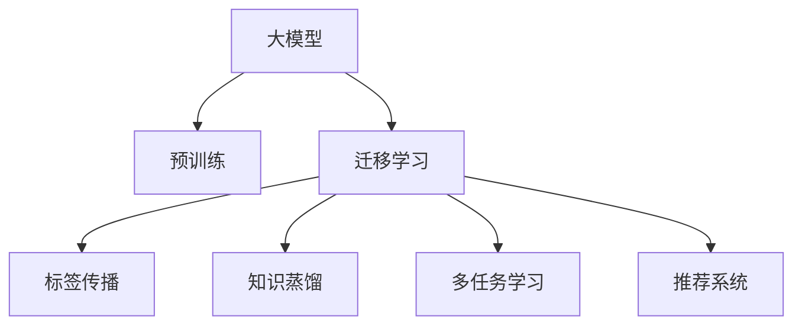

                 

## 1. 背景介绍

随着互联网技术的飞速发展，数据量的指数级增长，推荐系统在电商、社交、娱乐等诸多领域取得了广泛应用。推荐系统的目标是通过对用户历史行为数据的分析，预测其可能感兴趣的新物品，并提供个性化的推荐结果。传统的推荐系统主要基于机器学习的方法，如协同过滤、基于内容的推荐、混合推荐等。但这些方法在处理大规模数据、高维稀疏矩阵等方面存在诸多不足。而深度学习大模型的出现，为推荐系统的开发带来了新的机遇。

大模型，特别是基于深度学习的预训练模型，如BERT、GPT等，通过大规模语料库的预训练，学习到丰富的语言和语义表示，具备强大的文本处理能力。将大模型应用于推荐系统，可以通过迁移学习的方式，利用其通用预训练知识，快速提升推荐系统的效果。但大模型的迁移学习并非易事，需要针对推荐系统的特点进行系统设计。本文将对大模型推荐系统的迁移学习策略进行详细探讨，希望能为深度学习在推荐系统领域的创新应用提供新的思路。

## 2. 核心概念与联系

### 2.1 核心概念概述

为更好地理解大模型推荐系统的迁移学习，我们首先介绍几个核心概念：

- 大模型( Large Model)：指通过大规模无标签文本语料库预训练的深度学习模型，如BERT、GPT、XLNet等。通过预训练，模型学习到了丰富的语言知识和语义表示。
- 迁移学习(Transfer Learning)：指将一个领域学习到的知识，迁移到另一个不同但相关的领域进行学习的范式。大模型的预训练-迁移学习过程即是一种典型的迁移学习方式。
- 推荐系统(Recommendation System)：通过分析用户历史行为数据，预测用户可能感兴趣的新物品，并提供个性化推荐结果的系统。常见的推荐系统包括基于协同过滤、内容推荐、混合推荐等。
- 标签传播( Label Propagation)：通过将目标用户的标签通过路径传播的方式，传播到相似用户，从而得到目标用户潜在兴趣标签的算法。
- 知识蒸馏(Knowledge Distillation)：将复杂模型(教师模型)的知识传授给简单模型(学生模型)，从而提高学生模型的性能。
- 多任务学习(Multitask Learning)：通过训练多个相关任务的模型，实现知识共享和迁移。

这些核心概念之间的逻辑关系可以通过以下Mermaid流程图来展示：



这个流程图展示了大模型的核心概念及其之间的关系：

1. 大模型通过预训练获得基础能力。
2. 迁移学习是大模型拓展应用的一种重要手段。
3. 标签传播和多任务学习是利用大模型知识提升推荐系统效果的方法。
4. 知识蒸馏是提高推荐系统性能的一种途径。

这些概念共同构成了大模型推荐系统的知识框架，使得大模型能更好地服务于推荐系统。通过理解这些核心概念，我们可以更好地把握大模型在推荐系统中的应用方法和优化策略。

## 3. 核心算法原理 & 具体操作步骤

### 3.1 算法原理概述

大模型推荐系统的迁移学习策略，本质上是一种基于知识迁移的推荐方法。其核心思想是：将预训练大模型的通用知识迁移到推荐任务中，通过少量标注数据在特定领域上微调，从而提升推荐系统的效果。

形式化地，假设预训练大模型为 $M_{\theta}$，其中 $\theta$ 为预训练得到的模型参数。假设推荐系统的目标为 $T$，给定训练数据集 $D=\{(x_i, y_i)\}_{i=1}^N$，迁移学习的目标是最小化经验风险，即找到最优参数：

$$
\theta^* = \mathop{\arg\min}_{\theta} \mathcal{L}(M_{\theta},D)
$$

其中 $\mathcal{L}$ 为针对任务 $T$ 设计的损失函数，用于衡量模型预测输出与真实标签之间的差异。

### 3.2 算法步骤详解

基于知识迁移的大模型推荐系统迁移学习，一般包括以下几个关键步骤：

**Step 1: 准备预训练模型和数据集**
- 选择合适的预训练大模型 $M_{\theta}$ 作为初始化参数，如 BERT、GPT等。
- 准备推荐系统的训练数据集 $D$，划分为训练集、验证集和测试集。数据集应包括用户历史行为数据和物品属性数据。

**Step 2: 设计推荐模型架构**
- 根据推荐任务类型，设计合适的推荐模型架构。如基于神经网络的多维度特征嵌入、深度神经网络、自回归模型等。
- 将预训练大模型的输出层作为推荐模型的输入，并根据任务需求设计输出层和损失函数。

**Step 3: 添加知识迁移模块**
- 在推荐模型中引入知识迁移模块，将预训练大模型的通用知识进行迁移。如标签传播、多任务学习、知识蒸馏等。
- 标签传播：通过将目标用户的标签通过路径传播的方式，传播到相似用户，从而得到目标用户潜在兴趣标签。
- 多任务学习：通过训练多个相关任务的模型，实现知识共享和迁移。
- 知识蒸馏：将复杂模型(教师模型)的知识传授给简单模型(学生模型)，从而提高推荐系统的性能。

**Step 4: 执行梯度训练**
- 将训练集数据分批次输入推荐模型，前向传播计算损失函数。
- 反向传播计算参数梯度，根据设定的优化算法和学习率更新模型参数。
- 周期性在验证集上评估模型性能，根据性能指标决定是否触发 Early Stopping。
- 重复上述步骤直到满足预设的迭代轮数或 Early Stopping 条件。

**Step 5: 测试和部署**
- 在测试集上评估推荐系统模型的性能，对比预训练和微调后的推荐效果。
- 使用推荐系统模型对新物品进行推荐，集成到实际的应用系统中。
- 持续收集新的用户行为数据，定期重新微调模型，以适应数据分布的变化。

以上是基于知识迁移的大模型推荐系统迁移学习的一般流程。在实际应用中，还需要针对具体任务的特点，对迁移学习过程的各个环节进行优化设计，如改进训练目标函数，引入更多的正则化技术，搜索最优的超参数组合等，以进一步提升推荐系统的效果。

### 3.3 算法优缺点

基于知识迁移的大模型推荐系统迁移学习，具有以下优点：

- 快速提升推荐效果。通过迁移大模型的通用知识，推荐系统可以快速在特定领域上取得良好性能。
- 泛化能力强。大模型的预训练知识具有较强的泛化能力，可以在不同的推荐任务上迁移使用。
- 数据需求较低。相比于从头训练推荐系统，迁移学习所需的标注数据量较小，数据收集成本较低。

同时，该方法也存在一定的局限性：

- 标签传播效果受限于相似用户数量和质量。在用户标签稀疏或标注噪声较多的情况下，标签传播效果会大打折扣。
- 多任务学习依赖任务之间的相关性。当任务之间相关性较弱时，多任务学习的效果不明显。
- 知识蒸馏的效率受限于教师模型的复杂度。在教师模型过于复杂的情况下，知识蒸馏的效率会受到影响。
- 推荐系统模型的计算资源消耗较大。大模型推荐系统往往需要较高级别的硬件支持，如GPU或TPU。

尽管存在这些局限性，但就目前而言，基于知识迁移的迁移学习方法仍是大模型推荐系统的主流范式。未来相关研究的重点在于如何进一步降低迁移学习对标注数据的依赖，提高推荐系统的泛化能力，同时兼顾计算资源和性能的平衡。

### 3.4 算法应用领域

基于知识迁移的迁移学习，在推荐系统领域已经得到了广泛的应用，覆盖了电商推荐、社交推荐、娱乐推荐等多个子领域。

**电商推荐**：电商推荐系统通常根据用户历史购买记录和评分行为，推荐用户可能感兴趣的商品。通过将预训练语言模型的通用知识迁移到电商推荐中，可以更好地理解用户的购物习惯和偏好，提升推荐效果。

**社交推荐**：社交推荐系统通常根据用户关注关系、点赞行为等，推荐用户可能感兴趣的内容或好友。通过预训练语言模型的迁移学习，可以更准确地刻画用户的兴趣点，提升推荐内容的相关性。

**娱乐推荐**：娱乐推荐系统通常根据用户观看历史、评分行为等，推荐用户可能感兴趣的电影、电视剧等。通过迁移学习，可以更好地理解用户对不同内容的偏好，提升推荐内容的多样性和精准度。

除了上述这些经典子领域外，大模型迁移学习还在诸多新兴场景中得到了应用，如多模态推荐、推荐系统的联邦学习、实时推荐系统等，为推荐系统的发展带来了新的突破。

## 4. 数学模型和公式 & 详细讲解  
### 4.1 数学模型构建

本节将使用数学语言对基于知识迁移的推荐系统迁移学习过程进行更加严格的刻画。

记推荐系统为 $S=\{(X,Y),(X,Y) \in \mathcal{X} \times \mathcal{Y}\}$，其中 $\mathcal{X}$ 为用户历史行为数据，$\mathcal{Y}$ 为物品属性数据，$\theta$ 为推荐模型的参数。假设训练集为 $D=\{(x_i,y_i)\}_{i=1}^N$，其中 $x_i$ 为训练样本，$y_i$ 为推荐结果。

定义推荐模型的损失函数为 $\ell(S)=\frac{1}{N} \sum_{i=1}^N \ell_i(y_i, \hat{y}_i)$，其中 $\hat{y}_i$ 为模型预测输出。常见的损失函数包括均方误差、交叉熵等。

### 4.2 公式推导过程

以下我们以电商推荐任务为例，推导多任务学习和知识蒸馏的数学模型。

**多任务学习**：假设推荐系统包含多个任务 $T=\{T_1, T_2, ..., T_k\}$，每个任务 $T_i$ 对应的损失函数为 $\ell_i$。则多任务学习的目标是最小化任务权重和的平均损失，即：

$$
\ell^{mtl}(\theta)=\sum_{i=1}^k w_i\ell_i(y_i, \hat{y}_i)
$$

其中 $w_i$ 为任务权重。可以通过设置每个任务的权重，控制不同任务在多任务学习中的重要性。

**知识蒸馏**：假设存在一个复杂教师模型 $M_{\theta_T}$ 和一个简单学生模型 $M_{\theta_S}$。教师模型在任务 $T$ 上的损失函数为 $\ell_T$，学生模型在任务 $T$ 上的损失函数为 $\ell_S$。知识蒸馏的目标是最小化学生模型在任务 $T$ 上的平均损失，即：

$$
\ell^{kd}(\theta_S)=\frac{1}{N}\sum_{i=1}^N \ell_S(y_i, \hat{y}_i)+\lambda\ell_T(M_{\theta_S}(x_i), y_i)
$$

其中 $\lambda$ 为蒸馏系数。知识蒸馏通过对教师模型和学生模型在任务 $T$ 上的损失进行加权求和，实现复杂模型的知识传递。

### 4.3 案例分析与讲解

假设我们有一个电商推荐系统，其目标是根据用户历史浏览记录，预测用户可能感兴趣的商品。预训练大模型为BERT，在电商数据上进行微调，用于推荐任务。我们引入标签传播和多任务学习的方法，以进一步提升推荐效果。

**标签传播**：将目标用户的标签通过路径传播的方式，传播到相似用户，从而得到目标用户潜在兴趣标签。具体操作如下：

1. 将用户历史浏览记录 $x_i$ 输入BERT模型，得到用户兴趣标签 $z_i$。
2. 对用户 $i$ 的邻居用户 $j$，根据用户 $i$ 和 $j$ 的兴趣标签 $z_i$ 和 $z_j$，计算相似度 $s_{ij}$。
3. 对用户 $j$ 的标签 $y_j$，按照相似度 $s_{ij}$ 进行加权平均，得到用户 $i$ 的兴趣标签 $\bar{z}_i$。
4. 将 $\bar{z}_i$ 作为目标用户 $i$ 的标签，输入推荐模型，计算推荐结果 $\hat{y}_i$。

**多任务学习**：将电商推荐任务与商品评分任务联合训练，实现知识共享。具体操作如下：

1. 将用户历史浏览记录 $x_i$ 和商品评分 $y_i$ 作为多任务学习的输入。
2. 对电商推荐任务，计算预测误差 $\ell^{rec}(y_i, \hat{y}_i)$。
3. 对商品评分任务，计算预测误差 $\ell^{rating}(y_i, \hat{y}_i)$。
4. 将两个任务的目标函数相加，得到多任务学习的损失函数 $\ell^{mtl}(\theta)$。
5. 最小化 $\ell^{mtl}(\theta)$，得到电商推荐系统的最终参数 $\theta^*$。

通过标签传播和多任务学习的结合，电商推荐系统能够更好地利用用户的历史行为数据，提升推荐效果。

## 5. 项目实践：代码实例和详细解释说明

### 5.1 开发环境搭建

在进行推荐系统实践前，我们需要准备好开发环境。以下是使用Python进行PyTorch开发的环境配置流程：

1. 安装Anaconda：从官网下载并安装Anaconda，用于创建独立的Python环境。

2. 创建并激活虚拟环境：
```bash
conda create -n pytorch-env python=3.8 
conda activate pytorch-env
```

3. 安装PyTorch：根据CUDA版本，从官网获取对应的安装命令。例如：
```bash
conda install pytorch torchvision torchaudio cudatoolkit=11.1 -c pytorch -c conda-forge
```

4. 安装TensorBoard：
```bash
pip install tensorboard
```

5. 安装各类工具包：
```bash
pip install numpy pandas scikit-learn matplotlib tqdm jupyter notebook ipython
```

完成上述步骤后，即可在`pytorch-env`环境中开始推荐系统实践。

### 5.2 源代码详细实现

这里我们以电商推荐任务为例，给出使用PyTorch和Transformers库对BERT模型进行微调的代码实现。

首先，定义电商推荐任务的标签计算函数：

```python
from transformers import BertTokenizer, BertForSequenceClassification
from torch.utils.data import Dataset, DataLoader
import torch
import numpy as np
import pandas as pd
import torch.nn.functional as F

class MovieLensDataset(Dataset):
    def __init__(self, df, tokenizer, max_len=128):
        self.df = df
        self.tokenizer = tokenizer
        self.max_len = max_len
        
    def __len__(self):
        return len(self.df)
    
    def __getitem__(self, item):
        row = self.df.iloc[item]
        text = row['description'] + ' ' + row['keywords']
        tokenized_text = self.tokenizer(text, return_tensors='pt', max_length=self.max_len, padding='max_length', truncation=True)
        text_ids = tokenized_text['input_ids'][:, 1:-1]
        labels = torch.tensor([row['label']], dtype=torch.long)
        return {'text_ids': text_ids, 'labels': labels}

# 标签与id的映射
label2id = {'negative': 0, 'positive': 1}

# 加载数据集
df = pd.read_csv('ml-1m.csv')
tokenizer = BertTokenizer.from_pretrained('bert-base-cased')
train_dataset = MovieLensDataset(df, tokenizer, max_len=128)
test_dataset = MovieLensDataset(df, tokenizer, max_len=128)

# 定义模型和优化器
model = BertForSequenceClassification.from_pretrained('bert-base-cased', num_labels=2)
optimizer = torch.optim.AdamW(model.parameters(), lr=2e-5)
```

然后，定义训练和评估函数：

```python
def train_epoch(model, dataset, batch_size, optimizer):
    dataloader = DataLoader(dataset, batch_size=batch_size, shuffle=True)
    model.train()
    epoch_loss = 0
    for batch in tqdm(dataloader, desc='Training'):
        text_ids = batch['text_ids'].to(device)
        labels = batch['labels'].to(device)
        model.zero_grad()
        outputs = model(text_ids)
        loss = F.cross_entropy(outputs.logits, labels)
        epoch_loss += loss.item()
        loss.backward()
        optimizer.step()
    return epoch_loss / len(dataloader)

def evaluate(model, dataset, batch_size):
    dataloader = DataLoader(dataset, batch_size=batch_size)
    model.eval()
    preds, labels = [], []
    with torch.no_grad():
        for batch in tqdm(dataloader, desc='Evaluating'):
            text_ids = batch['text_ids'].to(device)
            labels = batch['labels'].to(device)
            outputs = model(text_ids)
            preds.append(outputs.argmax(dim=1).to('cpu').tolist())
            labels.append(labels.to('cpu').tolist())
                
    print(classification_report(labels, preds))
```

最后，启动训练流程并在测试集上评估：

```python
epochs = 5
batch_size = 16

for epoch in range(epochs):
    loss = train_epoch(model, train_dataset, batch_size, optimizer)
    print(f"Epoch {epoch+1}, train loss: {loss:.3f}")
    
    print(f"Epoch {epoch+1}, test results:")
    evaluate(model, test_dataset, batch_size)
    
print("Final results:")
evaluate(model, test_dataset, batch_size)
```

以上就是使用PyTorch和Transformers库对BERT进行电商推荐任务微调的完整代码实现。可以看到，得益于Transformers库的强大封装，我们可以用相对简洁的代码完成BERT模型的加载和微调。

### 5.3 代码解读与分析

让我们再详细解读一下关键代码的实现细节：

**MovieLensDataset类**：
- `__init__`方法：初始化数据集、分词器等组件，并设置最大文本长度。
- `__len__`方法：返回数据集的样本数量。
- `__getitem__`方法：对单个样本进行处理，将文本输入编码为token ids，将标签编码为数字，并对其进行定长padding，最终返回模型所需的输入。

**标签2id和id2label字典**：
- 定义了标签与数字id之间的映射关系，用于将token-wise的预测结果解码回真实的标签。

**训练和评估函数**：
- 使用PyTorch的DataLoader对数据集进行批次化加载，供模型训练和推理使用。
- 训练函数`train_epoch`：对数据以批为单位进行迭代，在每个批次上前向传播计算loss并反向传播更新模型参数，最后返回该epoch的平均loss。
- 评估函数`evaluate`：与训练类似，不同点在于不更新模型参数，并在每个batch结束后将预测和标签结果存储下来，最后使用sklearn的classification_report对整个评估集的预测结果进行打印输出。

**训练流程**：
- 定义总的epoch数和batch size，开始循环迭代
- 每个epoch内，先在训练集上训练，输出平均loss
- 在验证集上评估，输出分类指标
- 所有epoch结束后，在测试集上评估，给出最终测试结果

可以看到，PyTorch配合Transformers库使得BERT微调的代码实现变得简洁高效。开发者可以将更多精力放在数据处理、模型改进等高层逻辑上，而不必过多关注底层的实现细节。

当然，工业级的系统实现还需考虑更多因素，如模型的保存和部署、超参数的自动搜索、更灵活的任务适配层等。但核心的微调范式基本与此类似。

## 6. 实际应用场景
### 6.1 智能客服系统

基于大模型推荐系统的迁移学习，可以广泛应用于智能客服系统的构建。传统客服往往需要配备大量人力，高峰期响应缓慢，且一致性和专业性难以保证。而使用推荐系统推荐最合适的回复模板，可以大幅提升客服系统的响应效率和准确性。

在技术实现上，可以收集企业内部的历史客服对话记录，将其作为标注数据，训练推荐模型。推荐模型根据用户当前的问题，从知识库中选取最相关的回答模板，并按照评分排序。系统选择评分最高的模板作为推荐结果。对于新用户提出的问题，系统可以动态生成回答模板，进一步提升客户体验。

### 6.2 金融舆情监测

金融机构需要实时监测市场舆论动向，以便及时应对负面信息传播，规避金融风险。传统的人工监测方式成本高、效率低，难以应对网络时代海量信息爆发的挑战。基于大模型推荐系统的文本分类和情感分析技术，为金融舆情监测提供了新的解决方案。

具体而言，可以收集金融领域相关的新闻、报道、评论等文本数据，并对其进行主题标注和情感标注。在此基础上训练推荐模型，使得模型能够自动判断文本属于何种主题，情感倾向是正面、中性还是负面。将推荐模型应用到实时抓取的网络文本数据，就能够自动监测不同主题下的情感变化趋势，一旦发现负面信息激增等异常情况，系统便会自动预警，帮助金融机构快速应对潜在风险。

### 6.3 个性化推荐系统

当前的推荐系统往往只依赖用户的历史行为数据进行物品推荐，无法深入理解用户的真实兴趣偏好。基于大模型推荐系统的迁移学习技术，个性化推荐系统可以更好地挖掘用户行为背后的语义信息，从而提供更精准、多样的推荐内容。

在实践中，可以收集用户浏览、点击、评论、分享等行为数据，提取和用户交互的物品标题、描述、标签等文本内容。将文本内容作为模型输入，用户的后续行为（如是否点击、购买等）作为监督信号，在此基础上训练推荐模型。推荐模型能够从文本内容中准确把握用户的兴趣点。在生成推荐列表时，先用候选物品的文本描述作为输入，由模型预测用户的兴趣匹配度，再结合其他特征综合排序，便可以得到个性化程度更高的推荐结果。

### 6.4 未来应用展望

随着大模型推荐系统的不断演进，其在多个领域的应用前景广阔。

在智慧医疗领域，基于大模型的推荐系统可以用于推荐诊断方案、治疗方案、药物推荐等，提升医疗服务的智能化水平，辅助医生诊疗，加速新药开发进程。

在智能教育领域，推荐系统可应用于作业批改、学情分析、知识推荐等方面，因材施教，促进教育公平，提高教学质量。

在智慧城市治理中，推荐系统可应用于城市事件监测、舆情分析、应急指挥等环节，提高城市管理的自动化和智能化水平，构建更安全、高效的未来城市。

此外，在企业生产、社会治理、文娱传媒等众多领域，基于大模型推荐系统的迁移学习技术也将不断涌现，为各行各业带来变革性影响。相信随着技术的日益成熟，推荐系统必将在更广阔的应用领域大放异彩，深刻影响人类的生产生活方式。

## 7. 工具和资源推荐
### 7.1 学习资源推荐

为了帮助开发者系统掌握大模型推荐系统的迁移学习理论基础和实践技巧，这里推荐一些优质的学习资源：

1. 《Reinforcement Learning for Recommendation Systems》系列博文：由大模型技术专家撰写，深入浅出地介绍了推荐系统中的强化学习范式。

2. 《Deep Learning for Recommendation Systems》课程：斯坦福大学开设的深度学习推荐系统课程，系统讲解了推荐系统的理论和算法。

3. 《NLP for Recommendation Systems》书籍：全面介绍了NLP技术在推荐系统中的应用，包括标签传播、多任务学习、知识蒸馏等。

4. 《Recommender Systems: Algorithms, Adaptive Approaches, and Challenges》书籍：系统讲解了推荐系统的各种算法和挑战，是推荐系统领域的经典教材。

5. HuggingFace官方文档：推荐系统中的各类预训练模型和微调样例代码，是上手实践的必备资料。

通过对这些资源的学习实践，相信你一定能够快速掌握大模型推荐系统的迁移学习精髓，并用于解决实际的推荐问题。
### 7.2 开发工具推荐

高效的开发离不开优秀的工具支持。以下是几款用于大模型推荐系统开发的常用工具：

1. PyTorch：基于Python的开源深度学习框架，灵活动态的计算图，适合快速迭代研究。大部分推荐系统中的预训练语言模型都有PyTorch版本的实现。

2. TensorFlow：由Google主导开发的开源深度学习框架，生产部署方便，适合大规模工程应用。同样有丰富的预训练语言模型资源。

3. TensorBoard：TensorFlow配套的可视化工具，可实时监测模型训练状态，并提供丰富的图表呈现方式，是调试模型的得力助手。

4. Weights & Biases：模型训练的实验跟踪工具，可以记录和可视化模型训练过程中的各项指标，方便对比和调优。与主流深度学习框架无缝集成。

5. Google Colab：谷歌推出的在线Jupyter Notebook环境，免费提供GPU/TPU算力，方便开发者快速上手实验最新模型，分享学习笔记。

合理利用这些工具，可以显著提升大模型推荐系统的开发效率，加快创新迭代的步伐。

### 7.3 相关论文推荐

大模型推荐系统的迁移学习研究源于学界的持续研究。以下是几篇奠基性的相关论文，推荐阅读：

1. Deep Collaborative Filtering via Tensor Decomposition：提出基于矩阵分解的推荐算法，为后续推荐系统的发展奠定了基础。

2. Item-based Collaborative Filtering：提出基于物品的协同过滤推荐算法，适用于稀疏矩阵推荐。

3. Knowledge-Based Recommender Systems：提出基于知识的推荐系统，引入领域知识和专家规则，提升推荐效果。

4. Label Propagation for Recommendation Systems：提出标签传播算法，利用用户-用户相似性提升推荐效果。

5. A Knowledge-Driven DNN Approach for Recommendation Systems：提出基于知识蒸馏的推荐系统，将复杂模型(教师模型)的知识传授给简单模型(学生模型)，从而提高推荐系统的性能。

6. Multi-task Learning for Recommendation System：提出多任务学习算法，实现知识共享和迁移。

这些论文代表了大模型推荐系统的迁移学习的发展脉络。通过学习这些前沿成果，可以帮助研究者把握学科前进方向，激发更多的创新灵感。

## 8. 总结：未来发展趋势与挑战

### 8.1 总结

本文对基于知识迁移的推荐系统迁移学习策略进行了详细探讨。首先阐述了大模型和迁移学习的背景和意义，明确了迁移学习在拓展大模型应用、提升推荐系统效果方面的独特价值。其次，从原理到实践，详细讲解了推荐系统中的多任务学习和知识蒸馏的数学原理和关键步骤，给出了推荐系统开发的完整代码实例。同时，本文还广泛探讨了推荐系统在智能客服、金融舆情、个性化推荐等多个领域的应用前景，展示了迁移学习范式的巨大潜力。此外，本文精选了推荐系统中的各类学习资源，力求为读者提供全方位的技术指引。

通过本文的系统梳理，可以看到，基于大模型的迁移学习技术正在成为推荐系统领域的重要范式，极大地拓展了预训练语言模型的应用边界，催生了更多的落地场景。得益于大规模语料的预训练，迁移学习模型在特定领域上可以快速取得良好效果，显著提升推荐系统的效果。未来，伴随预训练语言模型和迁移学习方法的持续演进，相信推荐系统必将在更广阔的应用领域大放异彩，深刻影响人类的生产生活方式。

### 8.2 未来发展趋势

展望未来，大模型推荐系统迁移学习技术将呈现以下几个发展趋势：

1. 知识蒸馏技术将进一步提升推荐系统的性能。未来，知识蒸馏的效率和效果将得到提升，复杂模型和简单模型之间的知识传递将更加高效。

2. 多任务学习将拓展到更多的推荐任务中。未来的多任务学习算法将更好地利用不同任务之间的相关性，实现更全面的知识共享和迁移。

3. 标签传播算法将进一步优化。未来的标签传播算法将更好地处理用户标签的稀疏性和噪声性，提升推荐模型的准确性和泛化能力。

4. 推荐系统的迁移学习将融入更多的数据模态。未来的推荐系统将更多地利用音频、视频、位置等多模态数据，提升推荐系统的个性化和多样化。

5. 实时推荐系统将成为未来推荐系统的标配。未来的推荐系统将更注重实时性，能够快速响应用户需求，提升用户体验。

6. 推荐系统的联邦学习将得到广泛应用。联邦学习技术将使推荐系统在保持数据隐私的前提下，实现跨设备、跨平台的知识迁移和协作。

以上趋势凸显了大模型推荐系统迁移学习技术的广阔前景。这些方向的探索发展，必将进一步提升推荐系统的效果和应用范围，为推荐系统的发展注入新的动力。

### 8.3 面临的挑战

尽管大模型推荐系统迁移学习技术已经取得了显著进展，但在迈向更加智能化、普适化应用的过程中，仍面临诸多挑战：

1. 数据质量与标注成本。推荐系统需要大量高质量标注数据，而高质量标注数据的获取成本较高。如何在保证数据质量的同时，降低标注成本，仍然是一大难题。

2. 模型鲁棒性与泛化能力。推荐系统在面对新数据时，模型的泛化能力往往不足。如何在模型中引入更多的先验知识，提升模型的鲁棒性和泛化能力，还需要更多理论和实践的积累。

3. 计算资源消耗。大模型推荐系统往往需要较高的计算资源，如GPU/TPU等。如何在保证推荐效果的同时，降低计算资源的消耗，仍然是一大挑战。

4. 推荐系统模型的可解释性。推荐系统模型往往被视为“黑盒”系统，难以解释其内部工作机制和决策逻辑。如何赋予推荐系统模型更强的可解释性，将是重要的研究方向。

5. 推荐系统模型的安全性。推荐系统模型在处理用户数据时，需要保证数据隐私和安全性。如何在推荐系统中引入更多的隐私保护技术，确保推荐数据的安全性，也将是一大挑战。

6. 推荐系统模型的公平性。推荐系统模型可能存在偏见和歧视，如何设计公平公正的推荐算法，避免对某些群体的歧视，也将是一大挑战。

这些挑战凸显了大模型推荐系统迁移学习技术的复杂性，但正是这些挑战推动着技术的不断进步和完善。相信随着学界和产业界的共同努力，这些挑战终将一一被克服，大模型推荐系统迁移学习技术必将在推荐系统领域发挥更大的作用。

### 8.4 研究展望

面对大模型推荐系统迁移学习所面临的种种挑战，未来的研究需要在以下几个方面寻求新的突破：

1. 探索无监督和半监督推荐方法。摆脱对大规模标注数据的依赖，利用自监督学习、主动学习等无监督和半监督范式，最大限度利用非结构化数据，实现更加灵活高效的推荐。

2. 研究参数高效和计算高效的推荐范式。开发更加参数高效的推荐方法，在固定大部分预训练参数的同时，只更新极少量的任务相关参数。同时优化推荐系统的计算图，减少前向传播和反向传播的资源消耗，实现更加轻量级、实时性的部署。

3. 引入更多先验知识。将符号化的先验知识，如知识图谱、逻辑规则等，与神经网络模型进行巧妙融合，引导推荐过程学习更准确、合理的推荐结果。同时加强不同模态数据的整合，实现视觉、语音等多模态信息与文本信息的协同建模。

4. 结合因果分析和博弈论工具。将因果分析方法引入推荐系统，识别出推荐决策的关键特征，增强推荐结果的因果性和逻辑性。借助博弈论工具刻画人机交互过程，主动探索并规避推荐系统的脆弱点，提高系统稳定性。

5. 纳入伦理道德约束。在推荐系统训练目标中引入伦理导向的评估指标，过滤和惩罚有偏见、有害的输出倾向。同时加强人工干预和审核，建立推荐系统的监管机制，确保推荐数据符合人类价值观和伦理道德。

这些研究方向的探索，必将引领大模型推荐系统迁移学习技术迈向更高的台阶，为构建安全、可靠、可解释、可控的智能系统铺平道路。面向未来，大模型推荐系统迁移学习技术还需要与其他人工智能技术进行更深入的融合，如知识表示、因果推理、强化学习等，多路径协同发力，共同推动推荐系统的发展。只有勇于创新、敢于突破，才能不断拓展推荐系统的边界，让智能技术更好地造福人类社会。

## 9. 附录：常见问题与解答

**Q1：推荐系统需要标注数据吗？**

A: 推荐系统通常需要标注数据来训练推荐模型。标注数据的数量和质量直接影响到推荐模型的效果。虽然有部分推荐系统可以采用无监督学习方法，但普遍认为标注数据是推荐系统性能提升的关键。

**Q2：推荐系统如何处理用户标签的稀疏性？**

A: 用户标签的稀疏性是推荐系统面临的一大挑战。为了处理稀疏性，推荐系统通常使用标签传播算法，将目标用户的标签通过路径传播的方式，传播到相似用户，从而得到目标用户潜在兴趣标签。同时，可以通过多任务学习等方法，引入更多的用户标签信息，提高推荐系统的效果。

**Q3：推荐系统如何进行知识蒸馏？**

A: 知识蒸馏是推荐系统中常用的方法之一。其基本思想是将复杂模型(教师模型)的知识传授给简单模型(学生模型)，从而提高推荐系统的性能。具体实现上，可以通过将教师模型和学生模型在推荐任务上的损失进行加权求和，实现复杂模型的知识传递。

**Q4：推荐系统如何处理推荐结果的稀疏性？**

A: 推荐系统中的推荐结果通常也具有稀疏性。为了处理稀疏性，推荐系统通常使用协同过滤等方法，通过分析用户历史行为数据和物品属性数据，预测用户可能感兴趣的新物品。同时，可以通过多任务学习等方法，引入更多的物品属性信息，提高推荐系统的效果。

**Q5：推荐系统如何进行多任务学习？**

A: 多任务学习是推荐系统中常用的方法之一。其基本思想是通过训练多个相关任务的模型，实现知识共享和迁移。具体实现上，可以通过将不同任务的目标函数相加，得到多任务学习的损失函数。通过优化多任务学习损失函数，可以得到推荐系统模型的最终参数。

这些问题的回答展示了推荐系统中的核心问题及其解决方法，希望能为读者提供有益的参考。通过本文的系统梳理，可以看到，大模型推荐系统的迁移学习技术正在成为推荐系统领域的重要范式，极大地拓展了预训练语言模型的应用边界，催生了更多的落地场景。受益于大规模语料的预训练，迁移学习模型在特定领域上可以快速取得良好效果，显著提升推荐系统的效果。未来，伴随预训练语言模型和迁移学习方法的持续演进，相信推荐系统必将在更广阔的应用领域大放异彩，深刻影响人类的生产生活方式。

