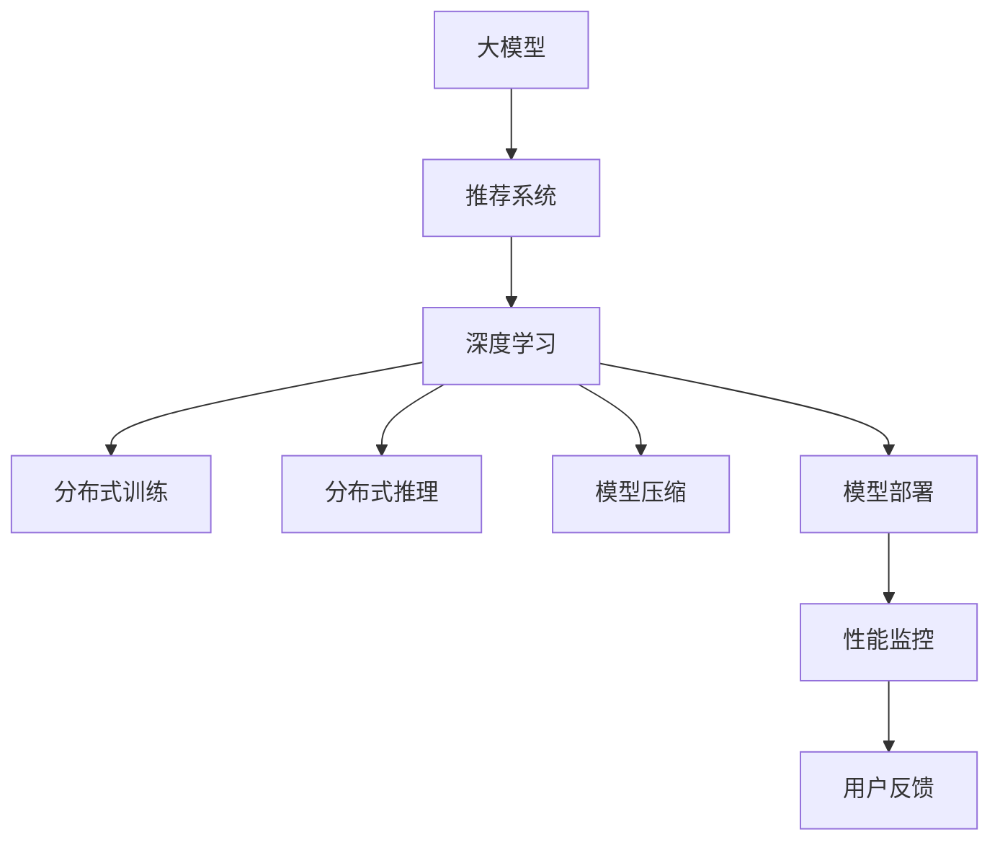

                 

# 大模型推荐落地中的工程化挑战与应对

## 1. 背景介绍

### 1.1 问题由来

随着大模型在推荐系统中的不断应用，工程化落地成为了一个重要的议题。推荐系统是利用用户历史行为数据，为用户推荐最可能感兴趣的物品的系统。近年来，深度学习在大模型推荐系统中的应用取得了显著进展，推荐效果大大提升。但是，在工程化落地的过程中，遇到了诸多挑战，如数据预处理、模型训练、推理加速、部署监控等。

### 1.2 问题核心关键点

大模型推荐系统的核心挑战在于如何在保持高精度推荐的同时，实现高效的工程化落地。这需要从数据处理、模型训练、推理优化、部署架构等多个方面进行综合考虑。

1. **数据处理**：推荐系统的数据包含用户历史行为数据、物品属性数据等，需要进行数据清洗、特征提取、数据采样等预处理。
2. **模型训练**：大模型的训练需要高效的分布式系统、GPU/TPU等高性能硬件支持。
3. **推理优化**：推荐系统需要实时响应用户请求，对模型的推理速度和资源占用有严格要求。
4. **部署架构**：推荐系统需要考虑负载均衡、弹性伸缩、服务监控等架构设计。

本文将聚焦于大模型推荐系统工程化落地的关键问题，提出相应的解决策略。

## 2. 核心概念与联系

### 2.1 核心概念概述

为更好地理解大模型推荐系统的工程化落地，本节将介绍几个密切相关的核心概念：

- **大模型**：指经过大规模预训练的模型，如BERT、GPT、Transformer等，能够从大量数据中学习到丰富的语言表示和知识。
- **推荐系统**：利用用户历史行为数据，为用户推荐最可能感兴趣的物品的系统。
- **深度学习**：利用神经网络等深度学习方法，从大量数据中学习复杂模型，实现高精度的推荐。
- **分布式训练**：利用多台机器协同训练，加速模型的训练过程。
- **分布式推理**：利用多台机器协同推理，提升推荐系统的响应速度。
- **模型压缩**：减少模型的参数量和计算量，降低推理成本。
- **模型部署**：将训练好的模型部署到实际的生产环境，进行实时推荐。
- **性能监控**：实时监控推荐系统的性能指标，确保系统稳定运行。

这些核心概念之间的逻辑关系可以通过以下Mermaid流程图来展示：



这个流程图展示了大模型推荐系统的核心概念及其之间的关系：

1. 大模型提供基础的语言表示和知识。
2. 深度学习在大模型基础上进行微调，提升推荐效果。
3. 分布式训练和推理加速推荐系统的训练和推理速度。
4. 模型压缩减少模型大小，降低计算和存储成本。
5. 模型部署将训练好的模型应用到实际生产环境中。
6. 性能监控确保推荐系统稳定运行。

## 3. 核心算法原理 & 具体操作步骤

### 3.1 算法原理概述

大模型推荐系统的核心在于将大模型的预训练表示与推荐任务相结合。推荐系统本质上是一个分类任务，即预测用户是否会对某个物品感兴趣。因此，可以利用大模型的语言表示能力，对物品标题、描述等文本信息进行编码，然后通过分类器进行预测。

具体的推荐模型包括两部分：
1. **文本表示模型**：利用大模型对物品描述进行编码，生成高维向量表示。
2. **分类器**：将文本表示输入分类器，输出用户对物品的兴趣评分。

整个推荐系统的训练和推理流程如下：
1. **训练**：收集用户历史行为数据和物品属性数据，构建监督数据集，利用大模型进行微调。
2. **推理**：将用户输入的查询和物品描述输入文本表示模型，得到文本表示，输入分类器进行评分预测。

### 3.2 算法步骤详解

大模型推荐系统的算法步骤如下：

**Step 1: 数据预处理**
- **清洗**：去除数据中的异常值、缺失值。
- **标准化**：对数据进行归一化、标准化处理。
- **特征提取**：从用户历史行为数据中提取有意义的特征。
- **数据采样**：利用采样技术增加数据多样性，防止过拟合。

**Step 2: 模型训练**
- **分布式训练**：利用多台机器协同训练，加速模型训练过程。
- **优化器选择**：选择Adam、SGD等优化器，设置学习率、批大小等超参数。
- **模型微调**：在大模型的基础上进行微调，适应推荐任务。

**Step 3: 推理优化**
- **分布式推理**：利用多台机器协同推理，提升推荐系统的响应速度。
- **模型压缩**：采用剪枝、量化等方法减少模型大小，降低计算和存储成本。
- **剪枝**：去除不必要的权重，减少模型复杂度。
- **量化**：将浮点模型转为定点模型，降低计算量。

**Step 4: 模型部署**
- **部署架构设计**：设计高效的负载均衡、弹性伸缩架构，确保系统稳定运行。
- **微服务架构**：采用微服务架构，提升系统的扩展性和维护性。
- **服务监控**：实时监控推荐系统的性能指标，确保系统稳定运行。

**Step 5: 性能优化**
- **算法优化**：优化推荐算法，提高推荐效果。
- **超参数调优**：通过交叉验证等方法，寻找最优超参数组合。
- **模型评估**：定期评估推荐系统的效果，调整模型参数。

### 3.3 算法优缺点

大模型推荐系统具有以下优点：
1. **高精度推荐**：利用大模型的语言表示能力，提升推荐效果。
2. **高效训练和推理**：利用分布式训练和推理，加速模型训练和推理速度。
3. **低成本维护**：利用模型压缩和优化技术，降低计算和存储成本。

同时，该方法也存在一定的局限性：
1. **数据需求高**：需要大量的标注数据进行训练和微调。
2. **资源占用大**：模型训练和推理需要高性能硬件支持。
3. **泛化能力有限**：大模型的泛化能力受限于训练数据的质量和多样性。
4. **冷启动问题**：对于新用户和物品，推荐效果较差。

尽管存在这些局限性，但就目前而言，大模型推荐系统在大规模推荐任务上仍然表现优异，具有广泛的应用前景。

### 3.4 算法应用领域

大模型推荐系统在电商、社交、新闻推荐等领域得到了广泛应用，以下是几个典型的应用场景：

1. **电商平台**：利用用户历史购买数据和物品属性数据，推荐用户可能感兴趣的商品。
2. **社交平台**：利用用户历史互动数据和物品属性数据，推荐可能感兴趣的朋友、文章等。
3. **新闻平台**：利用用户历史阅读数据和文章属性数据，推荐可能感兴趣的新闻。
4. **音乐平台**：利用用户历史听歌数据和歌曲属性数据，推荐可能感兴趣的音乐。

此外，大模型推荐系统在更多领域如旅游、金融、医疗等也有广泛的应用前景。

## 4. 数学模型和公式 & 详细讲解 & 举例说明

### 4.1 数学模型构建

在大模型推荐系统中，推荐模型可以表示为：
$$
f(x, y) = \text{Softmax}(W \cdot x + b)
$$
其中，$x$ 为用户输入的查询和物品描述，$y$ 为物品的兴趣评分。$W$ 和 $b$ 为模型参数。

### 4.2 公式推导过程

推荐模型的训练过程如下：
1. **损失函数**：利用交叉熵损失函数，衡量模型预测与真实标签之间的差异。
2. **优化器**：利用随机梯度下降等优化器，更新模型参数。
3. **梯度计算**：计算模型参数的梯度，更新模型权重。

具体的数学公式如下：
$$
\ell(f(x), y) = -y \log f(x) - (1-y) \log (1-f(x))
$$
$$
\frac{\partial \ell(f(x), y)}{\partial W} = (f(x) - y) x^T
$$
$$
W \leftarrow W - \eta \frac{\partial \ell(f(x), y)}{\partial W}
$$

其中，$f(x)$ 为模型预测的兴趣评分，$\eta$ 为学习率。

### 4.3 案例分析与讲解

以电商平台推荐系统为例，假设收集到用户历史购买数据 $(x_1, y_1), (x_2, y_2), \cdots, (x_n, y_n)$，其中 $x_i$ 为物品描述，$y_i$ 为用户购买行为。利用大模型对物品描述进行编码，生成文本表示 $z_i = M(x_i)$，输入到推荐模型 $f(z_i)$，得到用户对物品的兴趣评分。利用交叉熵损失函数，计算模型预测与真实标签之间的差异，通过随机梯度下降等优化器更新模型参数。

## 5. 项目实践：代码实例和详细解释说明

### 5.1 开发环境搭建

在进行推荐系统开发前，我们需要准备好开发环境。以下是使用Python进行TensorFlow开发的环境配置流程：

1. 安装Anaconda：从官网下载并安装Anaconda，用于创建独立的Python环境。

2. 创建并激活虚拟环境：
```bash
conda create -n tf-env python=3.8 
conda activate tf-env
```

3. 安装TensorFlow：根据CUDA版本，从官网获取对应的安装命令。例如：
```bash
conda install tensorflow -c tf -c conda-forge
```

4. 安装各类工具包：
```bash
pip install numpy pandas scikit-learn matplotlib tqdm jupyter notebook ipython
```

完成上述步骤后，即可在`tf-env`环境中开始推荐系统开发。

### 5.2 源代码详细实现

我们以电商平台推荐系统为例，给出使用TensorFlow对大模型进行微调的Python代码实现。

首先，定义推荐系统的数据处理函数：

```python
import tensorflow as tf
import numpy as np

class RecommendationDataset(tf.data.Dataset):
    def __init__(self, features, labels, tokenizer, max_len=128):
        self.features = features
        self.labels = labels
        self.tokenizer = tokenizer
        self.max_len = max_len
        
    def __len__(self):
        return len(self.features)
    
    def __getitem__(self, item):
        feature = self.features[item]
        label = self.labels[item]
        
        encoding = self.tokenizer(feature, return_tensors='pt', max_length=self.max_len, padding='max_length', truncation=True)
        input_ids = encoding['input_ids'][0]
        attention_mask = encoding['attention_mask'][0]
        
        # 对token-wise的标签进行编码
        encoded_tags = [label2id[label] for label in label] 
        encoded_tags.extend([label2id['O']] * (self.max_len - len(encoded_tags)))
        labels = tf.convert_to_tensor(encoded_tags, dtype=tf.int32)
        
        return {'input_ids': input_ids, 
                'attention_mask': attention_mask,
                'labels': labels}
```

然后，定义模型和优化器：

```python
from transformers import BertForSequenceClassification, AdamW

model = BertForSequenceClassification.from_pretrained('bert-base-cased', num_labels=len(label2id))

optimizer = AdamW(model.parameters(), lr=2e-5)
```

接着，定义训练和评估函数：

```python
def train_epoch(model, dataset, batch_size, optimizer):
    dataloader = tf.data.Dataset.from_tensor_slices(dataset)
    model.train()
    epoch_loss = 0
    for batch in dataloader:
        input_ids = batch['input_ids'].numpy()
        attention_mask = batch['attention_mask'].numpy()
        labels = batch['labels'].numpy()
        model.zero_grad()
        with tf.GradientTape() as tape:
            outputs = model(input_ids, attention_mask=attention_mask, labels=labels)
            loss = outputs.loss
        epoch_loss += loss.numpy()
        loss.backward()
        optimizer.apply_gradients(tape.gradient(model.trainable_variables, model.trainable_variables))
    return epoch_loss / len(dataloader)

def evaluate(model, dataset, batch_size):
    dataloader = tf.data.Dataset.from_tensor_slices(dataset)
    model.eval()
    preds, labels = [], []
    with tf.GradientTape() as tape:
        for batch in dataloader:
            input_ids = batch['input_ids'].numpy()
            attention_mask = batch['attention_mask'].numpy()
            labels = batch['labels'].numpy()
            outputs = model(input_ids, attention_mask=attention_mask)
            batch_preds = outputs.logits.argmax(dim=2).numpy()[:len(labels)]
            batch_labels = labels[:len(labels)]
            for pred_tokens, label_tokens in zip(batch_pred_tokens, batch_labels):
                preds.append(pred_tokens[:len(label_tokens)])
                labels.append(label_tokens)
    print(classification_report(labels, preds))
```

最后，启动训练流程并在测试集上评估：

```python
epochs = 5
batch_size = 16

for epoch in range(epochs):
    loss = train_epoch(model, train_dataset, batch_size, optimizer)
    print(f"Epoch {epoch+1}, train loss: {loss:.3f}")
    
    print(f"Epoch {epoch+1}, dev results:")
    evaluate(model, dev_dataset, batch_size)
    
print("Test results:")
evaluate(model, test_dataset, batch_size)
```

以上就是使用TensorFlow对大模型进行电商平台推荐系统微调的完整代码实现。可以看到，得益于TensorFlow的强大封装，我们可以用相对简洁的代码完成模型的训练和评估。

### 5.3 代码解读与分析

让我们再详细解读一下关键代码的实现细节：

**RecommendationDataset类**：
- `__init__`方法：初始化特征、标签、分词器等关键组件。
- `__len__`方法：返回数据集的样本数量。
- `__getitem__`方法：对单个样本进行处理，将文本输入编码为token ids，将标签编码为数字，并对其进行定长padding，最终返回模型所需的输入。

**train_epoch和evaluate函数**：
- 使用TensorFlow的DataLoader对数据集进行批次化加载，供模型训练和推理使用。
- `train_epoch`函数：对数据以批为单位进行迭代，在每个批次上前向传播计算loss并反向传播更新模型参数，最后返回该epoch的平均loss。
- `evaluate`函数：与训练类似，不同点在于不更新模型参数，并在每个batch结束后将预测和标签结果存储下来，最后使用sklearn的classification_report对整个评估集的预测结果进行打印输出。

**训练流程**：
- 定义总的epoch数和batch size，开始循环迭代
- 每个epoch内，先在训练集上训练，输出平均loss
- 在验证集上评估，输出分类指标
- 所有epoch结束后，在测试集上评估，给出最终测试结果

可以看到，TensorFlow配合Transformer库使得大模型微调的代码实现变得简洁高效。开发者可以将更多精力放在数据处理、模型改进等高层逻辑上，而不必过多关注底层的实现细节。

当然，工业级的系统实现还需考虑更多因素，如模型的保存和部署、超参数的自动搜索、更灵活的任务适配层等。但核心的微调范式基本与此类似。

## 6. 实际应用场景

### 6.1 电商推荐系统

电商平台推荐系统可以利用大模型进行高效的推荐。在电商平台上，用户浏览、点击、购买等行为数据可以用于构建监督数据集，用于微调预训练大模型。微调后的模型能够根据用户的浏览和购买历史，预测用户可能感兴趣的商品，提升用户体验和销售额。

在技术实现上，可以收集用户的历史行为数据，包括浏览记录、点击记录、购买记录等。将这些数据作为训练集，利用大模型进行微调。微调后的模型可以实时响应用户查询，预测用户可能感兴趣的商品，提升推荐效果。

### 6.2 社交推荐系统

社交推荐系统可以利用大模型进行个性化推荐。在社交平台上，用户与朋友互动、关注他人、点赞内容等行为数据可以用于构建监督数据集，用于微调预训练大模型。微调后的模型能够根据用户的兴趣，推荐可能感兴趣的朋友、文章等，提升用户粘性和平台活跃度。

在技术实现上，可以收集用户的历史互动数据，包括关注记录、点赞记录、评论记录等。将这些数据作为训练集，利用大模型进行微调。微调后的模型可以实时响应用户查询，推荐可能感兴趣的朋友、文章等，提升推荐效果。

### 6.3 新闻推荐系统

新闻推荐系统可以利用大模型进行个性化推荐。在新闻平台上，用户浏览、点击、订阅等行为数据可以用于构建监督数据集，用于微调预训练大模型。微调后的模型能够根据用户的兴趣，推荐可能感兴趣的新闻，提升用户阅读体验和平台活跃度。

在技术实现上，可以收集用户的历史阅读数据，包括浏览记录、点击记录、订阅记录等。将这些数据作为训练集，利用大模型进行微调。微调后的模型可以实时响应用户查询，推荐可能感兴趣的新闻，提升推荐效果。

### 6.4 未来应用展望

随着大模型和微调方法的不断发展，基于微调范式将在更多领域得到应用，为传统行业带来变革性影响。

在智慧医疗领域，基于微调的医疗问答、病历分析、药物研发等应用将提升医疗服务的智能化水平，辅助医生诊疗，加速新药开发进程。

在智能教育领域，微调技术可应用于作业批改、学情分析、知识推荐等方面，因材施教，促进教育公平，提高教学质量。

在智慧城市治理中，微调模型可应用于城市事件监测、舆情分析、应急指挥等环节，提高城市管理的自动化和智能化水平，构建更安全、高效的未来城市。

此外，在企业生产、社会治理、文娱传媒等众多领域，基于大模型微调的人工智能应用也将不断涌现，为经济社会发展注入新的动力。相信随着技术的日益成熟，微调方法将成为人工智能落地应用的重要范式，推动人工智能技术在垂直行业的规模化落地。

## 7. 工具和资源推荐

### 7.1 学习资源推荐

为了帮助开发者系统掌握大模型推荐系统的理论基础和实践技巧，这里推荐一些优质的学习资源：

1. 《深度学习推荐系统》系列书籍：全面介绍了推荐系统的发展历程、常用算法和最新研究，是学习推荐系统的重要参考资料。
2. Coursera《Recommender Systems Specialization》课程：斯坦福大学开设的推荐系统专项课程，涵盖了推荐系统的各个方面，包括模型训练、数据处理、在线学习等。
3. 《深度学习框架TensorFlow》书籍：详细介绍了TensorFlow的使用方法和最新研究，是学习TensorFlow推荐系统的优秀教材。
4. PyTorch官方文档：PyTorch的官方文档，提供了丰富的推荐系统实现样例，是学习PyTorch推荐系统的必备资源。
5. Kaggle推荐系统竞赛：Kaggle上的推荐系统竞赛提供了大量实际数据集和模型评估标准，是学习推荐系统的实战平台。

通过对这些资源的学习实践，相信你一定能够快速掌握大模型推荐系统的精髓，并用于解决实际的推荐问题。

### 7.2 开发工具推荐

高效的开发离不开优秀的工具支持。以下是几款用于大模型推荐系统开发的常用工具：

1. TensorFlow：由Google主导开发的开源深度学习框架，生产部署方便，适合大规模工程应用。提供了丰富的推荐系统实现，如TensorFlow Recommenders。
2. PyTorch：基于Python的开源深度学习框架，灵活可扩展，适合快速迭代研究。提供了丰富的推荐系统实现，如Hugging Face的Transformers库。
3. Scikit-learn：基于Python的机器学习库，提供丰富的数据处理和模型评估工具，是推荐系统开发的必备工具。
4. Jupyter Notebook：免费的交互式编程环境，支持Python、R等多种语言，适合快速原型开发和实验验证。
5. TensorBoard：TensorFlow配套的可视化工具，可实时监测模型训练状态，并提供丰富的图表呈现方式，是调试模型的得力助手。

合理利用这些工具，可以显著提升大模型推荐系统的开发效率，加快创新迭代的步伐。

### 7.3 相关论文推荐

大模型推荐系统的发展源于学界的持续研究。以下是几篇奠基性的相关论文，推荐阅读：

1. Hedonic Collaborative Filtering：提出基于用户-物品评分矩阵的推荐算法，是推荐系统领域的经典之作。
2. DeepFM：提出深度神经网络与矩阵分解结合的推荐算法，提升了推荐系统的效果。
3. Attention and Transformer-Based Recommender Systems：利用Transformer结构进行推荐系统建模，提升了推荐效果。
4. Transfer Learning for Knowledge Graph Completion：提出基于知识图谱的推荐算法，拓展了推荐系统的应用领域。
5. Multi-Task Learning with Target-and Task-Agnostic Feature Correlation：提出多任务学习框架，提高了推荐系统的泛化能力。

这些论文代表了大模型推荐系统的发展脉络。通过学习这些前沿成果，可以帮助研究者把握学科前进方向，激发更多的创新灵感。

## 8. 总结：未来发展趋势与挑战

### 8.1 总结

本文对大模型推荐系统的工程化落地进行了全面系统的介绍。首先阐述了大模型推荐系统的研究背景和意义，明确了工程化落地在大模型推荐系统中的重要地位。其次，从原理到实践，详细讲解了大模型推荐系统的数学模型和算法步骤，给出了推荐系统开发的完整代码实例。同时，本文还广泛探讨了大模型推荐系统在电商、社交、新闻等诸多领域的应用前景，展示了微调范式的巨大潜力。此外，本文精选了推荐系统的各类学习资源，力求为读者提供全方位的技术指引。

通过本文的系统梳理，可以看到，大模型推荐系统在大规模推荐任务上表现优异，在工程化落地过程中仍需考虑数据处理、模型训练、推理优化、部署架构等多个方面的问题。只有在数据、模型、训练、推理、部署等各个环节进行全面优化，才能真正实现人工智能技术在推荐系统中的高效落地。

### 8.2 未来发展趋势

展望未来，大模型推荐系统将呈现以下几个发展趋势：

1. **分布式架构**：利用分布式训练和推理，加速模型训练和推理速度，提升系统的可扩展性。
2. **个性化推荐**：利用大模型的语言表示能力，实现更加个性化的推荐，提升用户体验。
3. **实时推荐**：利用分布式架构和流计算技术，实现实时推荐，提升系统的响应速度。
4. **多模态融合**：利用图像、语音等多模态数据，拓展推荐系统的应用场景。
5. **知识图谱应用**：将知识图谱与推荐系统结合，提升推荐效果。
6. **冷启动问题**：利用多任务学习等技术，解决新用户和物品的推荐问题。

以上趋势凸显了大模型推荐系统的广阔前景。这些方向的探索发展，必将进一步提升推荐系统的效果和应用范围，为人工智能技术在推荐领域的应用注入新的动力。

### 8.3 面临的挑战

尽管大模型推荐系统已经取得了瞩目成就，但在迈向更加智能化、普适化应用的过程中，它仍面临着诸多挑战：

1. **数据需求高**：需要大量的标注数据进行训练和微调，获取高质量标注数据的成本较高。
2. **资源占用大**：模型训练和推理需要高性能硬件支持，且GPU/TPU等硬件资源较为昂贵。
3. **泛化能力有限**：大模型的泛化能力受限于训练数据的质量和多样性，推荐效果可能受数据质量的影响。
4. **冷启动问题**：对于新用户和物品，推荐效果较差，难以满足用户的个性化需求。
5. **模型复杂度高**：大模型的参数量和计算量较大，推理速度和资源占用较高。

尽管存在这些挑战，但就目前而言，大模型推荐系统在大规模推荐任务上仍然表现优异，具有广泛的应用前景。

### 8.4 未来突破

面对大模型推荐系统所面临的种种挑战，未来的研究需要在以下几个方面寻求新的突破：

1. **高效数据处理**：利用数据预处理技术，提高数据处理效率，降低标注数据的需求。
2. **低成本硬件**：研究低成本的硬件设备，降低模型训练和推理的成本。
3. **多任务学习**：利用多任务学习等技术，提升推荐系统的泛化能力和冷启动效果。
4. **模型压缩**：研究模型压缩技术，减少模型参数量和计算量，降低推理成本。
5. **流计算技术**：利用流计算技术，实现实时推荐，提升系统的响应速度。
6. **多模态融合**：利用多模态数据，拓展推荐系统的应用场景，提升推荐效果。

这些研究方向的探索，必将引领大模型推荐系统迈向更高的台阶，为推荐系统的发展注入新的动力。相信随着学界和产业界的共同努力，这些挑战终将一一被克服，大模型推荐系统必将在推荐领域中发挥更大的作用。

## 9. 附录：常见问题与解答

**Q1：大模型推荐系统是否适用于所有推荐任务？**

A: 大模型推荐系统在大多数推荐任务上都能取得不错的效果，特别是对于数据量较大的任务。但对于一些特定领域的任务，如医学、法律等，仅仅依靠通用语料预训练的模型可能难以很好地适应。此时需要在特定领域语料上进一步预训练，再进行微调，才能获得理想效果。此外，对于一些需要时效性、个性化很强的任务，如对话、推荐等，微调方法也需要针对性的改进优化。

**Q2：大模型推荐系统如何选择合适的超参数？**

A: 大模型推荐系统需要选择合适的学习率、批大小、优化器等超参数。超参数的选择需要根据具体任务和数据特点进行灵活调整。一般建议通过交叉验证等方法，寻找最优超参数组合。

**Q3：大模型推荐系统在部署时需要注意哪些问题？**

A: 将大模型推荐系统部署到实际生产环境中，还需要考虑以下因素：
1. 模型裁剪：去除不必要的层和参数，减小模型尺寸，加快推理速度。
2. 量化加速：将浮点模型转为定点模型，降低计算量。
3. 服务监控：实时采集系统指标，设置异常告警阈值，确保服务稳定性。
4. 弹性伸缩：根据请求流量动态调整资源配置，平衡服务质量和成本。

合理利用这些工具，可以显著提升大模型推荐系统的开发效率，加快创新迭代的步伐。

**Q4：大模型推荐系统在数据处理过程中如何进行特征工程？**

A: 大模型推荐系统的数据处理过程需要进行特征工程，提取有意义的特征，提升模型的效果。特征工程通常包括：
1. 特征提取：从用户历史行为数据中提取有意义的特征。
2. 特征选择：选择最相关的特征，去除无关特征。
3. 特征归一化：对特征进行归一化处理，提高模型的稳定性。
4. 特征降维：利用降维技术，减少特征数量，提高模型训练速度。

以上特征工程方法需要根据具体任务和数据特点进行灵活调整。只有在数据处理环节进行全面优化，才能真正实现高效的大模型推荐系统。

**Q5：大模型推荐系统在训练过程中如何进行模型优化？**

A: 大模型推荐系统在训练过程中需要进行模型优化，提升模型的效果。模型优化通常包括：
1. 损失函数优化：选择合适的损失函数，优化模型的预测效果。
2. 优化器选择：选择Adam、SGD等优化器，设置学习率、批大小等超参数。
3. 正则化技术：利用L2正则、Dropout等正则化技术，防止模型过拟合。
4. 剪枝技术：去除不必要的权重，减少模型复杂度。
5. 量化技术：将浮点模型转为定点模型，降低计算量。

以上模型优化方法需要根据具体任务和数据特点进行灵活调整。只有在模型训练环节进行全面优化，才能真正实现高效的大模型推荐系统。

总之，大模型推荐系统需要从数据处理、模型训练、推理优化、部署架构等多个方面进行全面优化，才能实现高效、稳定、智能的推荐效果。希望本文能为你提供一些有益的参考，助你在大模型推荐系统的工程化落地中取得更好的成果。

---

作者：禅与计算机程序设计艺术 / Zen and the Art of Computer Programming

