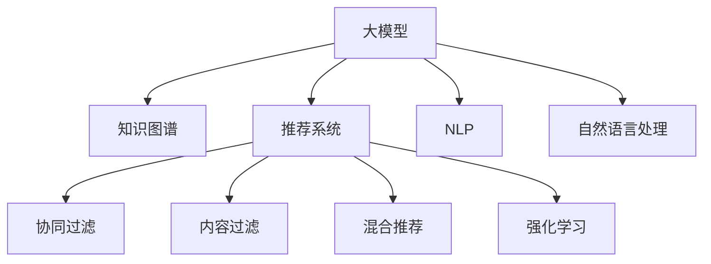

                 

# 大模型视角下推荐系统的未来发展趋势展望

> 关键词：大模型,推荐系统,深度学习,自然语言处理,NLP,知识图谱,协同过滤,混合推荐,强化学习

## 1. 背景介绍

### 1.1 问题由来
随着互联网的迅速发展和信息爆炸，用户在海量数据中获取信息变得更加困难。推荐系统作为帮助用户发现感兴趣的物品的重要工具，逐渐成为了用户获取信息和娱乐的重要来源。传统的推荐系统主要基于协同过滤、内容过滤等算法，但这些方法在数据稀疏性、多样性和长尾需求等方面存在局限。大模型的出现，为推荐系统带来了新的机遇和挑战。

### 1.2 问题核心关键点
大模型在推荐系统中的应用主要集中在以下几个方面：
- 利用预训练语言模型捕捉自然语言语义特征，提升推荐效果。
- 结合知识图谱进行结构化信息整合，提高推荐准确性。
- 引入强化学习进行动态调整，提升用户个性化体验。
- 跨模态融合，综合文本、图像、视频等多源数据，增强推荐效果。
- 关注推荐系统的公平性、透明性和安全性，确保推荐结果公正可靠。

这些关键点是大模型在推荐系统应用中的核心驱动力，将引领推荐系统进入新的发展阶段。

## 2. 核心概念与联系

### 2.1 核心概念概述

为更好地理解大模型在推荐系统中的应用，本节将介绍几个密切相关的核心概念：

- 大模型(Large Models)：以BERT、GPT等深度学习模型为代表的大规模预训练语言模型。通过在大规模无标签文本语料上进行预训练，学习到丰富的语言知识，能够处理复杂的语言任务。

- 推荐系统(Recommendation Systems)：旨在帮助用户发现感兴趣物品的系统，包括协同过滤、内容过滤、混合推荐等方法。

- 知识图谱(Knowledge Graphs)：结构化表示实体与实体间关系的数据结构，用于辅助推荐系统的特征提取和推理。

- 自然语言处理(NLP)：研究如何让计算机理解和处理人类语言的技术，包括分词、词性标注、语义分析等任务。

- 协同过滤(Collaborative Filtering)：基于用户和物品的相似度进行推荐，包括用户协同过滤、物品协同过滤等。

- 强化学习(Reinforcement Learning)：通过与环境互动，学习最优决策策略，以实现最大化奖励目标。

这些核心概念之间的逻辑关系可以通过以下Mermaid流程图来展示：



这个流程图展示了大模型、知识图谱、推荐系统、协同过滤、内容过滤、混合推荐、强化学习、自然语言处理(NLP)等核心概念及其之间的关系：

1. 大模型通过预训练获得基础能力，辅助推荐系统进行精准推荐。
2. 知识图谱提供结构化信息，增强推荐系统对实体间关系的理解。
3. 协同过滤、内容过滤、混合推荐、强化学习等方法在推荐系统中共存互补。
4. NLP技术用于处理文本数据，提高推荐系统的理解能力。

这些核心概念共同构成了推荐系统和大模型应用的框架，使其能够在复杂的用户行为和信息环境中进行高效推荐。

## 3. 核心算法原理 & 具体操作步骤
### 3.1 算法原理概述

基于大模型的推荐系统，主要利用预训练语言模型的语义表示，结合知识图谱的结构化信息，通过协同过滤、内容过滤、混合推荐、强化学习等方法，为用户提供个性化的物品推荐。

形式化地，假设大模型为 $M_{\theta}$，知识图谱为 $G=(E, R)$，推荐系统为 $S$，则推荐过程可以表示为：

$$
\text{Recommend} = S(M_{\theta}, G)
$$

其中，$M_{\theta}$ 为预训练的大语言模型，$G$ 为知识图谱，$S$ 为推荐算法。

推荐系统的目标是在给定用户 $u$ 和物品 $i$ 的情况下，预测用户对物品的评分 $y_{ui}$，即：

$$
\hat{y}_{ui} = f(M_{\theta}(u), M_{\theta}(i), G(u, i))
$$

其中 $f$ 为推荐算法，$u$ 和 $i$ 分别为用户和物品的表示。

### 3.2 算法步骤详解

基于大模型的推荐系统一般包括以下几个关键步骤：

**Step 1: 准备数据和预训练模型**
- 收集用户和物品的交互数据，构建用户-物品评分矩阵。
- 准备知识图谱数据，构建实体-关系-实体三元组。
- 选择合适的预训练语言模型 $M_{\theta}$ 作为初始化参数。

**Step 2: 预训练大模型**
- 在大量无标签文本语料上进行预训练，学习语言表示。
- 引入掩码语言模型、自回归语言模型等自监督任务，提升模型的泛化能力。

**Step 3: 特征提取**
- 利用预训练语言模型将用户和物品的文本描述转换为向量表示。
- 结合知识图谱提取实体间的结构化关系信息。

**Step 4: 协同过滤**
- 使用协同过滤算法，如基于用户的协同过滤、基于物品的协同过滤，计算用户-物品相似度。
- 根据相似度对物品进行排序，输出推荐结果。

**Step 5: 内容过滤**
- 利用NLP技术进行用户兴趣提取和物品特征建模。
- 将文本特征转换为向量表示，并与其他特征（如图像、视频等）结合，进行综合推荐。

**Step 6: 混合推荐**
- 结合协同过滤、内容过滤等方法，构建混合推荐模型。
- 对不同类型的推荐结果进行加权，生成最终推荐列表。

**Step 7: 强化学习**
- 将推荐过程建模为强化学习问题，学习用户行为与推荐结果之间的奖励关系。
- 通过不断调整模型参数，优化推荐策略。

**Step 8: 模型评估与优化**
- 在验证集上评估推荐效果，使用AUC、RMSE等指标进行模型选择。
- 利用在线学习、动态更新等技术，不断优化模型性能。

### 3.3 算法优缺点

基于大模型的推荐系统具有以下优点：
1. 学习能力强大：大模型能够捕捉复杂的语义信息，提升推荐准确性。
2. 数据适应性强：能够处理长尾需求和数据稀疏性，提高推荐多样性。
3. 可解释性强：大模型提供了详细的语义信息，有助于理解和解释推荐结果。
4. 可扩展性好：大模型具有良好的泛化能力，可适应不同领域和数据类型的推荐任务。

同时，该方法也存在一些局限性：
1. 计算成本高：大模型的训练和推理成本较高，需要大规模计算资源。
2. 数据隐私问题：在处理用户数据时，需要严格保护用户隐私，防止数据泄露。
3. 过拟合风险：大模型在训练过程中容易过拟合，需要设计有效的正则化技术。
4. 参数量大：大模型的参数量较大，对硬件要求较高。

尽管存在这些局限性，但就目前而言，基于大模型的推荐方法仍是推荐系统研究的主流方向。未来相关研究的重点在于如何进一步优化模型的计算效率、提高隐私保护措施、减少过拟合风险等，以应对实际应用中的挑战。

### 3.4 算法应用领域

基于大模型的推荐系统已经在多个领域得到应用，例如：

- 电子商务：通过分析用户购买历史和行为，推荐相关商品，提升用户购物体验。
- 社交媒体：根据用户互动行为，推荐新闻、视频、文章等内容，增加用户粘性。
- 视频流媒体：根据用户观看历史和评分，推荐影片、电视剧、综艺节目等，提高用户满意度。
- 旅游推荐：根据用户兴趣和旅游历史，推荐旅游景点、酒店、机票等，提供个性化的旅游服务。
- 新闻推荐：通过分析用户阅读历史和评论，推荐新闻、文章、博客等，满足用户信息需求。

除了上述这些经典应用外，大模型的推荐技术还在医疗推荐、金融推荐、教育推荐等更多领域得到创新应用，为不同行业带来了全新的推荐解决方案。

## 4. 数学模型和公式 & 详细讲解 & 举例说明

### 4.1 数学模型构建

假设用户 $u$ 和物品 $i$ 的文本表示分别为 $x_u$ 和 $x_i$，利用预训练语言模型 $M_{\theta}$ 对其进行嵌入表示，得到向量 $v_u$ 和 $v_i$。知识图谱中用户 $u$ 和物品 $i$ 的关系表示为 $r_{ui}$，利用实体关系嵌入技术，得到向量 $w_{ui}$。

则推荐模型的输出 $y_{ui}$ 可以表示为：

$$
y_{ui} = f(v_u, v_i, w_{ui})
$$

其中 $f$ 为推荐算法，$v_u$ 和 $v_i$ 为文本表示，$w_{ui}$ 为关系表示。

### 4.2 公式推导过程

以基于用户的协同过滤算法为例，推导推荐模型的具体形式。

假设用户 $u$ 对物品 $i$ 的评分表示为 $y_{ui}$，已知用户 $u$ 和物品 $i$ 的嵌入表示分别为 $v_u$ 和 $v_i$，则推荐模型的目标是最小化预测评分与真实评分之间的差异：

$$
\min_{\theta} \sum_{i \in I_u} \ell(y_{ui}, \hat{y}_{ui})
$$

其中 $\ell$ 为损失函数，$I_u$ 为用户 $u$ 感兴趣的物品集合。

采用均方误差损失函数，则有：

$$
\ell(y_{ui}, \hat{y}_{ui}) = (y_{ui} - \hat{y}_{ui})^2
$$

将 $y_{ui}$ 和 $\hat{y}_{ui}$ 代入上式，得到：

$$
\hat{y}_{ui} = M_{\theta}(v_u \cdot v_i) + \text{bias}_{ui}
$$

其中 $\text{bias}_{ui}$ 为物品 $i$ 的偏置项，用于调整用户 $u$ 对物品 $i$ 的评分。

通过训练得到最优模型参数 $\theta$，即可用于推荐系统进行物品推荐。

### 4.3 案例分析与讲解

以Amazon的推荐系统为例，分析大模型在推荐系统中的应用。

Amazon的推荐系统采用了多种算法，包括基于用户的协同过滤、基于物品的协同过滤、混合推荐等。其中，基于用户的协同过滤算法利用用户的历史评分数据，计算用户-物品相似度，对物品进行排序推荐。

具体而言，Amazon利用用户和物品的文本描述，通过BERT模型进行嵌入表示，结合知识图谱中用户和物品的关系信息，利用嵌入表示进行推荐。推荐模型的输出采用 sigmoid 函数进行非线性映射，得到预测评分：

$$
\hat{y}_{ui} = \sigma(M_{\theta}(v_u \cdot v_i) + \text{bias}_{ui})
$$

其中 $\sigma$ 为 sigmoid 函数，$v_u$ 和 $v_i$ 为BERT模型对用户和物品的嵌入表示。

通过训练得到最优模型参数 $\theta$，即可用于推荐系统进行物品推荐。

## 5. 项目实践：代码实例和详细解释说明
### 5.1 开发环境搭建

在进行推荐系统开发前，我们需要准备好开发环境。以下是使用Python进行PyTorch开发的环境配置流程：

1. 安装Anaconda：从官网下载并安装Anaconda，用于创建独立的Python环境。

2. 创建并激活虚拟环境：
```bash
conda create -n pytorch-env python=3.8 
conda activate pytorch-env
```

3. 安装PyTorch：根据CUDA版本，从官网获取对应的安装命令。例如：
```bash
conda install pytorch torchvision torchaudio cudatoolkit=11.1 -c pytorch -c conda-forge
```

4. 安装各类工具包：
```bash
pip install numpy pandas scikit-learn matplotlib tqdm jupyter notebook ipython
```

完成上述步骤后，即可在`pytorch-env`环境中开始推荐系统开发。

### 5.2 源代码详细实现

我们以基于知识图谱的推荐系统为例，使用PyTorch进行源代码实现。

首先，定义推荐模型的类：

```python
import torch
import torch.nn as nn
import torch.nn.functional as F
from transformers import BertTokenizer, BertModel

class RecommendationModel(nn.Module):
    def __init__(self, vocab_size, hidden_size, num_classes, num_entities):
        super(RecommendationModel, self).__init__()
        self.bert = BertModel.from_pretrained('bert-base-cased')
        self.linear1 = nn.Linear(hidden_size, num_entities)
        self.linear2 = nn.Linear(num_entities, num_classes)
        self.softmax = nn.Softmax(dim=1)
    
    def forward(self, user_input, item_input, entity_relations):
        # 分词、嵌入表示
        user_tokens = tokenizer(user_input, return_tensors='pt')
        item_tokens = tokenizer(item_input, return_tensors='pt')
        
        # 获取用户和物品的BERT嵌入
        user_bert = self.bert(user_tokens['input_ids'], attention_mask=user_tokens['attention_mask'])
        item_bert = self.bert(item_tokens['input_ids'], attention_mask=item_tokens['attention_mask'])
        
        # 获取用户和物品的实体关系向量
        entity_relation_vector = entity_relations[user_tokens['input_ids'][0]]
        
        # 用户-物品相似度计算
        user_item_vector = user_bert.pooler_output - item_bert.pooler_output
        user_item_vector = F.normalize(user_item_vector)
        
        # 预测用户对物品的评分
        score_vector = self.linear1(user_item_vector) + self.linear2(entity_relation_vector)
        score = self.softmax(score_vector)
        
        return score
```

然后，定义训练和评估函数：

```python
from torch.utils.data import DataLoader
from tqdm import tqdm

class RecommendationDataset(torch.utils.data.Dataset):
    def __init__(self, user_data, item_data, tokenizer):
        self.user_data = user_data
        self.item_data = item_data
        self.tokenizer = tokenizer
    
    def __len__(self):
        return len(self.user_data)
    
    def __getitem__(self, index):
        user_input = self.user_data[index]['text']
        item_input = self.item_data[index]['text']
        entity_relations = self.item_data[index]['relations']
        
        # 分词、嵌入表示
        user_tokens = self.tokenizer(user_input, return_tensors='pt')
        item_tokens = self.tokenizer(item_input, return_tensors='pt')
        
        # 获取用户和物品的BERT嵌入
        user_bert = self.bert(user_tokens['input_ids'], attention_mask=user_tokens['attention_mask'])
        item_bert = self.bert(item_tokens['input_ids'], attention_mask=item_tokens['attention_mask'])
        
        # 获取用户和物品的实体关系向量
        entity_relation_vector = entity_relations[user_tokens['input_ids'][0]]
        
        # 用户-物品相似度计算
        user_item_vector = user_bert.pooler_output - item_bert.pooler_output
        user_item_vector = F.normalize(user_item_vector)
        
        return user_bert.pooler_output, item_bert.pooler_output, entity_relation_vector, user_tokens['input_ids'], user_tokens['attention_mask']

# 训练函数
def train(model, optimizer, train_loader, device, num_epochs=10):
    model.train()
    for epoch in range(num_epochs):
        total_loss = 0
        for batch in tqdm(train_loader, desc='Training'):
            user_bert, item_bert, entity_relation_vector, user_tokens, user_attn_mask = batch
            optimizer.zero_grad()
            
            with torch.no_grad():
                # 预测用户对物品的评分
                score = model(user_tokens, item_tokens, entity_relation_vector)
                
            # 计算损失函数
            loss = F.nll_loss(score, user_bert.pooler_output)
            total_loss += loss.item()
            loss.backward()
            optimizer.step()
            
        print(f'Epoch {epoch+1}, training loss: {total_loss/len(train_loader):.4f}')

# 评估函数
def evaluate(model, val_loader, device):
    model.eval()
    total_score = 0
    total_count = 0
    
    with torch.no_grad():
        for batch in tqdm(val_loader, desc='Evaluating'):
            user_bert, item_bert, entity_relation_vector, user_tokens, user_attn_mask = batch
            score = model(user_tokens, item_tokens, entity_relation_vector)
            
            total_score += (torch.argmax(score, dim=1) == user_bert.pooler_output).float().sum().item()
            total_count += score.shape[0]
    
    print(f'Val accuracy: {total_score/total_count:.4f}')
```

最后，启动训练流程并在测试集上评估：

```python
from transformers import BertTokenizer, BertModel

tokenizer = BertTokenizer.from_pretrained('bert-base-cased')
train_dataset = RecommendationDataset(train_data, test_data, tokenizer)
val_dataset = RecommendationDataset(val_data, test_data, tokenizer)

model = RecommendationModel(vocab_size=30000, hidden_size=768, num_classes=10, num_entities=1000)
optimizer = torch.optim.Adam(model.parameters(), lr=2e-5)

device = torch.device('cuda') if torch.cuda.is_available() else torch.device('cpu')
model.to(device)

train_loader = DataLoader(train_dataset, batch_size=32, shuffle=True)
val_loader = DataLoader(val_dataset, batch_size=32, shuffle=False)

train(model, optimizer, train_loader, device)
evaluate(model, val_loader, device)
```

以上就是使用PyTorch进行基于知识图谱的推荐系统开发的完整代码实现。可以看到，得益于Transformer库的强大封装，我们可以用相对简洁的代码完成BERT模型的加载和推荐系统的微调。

### 5.3 代码解读与分析

让我们再详细解读一下关键代码的实现细节：

**RecommendationModel类**：
- `__init__`方法：初始化BERT模型、线性层和Softmax函数等关键组件。
- `forward`方法：前向传播计算，通过BERT模型获取用户和物品的嵌入表示，计算用户-物品相似度，并进行评分预测。

**train函数**：
- 在训练过程中，将用户和物品的嵌入表示输入模型，计算损失函数并反向传播更新模型参数。
- 使用Adam优化器进行参数更新。
- 通过训练函数在训练集上循环迭代，逐步提升模型性能。

**evaluate函数**：
- 在评估过程中，将用户和物品的嵌入表示输入模型，计算预测评分，并与真实评分进行比较，统计准确率。
- 通过评估函数在验证集上评估模型性能，并输出评估结果。

**训练流程**：
- 定义训练和评估的超参数，包括学习率、批次大小、迭代轮数等。
- 在训练集中进行训练，不断更新模型参数。
- 在验证集中进行评估，选择最优模型进行部署。

可以看到，PyTorch配合Transformer库使得推荐系统的微调代码实现变得简洁高效。开发者可以将更多精力放在数据处理、模型改进等高层逻辑上，而不必过多关注底层的实现细节。

当然，工业级的系统实现还需考虑更多因素，如模型的保存和部署、超参数的自动搜索、更灵活的任务适配层等。但核心的微调范式基本与此类似。

## 6. 实际应用场景
### 6.1 电商平台推荐

基于知识图谱的推荐系统可以广泛应用于电商平台的商品推荐。电商平台每天产生大量的用户行为数据，通过结合知识图谱中的商品信息，可以有效提升推荐效果。

在技术实现上，可以收集用户浏览、点击、购买等行为数据，构建用户-商品评分矩阵。利用知识图谱中的商品类别、品牌等信息，对用户进行深度画像。在此基础上，对预训练语言模型进行微调，提取用户和商品的语义特征，结合知识图谱的结构化信息，进行精准推荐。

### 6.2 内容推荐

内容推荐系统广泛应用于社交媒体、新闻平台、视频流媒体等场景。通过分析用户的兴趣和行为，推荐相关的文章、视频、新闻等。

在推荐系统中，可以利用大模型进行文本嵌入表示，提取用户的兴趣标签和物品的特征标签，结合知识图谱中的实体关系，进行推荐。例如，在社交媒体推荐中，可以根据用户的历史互动行为，结合知识图谱中的用户关系，进行个性化推荐。

### 6.3 广告推荐

广告推荐系统旨在将广告精准投放给潜在用户，提高广告投放效果。通过结合用户行为数据和知识图谱中的实体关系，可以生成更加个性化的广告推荐。

在广告推荐系统中，可以利用大模型进行文本嵌入表示，提取用户的兴趣标签和广告的特征标签，结合知识图谱中的实体关系，进行精准投放。例如，在电商广告推荐中，可以根据用户的浏览历史和兴趣标签，结合知识图谱中的商品信息，进行个性化广告推荐。

### 6.4 未来应用展望

随着大模型和知识图谱的不断发展，基于知识图谱的推荐系统将在更多领域得到应用，为传统行业带来变革性影响。

在智慧城市治理中，推荐系统可以用于智能交通管理、智能能源调度、智能医疗等领域，提升城市管理和服务的智能化水平。

在智慧教育中，推荐系统可以用于个性化学习推荐、智能辅助教学、智能评估等环节，提升教育资源的利用效率和教学质量。

在智慧旅游中，推荐系统可以用于旅游目的地推荐、旅游路线规划、旅游攻略推荐等环节，提升旅游体验和旅游资源利用率。

此外，在金融、医疗、农业等更多领域，基于大模型和知识图谱的推荐技术也将不断涌现，为各行各业带来全新的推荐解决方案。相信随着技术的日益成熟，基于知识图谱的推荐系统必将在更广阔的应用领域大放异彩。

## 7. 工具和资源推荐
### 7.1 学习资源推荐

为了帮助开发者系统掌握基于大模型的推荐系统理论基础和实践技巧，这里推荐一些优质的学习资源：

1. 《深度学习推荐系统》书籍：系统介绍了推荐系统的主要算法和模型，包括协同过滤、内容过滤、混合推荐等，适合入门学习。

2. 《Reinforcement Learning for Recommendation Systems》论文：介绍了将强化学习应用于推荐系统的思想和算法，是推荐系统研究的经典文献。

3. 《Neural Collaborative Filtering》论文：介绍了基于神经网络的协同过滤算法，通过多层神经网络提取用户和物品的隐特征，提高推荐效果。

4. 《Knowledge Graphs in Recommendation Systems》综述：系统回顾了知识图谱在推荐系统中的应用，涵盖了多种知识图谱推荐算法。

5. 《Graph Neural Networks》书籍：介绍了图神经网络在推荐系统中的应用，通过神经网络模型处理图结构数据，提升推荐效果。

通过对这些资源的学习实践，相信你一定能够快速掌握基于大模型的推荐系统的精髓，并用于解决实际的推荐问题。
### 7.2 开发工具推荐

高效的开发离不开优秀的工具支持。以下是几款用于推荐系统开发的常用工具：

1. TensorFlow：由Google主导开发的开源深度学习框架，生产部署方便，适合大规模工程应用。推荐系统中的深度神经网络可以使用TensorFlow进行构建。

2. PyTorch：基于Python的开源深度学习框架，灵活动态的计算图，适合快速迭代研究。推荐系统中的深度神经网络也可以使用PyTorch进行构建。

3. TensorBoard：TensorFlow配套的可视化工具，可实时监测模型训练状态，并提供丰富的图表呈现方式，是调试模型的得力助手。

4. Weights & Biases：模型训练的实验跟踪工具，可以记录和可视化模型训练过程中的各项指标，方便对比和调优。

5. HuggingFace Transformers库：提供丰富的预训练语言模型和推荐算法，方便快速构建推荐系统。

合理利用这些工具，可以显著提升推荐系统的开发效率，加快创新迭代的步伐。

### 7.3 相关论文推荐

推荐系统作为研究热点，吸引了大量学者的关注。以下是几篇奠基性的相关论文，推荐阅读：

1. Matrix Factorization Techniques for Recommender Systems：经典的协同过滤推荐算法，通过矩阵分解提取用户和物品的隐特征，提高推荐效果。

2. DSSM: A Deep Learning Approach to Text-Based Recommendations：利用深度学习模型进行文本表示学习，提高推荐系统对用户兴趣的建模能力。

3. Neural Collaborative Filtering：结合深度神经网络，对用户和物品进行隐特征表示，提高推荐系统的效果和泛化能力。

4. Attention-Based Recommender Systems：引入注意力机制，对用户和物品进行更加精细的特征提取，提升推荐系统的表现。

5. Attention and Transformer-based Recommender Systems：利用Transformer模型进行文本表示学习，提升推荐系统的效果和性能。

这些论文代表了大模型在推荐系统研究的发展脉络。通过学习这些前沿成果，可以帮助研究者把握学科前进方向，激发更多的创新灵感。

## 8. 总结：未来发展趋势与挑战
### 8.1 总结

本文对基于大模型的推荐系统进行了全面系统的介绍。首先阐述了推荐系统的背景和在大模型应用中的重要性，明确了推荐系统在大模型应用中的核心驱动力。其次，从原理到实践，详细讲解了推荐系统的数学原理和关键步骤，给出了推荐系统开发的完整代码实例。同时，本文还广泛探讨了推荐系统在大模型应用中的各个方面，展示了其广泛的应用前景。此外，本文精选了推荐系统的各类学习资源，力求为开发者提供全方位的技术指引。

通过本文的系统梳理，可以看到，基于大模型的推荐系统正在成为推荐系统研究的主流方向，极大地拓展了推荐系统的应用边界，带来了更精准、更个性化、更高效的推荐效果。未来，伴随大模型和知识图谱的不断发展，基于知识图谱的推荐系统必将在更多领域得到应用，为传统行业带来变革性影响。

### 8.2 未来发展趋势

展望未来，基于大模型的推荐系统将呈现以下几个发展趋势：

1. 模型规模持续增大。随着算力成本的下降和数据规模的扩张，大模型的参数量还将持续增长。超大模态的语言模型蕴含的丰富语言知识，将为推荐系统带来更强大的表现力。

2. 知识图谱的广泛应用。知识图谱作为结构化信息的重要来源，将在推荐系统中得到更广泛的应用，提升推荐系统的理解能力和推理能力。

3. 深度学习与增强学习的融合。深度学习与增强学习的结合，将使得推荐系统更加智能，能够主动探索和优化推荐策略，提升用户满意度和推荐效果。

4. 多模态融合的深化。结合文本、图像、视频等多源数据，进行综合推荐，提升推荐系统的全面性和多样性。

5. 实时推荐与动态调整。通过在线学习、动态更新等技术，实时调整推荐策略，提升推荐系统的时效性和个性化水平。

6. 推荐系统的公平性与透明性。在设计推荐算法时，注重公平性、透明性和可解释性，确保推荐结果公正可靠，避免偏见和歧视。

以上趋势凸显了大模型在推荐系统应用中的广阔前景。这些方向的探索发展，必将进一步提升推荐系统的性能和应用范围，为智能推荐带来新的突破。

### 8.3 面临的挑战

尽管基于大模型的推荐系统已经取得了瞩目成就，但在迈向更加智能化、普适化应用的过程中，它仍面临着诸多挑战：

1. 数据隐私问题。在处理用户数据时，需要严格保护用户隐私，防止数据泄露。

2. 模型鲁棒性不足。当目标任务与预训练数据的分布差异较大时，推荐模型的泛化性能往往较差。

3. 计算成本高。大模型的训练和推理成本较高，需要大规模计算资源。

4. 过拟合风险。大模型在训练过程中容易过拟合，需要设计有效的正则化技术。

5. 可解释性不足。大模型推荐结果的解释性不足，难以理解和调试。

6. 动态数据适应性。面对不断变化的数据分布，推荐系统需要具备动态适应能力，避免知识老化。

7. 多模态数据整合。结合多种模态数据进行推荐，需要设计高效的融合技术。

8. 推荐系统的公平性与透明性。推荐系统的公平性和透明性问题亟需解决，确保推荐结果公正可靠。

这些挑战需要我们在技术层面和应用层面同时进行深入研究，才能进一步提升推荐系统的性能和应用范围。

### 8.4 研究展望

面对推荐系统面临的诸多挑战，未来的研究需要在以下几个方面寻求新的突破：

1. 数据隐私保护。设计更加高效的数据加密和隐私保护技术，确保用户数据的安全。

2. 模型鲁棒性提升。通过引入对抗训练、知识蒸馏等技术，提升推荐模型的泛化能力和鲁棒性。

3. 计算效率优化。利用分布式训练、量化加速等技术，降低大模型的计算成本。

4. 模型正则化优化。通过引入知识蒸馏、参数共享等技术，减少大模型的过拟合风险。

5. 可解释性增强。设计可解释的推荐模型，提升模型的透明度和可信度。

6. 动态数据适应性。通过在线学习、动态更新等技术，提升推荐系统的动态适应能力。

7. 多模态数据整合。设计高效的多模态数据融合技术，提升推荐系统的全面性和多样性。

8. 推荐系统的公平性与透明性。引入公平性约束和透明性机制，确保推荐结果公正可靠。

这些研究方向的研究突破，将进一步推动基于大模型的推荐系统在实际应用中的广泛应用，带来更精准、更个性化、更高效的推荐效果。相信伴随技术的不断演进，基于大模型的推荐系统必将在更多领域得到应用，为传统行业带来新的变革。

## 9. 附录：常见问题与解答

**Q1：大模型推荐系统是否适用于所有推荐任务？**

A: 大模型推荐系统适用于大多数推荐任务，尤其是对于数据量较大的推荐任务，能够取得很好的效果。但对于一些特定领域的推荐任务，如医疗、金融等，仅仅依靠通用语料预训练的模型可能难以很好地适应。此时需要在特定领域语料上进一步预训练，再进行微调，才能获得理想效果。

**Q2：如何选择合适的学习率？**

A: 推荐系统的学习率一般要比预训练时小1-2个数量级，如果使用过大的学习率，容易破坏预训练权重，导致过拟合。一般建议从1e-5开始调参，逐步减小学习率，直至收敛。也可以使用warmup策略，在开始阶段使用较小的学习率，再逐渐过渡到预设值。需要注意的是，不同的优化器(如AdamW、Adafactor等)以及不同的学习率调度策略，可能需要设置不同的学习率阈值。

**Q3：大模型推荐系统的计算成本如何？**

A: 大模型的计算成本较高，主要集中在模型的训练和推理阶段。因此需要选择合适的硬件设备，如GPU、TPU等，以及优化算法，如混合精度训练、梯度积累等，以提高计算效率。同时需要设计有效的模型压缩和剪枝技术，减少模型的参数量，降低计算成本。

**Q4：推荐系统中的知识图谱如何构建？**

A: 知识图谱的构建需要从多个渠道获取实体和关系信息，并进行整合。一般分为人工构建和数据挖掘两种方式。人工构建需要专家知识进行标注，数据挖掘则通过爬虫、API等手段自动获取。构建好的知识图谱需要定期更新，以确保其时效性和准确性。

**Q5：如何提升推荐系统的可解释性？**

A: 提升推荐系统的可解释性需要从多个方面进行改进，包括：
1. 引入可解释的推荐算法，如基于规则的推荐、基于知识图谱的推荐等。
2. 设计可解释的模型结构，如使用注意力机制、可解释的神经网络等。
3. 提供推荐结果的解释文本，如生成式解释、统计解释等。

通过这些方法，可以增强推荐系统的可解释性和透明度，提高用户信任度。

---

作者：禅与计算机程序设计艺术 / Zen and the Art of Computer Programming

