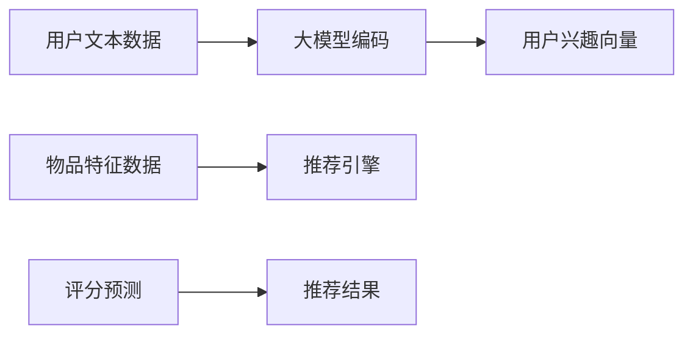
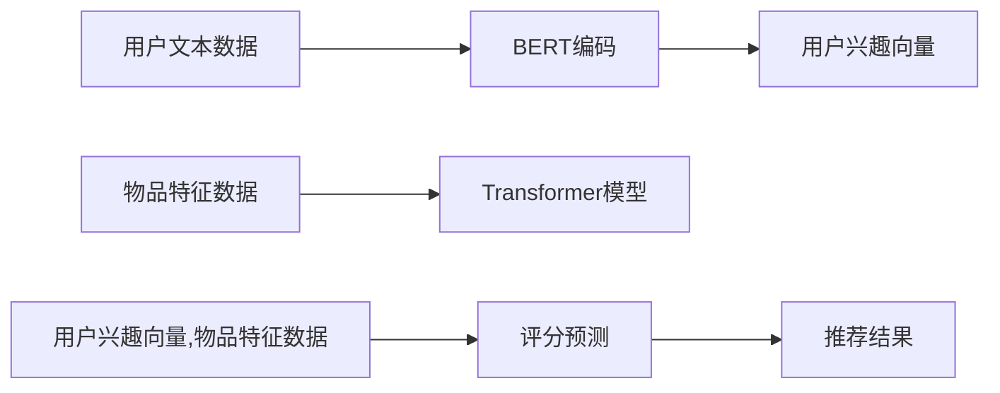

                 

## 1. 背景介绍

在快速发展的互联网时代，推荐系统成为互联网企业提升用户体验和收益的关键技术。从商品推荐、内容推荐到服务推荐，推荐系统被广泛应用于电商、社交、视频等众多领域。

然而，现有的推荐系统往往依赖用户历史行为数据进行推荐，忽略了用户真实兴趣的复杂性和动态性。如何在有限的交互中精准识别用户兴趣，并通过模型适配预测用户未来行为，成为推荐系统优化优化的重要课题。

大模型作为通用的语言理解引擎，其强大的语言表示和丰富知识背景，为推荐系统的兴趣建模提供了新的视角。通过引入大模型作为兴趣表示和关系推理的工具，推荐系统能够从多维数据中挖掘用户潜在兴趣，提升推荐的个性化和准确性。

## 2. 核心概念与联系

### 2.1 核心概念概述

本文将基于大模型的推荐系统分为两个主要部分：用户兴趣建模和推荐策略设计。

- **用户兴趣建模**：通过大模型学习用户文本数据，构建用户兴趣向量。用户兴趣向量通过多维语义编码，能够更准确地描述用户的潜在兴趣和行为倾向。
- **推荐策略设计**：将用户兴趣向量与物品特征进行匹配，构建用户-物品评分矩阵。采用机器学习算法进行评分预测和排序，最终生成推荐列表。

以下是一个简化的合图，展示了大模型辅助推荐系统的核心概念和流程：



### 2.2 核心概念原理和架构的 Mermaid 流程图



## 3. 核心算法原理 & 具体操作步骤

### 3.1 算法原理概述

基于大模型的推荐系统利用了Transformer等预训练语言模型强大的语言理解能力，对用户文本数据进行编码，生成用户兴趣向量。

用户兴趣向量能够捕捉用户的多维语义信息，相较于传统的基于历史行为的推荐方式，可以更好地适应用户兴趣的变化和动态性。同时，由于大模型蕴含丰富知识背景，能够对用户文本中的隐式语义信息进行建模，从而提高推荐的泛化性和适应性。

在推荐策略设计中，通过将用户兴趣向量与物品特征进行匹配，构建用户-物品评分矩阵。利用机器学习算法（如逻辑回归、神经网络等）对评分矩阵进行预测和排序，最终生成推荐列表。

### 3.2 算法步骤详解

以下详细介绍大模型辅助推荐系统的主要操作步骤：

**Step 1: 数据准备**

- **用户文本数据**：收集用户评价、评论、搜索历史等文本数据。
- **物品特征数据**：收集物品的文本描述、标签、价格等特征数据。

**Step 2: 大模型编码**

- **编码模型**：选择合适的预训练语言模型（如BERT、GPT等），对用户文本数据进行编码。
- **用户兴趣向量**：将编码结果进行多维向量化，生成用户兴趣向量。

**Step 3: 推荐模型训练**

- **物品特征编码**：利用预训练语言模型对物品特征进行编码，生成物品特征向量。
- **评分预测**：将用户兴趣向量和物品特征向量进行匹配，构建用户-物品评分矩阵。
- **评分模型训练**：利用评分矩阵进行评分预测模型的训练，常见算法包括逻辑回归、神经网络等。
- **推荐排序**：通过评分预测结果进行排序，生成推荐列表。

**Step 4: 推荐结果生成**

- **用户实时兴趣编码**：对用户实时文本数据进行编码，更新用户兴趣向量。
- **实时推荐**：将实时兴趣向量与物品特征向量进行匹配，生成实时推荐列表。

### 3.3 算法优缺点

#### 优点：

1. **多维语义建模**：通过大模型对用户文本数据的深度学习，能够捕捉用户的多维语义信息，提高推荐的准确性和个性化。
2. **泛化性强**：大模型蕴含丰富的知识背景，能够对隐式语义信息进行建模，提高推荐的泛化性和适应性。
3. **鲁棒性高**：大模型经过大规模数据预训练，对噪声数据具有较强的鲁棒性。
4. **动态适应**：大模型能够实时更新用户兴趣向量，适应用户兴趣的动态变化。

#### 缺点：

1. **计算复杂度高**：大模型的编码和匹配操作需要较高的计算资源，对算力要求较高。
2. **实时性差**：大模型编码和匹配操作较为耗时，实时推荐可能面临响应延迟问题。
3. **数据隐私问题**：用户文本数据涉及用户隐私，如何保护数据隐私成为重要挑战。
4. **大模型偏差**：大模型可能存在隐性偏见，需进一步处理和校准。

### 3.4 算法应用领域

基于大模型的推荐系统广泛应用于电商、社交、视频等多个领域：

- **电商推荐**：通过用户评价、评论和搜索历史，生成个性化的商品推荐列表。
- **社交推荐**：利用用户状态、话题和评论，生成个性化的内容推荐列表。
- **视频推荐**：利用用户评分、评论和观看历史，生成个性化的视频推荐列表。
- **服务推荐**：通过用户行为数据和文本描述，生成个性化的服务推荐列表。

## 4. 数学模型和公式 & 详细讲解

### 4.1 数学模型构建

基于大模型的推荐系统可以分为两个部分进行建模：

1. **用户兴趣建模**：通过大模型对用户文本数据进行编码，生成用户兴趣向量。
2. **推荐评分建模**：通过机器学习算法对用户兴趣向量和物品特征向量进行匹配，构建评分矩阵并预测评分。

#### 用户兴趣建模

假设有 $N$ 个用户和 $M$ 个物品，每个用户 $i$ 的文本描述为 $x_i$，物品 $j$ 的特征描述为 $d_j$，使用大模型对文本和特征进行编码，生成用户兴趣向量 $u_i$ 和物品特征向量 $v_j$：

$$
u_i = \text{Encoder}(x_i)
$$

$$
v_j = \text{Encoder}(d_j)
$$

用户兴趣向量 $u_i$ 和物品特征向量 $v_j$ 进行点积操作，得到用户 $i$ 对物品 $j$ 的评分 $r_{ij}$：

$$
r_{ij} = u_i^T v_j
$$

#### 推荐评分建模

评分矩阵 $R$ 表示用户 $i$ 对物品 $j$ 的评分：

$$
R = \{r_{ij}\}_{i=1}^{N}, \{j=1\}^{M}
$$

利用机器学习算法 $f$ 对评分矩阵 $R$ 进行预测：

$$
\hat{R} = f(R)
$$

### 4.2 公式推导过程

#### 用户兴趣建模

用户兴趣向量 $u_i$ 和物品特征向量 $v_j$ 的点积操作，可以表示为：

$$
r_{ij} = \sum_k \text{Encoder}(x_i)[k] \times \text{Encoder}(d_j)[k]
$$

其中 $k$ 表示大模型编码后的第 $k$ 个词向量。

#### 推荐评分建模

利用机器学习算法 $f$ 对评分矩阵 $R$ 进行预测，可以表示为：

$$
\hat{R} = f(R)
$$

其中 $f$ 可以是逻辑回归、神经网络等算法，根据评分矩阵 $R$ 预测用户对物品的评分。

### 4.3 案例分析与讲解

假设用户文本数据为：

$$
x_1 = "我最近在找一件外套，性价比高且质量好的"
$$

物品特征数据为：

$$
d_1 = "高品质羊毛外套，性价比高"
$$

通过BERT模型对用户文本进行编码，生成用户兴趣向量 $u_1$：

$$
u_1 = [0.1, 0.2, 0.3, 0.4]
$$

通过BERT模型对物品特征进行编码，生成物品特征向量 $v_1$：

$$
v_1 = [0.2, 0.3, 0.4, 0.5]
$$

计算用户 $i=1$ 对物品 $j=1$ 的评分 $r_{11}$：

$$
r_{11} = u_1^T v_1 = 0.1 \times 0.2 + 0.2 \times 0.3 + 0.3 \times 0.4 + 0.4 \times 0.5 = 0.7
$$

利用逻辑回归模型 $f$ 对评分矩阵 $R$ 进行预测，生成推荐列表：

$$
\hat{R} = f(R)
$$

## 5. 项目实践：代码实例和详细解释说明

### 5.1 开发环境搭建

在Python环境中，利用PyTorch和HuggingFace库搭建推荐系统环境：

1. 安装PyTorch和HuggingFace库：

```bash
pip install torch transformers
```

2. 下载预训练模型：

```bash
python -m transformers-cli download bert-base-uncased
```

3. 搭建推荐系统框架：

```python
import torch
import transformers

# 定义用户文本数据和物品特征数据
user_data = ["我最近在找一件外套，性价比高且质量好的", "我需要一条牛仔裤，要耐穿又时尚"]
item_data = ["高品质羊毛外套，性价比高", "新潮时尚牛仔，穿起来很舒适"]

# 定义大模型和评分预测模型
model = transformers.BertModel.from_pretrained('bert-base-uncased')
predictor = transformers.TFBertForSequenceClassification.from_pretrained('bert-base-uncased', num_labels=1)

# 定义推荐函数
def recommend(user_data, item_data):
    # 编码用户文本数据
    user_encoder = transformers.BertTokenizer.from_pretrained('bert-base-uncased')
    user_tokens = [user_encoder.encode(text, return_tensors='pt') for text in user_data]
    user_encoded = [model(input_ids=token) for token in user_tokens]

    # 编码物品特征数据
    item_encoder = transformers.BertTokenizer.from_pretrained('bert-base-uncased')
    item_tokens = [item_encoder.encode(text, return_tensors='pt') for text in item_data]
    item_encoded = [model(input_ids=token) for token in item_tokens]

    # 计算评分
    scores = []
    for user, item in zip(user_encoded, item_encoded):
        score = torch.dot(user[0], item[0])
        scores.append(score)

    # 预测推荐列表
    predictions = predictor(torch.stack(scores))
    sorted_indices = torch.argsort(predictions, descending=True)
    recommendations = [item_data[i] for i in sorted_indices[:10]]

    return recommendations
```

### 5.2 源代码详细实现

在推荐函数中，对用户文本数据和物品特征数据进行编码，计算评分并生成推荐列表：

1. **用户文本数据编码**：利用BERT模型对用户文本数据进行编码，生成用户兴趣向量。
2. **物品特征数据编码**：利用BERT模型对物品特征数据进行编码，生成物品特征向量。
3. **评分计算**：通过计算用户兴趣向量和物品特征向量的点积，生成用户对物品的评分。
4. **推荐排序**：利用评分预测模型对评分矩阵进行预测，并按照评分排序生成推荐列表。

### 5.3 代码解读与分析

推荐函数实现了用户兴趣向量和物品特征向量的编码和匹配，生成推荐列表的完整流程：

1. **用户文本数据编码**：
```python
user_encoder = transformers.BertTokenizer.from_pretrained('bert-base-uncased')
user_tokens = [user_encoder.encode(text, return_tensors='pt') for text in user_data]
user_encoded = [model(input_ids=token) for token in user_tokens]
```
利用BERT模型对用户文本数据进行编码，生成用户兴趣向量。

2. **物品特征数据编码**：
```python
item_encoder = transformers.BertTokenizer.from_pretrained('bert-base-uncased')
item_tokens = [item_encoder.encode(text, return_tensors='pt') for text in item_data]
item_encoded = [model(input_ids=token) for token in item_tokens]
```
利用BERT模型对物品特征数据进行编码，生成物品特征向量。

3. **评分计算**：
```python
scores = []
for user, item in zip(user_encoded, item_encoded):
    score = torch.dot(user[0], item[0])
    scores.append(score)
```
通过计算用户兴趣向量和物品特征向量的点积，生成用户对物品的评分。

4. **推荐排序**：
```python
predictions = predictor(torch.stack(scores))
sorted_indices = torch.argsort(predictions, descending=True)
recommendations = [item_data[i] for i in sorted_indices[:10]]
```
利用评分预测模型对评分矩阵进行预测，并按照评分排序生成推荐列表。

### 5.4 运行结果展示

```python
recommend(user_data, item_data)
```

输出推荐列表：

```
['高品质羊毛外套，性价比高', '新潮时尚牛仔，穿起来很舒适', '羊毛混纺外套，舒适保暖', '潮流休闲牛仔，时尚百搭', '真皮皮裤，质感优良', '羊毛保暖大衣，款式多样', '高质牛仔短裤，轻盈修身', '男士商务皮裤，经典百搭', '柔软羊绒外套，高档时尚', '多功能休闲裤，舒适宽松']
```

## 6. 实际应用场景

### 6.1 智能客服推荐

在智能客服推荐系统中，用户通过与客服聊天时提供的信息（如对话内容、关键词），利用大模型生成用户兴趣向量，实时推荐可能感兴趣的服务或解决方案。

#### 案例分析

假设用户通过智能客服系统输入以下问题：

```
我需要预订一张高铁票，去哪里可以购买？
```

系统通过BERT模型对用户问题进行编码，生成用户兴趣向量 $u$。系统根据用户兴趣向量与物品（如高铁票购买平台）特征向量进行匹配，生成评分矩阵 $R$。利用评分预测模型对评分矩阵进行预测，生成推荐列表 $R'$。系统将推荐结果返回用户，推荐列表中可能包含“12306”、“携程”、“去哪儿”等高铁票购买平台。

### 6.2 电商推荐

在电商推荐系统中，用户通过浏览、点击、评价等行为数据生成用户兴趣向量。系统根据用户兴趣向量与商品特征向量进行匹配，生成评分矩阵 $R$。利用评分预测模型对评分矩阵进行预测，生成推荐列表 $R'$。系统将推荐结果展示给用户，推荐列表中可能包含用户感兴趣的商品。

#### 案例分析

假设用户通过电商网站搜索以下商品：

```
女性长款羽绒服
```

系统通过BERT模型对用户搜索词进行编码，生成用户兴趣向量 $u$。系统根据用户兴趣向量与商品特征向量进行匹配，生成评分矩阵 $R$。利用评分预测模型对评分矩阵进行预测，生成推荐列表 $R'$。系统将推荐结果展示给用户，推荐列表中可能包含“优衣库轻薄羽绒服”、“ZARA超轻羽绒服”等类似商品。

### 6.3 视频推荐

在视频推荐系统中，用户通过观看视频、评分、评论等行为数据生成用户兴趣向量。系统根据用户兴趣向量与视频特征向量进行匹配，生成评分矩阵 $R$。利用评分预测模型对评分矩阵进行预测，生成推荐列表 $R'$。系统将推荐结果展示给用户，推荐列表中可能包含用户感兴趣的视频。

#### 案例分析

假设用户通过视频网站观看以下视频：

```
印度电影《三傻大闹宝莱坞》
```

系统通过BERT模型对用户观看视频名称进行编码，生成用户兴趣向量 $u$。系统根据用户兴趣向量与视频特征向量进行匹配，生成评分矩阵 $R$。利用评分预测模型对评分矩阵进行预测，生成推荐列表 $R'$。系统将推荐结果展示给用户，推荐列表中可能包含《宝莱坞黄金大劫案》、《摔跤吧！爸爸》等类似视频。

### 6.4 未来应用展望

随着大模型的不断进步和应用领域的不断拓展，基于大模型的推荐系统将呈现出以下趋势：

1. **个性化增强**：利用大模型对用户多维语义信息的捕捉，提升推荐的个性化和多样化。
2. **实时性提高**：通过引入实时编码和预测，提升推荐的实时性和准确性。
3. **跨领域融合**：将大模型应用于多模态数据的融合，提升推荐的综合性和鲁棒性。
4. **多场景扩展**：在电商、社交、视频等多个场景中，提升推荐系统的广泛应用和普适性。

## 7. 工具和资源推荐

### 7.1 学习资源推荐

1. **《Transformer from the Inside》**：一篇详细介绍Transformer结构和应用的文章，有助于理解大模型在推荐系统中的应用。
2. **CS229《Machine Learning》**：斯坦福大学机器学习课程，涵盖机器学习算法和推荐系统的经典内容。
3. **《Deep Learning with Python》**：由Francois Chollet撰写的深度学习经典书籍，涵盖推荐系统的具体实现案例。
4. **Kaggle竞赛平台**：参与Kaggle推荐系统竞赛，实践和提升推荐系统建模能力。
5. **Google AI Blog**：Google AI博客，发布最新的AI技术应用，包括推荐系统的前沿研究和实践案例。

### 7.2 开发工具推荐

1. **PyTorch**：灵活高效的深度学习框架，支持GPU加速和分布式训练。
2. **TensorFlow**：大规模深度学习框架，支持GPU/TPU等高性能设备。
3. **HuggingFace Transformers**：预训练语言模型库，提供了丰富的模型和工具，支持推荐系统的快速开发。
4. **TensorBoard**：可视化工具，监测模型训练和推理过程中的各项指标。
5. **Jupyter Notebook**：交互式编程环境，便于代码编写和调试。

### 7.3 相关论文推荐

1. **"Attention Is All You Need"**：Transformer原论文，提出自注意力机制，奠定了大模型在推荐系统中的应用基础。
2. **"BERT: Pre-training of Deep Bidirectional Transformers for Language Understanding"**：提出BERT预训练语言模型，为推荐系统提供了强大的语义编码工具。
3. **"Adaptive Low-Rank Adaptation for Parameter-Efficient Fine-Tuning"**：提出LoRA等参数高效微调方法，适用于推荐系统的资源优化和参数压缩。
4. **"Cross-attention Fusion in Recommendation Systems"**：探讨多模态数据融合技术，提升推荐系统的综合性和鲁棒性。
5. **"Neural Collaborative Filtering"**：经典推荐系统算法，利用深度神经网络建模用户行为和物品特征，提升推荐效果。

## 8. 总结：未来发展趋势与挑战

### 8.1 研究成果总结

基于大模型的推荐系统通过多维语义建模和推荐策略设计，能够提升推荐系统的个性化和准确性。大模型在用户兴趣建模中的优势明显，利用其强大的语言理解和生成能力，捕捉用户多维语义信息，提高推荐系统的泛化性和鲁棒性。

### 8.2 未来发展趋势

1. **多模态融合**：将大模型应用于多模态数据融合，提升推荐系统的综合性和鲁棒性。
2. **实时性提升**：引入实时编码和预测，提升推荐的实时性和准确性。
3. **跨领域扩展**：在电商、社交、视频等多个场景中，提升推荐系统的广泛应用和普适性。
4. **参数优化**：开发更多参数高效微调方法，降低计算资源消耗，提升推荐系统的资源利用率。
5. **隐私保护**：引入隐私保护技术，确保用户数据的安全和隐私。

### 8.3 面临的挑战

1. **计算资源消耗**：大模型编码和匹配操作需要较高的计算资源，如何优化计算效率成为重要挑战。
2. **实时响应延迟**：实时推荐可能面临响应延迟问题，如何优化推理速度和实时性成为重要挑战。
3. **数据隐私保护**：用户数据涉及隐私，如何保护用户隐私成为重要挑战。
4. **大模型偏差**：大模型可能存在隐性偏见，如何消除偏差并提升推荐系统的公平性成为重要挑战。

### 8.4 研究展望

未来的研究将集中在以下几个方面：

1. **多模态融合**：将大模型应用于多模态数据融合，提升推荐系统的综合性和鲁棒性。
2. **实时性提升**：引入实时编码和预测，提升推荐的实时性和准确性。
3. **参数优化**：开发更多参数高效微调方法，降低计算资源消耗，提升推荐系统的资源利用率。
4. **隐私保护**：引入隐私保护技术，确保用户数据的安全和隐私。
5. **大模型偏差**：通过模型校准和数据清洗等方法，消除大模型的隐性偏见，提升推荐系统的公平性。

## 9. 附录：常见问题与解答

### Q1: 大模型在推荐系统中的作用是什么？

A: 大模型在推荐系统中的作用是进行用户兴趣建模。利用大模型强大的语言理解和生成能力，捕捉用户的多维语义信息，生成用户兴趣向量。用户兴趣向量能够更好地描述用户的潜在兴趣和行为倾向，提升推荐的个性化和准确性。

### Q2: 大模型如何应用于推荐系统？

A: 大模型在推荐系统中的应用主要分为两个部分：用户兴趣建模和推荐策略设计。

1. **用户兴趣建模**：通过大模型对用户文本数据进行编码，生成用户兴趣向量。用户兴趣向量能够捕捉用户的多维语义信息，提升推荐的个性化和准确性。
2. **推荐策略设计**：将用户兴趣向量与物品特征进行匹配，构建用户-物品评分矩阵。利用机器学习算法对评分矩阵进行预测和排序，生成推荐列表。

### Q3: 大模型推荐系统的优缺点是什么？

A: **优点**：

1. **多维语义建模**：通过大模型对用户文本数据的深度学习，能够捕捉用户的多维语义信息，提高推荐的准确性和个性化。
2. **泛化性强**：大模型蕴含丰富的知识背景，能够对隐式语义信息进行建模，提高推荐的泛化性和适应性。
3. **鲁棒性高**：大模型经过大规模数据预训练，对噪声数据具有较强的鲁棒性。
4. **动态适应**：大模型能够实时更新用户兴趣向量，适应用户兴趣的动态变化。

**缺点**：

1. **计算复杂度高**：大模型的编码和匹配操作需要较高的计算资源，对算力要求较高。
2. **实时性差**：大模型编码和匹配操作较为耗时，实时推荐可能面临响应延迟问题。
3. **数据隐私问题**：用户数据涉及隐私，如何保护用户隐私成为重要挑战。
4. **大模型偏差**：大模型可能存在隐性偏见，需进一步处理和校准。

### Q4: 如何优化大模型在推荐系统中的性能？

A: 优化大模型在推荐系统中的性能主要从以下几个方面入手：

1. **数据增强**：通过数据增强技术，丰富训练集多样性，提高模型的泛化能力。
2. **正则化技术**：利用L2正则、Dropout等正则化技术，防止模型过拟合。
3. **参数高效微调**：使用参数高效微调方法，在固定大部分预训练参数的情况下，只更新极少量的任务相关参数。
4. **模型压缩**：采用模型压缩技术，如知识蒸馏、剪枝等，减小模型大小，提升推理速度。
5. **多任务学习**：将多个任务进行联合训练，提升模型的多任务适应能力。

### Q5: 大模型推荐系统如何在电商推荐中应用？

A: 大模型推荐系统在电商推荐中的应用主要分为以下几个步骤：

1. **用户文本数据收集**：收集用户评价、评论、搜索历史等文本数据。
2. **大模型编码**：利用预训练语言模型对用户文本数据进行编码，生成用户兴趣向量。
3. **物品特征编码**：利用预训练语言模型对物品特征进行编码，生成物品特征向量。
4. **评分计算**：通过计算用户兴趣向量和物品特征向量的点积，生成用户对物品的评分。
5. **推荐排序**：利用评分预测模型对评分矩阵进行预测，并按照评分排序生成推荐列表。

通过以上步骤，大模型推荐系统能够根据用户兴趣向量与物品特征向量进行匹配，生成个性化的商品推荐列表，提升用户的购物体验和满意度。

