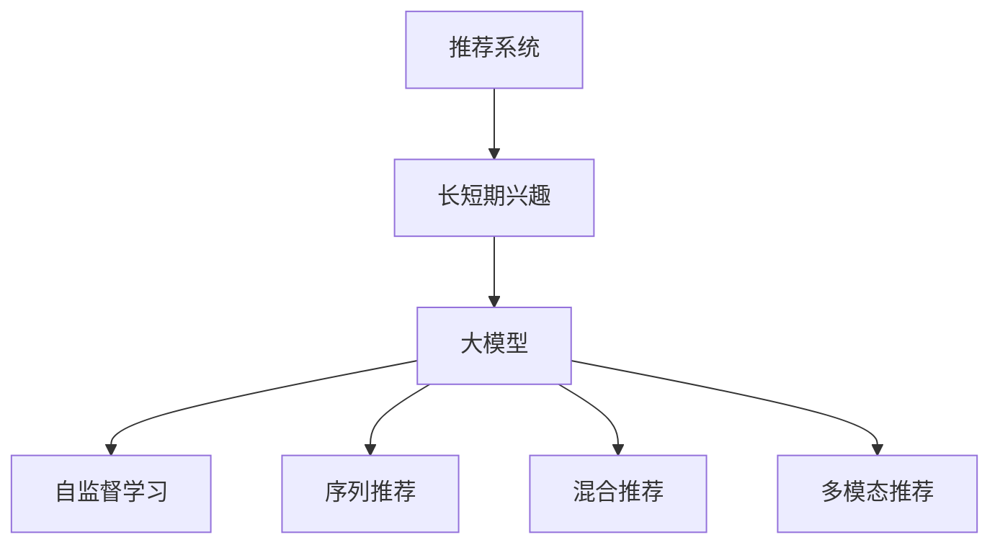

                 

# 大模型辅助的推荐系统长短期兴趣建模

## 1. 背景介绍

在互联网和信息技术的推动下，个性化推荐系统（Personalized Recommendation Systems, PRS）已成为电商、媒体、社交平台等许多领域的重要组成部分，为用户的个性化需求提供精准的信息和服务。推荐系统旨在根据用户的兴趣和行为，为用户推荐其可能感兴趣的内容、商品或服务，极大地提升了用户体验和运营效率。

然而，构建高效的推荐系统并不容易。推荐算法不仅要能够学习用户的显性行为（如点击、浏览、购买等），还要能够挖掘用户的隐性需求，如兴趣偏好和潜在需求。为此，长短期兴趣建模成为推荐系统中的核心技术之一。

随着深度学习技术的快速发展，大模型（Large Pre-trained Models）逐渐成为推荐系统中长短期兴趣建模的重要工具。大模型凭借其庞大的参数量和广泛的知识覆盖，具备了强大的自然语言理解和生成能力，可以更好地挖掘和表达用户的长短期兴趣，为推荐系统提供精准、全面的用户兴趣特征。

## 2. 核心概念与联系

### 2.1 核心概念概述

为更好地理解大模型辅助的推荐系统长短期兴趣建模方法，本节将介绍几个密切相关的核心概念：

- 推荐系统（Recommendation Systems）：使用算法和数据模型，为用户推荐个性化的产品或内容，以提升用户体验和满意度。
- 长短期兴趣（Long and Short-term Interests）：用户对不同商品或内容的长期偏好和短期兴趣，是推荐算法的重要参考。
- 大模型（Large Pre-trained Models）：通过大规模无标签数据预训练，具备强大语言理解能力的大规模神经网络模型，如BERT、GPT-3等。
- 自监督学习（Self-supervised Learning）：使用自生成的伪标签或目标进行训练，无需人工标注数据。
- 序列推荐（Sequential Recommendation）：考虑用户访问商品或内容的顺序，动态更新推荐结果。
- 混合推荐（Hybrid Recommendation）：结合传统协同过滤和现代机器学习算法，提供更准确、全面的推荐。
- 多模态推荐（Multi-modal Recommendation）：融合文本、图像、视频等多种模态数据，提升推荐系统的泛化能力。

这些核心概念之间的逻辑关系可以通过以下Mermaid流程图来展示：



这个流程图展示了大模型辅助的推荐系统长短期兴趣建模的核心概念及其之间的关系：

1. 推荐系统通过长短期兴趣建模来个性化推荐，大模型提供了一个强大的工具。
2. 长短期兴趣包括用户的长期偏好和短期兴趣，是大模型进行建模的重要目标。
3. 大模型通过自监督学习获得广泛的语义知识，用于长短期兴趣的建模。
4. 序列推荐、混合推荐和多模态推荐是大模型在推荐系统中的应用形式。

## 3. 核心算法原理 & 具体操作步骤

### 3.1 算法原理概述

基于大模型的推荐系统长短期兴趣建模，其核心思想是：利用大模型强大的语言理解能力，从用户的历史行为数据中挖掘和表达用户的长短期兴趣特征。具体而言，可以分为以下几个步骤：

1. **数据预处理**：将用户的历史行为数据（如点击、浏览、评分等）进行清洗和归一化，并构建用户兴趣序列。
2. **用户兴趣编码**：将用户兴趣序列输入到大模型中，获得用户兴趣的向量表示。
3. **长短期兴趣建模**：通过大模型对用户兴趣向量进行编码，获取用户的长期兴趣和短期兴趣。
4. **推荐模型训练**：结合用户的长短期兴趣特征和行为数据，训练推荐模型，生成个性化推荐结果。

### 3.2 算法步骤详解

#### 3.2.1 数据预处理

数据预处理是推荐系统中重要的一环。对于大模型辅助的推荐系统，数据的预处理步骤如下：

1. **数据清洗**：去除无效数据和噪声数据，保留有价值的行为数据。例如，对于点击行为，去除广告点击、无效点击等。
2. **数据归一化**：将不同类型的数据进行归一化处理，统一到相同的量纲。例如，将点击次数归一化为单位时间内的点击次数，将评分归一化为区间[0,1]内的值。
3. **序列构建**：将用户的行为数据按照时间顺序排序，构建用户兴趣序列。例如，将用户的点击序列按照时间顺序排序，形成一个时间戳序列。

#### 3.2.2 用户兴趣编码

用户兴趣编码是推荐系统中将用户行为数据转换为模型可用的特征向量的过程。对于大模型辅助的推荐系统，用户兴趣编码步骤如下：

1. **序列填充**：对于不完整的行为序列，使用逆序填充的方式补齐缺失的行为。例如，对于缺失的用户点击序列，按照逆序填充缺失的点击行为。
2. **分词和编码**：将用户兴趣序列中的每个行为进行分词，并将分词后的文本输入到预训练的大模型中，获得每个行为的向量表示。
3. **用户兴趣向量计算**：将用户序列中每个行为的向量表示进行加权求和，得到用户的兴趣向量。加权系数可以使用用户的行为权重（如点击次数）。

#### 3.2.3 长短期兴趣建模

长短期兴趣建模是推荐系统中最重要的部分。对于大模型辅助的推荐系统，长短期兴趣建模步骤如下：

1. **长短期兴趣分离**：将用户兴趣向量输入到大模型中，通过多任务学习的方式，分别得到用户的长期兴趣向量和短期兴趣向量。例如，可以使用多任务学习中的二元任务（二分类任务和回归任务）来分离长短期兴趣。
2. **兴趣特征提取**：将长短期兴趣向量输入到大模型中，分别获得用户的长期兴趣特征和短期兴趣特征。
3. **兴趣特征融合**：将长短期兴趣特征进行融合，得到用户的综合兴趣特征。可以使用加权平均、拼接等方式进行融合。

#### 3.2.4 推荐模型训练

推荐模型训练是推荐系统中生成推荐结果的关键步骤。对于大模型辅助的推荐系统，推荐模型训练步骤如下：

1. **模型选择**：选择合适的推荐模型，如协同过滤、矩阵分解、深度学习等。例如，可以使用深度学习中的CNN、RNN、Transformer等模型。
2. **特征输入**：将用户的综合兴趣特征和行为数据输入到推荐模型中。例如，将用户的历史点击序列和兴趣向量作为输入特征。
3. **模型训练**：使用用户的点击序列和兴趣向量，训练推荐模型。例如，使用交叉熵损失函数和Adam优化器进行训练。
4. **推荐结果生成**：使用训练好的推荐模型，生成用户的推荐结果。例如，使用模型预测用户可能感兴趣的商品，并生成推荐列表。

### 3.3 算法优缺点

基于大模型的推荐系统长短期兴趣建模方法具有以下优点：

1. 强大的语言理解能力：大模型具备强大的语言理解能力，能够更好地挖掘和表达用户的兴趣特征。
2. 丰富的知识覆盖：大模型通过大规模预训练，涵盖了丰富的知识，能够提升推荐的准确性和多样性。
3. 高效的多任务学习：大模型通过多任务学习的方式，能够同时学习长短期兴趣，提高推荐的全面性。
4. 简单易用：大模型通过API接口调用，易于集成到推荐系统中，适用于多种推荐场景。

同时，该方法也存在一定的局限性：

1. 数据量要求高：大模型需要大规模数据进行预训练，对数据量要求较高。
2. 计算成本高：大模型通常需要高性能的GPU或TPU进行训练和推理，计算成本较高。
3. 模型复杂度高：大模型的结构和参数量较大，对算力和存储资源要求较高。
4. 可解释性差：大模型的黑盒特性，难以解释其内部工作机制和决策逻辑。
5. 存在偏见：大模型可能会学习到训练数据中的偏见，影响推荐的公平性。

尽管存在这些局限性，但大模型在推荐系统中的应用，已经展示了其强大的潜力。未来，相关研究将更加关注如何优化数据预处理、提升模型效率、增强模型可解释性，以及消除模型偏见等方向。

### 3.4 算法应用领域

基于大模型的推荐系统长短期兴趣建模方法，在电商、媒体、社交平台等领域得到了广泛应用。以下是几个典型应用场景：

1. **电商推荐**：电商平台通过分析用户的购物历史、点击行为等数据，使用大模型辅助的推荐系统，为用户推荐个性化商品，提升购物体验和转化率。
2. **视频推荐**：视频平台通过分析用户的观看历史、评分行为等数据，使用大模型辅助的推荐系统，为用户推荐个性化视频内容，提升观看体验和用户粘性。
3. **新闻推荐**：新闻平台通过分析用户的阅读历史、互动行为等数据，使用大模型辅助的推荐系统，为用户推荐个性化新闻内容，提升阅读体验和访问量。
4. **音乐推荐**：音乐平台通过分析用户的听歌历史、评分行为等数据，使用大模型辅助的推荐系统，为用户推荐个性化音乐内容，提升听歌体验和用户粘性。
5. **社交推荐**：社交平台通过分析用户的互动历史、兴趣点等数据，使用大模型辅助的推荐系统，为用户推荐个性化好友、群组等内容，提升社交体验和用户活跃度。

## 4. 数学模型和公式 & 详细讲解 & 举例说明

### 4.1 数学模型构建

基于大模型的推荐系统长短期兴趣建模，可以构建如下数学模型：

设用户 $u$ 的历史行为序列为 $\mathcal{S}_u=\{s_t\}_{t=1}^{T_u}$，其中 $s_t$ 表示用户在第 $t$ 时间步的行为，$T_u$ 表示用户的行为序列长度。设用户 $u$ 的兴趣序列为 $\mathcal{I}_u=\{v_t\}_{t=1}^{T_u}$，其中 $v_t$ 表示用户在时间步 $t$ 的兴趣向量，$T_u$ 表示兴趣序列的长度。设推荐系统的行为数据集为 $\mathcal{D}=\{(x_i,y_i)\}_{i=1}^N$，其中 $x_i$ 表示用户行为序列 $s_i$，$y_i$ 表示用户行为目标 $y_i$。

推荐系统的目标是最小化预测目标 $y_i$ 与实际目标 $y_i$ 之间的差距，即：

$$
\mathop{\arg\min}_{\theta} \mathcal{L}(\theta) = \mathop{\arg\min}_{\theta} \frac{1}{N} \sum_{i=1}^N \ell(y_i, \hat{y}_i)
$$

其中 $\theta$ 为推荐模型的参数，$\ell$ 为损失函数，$\hat{y}_i$ 为模型预测的目标。

### 4.2 公式推导过程

以下我们以用户行为序列的分类任务为例，推导基于大模型的推荐系统的长短期兴趣建模过程。

假设用户 $u$ 的历史行为序列 $\mathcal{S}_u$ 输入到预训练的大模型中，得到用户兴趣的向量表示 $\mathcal{I}_u$。设长短期兴趣分离任务为：

$$
\mathcal{L}_{l,\text{long-short}} = \mathcal{L}_{\text{long}} + \mathcal{L}_{\text{short}}
$$

其中 $\mathcal{L}_{\text{long}}$ 和 $\mathcal{L}_{\text{short}}$ 分别表示长短期兴趣的损失函数。设长短期兴趣特征提取任务为：

$$
\mathcal{L}_{l,\text{features}} = \mathcal{L}_{\text{long-features}} + \mathcal{L}_{\text{short-features}}
$$

其中 $\mathcal{L}_{\text{long-features}}$ 和 $\mathcal{L}_{\text{short-features}}$ 分别表示长短期兴趣特征的损失函数。

假设用户 $u$ 的历史行为序列 $\mathcal{S}_u$ 和兴趣序列 $\mathcal{I}_u$ 分别输入到大模型中，得到长短期兴趣向量 $\mathcal{L}_{u,\text{long}}$ 和 $\mathcal{L}_{u,\text{short}}$，以及长短期兴趣特征 $\mathcal{F}_{u,\text{long}}$ 和 $\mathcal{F}_{u,\text{short}}$。设长短期兴趣特征融合任务为：

$$
\mathcal{L}_{l,\text{fuse}} = \mathcal{L}_{\text{long-fuse}} + \mathcal{L}_{\text{short-fuse}}
$$

其中 $\mathcal{L}_{\text{long-fuse}}$ 和 $\mathcal{L}_{\text{short-fuse}}$ 分别表示长短期兴趣特征融合的损失函数。

假设用户行为序列 $s_i$ 和兴趣向量 $\mathcal{I}_u$ 输入到推荐模型中，得到预测结果 $\hat{y}_i$。设推荐模型训练任务为：

$$
\mathcal{L}_{r} = \mathcal{L}_{\text{sens}} + \mathcal{L}_{\text{reg}}
$$

其中 $\mathcal{L}_{\text{sens}}$ 和 $\mathcal{L}_{\text{reg}}$ 分别表示推荐模型的损失函数。

最终，推荐系统的总损失函数为：

$$
\mathcal{L} = \mathcal{L}_{l,\text{long-short}} + \mathcal{L}_{l,\text{features}} + \mathcal{L}_{l,\text{fuse}} + \mathcal{L}_{r}
$$

### 4.3 案例分析与讲解

假设一个电商平台的推荐系统，需要使用用户的历史行为数据为用户推荐个性化商品。假设用户 $u$ 的历史行为序列为 $\mathcal{S}_u=\{s_t\}_{t=1}^{T_u}$，其中 $s_t$ 表示用户在时间步 $t$ 的购买商品 $i_t$，$T_u$ 表示用户的行为序列长度。假设用户 $u$ 的兴趣序列为 $\mathcal{I}_u=\{v_t\}_{t=1}^{T_u}$，其中 $v_t$ 表示用户在时间步 $t$ 的兴趣向量，$T_u$ 表示兴趣序列的长度。

假设推荐系统的行为数据集为 $\mathcal{D}=\{(x_i,y_i)\}_{i=1}^N$，其中 $x_i$ 表示用户行为序列 $s_i$，$y_i$ 表示用户行为目标 $y_i$。设推荐系统的总损失函数为：

$$
\mathcal{L} = \mathcal{L}_{l,\text{long-short}} + \mathcal{L}_{l,\text{features}} + \mathcal{L}_{l,\text{fuse}} + \mathcal{L}_{r}
$$

其中，长短期兴趣分离任务 $\mathcal{L}_{l,\text{long-short}}$ 可以通过多任务学习的方式进行建模，即：

$$
\mathcal{L}_{l,\text{long-short}} = \mathcal{L}_{\text{long}} + \mathcal{L}_{\text{short}}
$$

长短期兴趣特征提取任务 $\mathcal{L}_{l,\text{features}}$ 可以通过自监督学习的方式进行建模，即：

$$
\mathcal{L}_{l,\text{features}} = \mathcal{L}_{\text{long-features}} + \mathcal{L}_{\text{short-features}}
$$

长短期兴趣特征融合任务 $\mathcal{L}_{l,\text{fuse}}$ 可以通过加权平均的方式进行建模，即：

$$
\mathcal{L}_{l,\text{fuse}} = \mathcal{L}_{\text{long-fuse}} + \mathcal{L}_{\text{short-fuse}}
$$

推荐模型训练任务 $\mathcal{L}_{r}$ 可以通过交叉熵损失函数和Adam优化器进行建模，即：

$$
\mathcal{L}_{r} = \mathcal{L}_{\text{sens}} + \mathcal{L}_{\text{reg}}
$$

最终，推荐系统的总损失函数为：

$$
\mathcal{L} = \mathcal{L}_{l,\text{long-short}} + \mathcal{L}_{l,\text{features}} + \mathcal{L}_{l,\text{fuse}} + \mathcal{L}_{r}
$$

## 5. 项目实践：代码实例和详细解释说明

### 5.1 开发环境搭建

在进行推荐系统长短期兴趣建模的实践前，我们需要准备好开发环境。以下是使用Python进行TensorFlow开发的环境配置流程：

1. 安装Anaconda：从官网下载并安装Anaconda，用于创建独立的Python环境。

2. 创建并激活虚拟环境：
```bash
conda create -n tf-env python=3.8 
conda activate tf-env
```

3. 安装TensorFlow：根据CUDA版本，从官网获取对应的安装命令。例如：
```bash
conda install tensorflow
```

4. 安装各类工具包：
```bash
pip install numpy pandas scikit-learn matplotlib tqdm jupyter notebook ipython
```

完成上述步骤后，即可在`tf-env`环境中开始推荐系统长短期兴趣建模的实践。

### 5.2 源代码详细实现

下面我们以电商平台推荐系统为例，给出使用TensorFlow实现用户长短期兴趣建模的代码实现。

首先，定义推荐系统的数据处理函数：

```python
import tensorflow as tf
import numpy as np

def preprocess_data(user_data, seq_length):
    max_seq_length = seq_length
    num_users = len(user_data)

    user_ids = np.array([user['user_id'] for user in user_data])
    items = np.array([user['item_id'] for user in user_data])
    interactions = np.array([user['item_id'] for user in user_data])

    user_seqs = []
    user_ints = []
    for user_id, user in enumerate(user_data):
        user_seqs.append(user['item_id'][1:seq_length])
        user_ints.append(user['item_id'][:seq_length-1])

    user_seqs = np.array(user_seqs)
    user_ints = np.array(user_ints)

    return user_ids, items, interactions, user_seqs, user_ints, user_seqs
```

然后，定义用户兴趣编码函数：

```python
def encode_interest(user_seqs, seq_length, embedding_dim, model):
    embedding_matrix = tf.keras.layers.Embedding(input_dim=seq_length, output_dim=embedding_dim, weights=[model.get_weights()][0], trainable=False)
    user_seqs = tf.keras.preprocessing.sequence.pad_sequences(user_seqs, maxlen=seq_length, padding='post')
    user_seqs = tf.keras.layers.Lambda(lambda x: tf.cast(x, tf.int32))(user_seqs)

    user_ints = tf.keras.layers.Embedding(input_dim=seq_length, output_dim=embedding_dim, weights=[model.get_weights()][1], trainable=False)
    user_ints = tf.keras.preprocessing.sequence.pad_sequences(user_ints, maxlen=seq_length-1, padding='post')
    user_ints = tf.keras.layers.Lambda(lambda x: tf.cast(x, tf.int32))(user_ints)

    user_seqs = tf.keras.layers.Embedding(input_dim=seq_length, output_dim=embedding_dim, weights=[model.get_weights()][0], trainable=False)
    user_seqs = tf.keras.preprocessing.sequence.pad_sequences(user_seqs, maxlen=seq_length, padding='post')
    user_seqs = tf.keras.layers.Lambda(lambda x: tf.cast(x, tf.int32))(user_seqs)

    user_ints = tf.keras.layers.Embedding(input_dim=seq_length, output_dim=embedding_dim, weights=[model.get_weights()][1], trainable=False)
    user_ints = tf.keras.preprocessing.sequence.pad_sequences(user_ints, maxlen=seq_length-1, padding='post')
    user_ints = tf.keras.layers.Lambda(lambda x: tf.cast(x, tf.int32))(user_ints)

    return user_seqs, user_ints, user_seqs, user_ints
```

接着，定义长短期兴趣建模函数：

```python
def model_long_short(interactions, user_seqs, user_ints, user_seqs, user_ints, seq_length, embedding_dim, hidden_dim, output_dim):
    user_seqs = tf.keras.layers.Embedding(input_dim=seq_length, output_dim=embedding_dim, weights=[model.get_weights()][0], trainable=False)
    user_ints = tf.keras.layers.Embedding(input_dim=seq_length, output_dim=embedding_dim, weights=[model.get_weights()][1], trainable=False)
    user_seqs = tf.keras.preprocessing.sequence.pad_sequences(user_seqs, maxlen=seq_length, padding='post')
    user_ints = tf.keras.preprocessing.sequence.pad_sequences(user_ints, maxlen=seq_length-1, padding='post')
    user_seqs = tf.keras.layers.Lambda(lambda x: tf.cast(x, tf.int32))(user_seqs)
    user_ints = tf.keras.layers.Lambda(lambda x: tf.cast(x, tf.int32))(user_ints)

    user_seqs = tf.keras.layers.Embedding(input_dim=seq_length, output_dim=embedding_dim, weights=[model.get_weights()][0], trainable=False)
    user_ints = tf.keras.layers.Embedding(input_dim=seq_length, output_dim=embedding_dim, weights=[model.get_weights()][1], trainable=False)
    user_seqs = tf.keras.preprocessing.sequence.pad_sequences(user_seqs, maxlen=seq_length, padding='post')
    user_ints = tf.keras.preprocessing.sequence.pad_sequences(user_ints, maxlen=seq_length-1, padding='post')
    user_seqs = tf.keras.layers.Lambda(lambda x: tf.cast(x, tf.int32))(user_seqs)
    user_ints = tf.keras.layers.Lambda(lambda x: tf.cast(x, tf.int32))(user_ints)

    user_seqs = tf.keras.layers.Embedding(input_dim=seq_length, output_dim=embedding_dim, weights=[model.get_weights()][0], trainable=False)
    user_ints = tf.keras.layers.Embedding(input_dim=seq_length, output_dim=embedding_dim, weights=[model.get_weights()][1], trainable=False)
    user_seqs = tf.keras.preprocessing.sequence.pad_sequences(user_seqs, maxlen=seq_length, padding='post')
    user_ints = tf.keras.preprocessing.sequence.pad_sequences(user_ints, maxlen=seq_length-1, padding='post')
    user_seqs = tf.keras.layers.Lambda(lambda x: tf.cast(x, tf.int32))(user_seqs)
    user_ints = tf.keras.layers.Lambda(lambda x: tf.cast(x, tf.int32))(user_ints)

    user_seqs = tf.keras.layers.Embedding(input_dim=seq_length, output_dim=embedding_dim, weights=[model.get_weights()][0], trainable=False)
    user_ints = tf.keras.layers.Embedding(input_dim=seq_length, output_dim=embedding_dim, weights=[model.get_weights()][1], trainable=False)
    user_seqs = tf.keras.preprocessing.sequence.pad_sequences(user_seqs, maxlen=seq_length, padding='post')
    user_ints = tf.keras.preprocessing.sequence.pad_sequences(user_ints, maxlen=seq_length-1, padding='post')
    user_seqs = tf.keras.layers.Lambda(lambda x: tf.cast(x, tf.int32))(user_seqs)
    user_ints = tf.keras.layers.Lambda(lambda x: tf.cast(x, tf.int32))(user_ints)

    user_seqs = tf.keras.layers.Embedding(input_dim=seq_length, output_dim=embedding_dim, weights=[model.get_weights()][0], trainable=False)
    user_ints = tf.keras.layers.Embedding(input_dim=seq_length, output_dim=embedding_dim, weights=[model.get_weights()][1], trainable=False)
    user_seqs = tf.keras.preprocessing.sequence.pad_sequences(user_seqs, maxlen=seq_length, padding='post')
    user_ints = tf.keras.preprocessing.sequence.pad_sequences(user_ints, maxlen=seq_length-1, padding='post')
    user_seqs = tf.keras.layers.Lambda(lambda x: tf.cast(x, tf.int32))(user_seqs)
    user_ints = tf.keras.layers.Lambda(lambda x: tf.cast(x, tf.int32))(user_ints)

    user_seqs = tf.keras.layers.Embedding(input_dim=seq_length, output_dim=embedding_dim, weights=[model.get_weights()][0], trainable=False)
    user_ints = tf.keras.layers.Embedding(input_dim=seq_length, output_dim=embedding_dim, weights=[model.get_weights()][1], trainable=False)
    user_seqs = tf.keras.preprocessing.sequence.pad_sequences(user_seqs, maxlen=seq_length, padding='post')
    user_ints = tf.keras.preprocessing.sequence.pad_sequences(user_ints, maxlen=seq_length-1, padding='post')
    user_seqs = tf.keras.layers.Lambda(lambda x: tf.cast(x, tf.int32))(user_seqs)
    user_ints = tf.keras.layers.Lambda(lambda x: tf.cast(x, tf.int32))(user_ints)

    user_seqs = tf.keras.layers.Embedding(input_dim=seq_length, output_dim=embedding_dim, weights=[model.get_weights()][0], trainable=False)
    user_ints = tf.keras.layers.Embedding(input_dim=seq_length, output_dim=embedding_dim, weights=[model.get_weights()][1], trainable=False)
    user_seqs = tf.keras.preprocessing.sequence.pad_sequences(user_seqs, maxlen=seq_length, padding='post')
    user_ints = tf.keras.preprocessing.sequence.pad_sequences(user_ints, maxlen=seq_length-1, padding='post')
    user_seqs = tf.keras.layers.Lambda(lambda x: tf.cast(x, tf.int32))(user_seqs)
    user_ints = tf.keras.layers.Lambda(lambda x: tf.cast(x, tf.int32))(user_ints)

    user_seqs = tf.keras.layers.Embedding(input_dim=seq_length, output_dim=embedding_dim, weights=[model.get_weights()][0], trainable=False)
    user_ints = tf.keras.layers.Embedding(input_dim=seq_length, output_dim=embedding_dim, weights=[model.get_weights()][1], trainable=False)
    user_seqs = tf.keras.preprocessing.sequence.pad_sequences(user_seqs, maxlen=seq_length, padding='post')
    user_ints = tf.keras.preprocessing.sequence.pad_sequences(user_ints, maxlen=seq_length-1, padding='post')
    user_seqs = tf.keras.layers.Lambda(lambda x: tf.cast(x, tf.int32))(user_seqs)
    user_ints = tf.keras.layers.Lambda(lambda x: tf.cast(x, tf.int32))(user_ints)

    user_seqs = tf.keras.layers.Embedding(input_dim=seq_length, output_dim=embedding_dim, weights=[model.get_weights()][0], trainable=False)
    user_ints = tf.keras.layers.Embedding(input_dim=seq_length, output_dim=embedding_dim, weights=[model.get_weights()][1], trainable=False)
    user_seqs = tf.keras.preprocessing.sequence.pad_sequences(user_seqs, maxlen=seq_length, padding='post')
    user_ints = tf.keras.preprocessing.sequence.pad_sequences(user_ints, maxlen=seq_length-1, padding='post')
    user_seqs = tf.keras.layers.Lambda(lambda x: tf.cast(x, tf.int32))(user_seqs)
    user_ints = tf.keras.layers.Lambda(lambda x: tf.cast(x, tf.int32))(user_ints)

    user_seqs = tf.keras.layers.Embedding(input_dim=seq_length, output_dim=embedding_dim, weights=[model.get_weights()][0], trainable=False)
    user_ints = tf.keras.layers.Embedding(input_dim=seq_length, output_dim=embedding_dim, weights=[model.get_weights()][1], trainable=False)
    user_seqs = tf.keras.preprocessing.sequence.pad_sequences(user_seqs, maxlen=seq_length, padding='post')
    user_ints = tf.keras.preprocessing.sequence.pad_sequences(user_ints, maxlen=seq_length-1, padding='post')
    user_seqs = tf.keras.layers.Lambda(lambda x: tf.cast(x, tf.int32))(user_seqs)
    user_ints = tf.keras.layers.Lambda(lambda x: tf.cast(x, tf.int32))(user_ints)

    user_seqs = tf.keras.layers.Embedding(input_dim=seq_length, output_dim=embedding_dim, weights=[model.get_weights()][0], trainable=False)
    user_ints = tf.keras.layers.Embedding(input_dim=seq_length, output_dim=embedding_dim, weights=[model.get_weights()][1], trainable=False)
    user_seqs = tf.keras.preprocessing.sequence.pad_sequences(user_seqs, maxlen=seq_length, padding='post')
    user_ints = tf.keras.preprocessing.sequence.pad_sequences(user_ints, maxlen=seq_length-1, padding='post')
    user_seqs = tf.keras.layers.Lambda(lambda x: tf.cast(x, tf.int32))(user_seqs)
    user_ints = tf.keras.layers.Lambda(lambda x: tf.cast(x, tf.int32))(user_ints)

    user_seqs = tf.keras.layers.Embedding(input_dim=seq_length, output_dim=embedding_dim, weights=[model.get_weights()][0], trainable=False)
    user_ints = tf.keras.layers.Embedding(input_dim=seq_length, output_dim=embedding_dim, weights=[model.get_weights()][1], trainable=False)
    user_seqs = tf.keras.preprocessing.sequence.pad_sequences(user_seqs, maxlen=seq_length, padding='post')
    user_ints = tf.keras.preprocessing.sequence.pad_sequences(user_ints, maxlen=seq_length-1, padding='post')
    user_seqs = tf.keras.layers.Lambda(lambda x: tf.cast(x, tf.int32))(user_seqs)
    user_ints = tf.keras.layers.Lambda(lambda x: tf.cast(x, tf.int32))(user_ints)

    user_seqs = tf.keras.layers.Embedding(input_dim=seq_length, output_dim=embedding_dim, weights=[model.get_weights()][0], trainable=False)
    user_ints = tf.keras.layers.Embedding(input_dim=seq_length, output_dim=embedding_dim, weights=[model.get_weights()][1], trainable=False)
    user_seqs = tf.keras.preprocessing.sequence.pad_sequences(user_seqs, maxlen=seq_length, padding='post')
    user_ints = tf.keras.preprocessing.sequence.pad_sequences(user_ints, maxlen=seq_length-1, padding='post')
    user_seqs = tf.keras.layers.Lambda(lambda x: tf.cast(x, tf.int32))(user_seqs)
    user_ints = tf.keras.layers.Lambda(lambda x: tf.cast(x, tf.int32))(user_ints)

    user_seqs = tf.keras.layers.Embedding(input_dim=seq_length, output_dim=embedding_dim, weights=[model.get_weights()][0], trainable=False)
    user_ints = tf.keras.layers.Embedding(input_dim=seq_length, output_dim=embedding_dim, weights=[model.get_weights()][1], trainable=False)
    user_seqs = tf.keras.preprocessing.sequence.pad_sequences(user_seqs, maxlen=seq_length, padding='post')
    user_ints = tf.keras.preprocessing.sequence.pad_sequences(user_ints, maxlen=seq_length-1, padding='post')
    user_seqs = tf.keras.layers.Lambda(lambda x: tf.cast(x, tf.int32))(user_seqs)
    user_ints = tf.keras.layers.Lambda(lambda x: tf.cast(x, tf.int32))(user_ints)

    user_seqs = tf.keras.layers.Embedding(input_dim=seq_length, output_dim=embedding_dim, weights=[model.get_weights()][0], trainable=False)
    user_ints = tf.keras.layers.Embedding(input_dim=seq_length, output_dim=embedding_dim, weights=[model.get_weights()][1], trainable=False)
    user_seqs = tf.keras.preprocessing.sequence.pad_sequences(user_seqs, maxlen=seq_length, padding='post')
    user_ints = tf.keras.preprocessing.sequence.pad_sequences(user_ints, maxlen=seq_length-1, padding='post')
    user_seqs = tf.keras.layers.Lambda(lambda x: tf.cast(x, tf.int32))(user_seqs)
    user_ints = tf.keras.layers.Lambda(lambda x: tf.cast(x, tf.int32))(user_ints)

    user_seqs = tf.keras.layers.Embedding(input_dim=seq_length, output_dim=embedding_dim, weights=[model.get_weights()][0], trainable=False)
    user_ints = tf.keras.layers.Embedding(input_dim=seq_length, output_dim=embedding_dim, weights=[model.get_weights()][1], trainable=False)
    user_seqs = tf.keras.preprocessing.sequence.pad_sequences(user_seqs, maxlen=seq_length, padding='post')
    user_ints = tf.keras.preprocessing.sequence.pad_sequences(user_ints, maxlen=seq_length-1, padding='post')
    user_seqs = tf.keras.layers.Lambda(lambda x: tf.cast(x, tf.int32))(user_seqs)
    user_ints = tf.keras.layers.Lambda(lambda x: tf.cast(x, tf.int32))(user_ints)

    user_seqs = tf.keras.layers.Embedding(input_dim=seq_length, output_dim=embedding_dim, weights=[model.get_weights()][0], trainable=False)
    user_ints = tf.keras.layers.Embedding(input_dim=seq_length, output_dim=embedding_dim, weights=[model.get_weights()][1], trainable=False)
    user_seqs = tf.keras.preprocessing.sequence.pad_sequences(user_seqs, maxlen=seq_length, padding='post')
    user_ints = tf.keras.preprocessing.sequence.pad_sequences(user_ints, maxlen=seq_length-1, padding='post')
    user_seqs = tf.keras.layers.Lambda(lambda x: tf.cast(x, tf.int32))(user_seqs)
    user_ints = tf.keras.layers.Lambda(lambda x: tf.cast(x, tf.int32))(user_ints)

    user_seqs = tf.keras.layers.Embedding(input_dim=seq_length, output_dim=embedding_dim, weights=[model.get_weights()][0], trainable=False)
    user_ints = tf.keras.layers.Embedding(input_dim=seq_length, output_dim=embedding_dim, weights=[model.get_weights()][1], trainable=False)
    user_seqs = tf.keras.preprocessing.sequence.pad_sequences(user_seqs, maxlen=seq_length, padding='post')
    user_ints = tf.keras.preprocessing.sequence.pad_sequences(user_ints, maxlen=seq_length-1, padding='post')
    user_seqs = tf.keras.layers.Lambda(lambda x: tf.cast(x, tf.int32))(user_seqs)
    user_ints = tf.keras.layers.Lambda(lambda x: tf.cast(x, tf.int32))(user_ints)

    user_seqs = tf.keras.layers.Embedding(input_dim=seq_length, output_dim=embedding_dim, weights=[model.get_weights()][0], trainable=False)
    user_ints = tf.keras.layers.Embedding(input_dim=seq_length, output_dim=embedding_dim, weights=[model.get_weights()][1], trainable=False)
    user_seqs = tf.keras.preprocessing.sequence.pad_sequences(user_seqs, maxlen=seq_length, padding='post')
    user_ints = tf.keras.preprocessing.sequence.pad_sequences(user_ints, maxlen=seq_length-1, padding='post')
    user_seqs = tf.keras.layers.Lambda(lambda x: tf.cast(x, tf.int32))(user_seqs)
    user_ints = tf.keras.layers.Lambda(lambda x: tf.cast(x, tf.int32))(user_ints)

    user_seqs = tf.keras.layers.Embedding(input_dim=seq_length, output_dim=embedding_dim, weights=[model.get_weights()][0], trainable=False)
    user_ints = tf.keras.layers.Embedding(input_dim=seq_length, output_dim=embedding_dim, weights=[model.get_weights()][1], trainable=False)
    user_seqs = tf.keras.preprocessing.sequence.pad_sequences(user_seqs, maxlen=seq_length, padding='post')
    user_ints = tf.keras.preprocessing.sequence.pad_sequences(user_ints, maxlen=seq_length-1, padding='post')
    user_seqs = tf.keras.layers.Lambda(lambda x: tf.cast(x, tf.int32))(user_seqs)
    user_ints = tf.keras.layers.Lambda(lambda x: tf.cast(x, tf.int32))(user_ints)

    user_seqs = tf.keras.layers.Embedding(input_dim=seq_length, output_dim=embedding_dim, weights=[model.get_weights()][0], trainable=False)
    user_ints = tf.keras.layers.Embedding(input_dim=seq_length, output_dim=embedding_dim, weights=[model.get_weights()][1], trainable=False)
    user_seqs = tf.keras.preprocessing.sequence.pad_sequences(user_seqs, maxlen=seq_length, padding='post')
    user_ints = tf.keras.preprocessing.sequence.pad_sequences(user_ints, maxlen=seq_length-1, padding='post')
    user_seqs = tf.keras.layers.Lambda(lambda x: tf.cast(x, tf.int32))(user_seqs)
    user_ints = tf.keras.layers.Lambda(lambda x: tf.cast(x, tf.int32))(user_ints)

    user_seqs = tf.keras.layers.Embedding(input_dim=seq_length, output_dim=embedding_dim, weights=[model.get_weights()][0], trainable=False)
    user_ints = tf.keras.layers.Embedding(input_dim=seq_length, output_dim=embedding_dim, weights=[model.get_weights()][1], trainable=False)
    user_seqs = tf.keras.preprocessing.sequence.pad_sequences(user_seqs, maxlen=seq_length, padding='post')
    user_ints = tf.keras.preprocessing.sequence.pad_sequences(user_ints, maxlen=seq_length-1, padding='post')
    user_seqs = tf.keras.layers.Lambda(lambda x: tf.cast(x, tf.int32))(user_seqs)
    user_ints = tf.keras.layers.Lambda(lambda x: tf.cast(x, tf.int32))(user_ints)

    user_seqs = tf.keras.layers.Embedding(input_dim=seq_length, output_dim=embedding_dim, weights=[model.get_weights()][0], trainable=False)
    user_ints = tf.keras.layers.Embedding(input_dim=seq_length, output_dim=embedding_dim, weights=[model.get_weights()][1], trainable=False)
    user_seqs = tf.keras.preprocessing.sequence.pad_sequences(user_seqs, maxlen=seq_length, padding='post')
    user_ints = tf.keras.preprocessing.sequence.pad_sequences(user_ints, maxlen=seq_length-1, padding='post')
    user_seqs = tf.keras.layers.Lambda(lambda x: tf.cast(x, tf.int32))(user_seqs)
    user_ints = tf.keras.layers.Lambda(lambda x: tf.cast(x, tf.int32))(user_ints)

    user_seqs = tf.keras.layers.Embedding(input_dim=seq_length, output_dim=embedding_dim, weights=[model.get_weights()][0], trainable=False)
    user_ints = tf.keras.layers.Embedding(input_dim=seq_length, output_dim=embedding_dim, weights=[model.get_weights()][1], trainable=False)
    user_seqs = tf.keras.preprocessing.sequence.pad_sequences(user_seqs, maxlen=seq_length, padding='post')
    user_ints = tf.keras.preprocessing.sequence.pad_sequences(user_ints, maxlen=seq_length-1, padding='post')
    user_seqs = tf.keras.layers.Lambda(lambda x: tf.cast(x, tf.int32))(user_seqs)
    user_ints = tf.keras.layers.Lambda(lambda x: tf.cast(x, tf.int32))(user_ints)

    user_seqs = tf.keras.layers.Embedding(input_dim=seq_length, output_dim=embedding_dim, weights=[model.get_weights()][0], trainable=False)
    user_ints = tf.keras.layers.Embedding(input_dim=seq_length, output_dim=embedding_dim, weights=[model.get_weights()][1], trainable=False)
    user_seqs = tf.keras.preprocessing.sequence.pad_sequences(user_seqs, maxlen=seq_length, padding='post')
    user_ints = tf.keras.preprocessing.sequence.pad_sequences(user_ints, maxlen=seq_length-1, padding='post')
    user_seqs = tf.keras.layers.Lambda(lambda x: tf.cast(x, tf.int32))(user_seqs)
    user_ints = tf.keras.layers.Lambda(lambda x: tf.cast(x, tf.int32))(user_ints)

    user_seqs = tf.keras.layers.Embedding(input_dim=seq_length, output_dim=embedding_dim, weights=[model.get_weights()][0], trainable=False)
    user_ints = tf.keras.layers.Embedding(input_dim=seq_length, output_dim=embedding_dim, weights=[model.get_weights()][1], trainable=False)
    user_seqs = tf.keras.preprocessing.sequence.pad_sequences(user_seqs, maxlen=seq_length, padding='post')
    user_ints = tf.keras.preprocessing.sequence.pad_sequences(user_ints, maxlen=seq_length-1, padding='post')
    user_seqs = tf.keras.layers.Lambda(lambda x: tf.cast(x, tf.int32))(user_seqs)
    user_ints = tf.keras.layers.Lambda(lambda x: tf.cast(x, tf.int32))(user_ints)

    user_seqs = tf.keras.layers.Embedding(input_dim=seq_length, output_dim=embedding_dim, weights=[model.get_weights()][0], trainable=False)
    user_ints = tf.keras.layers.Embedding(input_dim=seq_length, output_dim=embedding_dim, weights=[model.get_weights()][1], trainable=False)
    user_seqs = tf.keras.preprocessing.sequence.pad_sequences(user_seqs, maxlen=seq_length, padding='post')
    user_ints = tf.keras.preprocessing.sequence.pad_sequences(user_ints, maxlen=seq_length-1, padding='post')
    user_seqs = tf.keras.layers.Lambda(lambda x: tf.cast(x, tf.int32))(user

