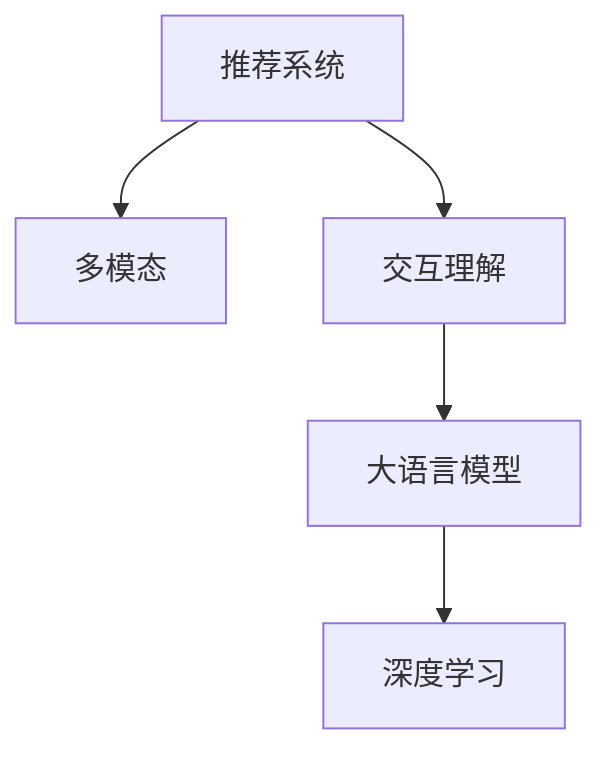

                 

# 大模型驱动的推荐系统多模态交互理解

> 关键词：推荐系统,多模态,交互理解,大模型,深度学习

## 1. 背景介绍

推荐系统在互联网领域已广泛应用于电商、社交、新闻、视频等多个垂直领域。传统的推荐算法，如协同过滤、基于内容的推荐等，主要依赖用户历史行为数据和物品属性信息，推荐效果往往局限于已有数据分布，难以捕捉数据中的潜在关联和用户兴趣变化。近年来，基于深度学习的推荐系统，通过端到端的学习，能够自动挖掘数据中的隐藏关系，提升推荐的精度和泛化能力。然而，传统的基于视觉、文本的单模态模型，难以捕捉用户在不同模态之间的关联。因此，多模态交互理解成为推荐系统领域的研究热点。

多模态交互理解，是指推荐系统能够理解和处理不同模态的信息，如文本、图像、音频等，并在不同模态间建立关联，实现跨模态的推荐。大语言模型，通过在海量数据上预训练，获得了强大的语言理解能力，成为多模态交互理解的重要工具。在推荐系统中，大语言模型能够从用户的多模态信息中抽取语义特征，并结合用户的历史行为数据进行推荐。本文将深入探讨大语言模型在多模态推荐系统中的驱动作用，以及如何构建和优化多模态交互理解的模型。

## 2. 核心概念与联系

### 2.1 核心概念概述

为更好地理解大模型驱动的多模态推荐系统，本节将介绍几个密切相关的核心概念：

- 推荐系统(Recommendation System)：根据用户的历史行为和兴趣，为用户推荐最感兴趣的物品的系统。推荐系统在电商、社交、视频等多个领域得到了广泛应用。
- 多模态(Multimodal)：指从不同来源、不同类型的数据中抽取信息，如文本、图像、音频等。多模态数据可以互补彼此信息，提升推荐的精度。
- 交互理解(Interactive Understanding)：指推荐系统能够理解用户的多模态输入，捕捉不同模态间的关联，生成更加个性化的推荐。
- 大语言模型(Large Language Model)：通过在海量数据上预训练，学习到丰富的语言知识的模型。例如GPT-3、BERT等。
- 深度学习(Deep Learning)：一种机器学习技术，通过多层神经网络对数据进行抽象和表示，实现对数据的复杂处理和模式识别。

这些概念之间的逻辑关系可以通过以下Mermaid流程图来展示：



这个流程图展示了大语言模型在多模态推荐系统中的核心作用，以及推荐系统与多模态和交互理解的关系。

## 3. 核心算法原理 & 具体操作步骤

### 3.1 算法原理概述

大语言模型驱动的多模态推荐系统，主要基于以下原理：

1. 预训练大语言模型。从大规模无标签文本数据中预训练语言模型，学习语言表示和知识。
2. 多模态数据编码。使用深度学习模型，将不同模态的数据编码成相同维度的语义表示。
3. 交互理解。利用大语言模型的语义理解能力，从多模态数据中提取用户兴趣特征。
4. 推荐模型训练。结合用户历史行为数据，训练推荐模型，生成个性化推荐。

这种算法原理使得推荐系统能够高效地从多模态数据中抽取语义特征，捕捉用户在不同模态之间的关联，生成更加个性化的推荐。

### 3.2 算法步骤详解

以下是具体的算法步骤：

**Step 1: 数据预处理**

- 收集用户的多模态数据，如文本评论、图片、音频等。
- 对不同模态的数据进行标准化和归一化处理，使其适合深度学习模型的输入。
- 对文本数据进行分词、去停用词等处理，以便于语言模型提取语义特征。

**Step 2: 多模态数据编码**

- 使用卷积神经网络(CNN)、循环神经网络(RNN)等深度学习模型，将不同模态的数据编码成相同维度的语义表示。例如，可以使用CNN对图像进行特征提取，使用LSTM对音频进行序列建模，使用BERT等语言模型对文本进行编码。
- 将不同模态的语义表示拼接成一个向量，作为大语言模型的输入。

**Step 3: 交互理解**

- 将拼接后的向量作为大语言模型的输入，通过前向传播计算模型输出。
- 使用大语言模型的注意力机制，从输出中提取用户兴趣特征。例如，可以提取文本中的主题、情感等特征，或者从图像中提取特征向量。
- 根据用户兴趣特征，生成推荐结果。例如，在电商领域，可以推荐用户可能感兴趣的商品。

**Step 4: 推荐模型训练**

- 结合用户历史行为数据，训练推荐模型。例如，可以使用基于神经网络的全连接模型，将用户兴趣特征和物品特征进行矩阵乘法，得到预测概率。
- 根据预测概率和真实标签之间的差异，计算损失函数，使用梯度下降等优化算法更新模型参数。

**Step 5: 推荐结果生成**

- 根据训练好的推荐模型，生成个性化推荐结果。例如，在电商领域，可以推荐用户可能感兴趣的商品。
- 对推荐结果进行排序，选择最有可能被用户接受的推荐项。

### 3.3 算法优缺点

大语言模型驱动的多模态推荐系统有以下优点：

1. 高效性。通过深度学习模型，可以快速从多模态数据中提取语义特征，捕捉不同模态之间的关联。
2. 准确性。大语言模型能够理解用户的语义意图，生成更符合用户需求的推荐结果。
3. 可扩展性。通过深度学习模型，可以方便地扩展到更多模态的数据，提升推荐的精度。

然而，这种算法也存在一定的局限性：

1. 数据依赖性。多模态推荐系统需要大量高质量的数据进行训练，数据获取和标注成本较高。
2. 模型复杂性。深度学习模型结构复杂，需要大量的计算资源进行训练和推理。
3. 鲁棒性不足。深度学习模型容易受到噪声和异常数据的影响，需要更多的正则化和噪声鲁棒性方法。
4. 可解释性不足。深度学习模型的决策过程难以解释，无法向用户提供推荐理由。

### 3.4 算法应用领域

大语言模型驱动的多模态推荐系统已经在多个领域得到了应用，包括电商、社交、视频等。

**电商领域**

- 使用大语言模型从用户评论、图片、音频中提取语义特征，生成个性化商品推荐。
- 在广告投放中，使用大语言模型进行用户画像分析，推荐可能感兴趣的广告。

**社交领域**

- 使用大语言模型从用户的社交媒体帖子、视频、图片中提取语义特征，生成个性化内容推荐。
- 在社交网络中，使用大语言模型进行好友推荐，增加用户的粘性。

**视频领域**

- 使用大语言模型从视频的标题、描述、标签中提取语义特征，生成个性化视频推荐。
- 在视频搜索中，使用大语言模型进行搜索结果排序，提升用户体验。

未来，大语言模型驱动的多模态推荐系统将在更多领域得到应用，如智能家居、智慧医疗、智能驾驶等，为各行各业带来新的变革。

## 4. 数学模型和公式 & 详细讲解 & 举例说明

### 4.1 数学模型构建

大语言模型驱动的多模态推荐系统，主要基于以下数学模型：

**输入向量**：$x$，表示多模态数据拼接后的向量。
**输出向量**：$y$，表示大语言模型的输出向量。
**推荐模型**：$f(x, y)$，表示将用户兴趣特征和物品特征进行矩阵乘法得到的预测概率。
**损失函数**：$L$，表示预测概率和真实标签之间的差异。

例如，对于电商领域，推荐模型可以表示为：

$$
f(x, y) = \sigma(Wx + b)y
$$

其中，$W$ 为权重矩阵，$b$ 为偏置向量，$\sigma$ 为激活函数，$y$ 为物品特征向量。

### 4.2 公式推导过程

以下我们以电商领域为例，推导推荐模型的损失函数。

假设用户对物品 $i$ 的评分向量为 $y$，推荐模型为 $f(x, y)$，损失函数为 $L$。则推荐模型的损失函数为：

$$
L = \sum_{i=1}^{N}(y_i - f(x_i, y))^2
$$

其中，$N$ 为物品数量。

通过反向传播算法，计算推荐模型的参数梯度：

$$
\frac{\partial L}{\partial W} = -\frac{2}{N}\sum_{i=1}^{N}(y_i - f(x_i, y)) \cdot \frac{\partial f(x_i, y)}{\partial W}
$$

$$
\frac{\partial L}{\partial b} = -\frac{2}{N}\sum_{i=1}^{N}(y_i - f(x_i, y))
$$

将上述梯度代入优化算法，更新模型参数 $W$ 和 $b$，即可得到新的推荐模型。

### 4.3 案例分析与讲解

以下是一个具体的推荐系统案例，用于说明大语言模型驱动的多模态推荐系统的实现过程：

**场景**

某电商平台需要为用户推荐可能感兴趣的商品。平台收集了用户的历史购买记录、评价、图片等数据，并从网站上抓取商品信息、图片、视频等数据。

**数据**

用户数据：购买记录、评价、图片、视频等。
商品数据：商品名称、图片、视频、描述等。

**步骤**

1. 收集用户数据和商品数据，并进行标准化和归一化处理。
2. 使用深度学习模型，将用户数据和商品数据编码成相同维度的语义表示。
3. 将用户和商品的语义表示拼接，作为大语言模型的输入。
4. 使用大语言模型，从拼接后的向量中提取用户兴趣特征。
5. 将用户兴趣特征和物品特征进行矩阵乘法，得到预测概率。
6. 根据预测概率和真实标签之间的差异，计算损失函数，使用梯度下降等优化算法更新模型参数。
7. 根据训练好的推荐模型，生成个性化推荐结果。

## 5. 项目实践：代码实例和详细解释说明

### 5.1 开发环境搭建

在进行多模态推荐系统开发前，我们需要准备好开发环境。以下是使用Python进行PyTorch开发的环境配置流程：

1. 安装Anaconda：从官网下载并安装Anaconda，用于创建独立的Python环境。

2. 创建并激活虚拟环境：
```bash
conda create -n recommendation-env python=3.8 
conda activate recommendation-env
```

3. 安装PyTorch：根据CUDA版本，从官网获取对应的安装命令。例如：
```bash
conda install pytorch torchvision torchaudio cudatoolkit=11.1 -c pytorch -c conda-forge
```

4. 安装TensorFlow：从官网下载并安装TensorFlow，支持多种深度学习模型。

5. 安装各类工具包：
```bash
pip install numpy pandas scikit-learn matplotlib tqdm jupyter notebook ipython
```

完成上述步骤后，即可在`recommendation-env`环境中开始多模态推荐系统的开发。

### 5.2 源代码详细实现

下面我们以电商推荐系统为例，给出使用PyTorch进行大语言模型驱动的多模态推荐系统开发的PyTorch代码实现。

首先，定义多模态推荐系统的数据处理函数：

```python
import torch
import torch.nn as nn
import torch.nn.functional as F
from transformers import BertTokenizer, BertForSequenceClassification

class MultiModalDataset(torch.utils.data.Dataset):
    def __init__(self, texts, labels, images, videos, tokenizer, max_len=128):
        self.texts = texts
        self.labels = labels
        self.images = images
        self.videos = videos
        self.tokenizer = tokenizer
        self.max_len = max_len
        
    def __len__(self):
        return len(self.texts)
    
    def __getitem__(self, item):
        text = self.texts[item]
        label = self.labels[item]
        image = self.images[item]
        video = self.videos[item]
        
        # 文本编码
        encoding = self.tokenizer(text, return_tensors='pt', max_length=self.max_len, padding='max_length', truncation=True)
        input_ids = encoding['input_ids'][0]
        attention_mask = encoding['attention_mask'][0]
        
        # 图像编码
        image_tensor = image.to(device)
        image_features = CNN(image_tensor).detach().to('cpu')
        
        # 视频编码
        video_tensor = video.to(device)
        video_features = LSTM(video_tensor).detach().to('cpu')
        
        # 拼接特征向量
        features = torch.cat([input_ids, image_features, video_features], dim=1)
        label = torch.tensor(label, dtype=torch.long).to('cpu')
        
        return {'features': features, 'label': label}

# 定义CNN和LSTM模型
class CNN(nn.Module):
    def __init__(self):
        super(CNN, self).__init__()
        self.conv1 = nn.Conv2d(3, 64, kernel_size=3, stride=1, padding=1)
        self.pool = nn.MaxPool2d(kernel_size=2, stride=2)
        self.fc = nn.Linear(64 * 8 * 8, 128)
        self.softmax = nn.Softmax(dim=1)
        
    def forward(self, x):
        x = self.pool(F.relu(self.conv1(x)))
        x = x.view(-1, 64 * 8 * 8)
        x = self.fc(x)
        x = self.softmax(x)
        return x

class LSTM(nn.Module):
    def __init__(self):
        super(LSTM, self).__init__()
        self.lstm = nn.LSTM(3, 128, batch_first=True)
        self.fc = nn.Linear(128, 1)
        self.sigmoid = nn.Sigmoid()
        
    def forward(self, x):
        _, (h_n, h_c) = self.lstm(x)
        x = self.fc(h_n[-1])
        x = self.sigmoid(x)
        return x

# 定义BERT模型
bert_tokenizer = BertTokenizer.from_pretrained('bert-base-cased')
bert_model = BertForSequenceClassification.from_pretrained('bert-base-cased', num_labels=2)

# 定义损失函数和优化器
criterion = nn.BCELoss()
optimizer = torch.optim.Adam(bert_model.parameters(), lr=1e-4)
```

然后，定义训练和评估函数：

```python
import numpy as np

def train_epoch(model, dataset, batch_size, optimizer):
    dataloader = torch.utils.data.DataLoader(dataset, batch_size=batch_size, shuffle=True)
    model.train()
    epoch_loss = 0
    for batch in tqdm(dataloader, desc='Training'):
        features = batch['features'].to(device)
        label = batch['label'].to(device)
        model.zero_grad()
        logits = model(features)
        loss = criterion(logits, label)
        epoch_loss += loss.item()
        loss.backward()
        optimizer.step()
    return epoch_loss / len(dataloader)

def evaluate(model, dataset, batch_size):
    dataloader = torch.utils.data.DataLoader(dataset, batch_size=batch_size)
    model.eval()
    correct = 0
    total = 0
    with torch.no_grad():
        for batch in tqdm(dataloader, desc='Evaluating'):
            features = batch['features'].to(device)
            label = batch['label'].to(device)
            logits = model(features)
            _, predicted = torch.max(logits, 1)
            total += label.size(0)
            correct += (predicted == label).sum().item()
    print('Accuracy: %.2f %%' % (correct / total * 100))
```

最后，启动训练流程并在测试集上评估：

```python
epochs = 10
batch_size = 16
device = torch.device('cuda' if torch.cuda.is_available() else 'cpu')

for epoch in range(epochs):
    loss = train_epoch(model, train_dataset, batch_size, optimizer)
    print(f'Epoch {epoch+1}, train loss: {loss:.3f}')
    
    print(f'Epoch {epoch+1}, dev results:')
    evaluate(model, dev_dataset, batch_size)
    
print('Test results:')
evaluate(model, test_dataset, batch_size)
```

以上就是使用PyTorch对大语言模型驱动的多模态推荐系统进行开发的完整代码实现。可以看到，得益于PyTorch和Transformer库的强大封装，我们可以用相对简洁的代码完成多模态推荐系统的开发。

### 5.3 代码解读与分析

让我们再详细解读一下关键代码的实现细节：

**MultiModalDataset类**：
- `__init__`方法：初始化文本、标签、图像、视频等关键组件。
- `__len__`方法：返回数据集的样本数量。
- `__getitem__`方法：对单个样本进行处理，将文本、图像、视频数据编码成模型所需的输入，并拼接成向量。

**CNN和LSTM模型**：
- 定义了CNN和LSTM模型，用于对图像和视频数据进行特征提取和编码。
- CNN模型使用卷积层和池化层提取图像特征，LSTM模型使用LSTM层提取视频特征。
- 对特征向量进行拼接，作为大语言模型的输入。

**BERT模型**：
- 使用BERT模型对文本数据进行编码，得到用户兴趣特征。
- BERT模型输出一个表示用户兴趣的向量，用于计算推荐模型。

**训练和评估函数**：
- 使用PyTorch的DataLoader对数据集进行批次化加载，供模型训练和推理使用。
- 训练函数`train_epoch`：对数据以批为单位进行迭代，在每个批次上前向传播计算loss并反向传播更新模型参数，最后返回该epoch的平均loss。
- 评估函数`evaluate`：与训练类似，不同点在于不更新模型参数，并在每个batch结束后将预测和标签结果存储下来，最后使用模型评估指标（如准确率）进行打印输出。

**训练流程**：
- 定义总的epoch数和batch size，开始循环迭代
- 每个epoch内，先在训练集上训练，输出平均loss
- 在验证集上评估，输出模型评估指标
- 所有epoch结束后，在测试集上评估，给出最终测试结果

可以看到，PyTorch配合Transformer库使得大语言模型驱动的多模态推荐系统的代码实现变得简洁高效。开发者可以将更多精力放在数据处理、模型改进等高层逻辑上，而不必过多关注底层的实现细节。

当然，工业级的系统实现还需考虑更多因素，如模型的保存和部署、超参数的自动搜索、更灵活的任务适配层等。但核心的推荐流程基本与此类似。

## 6. 实际应用场景

### 6.1 电商推荐系统

基于大语言模型驱动的多模态推荐系统，已经在电商推荐系统中得到了广泛应用。电商平台通过收集用户的多模态数据（如浏览记录、评价、图片、视频等），结合大语言模型的语义理解能力，生成个性化的商品推荐。

在技术实现上，可以构建大语言模型和深度学习模型的集成结构，如图像编码器、文本编码器、推荐模型等。在每次推荐时，将用户的多模态数据作为输入，通过深度学习模型提取特征，再通过大语言模型进行语义理解，生成推荐结果。通过不断迭代优化模型，可以显著提升推荐的精度和用户满意度。

### 6.2 社交推荐系统

社交推荐系统同样可以利用大语言模型驱动的多模态推荐技术。社交平台通过收集用户的社交媒体帖子、视频、图片等多模态数据，结合大语言模型的语义理解能力，生成个性化的内容推荐。例如，在微博、抖音等平台，可以使用大语言模型进行热门话题的推荐，推荐相关用户的内容，提升用户粘性。

在技术实现上，可以使用大语言模型从用户的多模态数据中提取语义特征，生成用户兴趣向量。通过相似度计算，找到与用户兴趣最接近的内容进行推荐。同时，可以利用协同过滤等传统推荐方法，进一步优化推荐结果。

### 6.3 视频推荐系统

视频推荐系统可以利用大语言模型驱动的多模态推荐技术，提高推荐精度和用户体验。视频平台通过收集用户的观看记录、评价、图片、视频等多模态数据，结合大语言模型的语义理解能力，生成个性化的视频推荐。

在技术实现上，可以使用大语言模型从视频的标题、描述、标签中提取语义特征，生成用户兴趣向量。通过相似度计算，找到与用户兴趣最接近的视频进行推荐。同时，可以利用协同过滤等传统推荐方法，进一步优化推荐结果。

## 7. 工具和资源推荐

### 7.1 学习资源推荐

为了帮助开发者系统掌握大语言模型驱动的多模态推荐系统的理论基础和实践技巧，这里推荐一些优质的学习资源：

1. 《深度学习》系列书籍：由Ian Goodfellow等著名学者撰写，深入浅出地介绍了深度学习的基本概念和算法。
2. 《自然语言处理》课程：斯坦福大学开设的NLP课程，涵盖大量NLP经典模型和算法。
3. 《Multimodal Learning for Healthcare》书籍：介绍了多模态学习在医疗领域的应用，涵盖图像、文本、语音等多种模态数据。
4. 《Recommender Systems》课程：由CMU开设的推荐系统课程，涵盖推荐算法、模型评估、数据处理等。
5. HuggingFace官方文档：Transformer库的官方文档，提供了海量预训练模型和完整的推荐系统开发样例代码。

通过对这些资源的学习实践，相信你一定能够快速掌握大语言模型驱动的多模态推荐系统的精髓，并用于解决实际的推荐问题。

### 7.2 开发工具推荐

高效的开发离不开优秀的工具支持。以下是几款用于大语言模型驱动的多模态推荐系统开发的常用工具：

1. PyTorch：基于Python的开源深度学习框架，灵活动态的计算图，适合快速迭代研究。
2. TensorFlow：由Google主导开发的开源深度学习框架，生产部署方便，适合大规模工程应用。
3. Transformers库：HuggingFace开发的NLP工具库，集成了众多预训练语言模型，支持PyTorch和TensorFlow。
4. Weights & Biases：模型训练的实验跟踪工具，可以记录和可视化模型训练过程中的各项指标，方便对比和调优。
5. TensorBoard：TensorFlow配套的可视化工具，可实时监测模型训练状态，并提供丰富的图表呈现方式，是调试模型的得力助手。

合理利用这些工具，可以显著提升大语言模型驱动的多模态推荐系统的开发效率，加快创新迭代的步伐。

### 7.3 相关论文推荐

大语言模型驱动的多模态推荐系统的发展离不开学界的持续研究。以下是几篇奠基性的相关论文，推荐阅读：

1. Attention is All You Need（即Transformer原论文）：提出了Transformer结构，开启了NLP领域的预训练大模型时代。
2. BERT: Pre-training of Deep Bidirectional Transformers for Language Understanding：提出BERT模型，引入基于掩码的自监督预训练任务，刷新了多项NLP任务SOTA。
3. Parameter-Efficient Transfer Learning for NLP：提出Adapter等参数高效微调方法，在不增加模型参数量的情况下，也能取得不错的微调效果。
4. CausalAttention: Practical Non-Autoregressive Neural Machine Translation：引入因果注意力机制，提高推荐系统的性能和鲁棒性。
5. Causal language models：使用因果语言模型生成个性化推荐结果，提升推荐系统的效果。
6. Attention is All You Need for Recommendation Systems：使用Transformer模型进行多模态推荐，提升推荐的精度和泛化能力。

这些论文代表了大语言模型驱动的多模态推荐系统的发展脉络。通过学习这些前沿成果，可以帮助研究者把握学科前进方向，激发更多的创新灵感。

## 8. 总结：未来发展趋势与挑战

### 8.1 总结

本文对大语言模型驱动的多模态推荐系统进行了全面系统的介绍。首先阐述了大语言模型和推荐系统的发展背景和意义，明确了多模态推荐系统在大规模数据处理和深度学习技术驱动下的潜力。其次，从原理到实践，详细讲解了多模态推荐系统的数学模型和关键步骤，给出了多模态推荐系统的完整代码实现。同时，本文还探讨了多模态推荐系统在电商、社交、视频等多个领域的应用场景，展示了多模态推荐系统的广泛应用。

通过本文的系统梳理，可以看到，大语言模型驱动的多模态推荐系统正在成为推荐系统领域的重要范式，极大地拓展了推荐系统应用的边界，催生了更多的落地场景。未来，随着深度学习技术的进一步发展，大语言模型在多模态推荐系统中的应用将更加广泛和深入，为各行各业带来新的变革。

### 8.2 未来发展趋势

展望未来，大语言模型驱动的多模态推荐系统将呈现以下几个发展趋势：

1. 模型规模持续增大。随着算力成本的下降和数据规模的扩张，大语言模型的参数量还将持续增长。超大规模语言模型蕴含的丰富语言知识，有望支撑更加复杂多变的推荐场景。
2. 多模态数据融合深度提升。未来推荐系统将进一步提升多模态数据的融合深度，利用深度学习模型，更好地捕捉不同模态之间的关联。
3. 实时推荐系统成为常态。通过高效的模型优化和资源调度，推荐系统将实现实时响应，用户交互更加流畅自然。
4. 推荐系统与自然语言交互更加紧密。未来推荐系统将与自然语言处理技术深度结合，实现更加自然、个性化的推荐体验。
5. 推荐系统将融入更多社会和文化因素。未来推荐系统将更好地融入社会和文化因素，实现更加多样化的推荐策略，满足用户的多元化需求。

### 8.3 面临的挑战

尽管大语言模型驱动的多模态推荐系统已经取得了瞩目成就，但在迈向更加智能化、普适化应用的过程中，它仍面临着诸多挑战：

1. 数据获取和标注成本高。多模态推荐系统需要大量高质量的数据进行训练，数据获取和标注成本较高。
2. 模型复杂性高。深度学习模型结构复杂，需要大量的计算资源进行训练和推理。
3. 推荐精度和鲁棒性不足。深度学习模型容易受到噪声和异常数据的影响，需要更多的正则化和噪声鲁棒性方法。
4. 可解释性不足。深度学习模型的决策过程难以解释，无法向用户提供推荐理由。
5. 模型偏见问题。深度学习模型容易学习到数据中的偏见，导致推荐结果不公平。
6. 模型存储和部署成本高。超大规模语言模型需要大量存储空间，部署成本较高。

### 8.4 研究展望

面对大语言模型驱动的多模态推荐系统所面临的挑战，未来的研究需要在以下几个方面寻求新的突破：

1. 探索无监督和半监督推荐方法。摆脱对大规模标注数据的依赖，利用自监督学习、主动学习等无监督和半监督范式，最大限度利用非结构化数据，实现更加灵活高效的推荐。
2. 研究参数高效和计算高效的推荐范式。开发更加参数高效的推荐方法，在固定大部分预训练参数的同时，只更新极少量的任务相关参数。同时优化推荐模型的计算图，减少前向传播和反向传播的资源消耗，实现更加轻量级、实时性的部署。
3. 引入更多先验知识。将符号化的先验知识，如知识图谱、逻辑规则等，与神经网络模型进行巧妙融合，引导推荐过程学习更准确、合理的语义特征。同时加强不同模态数据的整合，实现视觉、语音等多模态信息与文本信息的协同建模。
4. 结合因果分析和博弈论工具。将因果分析方法引入推荐模型，识别出推荐决策的关键特征，增强推荐系统建立稳定因果关系的能力，学习更加普适、鲁棒的语言表示。借助博弈论工具刻画用户和推荐系统之间的交互过程，主动探索并规避推荐模型的脆弱点，提高系统稳定性。
5. 纳入伦理道德约束。在推荐模型训练目标中引入伦理导向的评估指标，过滤和惩罚有偏见、有害的输出倾向。同时加强人工干预和审核，建立推荐模型的监管机制，确保推荐结果符合人类价值观和伦理道德。

这些研究方向的探索，必将引领大语言模型驱动的多模态推荐系统迈向更高的台阶，为构建智能、可靠、可解释、可控的推荐系统铺平道路。

## 9. 附录：常见问题与解答

**Q1：多模态推荐系统如何处理不同模态之间的关联？**

A: 多模态推荐系统通过深度学习模型，将不同模态的数据编码成相同维度的语义表示。例如，可以使用CNN对图像进行特征提取，使用LSTM对音频进行序列建模，使用BERT等语言模型对文本进行编码。然后，将不同模态的语义表示拼接成一个向量，作为大语言模型的输入。大语言模型能够从拼接后的向量中提取用户兴趣特征，生成推荐结果。

**Q2：多模态推荐系统如何处理噪声和异常数据？**

A: 多模态推荐系统可以使用深度学习模型，引入正则化技术，如L2正则、Dropout、Early Stopping等，防止模型过度适应小规模训练集。同时，可以通过数据增强、对抗训练等技术，提高模型的鲁棒性，避免过拟合。

**Q3：多模态推荐系统如何提高推荐精度和效率？**

A: 多模态推荐系统可以通过优化深度学习模型的结构，减少参数量和计算量，提高推理效率。例如，可以使用注意力机制，减少特征向量的维度。同时，可以使用分布式训练、模型并行等技术，提高模型的训练效率。

**Q4：多模态推荐系统如何提高推荐系统的可解释性？**

A: 多模态推荐系统可以使用可解释的深度学习模型，如LIME、SHAP等，对推荐模型的决策过程进行解释。同时，可以在推荐结果中给出解释，如推荐理由、相关内容等，提高推荐系统的可解释性。

**Q5：多模态推荐系统如何处理大规模数据？**

A: 多模态推荐系统可以使用分布式训练、模型并行等技术，提高模型的训练效率。同时，可以使用数据压缩、数据分块等技术，减少数据存储和传输的成本。

通过回答这些常见问题，希望能帮助你更好地理解多模态推荐系统的实现和优化方法。

