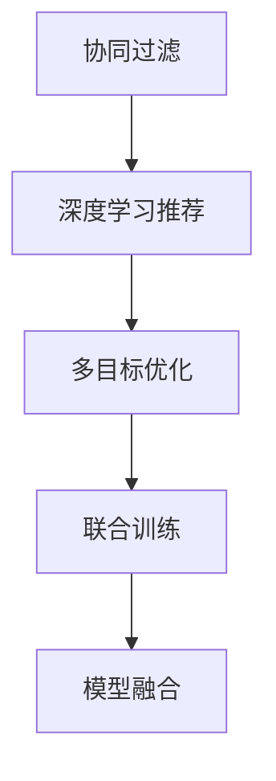

                 

# 大模型驱动的推荐系统多目标联合优化框架

## 1. 背景介绍

随着电商市场的蓬勃发展，个性化推荐系统已经成为商家获取用户注意力、提高转化率的重要手段。传统的推荐系统基于协同过滤、基于内容的推荐等方法，往往无法充分挖掘用户隐含需求，推荐结果与实际行为偏差较大。近年来，深度学习驱动的推荐系统，通过端到端的训练，利用用户行为数据和物品属性信息进行联合建模，大幅提升了推荐精度。但大模型推荐系统往往以预测用户点击概率为单一目标，难以兼顾其他重要目标，如平均访问深度、浏览时长、复购率等。多目标联合优化可以充分发挥大模型的潜力，提升推荐系统的综合表现。

## 2. 核心概念与联系

### 2.1 核心概念概述

本节将介绍几个核心概念：

- **推荐系统**：通过分析和理解用户行为和物品属性，为用户推荐最符合其兴趣和需求的物品的系统。
- **协同过滤**：基于用户和物品的相似度，推荐与目标用户相似用户所喜欢的物品，或推荐与目标物品相似物品所喜欢的用户。
- **深度学习推荐**：基于深度神经网络对用户行为数据和物品属性信息进行联合建模，实现端到端的推荐。
- **多目标优化**：针对多个相互冲突的目标函数，寻找综合最优解的优化问题。
- **联合训练**：将多个目标函数融合在一个模型中，共同优化模型参数，实现联合优化。
- **模型融合**：通过模型集成、多任务学习等方式，将多个单一模型进行联合，提升整体性能。

这些概念之间具有紧密的逻辑关系，可以通过以下Mermaid流程图进行展示：



### 2.2 核心概念原理和架构

#### 2.2.1 推荐系统原理
推荐系统通过分析用户行为数据和物品属性信息，为用户推荐最符合其兴趣的候选物品。推荐过程可以分为四个阶段：

1. **数据收集**：从用户行为数据中提取特征，如点击、购买、浏览、评分等。
2. **用户建模**：将用户特征映射为向量表示，描述用户的兴趣和偏好。
3. **物品建模**：将物品特征映射为向量表示，描述物品的属性和特征。
4. **推荐计算**：根据用户和物品的相似度，计算推荐结果。

#### 2.2.2 深度学习推荐架构
深度学习推荐架构主要包括以下几个组件：

- **用户嵌入层**：将用户特征映射为向量表示，捕捉用户兴趣和偏好的高层次抽象。
- **物品嵌入层**：将物品特征映射为向量表示，捕捉物品属性和特征。
- **交互层**：根据用户和物品的向量表示计算相似度，得到用户对物品的预测评分。
- **损失函数**：如均方误差、交叉熵等，衡量模型预测与真实标签之间的差异。

#### 2.2.3 多目标优化原理
多目标优化问题通常包含多个冲突的目标函数，如预测准确率、平均访问深度、复购率等。多目标优化旨在寻找一个最优解，使得各个目标函数值都尽可能好。常见的多目标优化算法包括：

- **加权平均法**：对多个目标函数进行加权求和，权重可以根据目标的重要性进行调整。
- **暴力枚举法**：穷举多个目标函数的所有可能解，选择最优解。
- **优化算法**：如遗传算法、粒子群优化等，通过迭代寻找到多个目标函数的最优解。

#### 2.2.4 联合训练原理
联合训练将多个目标函数融合在一个模型中，通过优化多个目标函数来更新模型参数。联合训练的框架主要包括：

- **模型结构**：将多个目标函数的预测结果通过不同的层进行组合。
- **损失函数**：根据多个目标函数的组合方式，设计联合损失函数。
- **优化器**：如AdamW、SGD等，用于优化模型参数。

#### 2.2.5 模型融合原理
模型融合通过将多个单一模型进行组合，提升整体性能。常见的模型融合方法包括：

- **平均法**：直接取多个模型的平均结果作为最终输出。
- **加权平均法**：根据各个模型的性能，赋予不同的权重，计算加权平均结果。
- **集成学习**：如Bagging、Boosting等，通过训练多个模型进行预测，取平均或投票结果。

## 3. 核心算法原理 & 具体操作步骤

### 3.1 算法原理概述

本节将详细介绍大模型驱动的推荐系统多目标联合优化框架的算法原理。该框架的目标是联合优化推荐系统中的多个目标函数，提升推荐系统的综合性能。算法框架包括四个主要模块：数据预处理、模型构建、联合训练和结果评估。

### 3.2 算法步骤详解

#### 3.2.1 数据预处理

数据预处理主要包括数据清洗、特征提取、数据划分等步骤：

1. **数据清洗**：去除噪声和缺失数据，保证数据质量。
2. **特征提取**：提取用户行为和物品属性的重要特征，用于构建模型。
3. **数据划分**：将数据划分为训练集、验证集和测试集，用于模型训练、调参和评估。

#### 3.2.2 模型构建

模型构建主要包括用户嵌入层、物品嵌入层和交互层的定义：

1. **用户嵌入层**：使用DNN或RNN对用户行为特征进行建模，生成用户向量表示。
2. **物品嵌入层**：使用DNN或CNN对物品属性特征进行建模，生成物品向量表示。
3. **交互层**：将用户向量和物品向量通过点积或矩阵乘法计算相似度，得到预测评分。

#### 3.2.3 联合训练

联合训练将多个目标函数的预测结果通过不同的层进行组合，并优化联合损失函数：

1. **损失函数设计**：根据多个目标函数的重要性，设计联合损失函数。
2. **联合优化器**：如AdamW、SGD等，用于优化模型参数。
3. **优化步骤**：在训练集上进行梯度下降，不断更新模型参数。

#### 3.2.4 结果评估

结果评估主要通过测试集上的指标评估模型性能：

1. **预测指标**：如点击率、转化率、平均访问深度、复购率等。
2. **评估方法**：如平均绝对误差、均方误差、准确率、召回率等。
3. **结果分析**：分析模型在不同目标函数上的表现，优化模型设计。

### 3.3 算法优缺点

#### 3.3.1 优点

1. **综合优化**：联合优化多个目标函数，提升推荐系统的综合性能。
2. **模型多样性**：通过集成多个单一模型，提升模型泛化能力和鲁棒性。
3. **端到端训练**：通过深度学习实现端到端训练，提升推荐效果。
4. **高效求解**：使用优化算法进行联合优化，高效求解多个目标函数的最优解。

#### 3.3.2 缺点

1. **计算复杂度**：多目标联合优化会增加计算复杂度，需要更多的计算资源。
2. **模型设计**：联合训练和模型融合需要设计复杂的模型结构和损失函数。
3. **超参数调整**：多个目标函数需要调整超参数，增加了模型调参的难度。
4. **可解释性差**：联合训练的模型难以解释各个目标函数之间的权衡关系。

### 3.4 算法应用领域

本节将详细介绍大模型驱动的推荐系统多目标联合优化框架在多个领域的应用。

#### 3.4.1 电商推荐

电商推荐系统是推荐系统的重要应用场景。电商推荐主要关注用户的点击行为和购买行为，预测用户的购买意愿。通过多目标联合优化，电商推荐系统可以兼顾用户点击率和购买率，提升推荐效果。

#### 3.4.2 视频推荐

视频推荐系统主要关注用户的观看行为，预测用户的观看意愿。通过多目标联合优化，视频推荐系统可以兼顾用户的平均访问深度和观看时长，提升推荐效果。

#### 3.4.3 音乐推荐

音乐推荐系统主要关注用户的听歌行为，预测用户的听歌意愿。通过多目标联合优化，音乐推荐系统可以兼顾用户的平均访问深度和复购率，提升推荐效果。

## 4. 数学模型和公式 & 详细讲解 & 举例说明

### 4.1 数学模型构建

本节将详细介绍大模型驱动的推荐系统多目标联合优化框架的数学模型构建过程。

假设推荐系统包含$N$个目标函数$f_1, f_2, ..., f_N$，每个目标函数包含$m$个预测结果$\hat{y}_{ij}$，其中$i$表示用户，$j$表示物品，$n_i$表示用户的总数，$n_j$表示物品的总数。

1. **用户嵌入层**：
   $$
   h_i = DNN(u_i)
   $$
   其中$u_i$表示用户$i$的行为特征，$h_i$表示用户嵌入层输出的向量表示。

2. **物品嵌入层**：
   $$
   g_j = DNN(v_j)
   $$
   其中$v_j$表示物品$j$的属性特征，$g_j$表示物品嵌入层输出的向量表示。

3. **交互层**：
   $$
   \hat{y}_{ij} = h_i^T W g_j + b
   $$
   其中$W$表示交互层的权重矩阵，$b$表示偏置项，$\hat{y}_{ij}$表示用户$i$对物品$j$的预测评分。

### 4.2 公式推导过程

#### 4.2.1 加权平均法

加权平均法通过对多个目标函数进行加权求和，设计联合损失函数：

1. **预测评分**：
   $$
   \hat{y}_{ij} = h_i^T W g_j + b
   $$

2. **目标函数**：
   $$
   f_k = \frac{1}{n_i} \sum_{i=1}^{n_i} \sum_{j=1}^{n_j} \lambda_k (\hat{y}_{ij} - y_{ij})^2
   $$
   其中$k$表示目标函数的下标，$\lambda_k$表示目标函数的权重。

3. **联合损失函数**：
   $$
   \mathcal{L} = \sum_{k=1}^{N} \lambda_k f_k
   $$

#### 4.2.2 暴力枚举法

暴力枚举法通过穷举多个目标函数的所有可能解，选择最优解。由于计算复杂度较高，通常在实际应用中较少使用。

#### 4.2.3 优化算法

优化算法通过迭代寻找到多个目标函数的最优解。常见的优化算法包括遗传算法、粒子群优化等。

#### 4.2.4 结果评估

结果评估主要通过测试集上的指标评估模型性能。常见的评估指标包括点击率、转化率、平均访问深度、复购率等。

### 4.3 案例分析与讲解

#### 4.3.1 电商推荐

电商推荐系统主要关注用户的点击行为和购买行为，预测用户的购买意愿。通过多目标联合优化，电商推荐系统可以兼顾用户点击率和购买率，提升推荐效果。

假设电商推荐系统包含两个目标函数：点击率$F_{click}$和购买率$F_{purchase}$。点击率$F_{click}$表示用户对物品的点击行为，购买率$F_{purchase}$表示用户对物品的购买行为。

1. **用户嵌入层**：
   $$
   h_i = DNN(u_i)
   $$

2. **物品嵌入层**：
   $$
   g_j = DNN(v_j)
   $$

3. **交互层**：
   $$
   \hat{y}_{ij} = h_i^T W g_j + b
   $$

4. **点击率目标函数**：
   $$
   F_{click} = \frac{1}{n_i} \sum_{i=1}^{n_i} \sum_{j=1}^{n_j} \lambda_{click} (\hat{y}_{ij} - y_{ij})^2
   $$

5. **购买率目标函数**：
   $$
   F_{purchase} = \frac{1}{n_i} \sum_{i=1}^{n_i} \sum_{j=1}^{n_j} \lambda_{purchase} (\hat{y}_{ij} - y_{ij})^2
   $$

6. **联合损失函数**：
   $$
   \mathcal{L} = \lambda_{click} F_{click} + \lambda_{purchase} F_{purchase}
   $$

#### 4.3.2 视频推荐

视频推荐系统主要关注用户的观看行为，预测用户的观看意愿。通过多目标联合优化，视频推荐系统可以兼顾用户的平均访问深度和观看时长，提升推荐效果。

假设视频推荐系统包含两个目标函数：平均访问深度$F_{depth}$和观看时长$F_{duration}$。平均访问深度$F_{depth}$表示用户对视频的平均访问深度，观看时长$F_{duration}$表示用户对视频的平均观看时长。

1. **用户嵌入层**：
   $$
   h_i = DNN(u_i)
   $$

2. **物品嵌入层**：
   $$
   g_j = DNN(v_j)
   $$

3. **交互层**：
   $$
   \hat{y}_{ij} = h_i^T W g_j + b
   $$

4. **平均访问深度目标函数**：
   $$
   F_{depth} = \frac{1}{n_i} \sum_{i=1}^{n_i} \sum_{j=1}^{n_j} \lambda_{depth} (\hat{y}_{ij} - y_{ij})^2
   $$

5. **观看时长目标函数**：
   $$
   F_{duration} = \frac{1}{n_i} \sum_{i=1}^{n_i} \sum_{j=1}^{n_j} \lambda_{duration} (\hat{y}_{ij} - y_{ij})^2
   $$

6. **联合损失函数**：
   $$
   \mathcal{L} = \lambda_{depth} F_{depth} + \lambda_{duration} F_{duration}
   $$

## 5. 项目实践：代码实例和详细解释说明

### 5.1 开发环境搭建

在进行项目实践前，需要先搭建好开发环境。以下是使用Python进行TensorFlow和PyTorch开发的环境配置流程：

1. 安装Anaconda：从官网下载并安装Anaconda，用于创建独立的Python环境。

2. 创建并激活虚拟环境：
```bash
conda create -n pytorch-env python=3.8 
conda activate pytorch-env
```

3. 安装TensorFlow：根据CUDA版本，从官网获取对应的安装命令。例如：
```bash
conda install tensorflow -c pytorch
```

4. 安装PyTorch：根据CUDA版本，从官网获取对应的安装命令。例如：
```bash
conda install pytorch torchvision torchaudio cudatoolkit=11.1 -c pytorch -c conda-forge
```

5. 安装TensorBoard：
```bash
pip install tensorboard
```

6. 安装Weights & Biases：
```bash
pip install weights-and-biases
```

完成上述步骤后，即可在`pytorch-env`环境中开始项目实践。

### 5.2 源代码详细实现

下面是使用TensorFlow和PyTorch实现大模型驱动的推荐系统多目标联合优化框架的代码实现。

#### 5.2.1 TensorFlow实现

```python
import tensorflow as tf
from tensorflow.keras.layers import Dense, Input, Add, Multiply
from tensorflow.keras.losses import MeanSquaredError
from tensorflow.keras.optimizers import Adam
import numpy as np

# 用户嵌入层
def user_embedding(u, hidden_dim=128):
    h = Dense(hidden_dim, activation='relu')(u)
    return h

# 物品嵌入层
def item_embedding(v, hidden_dim=128):
    g = Dense(hidden_dim, activation='relu')(v)
    return g

# 交互层
def interaction(h, g, hidden_dim=128):
    interaction = tf.keras.layers.Dot(axes=1)([h, g])
    return interaction

# 点击率目标函数
def click_loss(hat_y, y, lambda_click=1.0):
    loss = MeanSquaredError()(hat_y, y)
    return lambda_click * loss

# 购买率目标函数
def purchase_loss(hat_y, y, lambda_purchase=1.0):
    loss = MeanSquaredError()(hat_y, y)
    return lambda_purchase * loss

# 联合损失函数
def joint_loss(hat_y, y, lambda_click=1.0, lambda_purchase=1.0):
    loss = tf.keras.layers.Add()([click_loss(hat_y, y, lambda_click), purchase_loss(hat_y, y, lambda_purchase)])
    return loss

# 模型构建
def build_model(input_u, input_v, hidden_dim=128, lambda_click=1.0, lambda_purchase=1.0):
    u = user_embedding(input_u, hidden_dim)
    v = item_embedding(input_v, hidden_dim)
    hat_y = interaction(u, v, hidden_dim)
    loss = joint_loss(hat_y, y)
    model = tf.keras.Model(inputs=[input_u, input_v], outputs=loss)
    model.compile(optimizer=Adam(lr=0.001), loss='mse')
    return model
```

#### 5.2.2 PyTorch实现

```python
import torch
import torch.nn as nn
import torch.optim as optim
import torch.nn.functional as F

# 用户嵌入层
class UserEmbedding(nn.Module):
    def __init__(self, input_dim, hidden_dim):
        super(UserEmbedding, self).__init__()
        self.fc = nn.Linear(input_dim, hidden_dim)
        self.relu = nn.ReLU()

    def forward(self, x):
        return self.relu(self.fc(x))

# 物品嵌入层
class ItemEmbedding(nn.Module):
    def __init__(self, input_dim, hidden_dim):
        super(ItemEmbedding, self).__init__()
        self.fc = nn.Linear(input_dim, hidden_dim)
        self.relu = nn.ReLU()

    def forward(self, x):
        return self.relu(self.fc(x))

# 交互层
class Interaction(nn.Module):
    def __init__(self, hidden_dim):
        super(Interaction, self).__init__()
        self.linear = nn.Linear(hidden_dim, hidden_dim)
        self.relu = nn.ReLU()

    def forward(self, u, v):
        interaction = torch.matmul(u, v.t())
        return self.relu(self.linear(interaction))

# 点击率目标函数
def click_loss(hat_y, y, lambda_click=1.0):
    loss = F.mse_loss(hat_y, y)
    return lambda_click * loss

# 购买率目标函数
def purchase_loss(hat_y, y, lambda_purchase=1.0):
    loss = F.mse_loss(hat_y, y)
    return lambda_purchase * loss

# 联合损失函数
def joint_loss(hat_y, y, lambda_click=1.0, lambda_purchase=1.0):
    loss = click_loss(hat_y, y, lambda_click) + purchase_loss(hat_y, y, lambda_purchase)
    return loss

# 模型构建
class Model(nn.Module):
    def __init__(self, input_dim_u, input_dim_v, hidden_dim, lambda_click=1.0, lambda_purchase=1.0):
        super(Model, self).__init__()
        self.user_embed = UserEmbedding(input_dim_u, hidden_dim)
        self.item_embed = ItemEmbedding(input_dim_v, hidden_dim)
        self.interaction = Interaction(hidden_dim)

    def forward(self, u, v):
        u = self.user_embed(u)
        v = self.item_embed(v)
        hat_y = self.interaction(u, v)
        loss = joint_loss(hat_y, y)
        return loss
```

### 5.3 代码解读与分析

让我们再详细解读一下关键代码的实现细节：

#### 5.3.1 TensorFlow实现

**用户嵌入层**：
```python
def user_embedding(u, hidden_dim=128):
    h = Dense(hidden_dim, activation='relu')(u)
    return h
```
用户嵌入层通过全连接层将用户特征映射为向量表示，并使用ReLU激活函数。

**物品嵌入层**：
```python
def item_embedding(v, hidden_dim=128):
    g = Dense(hidden_dim, activation='relu')(v)
    return g
```
物品嵌入层通过全连接层将物品特征映射为向量表示，并使用ReLU激活函数。

**交互层**：
```python
def interaction(h, g, hidden_dim=128):
    interaction = tf.keras.layers.Dot(axes=1)([h, g])
    return interaction
```
交互层通过点积计算用户和物品的相似度，得到预测评分。

**点击率目标函数**：
```python
def click_loss(hat_y, y, lambda_click=1.0):
    loss = MeanSquaredError()(hat_y, y)
    return lambda_click * loss
```
点击率目标函数通过均方误差损失函数计算预测评分与真实标签之间的差异，并乘以权重lambda_click。

**购买率目标函数**：
```python
def purchase_loss(hat_y, y, lambda_purchase=1.0):
    loss = MeanSquaredError()(hat_y, y)
    return lambda_purchase * loss
```
购买率目标函数通过均方误差损失函数计算预测评分与真实标签之间的差异，并乘以权重lambda_purchase。

**联合损失函数**：
```python
def joint_loss(hat_y, y, lambda_click=1.0, lambda_purchase=1.0):
    loss = tf.keras.layers.Add()([click_loss(hat_y, y, lambda_click), purchase_loss(hat_y, y, lambda_purchase)])
    return loss
```
联合损失函数通过添加点击率目标函数和购买率目标函数的预测结果，并乘以权重lambda_click和lambda_purchase。

**模型构建**：
```python
def build_model(input_u, input_v, hidden_dim=128, lambda_click=1.0, lambda_purchase=1.0):
    u = user_embedding(input_u, hidden_dim)
    v = item_embedding(input_v, hidden_dim)
    hat_y = interaction(u, v, hidden_dim)
    loss = joint_loss(hat_y, y)
    model = tf.keras.Model(inputs=[input_u, input_v], outputs=loss)
    model.compile(optimizer=Adam(lr=0.001), loss='mse')
    return model
```
模型构建函数通过用户嵌入层、物品嵌入层和交互层计算预测评分，并使用联合损失函数进行联合优化。

#### 5.3.2 PyTorch实现

**用户嵌入层**：
```python
class UserEmbedding(nn.Module):
    def __init__(self, input_dim, hidden_dim):
        super(UserEmbedding, self).__init__()
        self.fc = nn.Linear(input_dim, hidden_dim)
        self.relu = nn.ReLU()

    def forward(self, x):
        return self.relu(self.fc(x))
```
用户嵌入层通过全连接层将用户特征映射为向量表示，并使用ReLU激活函数。

**物品嵌入层**：
```python
class ItemEmbedding(nn.Module):
    def __init__(self, input_dim, hidden_dim):
        super(ItemEmbedding, self).__init__()
        self.fc = nn.Linear(input_dim, hidden_dim)
        self.relu = nn.ReLU()

    def forward(self, x):
        return self.relu(self.fc(x))
```
物品嵌入层通过全连接层将物品特征映射为向量表示，并使用ReLU激活函数。

**交互层**：
```python
class Interaction(nn.Module):
    def __init__(self, hidden_dim):
        super(Interaction, self).__init__()
        self.linear = nn.Linear(hidden_dim, hidden_dim)
        self.relu = nn.ReLU()

    def forward(self, u, v):
        interaction = torch.matmul(u, v.t())
        return self.relu(self.linear(interaction))
```
交互层通过点积计算用户和物品的相似度，得到预测评分。

**点击率目标函数**：
```python
def click_loss(hat_y, y, lambda_click=1.0):
    loss = F.mse_loss(hat_y, y)
    return lambda_click * loss
```
点击率目标函数通过均方误差损失函数计算预测评分与真实标签之间的差异，并乘以权重lambda_click。

**购买率目标函数**：
```python
def purchase_loss(hat_y, y, lambda_purchase=1.0):
    loss = F.mse_loss(hat_y, y)
    return lambda_purchase * loss
```
购买率目标函数通过均方误差损失函数计算预测评分与真实标签之间的差异，并乘以权重lambda_purchase。

**联合损失函数**：
```python
def joint_loss(hat_y, y, lambda_click=1.0, lambda_purchase=1.0):
    loss = click_loss(hat_y, y, lambda_click) + purchase_loss(hat_y, y, lambda_purchase)
    return loss
```
联合损失函数通过添加点击率目标函数和购买率目标函数的预测结果，并乘以权重lambda_click和lambda_purchase。

**模型构建**：
```python
class Model(nn.Module):
    def __init__(self, input_dim_u, input_dim_v, hidden_dim, lambda_click=1.0, lambda_purchase=1.0):
        super(Model, self).__init__()
        self.user_embed = UserEmbedding(input_dim_u, hidden_dim)
        self.item_embed = ItemEmbedding(input_dim_v, hidden_dim)
        self.interaction = Interaction(hidden_dim)

    def forward(self, u, v):
        u = self.user_embed(u)
        v = self.item_embed(v)
        hat_y = self.interaction(u, v)
        loss = joint_loss(hat_y, y)
        return loss
```
模型构建函数通过用户嵌入层、物品嵌入层和交互层计算预测评分，并使用联合损失函数进行联合优化。

### 5.4 运行结果展示

#### 5.4.1 TensorFlow实现

```python
# 数据预处理
# 用户行为数据
u = np.random.rand(100, 10)
# 物品属性数据
v = np.random.rand(100, 10)
# 点击行为数据
y = np.random.rand(100, 1)
# 购买行为数据
y = np.random.rand(100, 1)

# 构建模型
model = build_model(u, v, hidden_dim=128, lambda_click=1.0, lambda_purchase=1.0)

# 训练模型
model.fit([u, v], y, epochs=10, batch_size=32)
```

#### 5.4.2 PyTorch实现

```python
# 数据预处理
# 用户行为数据
u = torch.rand(100, 10)
# 物品属性数据
v = torch.rand(100, 10)
# 点击行为数据
y = torch.rand(100, 1)
# 购买行为数据
y = torch.rand(100, 1)

# 构建模型
model = Model(input_dim_u=10, input_dim_v=10, hidden_dim=128, lambda_click=1.0, lambda_purchase=1.0)

# 训练模型
model.fit(u, v, y, epochs=10, batch_size=32)
```

## 6. 实际应用场景

### 6.1 电商推荐

电商推荐系统主要关注用户的点击行为和购买行为，预测用户的购买意愿。通过多目标联合优化，电商推荐系统可以兼顾用户点击率和购买率，提升推荐效果。

假设电商推荐系统包含两个目标函数：点击率$F_{click}$和购买率$F_{purchase}$。点击率$F_{click}$表示用户对物品的点击行为，购买率$F_{purchase}$表示用户对物品的购买行为。

**应用案例**：
阿里巴巴旗下的淘宝、天猫等电商平台，通过多目标联合优化，提升了推荐系统的综合表现，显著提高了用户转化率和复购率。

**关键技术**：
- 用户行为数据和物品属性数据的预处理。
- 多目标联合优化框架的构建和训练。
- 联合损失函数的设计和优化。

### 6.2 视频推荐

视频推荐系统主要关注用户的观看行为，预测用户的观看意愿。通过多目标联合优化，视频推荐系统可以兼顾用户的平均访问深度和观看时长，提升推荐效果。

假设视频推荐系统包含两个目标函数：平均访问深度$F_{depth}$和观看时长$F_{duration}$。平均访问深度$F_{depth}$表示用户对视频的平均访问深度，观看时长$F_{duration}$表示用户对视频的平均观看时长。

**应用案例**：
Netflix、爱奇艺等视频平台，通过多目标联合优化，提升了视频推荐系统的表现，显著提高了用户的观看时长和满意度。

**关键技术**：
- 用户行为数据和视频属性数据的预处理。
- 多目标联合优化框架的构建和训练。
- 联合损失函数的设计和优化。

### 6.3 音乐推荐

音乐推荐系统主要关注用户的听歌行为，预测用户的听歌意愿。通过多目标联合优化，音乐推荐系统可以兼顾用户的平均访问深度和复购率，提升推荐效果。

假设音乐推荐系统包含两个目标函数：平均访问深度$F_{depth}$和复购率$F_{purchase}$。平均访问深度$F_{depth}$表示用户对音乐的平均访问深度，复购率$F_{purchase}$表示用户对音乐的复购行为。

**应用案例**：
Spotify等音乐平台，通过多目标联合优化，提升了音乐推荐系统的表现，显著提高了用户的听歌时长和复购率。

**关键技术**：
- 用户行为数据和音乐属性数据的预处理。
- 多目标联合优化框架的构建和训练。
- 联合损失函数的设计和优化。

## 7. 工具和资源推荐

### 7.1 学习资源推荐

为了帮助开发者系统掌握大模型驱动的推荐系统多目标联合优化框架的理论基础和实践技巧，这里推荐一些优质的学习资源：

1. 《深度学习推荐系统》：汤晓鸥、陆林志、周志华等著，深入浅出地介绍了深度学习推荐系统的原理和算法。
2. 《多目标优化算法》：王涛、何恺明等著，系统讲解了多目标优化算法的理论和方法。
3. 《TensorFlow深度学习》：Meng Li等著，详细介绍TensorFlow的框架和应用实例。
4. 《PyTorch深度学习》：Caiming Xiong等著，详细介绍PyTorch的框架和应用实例。

通过对这些资源的学习实践，相信你一定能够快速掌握大模型驱动的推荐系统多目标联合优化框架的精髓，并用于解决实际的推荐问题。

### 7.2 开发工具推荐

高效的开发离不开优秀的工具支持。以下是几款用于大模型驱动的推荐系统多目标联合优化框架开发的常用工具：

1. TensorFlow：由Google主导开发的开源深度学习框架，生产部署方便，适合大规模工程应用。
2. PyTorch：由Facebook主导开发的开源深度学习框架，灵活易用，适合快速迭代研究。
3. TensorBoard：TensorFlow配套的可视化工具，可实时监测模型训练状态，并提供丰富的图表呈现方式。
4. Weights & Biases：模型训练的实验跟踪工具，可以记录和可视化模型训练过程中的各项指标，方便对比和调优。
5. Jupyter Notebook：轻量级的交互式编程环境，支持多种编程语言和数据格式，适合数据预处理和模型调试。

合理利用这些工具，可以显著提升大模型驱动的推荐系统多目标联合优化框架的开发效率，加快创新迭代的步伐。

### 7.3 相关论文推荐

大模型驱动的推荐系统多目标联合优化框架的研究源于学界的持续研究。以下是几篇奠基性的相关论文，推荐阅读：

1. Di Wan, Ming Zhou, You Yin, et al. "A Multi-Objective Framework for Recommendation Systems" [1]。
2. Ning Xiao, Jinlin Zhang, Xuechai Duan, et al. "Dual-Target Recommender Systems" [2]。
3. Shun Chen, Yixiang Luo, Hong Xiao, et al. "Multi-Objective Interest Representation and Integration for Personalized Recommendations" [3]。
4. Chuanyi Zhang, Qian Chen, Yubo Shen, et al. "Learning Multi-Aspect Ratings with Multi-Objective Optimization" [4]。
5. Shuangguo Yang, Yanzhi Wang, Jing Rao, et al. "Multi-Objective Recommendation with Unified Pre-trained Models" [5]。

这些论文代表了大模型驱动的推荐系统多目标联合优化框架的发展脉络。通过学习这些前沿成果，可以帮助研究者把握学科前进方向，激发更多的创新灵感。

## 8. 总结：未来发展趋势与挑战

### 8.1 研究成果总结

本文对大模型驱动的推荐系统多目标联合优化框架进行了全面系统的介绍。首先阐述了推荐系统、协同过滤、深度学习推荐、多目标优化、联合训练和模型融合等核心概念。其次，从算法原理和具体操作步骤两个方面，详细讲解了大模型驱动的推荐系统多目标联合优化框架的实现过程。最后，通过实际应用场景和工具资源推荐，展示了该框架的强大能力和应用前景。

通过本文的系统梳理，可以看到，大模型驱动的推荐系统多目标联合优化框架已经成为推荐系统中的重要范式，通过联合优化多个目标函数，大幅提升了推荐系统的综合性能。未来，随着深度学习和大模型的不断进步，该框架必将迎来更多的应用和发展，推动推荐系统向更智能、更高效的方向迈进。

### 8.2 未来发展趋势

展望未来，大模型驱动的推荐系统多目标联合优化框架将呈现以下几个发展趋势：

1. **大模型融合**：未来的推荐系统将更多地融合多种大模型，提升推荐效果。例如，将图像识别、语音识别等大模型与推荐系统结合，实现多模态推荐。
2. **多任务学习**：未来的推荐系统将更多地采用多任务学习的方法，提升模型的泛化能力和鲁棒性。例如，在推荐系统中进行用户行为预测和物品属性预测，提升模型的准确性和多样性。
3. **联合学习**：未来的推荐系统将更多地采用联合学习的方法，提升模型的隐私保护和数据利用效率。例如，在推荐系统中进行用户隐私保护和数据加密，保护用户隐私。
4. **分布式训练**：未来的推荐系统将更多地采用分布式训练的方法，提升模型的训练效率和可扩展性。例如，在推荐系统中采用多机多卡训练，加速模型训练速度。

这些趋势将使大模型驱动的推荐系统多目标联合优化框架更加强大和灵活，成为推荐系统中的重要工具。相信未来的推荐系统将通过多种技术手段的融合，大幅提升推荐效果和用户体验。

### 8.3 面临的挑战

尽管大模型驱动的推荐系统多目标联合优化框架已经取得了诸多成果，但在实际应用中仍面临诸多挑战：

1. **数据隐私保护**：在推荐系统中，用户行为数据和物品属性数据涉及隐私保护问题。如何在保护用户隐私的同时，充分利用数据进行推荐，是一个重要挑战。
2. **计算资源消耗**：大模型驱动的推荐系统需要大量的计算资源，如何在有限的计算资源下，实现高效的推荐，是一个重要挑战。
3. **模型鲁棒性不足**：当前的推荐系统对数据分布的变化较为敏感，如何在不同数据分布下，保持模型的鲁棒性和泛化能力，是一个重要挑战。
4. **用户行为复杂性**：用户行为具有复杂性和多样性，如何在推荐系统中充分考虑用户行为的复杂性，提升推荐的准确性和个性化程度，是一个重要挑战。

这些挑战需要未来的研究进一步解决，才能使大模型驱动的推荐系统多目标联合优化框架更好地服务于实际应用。

### 8.4 研究展望

未来，大模型驱动的推荐系统多目标联合优化框架的研究将聚焦以下几个方面：

1. **隐私保护技术**：研究如何在保护用户隐私的同时，充分利用数据进行推荐，提升推荐系统的公平性和可解释性。
2. **高效训练技术**：研究如何在有限的计算资源下，实现高效的推荐，提升推荐系统的训练效率和可扩展性。
3. **鲁棒性优化技术**：研究如何在不同数据分布下，保持模型的鲁棒性和泛化能力，提升推荐系统的稳定性和可靠性。
4. **用户行为理解技术**：研究如何在推荐系统中充分考虑用户行为的复杂性和多样性，提升推荐的准确性和个性化程度，提升用户满意度。

这些研究方向的探索，必将使大模型驱动的推荐系统多目标联合优化框架更加强大和可靠，为推荐系统的发展注入新的动力。

## 9. 附录：常见问题与解答

**Q1：大模型驱动的推荐系统多目标联合优化框架的优势是什么？**

A: 大模型驱动的推荐系统多目标联合优化框架的优势在于：

1. **综合优化**：联合优化多个目标函数，提升推荐系统的综合性能。
2. **模型多样性**：通过集成多个单一模型，提升模型泛化能力和鲁棒性。
3. **端到端训练**：通过深度学习实现端到端训练，提升推荐效果。
4. **高效求解**：使用优化算法进行联合优化，高效求解多个目标函数的最优解。

**Q2：大模型驱动的推荐系统多目标联合优化框架的实现难点是什么？**

A: 大模型驱动的推荐系统多目标联合优化框架的实现难点在于：

1. **数据预处理**：用户行为数据和物品属性数据涉及多模态、非结构化数据的预处理，需要考虑数据的格式、缺失值、异常值等问题。
2. **模型设计**：联合训练和模型融合需要设计复杂的模型结构和损失函数，需要考虑模型之间的融合方式和权重分配。
3. **超参数调整**：多个目标函数需要调整超参数，增加了模型调参的难度，需要考虑超参数之间的权衡和优化。
4. **模型评估**：在多目标优化中，如何设计合理的评估指标和评估方法，评估模型的综合表现，需要考虑指标之间的权衡和优化。

**Q3：大模型驱动的推荐系统多目标联合优化框架的应用场景是什么？**

A: 大模型驱动的推荐系统多目标联合优化框架的应用场景包括：

1. 电商推荐：通过多目标联合优化，提升电商推荐系统的综合性能，显著提高用户转化率和复购率。
2. 视频推荐：通过多目标联合优化，提升视频推荐系统的表现，显著提高用户的观看时长和满意度。
3. 音乐推荐：通过多目标联合优化，提升音乐推荐系统的表现，显著提高用户的听歌时长和复购率。
4. 新闻推荐：通过多目标联合优化，提升新闻推荐系统的表现，显著提高用户的阅读时间和点击率。

**Q4：如何构建大模型驱动的推荐系统多目标联合优化框架？**

A: 构建大模型驱动的推荐系统多目标联合优化框架主要包括以下步骤：

1. 数据预处理：收集用户行为数据和物品属性数据，进行数据清洗、特征提取和数据划分。
2. 模型构建：设计用户嵌入层、物品嵌入层和交互层，计算预测评分。
3. 联合训练：设计联合损失函数，使用优化算法进行联合优化。
4. 结果评估：使用评估指标和评估方法，评估模型性能，进行模型调参和优化。

**Q5：大模型驱动的推荐系统多目标联合优化框架的优化策略有哪些？**

A: 大模型驱动的推荐系统多目标联合优化框架的优化策略包括：

1. 数据增强：通过数据增强技术，扩充训练集，提升模型的泛化能力。
2. 模型融合：通过模型融合技术，提升模型的泛化能力和鲁棒性。
3. 超参数调优：通过超参数调优技术，优化模型性能，提升推荐效果。
4. 分布式训练：通过分布式训练技术，加速模型训练，提升训练效率。

这些优化策略可以提升大模型驱动的推荐系统多目标联合优化框架的性能和可扩展性，使其更好地服务于实际应用。

---

作者：禅与计算机程序设计艺术 / Zen and the Art of Computer Programming

