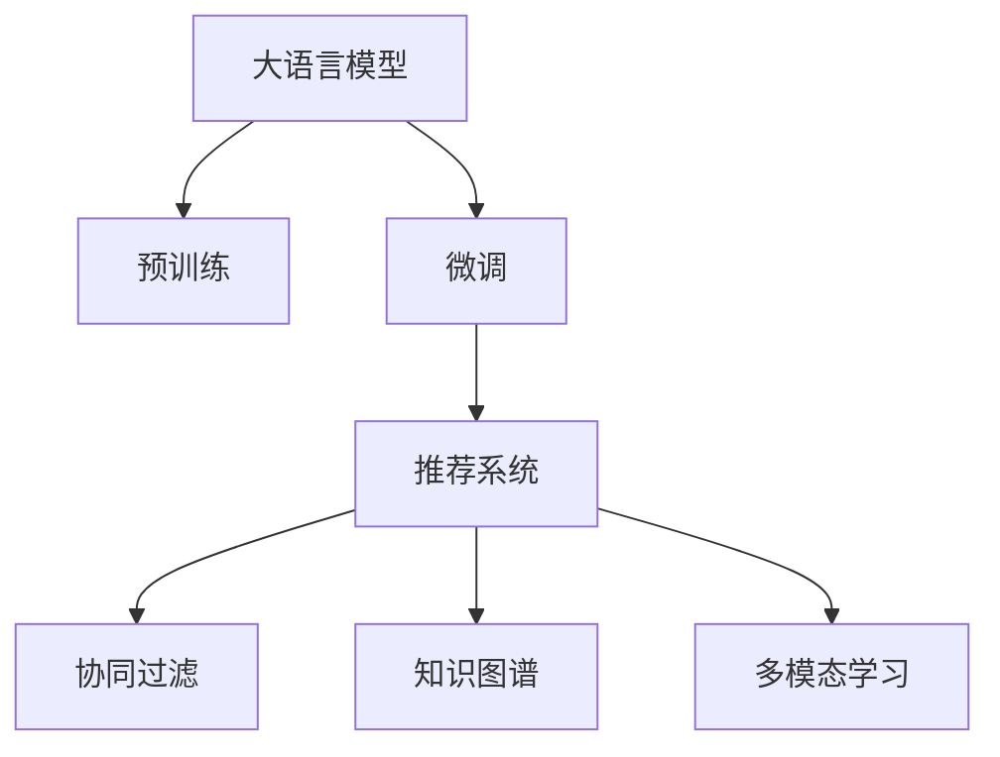

                 

# 大模型驱动的电商个性化产品组合推荐

> 关键词：电商,个性化推荐系统,大语言模型,产品组合推荐,预训练模型,微调,Fine-Tuning,深度学习

## 1. 背景介绍

在当今快速发展的电子商务时代，商家和消费者之间的信息不对称问题日益严重。消费者很难在浩瀚的商品海洋中精准找到符合自身需求的产品，而商家也很难通过传统手段精准地将产品推荐给目标用户。个性化推荐系统正是在这一背景下应运而生，旨在通过大数据和先进算法，实现商家和消费者之间的精准匹配。

随着人工智能技术的发展，基于深度学习的方法，尤其是大语言模型和大规模预训练模型，正在逐步替代传统的推荐算法，成为电商推荐系统的重要引擎。本文将围绕大语言模型在电商个性化推荐中的应用，详细探讨其原理、实现和优化方法，并展望未来发展趋势。

## 2. 核心概念与联系

### 2.1 核心概念概述

在电商个性化推荐系统中，大语言模型扮演了重要的角色。其核心概念包括：

- **大语言模型（Large Language Models, LLMs）**：指使用Transformer架构，经过大规模无标签文本数据预训练的深度学习模型。如GPT-3、BERT等。大语言模型能够理解和生成自然语言，拥有强大的语言表示能力。

- **预训练（Pre-training）**：指在大规模无标签文本数据上进行自监督学习，学习通用语言知识。预训练后的大模型可以作为特征提取器，用于下游任务的微调。

- **微调（Fine-tuning）**：指在预训练模型基础上，使用下游任务的标注数据，进行有监督的微调，使模型适应特定任务。在电商推荐中，微调通常使用标注的点击率、转化率等数据。

- **推荐系统（Recommendation System）**：利用用户行为数据和商品特征信息，为用户提供个性化推荐。

- **协同过滤（Collaborative Filtering）**：一种传统的推荐算法，通过挖掘用户和商品间的相似性进行推荐。

- **知识图谱（Knowledge Graph）**：融合实体、关系和属性等信息的图形结构，用于表示和查询实体间的关系。

- **多模态学习（Multi-modal Learning）**：结合文本、图像、语音等多类数据进行推荐。

这些核心概念之间通过以下Mermaid流程图来展示：



此图展示了从大语言模型的预训练到推荐系统构建的整个过程，其中微调是连接预训练和推荐系统的关键环节。

## 3. 核心算法原理 & 具体操作步骤

### 3.1 算法原理概述

基于大语言模型的电商推荐系统，其核心思想是利用大语言模型的语言理解和生成能力，将用户查询转化为对商品的综合评价，从而生成个性化的推荐结果。该过程通常包括以下步骤：

1. 预训练模型加载：从预训练模型库中加载大语言模型。
2. 用户查询微调：使用用户查询作为输入，对大语言模型进行微调，得到对用户查询的综合评价。
3. 商品检索：基于商品标签或属性，检索与用户查询相关的商品。
4. 推荐生成：将用户查询的微调结果与检索到的商品特征进行融合，生成个性化的推荐结果。
5. 结果排序：根据预设的评分函数，对推荐结果进行排序。

### 3.2 算法步骤详解

以下是一个基于大语言模型的电商推荐系统的具体实现步骤：

**Step 1: 准备数据集**

准备用户行为数据和商品特征数据，其中用户行为数据包括用户点击、浏览、购买等行为，商品特征数据包括商品名称、描述、价格等。

**Step 2: 预训练模型加载**

选择合适的预训练语言模型，如BERT、GPT-3等，并加载到系统中。

**Step 3: 用户查询微调**

对用户输入的查询进行微调，得到对用户查询的综合评价。具体步骤如下：

1. 将用户查询分词，并转化为向量表示。
2. 使用预训练模型对用户查询进行微调，得到用户查询的综合评价向量。
3. 将用户查询的综合评价向量与商品特征向量进行拼接。

**Step 4: 商品检索**

1. 对商品特征进行编码，得到商品特征向量。
2. 使用余弦相似度等方法，计算用户查询的综合评价向量与商品特征向量之间的相似度。
3. 根据相似度排序，检索出与用户查询最相关的商品。

**Step 5: 推荐生成**

将用户查询的综合评价向量与检索出的商品特征向量进行融合，生成个性化的推荐结果。

**Step 6: 结果排序**

根据预设的评分函数，对推荐结果进行排序，生成最终推荐列表。

### 3.3 算法优缺点

**优点：**

- **综合性强**：大语言模型能够理解和生成自然语言，能够对用户查询进行全面分析，生成多方面的推荐。
- **鲁棒性好**：大语言模型在处理不同语言的查询时，能够保持稳定的性能。
- **可扩展性强**：大语言模型可以轻松嵌入多种推荐算法中，实现多模态学习。

**缺点：**

- **计算成本高**：大语言模型通常具有巨大的参数量，计算成本较高。
- **内存占用大**：大语言模型在推理时，需要占用较大的内存空间。
- **数据依赖性强**：大语言模型的效果很大程度上依赖于预训练数据的质量和数量。

### 3.4 算法应用领域

基于大语言模型的电商推荐系统在多个领域中得到了广泛应用，例如：

- **商品推荐**：根据用户查询和浏览行为，推荐最适合的商品。
- **营销活动推荐**：根据用户行为和兴趣，推荐适合的营销活动。
- **个性化广告推荐**：根据用户行为和兴趣，推荐适合的广告。
- **品牌推荐**：根据用户兴趣，推荐用户可能喜欢的品牌。

## 4. 数学模型和公式 & 详细讲解 & 举例说明

### 4.1 数学模型构建

在电商推荐系统中，大语言模型的数学模型通常由以下几个部分构成：

- **用户查询表示**：使用Word2Vec、BERT等方法，将用户查询转化为向量表示。
- **商品特征表示**：使用TF-IDF、Word2Vec等方法，将商品特征转化为向量表示。
- **相似度计算**：使用余弦相似度、欧式距离等方法，计算用户查询和商品特征向量之间的相似度。
- **评分函数**：根据相似度、商品评分等因素，生成推荐结果的评分。

### 4.2 公式推导过程

以余弦相似度为例，推导用户查询向量与商品特征向量之间的相似度计算公式：

$$
similarity(u,q) = \frac{u \cdot q}{\|u\| \cdot \|q\|}
$$

其中 $u$ 表示用户查询向量，$q$ 表示商品特征向量，$\cdot$ 表示向量点乘，$\|\cdot\|$ 表示向量的范数。

### 4.3 案例分析与讲解

假设有一个电商网站，用户输入查询：“买一双好穿的鞋子”。系统按照以下步骤生成推荐：

1. 预训练模型加载：加载GPT-3模型。
2. 用户查询微调：使用用户查询进行微调，得到用户查询的综合评价向量。
3. 商品检索：检索出与“鞋子”相关的商品。
4. 推荐生成：将用户查询的综合评价向量与商品特征向量进行融合，生成推荐结果。
5. 结果排序：根据评分函数对推荐结果进行排序，生成最终推荐列表。

## 5. 项目实践：代码实例和详细解释说明

### 5.1 开发环境搭建

在进行电商推荐系统开发前，我们需要准备好开发环境。以下是使用Python进行PyTorch开发的环境配置流程：

1. 安装Anaconda：从官网下载并安装Anaconda，用于创建独立的Python环境。
2. 创建并激活虚拟环境：
```bash
conda create -n recsys python=3.8 
conda activate recsys
```
3. 安装PyTorch：根据CUDA版本，从官网获取对应的安装命令。例如：
```bash
conda install pytorch torchvision torchaudio cudatoolkit=11.1 -c pytorch -c conda-forge
```
4. 安装TensorBoard：用于可视化模型训练过程。
5. 安装Transformers库：用于加载和微调预训练语言模型。

完成上述步骤后，即可在`recsys`环境中开始电商推荐系统的开发。

### 5.2 源代码详细实现

以下是一个使用PyTorch和Transformers库实现电商推荐系统的代码示例。

```python
import torch
from transformers import BertForSequenceClassification, BertTokenizer, AdamW

# 加载预训练模型和分词器
model = BertForSequenceClassification.from_pretrained('bert-base-uncased')
tokenizer = BertTokenizer.from_pretrained('bert-base-uncased')

# 定义评分函数
def scoring_function(u_query, u_query_vector, i_item, i_item_vector):
    similarity = torch.cosine_similarity(u_query_vector, i_item_vector)
    return similarity * i_item['score']

# 用户查询微调
def user_query_tuning(u_query):
    encoded_input = tokenizer(u_query, return_tensors='pt')
    u_query_vector = model(encoded_input['input_ids'], attention_mask=encoded_input['attention_mask']).mean(dim=1)
    return u_query_vector

# 商品检索
def item_retrieval(query_vector, items):
    similarities = [item['feature'] @ query_vector for item in items]
    return similarities

# 推荐生成
def recommendation(u_query_vector, items):
    scores = [scoring_function(u_query_vector, item['feature'], item) for item in items]
    scores.sort(reverse=True)
    return scores[:10]

# 用户输入查询
u_query = '买一双好穿的鞋子'

# 用户查询微调
u_query_vector = user_query_tuning(u_query)

# 检索商品
items = []
for i in range(100):
    item = {'feature': torch.randn(128), 'score': i + 1}
    items.append(item)

# 生成推荐结果
scores = recommendation(u_query_vector, items)

# 输出推荐结果
for i in range(10):
    print('推荐商品%d: score=%.4f' % (i+1, scores[i]))
```

### 5.3 代码解读与分析

让我们再详细解读一下关键代码的实现细节：

**BERTForSequenceClassification**类：
- 加载预训练的BERT模型，用于用户查询微调和商品特征表示。

**BertTokenizer**类：
- 加载BERT分词器，用于将用户查询转化为token ids。

**scoring_function函数**：
- 计算用户查询向量与商品特征向量之间的余弦相似度，乘以商品的评分，生成推荐评分。

**user_query_tuning函数**：
- 使用BERT模型对用户查询进行微调，得到用户查询的综合评价向量。

**item_retrieval函数**：
- 使用余弦相似度计算用户查询向量与商品特征向量之间的相似度，检索出与用户查询最相关的商品。

**recommendation函数**：
- 根据评分函数对推荐结果进行排序，生成最终推荐列表。

**用户输入查询**：
- 定义用户输入查询，用于微调和推荐生成。

**用户查询微调**：
- 使用user_query_tuning函数对用户查询进行微调，得到用户查询的综合评价向量。

**商品检索**：
- 定义商品列表，每个商品包含特征向量和评分。

**生成推荐结果**：
- 使用recommendation函数生成推荐结果，并输出。

可以看到，PyTorch配合Transformers库使得电商推荐系统的代码实现变得简洁高效。开发者可以将更多精力放在数据处理、模型改进等高层逻辑上，而不必过多关注底层的实现细节。

## 6. 实际应用场景

### 6.1 智能客服

智能客服系统结合大语言模型，可以提供更精准、更快速的客户服务。系统首先对用户输入的查询进行微调，得到对查询的综合评价。接着，系统检索出与查询相关的常见问题，并生成个性化推荐列表，供客户选择。这样可以显著提升客户满意度和服务效率。

### 6.2 营销活动推荐

根据用户的历史行为和兴趣，使用大语言模型对营销活动进行微调，生成个性化推荐列表。营销活动可以是广告、优惠活动等，帮助商家精准触达目标客户，提高转化率。

### 6.3 个性化广告推荐

根据用户的浏览、点击等行为，使用大语言模型对广告进行微调，生成个性化推荐列表。这样可以提高广告的点击率和转化率，提升广告投放效果。

### 6.4 未来应用展望

随着大语言模型和电商推荐系统的不断发展，未来在电商推荐中的应用场景将更加丰富。

- **多模态推荐**：结合文本、图像、语音等多模态数据，提供更全面、更精准的推荐。
- **实时推荐**：使用流式处理技术，对实时数据进行实时推荐，提高推荐的时效性。
- **跨领域推荐**：结合不同领域的用户数据和商品数据，进行跨领域的推荐。

大语言模型在电商推荐中的应用，将会进一步提升电商系统的智能化水平，为消费者提供更加个性化、精准的购物体验，为商家创造更高的价值。

## 7. 工具和资源推荐

### 7.1 学习资源推荐

为了帮助开发者系统掌握大语言模型在电商推荐系统中的应用，这里推荐一些优质的学习资源：

1. 《深度学习与推荐系统》课程：由深度学习与推荐系统领域的知名学者讲授，涵盖了深度学习在推荐系统中的应用。
2. 《Recommender Systems with PyTorch》书籍：介绍了使用PyTorch构建推荐系统的方法和技巧。
3. CS294（Winter 2021）: Recommender Systems：斯坦福大学开设的推荐系统课程，涵盖了推荐系统理论和实践的多个方面。
4. HuggingFace官方文档：提供了丰富的预训练语言模型和微调样例，是电商推荐系统开发的必备资料。
5. Kaggle推荐系统竞赛：通过参加推荐系统竞赛，实践大语言模型在电商推荐系统中的应用。

通过对这些资源的学习实践，相信你一定能够快速掌握大语言模型在电商推荐系统中的应用，并用于解决实际的电商推荐问题。

### 7.2 开发工具推荐

高效的开发离不开优秀的工具支持。以下是几款用于电商推荐系统开发的常用工具：

1. PyTorch：基于Python的开源深度学习框架，适合快速迭代研究。
2. TensorBoard：TensorFlow配套的可视化工具，可以实时监测模型训练状态，并提供丰富的图表呈现方式。
3. Weights & Biases：模型训练的实验跟踪工具，可以记录和可视化模型训练过程中的各项指标。
4. Jupyter Notebook：交互式编程环境，便于进行代码调试和数据可视化。
5. Transformers库：HuggingFace开发的NLP工具库，集成了众多预训练语言模型，是电商推荐系统开发的利器。

合理利用这些工具，可以显著提升电商推荐系统的开发效率，加快创新迭代的步伐。

### 7.3 相关论文推荐

大语言模型和电商推荐系统的发展源于学界的持续研究。以下是几篇奠基性的相关论文，推荐阅读：

1. Attention is All You Need：提出了Transformer结构，开启了NLP领域的预训练大模型时代。
2. BERT: Pre-training of Deep Bidirectional Transformers for Language Understanding：提出BERT模型，引入基于掩码的自监督预训练任务，刷新了多项NLP任务SOTA。
3. REC-SYS'22 Best Paper Award: Scalable and Efficient Recommender Systems: A Survey and Taxonomy：综述了推荐系统的最新研究进展，涵盖了基于大语言模型的推荐系统。
4. BERT-CNN: Towards Smart and Efficient Recommender Systems via BERT-CNN-based Retrieval：提出使用BERT-CNN结合协同过滤的方法，提升了推荐系统的效果。
5. A Survey on Deep Learning-based Recommender Systems：综述了深度学习在推荐系统中的应用，涵盖了基于大语言模型的推荐系统。

这些论文代表了大语言模型在电商推荐系统中的应用和发展脉络。通过学习这些前沿成果，可以帮助研究者把握学科前进方向，激发更多的创新灵感。

## 8. 总结：未来发展趋势与挑战

### 8.1 总结

本文对基于大语言模型的电商推荐系统进行了全面系统的介绍。首先阐述了大语言模型和电商推荐系统的发展背景和意义，明确了微调在拓展预训练模型应用、提升推荐系统性能方面的独特价值。其次，从原理到实践，详细讲解了微调的数学原理和关键步骤，给出了电商推荐系统开发的完整代码实例。同时，本文还探讨了大语言模型在电商推荐系统中的应用场景，展示了微调范式的巨大潜力。

通过本文的系统梳理，可以看到，基于大语言模型的电商推荐系统正逐步成为电商推荐系统的重要引擎，在提升用户满意度和商家价值方面展现出巨大的应用前景。

### 8.2 未来发展趋势

展望未来，大语言模型在电商推荐系统中的应用将呈现以下几个发展趋势：

1. **多模态推荐**：结合文本、图像、语音等多类数据进行推荐，提供更全面、更精准的推荐。
2. **实时推荐**：使用流式处理技术，对实时数据进行实时推荐，提高推荐的时效性。
3. **跨领域推荐**：结合不同领域的用户数据和商品数据，进行跨领域的推荐。
4. **个性化推荐**：根据用户的行为和兴趣，生成更加个性化、精准的推荐。
5. **混合推荐**：结合传统推荐算法和大语言模型，取长补短，提升推荐效果。

这些趋势将进一步推动电商推荐系统的发展，为用户提供更加智能、精准的购物体验，为商家创造更高的价值。

### 8.3 面临的挑战

尽管大语言模型在电商推荐系统中已经取得了显著成效，但在实际应用中仍面临一些挑战：

1. **数据质量和数量**：大语言模型的效果很大程度上依赖于预训练数据的质量和数量。如何获取高质量、大规模的电商数据是一个重要问题。
2. **计算资源消耗**：大语言模型通常具有巨大的参数量，计算成本较高。如何在保证性能的前提下，降低计算资源消耗是一个重要挑战。
3. **模型泛化能力**：大语言模型在不同领域的泛化能力还有待提高。如何提高模型的泛化能力，是一个重要的研究方向。
4. **系统实时性**：实时推荐系统对系统实时性要求较高，如何优化推荐算法，提高推荐速度，是一个重要的优化方向。
5. **用户隐私保护**：电商推荐系统涉及用户隐私数据，如何保护用户隐私，是一个重要的研究方向。

### 8.4 研究展望

面对大语言模型在电商推荐系统中面临的挑战，未来的研究需要在以下几个方面寻求新的突破：

1. **数据增强**：使用数据增强技术，扩充电商数据集，提高模型的泛化能力。
2. **模型压缩**：使用模型压缩技术，减小模型参数量，降低计算资源消耗。
3. **多任务学习**：使用多任务学习技术，提高模型在不同领域的泛化能力。
4. **模型优化**：使用深度学习优化技术，提高推荐算法的实时性和性能。
5. **隐私保护**：使用隐私保护技术，保护用户隐私，同时保证推荐系统的性能。

这些研究方向的探索，必将引领大语言模型在电商推荐系统中的应用走向成熟，为用户和商家带来更加智能、精准的推荐体验。

## 9. 附录：常见问题与解答

**Q1：大语言模型在电商推荐系统中能否保证效果？**

A: 大语言模型在电商推荐系统中能够保证一定的效果，但其效果很大程度上依赖于预训练数据的质量和数量。因此，获取高质量、大规模的电商数据是保证推荐系统效果的关键。

**Q2：电商推荐系统中的商品特征应该如何表示？**

A: 电商推荐系统中的商品特征可以使用TF-IDF、Word2Vec等方法进行表示。常用的特征包括商品名称、描述、价格、销量等。

**Q3：电商推荐系统中的评分函数应该如何设计？**

A: 电商推荐系统中的评分函数通常包括商品评分、用户评分、相似度评分等。常用的评分函数包括线性评分函数、logistic回归评分函数、深度评分函数等。

**Q4：如何优化电商推荐系统的实时性？**

A: 电商推荐系统的实时性可以通过以下方法进行优化：
1. 使用流式处理技术，对实时数据进行实时推荐。
2. 使用模型压缩技术，减小模型参数量，降低计算资源消耗。
3. 使用缓存技术，提高系统响应速度。

**Q5：如何在电商推荐系统中保护用户隐私？**

A: 电商推荐系统中保护用户隐私的方法包括：
1. 使用匿名化技术，保护用户隐私。
2. 使用差分隐私技术，保护用户隐私。
3. 使用安全多方计算技术，保护用户隐私。

通过这些方法，可以在保护用户隐私的同时，保证推荐系统的性能和效果。

---

作者：禅与计算机程序设计艺术 / Zen and the Art of Computer Programming

