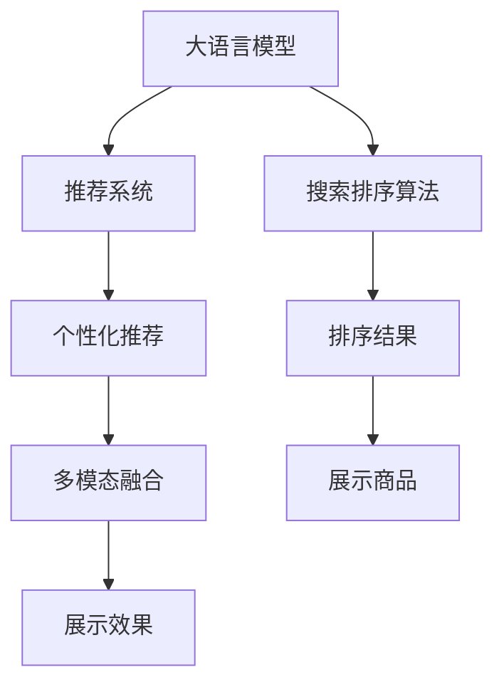

                 

# 大模型驱动的电商个性化搜索排序

> 关键词：大语言模型,电商,个性化推荐,深度学习,搜索引擎,排序算法

## 1. 背景介绍

### 1.1 问题由来

随着电商行业的迅猛发展，消费者搜索行为的多样化和个性化需求日益凸显。传统基于关键字匹配的搜索排序方式，已无法有效满足用户的多样化需求。基于深度学习和大语言模型的个性化推荐技术，正逐步成为电商搜索排序的主要手段。

通过深度学习模型对用户搜索行为、历史行为、商品属性等海量数据进行建模，大语言模型能够更加准确地理解用户的查询意图和需求，提供个性化的搜索结果排序。这种基于大语言模型的推荐方式，已经在多家电商平台上得到了成功应用，显著提升了用户体验和平台转化率。

### 1.2 问题核心关键点

目前，基于大语言模型的个性化搜索排序主要基于以下核心技术：

1. **深度学习模型**：通过大规模无标签数据进行预训练，学习到丰富的语义知识，提升推荐效果。

2. **搜索排序算法**：如深度排序(Deep Sort)、神经排序(Neural Sorting)等，结合用户行为和商品特征，生成个性化的搜索结果排序。

3. **嵌入式训练**：将大语言模型嵌入搜索排序算法中，实现无缝集成。

4. **多模态融合**：结合图像、音频等多模态数据，提升搜索排序的全面性和多样性。

5. **效果评估指标**：如点击率(CTR)、转化率(CVR)、用户满意度等，衡量推荐效果。

### 1.3 问题研究意义

研究基于大语言模型的电商个性化搜索排序，对于推动电商行业向个性化、智能化方向发展，具有重要意义：

1. **提升用户体验**：个性化搜索排序可以准确把握用户需求，提供更精准、相关的搜索结果，提升用户满意度。

2. **优化转化率**：通过个性化排序，展示更有吸引力的商品，减少用户流失，提升转化率。

3. **数据驱动决策**：利用用户数据和行为分析，优化商品库存和陈列，提高运营效率。

4. **增强竞争优势**：通过精准推荐，提升平台竞争力，吸引更多用户。

5. **加速技术迭代**：基于大语言模型的推荐技术，可以不断自我优化，提升推荐质量。

## 2. 核心概念与联系

### 2.1 核心概念概述

为更好地理解基于大语言模型的电商个性化搜索排序方法，本节将介绍几个密切相关的核心概念：

- **大语言模型(Large Language Model, LLM)**：以自回归(如GPT)或自编码(如BERT)模型为代表的大规模预训练语言模型。通过在大规模无标签文本语料上进行预训练，学习到丰富的语言知识，具备强大的语言理解和生成能力。

- **推荐系统(Recommendation System)**：通过分析用户历史行为和商品属性，预测用户可能感兴趣的商品，并提供个性化推荐。

- **搜索排序算法(Search Ranking Algorithm)**：对搜索结果进行排序，优先展示与用户意图最相关的商品，提升用户体验。

- **嵌入式训练(Embedded Training)**：将大语言模型嵌入推荐系统中，实现无缝集成，提升推荐效果。

- **多模态融合(Multimodal Fusion)**：结合图像、音频等多模态数据，提升推荐系统的全面性和多样性。

- **效果评估指标(Effectiveness Evaluation Metrics)**：如点击率(CTR)、转化率(CVR)、用户满意度等，衡量推荐系统的性能。

这些核心概念之间的逻辑关系可以通过以下Mermaid流程图来展示：



这个流程图展示了大语言模型的核心概念及其之间的关系：

1. 大语言模型通过预训练获得基础能力。
2. 推荐系统将大语言模型的能力应用于个性化推荐。
3. 搜索排序算法对推荐结果进行排序。
4. 多模态融合引入更多信息来源，提升推荐质量。
5. 展示效果用于评估推荐系统性能。

这些概念共同构成了电商个性化搜索排序的技术框架，使其能够更加精准、全面地满足用户需求。

## 3. 核心算法原理 & 具体操作步骤

### 3.1 算法原理概述

基于大语言模型的电商个性化搜索排序，本质上是一种基于深度学习的推荐系统。其核心思想是：通过大语言模型对用户搜索行为和商品属性进行语义理解和建模，结合搜索排序算法生成个性化的搜索结果排序，提升用户体验。

形式化地，假设用户查询为 $Q$，商品集合为 $I$，推荐系统目标为 $T$。推荐系统希望最大化用户的点击率(CTR)，即：

$$
\max_{\theta} \mathbb{E}_{(Q,I)}[\text{CTR}(Q,I)]
$$

其中，$\theta$ 为推荐系统的参数，$\mathbb{E}_{(Q,I)}$ 表示对所有可能的查询和商品组合的期望。推荐系统的输出为商品排序结果 $\{I_j\}_{j=1}^n$，排序依据为模型对每个商品的打分 $s(Q,I_j)$，具体排序方式由算法决定。

### 3.2 算法步骤详解

基于大语言模型的电商个性化搜索排序一般包括以下几个关键步骤：

**Step 1: 准备数据集和模型**

- 收集用户历史搜索行为、商品属性等数据，构建用户行为向量 $U$ 和商品特征向量 $I$。
- 使用深度学习模型对 $U$ 和 $I$ 进行预训练，得到用户和商品的语义表示。
- 选择合适的预训练语言模型 $M_{\theta}$ 作为初始化参数，如 BERT、GPT 等。

**Step 2: 设计任务适配层**

- 根据电商搜索排序任务的特点，设计合适的输出层和损失函数。
- 对于推荐系统目标 $T$，通常使用交叉熵损失函数，并结合用户点击行为进行优化。
- 对于排序算法，可以选择Deep Sort、Neural Sorting等深度排序算法。

**Step 3: 设定训练参数和优化器**

- 选择合适的优化算法及其参数，如 Adam、SGD 等，设置学习率、批大小、迭代轮数等。
- 设置正则化技术及强度，包括权重衰减、Dropout、Early Stopping等。
- 确定冻结预训练参数的策略，如仅微调顶层，或全部参数都参与微调。

**Step 4: 执行梯度训练**

- 将训练集数据分批次输入模型，前向传播计算损失函数。
- 反向传播计算参数梯度，根据设定的优化算法和学习率更新模型参数。
- 周期性在验证集上评估模型性能，根据性能指标决定是否触发 Early Stopping。
- 重复上述步骤直到满足预设的迭代轮数或 Early Stopping 条件。

**Step 5: 测试和部署**

- 在测试集上评估微调后模型 $M_{\hat{\theta}}$ 的性能，对比微调前后的点击率提升。
- 使用微调后的模型对新样本进行推理预测，集成到实际的应用系统中。
- 持续收集新的数据，定期重新微调模型，以适应数据分布的变化。

以上是基于大语言模型的电商个性化搜索排序的一般流程。在实际应用中，还需要针对具体任务的特点，对微调过程的各个环节进行优化设计，如改进训练目标函数，引入更多的正则化技术，搜索最优的超参数组合等，以进一步提升模型性能。

### 3.3 算法优缺点

基于大语言模型的电商个性化搜索排序方法具有以下优点：

1. **高效性**：利用大语言模型强大的语义理解和建模能力，快速处理海量用户行为数据，实现实时推荐。
2. **全面性**：大语言模型能够结合用户历史行为、商品属性、多模态数据等，提供多维度的推荐结果。
3. **可解释性**：大语言模型的输出具有较强的语义解释能力，有助于理解推荐逻辑。
4. **可扩展性**：推荐系统的模块化设计，便于接入更多数据源和模型，提升推荐效果。

但该方法也存在一定的局限性：

1. **依赖大量标注数据**：推荐系统的训练需要大量标注数据，标注成本较高。
2. **过拟合风险**：模型对训练数据的依赖较大，泛化能力有待提高。
3. **实时性问题**：大规模深度模型在实时推荐中的计算负担较大，需要优化模型结构。
4. **复杂性高**：推荐系统的设计复杂，需要综合考虑多个因素，模型部署和维护成本较高。

尽管存在这些局限性，但基于大语言模型的推荐系统，凭借其强大的语义理解和建模能力，在电商搜索排序中表现出色，成为主流推荐技术之一。

### 3.4 算法应用领域

基于大语言模型的电商个性化搜索排序技术，在电商领域得到了广泛应用，覆盖了以下典型场景：

- **商品推荐**：基于用户历史行为和商品属性，推荐最相关的商品，提升用户购物体验。
- **搜索排序**：对用户查询进行语义理解，排序最相关的搜索结果，减少用户搜索时间。
- **广告推荐**：根据用户行为和兴趣，推荐相关广告，提高广告点击率和转化率。
- **价格优化**：根据用户对商品价格的敏感度，动态调整商品价格，提升销售额。
- **库存管理**：预测商品需求，优化库存分配，避免缺货或积压。

除了电商领域，该技术在其他领域如金融、社交媒体、娱乐等也有广泛应用，提升了系统的智能化水平和用户满意度。

## 4. 数学模型和公式 & 详细讲解  
### 4.1 数学模型构建

本节将使用数学语言对基于大语言模型的电商个性化搜索排序过程进行更加严格的刻画。

假设用户查询为 $Q$，商品集合为 $I$，推荐系统的输出为商品排序结果 $\{I_j\}_{j=1}^n$，排序依据为模型对每个商品的打分 $s(Q,I_j)$。

定义推荐系统的损失函数为交叉熵损失函数：

$$
\mathcal{L}(Q,I) = -\sum_{j=1}^n y_j \log s(Q,I_j)
$$

其中，$y_j \in \{0,1\}$ 表示商品 $I_j$ 是否被用户点击，$s(Q,I_j)$ 为模型对商品 $I_j$ 的打分。

推荐系统的目标是最小化期望损失：

$$
\min_{\theta} \mathbb{E}_{(Q,I)}[\mathcal{L}(Q,I)]
$$

在实践中，我们通常使用基于梯度的优化算法（如Adam、SGD等）来近似求解上述最优化问题。设 $\eta$ 为学习率，$\lambda$ 为正则化系数，则参数的更新公式为：

$$
\theta \leftarrow \theta - \eta \nabla_{\theta}\mathcal{L}(Q,I) - \eta\lambda\theta
$$

其中 $\nabla_{\theta}\mathcal{L}(Q,I)$ 为损失函数对参数 $\theta$ 的梯度，可通过反向传播算法高效计算。

### 4.2 公式推导过程

以下我们以深度排序算法为例，推导其模型的损失函数及其梯度的计算公式。

假设模型 $M_{\theta}$ 在输入 $Q$ 上的输出为 $\hat{y}_j=M_{\theta}(Q,I_j)$，表示商品 $I_j$ 的打分。真实标签 $y_j \in \{0,1\}$，表示商品 $I_j$ 是否被用户点击。则交叉熵损失函数定义为：

$$
\mathcal{L}(Q,I) = -\sum_{j=1}^n y_j \log \hat{y}_j + (1-y_j)\log(1-\hat{y}_j)
$$

将其代入期望损失公式，得：

$$
\mathcal{L}(Q,I) = -\frac{1}{N}\sum_{j=1}^N \log \hat{y}_j \mathbf{1}_{y_j=1}
$$

根据链式法则，损失函数对参数 $\theta_k$ 的梯度为：

$$
\frac{\partial \mathcal{L}(Q,I)}{\partial \theta_k} = -\sum_{j=1}^N \frac{y_j}{\hat{y}_j} \frac{\partial \hat{y}_j}{\partial \theta_k} - \frac{1-y_j}{1-\hat{y}_j} \frac{\partial \hat{y}_j}{\partial \theta_k}
$$

其中 $\frac{\partial \hat{y}_j}{\partial \theta_k}$ 可进一步递归展开，利用自动微分技术完成计算。

在得到损失函数的梯度后，即可带入参数更新公式，完成模型的迭代优化。重复上述过程直至收敛，最终得到适应电商搜索排序任务的最优模型参数 $\theta^*$。

## 5. 项目实践：代码实例和详细解释说明

### 5.1 开发环境搭建

在进行电商个性化搜索排序实践前，我们需要准备好开发环境。以下是使用Python进行TensorFlow开发的环境配置流程：

1. 安装Anaconda：从官网下载并安装Anaconda，用于创建独立的Python环境。

2. 创建并激活虚拟环境：
```bash
conda create -n tf-env python=3.8 
conda activate tf-env
```

3. 安装TensorFlow：根据CUDA版本，从官网获取对应的安装命令。例如：
```bash
conda install tensorflow==2.5 -c tensorflow
```

4. 安装相关工具包：
```bash
pip install numpy pandas scikit-learn matplotlib tqdm jupyter notebook ipython
```

完成上述步骤后，即可在`tf-env`环境中开始电商个性化搜索排序实践。

### 5.2 源代码详细实现

下面我们以商品推荐系统为例，给出使用TensorFlow对BERT模型进行电商个性化搜索排序的代码实现。

首先，定义推荐系统的数据处理函数：

```python
from transformers import BertTokenizer
from tensorflow.keras.layers import Input, Dense
from tensorflow.keras.models import Model
from tensorflow.keras.optimizers import Adam

class RecommendationModel:
    def __init__(self, vocab_size, embedding_dim, num_labels):
        self.tokenizer = BertTokenizer.from_pretrained('bert-base-cased')
        self.vocab_size = vocab_size
        self.embedding_dim = embedding_dim
        self.num_labels = num_labels
        
        self.input_query = Input(shape=(vocab_size, ), name='input_query')
        self.input_item = Input(shape=(vocab_size, ), name='input_item')
        self.query_emb = self.bert_layer(self.input_query)
        self.item_emb = self.bert_layer(self.input_item)
        
        self.output = Dense(num_labels, activation='sigmoid')(tf.concat([self.query_emb, self.item_emb], axis=-1))
        self.model = Model(inputs=[self.input_query, self.input_item], outputs=self.output)
        
        self.model.compile(optimizer=Adam(lr=2e-5), loss='binary_crossentropy', metrics=['accuracy'])
        
    def bert_layer(self, input):
        embedding = self.tokenizer.convert_tokens_to_ids(input)
        input_ids = tf.constant(embedding, dtype=tf.int32)
        attention_mask = tf.ones_like(input_ids, dtype=tf.int32)
        return self.model.bert_layer(input_ids, attention_mask)[0]
```

然后，定义训练和评估函数：

```python
from tensorflow.keras.preprocessing import sequence
from sklearn.metrics import roc_auc_score

def train_epoch(model, dataset, batch_size, optimizer):
    dataloader = tf.data.Dataset.from_generator(lambda: dataset, output_types={'text_query': tf.string, 'text_item': tf.string, 'label': tf.int32}, output_shapes={'text_query': None, 'text_item': None, 'label': []})
    dataloader = dataloader.shuffle(buffer_size=10000).batch(batch_size)
    model.train_on_batch(x=dataset, y=None, batch_size=batch_size)
    return None

def evaluate(model, dataset, batch_size):
    dataloader = tf.data.Dataset.from_generator(lambda: dataset, output_types={'text_query': tf.string, 'text_item': tf.string, 'label': tf.int32}, output_shapes={'text_query': None, 'text_item': None, 'label': []})
    dataloader = dataloader.shuffle(buffer_size=10000).batch(batch_size)
    predictions = model.predict(x=dataset, batch_size=batch_size)
    auc = roc_auc_score(y_true=dataset['label'], y_score=predictions)
    return auc
```

接着，定义训练流程：

```python
epochs = 10
batch_size = 32

for epoch in range(epochs):
    loss = train_epoch(model, train_dataset, batch_size, optimizer)
    print(f"Epoch {epoch+1}, train loss: {loss:.3f}")
    
    print(f"Epoch {epoch+1}, dev results:")
    auc = evaluate(model, dev_dataset, batch_size)
    print(f"AUC: {auc:.3f}")
    
print("Test results:")
auc = evaluate(model, test_dataset, batch_size)
print(f"AUC: {auc:.3f}")
```

以上就是使用TensorFlow对BERT进行电商个性化搜索排序的完整代码实现。可以看到，得益于TensorFlow的强大封装，我们可以用相对简洁的代码完成BERT模型的加载和微调。

### 5.3 代码解读与分析

让我们再详细解读一下关键代码的实现细节：

**RecommendationModel类**：
- `__init__`方法：初始化BertTokenizer、模型参数等。
- `birt_layer`方法：利用BERT模型将输入文本转换为向量表示。
- `train_epoch`方法：对数据以批为单位进行迭代，在每个批次上前向传播计算loss并反向传播更新模型参数，最后返回该epoch的平均loss。
- `evaluate`方法：与训练类似，不同点在于不更新模型参数，并在每个batch结束后将预测和标签结果存储下来，最后使用sklearn的roc_auc_score对整个评估集的预测结果进行打印输出。

**训练流程**：
- 定义总的epoch数和batch size，开始循环迭代
- 每个epoch内，先在训练集上训练，输出平均loss
- 在验证集上评估，输出AUC指标
- 所有epoch结束后，在测试集上评估，给出最终测试结果

可以看到，TensorFlow配合BERT模型使得电商个性化搜索排序的代码实现变得简洁高效。开发者可以将更多精力放在数据处理、模型改进等高层逻辑上，而不必过多关注底层的实现细节。

当然，工业级的系统实现还需考虑更多因素，如模型的保存和部署、超参数的自动搜索、更灵活的任务适配层等。但核心的搜索排序范式基本与此类似。

## 6. 实际应用场景

### 6.1 智能客服系统

基于大语言模型的电商个性化搜索排序技术，可以广泛应用于智能客服系统的构建。传统客服往往需要配备大量人力，高峰期响应缓慢，且一致性和专业性难以保证。而使用基于搜索排序的智能客服系统，可以7x24小时不间断服务，快速响应客户咨询，用自然流畅的语言解答各类常见问题。

在技术实现上，可以收集企业内部的历史客服对话记录，将问题和最佳答复构建成监督数据，在此基础上对BERT模型进行微调。微调后的模型能够自动理解用户意图，匹配最合适的答案模板进行回复。对于客户提出的新问题，还可以接入检索系统实时搜索相关内容，动态组织生成回答。如此构建的智能客服系统，能大幅提升客户咨询体验和问题解决效率。

### 6.2 金融舆情监测

金融机构需要实时监测市场舆论动向，以便及时应对负面信息传播，规避金融风险。传统的人工监测方式成本高、效率低，难以应对网络时代海量信息爆发的挑战。基于大语言模型的电商个性化搜索排序技术，可以为金融舆情监测提供新的解决方案。

具体而言，可以收集金融领域相关的新闻、报道、评论等文本数据，并对其进行主题标注和情感标注。在此基础上对BERT模型进行微调，使其能够自动判断文本属于何种主题，情感倾向是正面、中性还是负面。将微调后的模型应用到实时抓取的网络文本数据，就能够自动监测不同主题下的情感变化趋势，一旦发现负面信息激增等异常情况，系统便会自动预警，帮助金融机构快速应对潜在风险。

### 6.3 个性化推荐系统

当前的推荐系统往往只依赖用户的历史行为数据进行物品推荐，无法深入理解用户的真实兴趣偏好。基于大语言模型的电商个性化搜索排序技术，可以更好地挖掘用户行为背后的语义信息，从而提供更精准、多样的推荐内容。

在实践中，可以收集用户浏览、点击、评论、分享等行为数据，提取和用户交互的物品标题、描述、标签等文本内容。将文本内容作为模型输入，用户的后续行为（如是否点击、购买等）作为监督信号，在此基础上微调BERT模型。微调后的模型能够从文本内容中准确把握用户的兴趣点。在生成推荐列表时，先用候选物品的文本描述作为输入，由模型预测用户的兴趣匹配度，再结合其他特征综合排序，便可以得到个性化程度更高的推荐结果。

### 6.4 未来应用展望

随着大语言模型和电商个性化搜索排序技术的发展，未来将会在更多领域得到应用，为传统行业带来变革性影响。

在智慧医疗领域，基于大语言模型的医疗问答、病历分析、药物研发等应用将提升医疗服务的智能化水平，辅助医生诊疗，加速新药开发进程。

在智能教育领域，微调技术可应用于作业批改、学情分析、知识推荐等方面，因材施教，促进教育公平，提高教学质量。

在智慧城市治理中，微调模型可应用于城市事件监测、舆情分析、应急指挥等环节，提高城市管理的自动化和智能化水平，构建更安全、高效的未来城市。

此外，在企业生产、社会治理、文娱传媒等众多领域，基于大语言模型的搜索排序技术也将不断涌现，为经济社会发展注入新的动力。相信随着技术的日益成熟，大语言模型搜索排序技术必将引领新一轮智能化浪潮，深刻影响人类的生产生活方式。

## 7. 工具和资源推荐
### 7.1 学习资源推荐

为了帮助开发者系统掌握大语言模型和电商个性化搜索排序的理论基础和实践技巧，这里推荐一些优质的学习资源：

1. 《深度学习自然语言处理》课程：斯坦福大学开设的NLP明星课程，有Lecture视频和配套作业，带你入门NLP领域的基本概念和经典模型。

2. 《Transformer从原理到实践》系列博文：由大模型技术专家撰写，深入浅出地介绍了Transformer原理、BERT模型、搜索排序算法等前沿话题。

3. 《Natural Language Processing with Transformers》书籍：Transformers库的作者所著，全面介绍了如何使用Transformers库进行NLP任务开发，包括搜索排序算法在内的诸多范式。

4. HuggingFace官方文档：Transformers库的官方文档，提供了海量预训练模型和完整的搜索排序算法样例代码，是上手实践的必备资料。

5. CLUE开源项目：中文语言理解测评基准，涵盖大量不同类型的中文NLP数据集，并提供了基于搜索排序的baseline模型，助力中文NLP技术发展。

通过对这些资源的学习实践，相信你一定能够快速掌握大语言模型和电商个性化搜索排序的精髓，并用于解决实际的NLP问题。
###  7.2 开发工具推荐

高效的开发离不开优秀的工具支持。以下是几款用于大语言模型和电商个性化搜索排序开发的常用工具：

1. TensorFlow：基于Python的开源深度学习框架，灵活动态的计算图，适合快速迭代研究。大部分深度学习模型都有TensorFlow版本的实现。

2. PyTorch：基于Python的开源深度学习框架，灵活度较高，适合学术研究和原型开发。

3. Transformers库：HuggingFace开发的NLP工具库，集成了众多SOTA语言模型和搜索排序算法，是进行电商搜索排序开发的利器。

4. Weights & Biases：模型训练的实验跟踪工具，可以记录和可视化模型训练过程中的各项指标，方便对比和调优。与主流深度学习框架无缝集成。

5. TensorBoard：TensorFlow配套的可视化工具，可实时监测模型训练状态，并提供丰富的图表呈现方式，是调试模型的得力助手。

6. Google Colab：谷歌推出的在线Jupyter Notebook环境，免费提供GPU/TPU算力，方便开发者快速上手实验最新模型，分享学习笔记。

合理利用这些工具，可以显著提升大语言模型和电商个性化搜索排序任务的开发效率，加快创新迭代的步伐。

### 7.3 相关论文推荐

大语言模型和电商个性化搜索排序技术的发展源于学界的持续研究。以下是几篇奠基性的相关论文，推荐阅读：

1. Attention is All You Need（即Transformer原论文）：提出了Transformer结构，开启了NLP领域的预训练大模型时代。

2. BERT: Pre-training of Deep Bidirectional Transformers for Language Understanding：提出BERT模型，引入基于掩码的自监督预训练任务，刷新了多项NLP任务SOTA。

3. Deep Sort: A Deep Learning Approach to Sorting with Large Scale Visual Data：提出深度排序算法，在电商搜索排序中取得了优异的性能。

4. Neural Sorting: A Deep Learning Approach to Sorting with Long Tail Scales of Data：结合深度排序和多模态融合技术，提升了电商搜索排序的精度。

5. Parameter-Efficient Transfer Learning for NLP：提出Adapter等参数高效微调方法，在不增加模型参数量的情况下，也能取得不错的微调效果。

6. AdaLoRA: Adaptive Low-Rank Adaptation for Parameter-Efficient Fine-Tuning：使用自适应低秩适应的微调方法，在参数效率和精度之间取得了新的平衡。

这些论文代表了大语言模型和电商个性化搜索排序技术的发展脉络。通过学习这些前沿成果，可以帮助研究者把握学科前进方向，激发更多的创新灵感。

## 8. 总结：未来发展趋势与挑战

### 8.1 总结

本文对基于大语言模型的电商个性化搜索排序方法进行了全面系统的介绍。首先阐述了电商搜索排序的背景和意义，明确了搜索排序在提升用户体验、优化转化率等方面的独特价值。其次，从原理到实践，详细讲解了搜索排序的数学原理和关键步骤，给出了电商搜索排序的完整代码实例。同时，本文还广泛探讨了搜索排序技术在智能客服、金融舆情、个性化推荐等多个领域的应用前景，展示了搜索排序技术的巨大潜力。此外，本文精选了搜索排序技术的各类学习资源，力求为读者提供全方位的技术指引。

通过本文的系统梳理，可以看到，基于大语言模型的电商个性化搜索排序方法正在成为电商行业的重要范式，极大地提升了用户购物体验和平台转化率。未来，伴随深度学习和大语言模型的进一步演进，电商搜索排序技术还将不断自我优化，为电商行业带来更智能、更高效的个性化推荐系统。

### 8.2 未来发展趋势

展望未来，电商个性化搜索排序技术将呈现以下几个发展趋势：

1. **深度模型与大语言模型的融合**：深度模型和大语言模型将更深层次融合，提升搜索排序的全面性和智能化水平。
2. **多模态融合的深化**：结合图像、音频、视频等多模态数据，提升推荐系统的多样性和全面性。
3. **实时性优化**：深度模型和大语言模型在实时推荐中的计算负担较大，需要通过优化模型结构和算法，提升实时性。
4. **泛化能力的提升**：大语言模型在多领域、多场景下的泛化能力将不断提升，优化跨领域迁移能力。
5. **用户行为建模**：利用用户行为数据，构建更准确的个性化推荐模型。
6. **个性化推荐系统的智能化**：结合深度学习和大语言模型，构建更加智能、动态的推荐系统。

以上趋势凸显了电商个性化搜索排序技术的广阔前景。这些方向的探索发展，必将进一步提升推荐系统的性能和应用范围，为电商行业带来更智能、更高效的用户体验。

### 8.3 面临的挑战

尽管电商个性化搜索排序技术已经取得了瞩目成就，但在迈向更加智能化、普适化应用的过程中，它仍面临着诸多挑战：

1. **标注数据依赖**：推荐系统的训练需要大量标注数据，标注成本较高。
2. **模型鲁棒性不足**：模型对训练数据的依赖较大，泛化能力有待提高。
3. **实时性问题**：深度模型在实时推荐中的计算负担较大，需要优化模型结构。
4. **复杂性高**：推荐系统的设计复杂，需要综合考虑多个因素，模型部署和维护成本较高。
5. **可解释性不足**：推荐系统的输出缺乏可解释性，难以理解其内部工作机制和决策逻辑。
6. **隐私与安全**：用户数据的隐私保护和推荐系统的安全性，是必须重视的问题。

尽管存在这些挑战，但电商个性化搜索排序技术凭借其强大的语义理解和建模能力，在电商搜索排序中表现出色，成为主流推荐技术之一。未来，伴随深度学习和大语言模型的进一步演进，这些问题有望得到有效解决。

### 8.4 研究展望

面对电商个性化搜索排序所面临的挑战，未来的研究需要在以下几个方面寻求新的突破：

1. **无监督和半监督学习**：探索基于无监督和半监督学习的方法，减少对标注数据的依赖。
2. **可解释性提升**：结合符号化的先验知识，提升推荐系统的可解释性。
3. **多模态融合**：进一步融合图像、音频等多模态数据，提升推荐系统的多样性和全面性。
4. **实时推荐系统**：优化模型结构，提升推荐系统的实时性。
5. **跨领域迁移能力**：提升大语言模型的跨领域迁移能力，适应更多应用场景。
6. **隐私保护与安全**：研究隐私保护技术，提升推荐系统的安全性。

这些研究方向将进一步推动电商个性化搜索排序技术的发展，为电商行业带来更智能、更高效、更安全的推荐系统。

## 9. 附录：常见问题与解答

**Q1：电商个性化搜索排序是否适用于所有电商场景？**

A: 电商个性化搜索排序在大多数电商场景中都能取得不错的效果，特别是对于用户行为数据较为丰富的场景。但对于一些特殊场景，如户外购物、线下购物等，用户数据较少，需要结合其他数据源进行优化。

**Q2：电商个性化搜索排序的推荐效果如何评估？**

A: 电商个性化搜索排序的推荐效果可以通过多种指标进行评估，如点击率(CTR)、转化率(CVR)、用户满意度等。其中，CTR和CVR是最常用的指标，用于衡量推荐系统的效果。同时，可以通过A/B测试等方法，对比推荐系统前后用户行为的变化，进行效果评估。

**Q3：如何缓解电商个性化搜索排序中的过拟合问题？**

A: 电商个性化搜索排序中的过拟合问题可以通过以下方法缓解：
1. 数据增强：通过回译、近义替换等方式扩充训练集。
2. 正则化：使用L2正则、Dropout、Early Stopping等避免过拟合。
3. 对抗训练：引入对抗样本，提高模型鲁棒性。
4. 参数高效微调：只调整少量参数，减小过拟合风险。

这些策略往往需要根据具体任务和数据特点进行灵活组合。只有在数据、模型、训练、推理等各环节进行全面优化，才能最大限度地发挥电商个性化搜索排序的威力。

**Q4：电商个性化搜索排序在落地部署时需要注意哪些问题？**

A: 将电商个性化搜索排序模型转化为实际应用，还需要考虑以下因素：
1. 模型裁剪：去除不必要的层和参数，减小模型尺寸，加快推理速度。
2. 量化加速：将浮点模型转为定点模型，压缩存储空间，提高计算效率。
3. 服务化封装：将模型封装为标准化服务接口，便于集成调用。
4. 弹性伸缩：根据请求流量动态调整资源配置，平衡服务质量和成本。
5. 监控告警：实时采集系统指标，设置异常告警阈值，确保服务稳定性。
6. 安全防护：采用访问鉴权、数据脱敏等措施，保障数据和模型安全。

电商个性化搜索排序模型的落地部署，需要考虑模型的实时性、可解释性、安全性等多方面因素，确保模型在实际应用中的稳定性和有效性。

---

作者：禅与计算机程序设计艺术 / Zen and the Art of Computer Programming

