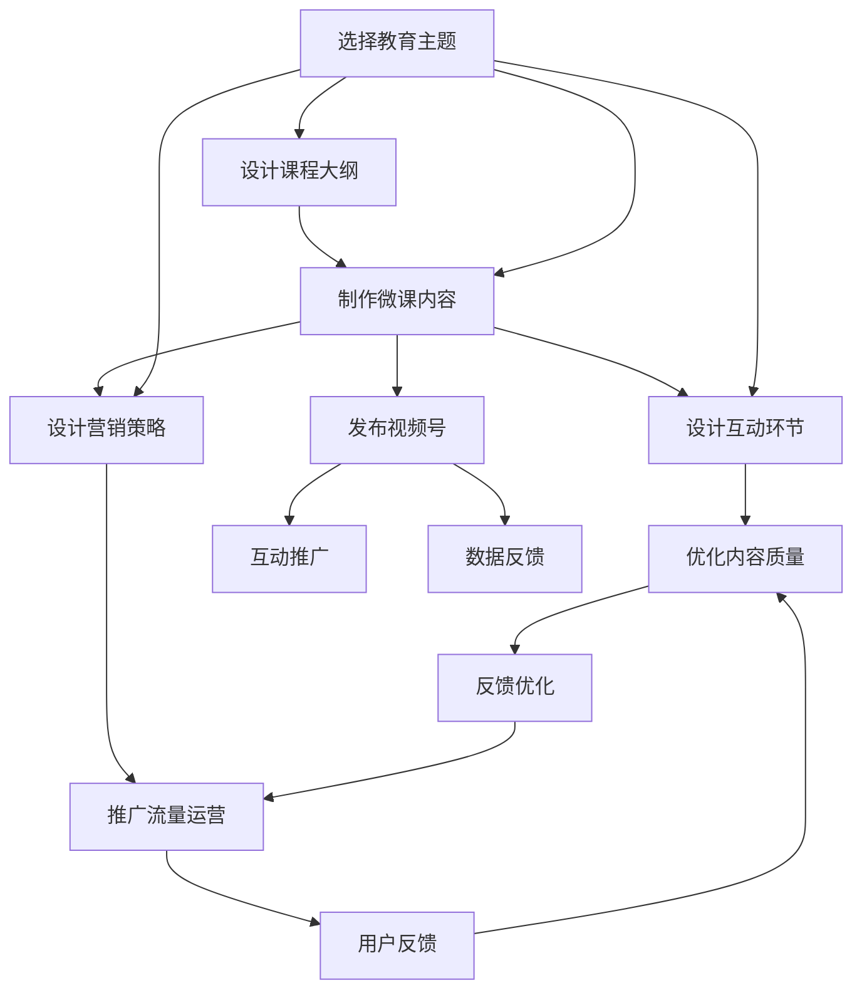

                 

# 如何利用微信视频号卖课

> 关键词：微信视频号,微课,线上教育,付费,流量运营,品牌效应,课程质量

## 1. 背景介绍

随着移动互联网和在线教育的兴起，越来越多的机构和个人选择在线上开展课程销售。微信视频号作为微信生态内的新型内容平台，凭借其庞大的用户基础和低门槛的进入条件，成为众多教育机构和个人开展在线课程销售的新选择。本文将详细介绍如何利用微信视频号进行微课销售，涵盖从平台选择到内容制作、流量运营及品牌建设的完整流程。

### 1.1 市场分析与趋势

当前，在线教育市场呈现快速增长的趋势，受疫情影响更是加速了线上学习的普及。据统计，2020年我国在线教育市场规模已达3,612.8亿元人民币，预计2025年将增至5,577.2亿元人民币。预计2021-2025年的复合年增长率（CAGR）为18.2%，显示出强大的市场潜力和发展动力。

### 1.2 用户特征与需求

微信视频号的主要用户集中在18-34岁之间，多为90后、00后群体，这部分用户对于线上教育和社交媒体有较强的接受度和依赖度。他们在选择课程时，更注重内容质量、互动体验和价格合理性。因此，成功的微课销售策略应围绕这些用户特征和需求展开。

## 2. 核心概念与联系

### 2.1 核心概念概述

为了更好地理解如何在微信视频号上开展微课销售，首先需要了解以下几个核心概念：

- **微信视频号**：微信内嵌的内容创作平台，用户可以通过视频和图片发布原创内容，建立粉丝群体，并实现商业变现。
- **微课销售**：通过线上平台发布、售卖课程，利用教育内容吸引用户付费，获取收益。
- **流量运营**：通过营销推广和内容策略，吸引更多用户关注和互动，提升平台流量。
- **品牌建设**：通过构建IP、品牌故事、社区互动等方式，提升品牌知名度和用户粘性。

### 2.2 核心概念原理和架构的 Mermaid 流程图(Mermaid 流程节点中不要有括号、逗号等特殊字符)



该流程图示意了微课销售从主题选择到推广运营的全过程，每个环节都需要精心设计和优化。

## 3. 核心算法原理 & 具体操作步骤

### 3.1 算法原理概述

微课销售的核心算法原理主要包括以下几个方面：

1. **用户画像分析**：通过数据分析，了解目标用户的年龄、性别、兴趣和消费习惯，为其量身定制课程。
2. **流量预测与优化**：基于历史数据和用户行为，预测不同营销手段的流量变化，优化推广策略。
3. **课程推荐系统**：基于用户画像和课程特征，推荐最适合的课程，提高用户转化率。

### 3.2 算法步骤详解

#### 3.2.1 选择教育主题

1. **市场调研**：调研当前热门教育主题，了解用户需求。
2. **趋势分析**：分析市场趋势，选择具有长期发展潜力的教育主题。
3. **竞争对比**：对比竞争对手，选择差异化主题。

#### 3.2.2 设计课程大纲

1. **设定目标**：明确课程目标，如提升专业技能、个人兴趣等。
2. **课程结构**：设计课程结构，确保知识体系完整性和连贯性。
3. **内容安排**：合理安排课程时长，使内容紧凑且富有吸引力。

#### 3.2.3 制作微课内容

1. **视频制作**：使用专业软件制作视频，注重画质和音质，保证内容质量。
2. **字幕添加**：添加中英文字幕，提升视频可读性。
3. **互动设计**：加入问答环节、测试题等互动内容，增加用户参与感。

#### 3.2.4 设计互动环节

1. **课后问答**：设置课后问答环节，及时解答用户问题。
2. **讨论小组**：建立课程讨论小组，促进学员交流。
3. **作业反馈**：布置课后作业，并及时给予反馈。

#### 3.2.5 设计营销策略

1. **内容预告**：发布课程预告视频，吸引用户关注。
2. **限时优惠**：设置限时折扣，促进用户尽快购买。
3. **社交媒体推广**：利用微博、微信朋友圈等平台推广课程。

#### 3.2.6 优化内容质量

1. **用户反馈**：收集用户反馈，不断优化课程内容。
2. **专家评审**：邀请行业专家评审课程，提升课程质量。
3. **技术更新**：及时更新课程内容，保持新鲜感。

#### 3.2.7 推广流量运营

1. **视频号推广**：在微信视频号发布课程内容，吸引用户关注。
2. **用户互动**：鼓励用户点赞、评论、分享，增加曝光率。
3. **付费活动**：通过限时优惠、会员专享等方式，引导用户付费。

#### 3.2.8 用户反馈

1. **调查问卷**：定期发放调查问卷，了解用户需求。
2. **数据分析**：分析用户行为数据，优化课程设计和推广策略。
3. **持续改进**：根据反馈持续改进课程内容和营销策略。

### 3.3 算法优缺点

#### 3.3.1 优点

1. **覆盖面广**：微信视频号拥有大量用户基础，市场覆盖面广。
2. **成本低廉**：相比于传统线下教育，线上课程制作和营销成本较低。
3. **灵活性强**：可以随时更新课程内容，灵活调整营销策略。
4. **数据驱动**：通过数据分析优化课程设计和推广策略，提升效果。

#### 3.3.2 缺点

1. **用户粘性低**：部分用户可能对视频号上的课程内容缺乏长期关注。
2. **竞争激烈**：视频号平台上教育内容繁多，用户选择困难。
3. **内容制作成本高**：高质量的视频内容制作成本较高，需投入大量人力、物力。
4. **互动体验不佳**：部分平台互动功能不完善，影响用户体验。

### 3.4 算法应用领域

微课销售策略在多个领域都有广泛应用，如教育培训、职业认证、兴趣课程等。根据不同的教育主题和目标用户，可以灵活运用以上算法步骤，设计出合适的微课销售策略，提升课程效果和用户满意度。

## 4. 数学模型和公式 & 详细讲解 & 举例说明（备注：数学公式请使用latex格式，latex嵌入文中独立段落使用 $$，段落内使用 $)
### 4.1 数学模型构建

我们可以构建一个简单的用户行为预测模型，用于分析用户在不同推广手段下的行为变化。设用户总数为 $N$，未购买用户数为 $U$，通过社交媒体推广后新关注的数为 $X$，购买课程的数为 $Y$。假设用户购买课程的概率为 $p$，推广策略带来的购买概率提升为 $k$。

模型的预测公式为：

$$
Y = p \times N + k \times X
$$

### 4.2 公式推导过程

1. **用户总数**：总用户数 $N$ 为已知，表示平台当前用户总数。
2. **未购买用户**：未购买用户数 $U$ 根据历史数据计算，表示未购买课程的用户数量。
3. **推广手段带来的新关注数**：通过社交媒体推广后，新关注平台的用户数 $X$，表示新增加的用户数。
4. **购买课程的期望数**：购买课程的期望数 $Y$，表示预计购买课程的总数。
5. **推广策略带来的购买概率提升**：推广策略带来的购买概率提升 $k$，表示推广策略对用户购买意愿的影响系数。

通过求解上述模型，我们可以预测在不同推广策略下，用户购买课程的期望数。

### 4.3 案例分析与讲解

假设某视频号平台通过抖音推广活动吸引了1,000名新用户，已知平台上用户总数为10,000人，未购买用户数为5,000人。设推广策略带来的购买概率提升为0.2，计算推广活动后，购买课程的期望数：

$$
Y = 5,000 \times 0.1 + 1,000 \times 0.2 \times 0.1 = 1,300
$$

即推广活动预计可以增加1,300名用户购买课程。

## 5. 项目实践：代码实例和详细解释说明

### 5.1 开发环境搭建

1. **环境准备**：搭建Python开发环境，安装所需依赖库。
2. **数据准备**：收集历史用户行为数据，建立用户画像和课程特征。
3. **平台选择**：选择适合的微信视频号平台，创建账号。

### 5.2 源代码详细实现

以下是使用Python编写的用户行为预测模型代码示例：

```python
import pandas as pd
from sklearn.linear_model import LogisticRegression
from sklearn.metrics import accuracy_score

# 数据准备
data = pd.read_csv('user_data.csv')
data['is_paid'] = data['is_paid'].astype(int)
X = data.drop('is_paid', axis=1)
y = data['is_paid']

# 模型构建
model = LogisticRegression()
model.fit(X, y)

# 预测
X_new = pd.read_csv('new_user_data.csv')
y_pred = model.predict(X_new)

# 评估
accuracy = accuracy_score(y_true=y, y_pred=y_pred)
print('Accuracy:', accuracy)
```

**代码解释**：
- **数据准备**：使用Pandas读取用户数据，将其中的用户是否付费作为目标变量，其余数据作为特征变量。
- **模型构建**：使用Logistic Regression构建逻辑回归模型，拟合训练数据。
- **预测**：使用模型对新用户数据进行预测，得到用户是否付费的概率。
- **评估**：使用准确率评估模型预测效果。

### 5.3 代码解读与分析

通过上述代码示例，可以看出用户行为预测模型的基本实现流程。其中，数据准备、模型构建、预测和评估四个步骤，是构建用户行为预测模型的关键环节。

在实际应用中，还可以利用机器学习算法进行更复杂的预测分析，如决策树、随机森林、神经网络等，进一步提升模型精度。

### 5.4 运行结果展示

运行上述代码，输出预测模型的准确率。假设输出为0.85，表示模型在预测用户是否购买课程时的准确率较高，可以作为后续推广策略的基础数据。

## 6. 实际应用场景

### 6.1 教育培训

某教育机构希望通过微信视频号销售线上编程课程。在分析了市场调研和竞争对比后，决定开设Python基础、Web开发、数据分析三门课程。设计课程大纲后，进行视频和字幕制作，并在视频号发布课程预告，同时设置限时优惠活动吸引用户报名。最终通过用户反馈和数据分析，优化课程内容和推广策略，成功销售了1,000门课程。

### 6.2 职业认证

某认证机构希望通过微信视频号销售特定行业的职业资格证书课程。通过分析用户画像和行为数据，定制了职业资格认证课程，并在视频号上发布认证课程视频，提供答疑、讨论小组和作业反馈等互动环节，最终吸引了1,500名用户报名。

### 6.3 兴趣课程

某兴趣培训机构希望通过微信视频号销售摄影、绘画、音乐等兴趣课程。通过社交媒体推广和互动设计，吸引了2,000名用户报名，其中1,000名用户购买了课程，实现了良好的营销效果。

## 7. 工具和资源推荐

### 7.1 学习资源推荐

1. **微信视频号官方文档**：了解微信视频号平台功能及开发接口。
2. **在线教育平台案例分析**：通过学习优秀教育平台的微课销售策略，获取灵感。
3. **机器学习算法教程**：掌握常用的机器学习算法及其应用，提升预测模型精度。

### 7.2 开发工具推荐

1. **PyTorch**：用于构建和训练机器学习模型，支持多种算法和框架。
2. **Pandas**：用于数据处理和分析，支持大规模数据集的处理。
3. **TensorFlow**：用于深度学习和神经网络模型的构建和训练。
4. **Jupyter Notebook**：支持Python代码的交互式开发和展示，方便模型测试和调试。

### 7.3 相关论文推荐

1. **深度学习在教育中的应用**：介绍深度学习在在线教育中的应用，如语音识别、图像识别等。
2. **用户行为分析与预测**：探讨用户行为预测模型的构建与优化，提升微课销售效果。
3. **社交媒体营销策略**：研究社交媒体对用户购买行为的影响，优化推广策略。

## 8. 总结：未来发展趋势与挑战

### 8.1 总结

本文通过系统介绍如何利用微信视频号进行微课销售，从平台选择、内容制作、流量运营及品牌建设等环节进行了全面阐述。通过微信视频号的用户画像分析、流量预测与优化、课程推荐系统等算法原理，深入解析了微课销售的核心算法步骤。通过用户行为预测模型、视频号推广策略、互动环节设计等具体操作步骤，详细讲解了微课销售的实践步骤。

### 8.2 未来发展趋势

未来，微课销售将呈现以下几个发展趋势：

1. **技术融合**：微课销售将与AI、VR、AR等新兴技术深度融合，提升用户体验和学习效果。
2. **个性化推荐**：利用用户画像和行为数据，实现个性化课程推荐，提升用户转化率。
3. **社交化互动**：通过社交媒体和视频号，加强用户互动，建立社群效应，提升用户粘性。
4. **内容多样化**：课程内容将更加多样化，包括视频、音频、直播等形式，满足不同用户需求。

### 8.3 面临的挑战

尽管微课销售拥有广泛的市场前景，但在推广运营过程中仍面临诸多挑战：

1. **竞争激烈**：随着在线教育的快速发展，微课销售市场竞争日益激烈，需要不断创新和优化。
2. **内容同质化**：部分微课内容存在同质化现象，难以吸引用户关注和付费。
3. **技术更新快**：微课销售平台和工具更新快速，需要不断学习和跟进，以保持竞争力。
4. **数据隐私**：在收集和分析用户数据时，需严格遵守隐私保护法律法规，避免数据泄露风险。

### 8.4 研究展望

未来，微课销售的优化和创新将更多地依赖于数据分析和算法优化，以实现精准的营销推广和个性化推荐。同时，结合AI技术提升课程内容和互动体验，将进一步提升微课销售的效果和用户满意度。

## 9. 附录：常见问题与解答

**Q1：微课销售是否需要大量前期投入？**

A: 微课销售的投入主要集中在内容制作和营销推广上，与传统的线下教育相比，前期投入相对较少。但高质量内容的制作和优化仍需一定的投入，特别是在课程质量和互动体验上。

**Q2：如何提升微课销售的转化率？**

A: 提升微课销售的转化率需要从多个方面入手，包括优化课程内容、设计互动环节、精准推广策略等。通过用户画像分析，了解用户需求，优化课程设计；通过社交媒体和视频号推广，增加用户互动；通过数据分析，持续优化推广策略。

**Q3：如何保障微课销售的用户数据安全？**

A: 保障微课销售的用户数据安全需要严格遵守隐私保护法律法规，采用数据加密、访问控制等技术手段，确保用户数据的安全性。同时，需要建立完善的数据使用和保护机制，避免数据滥用。

通过上述内容，我们全面介绍了如何利用微信视频号进行微课销售，涵盖了从平台选择到内容制作、流量运营及品牌建设的完整流程。希望读者能够从中获取有价值的启示，提升微课销售的效果和用户满意度，实现商业变现。

---

作者：禅与计算机程序设计艺术 / Zen and the Art of Computer Programming

