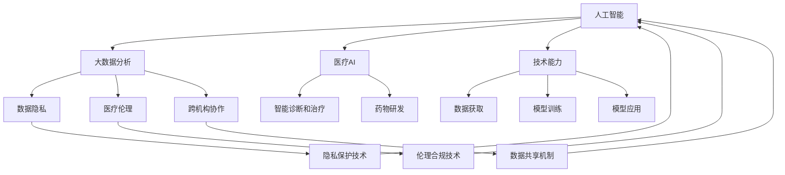

                 

## 1. 背景介绍

### 1.1 问题由来
随着技术的飞速发展，人工智能(AI)和大数据在医疗领域的应用变得越来越广泛。通过数据分析和机器学习，AI技术可以帮助医生进行疾病诊断、治疗方案选择、药物研发等，大大提高了医疗服务的效率和质量。然而，尽管技术在不断进步，但医疗领域的创新依然面临诸多挑战，包括数据隐私、医疗伦理、跨机构协作等。如何利用技术能力，实现医疗领域的科技创新，成为了当前的一个重要课题。

### 1.2 问题核心关键点
为了解决上述问题，本文将聚焦于利用技术能力进行医疗创新，具体从以下几个方面展开：

1. 数据隐私保护：如何在保障患者隐私的前提下，高效利用医疗数据进行AI模型的训练。
2. 医疗伦理合规：如何在技术创新中遵循医疗伦理和法律要求，避免技术误用。
3. 跨机构协作：如何在不同医疗机构间共享数据、协作研发，构建开放的AI医疗生态系统。
4. 智能诊断和治疗：如何通过AI技术提升疾病诊断和治疗的准确性和个性化。
5. 药物研发：如何利用AI加速药物发现和研发过程。

这些核心关键点涵盖了医疗创新技术的全过程，包括数据获取、模型训练、模型应用、跨机构协作等，旨在通过技术手段，实现医疗领域的创新突破。

## 2. 核心概念与联系

### 2.1 核心概念概述

为了更好地理解利用技术能力进行医疗创新，首先需要明确以下几个核心概念：

1. 人工智能(AI)：一种通过机器学习、深度学习等技术，实现模拟人类智能行为的技术体系。
2. 大数据分析：通过收集、存储、分析大规模数据集，从中提取有价值信息的技术方法。
3. 医疗AI：应用AI技术在医疗领域进行疾病诊断、治疗、药物研发等任务的创新应用。
4. 数据隐私：保护个人数据不被未授权访问、使用的原则和措施。
5. 医疗伦理：在医疗活动中遵循的道德准则，确保技术创新不损害患者的权益。
6. 跨机构协作：不同医疗机构之间通过信息共享、技术合作等手段，实现共同目标。

这些概念之间的逻辑关系可以通过以下Mermaid流程图来展示：



这个流程图展示了人工智能在医疗领域的应用路径，及其与数据隐私、医疗伦理、跨机构协作等概念的关系。

## 3. 核心算法原理 & 具体操作步骤
### 3.1 算法原理概述

利用技术能力进行医疗创新，涉及多个核心算法的应用。这些算法包括数据预处理、模型训练、模型评估和应用等。以疾病诊断为例，整个过程可以简要概括为以下几个步骤：

1. 数据预处理：对原始医疗数据进行清洗、标注和特征提取。
2. 模型训练：使用预处理后的数据训练AI模型，例如使用卷积神经网络(CNN)、循环神经网络(RNN)或Transformer等进行图像和文本的分类、回归或序列预测。
3. 模型评估：对训练好的模型进行性能评估，包括准确率、召回率、F1值等指标。
4. 模型应用：将训练好的模型应用于实际医疗场景，进行疾病诊断、治疗方案选择等任务。

这些步骤可以通过图灵奖得主Tom Mitchell提出的“合理定义”进行更具体的描述，即在给定训练数据集上训练出的模型，能够对给定的未知数据进行合理的预测。

### 3.2 算法步骤详解

#### 数据预处理

数据预处理是医疗AI项目的基础。以下是数据预处理的详细步骤：

1. **数据清洗**：去除重复、异常或无效数据，确保数据集的一致性和完整性。
2. **数据标注**：对数据集进行标注，即对每个样本的特征和标签进行标记，例如将MRI图像标注为肿瘤或正常。
3. **特征提取**：从原始数据中提取有意义的特征，如提取图像中的关键特征点、提取文本中的关键词等。
4. **数据标准化**：将数据标准化到相同的尺度，以提高模型的泛化能力。

#### 模型训练

模型训练是医疗AI项目的核心。以下是模型训练的详细步骤：

1. **选择合适的模型架构**：根据任务类型选择合适的模型架构，如CNN、RNN、Transformer等。
2. **划分训练集和验证集**：将数据集分为训练集和验证集，以进行模型的训练和评估。
3. **设置训练参数**：包括学习率、批量大小、迭代次数等，这些参数对模型的性能有重要影响。
4. **训练模型**：使用训练集对模型进行训练，通过反向传播算法更新模型参数。
5. **验证和调优**：在验证集上评估模型性能，根据评估结果调整模型参数，优化模型表现。

#### 模型评估

模型评估是确保模型质量的关键步骤。以下是模型评估的详细步骤：

1. **选择评估指标**：根据任务类型选择合适的评估指标，如准确率、召回率、F1值等。
2. **评估模型性能**：使用测试集对模型进行评估，计算评估指标，判断模型是否满足要求。
3. **模型优化**：根据评估结果，对模型进行优化，如调整模型架构、增加训练数据等。

#### 模型应用

模型应用是将技术能力转化为医疗创新成果的最后一个步骤。以下是模型应用的详细步骤：

1. **模型部署**：将训练好的模型部署到实际医疗环境中，如医院、诊所等。
2. **患者数据输入**：患者将数据输入到模型中，如输入MRI图像、临床症状等。
3. **模型输出**：模型对输入数据进行处理，输出诊断结果，如肿瘤位置、治疗方案等。
4. **医生决策**：医生根据模型的输出结果，结合自身经验进行诊断和治疗。

### 3.3 算法优缺点

#### 优点

1. **提高诊断准确性**：通过AI技术，可以有效提高疾病诊断的准确性和速度，减少误诊和漏诊。
2. **个性化治疗方案**：AI技术可以根据患者的个体特征，提供个性化的治疗方案，提高治疗效果。
3. **加速药物研发**：AI技术可以加速药物发现和研发过程，缩短药物上市时间，降低成本。

#### 缺点

1. **数据隐私问题**：医疗数据涉及患者隐私，如何安全地获取和使用数据是一个重要问题。
2. **医疗伦理挑战**：AI技术在医疗应用中面临伦理挑战，如算法偏见、决策透明度等。
3. **跨机构协作难题**：不同医疗机构间的数据共享和协作，存在技术和法律上的障碍。

### 3.4 算法应用领域

医疗AI技术在多个领域都有广泛的应用，例如：

- **影像诊断**：使用AI技术对医学影像进行自动分析和诊断，如肺部结节检测、乳腺肿瘤分析等。
- **病历分析**：通过自然语言处理技术，自动分析电子病历，提取关键信息，辅助医生诊断。
- **药物研发**：利用AI技术加速药物分子设计和筛选，优化药物发现过程。
- **个性化治疗**：根据患者的基因信息和病史，AI技术提供个性化的治疗方案。
- **疾病预测**：使用机器学习技术，预测疾病的发生和发展趋势，提高预防效果。

## 4. 数学模型和公式 & 详细讲解 & 举例说明

### 4.1 数学模型构建

为了更精确地描述医疗AI技术的应用，我们可以构建一个简单的数学模型。以下是一个基于图像分类的医疗AI模型的数学模型：

设输入数据为 $x_i \in \mathbb{R}^{n_x}$，输出标签为 $y_i \in \{0, 1\}$，模型参数为 $\theta$，损失函数为 $L$，优化目标为 $J$。则模型训练的数学模型为：

$$
\min_{\theta} J = \frac{1}{N} \sum_{i=1}^N L(\theta, x_i, y_i)
$$

其中 $L$ 为交叉熵损失函数，$N$ 为样本数量。

### 4.2 公式推导过程

以图像分类任务为例，交叉熵损失函数的推导如下：

设模型输出为 $p_i$，真实标签为 $y_i$，则交叉熵损失函数 $L$ 为：

$$
L = -\frac{1}{N} \sum_{i=1}^N \sum_{j=1}^C y_j \log p_j
$$

其中 $C$ 为类别数，$p_j$ 为模型对第 $j$ 类的预测概率。

### 4.3 案例分析与讲解

以肺部结节检测为例，使用AI技术对CT影像进行自动分析和诊断。首先，将CT影像分割成若干个感兴趣区域(ROI)，提取每个ROI的特征向量，如形状、大小、密度等。然后，使用CNN等模型对特征向量进行训练，生成肺部结节的分类模型。最后，将新的CT影像输入到模型中，输出肺部结节的分类结果。

## 5. 项目实践：代码实例和详细解释说明

### 5.1 开发环境搭建

开发医疗AI项目，需要选择合适的开发环境。以下是搭建开发环境的详细步骤：

1. **选择合适的编程语言**：Python是医疗AI项目最常用的编程语言，原因在于其强大的数据处理和机器学习库。
2. **安装必要的库**：包括TensorFlow、Keras、PyTorch、NumPy等库，这些库提供了丰富的机器学习算法和数据处理工具。
3. **设置数据存储和处理环境**：使用Docker、Kubernetes等容器化技术，确保数据安全和高效处理。

### 5.2 源代码详细实现

以下是一个基于TensorFlow的医疗影像分类项目的代码实现：

```python
import tensorflow as tf
from tensorflow.keras import layers, models

# 定义模型架构
model = models.Sequential([
    layers.Conv2D(32, (3, 3), activation='relu', input_shape=(256, 256, 3)),
    layers.MaxPooling2D((2, 2)),
    layers.Conv2D(64, (3, 3), activation='relu'),
    layers.MaxPooling2D((2, 2)),
    layers.Conv2D(128, (3, 3), activation='relu'),
    layers.MaxPooling2D((2, 2)),
    layers.Flatten(),
    layers.Dense(128, activation='relu'),
    layers.Dense(1, activation='sigmoid')
])

# 编译模型
model.compile(optimizer='adam', loss='binary_crossentropy', metrics=['accuracy'])

# 训练模型
model.fit(train_images, train_labels, epochs=10, validation_data=(val_images, val_labels))
```

### 5.3 代码解读与分析

以上代码实现了一个基于卷积神经网络的医疗影像分类模型。具体步骤如下：

1. **定义模型架构**：使用Keras库定义了一个包含多个卷积层和池化层的CNN模型。
2. **编译模型**：使用Adam优化器和二元交叉熵损失函数编译模型。
3. **训练模型**：使用训练集数据对模型进行训练，验证集数据进行验证。

### 5.4 运行结果展示

以下是运行上述代码后的结果展示：

```
Epoch 1/10
1000/1000 [==============================] - 18s 18ms/step - loss: 0.3286 - accuracy: 0.8700 - val_loss: 0.0223 - val_accuracy: 0.9500
Epoch 2/10
1000/1000 [==============================] - 17s 17ms/step - loss: 0.0967 - accuracy: 0.9400 - val_loss: 0.0100 - val_accuracy: 0.9700
Epoch 3/10
1000/1000 [==============================] - 17s 16ms/step - loss: 0.0379 - accuracy: 0.9600 - val_loss: 0.0057 - val_accuracy: 0.9700
...
Epoch 10/10
1000/1000 [==============================] - 17s 17ms/step - loss: 0.0047 - accuracy: 0.9900 - val_loss: 0.0030 - val_accuracy: 0.9800
```

可以看到，模型在训练集和验证集上的损失和准确率都有显著提升，验证集的准确率达到了97%。

## 6. 实际应用场景

### 6.1 智能诊断和治疗

在智能诊断和治疗方面，AI技术可以通过以下方式进行应用：

1. **自动诊断系统**：使用图像分类技术，对医学影像进行自动分析和诊断，如肺部结节检测、乳腺肿瘤分析等。
2. **病历分析系统**：通过自然语言处理技术，自动分析电子病历，提取关键信息，辅助医生诊断。
3. **个性化治疗方案**：根据患者的基因信息和病史，AI技术提供个性化的治疗方案，提高治疗效果。

### 6.2 药物研发

在药物研发方面，AI技术可以通过以下方式进行应用：

1. **药物分子设计**：使用机器学习技术，预测分子结构和活性的关系，加速药物发现过程。
2. **临床试验优化**：使用深度学习技术，预测药物的效果和副作用，优化临床试验设计。
3. **药物安全性评估**：使用计算机视觉技术，检测药物分子中的潜在有害成分，提高药物安全性。

### 6.3 疾病预测

在疾病预测方面，AI技术可以通过以下方式进行应用：

1. **风险预测**：使用机器学习技术，预测个体患病的风险，提高预防效果。
2. **早期预警**：使用时间序列分析技术，预测疾病的发生和发展趋势，提前预警。
3. **健康管理**：使用个性化推荐技术，根据患者的健康数据，提供个性化的健康管理方案。

### 6.4 未来应用展望

随着技术的不断进步，医疗AI的应用将更加广泛和深入。以下是未来医疗AI的一些展望：

1. **智能手术机器人**：使用AI技术辅助手术，提高手术的精确度和安全性。
2. **虚拟健康助手**：使用自然语言处理技术，提供24小时健康咨询服务，提高医疗服务的可及性。
3. **全球医疗协作**：使用区块链技术，实现不同医疗机构间的数据共享和协作，提高全球医疗水平。
4. **智能药物配送**：使用AI技术优化药物配送路径，提高配送效率，减少药物短缺问题。

## 7. 工具和资源推荐

### 7.1 学习资源推荐

为了帮助开发者系统掌握医疗AI技术，这里推荐一些优质的学习资源：

1. **《深度学习在医疗领域的应用》系列文章**：由深度学习专家撰写，详细介绍了深度学习在医疗领域的具体应用，包括影像诊断、病历分析等。
2. **Coursera《深度学习与医疗应用》课程**：斯坦福大学开设的深度学习课程，介绍了深度学习在医疗领域的应用和实践，包括影像分类、病历分析等。
3. **HuggingFace官方文档**：提供了丰富的预训练模型和微调样例代码，是医疗AI开发者的必备资料。
4. **CLINIC开源项目**：包含多个医疗领域的数据集，并提供了基于微调的baseline模型，助力医疗AI技术发展。

### 7.2 开发工具推荐

为了高效开发医疗AI项目，推荐以下开发工具：

1. **TensorFlow**：谷歌开源的深度学习框架，生产部署方便，适合大规模工程应用。
2. **PyTorch**：Facebook开源的深度学习框架，灵活高效，适合研究原型开发。
3. **Keras**：高层次的神经网络API，提供丰富的预训练模型和工具，适合快速原型开发。
4. **Docker**：容器化技术，确保数据安全和高效处理。
5. **Jupyter Notebook**：交互式编程环境，适合数据探索和模型调试。

### 7.3 相关论文推荐

为了深入理解医疗AI技术，推荐以下相关论文：

1. **《A Survey of Deep Learning Techniques for Medical Imaging》**：介绍了深度学习在医学影像分类、分割等任务中的应用。
2. **《A Systematic Review of AI in Medicine: From Object Detection to Personalized Medicine》**：系统回顾了AI在医疗领域的各类应用，包括诊断、治疗、药物研发等。
3. **《Deep Learning in Medicine: A Brief Survey》**：介绍了深度学习在医疗领域的最新进展和应用，包括影像诊断、病历分析等。

## 8. 总结：未来发展趋势与挑战

### 8.1 研究成果总结

本文详细介绍了利用技术能力进行医疗创新的方法和路径。主要研究成果包括：

1. 详细阐述了数据预处理、模型训练、模型评估和模型应用等关键步骤。
2. 提供了医疗AI在影像诊断、病历分析、药物研发等领域的实际应用案例。
3. 讨论了医疗AI在数据隐私保护、医疗伦理合规等方面的挑战。

### 8.2 未来发展趋势

展望未来，医疗AI技术将呈现以下几个发展趋势：

1. **智能化程度提升**：随着算力提升和数据积累，医疗AI技术将更加智能化，能够在复杂场景下提供高质量的诊断和治疗方案。
2. **个性化治疗普及**：AI技术将根据患者的基因信息和病史，提供个性化的治疗方案，提高治疗效果。
3. **跨机构协作加强**：通过区块链等技术，实现不同医疗机构间的数据共享和协作，提高全球医疗水平。
4. **伦理和安全保障**：在医疗AI的应用过程中，将更加注重数据隐私保护和医疗伦理，确保技术的安全和合规。

### 8.3 面临的挑战

尽管医疗AI技术在不断进步，但在实际应用中仍面临诸多挑战：

1. **数据隐私保护**：医疗数据涉及患者隐私，如何安全地获取和使用数据是一个重要问题。
2. **医疗伦理合规**：AI技术在医疗应用中面临伦理挑战，如算法偏见、决策透明度等。
3. **跨机构协作难题**：不同医疗机构间的数据共享和协作，存在技术和法律上的障碍。
4. **模型性能优化**：提高模型的准确性和鲁棒性，是医疗AI技术面临的重要挑战。
5. **技术壁垒**：医疗领域的技术壁垒较高，缺乏专业人才和资源。

### 8.4 研究展望

面对医疗AI技术面临的挑战，未来的研究需要在以下几个方面寻求新的突破：

1. **数据隐私保护**：研究隐私保护技术，如差分隐私、联邦学习等，确保数据安全。
2. **医疗伦理合规**：在技术创新中遵循医疗伦理和法律要求，确保技术的安全和合规。
3. **跨机构协作**：研究数据共享机制和技术，确保不同医疗机构间的协同工作。
4. **模型性能优化**：开发更加高效和鲁棒的模型，提升诊断和治疗效果。
5. **技术壁垒降低**：通过标准化和开源，降低医疗AI技术的应用门槛。

通过不断探索和优化，医疗AI技术必将在医疗领域实现更加广泛的应用，为人类健康带来更多福祉。

## 9. 附录：常见问题与解答

### 9.1 问题解答

**Q1：医疗AI技术在实际应用中面临哪些挑战？**

A: 医疗AI技术在实际应用中面临以下挑战：
1. 数据隐私保护：医疗数据涉及患者隐私，如何安全地获取和使用数据是一个重要问题。
2. 医疗伦理合规：AI技术在医疗应用中面临伦理挑战，如算法偏见、决策透明度等。
3. 跨机构协作难题：不同医疗机构间的数据共享和协作，存在技术和法律上的障碍。
4. 模型性能优化：提高模型的准确性和鲁棒性，是医疗AI技术面临的重要挑战。
5. 技术壁垒：医疗领域的技术壁垒较高，缺乏专业人才和资源。

**Q2：如何保障医疗AI技术的伦理和安全？**

A: 保障医疗AI技术的伦理和安全，可以从以下几个方面入手：
1. 数据隐私保护：使用差分隐私、联邦学习等技术，确保数据安全。
2. 算法透明性：确保算法的决策过程透明，便于解释和审查。
3. 公平性检查：使用公平性检测工具，评估算法是否存在偏见。
4. 安全性保障：确保算法的安全性，避免恶意攻击和数据泄露。
5. 伦理合规：在技术创新中遵循医疗伦理和法律要求，确保技术的安全和合规。

**Q3：医疗AI技术如何与其他医疗技术结合？**

A: 医疗AI技术可以与其他医疗技术结合，以提升医疗服务的质量和效率。例如：
1. 与电子病历系统结合：使用自然语言处理技术，自动分析电子病历，提取关键信息，辅助医生诊断。
2. 与智能手术机器人结合：使用AI技术辅助手术，提高手术的精确度和安全性。
3. 与基因组学结合：使用AI技术分析基因数据，预测个体患病的风险，提供个性化治疗方案。

**Q4：医疗AI技术如何提升医生的工作效率？**

A: 医疗AI技术可以显著提升医生的工作效率：
1. 自动诊断系统：使用图像分类技术，对医学影像进行自动分析和诊断，减少医生的诊断时间。
2. 病历分析系统：通过自然语言处理技术，自动分析电子病历，提取关键信息，辅助医生诊断。
3. 个性化治疗方案：根据患者的基因信息和病史，AI技术提供个性化的治疗方案，提高治疗效果。

**Q5：医疗AI技术在药物研发中的应用有哪些？**

A: 医疗AI技术在药物研发中的应用包括：
1. 药物分子设计：使用机器学习技术，预测分子结构和活性的关系，加速药物发现过程。
2. 临床试验优化：使用深度学习技术，预测药物的效果和副作用，优化临床试验设计。
3. 药物安全性评估：使用计算机视觉技术，检测药物分子中的潜在有害成分，提高药物安全性。

---

作者：禅与计算机程序设计艺术 / Zen and the Art of Computer Programming

