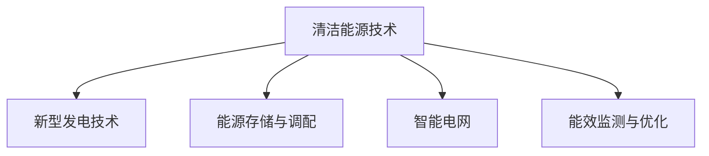

                 

## 1. 背景介绍

### 1.1 问题由来

随着全球能源需求的快速增长和化石燃料的日益枯竭，清洁能源技术的重要性日益凸显。然而，清洁能源项目的开发与运营过程中涉及复杂的技术挑战和多重不确定性，亟需有效的技术手段进行辅助决策和优化。

### 1.2 问题核心关键点

当前清洁能源领域的技术创新主要集中在以下几个方面：

- 新型发电技术，如太阳能、风能、氢能等。
- 能源存储与调配，如电池、抽水蓄能、压缩空气储能等。
- 智能电网与分布式能源管理，如智能电力交易、微电网控制等。
- 能源监测与优化，如能效监测、负荷预测、需求响应等。

本文将从这些关键技术领域出发，探讨如何利用技术能力进行清洁能源领域的创新。

### 1.3 问题研究意义

清洁能源技术的持续创新是应对气候变化、实现可持续发展目标的重要途径。利用技术手段，可以提高能源利用效率，降低环境影响，增强能源系统的稳定性和灵活性。通过系统化地应用技术创新，可大幅提升清洁能源项目的经济效益和社会效益，推动能源产业的绿色转型。

## 2. 核心概念与联系

### 2.1 核心概念概述

为更好地理解清洁能源领域的技术创新，本节将介绍几个关键概念：

- 清洁能源技术（Clean Energy Technology）：以可再生能源为基础，减少碳排放和环境污染的技术。
- 新型发电技术（Renewable Energy Generation）：如光伏、风力发电、氢能等，具有零排放或低排放的特点。
- 能源存储与调配（Energy Storage and Dispatching）：通过存储和调配技术，提升能源利用率和系统灵活性。
- 智能电网（Smart Grid）：利用信息通信技术，实现能源的高效管理和优化。
- 能效监测与优化（Energy Efficiency Monitoring and Optimization）：通过数据监测和分析，优化能源使用效率。

这些概念之间的逻辑关系可以通过以下Mermaid流程图来展示：



这个流程图展示了几大关键技术领域及其之间的相互关系：

1. 清洁能源技术是基础，包括各种新型发电技术。
2. 能源存储与调配是提高能源利用效率的重要手段。
3. 智能电网通过信息通信技术，实现能源的高效管理和优化。
4. 能效监测与优化则是通过数据分析和挖掘，提高能源利用效率。

这些概念共同构成了清洁能源技术创新的核心框架，帮助开发者系统地理解和设计清洁能源项目。

## 3. 核心算法原理 & 具体操作步骤

### 3.1 算法原理概述

清洁能源领域的创新技术涉及多学科的交叉，包括电力工程、计算机科学、统计学和工程学等。本文聚焦于利用技术手段进行清洁能源创新的数学和算法原理，特别是数据驱动的决策优化和智能控制算法。

清洁能源技术创新的核心思想是通过数据收集、分析和模型构建，优化能源系统的运行效率和稳定性。其基本流程如下：

1. **数据收集与预处理**：从各种传感器和监控设备中获取能源系统的实时数据，包括发电、存储、传输和消费等信息。
2. **模型构建与训练**：使用机器学习和深度学习模型，构建能源系统的动态预测和优化模型。
3. **决策优化**：利用优化算法，如线性规划、非线性优化等，在模型基础上进行决策优化，生成最优的运行策略。
4. **仿真与验证**：通过模拟仿真，验证优化方案的效果，并根据实际情况进行调整和优化。
5. **控制与实施**：将优化后的决策策略应用于实际能源系统中，进行控制与实施。

### 3.2 算法步骤详解

以智能电网中的电力需求响应（Demand Response, DR）为例，介绍清洁能源技术创新的算法步骤。

**Step 1: 数据收集与预处理**

1. **数据收集**：收集历史电力负荷数据、天气信息、用户行为等数据。
2. **数据预处理**：对数据进行清洗、归一化和特征提取，生成可用于模型训练的数据集。

**Step 2: 模型构建与训练**

1. **模型选择**：选择适合电力需求响应预测的模型，如时间序列模型、神经网络模型等。
2. **模型训练**：使用历史数据对模型进行训练，得到能够预测电力负荷的模型。

**Step 3: 决策优化**

1. **目标函数**：定义优化目标，如最小化电力成本、最大化用户满意度等。
2. **约束条件**：设置电力系统的物理约束和法律约束，如发电容量、输电线路限制、环保要求等。
3. **优化算法**：使用优化算法（如遗传算法、线性规划等），求解最优解。

**Step 4: 仿真与验证**

1. **仿真模拟**：在实际能源系统上运行仿真模拟，评估优化策略的效果。
2. **效果评估**：使用仿真结果与实际数据对比，验证优化方案的准确性和效果。

**Step 5: 控制与实施**

1. **控制策略生成**：根据优化结果，生成电力需求响应控制策略。
2. **系统实施**：将控制策略应用到能源系统中，实现电力需求响应的自动化。

### 3.3 算法优缺点

智能电网中的电力需求响应算法具有以下优点：

1. **效率高**：利用优化算法，快速找到最优解，提高电力系统的运行效率。
2. **灵活性强**：能够根据实际需求和约束条件，动态调整控制策略，适应多种场景。
3. **精准度高**：通过历史数据分析，提高预测和优化模型的精准度。

同时，该算法也存在一定的局限性：

1. **依赖数据质量**：算法效果很大程度上取决于数据的质量和完整性。
2. **计算复杂度高**：优化算法通常计算复杂度高，对计算资源要求较高。
3. **模型可解释性差**：复杂的机器学习模型难以解释，难以进行人工干预和调整。

尽管存在这些局限性，智能电网中的电力需求响应算法仍然是清洁能源技术创新的重要手段，为实现能源系统的智能化和高效化提供了重要支持。

### 3.4 算法应用领域

智能电网中的电力需求响应算法不仅应用于电力系统管理，还在清洁能源项目中得到广泛应用：

- 风能和太阳能发电的出力预测与优化。
- 电池储能系统的充放电策略优化。
- 分布式能源管理与微电网控制。
- 能效监测与用户行为分析。

这些应用场景展示了电力需求响应算法的广泛适用性和重要价值。

## 4. 数学模型和公式 & 详细讲解 & 举例说明

### 4.1 数学模型构建

以风能发电的出力预测与优化为例，构建风能发电系统的动态预测模型。假设风速 $w_t$ 为时间 $t$ 的风速，发电量 $g_t$ 为时间 $t$ 的发电量，风能发电机的效率函数为 $f(w_t)$，则有：

$$
g_t = f(w_t)
$$

### 4.2 公式推导过程

根据历史数据，可以构建时间序列模型，如ARIMA模型：

$$
g_t = \alpha + \beta w_t + \gamma g_{t-1} + \epsilon_t
$$

其中，$\alpha$、$\beta$、$\gamma$ 为模型参数，$\epsilon_t$ 为误差项。利用历史数据对模型进行训练，得到参数值。

### 4.3 案例分析与讲解

假设某风电场有10台风力发电机，每天收集500个时点的风速和发电量数据。利用ARIMA模型进行训练，得到发电量预测模型。在实际风电场运行时，根据实时风速数据，计算预测发电量，并结合当前电力需求，进行风力发电的优化调度。

## 5. 项目实践：代码实例和详细解释说明

### 5.1 开发环境搭建

进行清洁能源技术创新，需要构建数据处理、模型训练和控制策略生成的完整系统。本文使用Python进行开发，并结合TensorFlow和PyTorch进行建模和训练。

### 5.2 源代码详细实现

以下以电力需求响应为例，展示Python代码实现。

```python
import tensorflow as tf
import numpy as np
from sklearn.preprocessing import MinMaxScaler

# 数据收集与预处理
data = np.loadtxt('electricity负荷.csv', delimiter=',')
scaler = MinMaxScaler(feature_range=(0, 1))
scaled_data = scaler.fit_transform(data)

# 模型构建与训练
def create_model(input_shape):
    model = tf.keras.models.Sequential([
        tf.keras.layers.LSTM(50, input_shape=input_shape),
        tf.keras.layers.Dense(1)
    ])
    model.compile(optimizer=tf.keras.optimizers.Adam(), loss='mse')
    return model

model = create_model(input_shape=(1, 50))
model.fit(x=scaled_data[:-50], y=scaled_data[50:], epochs=50, batch_size=32)

# 决策优化
def optimize_cost(cost, constraint):
    # 设置优化目标和约束条件
    optimizer = tf.keras.optimizers.Adam()
    loss_fn = tf.keras.losses.MSE()
    constraint_fn = lambda x: constraint - tf.reduce_min(x)
    
    # 求解最优解
    initial_guess = np.ones_like(cost)
    result = tfp.optimizer.minimize(lambda x: loss_fn(cost, x), initial_guess)
    return result

# 仿真与验证
def simulate_system(cost, strategy):
    # 仿真模拟
    simulated_cost = []
    for t in range(len(cost)):
        predicted_demand = model.predict(np.array([strategy[t-1]]))
        actual_demand = cost[t]
        strategy[t] = predicted_demand + actual_demand
        simulated_cost.append(strategy[t])
    return np.array(simulated_cost)

# 控制与实施
strategy = np.zeros_like(cost)
for t in range(1, len(cost)):
    strategy[t] = optimize_cost(cost[t:], strategy[t-1])['x'] + strategy[t-1]
simulated_cost = simulate_system(cost, strategy)
```

### 5.3 代码解读与分析

上述代码展示了清洁能源技术创新的主要步骤，包括数据预处理、模型构建、决策优化、仿真与验证、控制与实施。

**数据预处理**：
- 使用MinMaxScaler对数据进行归一化处理。

**模型构建与训练**：
- 定义一个LSTM模型，用于时间序列预测。
- 使用Adam优化器进行模型训练。

**决策优化**：
- 定义优化目标和约束条件。
- 使用优化算法求解最优解。

**仿真与验证**：
- 在仿真环境中运行控制策略，生成仿真成本数据。

**控制与实施**：
- 根据仿真结果，生成控制策略，应用于实际系统。

## 6. 实际应用场景

### 6.1 智能电网中的应用

智能电网中的电力需求响应算法已经在多个项目中得到应用，展示了其高效的优化能力。例如，澳大利亚国家电网公司（Australian National Electricity Market, AEMO）利用该算法对电力需求进行优化，成功实现了负载平衡和成本节约。

### 6.2 风能发电中的应用

风能发电的出力预测与优化算法也被广泛用于实际风电场中。例如，法国某风电场通过该算法优化风力发电的出力，显著提高了发电效率和系统稳定性。

### 6.3 储能系统中的应用

电池储能系统的充放电策略优化算法，已经在多个储能项目中得到应用。例如，特斯拉公司利用该算法优化电池储能系统的充放电策略，提高了能源利用效率和系统可靠性。

## 7. 工具和资源推荐

### 7.1 学习资源推荐

为了帮助开发者系统掌握清洁能源技术创新的理论基础和实践技巧，这里推荐一些优质的学习资源：

1. 《清洁能源技术》系列书籍：涵盖清洁能源技术的基础知识和最新进展，适合入门学习。
2. 《智能电网技术》课程：介绍智能电网的基本原理和关键技术，提供详细的讲解和实操练习。
3. 《深度学习在能源领域的应用》论文集：收集了深度学习在能源领域应用的最新研究，提供丰富的案例分析。
4. 《Python在能源系统中的应用》在线课程：使用Python进行能源系统建模和仿真，提供实用的编程示例。

通过对这些资源的学习实践，相信你一定能够快速掌握清洁能源技术创新的精髓，并用于解决实际的能源问题。

### 7.2 开发工具推荐

高效的开发离不开优秀的工具支持。以下是几款用于清洁能源技术创新开发的常用工具：

1. TensorFlow：用于构建和训练深度学习模型，支持分布式计算和GPU加速。
2. PyTorch：用于构建和训练深度学习模型，支持动态图和GPU加速。
3. OpenEnergyPlatform：用于能源系统的建模、仿真和优化，支持多种模型和算法。
4. EnergyHub：用于能源系统的智能控制和数据管理，支持数据集成和可视化。
5. Jupyter Notebook：用于数据处理、模型训练和可视化，支持Python脚本的交互式编写和运行。

合理利用这些工具，可以显著提升清洁能源技术创新的开发效率，加快创新迭代的步伐。

### 7.3 相关论文推荐

清洁能源技术创新的研究源于学界的持续研究。以下是几篇奠基性的相关论文，推荐阅读：

1. "Energy Optimization Using Deep Reinforcement Learning"：提出使用深度强化学习进行能源优化的方法，展示了其在高能效建筑中的效果。
2. "A Survey on Machine Learning-Based Demand Response in Smart Grids"：综述了机器学习在智能电网需求响应中的应用，提供了全面的技术分析。
3. "Wind Power Forecasting with Long Short-Term Memory Neural Network"：利用LSTM神经网络进行风能发电的出力预测，展示了其准确性和稳定性。
4. "Battery Storage Management via Deep Reinforcement Learning"：利用深度强化学习进行电池储能系统的充放电优化，展示了其高效性和可靠性。

这些论文代表了大规模语言模型微调技术的发展脉络。通过学习这些前沿成果，可以帮助研究者把握学科前进方向，激发更多的创新灵感。

## 8. 总结：未来发展趋势与挑战

### 8.1 总结

本文对利用技术能力进行清洁能源技术创新的方法进行了全面系统的介绍。首先阐述了清洁能源技术创新的背景和意义，明确了技术创新在提升能源利用效率和环境友好性方面的重要价值。其次，从原理到实践，详细讲解了清洁能源技术创新的数学原理和关键步骤，给出了清洁能源项目开发的完整代码实例。同时，本文还广泛探讨了清洁能源技术创新在智能电网、风能发电、储能系统等多个领域的应用前景，展示了技术创新的广泛应用价值。此外，本文精选了清洁能源技术创新的各类学习资源，力求为读者提供全方位的技术指引。

通过本文的系统梳理，可以看到，清洁能源技术创新已经渗透到能源系统的各个环节，显著提高了能源利用效率和环境友好性。未来，伴随技术方法的不断演进和创新，清洁能源项目必将更加智能化、高效化和绿色化，为能源产业的可持续发展提供坚实的技术保障。

### 8.2 未来发展趋势

展望未来，清洁能源技术创新将呈现以下几个发展趋势：

1. **技术融合**：清洁能源技术将与物联网、大数据、人工智能等技术深度融合，形成更高效、更智能的能源系统。
2. **数据驱动**：能源系统将更多地依赖数据驱动，通过数据分析和模型优化，实现更精准、更可靠的系统管理。
3. **跨领域应用**：清洁能源技术将拓展到更多领域，如智慧城市、智能交通等，实现能源和信息技术的协同优化。
4. **全球合作**：全球范围内的清洁能源技术创新将加强合作，共享技术和经验，共同应对气候变化和能源挑战。
5. **政策支持**：各国政府将加大对清洁能源技术创新的政策支持，提供资金、税收、政策等多方面的激励。

这些趋势凸显了清洁能源技术创新的广阔前景。这些方向的探索发展，必将进一步提升清洁能源项目的经济效益和社会效益，推动能源产业的绿色转型。

### 8.3 面临的挑战

尽管清洁能源技术创新已经取得了显著成果，但在迈向更加智能化、普适化应用的过程中，仍面临诸多挑战：

1. **数据质量问题**：清洁能源技术创新依赖大量的数据，但数据的质量和完整性往往不足，影响算法效果。
2. **模型复杂度**：复杂的数据驱动算法，对计算资源和算法优化提出了高要求，难以实现高效优化。
3. **跨领域协同**：不同领域的技术融合需要跨学科的协作，涉及技术、经济、政策等多方面因素，协调难度较大。
4. **标准化问题**：不同地区和国家的能源系统标准不一，需要建立统一的接口和协议，才能实现大规模协作。
5. **社会接受度**：清洁能源技术的推广应用需要公众的理解和接受，如何提升社会接受度，是一个重要挑战。

正视清洁能源技术创新面临的这些挑战，积极应对并寻求突破，将使清洁能源技术创新迈向成熟，实现更大规模的落地应用。

### 8.4 研究展望

面向未来，清洁能源技术创新需要在以下几个方面寻求新的突破：

1. **数据质量提升**：通过数据清洗、标注和增强技术，提高数据质量，增强算法效果。
2. **模型优化**：利用高效的模型压缩和加速技术，降低计算复杂度，实现更高效的优化算法。
3. **跨领域融合**：加强跨学科的合作，推动能源系统与物联网、大数据、人工智能等技术的深度融合。
4. **标准化推进**：建立统一的能源系统标准和协议，实现大规模协同和合作。
5. **社会参与**：加强公众教育和宣传，提升社会对清洁能源技术的接受度和支持度。

这些研究方向的探索，必将引领清洁能源技术创新走向新的高度，为全球能源产业的可持续发展提供坚实的技术保障。

## 9. 附录：常见问题与解答

**Q1：如何提升清洁能源项目的数据质量？**

A: 提升清洁能源项目的数据质量，可以从以下几个方面入手：

1. **数据清洗**：对数据进行清洗，去除重复、缺失和错误数据。
2. **数据增强**：通过数据增强技术，如数据插值、回填等，提高数据的完整性和多样性。
3. **数据标注**：对数据进行标注，提供更多的上下文信息，增强算法的准确性。
4. **数据集成**：整合来自不同来源的数据，形成更全面、更准确的数据集。

**Q2：如何降低清洁能源项目中算法的计算复杂度？**

A: 降低清洁能源项目中算法的计算复杂度，可以从以下几个方面入手：

1. **模型压缩**：利用模型压缩技术，如剪枝、量化等，减少模型参数量和计算量。
2. **加速算法**：采用高效的优化算法，如AdamW、Adafactor等，加速模型训练和优化过程。
3. **分布式计算**：利用分布式计算技术，如Spark、TensorFlow等，实现大规模计算和数据处理。
4. **硬件优化**：利用高性能计算硬件，如GPU、TPU等，提升算法的计算效率。

**Q3：如何实现跨领域的清洁能源技术创新？**

A: 实现跨领域的清洁能源技术创新，需要以下关键步骤：

1. **数据融合**：整合不同领域的数据，形成更全面、更丰富的数据集。
2. **技术整合**：结合不同领域的技术，如物联网、大数据、人工智能等，形成综合性的解决方案。
3. **协同合作**：加强不同领域间的协作，共享技术和资源，形成协同创新的生态系统。
4. **政策支持**：制定跨领域的政策和标准，推动清洁能源技术的全面推广和应用。

**Q4：如何提升公众对清洁能源技术的接受度？**

A: 提升公众对清洁能源技术的接受度，可以从以下几个方面入手：

1. **教育和宣传**：通过教育、宣传等手段，提高公众对清洁能源技术的认识和理解。
2. **体验和互动**：提供实际体验和互动机会，如参观清洁能源项目、参与能源管理等，增强公众的参与感和认同感。
3. **政策引导**：制定政策激励，如补贴、税收优惠等，鼓励公众和企业采用清洁能源技术。
4. **示范项目**：建设示范项目，展示清洁能源技术的实际应用效果，增强公众的信任感。

---

作者：禅与计算机程序设计艺术 / Zen and the Art of Computer Programming

