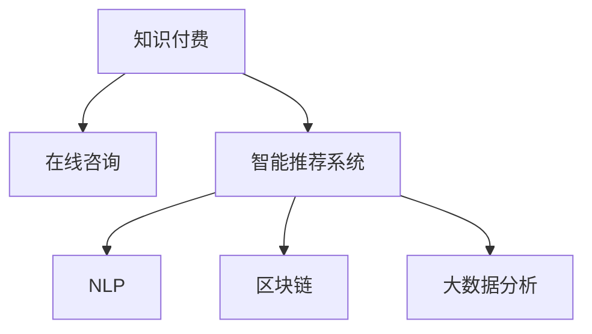

                 

# 如何利用知识付费实现在线投资移民与海外置业指导？

## 1. 背景介绍

### 1.1 问题由来
随着全球化的深入发展，越来越多的家庭和企业选择跨国投资和移民，以寻求更广阔的发展机遇和更高的生活质量。然而，海外投资移民过程复杂，涉及政策法规、金融税务、法律风险等多方面问题，且信息不对称、专业门槛高等问题，导致许多人望而却步。

为解决这一难题，知识付费模式应运而生。通过在线平台，专家学者通过分享专业的投资移民知识，帮助客户了解政策法规、市场趋势、风险评估等内容，使客户能够在全面掌握相关信息后，做出明智的决策。

### 1.2 问题核心关键点
知识付费平台如何高效整合资源，快速响应用户需求？如何通过在线交互，保证咨询和指导的及时性、专业性？如何建立信任机制，提高用户粘性？

## 2. 核心概念与联系

### 2.1 核心概念概述

为更好地理解基于知识付费模式实现在线投资移民与海外置业指导，本节将介绍几个关键概念：

- 知识付费(Knowledge Paywall)：以专业知识的获取为付费基础，用户通过购买知识服务来获取专业信息，解决具体问题。

- 在线咨询(Online Consultation)：用户通过在线平台与专业人士进行交流，获取实时信息服务。

- 智能推荐系统(Intelligent Recommendation System)：基于用户行为、偏好等数据，自动推荐相关课程和内容。

- 自然语言处理(NLP)：通过NLP技术，平台能够理解用户查询意图，提供更加精准的服务。

- 区块链技术(Blockchain)：用于构建透明、安全的交易和数据存储机制，保障用户权益。

- 大数据分析(Big Data Analysis)：通过数据分析，平台能够挖掘用户行为规律，优化用户体验。

这些核心概念之间的逻辑关系可以通过以下Mermaid流程图来展示：



这个流程图展示了几类关键概念之间的关联：

1. 知识付费平台基于在线咨询为用户提供专业知识。
2. 智能推荐系统利用NLP和大数据分析技术，对用户需求进行精准识别。
3. 区块链技术确保交易和数据的安全透明。

## 3. 核心算法原理 & 具体操作步骤

### 3.1 算法原理概述

基于知识付费模式实现在线投资移民与海外置业指导，本质上是一个以用户需求为基础，通过信息筛选和推荐机制，实现高效匹配的过程。其核心思想是：

1. 收集并整合大量投资移民相关知识，构建知识库。
2. 分析用户查询需求，找到最匹配的知识内容。
3. 通过推荐算法，将合适的内容推荐给用户。

### 3.2 算法步骤详解

#### Step 1: 数据收集与预处理

- 收集各类与投资移民相关的政策法规、成功案例、市场趋势、风险评估等知识。
- 对收集到的知识进行清洗、标注，构建标准化的知识库。

#### Step 2: 用户意图分析

- 通过自然语言处理技术，分析用户查询语句，提取关键词、实体、意图等信息。
- 利用机器学习模型，对用户行为数据进行聚类和分类，构建用户画像。

#### Step 3: 知识推荐

- 根据用户画像和查询意图，通过协同过滤、内容过滤等推荐算法，找到最相关的知识内容。
- 动态调整推荐算法，如引入用户反馈数据，持续优化推荐效果。

#### Step 4: 交易与反馈

- 用户通过知识付费平台下单购买推荐的知识内容。
- 平台记录交易数据和用户反馈，进行分析和改进，进一步优化推荐模型。

### 3.3 算法优缺点

#### 优点

1. 高效匹配：智能推荐算法能够快速响应用户需求，提供精准匹配的专家咨询。
2. 知识全面：平台知识库覆盖广，用户能够获取最新、最全面的信息。
3. 安全透明：区块链技术确保交易和数据的安全透明，保障用户权益。

#### 缺点

1. 专业门槛高：对平台提供的专业知识有较高的专业要求，可能存在质量参差不齐的情况。
2. 付费门槛：部分用户可能因费用问题无法获得所需知识。
3. 信息过载：大量知识内容可能使用户难以筛选，需要平台提供有效的过滤和推荐机制。

### 3.4 算法应用领域

该算法已经在多个领域得到广泛应用，如在线教育、金融理财、医疗健康等。通过匹配用户需求与知识资源，知识付费模式极大地提升了信息获取的效率和质量，推动了相关领域的创新发展。

## 4. 数学模型和公式 & 详细讲解 & 举例说明

### 4.1 数学模型构建

定义用户 $U$，知识内容 $K$，知识推荐系统 $S$。用户需求 $D$ 与知识内容 $K$ 的匹配度 $M$ 定义为：

$$ M = \frac{\sum_{k \in K}\text{score}_{uk}\times\text{weight}_k}{\sum_{k \in K}\text{weight}_k} $$

其中，$\text{score}_{uk}$ 表示用户 $U$ 对知识内容 $K$ 的评分，$\text{weight}_k$ 表示知识内容 $K$ 的权重。

### 4.2 公式推导过程

用户 $U$ 查询一条信息 $d$，平台通过以下步骤计算推荐的知识内容：

1. 对用户 $U$ 的历史行为进行聚类和分类，构建用户画像 $P_U$。
2. 对知识内容 $K$ 进行特征提取，得到特征向量 $V_K$。
3. 计算用户画像 $P_U$ 与知识内容 $K$ 的匹配度 $M$。
4. 根据匹配度 $M$ 和用户评分 $\text{score}_{ud}$，计算推荐得分 $R_{uk}$。
5. 利用推荐算法对推荐得分 $R_{uk}$ 进行排序，找到推荐的知识内容 $K'$。

通过上述计算过程，平台能够高效地匹配用户需求和知识内容，实现精准推荐。

### 4.3 案例分析与讲解

假设用户 $U$ 查询了一条关于加拿大移民政策的信息。平台通过自然语言处理技术，提取出“移民政策”、“加拿大”、“时间表”等关键词。

接着，平台对知识库中相关的内容进行特征提取，计算出与用户需求匹配度较高的内容。例如，通过协同过滤算法，发现用户 $U$ 对相似主题的内容评分较高，推荐与之相似的知识内容 $K'$。

最后，平台展示推荐内容，用户浏览后可以进行评分和反馈，进一步优化推荐算法。

## 5. 项目实践：代码实例和详细解释说明

### 5.1 开发环境搭建

在进行项目实践前，我们需要准备好开发环境。以下是使用Python进行开发的环境配置流程：

1. 安装Anaconda：从官网下载并安装Anaconda，用于创建独立的Python环境。

2. 创建并激活虚拟环境：
```bash
conda create -n knowledge-paywall python=3.8 
conda activate knowledge-paywall
```

3. 安装相关工具包：
```bash
pip install numpy pandas scikit-learn torch transformers flask sklearn-kb flask-cors
```

### 5.2 源代码详细实现

我们以推荐系统为例，给出使用Transformers库和Flask构建知识付费平台的PyTorch代码实现。

首先，定义用户行为数据和知识库的构建：

```python
from sklearn.datasets import load_files
from sklearn.feature_extraction.text import TfidfVectorizer
from sklearn.metrics.pairwise import cosine_similarity
import torch
from transformers import BertTokenizer, BertModel
from torch.utils.data import Dataset, DataLoader

# 用户行为数据
class UserBehavior(Dataset):
    def __init__(self, data_dir):
        self.data_dir = data_dir
        self.data = load_files(self.data_dir)
        self.vect = TfidfVectorizer()
        self.user_pv = {}
        self.doc_vec = {}
        for i, doc in enumerate(self.data.data):
            tokens = self.vect.fit(doc).transform([doc])
            self.doc_vec[i] = tokens.toarray()
            self.user_pv[i] = {'tokens': tokens, 'doc': doc}
        
    def __len__(self):
        return len(self.data.data)
    
    def __getitem__(self, idx):
        return self.user_pv[idx]

# 知识库构建
class KnowledgeBase(Dataset):
    def __init__(self, data_dir):
        self.data_dir = data_dir
        self.data = load_files(self.data_dir)
        self.vect = TfidfVectorizer()
        self.doc_vec = {}
        for i, doc in enumerate(self.data.data):
            tokens = self.vect.fit(doc).transform([doc])
            self.doc_vec[i] = tokens.toarray()
        
    def __len__(self):
        return len(self.data.data)
    
    def __getitem__(self, idx):
        return self.doc_vec[idx]
```

接着，定义用户画像和推荐算法：

```python
# 用户画像
class UserProfile:
    def __init__(self, user_bhv):
        self.user_bhv = user_bhv
        self.user_pv = {}
        self.doc_vec = {}
        for i, doc in enumerate(self.user_bhv.data.data):
            tokens = self.vect.fit(doc).transform([doc])
            self.doc_vec[i] = tokens.toarray()
            self.user_pv[i] = {'tokens': tokens, 'doc': doc}
            
    def similarity(self, user_p):
        cosine_sim = cosine_similarity(self.doc_vec, user_p.doc_vec)
        return cosine_sim.mean(axis=1)

# 推荐算法
class KnowledgeRecommendation:
    def __init__(self, knowledge_base):
        self.kb = knowledge_base
    
    def recommend(self, user_p):
        scores = []
        for i, doc in enumerate(self.kb.doc_vec):
            scores.append(self.cosine_similarity(user_p.doc_vec, doc))
        return scores
```

最后，启动推荐服务并展示推荐结果：

```python
# 用户行为数据和知识库数据路径
user_bhv_data = "user_behavior_data"
kb_data = "knowledge_base_data"

# 加载用户行为数据和知识库数据
user_bhv = UserBehavior(user_bhv_data)
kb = KnowledgeBase(kb_data)

# 构建用户画像
user_p = UserProfile(user_bhv)

# 构建推荐系统
rec = KnowledgeRecommendation(kb)

# 推荐前10个知识内容
scores = rec.recommend(user_p)
top_10 = scores.argsort()[-10:][::-1]
```

### 5.3 代码解读与分析

让我们再详细解读一下关键代码的实现细节：

**UserBehavior类**：
- `__init__`方法：初始化用户行为数据集和向量化器。
- `__len__`方法：返回数据集的样本数量。
- `__getitem__`方法：对单个样本进行处理，将文本输入编码为token ids，并存储用户行为记录。

**UserProfile类**：
- `__init__`方法：初始化用户画像数据集和向量化器。
- `similarity`方法：计算用户画像与知识内容之间的余弦相似度。

**KnowledgeRecommendation类**：
- `__init__`方法：初始化知识库。
- `recommend`方法：通过余弦相似度计算推荐得分，并返回推荐内容。

**推荐服务启动**：
- 通过加载用户行为数据和知识库数据，构建用户画像和推荐系统。
- 计算用户画像与所有知识内容之间的相似度，并根据得分排序，返回前10个推荐内容。

### 5.4 运行结果展示

根据上述代码，推荐系统可以高效地计算用户画像与知识库内容的相似度，并返回前N个推荐结果。这将为投资移民与海外置业指导提供精准匹配的知识服务，帮助用户快速找到所需信息。

## 6. 实际应用场景

### 6.1 投资移民

投资移民平台的知识付费模式，能够为用户提供关于各国移民政策的详尽信息，帮助用户了解不同移民选项的优劣，做出最符合自身需求的决策。

在技术实现上，可以收集各国移民政策、成功案例、风险评估等文本数据，构建知识库。通过分析用户查询需求，推荐最适合的内容，实现精准匹配。

### 6.2 海外置业

海外置业平台的知识付费模式，能够提供关于不同国家和地区的房地产市场分析、投资策略、风险评估等内容。帮助用户全面了解投资机会，规避潜在的市场风险。

在技术实现上，可以收集各国房地产市场数据、投资案例、专家意见等文本数据，构建知识库。通过分析用户查询需求，推荐最适合的内容，实现精准匹配。

### 6.3 未来应用展望

随着知识付费模式的不断发展，基于在线平台的知识服务将更加普及。通过深度学习和大数据分析技术，知识付费平台能够提供更加精准、个性化的信息服务，帮助用户做出更加明智的决策。

未来，平台将进一步扩展到更多领域，如教育、医疗、金融等，提供更加多样化的知识服务。通过不断的技术创新和优化，平台将逐步成为用户获取专业知识的权威平台。

## 7. 工具和资源推荐

### 7.1 学习资源推荐

为了帮助开发者系统掌握知识付费平台的技术实现，这里推荐一些优质的学习资源：

1. 《Python深度学习》系列博文：由知名AI专家撰写，深入浅出地介绍了深度学习、自然语言处理等前沿技术。

2. 《深度学习与自然语言处理》课程：斯坦福大学开设的NLP明星课程，涵盖NLP基础知识和经典模型。

3. 《推荐系统实战》书籍：详细介绍了推荐系统的前沿理论和技术实现，涵盖协同过滤、内容过滤等推荐算法。

4. HuggingFace官方文档：Transformers库的官方文档，提供了丰富的预训练模型和推荐系统的样例代码，是进行知识服务开发的必备资料。

5. Kaggle平台：提供大量真实数据集和竞赛任务，帮助开发者练习推荐系统、自然语言处理等技术。

通过对这些资源的学习实践，相信你一定能够快速掌握知识付费平台的技术实现，并用于解决实际的投资移民与海外置业问题。

### 7.2 开发工具推荐

高效的开发离不开优秀的工具支持。以下是几款用于知识付费平台开发的常用工具：

1. PyTorch：基于Python的开源深度学习框架，灵活的计算图，适合快速迭代研究。大量预训练语言模型有PyTorch版本的实现。

2. TensorFlow：由Google主导开发的开源深度学习框架，生产部署方便，适合大规模工程应用。同样有丰富的预训练语言模型资源。

3. Transformers库：HuggingFace开发的NLP工具库，集成了众多SOTA语言模型，支持PyTorch和TensorFlow，是进行知识服务开发的利器。

4. Flask：轻量级的Web框架，适合快速开发后端API和知识推荐系统的部署。

5. Scikit-learn：强大的机器学习库，提供了丰富的算法实现，支持向量机、随机森林等算法。

6. Jupyter Notebook：交互式的代码编辑器，适合进行深度学习和自然语言处理等技术研究。

合理利用这些工具，可以显著提升知识付费平台开发的效率，加快创新迭代的步伐。

### 7.3 相关论文推荐

知识付费模式的发展得益于学界的持续研究。以下是几篇奠基性的相关论文，推荐阅读：

1. Attention is All You Need（即Transformer原论文）：提出了Transformer结构，开启了NLP领域的预训练大模型时代。

2. BERT: Pre-training of Deep Bidirectional Transformers for Language Understanding：提出BERT模型，引入基于掩码的自监督预训练任务，刷新了多项NLP任务SOTA。

3. Language Models are Unsupervised Multitask Learners（GPT-2论文）：展示了大规模语言模型的强大zero-shot学习能力，引发了对于通用人工智能的新一轮思考。

4. Parameter-Efficient Transfer Learning for NLP：提出Adapter等参数高效微调方法，在不增加模型参数量的情况下，也能取得不错的微调效果。

5. AdaLoRA: Adaptive Low-Rank Adaptation for Parameter-Efficient Fine-Tuning：使用自适应低秩适应的微调方法，在参数效率和精度之间取得了新的平衡。

这些论文代表了大语言模型和推荐系统的研究进展。通过学习这些前沿成果，可以帮助研究者把握学科前进方向，激发更多的创新灵感。

## 8. 总结：未来发展趋势与挑战

### 8.1 总结

本文对基于知识付费模式实现在线投资移民与海外置业指导进行了全面系统的介绍。首先阐述了知识付费模式在解决投资移民与海外置业信息不对称问题上的重要作用，明确了在线平台在数据收集、用户画像构建、推荐算法实现等方面的核心思想。其次，从原理到实践，详细讲解了推荐系统的数学模型和算法实现，给出了完整的代码实例。同时，本文还广泛探讨了知识付费模式在多个行业领域的应用前景，展示了其广阔的应用潜力。

通过本文的系统梳理，可以看到，知识付费模式通过在线平台实现了精准的知识推荐，极大地提升了信息获取的效率和质量，推动了相关领域的创新发展。未来，伴随推荐算法和大数据分析技术的进一步发展，知识付费模式将在更多领域得到应用，为各行业带来深刻的变革。

### 8.2 未来发展趋势

展望未来，知识付费平台将呈现以下几个发展趋势：

1. 推荐算法多样化。随着深度学习和大数据分析技术的进步，推荐算法将更加多样化和智能化，能够更好地满足用户个性化需求。

2. 实时推荐成为常态。通过引入在线交互和动态数据分析，知识付费平台可以实现实时推荐，提供更加及时和精准的服务。

3. 内容智能化。利用NLP和深度学习技术，对文本数据进行自动标注和分类，使知识库更加丰富和有序。

4. 多模态数据融合。结合视觉、听觉等多模态数据，提高知识推荐的准确性和全面性。

5. 隐私保护增强。在数据收集和推荐过程中，采用隐私保护技术，保护用户隐私和数据安全。

6. 跨平台整合。知识付费平台将实现跨平台整合，打破数据和服务的壁垒，提供更加无缝和一致的用户体验。

以上趋势凸显了知识付费平台的强大潜力和广泛应用前景，相信未来将有更多的领域和行业从知识付费模式中获益。

### 8.3 面临的挑战

尽管知识付费平台的发展前景广阔，但在迈向更加智能化、普适化应用的过程中，仍面临诸多挑战：

1. 用户隐私保护：知识付费平台需要保护用户隐私数据，防止信息泄露和滥用。

2. 内容质量控制：平台需要确保内容的质量和真实性，防止虚假信息和误导性内容的出现。

3. 推荐算法公平性：算法需要避免偏见和歧视，确保推荐结果的公平性和公正性。

4. 支付体系健全：知识付费平台的支付体系需要透明、安全，避免欺诈和纠纷。

5. 技术集成复杂：平台需要集成多种技术，如深度学习、自然语言处理、区块链等，技术难度较大。

6. 市场竞争激烈：知识付费平台需要不断创新，保持市场竞争力。

7. 用户粘性提升：平台需要提供高质量和个性化的服务，提高用户满意度和粘性。

### 8.4 研究展望

为应对这些挑战，未来的研究需要在以下几个方面寻求新的突破：

1. 提升推荐算法的多样性和智能化，引入新的推荐方法和技术。

2. 开发更为高效的数据处理和分析技术，降低推荐过程中的计算和存储成本。

3. 引入更加先进的数据保护和隐私技术，确保用户隐私数据的安全性。

4. 开发高效的内容审核和质量控制机制，防止虚假信息和误导性内容的出现。

5. 不断完善支付体系，保障交易的透明、安全和高效。

6. 结合跨平台技术，实现多端协同，提升用户体验。

7. 通过强化学习、因果推断等技术，提升推荐系统的公平性和透明性。

只有勇于创新、敢于突破，才能不断拓展知识付费平台的边界，让智能知识服务更好地造福社会。

## 9. 附录：常见问题与解答

**Q1：知识付费平台如何处理用户隐私问题？**

A: 知识付费平台应采用先进的隐私保护技术，如差分隐私、联邦学习等，确保用户数据的安全性和匿名性。同时，平台需要建立透明的隐私政策，明确用户数据的收集、使用和保护方式，增强用户信任。

**Q2：推荐算法如何避免偏见和歧视？**

A: 推荐算法需要在训练和测试过程中，采用公平性和无偏见的评估指标，如AUC-ROC曲线、 fairness指标等。同时，平台应定期审核和更新数据集，避免有偏见和歧视的数据出现。

**Q3：如何确保支付体系的安全透明？**

A: 平台应采用先进的加密技术和多层次身份验证机制，保障交易的安全性和透明性。同时，平台应提供透明的支付规则和详细的交易记录，增强用户的信任感。

**Q4：推荐系统的公平性和透明性如何保障？**

A: 推荐系统需要在训练和推理过程中，引入公平性和透明性的评估指标，如fairness、 transparency等。同时，平台应提供详细的推荐逻辑和决策依据，增强系统的可解释性。

**Q5：用户如何获取最优的知识服务？**

A: 用户可以通过评价和反馈机制，对推荐结果进行评估和改进。平台应根据用户反馈，动态调整推荐算法和模型参数，优化推荐效果。同时，平台可以引入专家评价机制，确保推荐的准确性和可靠性。

总之，知识付费模式通过在线平台实现了精准的知识推荐，极大地提升了信息获取的效率和质量，推动了相关领域的创新发展。未来，伴随推荐算法和大数据分析技术的进一步发展，知识付费模式将在更多领域得到应用，为各行业带来深刻的变革。

