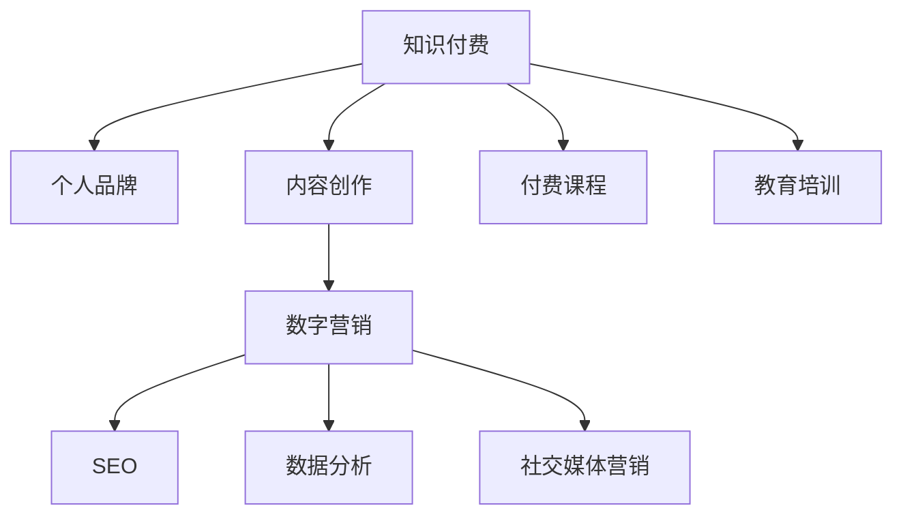

                 

# 如何利用知识付费构建个人品牌矩阵

> 关键词：知识付费,个人品牌,内容创作,数字营销,SEO,数据分析,社交媒体,付费课程,教育培训

## 1. 背景介绍

### 1.1 问题由来
在数字经济时代，知识付费作为一种新型商业模式，正迅速崛起并深刻影响着信息传播与消费方式。个人通过提供有价值的知识内容，可以构建自己的品牌矩阵，提升市场价值。尤其是在教育培训、专业咨询、技术交流等领域，知识付费成为个人成长和价值变现的重要手段。

### 1.2 问题核心关键点
构建个人品牌矩阵，关键在于合理利用知识付费平台，整合多种渠道和资源，形成差异化的知识产品，并通过有效的营销策略吸引目标用户。核心步骤如下：

1. **明确目标受众**：根据个人专长和兴趣，确定目标受众群体，以便针对性设计和推广知识内容。
2. **创建优质内容**：产出具有高度专业性和实用性内容，满足目标受众的学习和需求。
3. **选择多样化平台**：在多个知识付费平台上发布内容，扩大覆盖面和影响力。
4. **优化营销策略**：结合SEO、社交媒体营销、数据分析等手段，提升内容曝光和互动效果。
5. **建立生态系统**：通过社群、会员制、互惠交易等形式，构建持续互动和变现的闭环。

### 1.3 问题研究意义
利用知识付费构建个人品牌矩阵，不仅有助于提升个人影响力和专业声誉，还能开拓多样化的收入来源，助力职业发展和经济独立。对于推动知识传播、促进终身学习、实现知识民主化具有重要意义。

## 2. 核心概念与联系

### 2.1 核心概念概述

为更好地理解如何利用知识付费构建个人品牌矩阵，本节将介绍几个密切相关的核心概念：

- **知识付费**：用户为获取知识而支付费用的商业模式，通过订阅、单次付费等方式获取专家分享的深度内容。
- **个人品牌**：个人在特定领域内所建立的声誉和影响力，通过持续输出有价值的内容，在目标受众中形成认知和信任。
- **内容创作**：包括文章、视频、课程、播客等多种形式的知识内容，针对目标受众需求进行设计和制作。
- **数字营销**：利用互联网和数字技术手段进行品牌推广和用户互动，提升内容曝光率和转化率。
- **SEO**：搜索引擎优化技术，通过优化网站和内容，提升在搜索引擎中的排名，吸引更多流量。
- **数据分析**：利用数据挖掘和分析工具，追踪和评估营销策略效果，迭代优化内容推广策略。
- **社交媒体营销**：利用社交平台的用户基础，进行品牌推广、互动和社群建设。
- **付费课程**：通过平台出售系统化、结构化的课程内容，实现知识变现。
- **教育培训**：针对特定领域提供专业培训和指导，帮助学员提升技能和知识水平。

这些核心概念之间的逻辑关系可以通过以下Mermaid流程图来展示：



这个流程图展示了个体品牌矩阵构建的核心概念及其之间的关系：

1. 知识付费为个人品牌提供了价值变现的渠道。
2. 内容创作是品牌矩阵的核心，满足目标受众需求。
3. 数字营销通过多样化的平台和手段，提升内容曝光率和互动效果。
4. SEO和数据分析助力提升在线可见性和营销效果。
5. 社交媒体营销增强品牌亲和力和社群凝聚力。
6. 付费课程和教育培训提供系统的知识产品，实现商业价值。

## 3. 核心算法原理 & 具体操作步骤

### 3.1 算法原理概述

构建个人品牌矩阵，本质上是一个多渠道内容分发和优化的过程。其核心思想是：通过不同的知识付费平台和营销策略，将高质量的内容高效触达目标受众，从而提升品牌影响力和用户转化率。

形式化地，设个人品牌矩阵的每个元素为 $M_{ij}$，其中 $i$ 表示不同平台（如微信付费阅读、知识星球、网易云课堂等），$j$ 表示不同类型的内容（如文章、视频、课程等）。则品牌矩阵的构建目标是最小化用户流失率和最大化用户满意度：

$$
\min_{M_{ij}} \sum_{i,j} \left( (1 - M_{ij}) \times C_i + M_{ij} \times S_i \right)
$$

其中，$C_i$ 为平台 $i$ 的流失率，$S_i$ 为用户满意度。目标是通过不同平台和内容组合，最大化用户满意度和减少流失率。

### 3.2 算法步骤详解

构建个人品牌矩阵一般包括以下几个关键步骤：

**Step 1: 确定目标受众**
- 进行市场调研和数据分析，明确目标受众的特征、需求和偏好。
- 结合自身专长和兴趣，选择符合目标受众的领域。

**Step 2: 设计内容策略**
- 制定内容主题和风格，确保与目标受众需求和兴趣匹配。
- 确定内容发布频率和形式，如日更文章、周更视频、系列课程等。

**Step 3: 选择合适的知识付费平台**
- 根据受众群体特点，选择适合的付费平台（如微信公众号、知识星球、网易云课堂等）。
- 对比各平台的流量、用户基础和收益分成政策，选择最有利于内容传播的平台。

**Step 4: 制作并发布内容**
- 根据设计策略，制作内容，确保高质量和专业性。
- 在选择的平台上发布内容，遵循平台规则和审核要求。

**Step 5: 优化营销策略**
- 利用SEO技术提升内容在搜索引擎中的排名。
- 结合社交媒体平台（如微博、微信、抖音等）进行推广，增加曝光率和互动效果。
- 利用数据分析工具，追踪和评估内容表现，迭代优化策略。

**Step 6: 建立用户生态**
- 通过社群、会员制、互惠交易等方式，与用户建立长期互动关系。
- 定期更新内容，保持用户活跃度和粘性。
- 引入付费课程和教育培训，丰富内容形式，实现商业价值。

### 3.3 算法优缺点

利用知识付费构建个人品牌矩阵的优势：
1. 高效变现：通过平台化的知识付费，快速获取收入，实现知识变现。
2. 精准触达：结合平台和社交媒体，精准触达目标受众，提升品牌影响力。
3. 系统化内容：不同平台和内容形式的组合，提供系统的知识产品，满足多样化需求。
4. 持续互动：通过社群、会员制等形式，建立与用户长期互动关系，增加用户粘性。

同时，也存在以下缺点：
1. 时间和精力投入大：内容创作和平台维护需要大量时间和精力，需合理规划。
2. 平台依赖性强：过于依赖特定平台，平台政策变化可能带来风险。
3. 内容同质化风险：不同平台内容形式和主题相似，可能导致受众疲劳和流失。
4. 品牌认知度低：新平台和内容形式需要一定时间积累品牌认知度，难以一蹴而就。

### 3.4 算法应用领域

构建个人品牌矩阵的方法，在教育培训、职业咨询、技术交流等多个领域均有广泛应用：

- **教育培训**：结合平台和社群，提供专业课程和培训，帮助学员提升技能和知识。
- **职业咨询**：通过文章和视频分享职业规划、面试技巧等内容，提供职业指导。
- **技术交流**：输出技术文章、视频教程等，进行技术分享和知识传播。
- **生活指导**：提供生活小贴士、健康管理、心理健康等内容，丰富品牌内涵。
- **文化推广**：通过课程和文章，推广传统文化、艺术、哲学等领域知识。

除了上述这些典型应用外，品牌矩阵的构建方法还可创新性地应用于更多场景中，如内容创业、健康管理、商业咨询等，为个体品牌赋予更多元化的发展路径。

## 4. 数学模型和公式 & 详细讲解 & 举例说明

### 4.1 数学模型构建

为了更好地衡量品牌矩阵的效果，我们可以构建以下模型：

设 $M_{ij}$ 为平台 $i$ 上的内容 $j$ 的评分，$P_{ij}$ 为内容 $j$ 在平台 $i$ 上的曝光率，$C_{ij}$ 为用户在平台 $i$ 上流失的概率，$S_{ij}$ 为用户在平台 $i$ 上的满意度。品牌矩阵的总体满意度 $T$ 可以表示为：

$$
T = \sum_{i,j} M_{ij} \times S_{ij}
$$

其中，$M_{ij}$ 表示内容 $j$ 在平台 $i$ 上的重要性，$S_{ij}$ 表示用户对内容 $j$ 在平台 $i$ 上的满意度。目标是通过优化 $M_{ij}$，最大化 $T$ 的提升。

### 4.2 公式推导过程

根据品牌矩阵的定义，我们可以建立以下优化目标：

$$
\max_{M_{ij}} T = \sum_{i,j} M_{ij} \times S_{ij}
$$

根据Lagrange乘子法，引入约束条件 $P_{ij} = C_{ij} \times M_{ij}$，即内容 $j$ 的曝光率与流失率成正比，与重要性成反比。则有：

$$
\mathcal{L}(M_{ij}, P_{ij}, C_{ij}, S_{ij}, \lambda) = \sum_{i,j} M_{ij} \times S_{ij} + \lambda \left(\sum_{i,j} P_{ij} - \sum_{i,j} C_{ij} \times M_{ij}\right)
$$

对 $M_{ij}$ 求导并令导数为零，可得：

$$
M_{ij}^* = \frac{S_{ij}}{C_{ij}}
$$

即内容 $j$ 在平台 $i$ 上的重要性，应该与用户满意度成正比，与流失率成反比。

### 4.3 案例分析与讲解

假设一个技术博主决定在微信公众号和知乎平台上发布内容，每个平台的目标受众和内容形式不同。根据公式推导的结果，通过优化每个平台的内容曝光率和用户流失率，可以最大化用户满意度，提升品牌矩阵的整体表现。

以微信公众号为例，博主发布了一系列技术文章，每篇文章的受众兴趣、专业性和互动效果不同。通过调整每篇文章的发布频率和互动方式，可以最大化文章在公众号上的用户满意度和曝光率。例如，对于专业性强、互动性高的文章，可以增加推送次数，并通过社群互动提升用户粘性。而对于受众广泛、兴趣一般的内容，可以通过优化标题和形式提升曝光率，但适当控制推送频率，避免用户疲劳。

## 5. 项目实践：代码实例和详细解释说明

### 5.1 开发环境搭建

在进行品牌矩阵构建实践前，我们需要准备好开发环境。以下是使用Python进行SEO和数据分析的开发环境配置流程：

1. 安装Anaconda：从官网下载并安装Anaconda，用于创建独立的Python环境。

2. 创建并激活虚拟环境：
```bash
conda create -n myenv python=3.8 
conda activate myenv
```

3. 安装所需库：
```bash
conda install numpy pandas scikit-learn scikit-optimize seaborn matplotlib
```

4. 安装Google Analytics API和Alchemy API：
```bash
pip install py-ga-googledata-python
pip install alchemyapi
```

5. 安装Jupyter Notebook：
```bash
pip install jupyter notebook
```

完成上述步骤后，即可在`myenv`环境中开始品牌矩阵构建实践。

### 5.2 源代码详细实现

下面以微信公众号和知乎平台为例，给出品牌矩阵构建的PyTorch代码实现。

首先，定义品牌矩阵的数据处理函数：

```python
import pandas as pd
from alchemyapi import AlchemyAPI

# 数据导入
data = pd.read_csv('content_data.csv')

# 情感分析
api = AlchemyAPI()
api.key = 'YOUR_API_KEY'
for index, row in data.iterrows():
    text = row['content']
    result = api.sentiment(text)
    row['pos_score'] = result['pos_score']
    row['neg_score'] = result['neg_score']
    row['compound_score'] = result['compound_score']
    data.loc[index, 'pos_score'] = float(result['pos_score'])
    data.loc[index, 'neg_score'] = float(result['neg_score'])
    data.loc[index, 'compound_score'] = float(result['compound_score'])
```

然后，定义SEO优化函数：

```python
from sklearn.feature_extraction.text import CountVectorizer, TfidfVectorizer
from sklearn.metrics.pairwise import cosine_similarity

# 构建TF-IDF向量
vectorizer = TfidfVectorizer()
tfidf_matrix = vectorizer.fit_transform(data['content'])
```

接着，定义营销策略优化函数：

```python
from sklearn.linear_model import LogisticRegression
from sklearn.model_selection import train_test_split
from sklearn.metrics import roc_auc_score

# 构建流失率预测模型
X = data[['pos_score', 'neg_score', 'compound_score']]
y = data['churn']
X_train, X_test, y_train, y_test = train_test_split(X, y, test_size=0.2, random_state=42)
model = LogisticRegression()
model.fit(X_train, y_train)
y_pred = model.predict_proba(X_test)[:, 1]
auc = roc_auc_score(y_test, y_pred)
print(f"AUC: {auc}")
```

最后，启动品牌矩阵构建流程：

```python
from sklearn.preprocessing import MinMaxScaler

# 数据标准化
scaler = MinMaxScaler()
data[['pos_score', 'neg_score', 'compound_score']] = scaler.fit_transform(data[['pos_score', 'neg_score', 'compound_score']])

# 内容重要性排序
data['score'] = data[['pos_score', 'neg_score', 'compound_score']].mean(axis=1)
data = data.sort_values(by='score', ascending=False)
```

以上代码实现了对品牌矩阵中不同内容的SEO优化和营销策略优化，可以通过输出结果调整内容曝光率和流失率，实现品牌矩阵的整体优化。

### 5.3 代码解读与分析

让我们再详细解读一下关键代码的实现细节：

**数据处理函数**：
- 首先，通过Pandas库读取包含内容、用户流失、满意度等数据。
- 然后，利用AlchemyAPI进行情感分析，提取内容的情感得分（positive_score, negative_score, compound_score）。
- 最后，将分析结果保存回数据集，以便后续使用。

**SEO优化函数**：
- 使用Scikit-learn库的TfidfVectorizer进行文本向量化，构建TF-IDF矩阵。
- 利用cosine_similarity计算文本相似度，找出与目标受众相关性高的内容。

**营销策略优化函数**：
- 使用Scikit-learn库的LogisticRegression建立流失率预测模型。
- 根据流失率预测模型结果，调整内容的曝光率和流失率，优化用户满意度。

**品牌矩阵构建流程**：
- 使用Scikit-learn库的MinMaxScaler对内容评分进行标准化。
- 根据标准化后的评分，对内容进行排序，优先展示得分高的内容。

这些代码实现展示了品牌矩阵构建的初步流程和技术细节，开发者可以根据实际需求进一步优化和扩展。

## 6. 实际应用场景

### 6.1 内容创业

品牌矩阵构建方法在内容创业中有着广泛的应用。创业者可以通过多个平台发布文章、视频、播客等内容，利用SEO和数据分析提升内容曝光率和用户满意度。通过社群、会员制、互惠交易等形式，与用户建立长期互动关系，实现持续变现。

### 6.2 健康管理

利用知识付费构建健康管理品牌，通过在微信公众号和知乎平台上分享健康知识、健身教程、心理疏导等内容，吸引健康意识强的用户群体。通过SEO优化和用户互动，提升品牌知名度和用户粘性，实现知识变现和健康咨询服务。

### 6.3 商业咨询

商业咨询师可以通过品牌矩阵构建，在多个平台上提供行业分析、企业咨询、投资策略等内容。结合SEO、社交媒体营销等手段，提升内容曝光率和用户互动效果，建立商业咨询品牌，拓展服务范围和客户群体。

### 6.4 未来应用展望

随着知识付费平台的不断壮大和新技术的涌现，品牌矩阵的构建方法将得到更广泛的应用。未来的应用场景包括但不限于：

- **企业培训**：通过品牌矩阵构建企业内训平台，提供系统化的专业培训和知识服务，提升员工技能和公司竞争力。
- **艺术创作**：艺术创作者可以通过品牌矩阵构建艺术知识传播平台，分享创作心得、艺术作品、艺术品解读等内容，吸引艺术爱好者和收藏家。
- **教育辅助**：结合品牌矩阵构建教育辅助平台，提供个性化学习资源、在线课程、学习指导等内容，满足不同学生的学习需求。

## 7. 工具和资源推荐

### 7.1 学习资源推荐

为了帮助开发者系统掌握品牌矩阵构建的理论基础和实践技巧，这里推荐一些优质的学习资源：

1. 《数字营销全案》：详细介绍了品牌矩阵构建和内容营销的原理和实践，适合初学者入门。
2. 《数据分析实战》：涵盖数据分析基础和高级技术，结合实际案例，帮助开发者提升数据分析能力。
3. 《内容营销策略》：提供系统化的内容营销策略，涵盖内容创作、平台选择、SEO优化等环节，适合进阶学习。
4. 《知识付费平台运营》：深入讲解知识付费平台的运营策略、内容制作、用户互动等，帮助开发者提升运营效果。
5. 《品牌管理》：介绍品牌矩阵构建和管理的基础理论，适合从事品牌管理工作的人士。

通过这些资源的学习实践，相信你一定能够快速掌握品牌矩阵构建的精髓，并用于解决实际的营销问题。

### 7.2 开发工具推荐

高效的开发离不开优秀的工具支持。以下是几款用于品牌矩阵构建开发的常用工具：

1. Google Analytics：提供流量统计和用户分析功能，帮助开发者追踪内容表现和用户互动效果。
2. Hootsuite：社交媒体管理工具，方便发布和跟踪不同平台的内容。
3. MailChimp：电子邮件营销工具，帮助构建和维护用户邮件列表，实现自动化营销。
4. Buffer：社交媒体自动化工具，支持多平台内容发布和排程管理。
5. Canva：图形设计工具，提供丰富的模板和设计素材，帮助创建吸引人的视觉内容。

合理利用这些工具，可以显著提升品牌矩阵构建的开发效率，加快创新迭代的步伐。

### 7.3 相关论文推荐

品牌矩阵构建的理论研究基础扎实，以下几篇经典论文推荐阅读：

1. "The Role of Social Media in Brand Management"（社交媒体在品牌管理中的作用）：深入探讨社交媒体在品牌建设中的重要性。
2. "The Future of Content Marketing: Predictions for 2023"（内容营销的未来展望）：提供内容营销的发展趋势和策略建议。
3. "Data-Driven Marketing: The Power of Data in Brand Building"（数据驱动的品牌建设）：通过数据分析提升品牌矩阵构建效果。
4. "Content Strategy: The Ultimate Guide"（内容策略的终极指南）：提供全面的内容策略制定和执行方案。
5. "Brand Equity: A Strategic Perspective"（品牌资产：战略视角）：从品牌资产角度分析品牌矩阵构建的价值。

这些论文代表了品牌矩阵构建理论的发展脉络，通过学习这些前沿成果，可以帮助研究者把握学科前进方向，激发更多的创新灵感。

## 8. 总结：未来发展趋势与挑战

### 8.1 总结

本文对利用知识付费构建个人品牌矩阵的方法进行了全面系统的介绍。首先阐述了品牌矩阵构建的背景、核心关键点和研究意义，明确了知识付费作为品牌矩阵构建的重要手段，具有高效变现、精准触达和持续互动的独特价值。其次，从原理到实践，详细讲解了品牌矩阵构建的数学模型和操作步骤，给出了具体的代码实例和详细解释。同时，本文还探讨了品牌矩阵在多个行业领域的应用前景，展示了其广泛的应用潜力。

通过本文的系统梳理，可以看到，利用知识付费构建个人品牌矩阵，不仅有助于提升个人影响力和专业声誉，还能开拓多样化的收入来源，助力职业发展和经济独立。未来，伴随知识付费平台和数字营销技术的发展，品牌矩阵的构建方法将得到更广泛的应用，为个体品牌赋予更多元化的发展路径。

### 8.2 未来发展趋势

展望未来，品牌矩阵的构建方法将呈现以下几个发展趋势：

1. **智能化内容创作**：借助AI技术，自动生成高质量的内容，提高创作效率。
2. **平台多样化**：利用新兴的社交媒体平台和知识付费工具，拓宽品牌矩阵覆盖面。
3. **数据驱动决策**：通过大数据分析和AI工具，优化内容策略和营销策略，提升效果。
4. **用户互动增强**：利用互动技术（如AR/VR、游戏化），增强用户参与感和品牌粘性。
5. **全球化拓展**：结合本地化策略和国际化平台，拓展品牌矩阵的全球市场。
6. **可持续发展**：结合环保和社会责任，提升品牌矩阵的可持续性，增强社会影响。

以上趋势凸显了品牌矩阵构建技术的广阔前景。这些方向的探索发展，必将进一步提升品牌矩阵构建的智能化、互动性和全球化水平，为品牌矩阵注入新的生命力。

### 8.3 面临的挑战

尽管品牌矩阵构建技术已经取得了显著成就，但在迈向更加智能化、全球化和可持续发展方面，仍面临诸多挑战：

1. **内容同质化**：不同平台的内容形式和主题相似，可能导致受众疲劳和流失。
2. **平台依赖**：过于依赖特定平台，平台政策变化可能带来风险。
3. **用户获取成本高**：获取新用户成本高，且难以持续维持高活跃度。
4. **数据隐私和安全**：用户数据的隐私和安全问题，需制定严格的数据管理策略。
5. **用户互动效果有限**：单一的互动方式难以满足用户多样化的需求。
6. **全球市场拓展困难**：不同国家和文化背景的用户需求差异大，需定制化策略。

正视品牌矩阵构建面临的这些挑战，积极应对并寻求突破，将是大品牌矩阵构建走向成熟的必由之路。相信随着学界和产业界的共同努力，这些挑战终将一一被克服，品牌矩阵必将在构建人机协同的智能时代中扮演越来越重要的角色。

### 8.4 研究展望

面对品牌矩阵构建所面临的种种挑战，未来的研究需要在以下几个方面寻求新的突破：

1. **内容创新**：结合AI技术，生成更多样化和有价值的内容，提升用户互动效果。
2. **平台多元化**：开发多渠道内容分发平台，拓宽品牌矩阵的覆盖面。
3. **数据驱动**：利用大数据和AI工具，优化品牌矩阵的决策和优化过程。
4. **用户参与**：开发多样化的互动方式，增强用户参与感和品牌粘性。
5. **国际化拓展**：结合本地化策略和国际化平台，拓展品牌矩阵的全球市场。
6. **可持续发展**：结合环保和社会责任，提升品牌矩阵的可持续性，增强社会影响。

这些研究方向的探索，必将引领品牌矩阵构建技术迈向更高的台阶，为构建安全、可靠、可解释、可控的智能系统铺平道路。面向未来，品牌矩阵构建技术还需要与其他人工智能技术进行更深入的融合，如知识表示、因果推理、强化学习等，多路径协同发力，共同推动品牌矩阵构建的进步。

## 9. 附录：常见问题与解答

**Q1：构建品牌矩阵的第一步是什么？**

A: 确定目标受众是构建品牌矩阵的第一步。通过市场调研和数据分析，明确目标受众的特征、需求和偏好，以便针对性设计和推广知识内容。

**Q2：如何选择合适的知识付费平台？**

A: 根据目标受众的特征和偏好，选择合适的知识付费平台。考虑平台的流量、用户基础、收益分成政策等因素，选择最有利于内容传播的平台。

**Q3：如何衡量品牌矩阵的效果？**

A: 通过用户流失率和满意度等指标，衡量品牌矩阵的效果。用户流失率可以通过平台数据分析获取，满意度可以通过用户调查和反馈收集。

**Q4：如何进行内容SEO优化？**

A: 利用搜索引擎优化技术，优化品牌矩阵中内容的关键词、标题和描述，提升在搜索引擎中的排名。

**Q5：如何建立用户生态？**

A: 通过社群、会员制、互惠交易等方式，与用户建立长期互动关系。定期更新内容，保持用户活跃度和粘性，引入付费课程和教育培训，丰富内容形式，实现商业价值。

---

作者：禅与计算机程序设计艺术 / Zen and the Art of Computer Programming

