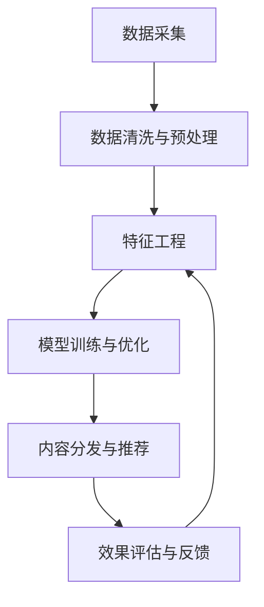

                 

# 如何利用社交媒体扩大知识影响力

> 关键词：社交媒体, 知识传播, 影响力和信任度, 数据分析, 算法优化, 自动化与机器学习

## 1. 背景介绍

### 1.1 问题由来
随着互联网的普及，社交媒体已成为人们获取信息和分享知识的重要平台。然而，在信息爆炸的今天，如何快速有效地在社交媒体上扩大知识的影响力，已成为困扰许多知识工作者和内容创造者的重要问题。社交媒体用户对内容的评价往往带有较强的主观性和情感倾向，内容的真实可信度也难以准确评估，这导致了知识传播效率低下、受众信任度不足等问题。

### 1.2 问题核心关键点
要解决上述问题，需要综合利用社交媒体平台的数据分析与算法优化技术，实现知识的精准分发、受众的个性化推荐、内容可信度的客观评估。本文将探讨如何通过社交媒体数据分析与算法优化，提升知识传播的效率和影响力，增强受众对内容的信任度和粘性。

## 2. 核心概念与联系

### 2.1 核心概念概述
社交媒体数据分析与算法优化是利用数据挖掘、机器学习等技术，对社交媒体平台上的用户行为、内容传播效果等进行分析，并通过算法优化提升内容分发效率和用户参与度的过程。

### 2.2 核心概念原理和架构的 Mermaid 流程图(Mermaid 流程节点中不要有括号、逗号等特殊字符)


这个流程图展示了社交媒体数据分析与算法优化的主要流程：

1. **数据采集**：从社交媒体平台获取用户的互动数据、内容数据等。
2. **数据清洗与预处理**：清洗并预处理数据，去除噪声和异常值，标准化数据格式。
3. **特征工程**：提取和构建与内容传播效果相关的特征，如用户特征、内容特征、互动特征等。
4. **模型训练与优化**：构建和训练机器学习模型，并通过交叉验证、调参等优化算法优化模型性能。
5. **内容分发与推荐**：利用优化后的模型进行内容推荐，提升内容分发效率和用户粘性。
6. **效果评估与反馈**：评估模型效果，根据反馈调整模型参数，进行持续优化。

## 3. 核心算法原理 & 具体操作步骤
### 3.1 算法原理概述

社交媒体数据分析与算法优化的核心算法主要包括推荐算法、情感分析、内容可信度评估等。这些算法通过分析社交媒体上的用户行为数据和内容传播数据，提取有价值的特征，构建模型，实现内容的精准推荐和可信度评估。

### 3.2 算法步骤详解
#### 3.2.1 数据采集与预处理
1. **数据采集**：从社交媒体平台如Twitter、Facebook、LinkedIn等获取用户互动数据、内容数据等。可以通过API接口或爬虫技术获取数据。
2. **数据清洗与预处理**：清洗数据，去除噪声和异常值，如过滤掉不合法的数据、处理缺失值、去除重复数据等。标准化数据格式，如将时间戳转换为统一格式。

#### 3.2.2 特征工程
1. **用户特征**：提取用户的个人信息、兴趣偏好、互动历史等。
2. **内容特征**：提取内容的关键词、主题、风格等。
3. **互动特征**：提取内容的点赞数、评论数、转发数、收藏数等互动数据。
4. **时间特征**：提取内容发布时间、互动时间等时间相关信息。

#### 3.2.3 模型训练与优化
1. **模型选择**：选择适合的机器学习模型，如协同过滤、深度学习模型等。
2. **特征选择与工程**：根据任务需求选择并优化特征工程方法。
3. **模型训练**：使用训练数据训练模型，并进行交叉验证。
4. **参数调优**：通过网格搜索、随机搜索等方法优化模型参数。
5. **模型评估**：使用测试数据集评估模型效果，如准确率、召回率、F1值等。

#### 3.2.4 内容分发与推荐
1. **个性化推荐**：根据用户特征和内容特征，使用优化后的模型进行个性化推荐。
2. **实时性优化**：通过缓存技术、负载均衡等方法提升内容分发的实时性和稳定性。
3. **动态更新**：根据用户行为数据实时更新推荐模型，提升推荐效果。

#### 3.2.5 效果评估与反馈
1. **效果评估**：通过A/B测试、用户反馈等方式评估推荐效果。
2. **反馈机制**：根据用户反馈和推荐效果，调整模型参数和推荐策略。

### 3.3 算法优缺点
#### 3.3.1 优点
1. **提升内容分发效率**：通过推荐算法，可以提升内容分发效率，提高用户对内容的接触率。
2. **增强用户粘性**：个性化推荐和内容可信度评估，可以增强用户对内容的信任和粘性。
3. **提升知识传播影响力**：通过精准分发和内容可信度评估，可以提升知识传播的影响力和可信度。

#### 3.3.2 缺点
1. **数据隐私问题**：社交媒体平台的用户数据可能涉及隐私，需确保数据采集和使用符合法律法规。
2. **算法偏见**：推荐算法和内容可信度评估算法可能存在偏见，需注意算法公平性。
3. **计算资源需求高**：大规模数据分析和模型优化需要较高的计算资源。

### 3.4 算法应用领域
社交媒体数据分析与算法优化技术可以应用于以下领域：

1. **内容推荐**：为社交媒体平台的用户推荐感兴趣的内容，提升用户粘性和平台活跃度。
2. **广告投放优化**：通过分析用户行为数据，优化广告投放策略，提高广告效果。
3. **舆情分析**：利用社交媒体数据，分析舆情变化，预测和应对突发事件。
4. **知识传播**：利用数据分析技术，提升知识传播的效果和影响力。
5. **个性化服务**：根据用户行为数据，提供个性化服务，提升用户体验。

## 4. 数学模型和公式 & 详细讲解 & 举例说明

### 4.1 数学模型构建
社交媒体数据分析与算法优化的数学模型主要包括推荐模型、情感分析模型、内容可信度评估模型等。

#### 4.1.1 推荐模型
推荐模型的目标是预测用户对内容的兴趣度，从而实现个性化推荐。常用的推荐模型包括协同过滤、矩阵分解、深度学习模型等。

#### 4.1.2 情感分析模型
情感分析模型的目标是从用户评论中提取情感信息，评估用户对内容的情感倾向。常用的情感分析模型包括情感词典、机器学习模型、深度学习模型等。

#### 4.1.3 内容可信度评估模型
内容可信度评估模型的目标是对内容的真实可信度进行评估。常用的可信度评估模型包括基于规则的模型、基于机器学习的模型等。

### 4.2 公式推导过程
#### 4.2.1 协同过滤推荐模型
协同过滤推荐模型的基本思想是根据用户历史行为数据，预测用户对未交互内容的兴趣度。公式如下：

$$
r_{ui}=\frac{\sum_{v}p_{uv}q_{vi}}{\sqrt{\sum_{v}p_{uv}^2}\sqrt{\sum_{v}q_{vi}^2}}
$$

其中，$r_{ui}$表示用户$u$对内容$i$的兴趣度，$p_{uv}$和$q_{vi}$分别为用户$u$对内容$i$和内容$v$的评分，$\sqrt{}$为归一化操作。

#### 4.2.2 情感分析模型
常用的情感分析模型是朴素贝叶斯分类器。公式如下：

$$
P(y|x) = \frac{P(x|y)P(y)}{P(x)}
$$

其中，$y$表示情感类别（如正面、负面、中性），$x$表示文本内容，$P(y)$和$P(x|y)$分别为情感类别的先验概率和条件概率，$P(x)$为文本内容的概率。

#### 4.2.3 内容可信度评估模型
常用的内容可信度评估模型是基于规则的模型。公式如下：

$$
可信度 = \frac{\sum_{i}W_i* relevance_i}{\sum_{i}W_i}
$$

其中，$W_i$为内容$i$的权重，$relevance_i$为内容$i$的相关性评分。

### 4.3 案例分析与讲解
#### 4.3.1 推荐系统案例
某新闻平台使用协同过滤推荐模型，对用户进行个性化内容推荐。具体步骤如下：
1. 收集用户历史行为数据，包括浏览、点赞、评论、分享等行为。
2. 使用协同过滤算法，预测用户对未交互内容的兴趣度。
3. 根据预测结果，向用户推荐相关内容。
4. 收集用户对推荐内容的反馈，进一步优化推荐模型。

#### 4.3.2 情感分析案例
某电商平台使用情感分析模型，评估用户对商品的情感倾向。具体步骤如下：
1. 收集用户对商品的评论。
2. 使用情感词典和机器学习模型，提取评论的情感信息。
3. 根据情感信息，评估用户对商品的情感倾向。
4. 根据情感倾向，调整商品展示策略。

#### 4.3.3 内容可信度评估案例
某百科平台使用内容可信度评估模型，评估百科词条的真实可信度。具体步骤如下：
1. 收集词条的相关性评分数据。
2. 使用基于规则的模型，评估词条的可信度。
3. 根据可信度，调整词条的展示策略。
4. 根据用户反馈，进一步优化可信度评估模型。

## 5. 项目实践：代码实例和详细解释说明

### 5.1 开发环境搭建
要实现社交媒体数据分析与算法优化，需要安装以下Python库和工具：

1. **Pandas**：用于数据处理和分析。
2. **NumPy**：用于数值计算。
3. **Scikit-learn**：用于机器学习算法实现。
4. **TensorFlow**：用于深度学习模型实现。
5. **PyTorch**：用于深度学习模型实现。
6. **Jupyter Notebook**：用于编写和调试代码。

### 5.2 源代码详细实现
以下是一个简单的推荐系统代码实现示例：

```python
import pandas as pd
import numpy as np
from sklearn.neighbors import NearestNeighbors
from sklearn.metrics.pairwise import cosine_similarity
from sklearn.decomposition import TruncatedSVD

# 加载数据
data = pd.read_csv('user_behavior.csv')

# 构建相似度矩阵
similarity_matrix = cosine_similarity(data[['interaction']].values)

# 训练模型
svd = TruncatedSVD(n_components=50, random_state=42)
svd_matrix = svd.fit_transform(similarity_matrix)

# 构建推荐模型
k = 10
nn = NearestNeighbors(n_neighbors=k+1, algorithm='brute', metric='cosine')
nn.fit(svd_matrix)
idx = nn.kneighbors(svd_matrix, return_distance=False)

# 推荐内容
def recommend(user_id):
    user_idx = data[data['user_id'] == user_id].index[0]
    recommendations = []
    for i in idx[user_idx]:
        content_id = data.index[i]
        if content_id != user_idx:
            recommendations.append(content_id)
    return recommendations

# 测试推荐效果
user_id = 100
recommendations = recommend(user_id)
print(f"Recommendations for user {user_id}: {recommendations}")
```

### 5.3 代码解读与分析
以上代码实现了基于协同过滤的推荐系统。具体步骤如下：
1. 加载用户行为数据，构建相似度矩阵。
2. 使用SVD算法降维，生成低维相似度矩阵。
3. 使用KNN算法找到与用户行为相似的内容。
4. 根据相似度结果，生成推荐内容列表。
5. 测试推荐效果，输出推荐结果。

## 6. 实际应用场景
### 6.1 智能推荐系统
社交媒体平台通过智能推荐系统，提升用户粘性和平台活跃度。用户行为数据和内容数据被用来训练推荐模型，生成个性化推荐列表。推荐系统可以实时更新，根据用户反馈不断优化推荐效果。

### 6.2 舆情监测与预测
社交媒体平台通过舆情监测与预测系统，及时发现和应对突发事件。利用情感分析模型，分析用户对事件的情感倾向，预测事件的发展趋势。舆情监测与预测系统可以提供实时预警，帮助平台及时应对负面事件。

### 6.3 内容可信度评估
社交媒体平台通过内容可信度评估模型，提升内容质量。利用内容可信度评估模型，对内容进行真实可信度评估，过滤低质量内容，提升平台整体内容水平。

## 7. 工具和资源推荐

### 7.1 学习资源推荐
1. **《Python数据科学手册》**：全面介绍数据科学和机器学习的Python库和工具。
2. **Coursera上的机器学习课程**：由斯坦福大学提供的经典机器学习课程，涵盖深度学习、数据挖掘等内容。
3. **Kaggle竞赛**：通过参加Kaggle竞赛，锻炼数据分析和机器学习技能。

### 7.2 开发工具推荐
1. **Jupyter Notebook**：Python编程的常用开发环境，支持交互式编程和代码调试。
2. **Git**：版本控制工具，方便团队协作和代码管理。
3. **Docker**：容器化技术，方便在多个环境中重复部署。

### 7.3 相关论文推荐
1. **《社会媒体数据分析与推荐系统研究》**：介绍社交媒体数据分析与推荐系统的基本概念和算法。
2. **《基于情感分析的内容推荐系统》**：探讨情感分析在内容推荐中的应用。
3. **《内容可信度评估算法研究》**：研究内容可信度评估算法的基本原理和实现方法。

## 8. 总结：未来发展趋势与挑战

### 8.1 总结
本文探讨了如何利用社交媒体数据分析与算法优化，提升知识传播的影响力和信任度。通过数据采集、特征工程、模型训练与优化、内容分发与推荐、效果评估与反馈等步骤，实现了知识的精准分发和个性化推荐。具体案例展示了推荐系统、情感分析、内容可信度评估等算法的应用。

### 8.2 未来发展趋势
未来，社交媒体数据分析与算法优化将呈现以下几个发展趋势：

1. **自动化与机器学习**：自动化和机器学习技术将进一步提升数据分析与模型优化的效率和效果。
2. **跨平台数据整合**：将不同社交媒体平台的数据整合在一起，实现跨平台数据分析。
3. **实时性优化**：通过缓存技术、负载均衡等方法，提升内容分发的实时性和稳定性。
4. **多模态数据融合**：结合文本、图像、视频等多模态数据，提升内容分析和推荐效果。
5. **算法公平性**：通过算法公平性研究，确保推荐算法的公正性和透明性。

### 8.3 面临的挑战
尽管社交媒体数据分析与算法优化技术取得了一定进展，但仍面临以下挑战：

1. **数据隐私问题**：如何保护用户数据隐私，确保数据采集和使用符合法律法规。
2. **算法偏见**：推荐算法和情感分析算法可能存在偏见，需注意算法公平性。
3. **计算资源需求高**：大规模数据分析和模型优化需要较高的计算资源。
4. **用户信任度**：如何提升用户对推荐内容的信任度，增强平台粘性。

### 8.4 研究展望
未来，社交媒体数据分析与算法优化技术需要在以下几个方面进行研究：

1. **自动化与机器学习**：进一步提升数据分析与模型优化的自动化和智能化水平。
2. **跨平台数据整合**：研究如何将不同社交媒体平台的数据整合在一起，实现跨平台数据分析。
3. **实时性优化**：研究如何提升内容分发的实时性和稳定性。
4. **多模态数据融合**：研究如何结合文本、图像、视频等多模态数据，提升内容分析和推荐效果。
5. **算法公平性**：研究如何确保推荐算法的公正性和透明性，提升用户信任度。

## 9. 附录：常见问题与解答

**Q1: 如何保护用户数据隐私？**

A: 在数据采集和使用过程中，应严格遵守相关法律法规，如GDPR等。可以使用匿名化技术，去除或模糊用户身份信息，保护用户隐私。

**Q2: 推荐算法如何避免偏见？**

A: 在推荐算法设计和实现过程中，应考虑算法偏见问题。可以使用公平性评估指标，检测算法是否存在偏见，并通过调整算法参数和训练数据，减少算法偏见。

**Q3: 如何提升推荐内容可信度？**

A: 通过内容可信度评估模型，对内容进行真实可信度评估，过滤低质量内容，提升平台整体内容水平。同时，可以通过人工审核和用户反馈，进一步优化可信度评估模型。

**Q4: 如何提升内容分发效率？**

A: 通过缓存技术、负载均衡等方法，提升内容分发的实时性和稳定性。同时，可以采用分布式计算和异步处理技术，进一步提升内容分发效率。

**Q5: 如何提升用户信任度？**

A: 通过个性化推荐、实时反馈、内容可信度评估等措施，提升用户对推荐内容的信任度和粘性。同时，可以通过用户教育和平台监管，保障推荐内容的真实可信度。

通过本文的系统梳理，可以看到，利用社交媒体数据分析与算法优化技术，可以有效提升知识传播的影响力和信任度，推动社交媒体平台的智能化发展。未来，随着技术的不断进步和应用的深入，社交媒体数据分析与算法优化将为知识传播和社交媒体平台带来更多突破和创新。

