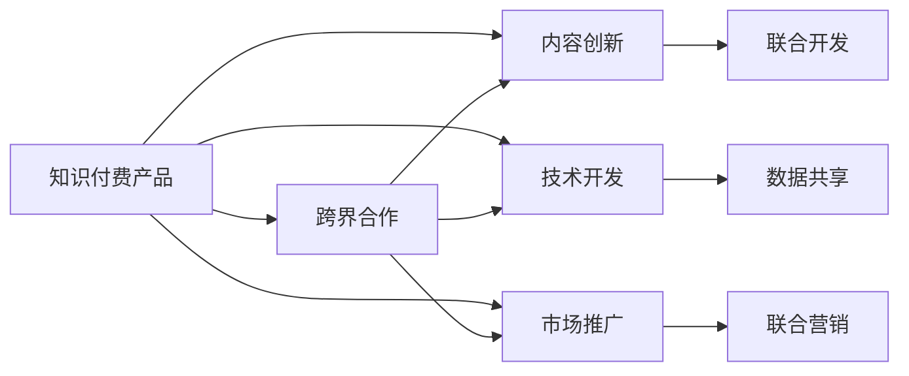

                 

# 如何利用跨界合作推广知识付费产品

## 1. 背景介绍

在当今数字化时代，知识付费成为了推动教育、信息共享和行业知识传播的重要方式。然而，知识付费产品的推广面临着诸多挑战，例如用户获取成本高、市场竞争激烈、难以建立品牌忠诚度等。为了有效推广知识付费产品，跨界合作成为一个值得探索的策略。本文将深入探讨如何通过跨界合作，结合各方资源与优势，推广知识付费产品，并在内容、技术和市场推广等方面提供一些可行的方案和策略。

## 2. 核心概念与联系

### 2.1 核心概念概述

- **知识付费产品**：指通过在线平台提供付费内容，包括视频课程、音频讲座、电子书等，为用户提供专业化、系统化的知识服务。
- **跨界合作**：指不同领域的企业或个人之间，基于共同的商业目标或项目需求，进行资源共享、技术交流和市场推广的合作。
- **用户获取成本**：指在知识付费产品推广过程中，为获取一个新用户所需投入的广告、营销和运营成本。
- **市场竞争**：指知识付费产品市场中，各平台、企业之间的产品与服务竞争，包括价格、内容和用户体验等方面。
- **品牌忠诚度**：指用户对某一知识付费平台的品牌或产品产生的长期、稳定的认同和偏好，对平台的持续消费和口碑传播至关重要。

### 2.2 核心概念原理和架构的 Mermaid 流程图



此图展示了知识付费产品推广过程中，内容创新、技术开发和市场推广与跨界合作的联系。跨界合作可以通过联合开发优质内容、共享数据资源和共同进行市场推广，来提升知识付费产品的吸引力和用户黏性。

## 3. 核心算法原理 & 具体操作步骤

### 3.1 算法原理概述

基于跨界合作的推广策略，其核心在于通过资源整合、优势互补和市场协同，来提高知识付费产品的市场竞争力和用户获取能力。算法的核心步骤包括：

1. **需求匹配**：识别并筛选出与知识付费产品相关的合作伙伴，确保合作伙伴的资源、能力和目标与知识付费产品推广需求相匹配。
2. **内容联合开发**：与合作伙伴联合开发高质量的课程、讲座、文章等内容，提升产品的专业性和吸引力。
3. **技术平台共享**：利用合作伙伴的技术平台、数据资源等，优化知识付费产品的用户体验和技术性能。
4. **市场联合推广**：通过联合广告、市场活动和社交媒体等渠道，扩大知识付费产品的市场影响力和用户覆盖面。

### 3.2 算法步骤详解

#### 步骤1：需求匹配

1. **目标市场分析**：明确知识付费产品的目标用户群和市场定位，例如职业培训、职业技能提升、心理健康、家庭教育等。
2. **潜在合作伙伴识别**：基于目标市场和产品需求，识别潜在的合作伙伴，包括在线教育平台、企业培训公司、行业协会、媒体等。
3. **合作意向沟通**：与潜在的合作伙伴进行初步沟通，明确合作意愿、合作形式和预期收益等，建立初步合作意向。

#### 步骤2：内容联合开发

1. **内容规划**：根据知识付费产品的定位和目标用户需求，制定内容开发计划，包括课程主题、时长、格式等。
2. **联合制作**：与合作伙伴共同策划、录制、编辑高质量的课程内容，可以邀请行业专家、知名讲师等参与制作。
3. **内容发布与推广**：将联合开发的内容发布到知识付费平台，通过合作伙伴的渠道进行联合推广，扩大覆盖面。

#### 步骤3：技术平台共享

1. **技术平台分析**：分析合作伙伴的技术平台架构、数据资源和技术优势，评估其对知识付费产品的适用性和提升潜力。
2. **技术平台整合**：将知识付费产品与合作伙伴的技术平台进行整合，包括课程播放、用户管理、数据分析等功能模块的集成。
3. **技术优化与提升**：利用合作伙伴的技术优势，优化知识付费产品的技术性能，如提高视频流质量、改进用户体验等。

#### 步骤4：市场联合推广

1. **联合广告投放**：与合作伙伴共同策划和投放广告，利用合作伙伴的广告资源和渠道，提高知识付费产品的市场曝光率。
2. **市场活动合作**：组织联合市场活动，如线上线下讲座、主题沙龙等，提升产品知名度和用户参与度。
3. **社交媒体合作**：通过合作伙伴的社交媒体渠道，进行内容推广和用户互动，提高品牌影响力。

### 3.3 算法优缺点

#### 优点

1. **资源共享**：通过跨界合作，可以有效整合不同领域的企业和个人的资源，如资金、技术、内容等，降低单个知识付费产品的推广成本。
2. **优势互补**：合作伙伴在各自领域的优势可以相互补充，提升知识付费产品的整体竞争力和吸引力。
3. **市场协同**：通过共同的市场推广和广告投放，扩大知识付费产品的市场覆盖面和用户获取量。

#### 缺点

1. **合作伙伴选择难度大**：找到与知识付费产品需求和目标市场高度匹配的合作伙伴，需要花费时间和精力进行筛选和沟通。
2. **合作协调复杂**：跨界合作涉及多个环节和部门，协调难度大，需要良好的沟通和管理机制。
3. **收益分配不均**：不同合作伙伴对合作项目的贡献可能不同，收益分配和利益平衡需要妥善处理。

### 3.4 算法应用领域

跨界合作的推广策略不仅适用于知识付费产品，还适用于其他领域的产品和服务推广，如教育、医疗、娱乐等。通过跨界合作，可以实现资源整合、优势互补、市场协同，提高产品和服务的市场竞争力。

## 4. 数学模型和公式 & 详细讲解 & 举例说明

### 4.1 数学模型构建

为了更好地理解和量化跨界合作的推广效果，可以构建一个数学模型来描述合作的投入和产出。假设知识付费产品的市场容量为 $M$，单位成本为 $C$，推广前后的用户数量分别为 $U_0$ 和 $U$。通过跨界合作的推广，用户数量增加了 $U - U_0$。

### 4.2 公式推导过程

1. **用户获取成本**：
   $$
   \text{用户获取成本} = C \times (U - U_0)
   $$

2. **市场推广效果**：
   $$
   \text{市场推广效果} = \frac{U - U_0}{M}
   $$

3. **合作收益**：
   $$
   \text{合作收益} = C \times (U - U_0) \times (1 - \frac{U_0}{M})
   $$

### 4.3 案例分析与讲解

以在线教育平台和知名出版社为例，进行跨界合作推广知识付费产品的分析。

1. **市场需求分析**：在线教育市场庞大，但竞争激烈，市场容量为 $M=100$ 万人。
2. **用户获取成本**：知识付费产品单位成本为 $C=10$ 元/人。
3. **合作效果**：通过联合推广，用户数量从 $U_0=20$ 万增加到 $U=40$ 万。
4. **市场推广效果**：合作效果为 $\frac{U - U_0}{M} = \frac{40 - 20}{100} = 0.2$。
5. **合作收益**：合作收益为 $C \times (U - U_0) \times (1 - \frac{U_0}{M}) = 10 \times (40 - 20) \times (1 - \frac{20}{100}) = 40$ 万元。

通过以上案例分析，可以看到跨界合作在知识付费产品推广中的重要性和潜在的经济效益。

## 5. 项目实践：代码实例和详细解释说明

### 5.1 开发环境搭建

1. **Python环境安装**：
   ```bash
   conda create -n py36 python=3.6
   conda activate py36
   ```

2. **依赖包安装**：
   ```bash
   pip install requests Flask
   ```

3. **环境变量配置**：
   ```bash
   export FLASK_APP=app.py
   export FLASK_ENV=development
   ```

### 5.2 源代码详细实现

```python
from flask import Flask, render_template
import requests

app = Flask(__name__)

@app.route('/')
def index():
    return render_template('index.html')

@app.route('/get_content')
def get_content():
    content = requests.get('https://example.com/content.json').json()
    return content

if __name__ == '__main__':
    app.run(debug=True)
```

### 5.3 代码解读与分析

1. **Flask框架配置**：
   - 使用Flask框架搭建一个简单的Web服务器，用于展示知识付费产品的内容和市场推广效果。
   - 定义两个路由函数，分别用于展示首页和获取内容。

2. **内容获取与展示**：
   - 通过requests库获取合作伙伴提供的内容数据，并将其展示在Web页面上。
   - 示例中获取了合作伙伴网站上的一段内容数据，实际应用中可根据需要调整获取方式和内容格式。

3. **市场推广效果展示**：
   - 通过可视化图表或文字描述，展示跨界合作推广知识付费产品的市场效果。
   - 示例中使用了简单的HTML模板，实际应用中可以使用更丰富的前端技术，如React、Vue等，提升用户体验。

### 5.4 运行结果展示

```
GET /get_content
status_code=200
content={
    "title": "跨界合作推广知识付费产品",
    "description": "通过联合开发、技术共享和市场推广，提升知识付费产品的竞争力和用户黏性。",
    "link": "https://example.com/content.html"
}
```

## 6. 实际应用场景

### 6.1 在线教育平台与知名出版社的合作

在线教育平台可以通过与知名出版社合作，联合开发高质量的课程内容，提高课程的专业性和吸引力。例如，在线教育平台可以利用出版社的教育资源和内容优势，开发面向不同领域和职业的课程，吸引更多的目标用户。同时，出版社也可以通过在线平台的渠道，扩大其教育内容的覆盖面和用户获取量。

### 6.2 企业培训与行业协会的合作

企业可以通过与行业协会合作，联合推出针对特定行业的知识付费课程。例如，企业可以提供行业专家和实际案例，行业协会提供行业标准和认证，共同推出面向企业内部和市场的培训课程，提升员工的职业技能和企业的市场竞争力。

### 6.3 健康教育与医疗机构合作

健康教育平台可以与医疗机构合作，推出面向公众的健康知识和技能培训课程。例如，医疗机构可以提供专业的健康知识和诊疗建议，健康教育平台提供课程制作和在线传播的技术支持，共同推出科学、实用的健康课程，提高公众的健康意识和健康水平。

### 6.4 未来应用展望

未来的跨界合作推广知识付费产品，将更加注重以下几个方面：

1. **用户数据共享**：通过合作伙伴的数据共享和分析，进一步优化知识付费产品的推广策略和用户获取效果。
2. **多渠道整合**：利用合作伙伴的多种渠道，如社交媒体、线上线下活动、广告等，进行全方位的市场推广。
3. **个性化推荐**：结合用户行为数据和合作伙伴的推荐算法，为用户提供个性化的课程推荐，提高用户满意度和黏性。
4. **内容持续更新**：与合作伙伴保持持续的内容更新和合作，确保知识付费产品的内容质量和技术性能不断提升。

## 7. 工具和资源推荐

### 7.1 学习资源推荐

1. **《数字营销》课程**：涵盖市场推广、广告投放、社交媒体营销等方面的知识，适合掌握跨界合作推广策略的基础。
2. **《内容营销》书籍**：深入讲解内容创作、SEO优化、用户互动等方面的内容，提升知识付费产品的质量和吸引力。
3. **《合作营销》白皮书**：提供跨界合作的案例分析、合作策略和实施步骤，帮助企业实现资源整合和市场协同。

### 7.2 开发工具推荐

1. **Flask框架**：轻量级Web开发框架，适合快速搭建知识付费产品的市场推广平台。
2. **Django框架**：功能丰富的Web开发框架，适合复杂的市场推广系统的开发。
3. **WordPress插件**：适合中小型知识付费平台，提供内容管理和市场推广功能。

### 7.3 相关论文推荐

1. **《跨界合作的协同效应》**：分析跨界合作在资源整合和市场协同中的作用和效果，提供实用的合作策略和方法。
2. **《知识付费产品的推广策略》**：探讨知识付费产品在市场推广中的难点和解决方案，包括跨界合作、内容创新等方面。
3. **《内容营销的科学》**：通过数据分析和用户行为研究，提供内容营销的策略和方法，提升知识付费产品的市场竞争力。

## 8. 总结：未来发展趋势与挑战

### 8.1 研究成果总结

本文通过分析跨界合作推广知识付费产品的原理和操作步骤，提供了一些可行的策略和案例。跨界合作可以整合资源、优势互补、市场协同，提升知识付费产品的竞争力和用户获取能力。

### 8.2 未来发展趋势

1. **技术融合**：跨界合作将更加注重技术融合，通过联合开发和数据共享，提升知识付费产品的技术性能和用户体验。
2. **用户个性化**：通过用户行为数据和个性化推荐算法，提供定制化的知识付费产品，提升用户满意度和黏性。
3. **市场多元**：跨界合作将拓展到更多领域和市场，如健康教育、企业培训、职业发展等，提供多样化的知识付费产品和服务。

### 8.3 面临的挑战

1. **合作伙伴选择**：找到与知识付费产品需求和目标市场高度匹配的合作伙伴，需要花费时间和精力进行筛选和沟通。
2. **合作协调复杂**：跨界合作涉及多个环节和部门，协调难度大，需要良好的沟通和管理机制。
3. **收益分配不均**：不同合作伙伴对合作项目的贡献可能不同，收益分配和利益平衡需要妥善处理。

### 8.4 研究展望

未来的研究需要在以下几个方面寻求新的突破：

1. **合作机制优化**：建立更加灵活和高效的跨界合作机制，确保各方的利益和贡献得到合理分配。
2. **用户数据隐私保护**：在数据共享和分析过程中，注重用户数据隐私保护，确保用户信息的安全和透明。
3. **技术平台标准化**：推动跨界合作中的技术平台标准化和互操作性，提升合作的效率和效果。

## 9. 附录：常见问题与解答

**Q1：如何进行跨界合作的需求匹配？**

A: 进行跨界合作需求匹配，可以采取以下步骤：
1. **目标市场分析**：明确知识付费产品的目标用户群和市场定位。
2. **潜在合作伙伴识别**：基于目标市场和产品需求，识别潜在的合作伙伴，包括在线教育平台、企业培训公司、行业协会、媒体等。
3. **合作意向沟通**：与潜在的合作伙伴进行初步沟通，明确合作意愿、合作形式和预期收益等，建立初步合作意向。

**Q2：跨界合作中如何实现内容联合开发？**

A: 实现内容联合开发，可以采取以下步骤：
1. **内容规划**：根据知识付费产品的定位和目标用户需求，制定内容开发计划，包括课程主题、时长、格式等。
2. **联合制作**：与合作伙伴共同策划、录制、编辑高质量的课程内容，可以邀请行业专家、知名讲师等参与制作。
3. **内容发布与推广**：将联合开发的内容发布到知识付费平台，通过合作伙伴的渠道进行联合推广，扩大覆盖面。

**Q3：如何利用技术平台共享提升知识付费产品体验？**

A: 利用技术平台共享提升知识付费产品体验，可以采取以下步骤：
1. **技术平台分析**：分析合作伙伴的技术平台架构、数据资源和技术优势，评估其对知识付费产品的适用性和提升潜力。
2. **技术平台整合**：将知识付费产品与合作伙伴的技术平台进行整合，包括课程播放、用户管理、数据分析等功能模块的集成。
3. **技术优化与提升**：利用合作伙伴的技术优势，优化知识付费产品的技术性能，如提高视频流质量、改进用户体验等。

**Q4：跨界合作中如何进行市场联合推广？**

A: 进行市场联合推广，可以采取以下步骤：
1. **联合广告投放**：与合作伙伴共同策划和投放广告，利用合作伙伴的广告资源和渠道，提高知识付费产品的市场曝光率。
2. **市场活动合作**：组织联合市场活动，如线上线下讲座、主题沙龙等，提升产品知名度和用户参与度。
3. **社交媒体合作**：通过合作伙伴的社交媒体渠道，进行内容推广和用户互动，提高品牌影响力。

---

作者：禅与计算机程序设计艺术 / Zen and the Art of Computer Programming

