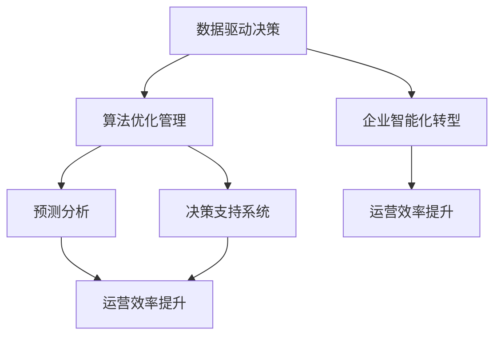

                 

# 如何将模型思维应用于实际管理

> 关键词：
  1. 数据驱动决策
  2. 算法优化管理
  3. 预测分析
  4. 决策支持系统
  5. 运营效率提升
  6. 模型集成平台
  7. 企业智能化转型

## 1. 背景介绍

### 1.1 问题由来
随着大数据和人工智能技术的迅猛发展，企业运营管理已逐步从传统经验型管理向数据驱动型管理转变。数据驱动决策成为企业管理的新常态，模型思维在企业管理中的应用变得尤为重要。如何有效将模型思维应用于实际管理，成为了企业智能化转型的关键。

### 1.2 问题核心关键点
数据驱动决策、算法优化管理、预测分析、决策支持系统、运营效率提升，以及企业智能化转型等方面构成了模型思维在实际管理中的应用框架。通过对这些关键点的深入理解和实践，企业可以实现更高效、更智能、更可持续的运营模式。

## 2. 核心概念与联系

### 2.1 核心概念概述

为更好地理解模型思维在实际管理中的应用，本节将介绍几个密切相关的核心概念：

- **数据驱动决策**：指通过数据分析和建模，为管理决策提供依据，而不是仅凭经验和直觉。
- **算法优化管理**：指使用算法对企业运营管理的各个环节进行优化，提升效率和效果。
- **预测分析**：指基于历史数据和模型，预测未来趋势和行为，辅助管理决策。
- **决策支持系统**：指通过集成数据、模型和算法，为管理决策提供支持和辅助的工具。
- **运营效率提升**：指通过算法和模型优化企业流程，提高运营效率和资源利用率。
- **企业智能化转型**：指通过应用人工智能技术，实现企业的智能化管理和发展。

这些核心概念之间的逻辑关系可以通过以下Mermaid流程图来展示：



这个流程图展示了大数据和人工智能在企业管理中的应用路径：

1. 数据驱动决策：数据为基础，模型为工具。
2. 算法优化管理：利用算法对管理流程进行优化。
3. 预测分析：基于数据和模型预测未来趋势。
4. 决策支持系统：集成数据、模型和算法，辅助决策。
5. 运营效率提升：通过优化提升运营效率。
6. 企业智能化转型：将AI技术应用到企业管理的各个环节。

## 3. 核心算法原理 & 具体操作步骤
### 3.1 算法原理概述

模型思维在实际管理中的应用，本质上是将算法和数据集成到管理决策过程中，实现数据驱动的管理决策。其核心思想是：

- **数据收集与处理**：收集管理相关的数据，并对其进行清洗、处理和转换。
- **模型构建与训练**：基于处理后的数据构建模型，并使用训练数据进行模型训练。
- **模型应用与评估**：将训练好的模型应用到实际管理场景中，评估模型效果并进行必要的调整。
- **决策支持与优化**：利用模型输出结果，辅助管理决策和流程优化。

### 3.2 算法步骤详解

以下是模型思维应用于实际管理的完整操作步骤：

**Step 1: 数据收集与处理**
- 定义管理问题的核心指标，并收集相关数据。
- 对数据进行清洗、去重、标准化等预处理操作。
- 选择合适的数据格式，如CSV、Excel、SQL数据库等，存储和管理数据。

**Step 2: 模型构建与训练**
- 根据管理问题，选择合适的算法模型。如回归模型、分类模型、聚类模型等。
- 选择合适的训练数据，并进行数据划分（训练集、验证集、测试集）。
- 构建模型架构，定义损失函数、优化器等关键组件。
- 使用训练数据对模型进行训练，迭代优化模型参数。

**Step 3: 模型应用与评估**
- 将训练好的模型应用到实际管理场景中。
- 根据模型的预测结果，结合实际数据进行评估。
- 根据评估结果，调整模型参数或选择更合适的模型。

**Step 4: 决策支持与优化**
- 利用模型输出结果，辅助管理决策和流程优化。
- 对模型进行持续监控和维护，确保模型效果稳定。
- 定期更新数据和模型，适应新的管理需求和变化。

### 3.3 算法优缺点

模型思维在实际管理中的应用具有以下优点：
1. 数据驱动决策：基于数据和模型进行决策，减少主观偏见。
2. 高效优化：利用算法模型对管理流程进行优化，提升效率和效果。
3. 预测未来：通过预测分析，提前发现问题并采取措施。
4. 决策支持：辅助管理决策，减少决策失误。
5. 全面覆盖：模型思维可以覆盖企业管理的各个方面，提高管理水平。

同时，模型思维在实际管理中也存在一些缺点：
1. 数据质量要求高：模型预测的准确性高度依赖数据质量，需确保数据的完整性和准确性。
2. 模型选择复杂：需要根据管理问题选择合适的模型，选择不当可能影响决策效果。
3. 模型解释性差：部分高级模型如深度学习，结果难以解释，管理层可能难以理解。
4. 计算资源消耗大：构建和训练复杂模型需要大量计算资源，企业需投入较高成本。
5. 模型过时风险：管理环境和需求变化快，模型可能很快过时，需持续更新和维护。

尽管存在这些局限性，但通过合理设计和管理，模型思维仍能在企业管理的多个场景中发挥重要作用。

### 3.4 算法应用领域

模型思维在实际管理中的应用领域非常广泛，以下列举几个典型应用场景：

- **供应链管理**：通过预测分析，优化库存管理，提升供应链效率。
- **客户关系管理**：利用预测模型，识别高价值客户，制定个性化营销策略。
- **人力资源管理**：使用分类和聚类模型，分析员工绩效和流失原因，优化招聘和培训策略。
- **财务管理**：通过时间序列模型，预测财务数据，优化财务决策。
- **风险管理**：利用分类和回归模型，评估风险并制定风险控制策略。

此外，模型思维还适用于市场营销、生产计划、运营调度等诸多管理领域，为企业的数字化转型提供了有力支撑。

## 4. 数学模型和公式 & 详细讲解  
### 4.1 数学模型构建

本节将使用数学语言对模型思维在实际管理中的应用进行严格刻画。

假设管理问题是**预测销售趋势**，涉及的变量包括历史销售数据 $y_i$ 和相关特征 $x_{ij}$。记 $y_{n\times 1}$ 为历史销售数据，$X_{n\times k}$ 为特征矩阵，其中 $n$ 为样本数，$k$ 为特征数。

定义模型 $M_{\theta}(x)=y_i$，其中 $\theta$ 为模型参数。选择回归模型，如线性回归、多项式回归、支持向量机等，来拟合数据，目标是最小化经验风险 $\mathcal{L}(\theta)$。

## 4.2 公式推导过程

以下对线性回归模型的推导过程进行详细讲解：

假设线性回归模型为 $y=\theta_0+\sum_{i=1}^k x_i\theta_i$，其中 $\theta=(\theta_0,\theta_1,\dots,\theta_k)^\top$。根据最小二乘法，目标是最小化残差平方和：

$$
\mathcal{L}(\theta)=\frac{1}{N}\sum_{i=1}^N (y_i-\theta_0-\sum_{i=1}^k x_i\theta_i)^2
$$

对 $\mathcal{L}(\theta)$ 求偏导数并令其为0，可得参数估计：

$$
\theta=\left(\sum_{i=1}^N x_ix_i^\top\right)^{-1}\sum_{i=1}^N x_iy_i
$$

这就是线性回归模型的参数估计公式，可以用于预测未来销售趋势。

### 4.3 案例分析与讲解

假设某电商公司想要预测未来几个月的销售额，可以收集历史销售数据 $y_{1:T}$ 和相关特征 $x_{1:T}$，包括促销活动、节假日、季节性因素等。

1. **数据收集**：收集近一年历史销售数据，并收集相关营销、市场、天气等特征。
2. **数据处理**：对数据进行清洗、去重、标准化处理。
3. **模型构建**：选择线性回归模型，定义特征和目标变量。
4. **模型训练**：使用历史数据训练模型，得到参数 $\theta$。
5. **模型评估**：在验证集上评估模型效果，选择最优模型。
6. **模型应用**：将模型应用到实际销售数据中，预测未来销售趋势。

## 5. 项目实践：代码实例和详细解释说明
### 5.1 开发环境搭建

在进行模型思维实际管理的应用实践前，需要先搭建开发环境：

1. 安装Python：从官网下载并安装最新版本的Python。
2. 安装必要的库：如Numpy、Pandas、Scikit-learn等。
3. 搭建模型环境：可以使用虚拟环境工具（如Anaconda）来隔离项目依赖，避免不同项目之间的冲突。
4. 准备数据：收集管理相关数据，并进行预处理和存储。

### 5.2 源代码详细实现

以下是使用Python和Scikit-learn库构建线性回归模型的代码实现：

```python
import pandas as pd
from sklearn.linear_model import LinearRegression
from sklearn.model_selection import train_test_split
from sklearn.metrics import mean_squared_error

# 加载数据
data = pd.read_csv('sales_data.csv')

# 划分数据集
X = data[['promotion', 'holiday', 'seasonality']]
y = data['sales']
X_train, X_test, y_train, y_test = train_test_split(X, y, test_size=0.2, random_state=42)

# 训练模型
model = LinearRegression()
model.fit(X_train, y_train)

# 评估模型
y_pred = model.predict(X_test)
mse = mean_squared_error(y_test, y_pred)
print('MSE:', mse)

# 应用模型
future_sales = model.predict([[0.5, 1, 0.3]])  # 假设未来三个月分别为促销期、节假日、季节性因素
print('Future Sales:', future_sales)
```

### 5.3 代码解读与分析

以上代码实现了一个简单的线性回归模型，用于预测电商公司的未来销售数据。

**数据加载与处理**：使用Pandas库加载历史销售数据，并划分特征和目标变量。

**模型训练与评估**：使用Scikit-learn库中的LinearRegression类训练模型，并在测试集上评估模型的均方误差。

**模型应用**：利用训练好的模型，对未来三个月的销售数据进行预测。

## 6. 实际应用场景
### 6.1 供应链管理

在供应链管理中，模型思维可以用于优化库存管理、预测需求、降低成本、提高效率等方面。通过预测分析，可以实时监控库存水平，动态调整采购计划，避免库存积压或缺货的情况。

### 6.2 客户关系管理

客户关系管理(CRM)系统可以通过预测模型识别出高价值客户，制定个性化的营销策略，提升客户满意度和忠诚度。通过分析客户行为数据，可以预测客户流失风险，提前采取措施。

### 6.3 人力资源管理

人力资源管理中，可以利用模型分析员工绩效、流失原因、招聘效果等，制定科学的人才管理策略。通过预测模型，可以预测员工流失风险，并提前采取预防措施。

### 6.4 财务管理

财务管理中，模型思维可以用于预测财务报表、预算管理、资金流动等方面。通过时间序列模型，可以预测未来财务数据，优化财务决策，降低财务风险。

### 6.5 风险管理

风险管理中，可以通过分类和回归模型评估风险，制定风险控制策略。如使用逻辑回归模型预测信用风险，或使用回归模型预测市场波动风险。

### 6.6 市场营销

市场营销中，可以利用预测模型分析市场趋势、客户需求、竞争对手情况等，制定科学的营销策略。通过预测模型，可以预测广告效果、客户购买意愿等，优化营销预算分配。

### 6.7 生产管理

生产管理中，可以通过模型预测生产需求、设备维护、质量控制等，提高生产效率和产品质量。通过预测模型，可以优化生产计划，避免资源浪费。

### 6.8 运营调度

运营调度中，可以利用预测模型优化调度计划，提高物流、库存、生产等环节的效率。通过预测模型，可以实时调整调度策略，应对突发事件。

## 7. 工具和资源推荐
### 7.1 学习资源推荐

为了帮助开发者系统掌握模型思维在实际管理中的应用，以下是几本经典书籍推荐：

1. 《数据驱动的管理决策》：系统介绍了数据驱动决策的原理和实践方法。
2. 《算法优化管理》：介绍了如何利用算法优化企业管理流程，提升效率和效果。
3. 《预测分析》：深入讲解了预测分析的技术和应用，帮助管理决策更加科学。
4. 《决策支持系统》：介绍了决策支持系统的构成和功能，助力管理决策。
5. 《运营效率提升》：介绍了如何通过算法和模型优化运营管理，提升运营效率。
6. 《企业智能化转型》：探讨了人工智能技术在企业管理中的应用，助力企业智能化转型。

通过这些学习资源，相信你一定能够系统掌握模型思维在实际管理中的应用方法。

### 7.2 开发工具推荐

以下是几款用于模型思维实际管理的常用工具：

1. Python：作为数据科学和人工智能的主流语言，Python具有强大的数据处理和建模能力。
2. Scikit-learn：简单易用的机器学习库，支持多种算法和模型，适合快速原型开发。
3. TensorFlow/Keras：支持深度学习模型的构建和训练，适合处理复杂的数据和模型。
4. SQL：作为数据管理和查询的语言，SQL可以高效处理结构化数据，支持复杂的数据分析和建模。
5. Power BI：微软推出的商业智能工具，支持数据可视化、报告和仪表盘，帮助管理决策。
6. Tableau：著名的数据可视化工具，支持实时数据更新和交互式分析。

合理利用这些工具，可以显著提升模型思维在实际管理中的应用效率，加速管理决策和流程优化。

### 7.3 相关论文推荐

模型思维在实际管理中的应用源于学界的持续研究。以下是几篇奠基性的相关论文，推荐阅读：

1. 《数据驱动的管理决策》：介绍了数据驱动决策的原理和实践方法。
2. 《算法优化管理》：探讨了如何利用算法优化企业管理流程。
3. 《预测分析》：深入讲解了预测分析的技术和应用。
4. 《决策支持系统》：介绍了决策支持系统的构成和功能。
5. 《运营效率提升》：介绍了如何通过算法和模型优化运营管理。
6. 《企业智能化转型》：探讨了人工智能技术在企业管理中的应用。

这些论文代表了大数据和人工智能在企业管理中的应用方向，值得深入学习。

## 8. 总结：未来发展趋势与挑战
### 8.1 总结

本文对模型思维在实际管理中的应用进行了全面系统的介绍。首先阐述了数据驱动决策、算法优化管理、预测分析、决策支持系统、运营效率提升，以及企业智能化转型等核心概念。其次，从原理到实践，详细讲解了模型思维的构建、训练、应用和评估过程，给出了实际管理的代码实例。最后，探讨了模型思维在供应链管理、客户关系管理、人力资源管理、财务管理、风险管理、市场营销、生产管理、运营调度等多个领域的应用场景，并推荐了相关学习资源、开发工具和经典论文。

通过本文的系统梳理，可以看到，模型思维在实际管理中的应用前景广阔，不仅能有效提升企业的运营效率和决策质量，还能推动企业的智能化转型。未来，伴随大数据和人工智能技术的不断进步，模型思维必将在更多领域发挥更大的作用。

### 8.2 未来发展趋势

展望未来，模型思维在实际管理中的应用将呈现以下几个发展趋势：

1. **智能化决策支持**：利用深度学习和自然语言处理技术，构建更加智能的决策支持系统。
2. **实时动态分析**：通过实时数据流和大数据技术，实现动态分析和管理，提升响应速度和决策效果。
3. **跨领域融合**：将模型思维与物联网、区块链、云计算等技术结合，实现跨领域的智能管理。
4. **数据驱动运营**：将模型思维应用于企业运营的各个环节，提升全流程智能化水平。
5. **人机协同管理**：通过人机协作，增强管理决策的准确性和效率。

这些趋势预示着模型思维在实际管理中的应用将更加深入、广泛和高效，带来更多的管理创新和变革。

### 8.3 面临的挑战

尽管模型思维在实际管理中的应用前景广阔，但在推广和应用过程中仍面临一些挑战：

1. **数据质量问题**：模型预测的准确性高度依赖数据质量，需确保数据的完整性和准确性。
2. **算法复杂性**：高级算法模型如深度学习，结果难以解释，管理层可能难以理解。
3. **计算资源消耗大**：构建和训练复杂模型需要大量计算资源，企业需投入较高成本。
4. **模型更新难度**：管理环境和需求变化快，模型可能很快过时，需持续更新和维护。
5. **技术门槛高**：需要跨学科的技术知识，如数据科学、管理科学、统计学等，技术门槛较高。

尽管存在这些挑战，但通过合理设计和管理，模型思维仍能在企业管理的多个场景中发挥重要作用。

### 8.4 研究展望

未来的研究需要在以下几个方面寻求新的突破：

1. **数据质量管理**：开发自动化的数据清洗和验证工具，确保数据质量。
2. **模型可解释性**：研究如何增强模型的可解释性，使管理层能更好地理解模型结果。
3. **智能决策引擎**：开发更加智能的决策引擎，支持人机协同管理。
4. **模型实时更新**：研究如何快速更新模型，以适应新的管理需求和变化。
5. **跨领域融合**：探索如何实现跨领域的智能管理，提升综合管理能力。

这些研究方向将进一步推动模型思维在实际管理中的应用，助力企业智能化转型，提升管理决策的科学性和效率。

## 9. 附录：常见问题与解答

**Q1: 数据驱动决策如何降低管理风险？**

A: 数据驱动决策通过大量数据分析和建模，减少主观偏见和直觉因素的影响，使决策更加客观和科学。利用预测模型，可以提前发现问题并采取预防措施，降低管理风险。

**Q2: 如何选择合适的模型？**

A: 选择合适的模型需要考虑管理问题的类型和特点。如回归问题可以选择线性回归、决策树、随机森林等模型；分类问题可以选择逻辑回归、支持向量机、神经网络等模型。需要根据具体问题进行模型选择和优化。

**Q3: 模型思维在实际管理中如何避免数据隐私问题？**

A: 在模型思维应用中，需要严格遵守数据隐私法规和伦理规范，如GDPR、CCPA等。可以使用匿名化、加密、数据脱敏等技术保护数据隐私。同时，使用差分隐私等技术，保护个人隐私不被泄露。

**Q4: 模型应用中的误差如何处理？**

A: 模型应用中的误差可以通过模型评估和调整进行改进。利用均方误差、对数损失、分类准确率等指标评估模型效果，根据评估结果调整模型参数或选择更合适的模型。

**Q5: 如何保证模型的公平性和可解释性？**

A: 在构建模型时，需要关注公平性问题，避免对特定群体产生偏见。同时，增强模型的可解释性，使管理层能更好地理解模型决策过程，提高模型可信度。

以上问题及解答展示了模型思维在实际管理中的常见挑战和解决方案，希望能帮助管理者和开发者更好地理解和应用模型思维。

