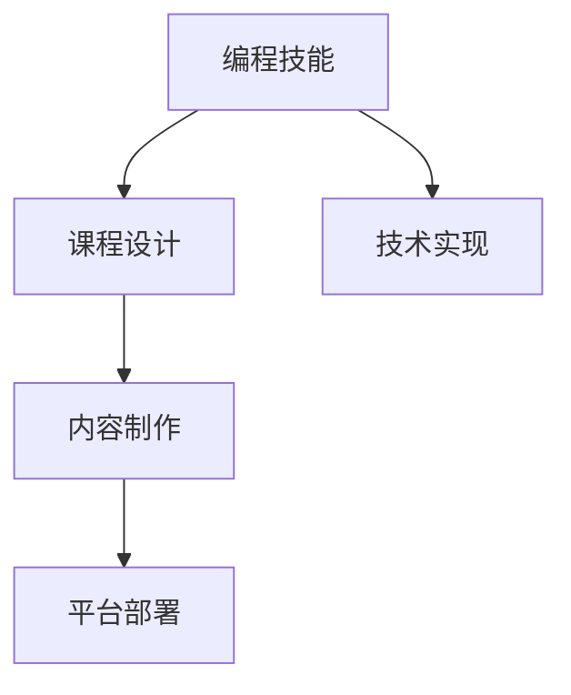

                 

# 如何将编程技能转化为在线课程

## 1. 背景介绍

### 1.1 问题由来
随着互联网和信息技术的发展，在线教育已成为全球教育的重要组成部分。在线课程为人们提供了更加灵活、便捷的学习方式，让知识传递不再受时间和空间的限制。然而，高质量在线课程的开发往往需要大量的技术储备和资源投入，对于广大教师和教育从业者来说，将编程技能转化为优质的在线课程仍是一个不小的挑战。

### 1.2 问题核心关键点
将编程技能转化为在线课程，涉及从课程设计到技术实现、从课程录制到平台部署等多个环节。核心关键点包括：
- 课程内容的系统规划和设计。
- 技术实现细节，包括视频录制、互动设计、平台集成等。
- 优质内容的制作与优化，提升学习体验。
- 平台部署与推广，确保课程顺利上线并吸引用户。

### 1.3 问题研究意义
高质量在线课程的开发对于提升教育资源的普惠性、促进知识共享、推动教育公平具有重要意义。通过将编程技能转化为在线课程，可以实现知识的广泛传播，支持终身学习，助力职业技能提升，对于推动教育行业的数字化转型具有积极作用。

## 2. 核心概念与联系

### 2.1 核心概念概述

为更好地理解如何将编程技能转化为在线课程，本节将介绍几个密切相关的核心概念：

- **编程技能(Programming Skills)**：涵盖编程语言、算法设计、数据结构、软件工程等核心知识，是构建在线课程的基础。
- **在线课程(Online Courses)**：通过网络平台提供的教学内容，包括视频、文档、练习等，供学生自主学习。
- **课程设计(Course Design)**：包括课程目标设定、教学内容组织、学习路径规划等，是构建优质在线课程的关键。
- **技术实现(Technical Implementation)**：涵盖视频录制、互动设计、平台集成等技术细节，确保课程顺利上线。
- **内容制作(Content Production)**：包括视频制作、脚本编写、资源整理等，提升课程质量。
- **平台部署(Platform Deployment)**：涉及课程上传、推广、用户管理等环节，确保课程上线后能够吸引用户。

这些核心概念之间的逻辑关系可以通过以下Mermaid流程图来展示：



这个流程图展示出将编程技能转化为在线课程的一般流程：先掌握编程技能，然后设计课程内容，接着进行技术实现，制作优质内容，最后部署上线。

## 3. 核心算法原理 & 具体操作步骤
### 3.1 算法原理概述

将编程技能转化为在线课程，本质上是一个系统工程项目，需要综合运用多个技术手段和方法论。核心算法原理包括：

- **需求分析**：通过对学习者需求和课程目标的深度理解，确定课程内容和结构。
- **教学设计**：结合学习心理学和教育学原理，设计互动性强、趣味性高的教学活动。
- **技术选型**：根据课程特点和平台要求，选择最适合的技术方案，包括视频录制软件、互动平台等。
- **内容制作**：通过精心的视频拍摄、脚本编写、资源整理，制作高质量的教学材料。
- **平台部署**：将课程内容上传到在线学习平台，进行市场推广和用户管理，确保课程上线后能够吸引学生。

### 3.2 算法步骤详解

将编程技能转化为在线课程的具体操作步骤如下：

**Step 1: 需求分析和课程设计**
- 收集学习者的需求和期望，明确课程目标和预期效果。
- 设计课程内容，包括理论知识、实践技能、项目案例等。
- 确定课程结构，包括章节划分、学习路径、评估方式等。

**Step 2: 技术选型和配置**
- 选择适合的视频录制软件，如Camtasia、OBS Studio等。
- 配置录制环境，包括麦克风、摄像头、灯光等。
- 选择适合的互动平台，如Edx、Coursera、Udacity等。
- 确保平台与视频录制工具、内容管理系统等无缝集成。

**Step 3: 内容制作**
- 撰写脚本，明确每一节课的教学内容和目标。
- 进行视频拍摄和录制，确保画面清晰、声音清晰、互动性强。
- 整理和补充教学材料，如PPT、代码示例、参考资料等。
- 对视频进行编辑和剪辑，提高观看体验。

**Step 4: 平台部署与推广**
- 将制作好的课程内容上传到在线学习平台，并进行封装和部署。
- 进行市场推广，利用社交媒体、教育论坛、合作伙伴等渠道进行宣传。
- 收集用户反馈，根据反馈不断优化课程内容和教学方式。
- 建立用户管理系统，进行学员管理、成绩评估、互动支持等。

### 3.3 算法优缺点

将编程技能转化为在线课程具有以下优点：
1. **灵活性高**：在线课程可以随时随地学习，打破了时间和空间的限制。
2. **资源共享**：课程内容可以分享给全球范围内的学习者，促进知识的普惠性。
3. **互动性强**：通过互动平台和社区，学生可以随时提问、交流，提升学习体验。
4. **成本低廉**：相比于传统线下课程，在线课程的制作和部署成本相对较低。

同时，该方法也存在一些局限性：
1. **自我管理要求高**：在线学习需要较强的自我管理能力，学生需要自律和主动。
2. **互动质量依赖平台**：互动效果受限于平台的社区活跃度和互动功能。
3. **学习效果差异**：不同学习者的学习效果差异较大，需要教师提供个性化的指导和支持。
4. **技术门槛较高**：需要掌握一定的技术手段和工具，才能制作高质量的课程。

尽管存在这些局限性，但在线课程的普及和受欢迎程度仍逐年提升，尤其在技术、工程、设计等专业领域，在线课程已逐渐成为主流学习方式之一。

### 3.4 算法应用领域

将编程技能转化为在线课程的方法，在多个领域得到了广泛应用，例如：

- **计算机科学教育**：在高校和社区中，计算机科学课程越来越多地通过在线课程形式进行教学。
- **软件工程培训**：许多企业和培训机构利用在线课程进行软件工程技能培训，帮助从业者提升实战能力。
- **创业和技术创新**：在线课程为创业者提供技术学习和项目实践的机会，促进技术创新和商业模式的探索。
- **终身学习**：在线课程为成人学习者提供了灵活的学习途径，支持其终身学习的目标。

除了上述这些领域，在线课程还在教育、医疗、艺术等多个领域得到应用，为知识传播和教育创新提供了新的可能性。

## 4. 数学模型和公式 & 详细讲解 & 举例说明
### 4.1 数学模型构建

本节将使用数学语言对将编程技能转化为在线课程的整个过程进行更加严格的刻画。

假设在线课程的录制时间为 $T$，视频拍摄时间为 $S$，内容制作时间为 $C$，平台部署时间为 $D$。课程的总体时间为 $T+S+C+D$。

**需求分析**：通过调查问卷、学生反馈等方式，收集学习者的需求，确定课程目标。假设需求分析时间为 $A$。

**课程设计**：设计课程内容和结构。假设课程设计时间为 $B$。

**技术选型和配置**：选择合适的录制软件和平台，并进行配置。假设技术选型时间为 $T_1$，配置时间为 $C_1$。

**内容制作**：撰写脚本、拍摄录制、编辑剪辑。假设视频拍摄时间为 $S_1$，脚本编写时间为 $T_2$，编辑时间为 $C_2$。

**平台部署与推广**：上传内容、市场推广、用户管理。假设平台部署时间为 $D_1$，推广时间为 $T_3$。

总时间 $T_{total}$ 可以表示为：

$$
T_{total} = A + B + T_1 + C_1 + S_1 + T_2 + C_2 + D_1 + T_3
$$

通过数学模型，可以系统地分析各个环节的时间消耗，优化课程制作流程，提高效率。

### 4.2 公式推导过程

以视频录制为例，推导视频拍摄时间与视频长度之间的关系。假设视频长度为 $L$，视频帧率为 $f$，每秒拍摄帧数为 $N$。则视频拍摄时间 $S_1$ 可以表示为：

$$
S_1 = \frac{L}{Nf}
$$

进一步推导，可以得到录制时间和视频长度的关系：

$$
T_1 = \frac{L}{Nf} + K
$$

其中 $K$ 为固定时间开销，包括设置设备、调试参数等。

### 4.3 案例分析与讲解

以一个简单的编程基础课程为例，说明将编程技能转化为在线课程的具体过程。

**需求分析**：通过调查问卷得知，学习者希望学习Python基础语法和常用库。

**课程设计**：设计10个章节，每个章节包含理论知识、实践练习和项目案例。

**技术选型和配置**：选择Camtasia进行视频录制，配置摄像头、麦克风等设备。

**内容制作**：撰写脚本，进行视频拍摄和编辑。脚本编写时间为2小时，视频拍摄时间为3小时，编辑时间为1小时。

**平台部署与推广**：上传到Udemy平台，推广时间为2周。

通过上述公式计算，得到总时间为：

$$
T_{total} = 1 + 5 + 3 + 1 + 1 + 1 + 2 = 15 \text{ 小时}
$$

根据时间预算，可以合理安排各个环节的工作，确保课程按时上线。

## 5. 项目实践：代码实例和详细解释说明
### 5.1 开发环境搭建

在进行在线课程开发前，我们需要准备好开发环境。以下是使用Python进行Kaggle平台开发的环境配置流程：

1. 安装Kaggle API：
```python
pip install kaggle
```

2. 配置Kaggle API密钥：
```python
kaggle.set_config({
    'api_token': 'YOUR_API_KEY',
    'dataset_directory': 'YOUR_DATASET_DIR',
})
```

3. 创建项目文件夹：
```python
mkdir programming-course
cd programming-course
```

4. 初始化项目：
```python
kaggle notebook init
```

5. 安装所需库：
```python
pip install numpy pandas matplotlib jupyter
```

完成上述步骤后，即可在`programming-course`环境中开始课程开发。

### 5.2 源代码详细实现

下面我们以一个简单的Python编程基础课程为例，给出使用Kaggle平台进行在线课程开发的PyTorch代码实现。

首先，定义课程基本信息：

```python
import kaggle

# 课程名称和简介
course_name = 'Python Programming Fundamentals'
course_description = 'Learn the basics of Python programming'

# 创建课程
course = kaggle.create_course(
    name=course_name,
    description=course_description,
    filename='python_intro.ipynb',
)
```

然后，定义视频录制函数：

```python
import cv2
import numpy as np

def record_video(file_name, width=1280, height=720, fps=30, codec='h264'):
    # 初始化摄像头
    cap = cv2.VideoCapture(0)

    # 创建视频写入器
    fourcc = cv2.VideoWriter_fourcc(*codec)
    out = cv2.VideoWriter(file_name, fourcc, fps, (width, height))

    # 录制视频
    while cap.isOpened():
        ret, frame = cap.read()
        if ret:
            frame = cv2.cvtColor(frame, cv2.COLOR_BGR2RGB)
            frame = np.uint8(frame)
            out.write(frame)
        else:
            break

    # 释放资源
    cap.release()
    out.release()
    cv2.destroyAllWindows()
```

接着，进行视频录制：

```python
record_video('python_intro.mp4', width=1280, height=720, fps=30, codec='h264')
```

最后，上传视频到Kaggle平台：

```python
kaggle.upload('python_intro.mp4', commit_message='Add video for Python course')
```

以上就是使用Kaggle平台进行在线课程开发的完整代码实现。可以看到，Kaggle平台提供了丰富的工具和资源，帮助开发者快速创建、发布和管理在线课程。

### 5.3 代码解读与分析

让我们再详细解读一下关键代码的实现细节：

**课程创建**：
- 使用Kaggle API创建课程，指定课程名称和简介。
- 创建一个新的Jupyter Notebook文件，作为课程的网页界面。

**视频录制**：
- 使用OpenCV库进行视频录制，设置摄像头、视频格式、帧率等参数。
- 视频录制过程中，将摄像头捕获的图像转换为RGB格式，并写入视频文件。
- 录制完毕后，关闭摄像头和视频写入器，释放资源。

**视频上传**：
- 使用Kaggle API的上传功能，将录制好的视频文件上传到Kaggle平台。
- 设置提交信息，确保课程内容同步更新。

通过上述代码，可以实现基本的编程技能转化为在线课程的流程，但实际开发中还需要考虑更多细节，如脚本编写、视频编辑、用户互动等。

## 6. 实际应用场景
### 6.1 教育平台

在线课程在教育平台中的应用非常广泛，尤其是在远程教育、终身学习、职业培训等领域。通过将编程技能转化为在线课程，可以打破时间和空间的限制，为全球范围内的学习者提供灵活、高质量的编程教育资源。

在技术实现上，教育平台可以采用Kaggle、Coursera、edX等第三方平台，也可以自建平台进行课程发布和管理。通过在线课程，学生可以根据自己的节奏进行学习，随时随地进行编程实践，提升编程技能。

### 6.2 企业培训

许多企业利用在线课程进行内部培训和外部招聘。通过将编程技能转化为在线课程，企业可以高效地培训员工，提升团队的技术水平，同时吸引优秀的人才。

在实际应用中，企业可以利用自建的LMS平台或第三方培训平台，根据员工需求定制课程内容，并提供实战案例、项目案例等丰富的学习资源。通过在线课程，员工可以自主学习，提升技术能力，同时企业可以追踪员工的学习进度，进行评估和考核。

### 6.3 在线教学

在线课程在Kaggle等平台上的成功应用，为在线教学提供了新的可能性。通过将编程技能转化为在线课程，可以吸引更多的学生参与在线学习，提升教学效果。

在实际应用中，教师可以利用Kaggle等平台发布课程，通过互动式教学、在线测验、社区讨论等方式，提升学生的学习体验。同时，平台可以提供自动化评分、学习数据分析等功能，帮助教师及时了解学生的学习情况，提供个性化的辅导。

### 6.4 未来应用展望

随着在线教育的普及和技术的发展，将编程技能转化为在线课程的应用前景更加广阔。未来，在线课程将进一步扩展到更多领域，如医疗、艺术、设计等，为各行各业提供优质的教育资源。

同时，在线课程将更加注重互动性和个性化，利用AI技术进行推荐、评估和反馈，提供更加灵活和高效的个性化学习方案。随着教育技术的不断发展，在线课程必将在全球范围内发挥更大的作用，推动教育公平和知识共享。

## 7. 工具和资源推荐
### 7.1 学习资源推荐

为了帮助开发者系统掌握将编程技能转化为在线课程的理论基础和实践技巧，这里推荐一些优质的学习资源：

1. **Kaggle官方文档**：Kaggle平台的官方文档，提供了丰富的API文档和教程，帮助开发者快速上手平台使用。
2. **Coursera课程《Coursera如何创建自己的课程》**：由Coursera的课程开发者撰写，介绍如何利用Coursera平台创建高质量在线课程。
3. **edX《课程设计原则》**：edX平台提供的课程设计指南，涵盖课程规划、教学活动设计等核心内容。
4. **Udacity课程《创建自己的课程》**：Udacity平台的课程创建课程，介绍如何设计、录制、发布在线课程。
5. **Kaggle社区论坛**：Kaggle社区的讨论区，开发者可以交流经验、分享资源、解决问题。

通过对这些资源的学习实践，相信你一定能够快速掌握将编程技能转化为在线课程的精髓，并用于解决实际的在线教育问题。

### 7.2 开发工具推荐

高效的开发离不开优秀的工具支持。以下是几款用于在线课程开发的常用工具：

1. **Kaggle平台**：提供丰富的在线课程开发和发布工具，支持视频上传、课程管理等功能。
2. **Coursera平台**：全球知名的在线教育平台，提供丰富的课程模板和互动功能。
3. **edX平台**：由麻省理工学院和哈佛大学联合创立的在线教育平台，提供高质量的课程资源和支持。
4. **Udacity平台**：以实践导向的在线课程平台，提供真实的项目案例和职业培训。
5. **Jupyter Notebook**：开源的交互式编程环境，支持代码编写、数据分析、可视化等功能。
6. **Camtasia**：专业的视频录制和编辑工具，支持高质量的视频录制和剪辑。

合理利用这些工具，可以显著提升在线课程的开发效率，加快创新迭代的步伐。

### 7.3 相关论文推荐

将编程技能转化为在线课程的研究源于学界的持续探索。以下是几篇奠基性的相关论文，推荐阅读：

1. **《基于Python的在线教育平台建设》**：介绍如何利用Python和Web技术开发在线教育平台。
2. **《在线课程设计中的交互性与学习效果研究》**：研究在线课程设计中的交互性和学习效果，提出改进建议。
3. **《在线学习平台的系统架构与关键技术》**：探讨在线学习平台的关键技术，包括视频录制、互动设计、用户管理等。
4. **《基于Kaggle平台的在线课程开发与实践》**：分享使用Kaggle平台进行在线课程开发的实践经验和心得。
5. **《在线教育的未来趋势与挑战》**：探讨在线教育的未来发展趋势和面临的挑战，提出应对策略。

这些论文代表了大规模在线课程开发的研究脉络。通过学习这些前沿成果，可以帮助研究者把握学科前进方向，激发更多的创新灵感。

## 8. 总结：未来发展趋势与挑战
### 8.1 总结

本文对将编程技能转化为在线课程的过程进行了全面系统的介绍。首先阐述了在线课程开发的背景和意义，明确了课程设计和技术实现的各个环节。其次，从原理到实践，详细讲解了在线课程的数学模型和实现步骤，给出了在线课程开发的完整代码实例。同时，本文还广泛探讨了在线课程在教育、企业、在线教学等多个领域的应用前景，展示了在线课程的巨大潜力。此外，本文精选了在线课程开发的相关学习资源，力求为开发者提供全方位的技术指引。

通过本文的系统梳理，可以看到，将编程技能转化为在线课程的过程涉及多个环节和关键技术，需要综合运用编程、设计、技术等多方面的知识。只有全面掌握这些知识，才能实现高质量的在线课程开发。

### 8.2 未来发展趋势

展望未来，在线课程开发将呈现以下几个发展趋势：

1. **智能化程度提高**：利用AI技术进行个性化推荐、自动化评估，提升学习体验和效果。
2. **多媒体资源丰富**：除了视频、PPT外，还可以加入动画、音频、互动游戏等多种形式的内容。
3. **社交互动增强**：利用在线社区、论坛、讨论区等方式，增强学生之间的互动和交流。
4. **跨平台支持**：支持移动端、Web端等多种平台，实现跨设备的无缝学习。
5. **微课程和微任务**：将大课程分解为多个小课程，进行碎片化学习，提升学习效率。
6. **实时反馈与支持**：提供实时反馈和问题解答，及时解决学生在学习过程中遇到的问题。

这些趋势将进一步推动在线课程的发展，使其更加高效、灵活、有趣，为更多学习者提供优质的教育资源。

### 8.3 面临的挑战

尽管在线课程开发取得了不少进展，但在迈向更加智能化、普适化应用的过程中，仍面临诸多挑战：

1. **技术门槛较高**：需要掌握编程、设计、视频制作等多种技术，对开发者要求较高。
2. **学习效果差异大**：不同学习者的学习效果差异较大，需要提供个性化支持和指导。
3. **内容质量控制**：课程内容需要不断更新和优化，确保其高质量和时效性。
4. **用户体验优化**：需要持续优化课程界面、互动方式，提升学习体验。
5. **平台依赖性强**：对在线学习平台的依赖程度较高，需要确保平台稳定运行。

尽管存在这些挑战，但随着技术的发展和教育理念的更新，在线课程的普及和质量将不断提升，为更多学习者提供更好的教育资源。

### 8.4 研究展望

面对在线课程开发所面临的挑战，未来的研究需要在以下几个方面寻求新的突破：

1. **开发智能学习系统**：利用AI技术进行学习数据分析和个性化推荐，提高学习效果。
2. **探索微课程和微任务**：将大课程分解为多个小课程，提升学习效率和灵活性。
3. **提升用户互动性**：利用在线社区、论坛、讨论区等方式，增强学生之间的互动和交流。
4. **优化课程质量控制**：建立课程质量评估体系，确保课程内容的高质量和时效性。
5. **开发跨平台学习平台**：支持移动端、Web端等多种平台，实现跨设备的无缝学习。
6. **引入多媒体资源**：除了视频、PPT外，还可以加入动画、音频、互动游戏等多种形式的内容。

这些研究方向将推动在线课程的不断进步，使其更加高效、灵活、有趣，为更多学习者提供优质的教育资源。

## 9. 附录：常见问题与解答

**Q1：在线课程的录制和编辑需要哪些工具？**

A: 在线课程的录制和编辑通常需要以下工具：
1. 视频录制软件，如Camtasia、OBS Studio等。
2. 视频编辑软件，如Adobe Premiere Pro、Final Cut Pro等。
3. 脚本编辑器，如Sublime Text、Visual Studio Code等。
4. 音频录制设备，如麦克风、录音笔等。

这些工具可以确保视频录制和编辑的流畅、高效和高质量。

**Q2：在线课程如何设计互动性？**

A: 在线课程的互动性设计可以通过以下方式实现：
1. 在线讨论区：提供论坛或评论区，让学生进行讨论和交流。
2. 实时问答：通过在线聊天工具或视频会议等方式，实时解答学生的问题。
3. 作业和测验：布置课后作业和测验，检验学生学习效果。
4. 项目实践：提供项目案例，让学生进行实际操作和展示。
5. 社区活动：组织在线社区活动，增强学生之间的互动和协作。

通过这些互动方式，可以提升学生的学习体验和参与度，增强课程的趣味性和实用性。

**Q3：在线课程如何推广？**

A: 在线课程的推广可以通过以下方式实现：
1. 社交媒体：利用Facebook、Twitter、LinkedIn等社交媒体平台进行宣传。
2. 教育论坛：在Coursera、edX、Kaggle等教育论坛上进行课程推广。
3. 合作伙伴：与其他教育机构或公司进行合作推广。
4. 广告投放：利用Google AdWords、Facebook Ads等广告平台进行推广。
5. 推荐系统：利用推荐算法进行个性化推荐，提升课程曝光率。

通过这些推广方式，可以吸引更多的学生参与在线学习，提升课程影响力和用户量。

**Q4：在线课程的反馈机制有哪些？**

A: 在线课程的反馈机制可以通过以下方式实现：
1. 在线调查：通过问卷调查了解学生的学习体验和课程建议。
2. 课程评估：在课程结束时进行评估，了解学生的学习效果和满意度。
3. 作业反馈：对学生提交的作业进行详细反馈，指出不足之处并提供改进建议。
4. 在线讨论：在讨论区中及时回应学生的问题和反馈，进行互动和沟通。
5. 课程更新：根据学生的反馈和建议，不断更新和优化课程内容。

通过这些反馈机制，可以及时了解学生的学习情况和课程效果，不断优化课程设计和教学方法。

**Q5：在线课程如何支持个性化学习？**

A: 在线课程的支持个性化学习可以通过以下方式实现：
1. 个性化推荐：利用推荐算法，根据学生的学习历史和兴趣推荐课程和内容。
2. 学习路径规划：根据学生的学习进度和需求，提供个性化的学习路径和课程推荐。
3. 实时反馈：利用AI技术进行实时反馈和评估，提供个性化的指导和支持。
4. 学习数据分析：利用数据分析工具，分析学生的学习行为和效果，提供个性化的学习建议。
5. 互动讨论：利用在线讨论区，提供个性化的互动和指导，增强学习体验。

通过这些个性化学习方式，可以提升学生的学习效果和满意度，实现高质量的教育资源共享。

---

作者：禅与计算机程序设计艺术 / Zen and the Art of Computer Programming

