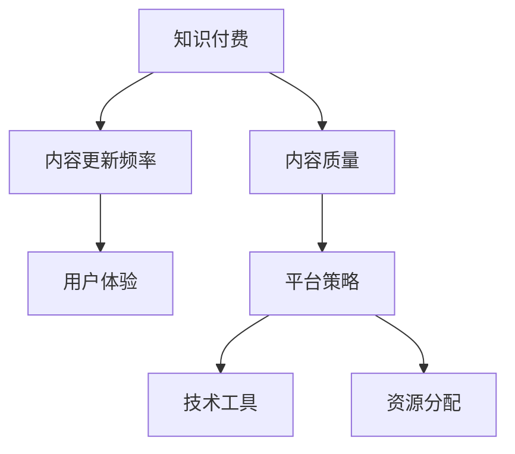

                 

# 如何平衡知识付费的内容质量和更新频率

> 关键词：知识付费,内容质量,更新频率,用户体验,平台策略,技术工具,资源分配

## 1. 背景介绍

### 1.1 问题由来
随着知识付费行业的兴起，知识内容更新频率和质量成为影响用户体验和平台粘性的关键因素。一方面，用户期望知识内容不断更新，以保持其知识体系的最新性。另一方面，快速更新会导致内容质量下降，用户难以从中获得深度、可靠的知识。如何平衡这两者，成为知识付费平台和内容创作者亟需解决的问题。

### 1.2 问题核心关键点
内容更新频率和质量之间存在一个矛盾点，即：
- 更频繁的更新可以保持用户对知识体系的最新认知，但可能牺牲内容深度和可靠性。
- 更严格的内容审核机制可以确保高质量，但降低更新频率，影响用户满意度。

## 2. 核心概念与联系

### 2.1 核心概念概述

为更好地理解如何平衡内容质量和更新频率，本节将介绍几个关键概念：

- **知识付费(Knowledge Subscription)**：用户为获取特定知识内容或服务而支付费用的模式。内容质量是吸引用户的重要因素。
- **内容质量(Content Quality)**：指知识内容的深度、权威性和可理解性等。内容质量高的知识能够有效提升用户的学习效果。
- **内容更新频率(Content Update Frequency)**：指内容创作者发布新内容的速度。频繁更新有助于保持用户对最新知识的关注，但可能影响内容质量。
- **用户体验(User Experience)**：用户在消费知识内容时的主观感受，直接影响用户的留存率和忠诚度。
- **平台策略(Platform Strategy)**：知识付费平台的整体发展策略，包括内容定位、定价模型、用户互动等方面。
- **技术工具(Technology Tools)**：辅助平台和创作者实现高效内容生产和更新的技术手段，如内容管理系统、自动化编辑工具等。
- **资源分配(Resource Allocation)**：指平台如何分配资源（如时间、人力、资金等）来满足内容生产和更新的需求。

这些核心概念之间的逻辑关系可以通过以下Mermaid流程图来展示：



这个流程图展示了几者之间的关系：

1. 知识付费依赖高质量的内容来吸引和留住用户。
2. 高质量的内容需要精心策划和维护，可能降低更新频率。
3. 频繁的内容更新有助于提高用户体验。
4. 平台策略需平衡内容质量与更新频率，以满足用户需求。
5. 技术工具和资源分配有助于优化内容生产和更新流程。

## 3. 核心算法原理 & 具体操作步骤
### 3.1 算法原理概述

平衡知识付费的内容质量和更新频率，本质上是一个多目标优化问题。其核心思想是：在用户需求和内容质量之间寻找平衡点，通过合理的算法和策略，最大化用户体验的同时，保持内容的高质量。

形式化地，假设内容质量为 $Q$，更新频率为 $F$，用户满意度为 $U$，平台的目标为最大化用户满意度 $U$，则优化目标为：

$$
\max_{Q,F} U(Q,F)
$$

其中 $U(Q,F)$ 表示在给定内容质量和更新频率下的用户满意度，可通过用户行为数据、反馈数据等进行建模。

根据平台的具体策略和目标，可以使用不同的优化算法求解上述问题。常见的优化方法包括：

- **动态规划**：将问题分解为多个子问题，递推求解，适用于问题规模较小的情况。
- **强化学习**：通过模拟用户行为，动态调整内容质量和更新频率，适用于问题规模较大、用户行为复杂的情况。
- **遗传算法**：通过模拟生物进化过程，寻找全局最优解，适用于问题复杂度较高的情况。

### 3.2 算法步骤详解

基于多目标优化问题，平衡内容质量和更新频率的算法步骤通常包括以下几个关键步骤：

**Step 1: 数据收集与建模**

- 收集用户行为数据，包括内容阅读量、停留时间、评分、评论等。
- 使用统计学习方法对用户满意度 $U(Q,F)$ 进行建模，如线性回归、逻辑回归、决策树等。

**Step 2: 优化目标设定**

- 定义内容质量和更新频率的约束条件，如内容质量不能低于一定标准，更新频率不能高于一定阈值。
- 设定用户满意度的权重，根据平台策略进行灵活调整。

**Step 3: 算法选择与实现**

- 根据问题规模和复杂度选择合适的优化算法。
- 实现算法模型，并进行参数调优和测试。

**Step 4: 模型评估与迭代**

- 在实际环境中测试优化模型的效果，收集用户反馈。
- 根据反馈结果调整模型参数，进行迭代优化。

**Step 5: 实时监控与调整**

- 实时监控用户满意度变化，根据实时数据动态调整内容生产和更新策略。

### 3.3 算法优缺点

平衡内容质量和更新频率的算法具有以下优点：
1. 用户满意度最大化。通过优化算法，能够较好地平衡内容质量和更新频率，提升用户整体满意度。
2. 动态适应性强。算法能够根据用户行为和反馈实时调整策略，动态适应不同阶段的需求。
3. 算法灵活性高。不同的优化算法和参数设置，能够根据具体问题进行调整，满足不同的平台策略和用户需求。

同时，该算法也存在一些局限性：
1. 算法复杂度较高。需要收集大量用户数据，进行复杂的建模和参数调优。
2. 可能存在局部最优解。优化算法可能陷入局部最优，无法达到全局最优。
3. 对平台资源要求高。实时监控和动态调整需要较强的计算能力和数据处理能力。

尽管存在这些局限性，但就目前而言，通过优化算法平衡内容质量和更新频率，仍然是大规模知识付费平台的重要选择。未来相关研究的重点在于如何进一步降低算法复杂度，提高算法效率，同时兼顾内容质量与用户满意度的双重目标。

### 3.4 算法应用领域

基于平衡算法的内容质量和更新频率方法，已经在知识付费平台的多个场景中得到应用，例如：

- 课程更新策略：根据用户行为数据，动态调整课程发布频率和内容深度。
- 知识社区运营：根据用户互动数据，优化知识内容发布节奏和互动频率。
- 个性化推荐：根据用户偏好，调整内容推荐策略，平衡推荐速度和质量。
- 平台搜索排序：根据用户搜索行为，调整搜索结果排序策略，优化用户体验。

除了上述这些典型场景外，该算法还被创新性地应用于更多场景中，如智能客服系统、个性化推荐、智能广告投放等，为知识付费平台带来全新的突破。

## 4. 数学模型和公式 & 详细讲解
### 4.1 数学模型构建

本节将使用数学语言对内容质量和更新频率的优化模型进行更加严格的刻画。

假设内容质量和更新频率分别为 $Q$ 和 $F$，用户满意度为 $U(Q,F)$。则优化模型可表示为：

$$
\max_{Q,F} U(Q,F)
$$

其中 $U(Q,F)$ 可以表示为多项式函数，如：

$$
U(Q,F) = w_1 Q + w_2 F - C(Q) - K(F)
$$

其中 $w_1$ 和 $w_2$ 为权重，$C(Q)$ 和 $K(F)$ 为内容质量和更新频率的成本函数，$C(Q)$ 和 $K(F)$ 的取值应与实际问题相关。

### 4.2 公式推导过程

以最简单的一元线性回归模型为例，假设用户满意度 $U$ 与内容质量 $Q$ 和更新频率 $F$ 呈线性关系，即：

$$
U = a_0 + a_1 Q + a_2 F
$$

其中 $a_0$、$a_1$ 和 $a_2$ 为回归系数。根据最小二乘法，可以求解回归系数：

$$
\hat{a}_0 = \bar{U} - \hat{a}_1 \bar{Q} - \hat{a}_2 \bar{F}
$$
$$
\hat{a}_1 = \frac{\sum_{i=1}^N (x_{i,1} - \bar{x}_1)(y_i - \bar{y})}{\sum_{i=1}^N (x_{i,1} - \bar{x}_1)^2}
$$
$$
\hat{a}_2 = \frac{\sum_{i=1}^N (x_{i,2} - \bar{x}_2)(y_i - \bar{y})}{\sum_{i=1}^N (x_{i,2} - \bar{x}_2)^2}
$$

其中 $\bar{x}_1$ 和 $\bar{x}_2$ 分别为 $Q$ 和 $F$ 的均值，$\bar{y}$ 为 $U$ 的均值。

根据上述回归模型，可以计算出任意给定的 $Q$ 和 $F$ 对应的 $U$ 值，从而进行优化。

### 4.3 案例分析与讲解

以一个在线教育平台为例，其内容质量和更新频率的优化模型如下：

假设平台共有 $N$ 门课程，每门课程的内容质量 $Q_i$ 和更新频率 $F_i$，用户的满意度 $U_i$ 与内容质量呈正相关，与更新频率呈负相关。

根据上述模型，可以计算每门课程的期望满意度 $E(U_i)$：

$$
E(U_i) = a_0 + a_1 Q_i + a_2 F_i
$$

其中回归系数 $a_0$、$a_1$ 和 $a_2$ 可以通过最小二乘法求解。

假设平台的总体满意度目标为 $U_{total}$，则优化目标为：

$$
\max_{Q_1,...,Q_N,F_1,...,F_N} \sum_{i=1}^N E(U_i) \geq U_{total}
$$

通过优化算法，可以动态调整每门课程的内容质量和更新频率，从而最大化总体满意度。

## 5. 项目实践：代码实例和详细解释说明
### 5.1 开发环境搭建

在进行内容质量和更新频率优化实践前，我们需要准备好开发环境。以下是使用Python进行优化模型开发的Python环境配置流程：

1. 安装Anaconda：从官网下载并安装Anaconda，用于创建独立的Python环境。

2. 创建并激活虚拟环境：
```bash
conda create -n pytorch-env python=3.8 
conda activate pytorch-env
```

3. 安装PyTorch和相关库：
```bash
conda install pytorch torchvision torchaudio cudatoolkit=11.1 -c pytorch -c conda-forge
pip install pandas scikit-learn numpy statsmodels matplotlib
```

完成上述步骤后，即可在`pytorch-env`环境中开始优化模型开发。

### 5.2 源代码详细实现

下面是使用Python实现内容质量和更新频率优化模型的代码示例：

```python
import pandas as pd
from sklearn.linear_model import LinearRegression

# 加载用户行为数据
data = pd.read_csv('user_behavior.csv')

# 计算内容质量和更新频率的均值
Q_mean = data['Q'].mean()
F_mean = data['F'].mean()

# 使用线性回归模型
model = LinearRegression()
X = pd.DataFrame({'Q': data['Q'], 'F': data['F']})
y = data['U']
model.fit(X, y)

# 计算回归系数
a0 = y.mean() - model.coef_[0] * Q_mean - model.coef_[1] * F_mean
a1 = model.coef_[0]
a2 = model.coef_[1]

# 输出回归方程
print(f"回归方程：U = {a0} + {a1}Q + {a2}F")
```

在这个示例中，我们首先加载了用户行为数据，并计算了内容质量和更新频率的均值。然后，使用线性回归模型对用户满意度进行建模，计算出回归系数 $a_0$、$a_1$ 和 $a_2$。最后，根据回归方程输出优化模型。

### 5.3 代码解读与分析

让我们再详细解读一下关键代码的实现细节：

**数据加载与处理**：
- 使用Pandas库加载用户行为数据，并计算了内容质量和更新频率的均值。

**线性回归模型**：
- 使用Scikit-learn库的LinearRegression模型对用户满意度进行建模。
- 将内容质量和更新频率作为自变量 $X$，用户满意度作为因变量 $y$，进行线性回归。

**回归系数计算**：
- 根据最小二乘法计算回归系数 $a_0$、$a_1$ 和 $a_2$。

**回归方程输出**：
- 根据计算出的回归系数，输出回归方程 $U = a_0 + a_1Q + a_2F$，用于后续内容质量和更新频率的优化。

可以看到，通过Python编程，我们能够快速构建和应用内容质量和更新频率的优化模型，从而平衡用户满意度和内容质量。

当然，工业级的系统实现还需考虑更多因素，如模型的参数调优、数据预处理、结果解释等。但核心的优化思路基本与此类似。

## 6. 实际应用场景
### 6.1 在线教育平台

在线教育平台的内容质量和更新频率优化，可以显著提升用户学习效果和平台留存率。通过实时监控用户行为数据，动态调整课程发布节奏和内容深度，可以最大程度满足用户需求。

在技术实现上，可以设计多个课程更新策略，如每周更新、每月更新、季度更新等，并根据用户反馈实时调整。例如，对于学习频率较高的课程，可以增加更新频率，保持用户对课程内容的持续关注。对于专业性强、更新难度大的课程，可以逐步增加内容深度，确保课程质量。

### 6.2 智能广告投放

智能广告平台的内容质量和更新频率优化，可以显著提升广告投放效果和用户转化率。通过动态调整广告内容和展示频率，可以最大程度吸引目标用户。

在技术实现上，可以设计多个广告投放策略，如实时竞价、定期投放、定向投放等，并根据用户行为数据实时调整。例如，对于点击率高的广告，可以增加展示频率，确保广告信息被目标用户看到。对于用户转化率低的广告，可以优化广告内容和创意，提升广告效果。

### 6.3 新闻媒体平台

新闻媒体平台的内容质量和更新频率优化，可以显著提升用户阅读体验和平台影响力。通过动态调整新闻报道的频率和深度，可以最大程度满足用户的信息需求。

在技术实现上，可以设计多个新闻报道策略，如每日报道、每周报道、重大事件报道等，并根据用户阅读行为数据实时调整。例如，对于热门新闻事件，可以增加报道频率和深度，确保新闻内容及时、全面。对于冷门新闻事件，可以逐步增加报道深度，确保新闻内容丰富、深度。

### 6.4 未来应用展望

随着内容质量和更新频率优化方法的不断发展，在线教育、智能广告、新闻媒体等平台的优化实践将会得到进一步提升。未来，该方法将在更多领域得到应用，为各行各业带来变革性影响。

在智慧医疗领域，基于用户健康数据的在线咨询平台可以动态调整医生回复频率和内容深度，提升用户体验和健康管理效果。

在智能客服系统，通过实时监控用户交互数据，动态调整服务策略和内容推荐，可以提升用户满意度和平台留存率。

在智慧城市治理中，基于城市运行数据的智能决策系统可以动态调整信息发布频率和内容深度，提升城市管理效率和公共服务水平。

此外，在企业生产、社会治理、文娱传媒等众多领域，内容质量和更新频率优化方法也将不断涌现，为经济社会发展注入新的动力。相信随着技术的日益成熟，内容质量和更新频率优化必将成为各行各业的重要手段，推动人工智能技术向更广泛的领域加速渗透。

## 7. 工具和资源推荐
### 7.1 学习资源推荐

为了帮助开发者系统掌握内容质量和更新频率优化的理论基础和实践技巧，这里推荐一些优质的学习资源：

1. 《数据科学入门》系列博文：由大数据专家撰写，详细介绍了数据科学基础和机器学习算法，包括多目标优化等内容。

2. 《机器学习实战》书籍：动手实践机器学习算法的经典著作，涵盖多种优化算法和应用场景，适合实战学习。

3. Kaggle平台：世界领先的机器学习竞赛平台，提供丰富的数据集和算法案例，帮助你理解和应用多目标优化。

4. TensorFlow官网：开源深度学习框架的官方文档，提供详细的API和教程，适合深度学习初学者。

5. Coursera平台：提供多门数据科学和机器学习课程，由斯坦福大学、密歇根大学等知名高校和公司开设，内容全面且系统。

通过对这些资源的学习实践，相信你一定能够快速掌握内容质量和更新频率优化的精髓，并用于解决实际的问题。

### 7.2 开发工具推荐

高效的开发离不开优秀的工具支持。以下是几款用于内容质量和更新频率优化开发的常用工具：

1. Jupyter Notebook：交互式编程环境，适合快速迭代研究。Python、R等语言兼容，支持多种数据格式和可视化工具。

2. RStudio：开源R语言开发环境，支持R、Python、SQL等多种语言，集成可视化工具、版本控制等，非常适合数据科学项目开发。

3. Git：版本控制系统，支持多人协作、代码版本管理，适合团队开发和项目协作。

4. Docker：容器化平台，可以快速部署应用，确保环境一致性，适合生产环境部署。

5. Kubernetes：容器编排平台，支持集群管理、弹性扩展，适合大规模应用部署。

合理利用这些工具，可以显著提升内容质量和更新频率优化任务的开发效率，加快创新迭代的步伐。

### 7.3 相关论文推荐

内容质量和更新频率优化技术的发展源于学界的持续研究。以下是几篇奠基性的相关论文，推荐阅读：

1. Multi-Objective Optimization in Algorithmic Trading：介绍了多目标优化算法在算法交易中的应用，详细探讨了优化模型的构建和实现。

2. Dynamic Resource Allocation in Cloud Computing：讨论了云计算环境下资源动态分配的优化算法，适用于大规模平台的资源管理。

3. Marketing Mix Optimization：介绍了市场营销组合优化模型，适用于广告投放和品牌推广等场景。

4. Online Learning for Recommendation Systems：探讨了在线推荐系统的优化算法，适用于个性化推荐系统的开发和应用。

5. Recommender Systems Based on Trust Propagation：介绍了基于信任传播的推荐算法，适用于社交网络推荐系统。

这些论文代表了大语言模型微调技术的发展脉络。通过学习这些前沿成果，可以帮助研究者把握学科前进方向，激发更多的创新灵感。

## 8. 总结：未来发展趋势与挑战
### 8.1 总结

本文对内容质量和更新频率的优化方法进行了全面系统的介绍。首先阐述了优化方法在提升用户满意度和平台粘性方面的重要意义，明确了优化目标和关键步骤。其次，从原理到实践，详细讲解了多目标优化的数学模型和算法步骤，给出了优化任务的代码实现。同时，本文还广泛探讨了优化方法在在线教育、智能广告、新闻媒体等多个行业领域的应用前景，展示了优化范式的巨大潜力。此外，本文精选了优化技术的各类学习资源，力求为读者提供全方位的技术指引。

通过本文的系统梳理，可以看到，内容质量和更新频率的优化方法在提升用户满意度和平台性能方面发挥了重要作用。未来，伴随技术的持续演进，优化方法将进一步应用于更多场景，为各行各业带来变革性影响。

### 8.2 未来发展趋势

展望未来，内容质量和更新频率优化技术将呈现以下几个发展趋势：

1. 数据驱动的决策机制。随着大数据技术的不断发展，优化算法将更加依赖于数据驱动的决策机制，能够实时响应用户需求和市场变化。

2. 模型自适应性增强。未来的优化模型将具备更高的自适应性，能够根据不同场景和用户行为，动态调整内容质量和更新频率。

3. 实时动态优化。优化算法将具备更强的实时动态优化能力，能够在用户行为变化时快速调整策略，确保内容质量和用户体验的双重优化。

4. 多目标融合。未来的优化方法将更多地融合多目标优化，兼顾内容质量、用户满意度和平台效益等多重目标，实现更全面的优化。

5. 人机协同优化。优化过程将更多地引入人工干预和审核机制，确保优化的正确性和合理性，避免算法过度自动化带来的潜在风险。

以上趋势凸显了内容质量和更新频率优化技术的广阔前景。这些方向的探索发展，必将进一步提升用户满意度和平台性能，为各行各业带来新的增长点。

### 8.3 面临的挑战

尽管内容质量和更新频率优化技术已经取得了显著成果，但在迈向更加智能化、普适化应用的过程中，仍面临诸多挑战：

1. 数据质量问题。优化算法依赖大量高质量数据，但数据采集、清洗和标注成本高，难以获取完备的用户行为数据。如何优化数据采集和处理流程，提升数据质量，将是一大难题。

2. 算法复杂度增加。随着问题规模的扩大，优化算法将变得越来越复杂，计算成本和时间成本也随之增加。如何降低算法复杂度，提高算法效率，还需要更多研究和探索。

3. 用户体验的动态平衡。优化算法需要在内容质量、用户满意度和平台效益之间进行动态平衡，避免过度追求效率而忽略内容质量。如何在算法设计中更好地平衡这些因素，还需要更多的实践和验证。

4. 系统鲁棒性不足。优化算法对环境变化和异常数据较为敏感，可能出现鲁棒性不足的问题。如何提高算法的鲁棒性，确保算法在各种复杂场景下的稳定性和可靠性，也将是重要的研究方向。

5. 用户隐私保护。优化过程中需要收集和处理用户数据，如何在保障用户隐私的同时，确保数据质量和算法效果，还需要更多的法律和技术手段。

6. 算法公平性问题。优化算法可能存在对某些用户或群体的偏见，如何确保算法公平性，避免歧视性输出，也将是重要的研究课题。

7. 资源分配问题。优化算法对计算资源、存储资源等有较高要求，如何在有限的资源条件下，实现最优的优化效果，还需要更多的优化策略和技术手段。

正视内容质量和更新频率优化面临的这些挑战，积极应对并寻求突破，将是实现优化技术大规模应用的重要保障。相信随着学界和产业界的共同努力，这些挑战终将一一被克服，内容质量和更新频率优化必将成为提升用户体验和平台价值的重要手段。

### 8.4 研究展望

面对内容质量和更新频率优化所面临的种种挑战，未来的研究需要在以下几个方面寻求新的突破：

1. 探索数据增强技术。通过引入数据增强技术，如数据合成、数据补全等，提升数据质量和覆盖面，降低数据采集和标注成本。

2. 开发实时优化算法。开发更高效、更实时化的优化算法，如增量式优化、分布式优化等，提高算法的实时响应能力。

3. 引入多目标优化机制。引入多目标优化机制，如权重调节、分层优化等，更好地平衡内容质量、用户满意度和平台效益。

4. 加强人机协同设计。引入人工干预和审核机制，加强人机协同设计，确保优化算法的正确性和合理性，避免过度自动化带来的潜在风险。

5. 优化资源分配策略。开发更优的资源分配策略，如资源预分配、资源共享等，提高系统的资源利用率和效率。

6. 加强隐私保护研究。开发更强的隐私保护技术，如差分隐私、联邦学习等，确保用户数据安全和隐私保护。

7. 提升算法公平性。开发更公平、更透明的算法模型，确保算法输出对所有用户和群体的公平性。

这些研究方向的探索，必将引领内容质量和更新频率优化技术迈向更高的台阶，为提升用户体验和平台价值提供更全面的技术保障。面向未来，内容质量和更新频率优化技术还需要与其他人工智能技术进行更深入的融合，如知识表示、因果推理、强化学习等，多路径协同发力，共同推动内容生成和用户服务的进步。只有勇于创新、敢于突破，才能不断拓展优化技术的边界，让智能化服务更好地造福用户和社会。

## 9. 附录：常见问题与解答

**Q1：内容质量和更新频率之间如何平衡？**

A: 内容质量和更新频率之间的平衡可以通过多目标优化算法实现。具体步骤如下：
1. 收集用户行为数据，构建用户满意度模型。
2. 根据模型结果，设置内容质量和更新频率的优化目标。
3. 选择合适的优化算法，进行参数调优和测试。
4. 实时监控用户满意度变化，根据实时数据动态调整策略。

**Q2：如何提升数据质量？**

A: 提升数据质量的方法包括：
1. 数据采集：通过多种渠道获取用户行为数据，如网站访问记录、应用使用日志等。
2. 数据清洗：去除重复、缺失、异常数据，确保数据的完整性和准确性。
3. 数据标注：对数据进行人工标注或自动标注，确保数据的正确性。
4. 数据合成：通过数据生成技术，如GAN、VAE等，增加数据多样性，提升数据覆盖面。
5. 数据补全：通过插值、回归等方法，对缺失数据进行补全，提升数据完整性。

**Q3：如何优化算法复杂度？**

A: 优化算法复杂度的方法包括：
1. 算法简化：采用更简单、更高效的算法模型，如增量式优化、分布式优化等。
2. 参数调优：通过超参数调优和算法优化，提升算法效率和精度。
3. 并行计算：通过多线程、多进程等技术，提高算法的并行计算能力。
4. 分布式计算：通过分布式计算框架，如Spark、Hadoop等，实现算法的大规模并行计算。
5. 模型压缩：通过模型压缩技术，如剪枝、量化、蒸馏等，减少模型大小和计算复杂度。

**Q4：如何提高算法的鲁棒性？**

A: 提高算法鲁棒性的方法包括：
1. 数据增强：通过数据增强技术，如回译、近义替换等，增加数据多样性，提升算法鲁棒性。
2. 正则化：使用L2正则、Dropout等正则化技术，防止算法过拟合，提升算法鲁棒性。
3. 对抗训练：通过对抗样本训练，提升算法对噪声和异常数据的鲁棒性。
4. 模型集成：通过模型集成技术，如Bagging、Boosting等，提升算法的鲁棒性和泛化能力。
5. 动态调整：通过动态调整算法参数和策略，应对环境变化和异常数据。

**Q5：如何确保算法公平性？**

A: 确保算法公平性的方法包括：
1. 数据公平：确保数据集的代表性，避免数据偏见。
2. 算法公平：选择公平的算法模型，避免算法偏见。
3. 结果公平：对算法结果进行公平性评估，确保对所有用户和群体的公平性。
4. 人工干预：引入人工干预和审核机制，确保算法输出的公平性和合理性。
5. 透明性：增强算法的透明性，让用户了解算法的决策逻辑和依据。

这些方法将有助于提升内容质量和更新频率优化算法的公平性和透明性，确保算法输出对所有用户和群体的公平性。

---

作者：禅与计算机程序设计艺术 / Zen and the Art of Computer Programming

