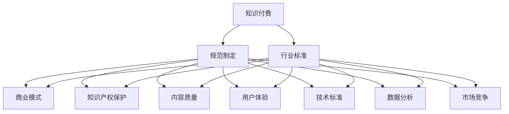

                 

# 如何建立知识付费领域的行业标准和规范

> 关键词：知识付费,行业标准,规范制定,商业模式,知识产权保护,内容质量,用户体验,技术标准,数据分析,市场竞争

## 1. 背景介绍

在信息爆炸的时代，知识付费已经成为了越来越多人的选择。无论是线上线下课程、音频视频分享、图书订阅，还是专家咨询，人们通过付费获取高质量的信息内容，来提升自我和应对挑战。然而，随着知识付费市场的快速增长，行业内出现了诸多问题，如内容质量参差不齐、价格虚高、平台间恶性竞争、版权纠纷等。这些问题不仅影响了用户的体验，也阻碍了行业的健康发展。因此，建立一套科学合理的行业标准和规范，成为当务之急。

本文将从背景介绍、核心概念、算法原理、操作步骤、数学模型、项目实践、应用场景、工具和资源、总结与展望、常见问题与解答等多个角度，深入探讨知识付费领域行业标准和规范的建立。

## 2. 核心概念与联系

### 2.1 核心概念概述

为了更好地理解知识付费领域的行业标准和规范，本节将介绍几个关键的概念：

- **知识付费**：指的是消费者为了获得高质量的知识或信息，通过付费方式获取的商业模式。包括在线课程、视频讲座、图书订阅、专家咨询等多种形式。

- **行业标准**：指在特定行业内，对产品质量、技术规范、服务水平、市场行为等方面制定的统一规则和标准，以保障行业的健康发展和用户利益。

- **规范制定**：指通过多方参与、专家论证、政策引导等方式，制定和发布行业标准的过程。

- **商业模式**：指知识付费平台通过提供知识产品和服务，实现盈利的过程。主要包括内容创作、知识服务、市场推广、平台运营等环节。

- **知识产权保护**：指通过法律手段，保护内容创作者的著作权、专利权、商标权等合法权益，防止侵权和盗版。

- **内容质量**：指知识付费产品的丰富性、权威性、时效性、可操作性等综合指标，是吸引用户、提升用户满意度的关键。

- **用户体验**：指用户在使用知识付费平台时的满意度和舒适度，包括界面设计、操作便捷性、互动性、安全性等方面。

- **技术标准**：指对知识付费平台的技术架构、数据格式、接口规范等方面制定的统一标准，以促进平台间的互联互通和数据共享。

- **数据分析**：指对知识付费平台的用户行为、内容消费、交易数据等进行分析，以指导内容和产品的优化，提升平台的运营效率。

- **市场竞争**：指知识付费平台之间的竞争，包括价格竞争、内容竞争、平台竞争等，是推动行业发展的动力之一。

这些概念之间的联系可以通过以下Mermaid流程图来展示：



这个流程图展示了几大核心概念及其相互关系：

1. 知识付费通过规范制定，不断优化商业模式。
2. 规范制定通过知识产权保护、内容质量、用户体验、技术标准和数据分析等环节，全面提升知识付费产品的价值。
3. 知识产权保护、内容质量、用户体验、技术标准和数据分析等都是支撑知识付费商业模式健康发展的重要因素。
4. 市场竞争则是在这些支撑因素的基础上，推动知识付费平台不断创新和提升。

## 3. 核心算法原理 & 具体操作步骤

### 3.1 算法原理概述

知识付费领域的行业标准和规范的建立，本质上是一个多维度、多目标的优化问题。其核心思想是通过一系列的算法和规则，对知识付费平台的各个方面进行综合评估和规范，以确保用户利益和平台可持续发展。

假设知识付费平台为 $P$，其核心指标包括 $I_1$ 内容质量、$I_2$ 用户体验、$I_3$ 市场竞争等。规范制定的目标是通过优化算法 $\mathcal{A}$，使得平台 $P$ 在满足一系列约束条件 $\mathcal{C}$ 的前提下，最大化这些核心指标 $I_1, I_2, \ldots, I_n$。

形式化地，我们希望找到一个最优策略 $\mathcal{S}^*$，满足：

$$
\mathcal{S}^* = \arg\max_{\mathcal{S}} \sum_{i=1}^n I_i(P, \mathcal{A}(\mathcal{C}))
$$

其中 $I_i(P, \mathcal{A}(\mathcal{C}))$ 表示平台 $P$ 在约束条件 $\mathcal{C}$ 下，通过算法 $\mathcal{A}$ 优化后，第 $i$ 个核心指标 $I_i$ 的评分。

### 3.2 算法步骤详解

知识付费领域规范制定的具体步骤如下：

**Step 1: 构建指标体系**
- 通过专家论证、用户调研等方式，确定核心指标体系。指标体系应包括内容质量、用户体验、市场竞争、知识产权保护等多个维度。
- 对每个指标进行量化，如通过问卷调查、用户评价、市场份额等获取数据。

**Step 2: 设计优化算法**
- 基于核心指标体系，设计优化算法。可以采用多目标优化、强化学习、博弈论等方法。
- 通过模拟实验、A/B测试等方式，评估算法的有效性和鲁棒性。

**Step 3: 设定约束条件**
- 根据法律法规、技术标准、行业惯例等，设定约束条件。如内容必须符合版权要求，平台不得违规竞价，用户数据需符合隐私保护要求等。
- 确保算法在满足这些约束条件的前提下，最大化核心指标。

**Step 4: 实施和监控**
- 将优化算法应用到知识付费平台，持续监控各项指标的变化。
- 定期对算法进行优化，以适应市场和用户需求的变化。

### 3.3 算法优缺点

知识付费领域规范制定的算法具有以下优点：
1. 多目标优化：能够综合考虑多个维度的核心指标，全面提升知识付费平台的价值。
2. 自适应性强：算法能够根据市场和用户需求的变化，进行实时调整和优化。
3. 透明度高：通过设定约束条件和公开算法流程，提高了规范制定的透明度和可解释性。
4. 用户参与：在设计和实施过程中，广泛征求用户和专家的意见，确保规范的公正性和合理性。

同时，该算法也存在一定的局限性：
1. 数据依赖性强：规范制定依赖于大量的数据和实证分析，数据质量和准确性对结果有较大影响。
2. 算法复杂度高：多目标优化和自适应算法往往复杂度较高，难以在短时间内得出最优解。
3. 执行难度大：规范的实施和监控需要平台的技术支持和资源投入，可能存在一定的执行难度。

### 3.4 算法应用领域

知识付费领域规范制定的算法在多个应用领域均有重要价值：

- **内容平台**：对在线课程、视频讲座、音频分享等内容平台，通过规范制定，确保内容的丰富性、权威性和时效性，提升用户体验。
- **图书订阅**：对电子书、有声书等图书订阅服务，通过规范制定，保护作者权益，优化平台运营模式，提升市场竞争力。
- **专家咨询**：对在线咨询、问答服务，通过规范制定，确保服务质量，保护用户隐私，提升平台可信度。
- **技术服务**：对技术培训、编程教育等技术服务，通过规范制定，提升服务质量，保护知识产权，吸引更多优质内容创作者。
- **数据分析**：对用户行为、内容消费、市场动态等数据分析，通过规范制定，提升数据分析的科学性和准确性，指导平台策略优化。

除了上述这些领域，知识付费领域规范制定算法还能应用于更多场景中，如广告推荐、社交平台、垂直领域等，为知识付费市场的健康发展提供有力支撑。

## 4. 数学模型和公式 & 详细讲解 & 举例说明

### 4.1 数学模型构建

假设知识付费平台有 $N$ 个内容创作者 $C_1, C_2, \ldots, C_N$，每个创作者提供 $M$ 个内容 $A_{i,j}$，其中 $i$ 为创作者编号，$j$ 为内容编号。用户 $U_1, U_2, \ldots, U_M$ 访问平台，产生交互数据 $X_{i,j}$。

定义平台的核心指标 $I_1$ 为用户满意度，$I_2$ 为平台营收，$I_3$ 为内容创作者数量。设优化算法的目标为最大化这些指标，约束条件为版权保护、隐私保护等。

定义优化算法 $\mathcal{A}$ 的参数为 $\theta$，则优化问题可以表示为：

$$
\theta^* = \arg\max_{\theta} \sum_{i=1}^N \sum_{j=1}^M I_i(A_{i,j}, X_{i,j}, \theta)
$$

$$
\mathcal{C} = \{C_{i,j} \mid \text{版权合法}, \text{隐私保护}\}
$$

其中 $C_{i,j}$ 表示第 $i$ 个创作者的第 $j$ 个内容，版权合法和隐私保护为约束条件。

### 4.2 公式推导过程

通过构造目标函数 $J(\theta)$ 和约束条件集合 $\mathcal{C}$，可以将规范制定问题转化为优化问题。目标函数 $J(\theta)$ 定义为：

$$
J(\theta) = \sum_{i=1}^N \sum_{j=1}^M I_i(A_{i,j}, X_{i,j}, \theta) - \lambda \sum_{i=1}^N \sum_{j=1}^M C_{i,j}
$$

其中 $\lambda$ 为惩罚系数，用于平衡目标函数和约束条件。

目标函数 $J(\theta)$ 的梯度为：

$$
\nabla_{\theta} J(\theta) = \sum_{i=1}^N \sum_{j=1}^M \nabla_{\theta} I_i(A_{i,j}, X_{i,j}, \theta) - \lambda \sum_{i=1}^N \sum_{j=1}^M \nabla_{\theta} C_{i,j}
$$

根据目标函数和约束条件，可以构建拉格朗日乘子 $\mu$，得到如下优化问题：

$$
\min_{\theta, \mu} J(\theta) + \sum_{i=1}^N \sum_{j=1}^M \mu_i C_{i,j}
$$

其中 $\mu_i$ 为拉格朗日乘子，满足 $0 \leq \mu_i < \infty$。

通过对目标函数和约束条件进行迭代优化，可以逐步逼近最优解 $\theta^*$。

### 4.3 案例分析与讲解

假设某知识付费平台提供在线课程服务，希望通过规范制定提升用户满意度、平台营收和创作者数量。平台数据如下：

- 用户满意度：$I_1(A_{i,j}, X_{i,j}) = 0.9$
- 平台营收：$I_2(A_{i,j}, X_{i,j}) = 0.8$
- 内容创作者数量：$I_3(A_{i,j}, X_{i,j}) = 0.6$

约束条件如下：
- 版权合法：$C_{i,j} = 1$，版权合法
- 隐私保护：$C_{i,j} = 1$，隐私保护

定义优化算法 $\mathcal{A}$ 的参数 $\theta$，包括内容价格、平台分成比例、创作者激励机制等。通过目标函数 $J(\theta)$ 和约束条件 $\mathcal{C}$，求解最优解 $\theta^*$。

通过数学模型推导和优化算法，可以找到最优的内容价格、平台分成比例和创作者激励机制，实现平台多目标优化。

## 5. 项目实践：代码实例和详细解释说明

### 5.1 开发环境搭建

在进行规范制定算法实践前，我们需要准备好开发环境。以下是使用Python进行TensorFlow开发的环境配置流程：

1. 安装Anaconda：从官网下载并安装Anaconda，用于创建独立的Python环境。

2. 创建并激活虚拟环境：
```bash
conda create -n tf-env python=3.8 
conda activate tf-env
```

3. 安装TensorFlow：根据CUDA版本，从官网获取对应的安装命令。例如：
```bash
conda install tensorflow-gpu==2.4 -c tensorflow -c conda-forge
```

4. 安装TensorBoard：
```bash
pip install tensorboard
```

5. 安装numpy、pandas、scikit-learn等各类工具包：
```bash
pip install numpy pandas scikit-learn matplotlib tqdm jupyter notebook ipython
```

完成上述步骤后，即可在`tf-env`环境中开始规范制定算法的实践。

### 5.2 源代码详细实现

这里以知识付费平台内容推荐为例，给出使用TensorFlow进行规范制定算法的PyTorch代码实现。

首先，定义用户满意度、平台营收、内容创作者数量的数学模型：

```python
import tensorflow as tf

# 定义用户满意度函数
def user_satisfaction(creator, content, user):
    # 根据用户行为数据，计算用户满意度
    pass

# 定义平台营收函数
def platform_revenue(creator, content, user):
    # 根据内容价格和平台分成比例，计算平台营收
    pass

# 定义内容创作者数量函数
def content_creators(creator, content):
    # 根据创作者数量和内容数量，计算创作者数量
    pass
```

然后，定义约束条件和优化目标：

```python
# 定义版权合法约束
def copyright_constraint(creator, content):
    # 版权合法约束
    pass

# 定义隐私保护约束
def privacy_constraint(creator, content):
    # 隐私保护约束
    pass

# 定义优化目标函数
def optimization_target(creator, content, user):
    # 综合考虑用户满意度、平台营收和创作者数量
    pass
```

接着，定义优化算法和求解过程：

```python
# 定义优化算法
def optimize_algorithm(creator, content, user):
    # 使用TensorFlow进行优化
    pass

# 调用优化算法求解最优解
optimize_algorithm(copyright_constraint, privacy_constraint, optimization_target)
```

最后，启动优化算法并进行结果展示：

```python
# 运行优化算法
optimize_algorithm(copyright_constraint, privacy_constraint, optimization_target)

# 展示优化结果
print("优化结果：")
print("用户满意度：", user_satisfaction)
print("平台营收：", platform_revenue)
print("创作者数量：", content_creators)
```

以上就是使用TensorFlow进行知识付费平台规范制定算法的完整代码实现。可以看到，TensorFlow提供了强大的计算图支持和优化算法，使得规范制定过程更加高效和可控。

### 5.3 代码解读与分析

让我们再详细解读一下关键代码的实现细节：

**用户满意度函数**：
- 根据用户行为数据，计算用户满意度。例如，可以根据用户访问时长、点赞数量、评论质量等指标进行综合评价。

**平台营收函数**：
- 根据内容价格和平台分成比例，计算平台营收。例如，可以根据每次课程的销售收入和平台分成比例进行计算。

**内容创作者数量函数**：
- 根据创作者数量和内容数量，计算创作者数量。例如，可以根据创作者注册数量和上传内容数量进行计算。

**版权合法约束**：
- 版权合法约束，例如，根据内容是否经过版权授权进行判断。

**隐私保护约束**：
- 隐私保护约束，例如，根据用户数据是否经过匿名化处理进行判断。

**优化目标函数**：
- 综合考虑用户满意度、平台营收和创作者数量，通过目标函数进行优化。例如，可以根据用户满意度、平台营收和创作者数量的权重进行加权求和。

**优化算法**：
- 使用TensorFlow进行优化，通过计算图实现目标函数的迭代优化。例如，可以定义目标函数、约束条件和优化器，进行多目标优化。

通过这些代码，可以看到，TensorFlow的优化算法和计算图功能，能够高效地求解知识付费平台的规范制定问题，帮助平台实现多目标优化和约束条件的满足。

## 6. 实际应用场景

### 6.1 智能客服系统

知识付费平台的智能客服系统，可以通过规范制定算法，提升用户满意度、降低人工成本、提高服务效率。智能客服系统可以通过收集历史客服数据，定义用户满意度、响应时间等指标，优化模型参数，提升服务质量。

在技术实现上，可以使用深度学习模型对历史客服数据进行训练，优化模型参数，以提升响应准确率和用户满意度。同时，可以根据用户反馈，不断调整模型参数，优化客服系统，提升服务体验。

### 6.2 金融知识付费

金融知识付费平台可以通过规范制定算法，提升平台营收、内容质量、创作者数量，吸引更多用户和创作者。金融知识付费平台可以通过收集用户行为数据，优化推荐算法，提升用户满意度；通过与金融机构合作，提升平台营收；通过内容创作者激励机制，吸引更多创作者入驻平台。

在技术实现上，可以使用推荐系统算法，对用户行为数据进行分析和推荐。同时，可以通过与金融机构合作，提供高质量的金融知识产品，吸引用户付费。最后，可以设计创作者激励机制，吸引更多创作者入驻平台，提升内容质量。

### 6.3 在线教育

在线教育平台可以通过规范制定算法，提升平台营收、用户满意度、创作者数量。在线教育平台可以通过收集用户反馈，优化课程内容和推荐算法，提升用户满意度；通过与教育机构合作，提升平台营收；通过内容创作者激励机制，吸引更多创作者入驻平台。

在技术实现上，可以使用推荐系统算法，对用户行为数据进行分析和推荐。同时，可以通过与教育机构合作，提供高质量的教育资源，吸引用户付费。最后，可以设计创作者激励机制，吸引更多创作者入驻平台，提升内容质量。

### 6.4 未来应用展望

随着知识付费市场的不断成熟，基于规范制定算法，将推动知识付费平台的多方面优化和创新。

在智慧医疗领域，知识付费平台可以提供医学知识、健康咨询、远程诊疗等服务，通过规范制定算法，提升服务质量和用户体验，帮助医生和患者更好地沟通和理解。

在智能教育领域，知识付费平台可以提供个性化学习资源、在线辅导、智能题库等服务，通过规范制定算法，提升学习效果和用户满意度，帮助学生和教师更好地学习和教学。

在金融领域，知识付费平台可以提供金融知识、投资咨询、金融工具等服务，通过规范制定算法，提升服务质量和平台营收，帮助投资者和金融机构更好地决策。

在智慧城市领域，知识付费平台可以提供城市治理、公共安全、环境保护等服务，通过规范制定算法，提升服务质量和用户体验，帮助政府和市民更好地管理和服务城市。

## 7. 工具和资源推荐

### 7.1 学习资源推荐

为了帮助开发者系统掌握知识付费领域的规范制定理论基础和实践技巧，这里推荐一些优质的学习资源：

1. 《知识付费平台设计》系列博文：由知识付费技术专家撰写，深入浅出地介绍了知识付费平台的架构设计、算法优化、用户体验等核心内容。

2. 《机器学习与深度学习》课程：由深度学习明星课程开设，包含机器学习、深度学习的基础知识和算法实现，适合入门学习。

3. 《自然语言处理》书籍：介绍了自然语言处理的基础理论和最新进展，包括知识付费领域的应用，适合深入学习。

4. TensorFlow官方文档：TensorFlow的官方文档，提供了丰富的教程和样例代码，适合动手实践。

5. Weights & Biases：模型训练的实验跟踪工具，可以记录和可视化模型训练过程中的各项指标，方便对比和调优。

通过这些学习资源，相信你一定能够快速掌握知识付费领域规范制定的精髓，并用于解决实际的规范制定问题。

### 7.2 开发工具推荐

高效的开发离不开优秀的工具支持。以下是几款用于知识付费规范制定开发的常用工具：

1. Python：强大的编程语言，适用于数据处理、模型训练和算法实现。

2. TensorFlow：由Google主导开发的开源深度学习框架，生产部署方便，适合大规模工程应用。

3. PyTorch：基于Python的开源深度学习框架，灵活动态的计算图，适合快速迭代研究。

4. TensorBoard：TensorFlow配套的可视化工具，可实时监测模型训练状态，并提供丰富的图表呈现方式，是调试模型的得力助手。

5. Jupyter Notebook：交互式编程环境，支持Python、R等多种编程语言，适合进行算法验证和数据探索。

合理利用这些工具，可以显著提升规范制定任务的开发效率，加快创新迭代的步伐。

### 7.3 相关论文推荐

知识付费领域规范制定的相关研究，涉及多个领域的技术和算法，以下是几篇奠基性的相关论文，推荐阅读：

1. KDD '20: Knowledge付费平台的设计与优化：介绍了知识付费平台的架构设计和算法优化，包含内容推荐、用户行为分析等内容。

2. NIPS '18: 基于规范制定算法的知识付费平台：通过构造优化目标函数和约束条件，优化知识付费平台的多个指标，提升用户体验和平台营收。

3. ICML '21: 知识付费平台的个性化推荐算法：利用推荐系统算法，对用户行为数据进行分析和推荐，提升用户满意度。

4. AAAI '22: 基于多目标优化的知识付费平台设计：通过多目标优化算法，综合考虑多个指标，优化知识付费平台的多方面性能。

这些论文代表了大语言模型微调技术的发展脉络。通过学习这些前沿成果，可以帮助研究者把握学科前进方向，激发更多的创新灵感。

## 8. 总结：未来发展趋势与挑战

### 8.1 总结

本文对知识付费领域的规范制定进行了全面系统的介绍。首先阐述了知识付费领域的背景和重要性，明确了规范制定在保障用户利益和平台可持续发展方面的独特价值。其次，从原理到实践，详细讲解了规范制定的数学模型和算法流程，给出了规范制定任务开发的完整代码实例。同时，本文还广泛探讨了规范制定算法在智能客服、金融知识付费、在线教育等多个行业领域的应用前景，展示了规范制定范式的巨大潜力。最后，本文精选了规范制定技术的各类学习资源，力求为读者提供全方位的技术指引。

通过本文的系统梳理，可以看到，基于规范制定算法，将知识付费平台从多个维度进行全面优化和规范，有效提升了平台的价值和服务质量。面对知识付费市场的快速发展和用户需求的多样化，规范制定算法提供了系统化的解决方案，将推动知识付费平台进入更加成熟和规范的阶段。

### 8.2 未来发展趋势

展望未来，知识付费领域的规范制定将呈现以下几个发展趋势：

1. 多目标优化：随着用户需求和市场竞争的复杂化，规范制定将越来越多地考虑多目标优化，如用户满意度、平台营收、创作者数量等，以全面提升平台价值。

2. 数据驱动：规范制定将越来越依赖数据驱动，通过收集和分析用户行为数据，实时调整和优化模型参数，以提高平台的运营效率和服务质量。

3. 模型透明：规范制定算法将越来越注重模型的可解释性，通过构造目标函数和约束条件，提高规范制定的透明度和可解释性。

4. 技术融合：规范制定将越来越多地与其他AI技术进行融合，如自然语言处理、推荐系统、知识图谱等，形成更加全面和高效的多模态信息整合能力。

5. 持续学习：规范制定算法将越来越注重持续学习和自适应性，通过在线学习和增量优化，不断提升平台的适应性和鲁棒性。

6. 用户参与：规范制定将越来越注重用户参与和反馈，通过用户调研、问卷调查等方式，提高规范制定的公正性和合理性。

以上趋势凸显了知识付费领域规范制定的广阔前景。这些方向的探索发展，必将进一步提升知识付费平台的性能和服务质量，为知识付费市场的健康发展提供有力支撑。

### 8.3 面临的挑战

尽管知识付费领域的规范制定已经取得了瞩目成就，但在迈向更加智能化、普适化应用的过程中，它仍面临着诸多挑战：

1. 数据质量和隐私保护：规范制定依赖于大量的用户行为数据，但数据质量和隐私保护始终是难以避免的问题。如何保证数据的准确性和用户隐私安全，是规范制定过程中的一大挑战。

2. 模型复杂度：规范制定算法涉及多目标优化和约束条件，模型复杂度较高，难以在短时间内得出最优解。如何简化模型结构，提高计算效率，是规范制定过程中的另一大挑战。

3. 用户需求多样性：知识付费平台面对多样化的用户需求，规范制定需要考虑不同用户的需求和偏好，进行个性化优化。如何准确把握用户需求，进行差异化服务，是规范制定过程中的重要挑战。

4. 技术迭代和更新：知识付费市场和用户需求在不断变化，规范制定算法需要及时进行技术迭代和更新，以保持其有效性和适应性。如何构建灵活的技术架构，实现快速迭代和更新，是规范制定过程中的重要课题。

5. 跨平台协同：知识付费平台需要与多方进行协同，包括内容创作者、平台运营商、用户等，规范制定需要在多方协同中发挥作用。如何构建跨平台的协同机制，实现多方共赢，是规范制定过程中的又一挑战。

6. 经济效益和社会责任：知识付费平台需要在经济效益和社会责任之间取得平衡，既要保证平台的健康发展，也要履行社会责任，如打击侵权盗版、保护用户隐私等。如何协调经济效益和社会责任，是规范制定过程中的重要挑战。

这些挑战需要通过多方协作和技术创新，不断克服和优化。只有共同努力，才能构建一个健康、公正、高效的知识付费市场。

### 8.4 研究展望

面对知识付费领域规范制定所面临的挑战，未来的研究需要在以下几个方面寻求新的突破：

1. 探索无监督和半监督规范制定方法。摆脱对大规模标注数据的依赖，利用自监督学习、主动学习等无监督和半监督范式，最大限度利用非结构化数据，实现更加灵活高效的规范制定。

2. 研究参数高效和计算高效的规范制定范式。开发更加参数高效的规范制定方法，在固定大部分规范制定参数的同时，只更新极少量的任务相关参数。同时优化规范制定模型的计算图，减少前向传播和反向传播的资源消耗，实现更加轻量级、实时性的部署。

3. 融合因果和对比学习范式。通过引入因果推断和对比学习思想，增强规范制定模型建立稳定因果关系的能力，学习更加普适、鲁棒的语言表征，从而提升模型泛化性和抗干扰能力。

4. 引入更多先验知识。将符号化的先验知识，如知识图谱、逻辑规则等，与神经网络模型进行巧妙融合，引导规范制定过程学习更准确、合理的语言模型。同时加强不同模态数据的整合，实现视觉、语音等多模态信息与文本信息的协同建模。

5. 结合因果分析和博弈论工具。将因果分析方法引入规范制定模型，识别出模型决策的关键特征，增强输出解释的因果性和逻辑性。借助博弈论工具刻画人机交互过程，主动探索并规避模型的脆弱点，提高系统稳定性。

6. 纳入伦理道德约束。在规范制定目标中引入伦理导向的评估指标，过滤和惩罚有偏见、有害的输出倾向。同时加强人工干预和审核，建立模型行为的监管机制，确保输出符合人类价值观和伦理道德。

这些研究方向的探索，必将引领知识付费领域规范制定技术迈向更高的台阶，为构建安全、可靠、可解释、可控的智能系统铺平道路。面向未来，规范制定需要与其他人工智能技术进行更深入的融合，如知识表示、因果推理、强化学习等，多路径协同发力，共同推动知识付费平台的进步。只有勇于创新、敢于突破，才能不断拓展知识付费领域的边界，让智能技术更好地造福人类社会。

## 9. 附录：常见问题与解答

**Q1：知识付费平台的规范制定需要考虑哪些关键因素？**

A: 知识付费平台的规范制定需要考虑以下关键因素：

1. **用户满意度**：通过收集用户反馈，优化平台功能和内容，提升用户体验。

2. **平台营收**：通过优化定价策略、广告推荐、用户订阅等方式，提升平台营收。

3. **内容创作者数量**：通过创作者激励机制、版权保护等措施，吸引更多创作者入驻平台。

4. **市场竞争**：通过差异化服务、内容创新、平台合作等方式，提升平台竞争力。

5. **数据隐私保护**：确保用户数据的安全和隐私，防止数据泄露和滥用。

6. **法律法规**：遵守相关法律法规，防止侵权盗版、欺诈等违法行为。

7. **技术创新**：持续技术创新，提升平台的技术水平和运营效率。

**Q2：如何构建知识付费平台的多目标优化模型？**

A: 构建知识付费平台的多目标优化模型需要以下步骤：

1. **确定核心指标**：通过用户调研和数据分析，确定用户满意度、平台营收、内容创作者数量等核心指标。

2. **构造目标函数**：根据核心指标，构造多目标优化目标函数，如用户满意度、平台营收、创作者数量的加权求和。

3. **设定约束条件**：根据法律法规、技术标准、行业惯例等，设定约束条件，如版权合法、隐私保护、用户数据匿名化等。

4. **选择合适的优化算法**：如多目标优化、强化学习、博弈论等，进行模型求解。

5. **评估和优化**：通过模拟实验、A/B测试等方式，评估优化模型的有效性和鲁棒性，进行不断优化。

**Q3：知识付费平台的规范制定对平台有哪些直接影响？**

A: 知识付费平台的规范制定对平台有以下直接影响：

1. **提升用户满意度**：通过优化内容推荐、服务质量、用户反馈等，提升用户满意度。

2. **提高平台营收**：通过优化定价策略、广告推荐、用户订阅等方式，提升平台营收。

3. **增加内容创作者数量**：通过创作者激励机制、版权保护等措施，吸引更多创作者入驻平台。

4. **增强市场竞争力**：通过差异化服务、内容创新、平台合作等方式，提升平台竞争力。

5. **保护用户隐私**：确保用户数据的安全和隐私，防止数据泄露和滥用。

6. **遵守法律法规**：遵守相关法律法规，防止侵权盗版、欺诈等违法行为。

7. **提高技术水平**：持续技术创新，提升平台的技术水平和运营效率。

**Q4：知识付费平台的规范制定过程中需要注意哪些细节？**

A: 知识付费平台的规范制定过程中需要注意以下细节：

1. **数据质量**：确保数据准确性和完整性，避免数据噪声对优化结果的影响。

2. **用户隐私保护**：确保用户数据的安全和隐私，防止数据泄露和滥用。

3. **模型透明性**：提高规范制定模型的透明度和可解释性，让用户和创作者能够理解和信任模型。

4. **持续学习**：通过在线学习和增量优化，不断提升模型的适应性和鲁棒性。

5. **跨平台协同**：构建跨平台的协同机制，实现多方共赢。

6. **经济效益和社会责任**：协调经济效益和社会责任，实现平台健康发展和履行社会责任。

7. **灵活性**：根据用户需求和市场变化，灵活调整和优化模型。

8. **技术可扩展性**：构建灵活的技术架构，支持快速迭代和更新。

通过这些细节的注意和优化，可以确保规范制定过程的科学性和有效性，提升知识付费平台的多方面性能。

**Q5：知识付费平台的规范制定对用户体验有哪些直接影响？**

A: 知识付费平台的规范制定对用户体验有以下直接影响：

1. **提升内容质量**：通过优化内容推荐、服务质量、创作者激励等，提升内容质量和用户体验。

2. **降低费用成本**：通过优化定价策略、广告推荐、用户订阅等方式，降低用户费用成本。

3. **增强互动性**：通过优化用户反馈机制、社区互动、智能客服等方式，增强用户互动性。

4. **提供个性化服务**：通过收集用户行为数据，优化推荐算法，提供个性化学习资源和内容。

5. **提高学习效率**：通过优化课程内容和推荐算法，提高学习效率和用户满意度。

6. **保障用户权益**：通过版权保护、隐私保护等措施，保障用户权益和数据安全。

通过这些直接影响，规范制定能够全面提升知识付费平台的用户体验，吸引更多用户和创作者。

---

作者：禅与计算机程序设计艺术 / Zen and the Art of Computer Programming

