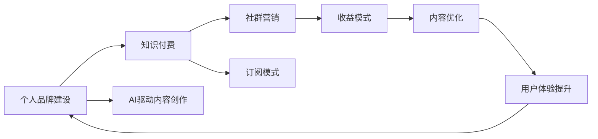

                 

# 如何打造个人知识付费品牌

> 关键词：知识付费、个人品牌建设、AI驱动内容创作、社群营销、订阅模式、收益模式、内容优化、用户体验提升

## 1. 背景介绍

### 1.1 问题由来
随着知识经济的兴起，个人知识付费品牌逐渐成为互联网时代的一个重要趋势。优秀的个人品牌不仅能够提升个人影响力，还能在知识变现中创造巨大的商业价值。尤其在AI、大数据、区块链等前沿技术迅猛发展的当下，个人品牌可以借助技术手段，精准定位目标受众，实现内容与价值的双飞跃。

然而，打造个人知识付费品牌并非易事。内容创作、社群运营、收益管理等环节都需要精心策划与运营。本文将深入分析这些核心环节，并结合最新的AI技术，探讨如何构建一套高效、可持续的个人知识付费品牌体系。

## 2. 核心概念与联系

### 2.1 核心概念概述

- **个人品牌建设**：指通过一系列策略和行动，塑造个人在特定领域的知名度和美誉度，从而在受众心中占据特定位置的过程。
- **知识付费**：指消费者为获取有价值的信息、知识和经验，而向内容创作者支付费用的行为。
- **AI驱动内容创作**：利用AI技术，如自然语言处理、图像识别、数据挖掘等，辅助内容创作和个性化推荐，提升内容质量与用户体验。
- **社群营销**：通过构建社群平台，进行内容分享、互动讨论、用户反馈收集等，提升用户黏性，扩大品牌影响力。
- **订阅模式**：用户以固定周期支付费用，获取持续更新的内容和服务，实现长期价值回馈的商业模式。
- **收益模式**：包括单次付费、会员付费、广告分成、赞助等多种方式，确保品牌可持续发展。

这些核心概念之间相互关联，共同构成了个人知识付费品牌的生态系统。

### 2.2 核心概念原理和架构的 Mermaid 流程图



这个流程图展示了各个概念之间的相互联系：

1. **个人品牌建设**：基础，塑造品牌形象，吸引用户关注。
2. **知识付费**：核心，实现价值变现，支持品牌运营。
3. **AI驱动内容创作**：辅助，提升内容质量，增强用户体验。
4. **社群营销**：互动，增强用户黏性，扩大品牌影响力。
5. **订阅模式**：渠道，确保稳定收入，支持长期运营。
6. **收益模式**：手段，实现商业化，支持品牌成长。
7. **内容优化**：反馈，提升内容质量，增强用户满意度。
8. **用户体验提升**：循环，持续改进，形成良性循环。

## 3. 核心算法原理 & 具体操作步骤

### 3.1 算法原理概述

个人知识付费品牌的核心算法原理可以概括为“内容+社群+订阅+收益”的闭环模型。该模型通过精准定位目标受众、高效创作与分发内容、建立社群互动、设计多元收益模式，实现品牌持续增长。

### 3.2 算法步骤详解

**Step 1: 定位目标受众**
- 分析受众兴趣和需求，制定细分市场策略。
- 利用AI分析用户行为数据，识别目标用户特征。
- 设计精准的用户画像，以指导内容创作和营销策略。

**Step 2: AI驱动内容创作**
- 利用自然语言处理技术，自动生成高质量文章、报告等文本内容。
- 应用图像识别技术，制作高价值的图片、视频、图表等视觉内容。
- 利用数据挖掘技术，提炼有深度的洞察与分析。
- 进行内容个性化推荐，提升用户体验。

**Step 3: 社群互动**
- 创建专业社群平台，如微信群、QQ群、社区论坛等。
- 发布优质内容，引导用户参与讨论和分享。
- 定期举办线上线下活动，增强用户黏性。
- 收集用户反馈，调整内容策略。

**Step 4: 订阅模式设计**
- 设计灵活的订阅周期和价格策略。
- 提供丰富多样的内容模块和增值服务。
- 采用自动化平台，简化订阅流程。
- 实现内容自动更新与推送。

**Step 5: 收益模式优化**
- 探索多样化的收益渠道，如会员付费、单次付费、广告分成等。
- 利用数据挖掘技术，精准投放广告，提升转化率。
- 与品牌合作，进行联合推广。
- 监测收益数据，优化收益策略。

**Step 6: 内容优化与用户体验提升**
- 分析用户反馈，识别内容优化点。
- 利用AI进行内容质量评估和改进。
- 定期迭代和更新内容模块，保持新鲜感。
- 提升平台界面设计和互动体验，增强用户满意度。

### 3.3 算法优缺点

**优点：**
- **高效精准**：AI技术可以大幅提升内容创作和用户定位的效率与精度。
- **持续增长**：订阅模式和多元收益策略确保品牌持续增长。
- **用户黏性**：社群互动增强用户黏性，提升用户忠诚度。

**缺点：**
- **内容同质化**：缺乏差异化内容可能面临用户流失。
- **社群管理复杂**：需要大量时间和资源投入社群维护。
- **收益模式单一**：过度依赖订阅可能限制品牌增长。

### 3.4 算法应用领域

个人知识付费品牌的应用领域广泛，包括但不限于以下几个方面：

- **在线教育**：教育内容创作者可以通过知识付费模式，实现专业知识的商业化。
- **职场培训**：职场人士通过订阅专业课程，提升技能和职业素养。
- **健康管理**：健康专家提供定制化健康管理服务，用户按需订阅。
- **个人理财**：财经专家提供投资理财建议，用户付费获取。
- **技术研发**：技术博主提供编程技巧、工具使用教程，用户按需订阅。
- **艺术创作**：艺术家提供作品解读、创作过程分享，用户付费获取。

## 4. 数学模型和公式 & 详细讲解 & 举例说明

### 4.1 数学模型构建

我们以知识付费订阅模式为例，构建数学模型。假设订阅用户数为 $N$，单月订阅价格为 $P$，每年订阅周期内用户平均订阅月数为 $M$，平台固定成本为 $C_0$，内容生产成本为 $C_1$，则每月收益为：

$$
R = N \times P \times M - C_0 - C_1 \times M
$$

### 4.2 公式推导过程

对于订阅模式，收益最大化的问题可以转化为求解用户数 $N$ 和价格 $P$ 的最优组合，以最大化每月收益 $R$。我们假设用户增长率为 $\gamma$，即每月的订阅用户数可以表示为 $N(t) = N_0 e^{\gamma t}$，其中 $N_0$ 为初始用户数，$t$ 为时间。

将用户数代入收益公式，可以得到：

$$
R(t) = N_0 e^{\gamma t} \times P \times M - C_0 - C_1 \times M
$$

为了最大化 $R(t)$，我们需要对 $P$ 和 $\gamma$ 进行优化。具体而言，可以通过试错法或模拟退火算法找到最优的 $P$ 和 $\gamma$。

### 4.3 案例分析与讲解

以在线教育平台为例，我们假设平台初始用户数为1000，每月的用户增长率为1%，每月订阅价格为100元，每年订阅周期内用户平均订阅月数为6个月。平台固定成本为100万元，内容生产成本为每月50万元。则每月收益为：

$$
R = 1000 \times 100 \times 0.6 - 1000000 - 500000 \times 0.6 = -20万元
$$

显然，这种定价和增长策略无法实现盈利。通过调整订阅价格和用户增长率，可以找到一个最优组合，实现每月收益的最大化。例如，将价格调整为150元，用户增长率调整为2%，则每月收益为：

$$
R = 1000 \times 150 \times 0.6 - 1000000 - 500000 \times 0.6 = 30万元
$$

## 5. 项目实践：代码实例和详细解释说明

### 5.1 开发环境搭建

**Step 1: 准备开发工具**
- 安装Python环境：Anaconda或Miniconda，创建虚拟环境。
- 安装相关库：Flask、PyTorch、TensorFlow、Numpy等。

**Step 2: 搭建后端API**
- 使用Flask框架搭建Web后端API。
- 设计API接口，实现内容发布、订阅管理、收益统计等功能。

**Step 3: 搭建前端页面**
- 使用Vue.js、React.js等前端框架，设计UI/UX。
- 集成后端API，实现内容展示、互动、订阅等功能。

### 5.2 源代码详细实现

以下是Python后端API的基本实现：

```python
from flask import Flask, request, jsonify

app = Flask(__name__)

# 定义内容发布接口
@app.route('/content/publish', methods=['POST'])
def publish_content():
    title = request.json.get('title')
    description = request.json.get('description')
    category = request.json.get('category')
    user_id = request.json.get('user_id')
    # 调用AI工具生成内容
    content = generate_content(title, description, category)
    # 保存内容至数据库
    save_content(content, user_id)
    return jsonify({'success': True, 'message': '内容发布成功'})

# 定义订阅管理接口
@app.route('/subscription', methods=['POST'])
def subscribe():
    user_id = request.json.get('user_id')
    plan = request.json.get('plan')
    # 验证用户订阅状态
    if user_id in users:
        user = users[user_id]
        if user['subscribed']:
            return jsonify({'success': False, 'message': '已订阅'})

    # 验证订阅价格和周期
    plan_price = PLANS.get(plan)
    if plan_price is None:
        return jsonify({'success': False, 'message': '无效订阅计划'})

    # 更新用户订阅状态
    user['subscribed'] = True
    user['subscription_period'] = period
    user['subscription_price'] = plan_price
    save_user(user_id, user)

    return jsonify({'success': True, 'message': '订阅成功'})

# 定义收益统计接口
@app.route('/income', methods=['GET'])
def income():
    # 从数据库中获取订阅用户和收益数据
    subscribers = get_subscribers()
    income = 0
    for user in subscribers:
        plan_price = PLANS[user['plan']]
        if user['subscribed']:
            income += plan_price
        else:
            income += PLANS[user['plan']] * (user['subscription_period'] / 12)
    return jsonify({'income': income})
```

### 5.3 代码解读与分析

** publish_content 接口**：
- 接收前端请求，获取文章标题、描述、类别和用户ID。
- 调用AI工具生成内容，并保存到数据库。

** subscribe 接口**：
- 接收前端请求，获取用户ID和订阅计划。
- 验证用户是否已订阅，并更新订阅状态。

** income 接口**：
- 从数据库中获取订阅用户和收益数据。
- 根据订阅计划和周期，计算月收入。

## 6. 实际应用场景

### 6.1 在线教育平台

在线教育平台可以通过个人知识付费品牌模式，提供专业课程、讲座等高质量内容，吸引学生和专业人士订阅。例如，一个AI专家可以通过订阅模式，向用户提供深度学习课程、数据分析工具使用教程等，用户支付费用获取内容。平台可以设计灵活的订阅周期和价格策略，如单月订阅、年度订阅、无限次订阅等，以适应不同用户的需求。

### 6.2 健康管理应用

健康管理应用可以提供个性化的健康管理方案，通过订阅模式向用户提供健康建议、运动指导、营养计划等。专家可以通过订阅模式，向用户提供定制化的健康管理服务，用户按需订阅。例如，用户可以选择月度或年度订阅，获取健康专家提供的个性化健康报告和建议。

### 6.3 技术博客

技术博客可以通过知识付费模式，向开发者和技术人员提供高质量的技术文章、项目教程、工具推荐等。作者可以通过订阅模式，向用户提供独家文章和资源，用户按需订阅。例如，用户可以选择月度或年度订阅，获取博主提供的最新技术资讯和深度分析文章。

### 6.4 未来应用展望

随着AI技术和数据科学的发展，个人知识付费品牌将进一步拓展应用场景。未来的发展趋势包括：

- **多模态内容创作**：结合图像、视频、音频等多模态数据，提供更丰富的内容形式。
- **智能推荐系统**：利用AI算法，进行内容个性化推荐，提升用户体验。
- **区块链技术**：利用区块链技术，确保内容的原创性和用户权益，提升品牌信任度。
- **虚拟现实和增强现实**：结合VR/AR技术，提供沉浸式学习体验，提升用户参与度。
- **大数据分析**：利用大数据技术，进行用户行为分析和市场预测，优化订阅策略。

## 7. 工具和资源推荐

### 7.1 学习资源推荐

1. **《AI内容营销手册》**：深入讲解AI驱动内容创作的原理和实践，适合内容创作者阅读。
2. **《Flask Web开发实战》**：详细介绍Flask框架的使用，适合Web开发者学习。
3. **《Python网络爬虫实战》**：介绍网络爬虫技术，适合数据收集和处理需求。
4. **《数据科学入门》**：讲解数据科学基础知识，适合初学者了解。
5. **《区块链基础》**：介绍区块链技术的基础知识，适合对区块链感兴趣的用户阅读。

### 7.2 开发工具推荐

1. **Flask**：轻量级Web框架，适合快速开发API接口。
2. **TensorFlow**：深度学习框架，适合AI驱动内容创作。
3. **Vue.js/React.js**：前端框架，适合搭建动态交互式页面。
4. **PyTorch**：深度学习框架，适合AI模型训练。
5. **Anaconda/Miniconda**：Python环境管理工具，适合创建虚拟环境。

### 7.3 相关论文推荐

1. **《深度学习与自然语言处理》**：介绍深度学习在NLP中的应用，适合了解前沿技术。
2. **《AI内容营销的挑战与机遇》**：探讨AI内容营销的挑战和未来发展方向。
3. **《区块链技术的未来》**：预测区块链技术的发展趋势，适合了解新兴技术。
4. **《自然语言处理中的数据增强技术》**：介绍数据增强在NLP中的应用，适合了解数据增强方法。
5. **《用户行为分析的理论与实践》**：讲解用户行为分析的原理和实践，适合了解市场预测方法。

## 8. 总结：未来发展趋势与挑战

### 8.1 研究成果总结

本文详细探讨了个人知识付费品牌的构建方法，从内容创作、社群运营、订阅模式和收益优化等方面，提供了一套全面的策略和方法。通过AI技术，提高了内容创作和用户定位的效率，增强了用户黏性，确保了品牌的持续增长。

### 8.2 未来发展趋势

未来，个人知识付费品牌将更加智能化、个性化、多样化。AI技术将进一步提升内容创作和用户互动的效率，区块链技术将保障内容的原创性和用户权益，大数据技术将优化订阅策略和市场预测。

### 8.3 面临的挑战

尽管个人知识付费品牌有广阔的发展前景，但仍面临诸多挑战：

1. **内容同质化**：缺乏差异化内容可能面临用户流失。
2. **社群管理复杂**：需要大量时间和资源投入社群维护。
3. **收益模式单一**：过度依赖订阅可能限制品牌增长。
4. **技术瓶颈**：AI和区块链技术的普及和应用需要时间和资金投入。
5. **市场竞争激烈**：个人品牌需要在众多竞争者中脱颖而出。

### 8.4 研究展望

未来研究应重点关注以下几个方面：

1. **内容创新**：开发更具创意和差异化内容的生成方法。
2. **社群运营**：建立更高效、互动性更强的社群平台。
3. **收益模式多样化**：探索多样化的收益渠道和策略。
4. **技术融合**：将AI、区块链、大数据等技术进行深度融合，提升品牌竞争力。
5. **用户体验提升**：优化平台设计，提升用户满意度和忠诚度。

总之，个人知识付费品牌是一个充满机遇和挑战的领域。通过不断创新和优化，我们相信将打造出更多具有影响力和价值的品牌，为知识经济的发展贡献力量。

## 9. 附录：常见问题与解答

**Q1：个人知识付费品牌如何确保内容的原创性和版权？**

A: 利用区块链技术，记录内容的创作时间和作者信息，确保内容的原创性。同时，设置合理的版权保护机制，如版权声明、数字水印等，保护作者的知识产权。

**Q2：如何吸引用户订阅和提高用户黏性？**

A: 提供高质量、有价值的内容，满足用户需求。建立良好的用户互动机制，如评论、点赞、分享等，增强用户参与感。定期举办线上线下活动，如问答、直播、沙龙等，增强用户黏性。

**Q3：如何通过数据分析优化收益策略？**

A: 利用大数据技术，收集用户行为数据，如访问次数、订阅时间、购买频率等，进行市场分析和用户画像。根据分析结果，优化订阅价格、周期和推广策略，提升收益效果。

**Q4：如何应对市场竞争？**

A: 明确品牌定位，突出自身特色和优势。建立良好的品牌口碑，通过用户推荐、社交媒体宣传等方式提升品牌影响力。持续创新和优化，保持品牌活力和竞争力。

**Q5：如何提升用户体验？**

A: 优化平台设计和功能，提升内容的易用性和可读性。设计交互性强的用户体验，如智能推荐、个性化展示等，提升用户满意度。建立用户反馈机制，及时收集和响应用户意见，持续改进。

---

作者：禅与计算机程序设计艺术 / Zen and the Art of Computer Programming

