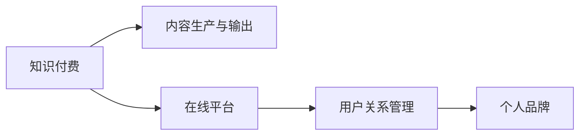

                 

# 如何打造个人知识付费商业帝国

## 1. 背景介绍

### 1.1 问题由来
随着互联网技术的发展和在线教育的兴起，知识付费逐渐成为一种新的消费模式。在“知识为王”的时代，如何打造个人知识付费商业帝国，成为了广大知识工作者和创业者热切关注的问题。

### 1.2 问题核心关键点
如何打造个人知识付费商业帝国，其核心关键点包括以下几个方面：
1. **构建知识品牌**：明确自己的知识专长和定位，构建有影响力的知识品牌，吸引目标客户群体。
2. **内容生产与输出**：生产高质量的内容，持续输出有价值的知识，以满足客户需求。
3. **渠道建设与运营**：选择适合的在线平台进行知识付费，并有效运营这些渠道，扩大市场影响力。
4. **用户关系管理**：建立与用户之间的良好互动关系，提升用户满意度和忠诚度。
5. **持续创新与优化**：不断更新知识产品，优化教学方法和用户体验，保持竞争优势。

### 1.3 问题研究意义
打造个人知识付费商业帝国，不仅可以帮助知识工作者实现个人价值，还可以通过知识传播促进社会的知识共享与进步。它具有以下重要意义：
1. **实现个人价值**：通过知识付费，知识工作者可以获得稳定的收入来源，实现个人价值的最大化。
2. **推动知识传播**：知识付费能够鼓励更多的专业人士分享知识和经验，促进知识的广泛传播。
3. **促进教育公平**：通过付费模式，可以吸引更多的资源投入在线教育，缩小教育资源的不平等。
4. **激发创新能力**：持续的知识输出和互动交流，可以激发个人的创新能力和问题解决能力，推动技术进步和社会发展。

## 2. 核心概念与联系

### 2.1 核心概念概述

为了更好地理解如何打造个人知识付费商业帝国，本节将介绍几个密切相关的核心概念：

- **知识付费**：通过付费方式获取有价值的知识和服务，包括在线课程、电子书、咨询等。知识付费模式能够更好地激励知识生产，提升知识传播的效率。
- **个人品牌**：通过个人在特定领域的专业知识和独特见解，建立有影响力的品牌形象。个人品牌是知识工作者在市场中竞争的关键。
- **内容生产与输出**：生产高质量的、有价值的知识内容，如课程、文章、视频等，并通过多种渠道传递给用户。
- **在线平台**：包括各大知识付费平台、自建网站、社交媒体等，是知识工作者与用户进行互动的主要渠道。
- **用户关系管理**：通过社交互动、课程反馈、个性化服务等方式，建立和维护与用户之间的关系，提升用户满意度和忠诚度。

### 2.2 核心概念原理和架构的 Mermaid 流程图



这个流程图展示了个体知识付费系统的核心概念及其之间的关系：

1. **知识付费**：是整个系统的起点，提供有价值的知识和服务。
2. **内容生产与输出**：将知识内容制作成课程、文章、视频等形式，并通过在线平台传递给用户。
3. **在线平台**：作为知识工作者与用户互动的主要渠道，需提供稳定、高效、友好的用户体验。
4. **用户关系管理**：通过互动和反馈，提升用户满意度和忠诚度，推动知识付费模式的发展。
5. **个人品牌**：是整个系统的终点，通过持续输出高质量内容，建立和提升个人品牌形象。

## 3. 核心算法原理 & 具体操作步骤

### 3.1 算法原理概述

打造个人知识付费商业帝国，本质上是一个复杂的系统工程，涉及多个核心组件和流程。其核心算法原理包括：

- **知识内容推荐算法**：根据用户的兴趣和行为数据，推荐有价值的课程和内容。
- **用户行为分析算法**：分析用户的观看、互动和付费行为，优化内容生产和平台运营策略。
- **个性化推荐系统**：根据用户的历史行为和偏好，提供个性化内容推荐，提升用户体验。
- **流量预测与营销算法**：预测课程的访问量和销售量，制定有效的营销策略，提升销售转化率。

### 3.2 算法步骤详解

打造个人知识付费商业帝国的详细步骤包括：

**Step 1: 确定知识专长和品牌定位**
- 分析自己的优势和兴趣领域，确定知识专长。
- 研究目标客户群体，定位自己的知识品牌形象。

**Step 2: 生产和输出高质量内容**
- 设计和制作高质量的课程、文章、视频等知识产品。
- 在平台上发布内容，并通过多种渠道进行推广。

**Step 3: 选择在线平台和渠道建设**
- 选择合适的在线平台，如知识付费网站、社交媒体等。
- 根据平台特点和用户需求，进行渠道建设和优化。

**Step 4: 用户关系管理和互动**
- 建立与用户之间的良好互动关系，收集用户反馈。
- 根据反馈优化课程内容和运营策略。

**Step 5: 持续创新与优化**
- 不断更新知识产品，优化教学方法和用户体验。
- 持续关注行业动态，保持创新能力。

### 3.3 算法优缺点

打造个人知识付费商业帝国，具有以下优点：
1. **高效变现**：通过在线课程、电子书等形式，知识工作者可以获得稳定的收入来源。
2. **提升知名度**：建立有影响力的个人品牌，提升市场知名度和影响力。
3. **推动知识传播**：鼓励更多的专业人士分享知识和经验，促进知识的广泛传播。
4. **灵活性强**：在线平台提供了灵活的运营模式，可以随时根据市场需求进行调整。

但同时也存在一些缺点：
1. **竞争激烈**：随着知识付费市场的迅速发展，竞争变得越来越激烈。
2. **内容质量要求高**：需要持续生产高质量的内容，以满足用户需求。
3. **运营成本高**：平台建设和维护需要投入大量资金和人力。
4. **用户管理复杂**：需要建立有效的用户关系管理机制，提升用户满意度和忠诚度。

### 3.4 算法应用领域

打造个人知识付费商业帝国的应用领域广泛，主要包括以下几个方面：

- **教育培训**：通过在线课程、视频讲座等形式，提供各类学科的教育培训内容。
- **专业咨询**：提供行业分析、项目管理、人力资源等方面的专业咨询服务。
- **技术分享**：分享技术领域的最新进展、开发经验等，帮助技术工作者提升技能。
- **健康管理**：提供健康饮食、运动健身、心理调适等方面的知识服务。
- **职业规划**：提供职业发展、简历优化、面试技巧等方面的指导和建议。

## 4. 数学模型和公式 & 详细讲解

### 4.1 数学模型构建

打造个人知识付费商业帝国，涉及到多个数学模型的构建，包括：

- **用户行为模型**：分析用户的行为数据，如观看时长、互动频率等，以预测用户兴趣和需求。
- **课程推荐模型**：根据用户的历史行为和兴趣，推荐相关课程和内容。
- **销售预测模型**：预测课程的销售量和用户购买行为，制定营销策略。

### 4.2 公式推导过程

以下我们以用户行为模型为例，推导其数学公式：

假设用户i在平台上的行为数据为$x_i=(x_{i1}, x_{i2}, \ldots, x_{im})$，其中$x_{ij}$表示用户在课程j上的观看时长、互动次数等行为特征。平台上的所有课程为$C=(c_1, c_2, \ldots, c_n)$。用户行为矩阵为$X=[x_{ij}]_{n\times m}$。

用户对课程j的评分$y_j$表示用户对课程的兴趣和满意度。构建用户行为模型为：

$$
y_j = f(x_j) = w_j^Tx_i + b_j
$$

其中$w_j=(w_{j1}, w_{j2}, \ldots, w_{jm})$为课程j的权重向量，$b_j$为偏置项。$w_j$可以通过矩阵分解、协同过滤等方法进行求解。

### 4.3 案例分析与讲解

以在线教育平台Udemy为例，其知识付费模型如下：

1. **用户行为数据收集**：Udemy通过平台记录用户的观看时长、购买行为、互动次数等数据。
2. **用户行为模型构建**：Udemy使用协同过滤算法，分析用户的行为数据，构建用户行为矩阵$X$。
3. **课程推荐**：根据用户的行为数据，通过矩阵分解算法求解权重向量$w_j$，推荐相关课程。
4. **销售预测**：使用回归分析模型，预测课程的销售量和用户购买行为，制定营销策略。

## 5. 项目实践：代码实例和详细解释说明

### 5.1 开发环境搭建

在进行知识付费项目开发前，我们需要准备好开发环境。以下是使用Python进行Flask开发的环境配置流程：

1. 安装Python：从官网下载并安装Python。
2. 创建虚拟环境：
```bash
python3 -m venv env
source env/bin/activate
```

3. 安装Flask：
```bash
pip install flask
```

4. 安装Flask-SQLAlchemy：
```bash
pip install Flask-SQLAlchemy
```

5. 安装Flask-RESTful：
```bash
pip install Flask-RESTful
```

6. 安装其他必要的库：
```bash
pip install flask-login flask-restful flask-sqlalchemy flask-marshmallow
```

完成上述步骤后，即可在虚拟环境中开始知识付费项目的开发。

### 5.2 源代码详细实现

下面我们以构建一个简单的知识付费平台为例，展示其代码实现。

```python
from flask import Flask, jsonify, request
from flask_sqlalchemy import SQLAlchemy
from flask_marshmallow import Marshmallow
from flask_login import LoginManager, login_user, logout_user, login_required

app = Flask(__name__)
app.config['SQLALCHEMY_DATABASE_URI'] = 'sqlite:///data.db'
app.config['SECRET_KEY'] = 'secret_key'
db = SQLAlchemy(app)
ma = Marshmallow(app)

login_manager = LoginManager()
login_manager.init_app(app)
login_manager.login_view = 'login'

# 定义模型
class User(db.Model):
    id = db.Column(db.Integer, primary_key=True)
    username = db.Column(db.String(80), unique=True, nullable=False)
    password = db.Column(db.String(120), nullable=False)

class Course(db.Model):
    id = db.Column(db.Integer, primary_key=True)
    title = db.Column(db.String(120), nullable=False)
    description = db.Column(db.String(500), nullable=False)
    price = db.Column(db.Float, nullable=False)

class UserSchema(ma.SQLAlchemySchema):
    id = ma.Column(db.Integer, primary_key=True)
    username = ma.Column(db.String(80), dump_only=True)
    courses = ma.Nested(CourseSchema, many=True)

    class Meta:
        model = User
        fields = ('id', 'username', 'courses')

user_schema = UserSchema()
users_schema = UserSchema(many=True)

@app.route('/login', methods=['POST'])
def login():
    data = request.get_json()
    username = data['username']
    password = data['password']
    user = User.query.filter_by(username=username).first()
    if user and user.password == password:
        login_user(user)
        return jsonify({'message': 'Login Successful'})
    else:
        return jsonify({'message': 'Invalid Username or Password'})

@app.route('/logout')
@login_required
def logout():
    logout_user()
    return jsonify({'message': 'Logged Out'})

@app.route('/users', methods=['GET'])
@login_required
def get_users():
    users = User.query.all()
    result = users_schema.dump(users)
    return jsonify(result)

@app.route('/courses', methods=['GET'])
@login_required
def get_courses():
    courses = Course.query.all()
    result = CourseSchema().dump(courses)
    return jsonify(result)

@app.route('/course/<int:id>', methods=['GET'])
@login_required
def get_course(id):
    course = Course.query.get(id)
    result = CourseSchema().dump(course)
    return jsonify(result)

@app.route('/course/<int:id>', methods=['PUT'])
@login_required
def update_course(id):
    course = Course.query.get(id)
    if not course:
        return jsonify({'message': 'Course not found'})
    data = request.get_json()
    course.title = data['title']
    course.description = data['description']
    course.price = data['price']
    db.session.commit()
    return jsonify({'message': 'Course Updated'})

@app.route('/course/<int:id>', methods=['DELETE'])
@login_required
def delete_course(id):
    course = Course.query.get(id)
    if not course:
        return jsonify({'message': 'Course not found'})
    db.session.delete(course)
    db.session.commit()
    return jsonify({'message': 'Course Deleted'})

if __name__ == '__main__':
    app.run(debug=True)
```

### 5.3 代码解读与分析

让我们再详细解读一下关键代码的实现细节：

**User和Course模型**：
- `User`模型：包含用户名和密码字段，用于用户注册和登录。
- `Course`模型：包含课程标题、描述和价格字段，用于课程信息的存储。

**UserSchema和CourseSchema**：
- `UserSchema`：用于序列化和反序列化`User`模型，仅包含公共字段。
- `CourseSchema`：用于序列化和反序列化`Course`模型，包含所有字段。

**Flask-Login**：
- `login_manager`：用于用户认证，支持用户登录和注销。

**API路由**：
- `/login`：用户登录接口，接收用户名和密码，验证后登录。
- `/logout`：用户注销接口，用户退出登录。
- `/users`：获取所有用户信息接口，需要用户登录。
- `/courses`：获取所有课程信息接口，需要用户登录。
- `/course/<int:id>`：获取指定课程信息、更新和删除指定课程的接口，需要用户登录。

**数据库操作**：
- 使用SQLAlchemy框架进行数据库操作，支持基本的CRUD操作。

### 5.4 运行结果展示

运行上述代码，启动Flask应用，访问`http://localhost:5000`，可以访问知识付费平台，并进行用户注册、登录、课程浏览和操作。

## 6. 实际应用场景

### 6.1 教育培训

知识付费平台在教育培训领域的应用广泛。用户可以通过平台获取各类学科的教育培训课程，如编程、数学、历史等。平台可以根据用户的学习进度和兴趣，推荐相关课程，提升学习效果。

### 6.2 专业咨询

在专业咨询领域，知识工作者可以通过平台提供各类专业咨询服务，如项目管理、人力资源、投资分析等。用户可以根据需求选择相应的专家进行咨询，获取专业的建议和指导。

### 6.3 技术分享

在技术分享领域，知识工作者可以分享技术领域的最新进展、开发经验等，帮助技术工作者提升技能。平台可以根据用户的阅读行为，推荐相关的技术文章和视频，促进知识传播。

### 6.4 健康管理

在健康管理领域，平台可以提供健康饮食、运动健身、心理调适等方面的知识服务。用户可以根据自身需求，选择相关的课程进行学习，提升健康水平。

### 6.5 职业规划

在职业规划领域，平台可以提供职业发展、简历优化、面试技巧等方面的指导和建议。用户可以通过平台获取专业的职业指导，提升职业竞争力。

## 7. 工具和资源推荐

### 7.1 学习资源推荐

为了帮助开发者系统掌握知识付费系统的开发技术，这里推荐一些优质的学习资源：

1. **Flask官方文档**：Flask框架的官方文档，提供了完整的教程和示例，是学习Flask的基础资源。
2. **SQLAlchemy官方文档**：SQLAlchemy框架的官方文档，提供了详细的API和使用指南，适合进行数据库操作。
3. **Flask-RESTful官方文档**：Flask-RESTful扩展的官方文档，提供了RESTful风格的API开发指南。
4. **Flask-SQLAlchemy官方文档**：Flask-SQLAlchemy扩展的官方文档，提供了与SQLAlchemy的整合方式和示例。
5. **Flask-Login官方文档**：Flask-Login扩展的官方文档，提供了用户认证和授权的详细指南。

通过对这些资源的学习实践，相信你一定能够快速掌握知识付费系统的开发技巧，并应用于实际项目中。

### 7.2 开发工具推荐

高效的开发离不开优秀的工具支持。以下是几款用于知识付费系统开发的常用工具：

1. **Visual Studio Code**：轻量级的代码编辑器，支持多语言开发和丰富的插件生态。
2. **Git**：版本控制系统，用于代码版本管理和协作开发。
3. **Docker**：容器化技术，用于应用程序的打包、部署和分发。
4. **Jenkins**：自动化构建工具，用于持续集成和持续部署。
5. **Amazon AWS**：云服务提供商，支持数据库、服务器、存储等基础设施的部署和运维。
6. **Google Cloud Platform**：云服务提供商，支持类似AWS的云基础设施服务。

合理利用这些工具，可以显著提升知识付费系统的开发效率，加速创新迭代的步伐。

### 7.3 相关论文推荐

知识付费系统的设计与实现涉及多个前沿技术，以下是几篇奠基性的相关论文，推荐阅读：

1. **《Designing Knowledge Graphs for Education: An Exploration of Users’ Need》**：研究知识图谱在教育中的应用，探索用户对知识图谱的需求和行为。
2. **《Hybrid Recommendation System for Recommendation of Lectures》**：提出混合推荐系统，结合协同过滤和内容推荐算法，提升课程推荐效果。
3. **《A Multi-Task Learning Framework for Personalized Education》**：研究多任务学习在个性化教育中的应用，提升用户学习效果。
4. **《Leveraging Big Data for Online Education》**：分析大数据在在线教育中的应用，探索个性化教育的可能性。
5. **《Social Learning Analytics: A Case Study of OpenCourseWare》**：研究社交学习分析和在线课程开放平台的数据挖掘，提升在线教育的效果。

这些论文代表了大数据、机器学习和教育技术的发展脉络，通过学习这些前沿成果，可以帮助研究者把握学科前进方向，激发更多的创新灵感。

## 8. 总结：未来发展趋势与挑战

### 8.1 研究成果总结

打造个人知识付费商业帝国，是一项系统性的工程，需要综合考虑内容生产、平台运营、用户管理等多个环节。通过系统化的设计和实践，可以有效提升知识付费系统的性能和用户体验。

### 8.2 未来发展趋势

展望未来，知识付费系统将呈现以下几个发展趋势：

1. **个性化推荐**：随着用户数据的积累，个性化推荐系统将不断优化，提供更加精准的课程推荐。
2. **动态定价**：根据市场需求和用户行为，动态调整课程价格，提升销售转化率。
3. **社交互动**：通过社交功能，建立用户之间的互动关系，提升用户粘性和活跃度。
4. **多渠道运营**：利用多种渠道进行推广，扩大用户覆盖面，提升平台知名度。
5. **区块链技术**：利用区块链技术进行课程版权保护和用户付费记录，提升平台的信任度和安全性。

### 8.3 面临的挑战

尽管知识付费系统带来了巨大的市场机会，但在发展过程中也面临一些挑战：

1. **内容质量问题**：高质量内容的制作需要耗费大量时间和精力，难以持续输出。
2. **用户管理复杂**：用户管理涉及到用户注册、登录、认证等多个环节，需要设计合理的用户模型和认证机制。
3. **平台运营成本高**：平台建设和运营需要投入大量资金和人力资源。
4. **市场竞争激烈**：知识付费市场竞争激烈，需要不断创新和优化。
5. **数据隐私保护**：平台需要保护用户隐私，防止数据泄露和滥用。

### 8.4 研究展望

面对知识付费系统所面临的挑战，未来的研究需要在以下几个方面寻求新的突破：

1. **高效内容生产**：研究如何通过自动化工具和技术，提升内容生产效率，减少人工投入。
2. **用户行为分析**：研究用户行为分析算法，预测用户需求和行为，优化推荐系统。
3. **平台运营优化**：研究平台运营策略，提升销售转化率和用户粘性。
4. **数据安全和隐私保护**：研究数据安全和隐私保护技术，确保用户数据的安全和隐私。
5. **区块链技术应用**：研究区块链技术在知识付费系统中的应用，提升平台的安全性和信任度。

通过不断创新和优化，相信知识付费系统将实现更好的发展，为知识工作者和用户带来更多的价值。

## 9. 附录：常见问题与解答

**Q1：如何确定自己的知识专长和品牌定位？**

A: 确定知识专长和品牌定位，需要考虑以下几个因素：
1. **兴趣和热情**：选择自己真正感兴趣和热情所在的领域，才能长期坚持。
2. **市场需求**：分析市场需求，选择有潜力的方向，确保市场竞争力。
3. **竞争力分析**：研究竞争对手，了解他们的优势和劣势，找到自己的差异化点。
4. **用户反馈**：通过用户反馈，不断调整和优化自己的定位，提升市场适应性。

**Q2：如何生产高质量的内容？**

A: 生产高质量的内容，需要从以下几个方面入手：
1. **内容规划**：制定详细的内容规划，确保内容结构合理、逻辑清晰。
2. **深入研究**：深入研究领域知识，确保内容的准确性和深度。
3. **多样化形式**：通过多种形式的内容输出，如视频、文章、直播等，提升用户体验。
4. **持续更新**：保持内容的持续更新和迭代，确保内容的及时性和相关性。

**Q3：如何选择适合的在线平台和渠道？**

A: 选择适合的在线平台和渠道，需要考虑以下几个因素：
1. **平台用户群体**：选择用户群体与目标客户相匹配的平台。
2. **平台运营模式**：选择平台提供的服务和支持，如支付系统、客服支持等。
3. **平台收费模式**：选择平台提供的收费模式，如单次付费、会员订阅等。
4. **平台推广策略**：选择平台的推广策略和效果，提升平台的曝光率和用户覆盖面。

**Q4：如何建立和维护用户关系？**

A: 建立和维护用户关系，需要从以下几个方面入手：
1. **用户互动**：通过互动和反馈，了解用户需求和意见，提升用户体验。
2. **个性化服务**：提供个性化的课程推荐和服务，满足用户个性化需求。
3. **定期沟通**：通过邮件、社交媒体等渠道，定期与用户沟通，增强用户粘性。
4. **用户社区**：建立用户社区，增强用户之间的互动和交流，提升用户忠诚度。

---

作者：禅与计算机程序设计艺术 / Zen and the Art of Computer Programming

