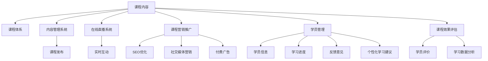

                 

# 如何打造个人知识付费线上课程

> 关键词：知识付费、在线课程、个人品牌、AI课程开发、教育技术

## 1. 背景介绍

### 1.1 问题由来
随着互联网技术的发展，个人知识付费线上课程（简称“知识付费课程”）成为了教育技术领域的新型趋势。通过在线视频、文字、音频等多媒体形式，知识付费课程为学习者提供高效便捷的学习方式。特别是在疫情影响下，线上教育市场迎来了快速增长，个人知识付费课程更是迅速崛起，为教育从业者开辟了新的市场机会。

但是，个人知识付费课程的制作并不是简单的内容录制和上传。如何有效组织内容、构建课程体系、吸引和留存学员、提升课程效果等，都是课程制作过程中需要重点考虑的问题。特别是对于初学者来说，打造一套高质量的知识付费课程并非易事。因此，本文将系统介绍如何构建个人知识付费线上课程，涵盖课程内容规划、技术开发、营销推广、学员管理等多个方面，帮助教育从业者系统掌握课程开发的全流程，提升课程制作能力。

## 2. 核心概念与联系

### 2.1 核心概念概述

为了更好地理解个人知识付费线上课程的构建方法，本节将介绍几个密切相关的核心概念：

- **知识付费课程**：基于互联网平台，通过付费方式提供特定知识或技能的学习服务，包括视频课程、直播、在线问答等多种形式。课程内容通常具有系统性、实用性、趣味性等特点。

- **课程体系**：课程内容的整体结构框架，包括课程模块、章节、知识点等，用于引导学员系统的学习。

- **学习管理系统（LMS）**：用于在线管理和教学的集成化软件系统，支持课程发布、学员管理、测试评估、学习记录等功能，提升教学效率和学员学习体验。

- **内容管理系统（CMS）**：用于课程内容编辑、组织、发布的管理系统，支持文本、视频、音频等多种格式上传和展示。

- **在线直播系统**：提供实时互动教学的在线平台，支持讲师和学员之间实时视频、语音交流，增强互动性。

- **课程营销推广**：通过多种渠道将课程信息推广给潜在学员，吸引用户付费学习，包括SEO优化、社交媒体营销、付费广告等。

- **学员管理**：通过平台对学员信息、学习进度、反馈意见等进行管理和分析，提供个性化学习建议，提升学习效果。

- **课程效果评估**：通过学员评价、学习数据分析等方式，评估课程质量和学员反馈，进行持续改进。

这些核心概念之间的逻辑关系可以通过以下Mermaid流程图来展示：



这个流程图展示了个知识付费课程的各个关键组成模块及其之间的关系：

1. 课程内容是课程体系的基础，通过内容管理系统进行组织和发布。
2. 课程体系指导课程内容的设计和结构，支持课程发布和展示。
3. 在线直播系统提供实时互动的教学模式，提升学习体验。
4. 课程营销推广将课程信息传播给潜在学员，吸引用户付费。
5. 学员管理对学员信息、学习进度等进行管理，提供个性化建议。
6. 课程效果评估对课程质量进行持续改进，提升课程效果。

## 3. 核心算法原理 & 具体操作步骤
### 3.1 算法原理概述

个人知识付费线上课程的构建过程，本质上是一个系统化、多阶段的教育技术工程。其核心思想是将复杂的内容体系转化为结构化的教学模块，通过在线平台进行系统化教学和互动，最终实现学员的学习目标。

形式化地，假设课程内容为 $C$，课程体系为 $S$，学员集合为 $U$，学习管理系统为 $L$，内容管理系统为 $M$，在线直播系统为 $O$，课程营销推广渠道为 $A$。课程构建的过程包括：

1. 内容收集与整理：收集相关领域知识，通过内容管理系统进行整理，形成课程大纲和模块。
2. 体系设计：根据内容模块设计课程体系，包括章节、知识点等。
3. 平台搭建：通过学习管理系统和内容管理系统搭建在线课程平台，支持课程发布、学员管理等功能。
4. 课程录制与发布：在在线直播系统上进行课程录制和直播，发布课程内容。
5. 营销推广：通过多种渠道进行课程宣传，吸引学员付费学习。
6. 学员管理与互动：通过学习管理系统对学员进行管理，支持实时互动和反馈收集。
7. 课程效果评估：通过学员评价和数据分析，持续改进课程内容和教学方法。

### 3.2 算法步骤详解

#### 3.2.1 内容收集与整理

1. **需求分析**：确定课程目标和目标群体，明确课程需涵盖的核心知识点。
2. **内容收集**：从书籍、论文、视频、公开课等多种渠道收集相关内容，建立课程资源库。
3. **内容整理**：根据课程目标和知识点，对收集到的内容进行筛选、分类和组织，形成课程大纲和模块。

#### 3.2.2 体系设计

1. **章节划分**：将课程内容划分为多个章节，每个章节包含若干知识点。
2. **知识点确定**：为每个知识点设定具体的学习目标和评价指标，设计适当的教学方法。
3. **内容关联**：确保各知识点之间逻辑连贯，形成完整的知识体系。

#### 3.2.3 平台搭建

1. **选择工具**：根据需求选择合适的学习管理系统和内容管理系统。常用的LMS包括Moodle、Blackboard等，CMS包括WordPress、Wix等。
2. **平台搭建**：在选定的平台上搭建课程平台，配置课程发布、学员管理、互动交流等功能。
3. **测试优化**：测试课程平台的功能，根据反馈进行优化和调整。

#### 3.2.4 课程录制与发布

1. **录制课程**：在选定的在线直播平台上录制课程，确保录制质量。
2. **课程发布**：将录制好的课程内容上传至LMS和CMS平台，进行发布和展示。
3. **互动设计**：设计互动环节，如课堂讨论、互动问答等，提升学习体验。

#### 3.2.5 营销推广

1. **渠道选择**：选择合适的营销渠道，包括SEO优化、社交媒体营销、付费广告等。
2. **内容推广**：通过优化课程内容，制作有吸引力的推广素材，吸引潜在学员。
3. **活动策划**：策划各类营销活动，如免费试学、优惠券发放等，提升课程吸引力。

#### 3.2.6 学员管理与互动

1. **学员注册**：通过LMS平台实现学员注册、登录、课程选择等功能。
2. **学习进度跟踪**：通过LMS记录学员的学习进度，提供学习报告和学习建议。
3. **互动反馈**：在LMS和OMS平台上设计互动环节，收集学员反馈，进行课程改进。

#### 3.2.7 课程效果评估

1. **学员评价**：通过LMS平台收集学员对课程的评价和反馈，进行数据分析。
2. **学习数据分析**：分析学员的学习进度、测试成绩等数据，评估课程效果。
3. **持续改进**：根据评估结果进行课程内容优化和改进，提升课程质量。

### 3.3 算法优缺点

个人知识付费线上课程的构建具有以下优点：

1. **高效便捷**：课程内容通过在线平台进行发布和互动，节省时间和成本。
2. **随时随地学习**：学员可以在任何时间、任何地点进行学习，提升学习灵活性。
3. **丰富资源**：课程资源丰富多样，包括视频、音频、文本等多种形式，适应不同学员的学习习惯。
4. **互动性强**：在线直播系统提供实时互动，提升学习效果。

同时，该方法也存在一定的局限性：

1. **技术门槛高**：课程开发和平台搭建需要一定的技术基础，对非专业人士有一定挑战。
2. **学员自律性要求高**：在线学习模式要求学员有较强的自律性，否则学习效果可能不佳。
3. **课程质量难以保障**：课程开发过程中，内容选择、体系设计、互动设计等环节容易出现问题，导致课程质量不达标。
4. **营销推广难度大**：课程推广需要多渠道投入，特别是在初期，推广难度较大。
5. **学员管理复杂**：学员管理和互动环节需要精细化管理，否则难以满足学员需求。

尽管存在这些局限性，但就目前而言，个人知识付费线上课程的构建仍是大趋势，为教育从业者提供了新的市场机会和职业发展方向。未来相关研究的重点在于如何进一步降低技术门槛，提高课程质量，增强互动性，同时兼顾学员的自律性和学习效果。

### 3.4 算法应用领域

个人知识付费线上课程的应用领域非常广泛，以下是几个典型的应用场景：

- **职业培训**：在IT、金融、人力资源等职业领域，通过课程系统化培训，提升学员的专业技能。
- **学术研究**：在科研领域，通过课程分享前沿研究成果和技术方法，促进学术交流和合作。
- **兴趣爱好**：在文艺、健身、旅游等兴趣爱好领域，通过课程传授技能和知识，满足学员的个性化需求。
- **创业辅导**：在创业领域，通过课程提供市场分析、项目管理、团队建设等知识和经验，支持学员创业实践。
- **生活技能**：在生活技能领域，如烹饪、家居设计、心理健康等，通过课程传授实用技能，提升学员生活质量。

除了上述这些典型应用外，个人知识付费线上课程还将在更多领域得到广泛应用，为教育资源的普及和知识传播提供新的解决方案。

## 4. 数学模型和公式 & 详细讲解 & 举例说明
### 4.1 数学模型构建

本节将使用数学语言对个人知识付费线上课程的构建过程进行更加严格的刻画。

记课程内容为 $C$，课程体系为 $S$，学员集合为 $U$，学习管理系统为 $L$，内容管理系统为 $M$，在线直播系统为 $O$，课程营销推广渠道为 $A$。假设课程构建的目标是最大化课程质量和学员学习效果，可以定义以下优化目标：

$$
\mathop{\arg\min}_{S, C, M, L, O, A} \mathcal{L}(C, S, M, L, O, A, U)
$$

其中 $\mathcal{L}$ 为综合损失函数，用于衡量课程内容、体系设计、平台搭建、课程录制、营销推广、学员管理等多个环节的协同效果，具体形式为：

$$
\mathcal{L}(C, S, M, L, O, A, U) = w_1 \mathcal{L}_{content}(C) + w_2 \mathcal{L}_{structure}(S) + w_3 \mathcal{L}_{platform}(M, L) + w_4 \mathcal{L}_{recording}(O) + w_5 \mathcal{L}_{promotion}(A) + w_6 \mathcal{L}_{management}(L, U) + w_7 \mathcal{L}_{evaluation}(C, U)
$$

其中 $w_1, w_2, w_3, w_4, w_5, w_6, w_7$ 为各个环节的权重，根据课程需求进行调节。

### 4.2 公式推导过程

以下我们以一个简单的课程构建案例为例，推导课程质量综合损失函数及其各个子损失函数的计算公式。

假设课程内容 $C$ 包含 $n$ 个知识点，体系 $S$ 包含 $m$ 个章节，学员集合 $U$ 包含 $k$ 名学员。内容管理系统 $M$ 提供的教学资源为 $R$，学习管理系统 $L$ 提供学员管理功能 $F$，在线直播系统 $O$ 提供互动功能 $I$，课程营销推广渠道 $A$ 提供广告投放功能 $P$。

课程质量综合损失函数 $\mathcal{L}$ 可以定义为：

$$
\mathcal{L}(C, S, M, L, O, A, U) = \mathcal{L}_{content}(C) + \mathcal{L}_{structure}(S) + \mathcal{L}_{platform}(M, L) + \mathcal{L}_{recording}(O) + \mathcal{L}_{promotion}(A) + \mathcal{L}_{management}(L, U) + \mathcal{L}_{evaluation}(C, U)
$$

其中子损失函数定义如下：

1. **内容损失函数**：衡量课程内容的完整性和实用性。设 $C_i$ 为知识点 $i$ 的教学内容，$R_i$ 为资源库中与知识点 $i$ 相关的资源，$C_i$ 和 $R_i$ 之间的相似度为 $sim(C_i, R_i)$。定义内容损失函数为：

$$
\mathcal{L}_{content}(C) = \sum_{i=1}^n \max(0, 1 - sim(C_i, R_i))
$$

2. **体系损失函数**：衡量课程体系的结构合理性。设 $S_j$ 为章节 $j$ 下的知识点集合，$S_j$ 的知识点数量和分布合理性为 $k_j$，$S_j$ 和 $U_j$ 之间的关联性为 $rel(S_j, U_j)$。定义体系损失函数为：

$$
\mathcal{L}_{structure}(S) = \sum_{j=1}^m \max(0, 1 - k_j) + \sum_{j=1}^m \max(0, 1 - rel(S_j, U_j))
$$

3. **平台损失函数**：衡量平台系统的稳定性和可用性。设 $M$ 提供的功能为 $F$，$L$ 提供的功能为 $G$，$O$ 提供的功能为 $H$，$A$ 提供的功能为 $P$。平台损失函数为：

$$
\mathcal{L}_{platform}(M, L) = \max(0, 1 - \frac{|F \cap G \cap H \cap P|}{|F \cup G \cup H \cup P|})
$$

4. **录制损失函数**：衡量课程录制的质量。设 $O$ 提供的功能为 $I$，$I$ 的互动性和完整性为 $int(I)$，$I$ 的互动数据为 $D(I)$。录制损失函数为：

$$
\mathcal{L}_{recording}(O) = \max(0, 1 - int(I)) + \max(0, 1 - \frac{|D(I)|}{n})
$$

5. **推广损失函数**：衡量课程推广的效果。设 $A$ 提供的功能为 $P$，$P$ 的投放效果为 $eff(P)$，$P$ 的投放成本为 $cost(P)$。推广损失函数为：

$$
\mathcal{L}_{promotion}(A) = \max(0, 1 - eff(P)) + \max(0, 1 - \frac{|cost(P)|}{k})
$$

6. **管理损失函数**：衡量学员管理的效率和效果。设 $L$ 提供的功能为 $F$，$F$ 的学员管理数据为 $D(F)$，$D(F)$ 的有效性为 $effect(D(F))$。管理损失函数为：

$$
\mathcal{L}_{management}(L, U) = \max(0, 1 - effect(D(F))) + \max(0, 1 - \frac{|D(F)|}{k})
$$

7. **评价损失函数**：衡量课程效果的评估质量。设 $C$ 的学员评价为 $E(C)$，$E(C)$ 的满意度为 $sat(E(C))$，$E(C)$ 的平均测试成绩为 $avg(E(C))$。评价损失函数为：

$$
\mathcal{L}_{evaluation}(C, U) = \max(0, 1 - sat(E(C))) + \max(0, 1 - avg(E(C)))
$$

通过上述子损失函数，可以构建课程质量综合损失函数，对课程构建的各个环节进行量化评估。具体求解时，需要根据实际情况选择合适的权重，并使用梯度下降等优化算法进行求解。

### 4.3 案例分析与讲解

以在线编程课程为例，分析其课程构建的全过程。

1. **需求分析**：假设课程目标是为初学者提供系统化的编程知识，目标群体为大学生和职场新人。课程需涵盖基础语法、数据结构、算法设计等核心知识点。

2. **内容收集与整理**：从教材、视频、公开课、论文等渠道收集相关内容，建立课程资源库。将内容进行分类和组织，形成课程大纲和模块。

3. **体系设计**：将课程内容划分为基础篇、进阶篇和实战篇，每个篇包含若干章节。章节内容从易到难，逐步深入，确保知识体系的合理性。

4. **平台搭建**：选择Moodle作为LMS平台，WordPress作为CMS平台，搭建在线编程课程平台。配置课程发布、学员管理、互动交流等功能。

5. **课程录制与发布**：在选定的在线直播平台上录制课程，上传至Moodle平台进行发布和展示。设计互动环节，如课堂讨论、互动问答等，提升学习体验。

6. **营销推广**：通过SEO优化、社交媒体营销、付费广告等渠道进行课程宣传，吸引潜在学员。策划免费试学和优惠券活动，提升课程吸引力。

7. **学员管理与互动**：通过Moodle平台实现学员注册、登录、课程选择等功能。记录学员的学习进度，提供学习报告和学习建议。设计互动环节，收集学员反馈，进行课程改进。

8. **课程效果评估**：通过Moodle平台收集学员对课程的评价和反馈，进行数据分析。分析学员的学习进度、测试成绩等数据，评估课程效果。根据评估结果进行课程内容优化和改进，提升课程质量。

## 5. 项目实践：代码实例和详细解释说明
### 5.1 开发环境搭建

在进行课程开发前，我们需要准备好开发环境。以下是使用Python进行Flask开发的开发环境配置流程：

1. 安装Anaconda：从官网下载并安装Anaconda，用于创建独立的Python环境。

2. 创建并激活虚拟环境：
```bash
conda create -n flask-env python=3.8 
conda activate flask-env
```

3. 安装Flask：使用pip安装Flask框架。
```bash
pip install flask
```

4. 安装Flask相关工具包：
```bash
pip install flask-migrate flask-restful
```

5. 安装Flask RESTful扩展：
```bash
pip install flask-restful
```

完成上述步骤后，即可在`flask-env`环境中开始课程开发。

### 5.2 源代码详细实现

这里我们以在线编程课程为例，给出使用Flask框架开发课程平台的PyTorch代码实现。

```python
from flask import Flask, request, jsonify
from flask_migrate import Migrate
from flask_restful import Resource, Api
from models import User, Course, Chapter, Lesson

app = Flask(__name__)
api = Api(app)
migrate = Migrate(app, db)

class UserResource(Resource):
    def get(self):
        users = User.query.all()
        return jsonify([{'id': user.id, 'name': user.name} for user in users])

class CourseResource(Resource):
    def get(self):
        courses = Course.query.all()
        return jsonify([{'id': course.id, 'name': course.name} for course in courses])

    def post(self):
        name = request.json.get('name')
        course = Course(name=name)
        db.session.add(course)
        db.session.commit()
        return jsonify({'message': 'Course created'}), 201

# 其他资源类定义和实现略

if __name__ == '__main__':
    app.run(debug=True)
```

### 5.3 代码解读与分析

这里我们详细解读一下关键代码的实现细节：

**UserResource类**：
- `get`方法：获取所有用户信息，返回JSON格式的用户列表。
- `post`方法：创建新用户，将用户信息添加到数据库。

**CourseResource类**：
- `get`方法：获取所有课程信息，返回JSON格式的课程列表。
- `post`方法：创建新课程，将课程信息添加到数据库。

**数据库模型**：
- 定义用户、课程、章节、课程等信息的数据库模型。

**Flask应用**：
- 定义Flask应用对象，配置API路由和数据库迁移。
- 定义用户资源和课程资源的RESTful API接口，实现用户管理和课程管理功能。

通过Flask框架，可以高效地搭建课程管理平台，实现课程的发布、学员管理等功能。代码实现简洁高效，开发者可以快速上手，实现自己的课程管理需求。

## 6. 实际应用场景
### 6.1 智能培训系统

个人知识付费线上课程在智能培训系统中的应用非常广泛。智能培训系统通过分析学员的学习数据和行为，提供个性化的学习建议和资源推荐，提升学习效果。在课程开发过程中，需要考虑学员的个性化需求和实时互动，通过课程平台实现智能化培训。

例如，在IT培训领域，通过课程平台记录学员的学习进度、测试成绩等数据，分析学员的学习行为，提供个性化学习建议。在课程录制和互动环节，使用AI技术进行实时答疑和自动化评估，提升学习体验。

### 6.2 学术研究分享

在科研领域，个人知识付费线上课程可以为学术研究提供新的交流平台，促进知识的共享和传播。通过课程平台分享研究成果和技术方法，吸引学术爱好者和同行参与讨论，推动学术进步。

例如，在机器学习领域，通过课程平台分享最新的研究成果、前沿技术和实战经验，提供开放的数据集和代码，促进学术研究和应用开发。在课程互动环节，使用AI技术进行问答和讨论，提升学术交流效果。

### 6.3 生活技能学习

在生活技能领域，个人知识付费线上课程可以传授实用的技能和知识，满足不同学员的个性化需求。通过课程平台提供视频、音频、图文等多种形式的内容，满足不同学员的学习习惯。

例如，在烹饪课程中，通过课程平台分享各种菜肴的制作方法和技巧，提供详细的步骤和演示视频，让学员能够轻松掌握各种烹饪技能。在课程互动环节，使用AI技术进行实时答疑和反馈收集，提升学习效果。

### 6.4 未来应用展望

随着技术的发展，个人知识付费线上课程将在更多领域得到广泛应用，为教育资源的普及和知识传播提供新的解决方案。未来，课程开发将更加智能化、个性化，通过AI技术实现内容的推荐和优化，提升学习体验。同时，课程平台将更加集成化、平台化，提供一站式的学习和培训服务，满足不同学员的需求。

## 7. 工具和资源推荐
### 7.1 学习资源推荐

为了帮助开发者系统掌握个人知识付费线上课程的构建方法，这里推荐一些优质的学习资源：

1. **《在线教育平台设计与开发》系列书籍**：详细介绍了在线教育平台的构建方法和技术实现，涵盖课程管理、学员管理、互动设计等多个方面。

2. **《Python Flask Web开发实战》课程**：基于Python Flask框架的Web开发教程，涵盖RESTful API设计、数据库管理、安全性等多个方面，适合初学者入门。

3. **Coursera、edX等在线教育平台**：提供大量优秀的课程资源和成功案例，帮助开发者了解课程开发的最佳实践。

4. **Udemy、Skillshare等在线课程平台**：提供丰富的课程资源和讲师经验分享，帮助开发者提升课程开发和营销推广能力。

5. **W3Schools在线教程**：提供丰富的Web开发教程和实践案例，帮助开发者掌握Web开发技术。

通过这些资源的学习实践，相信你一定能够快速掌握个人知识付费线上课程的构建方法，并用于解决实际的课程开发问题。

### 7.2 开发工具推荐

高效的开发离不开优秀的工具支持。以下是几款用于课程开发和推广的常用工具：

1. **Python Flask**：轻量级的Web开发框架，支持RESTful API设计和数据库管理，适合快速搭建课程平台。
2. **MySQL/PostgreSQL**：常用的关系型数据库，适合存储和管理课程、学员、资源等信息。
3. **MongoDB**：适合存储半结构化数据的NoSQL数据库，适合存储学员学习进度和互动数据。
4. **AWS/Azure/GCP**：云服务提供商，提供强大的计算、存储和网络资源，适合部署课程平台。
5. **Google Analytics**：用于网站流量和用户行为分析的工具，帮助开发者了解课程推广效果。
6. **Canva**：设计工具，帮助开发者制作课程海报、宣传素材等。

合理利用这些工具，可以显著提升课程开发和推广的效率，加速课程制作流程。

### 7.3 相关论文推荐

个人知识付费线上课程的构建源于学界的持续研究。以下是几篇奠基性的相关论文，推荐阅读：

1. **《在线学习平台的设计与实现》**：介绍在线学习平台的基本设计思路和关键技术点，适合初学者入门。
2. **《基于Web的在线教育系统》**：详细介绍Web技术在在线教育中的应用，涵盖课程管理、学员管理等多个方面。
3. **《智能教育技术在在线学习中的应用》**：探讨智能技术在在线教育中的应用，包括AI推荐、智能答疑等多个方向。
4. **《人工智能在在线教育中的应用》**：分析人工智能技术在在线教育中的重要性和应用场景，涵盖知识图谱、自然语言处理等多个方面。

这些论文代表了大规模在线课程构建的理论基础，通过学习这些前沿成果，可以帮助开发者掌握课程开发的全流程，提升课程制作能力。

## 8. 总结：未来发展趋势与挑战
### 8.1 总结

本文对个人知识付费线上课程的构建方法进行了全面系统的介绍。首先阐述了课程构建的背景和意义，明确了课程开发的目标和核心概念。其次，从原理到实践，详细讲解了课程构建的数学模型和算法步骤，给出了课程开发的全流程和代码实现。同时，本文还探讨了课程在智能培训、学术研究、生活技能等多个领域的应用前景，展示了课程开发的广泛价值。

通过本文的系统梳理，可以看到，个人知识付费线上课程的构建过程是一个系统化、多阶段的教育技术工程。高效便捷、随时随地、资源丰富、互动性强等特点，使其成为教育技术领域的新型趋势。开发者需要从内容、体系、平台、录制、推广、管理等多个环节进行全面优化，才能打造出高质量的课程，满足学员的学习需求。

### 8.2 未来发展趋势

展望未来，个人知识付费线上课程将呈现以下几个发展趋势：

1. **内容智能化**：通过AI技术，实现内容的推荐和优化，提升学习效果。例如，使用推荐算法分析学员的学习行为，推荐相关的学习资源和课程内容。

2. **平台集成化**：课程平台将更加集成化、平台化，提供一站式的学习和培训服务，满足不同学员的需求。例如，将课程平台与学习管理系统、内容管理系统等集成，提供更丰富的功能支持。

3. **交互实时化**：课程互动将更加实时化、智能化，提升学习体验。例如，使用AI技术进行实时答疑和自动化评估，提供实时的反馈和建议。

4. **数据可视化**：通过数据可视化技术，展示课程效果和学习成果，帮助开发者进行优化改进。例如，使用数据仪表盘展示学员的学习进度和测试成绩，进行数据分析和优化。

5. **知识图谱化**：通过知识图谱技术，将课程内容结构化、系统化，提供知识体系的可视化展示。例如，将课程内容转换为知识图谱，展示知识点之间的逻辑关系，帮助学员进行知识整合和复习。

6. **学习个性化**：通过个性化推荐和自适应学习技术，提供个性化学习路径和资源。例如，根据学员的学习行为和测试成绩，推荐个性化的学习路径和资源，提升学习效果。

以上趋势凸显了个人知识付费线上课程的广阔前景，未来的课程开发将更加智能化、个性化，为教育资源的普及和知识传播提供新的解决方案。

### 8.3 面临的挑战

尽管个人知识付费线上课程的发展前景广阔，但在迈向更加智能化、普适化应用的过程中，它仍面临诸多挑战：

1. **内容质量难以保证**：课程内容的质量直接影响到学习效果，但内容选择和设计复杂，容易出现内容重复、知识点覆盖不全等问题。如何高质量、高效率地制作课程内容，是课程开发中的重要挑战。

2. **学员自律性要求高**：在线学习模式要求学员有较强的自律性，否则学习效果可能不佳。如何提升学员的自律性和学习动力，是课程开发中的难点。

3. **技术门槛高**：课程开发和平台搭建需要一定的技术基础，对非专业人士有一定挑战。如何降低技术门槛，提供简单易用的课程开发工具，是课程推广中的重要任务。

4. **营销推广难度大**：课程推广需要多渠道投入，特别是在初期，推广难度较大。如何精准投放广告，提升课程吸引力和学员转化率，是课程推广中的关键问题。

5. **学员管理复杂**：学员管理和互动环节需要精细化管理，否则难以满足学员需求。如何提供个性化的学习建议和互动环节，是课程管理中的重要挑战。

6. **数据安全和隐私**：学员数据和隐私保护是课程开发中的重要问题，需要加强数据安全防护和隐私保护，确保学员数据的安全。

尽管存在这些挑战，但个人知识付费线上课程的发展前景依然广阔，特别是在教育技术领域的不断创新和突破，将为课程开发提供更多的支持和保障。开发者需要根据实际情况，不断迭代和优化课程内容、体系、平台、营销等多个环节，才能打造出高质量的课程，实现教育的普及和进步。

### 8.4 研究展望

面向未来，个人知识付费线上课程的研究需要在以下几个方面寻求新的突破：

1. **智能化推荐系统**：引入推荐算法，实现内容的智能推荐和优化，提升学习效果。例如，使用协同过滤算法、深度学习模型等，分析学员的学习行为，推荐相关的学习资源和课程内容。

2. **自适应学习技术**：引入自适应学习技术，提供个性化的学习路径和资源。例如，使用自适应学习算法，根据学员的学习进度和测试成绩，调整学习路径和推荐资源。

3. **多模态学习技术**：引入多模态学习技术，支持视频、音频、文本等多种形式的内容学习。例如，使用多模态学习算法，将视频、音频、文本等多种形式的内容进行融合，提升学习效果。

4. **智能答疑系统**：引入智能答疑系统，提供实时的反馈和建议。例如，使用自然语言处理技术，构建智能答疑系统，提供实时的反馈和建议，提升学习效果。

5. **数据驱动课程优化**：引入数据驱动技术，进行课程效果的持续改进。例如，使用数据挖掘技术，分析学员的学习数据，进行课程效果的评估和改进，提升课程质量。

这些研究方向的探索，必将引领个人知识付费线上课程的技术发展，为教育的普及和知识传播提供新的解决方案。开发者需要积极探索和尝试，不断优化课程内容、体系、平台、营销等多个环节，才能打造出高质量的课程，满足学员的学习需求。

## 9. 附录：常见问题与解答

**Q1：课程开发中的技术门槛高，如何降低技术门槛？**

A: 技术门槛是课程开发中需要解决的重要问题。以下是一些降低技术门槛的方法：

1. **使用开源工具和框架**：选择易于上手的开源工具和框架，如Python Flask、MySQL、PostgreSQL等，减少技术门槛。

2. **提供详细教程和文档**：提供详细的教程和文档，帮助开发者快速上手。例如，提供Python Flask的详细教程和API参考文档，方便开发者进行课程开发。

3. **使用现成课程模板**：提供现成的课程模板，帮助开发者快速构建课程平台。例如，提供现成的课程管理、学员管理、互动设计等模板，减少开发者的工作量。

4. **提供第三方服务**：使用第三方服务，如云服务提供商、在线教育平台等，提供强大的计算、存储和网络资源，降低课程开发的成本和复杂度。

5. **提供在线支持和培训**：提供在线支持和培训，帮助开发者解决技术问题。例如，提供在线客服、技术支持、培训课程等，提升开发者的技术水平。

通过这些方法，可以有效降低课程开发的技术门槛，帮助开发者快速上手，实现自己的课程开发需求。

**Q2：课程推广过程中，如何精准投放广告？**

A: 精准投放广告是课程推广中的关键问题。以下是一些精准投放广告的方法：

1. **分析目标受众**：分析目标受众的特征和需求，制定精准的推广策略。例如，分析潜在学员的年龄、性别、兴趣爱好等特征，制定针对性的广告投放策略。

2. **选择合适的渠道**：选择适合的广告投放渠道，提升广告的触达率和转化率。例如，选择合适的社交媒体平台、搜索引擎、付费广告等，进行精准投放。

3. **优化广告内容**：优化广告内容，提升广告的吸引力和转化率。例如，制作有吸引力的广告文案和图片，设计精准的投放时间、地域等参数，提升广告效果。

4. **进行A/B测试**：进行A/B测试，评估不同广告策略的效果，优化投放方案。例如，制作两组广告内容，进行A/B测试，选择效果更好的广告策略，进行精准投放。

5. **使用数据分析工具**：使用数据分析工具，进行广告效果分析和优化。例如，使用Google Analytics等工具，分析广告的点击率、转化率等数据，进行优化改进。

通过这些方法，可以有效提升课程广告的精准投放效果，提升课程的吸引力和转化率，实现课程的快速推广。

**Q3：学员管理中的数据安全和隐私保护有哪些措施？**

A: 学员数据安全和隐私保护是课程开发中的重要问题。以下是一些数据安全和隐私保护的方法：

1. **加密存储**：使用加密技术，保护学员数据的安全。例如，使用AES加密算法，对学员数据进行加密存储，防止数据泄露。

2. **权限控制**：使用权限控制技术，保护学员数据的访问权限。例如，使用RBAC（基于角色的访问控制）技术，控制不同角色的学员对数据的访问权限。

3. **数据匿名化**：对学员数据进行匿名化处理，保护学员隐私。例如，对学员的姓名、身份证号码等敏感信息进行脱敏处理，防止个人信息泄露。

4. **安全传输**：使用安全传输技术，保护学员数据在传输过程中的安全。例如，使用HTTPS协议，加密传输学员数据，防止数据被截获和篡改。

5. **安全审计**：定期进行安全审计，发现和修复潜在的安全漏洞。例如，定期进行安全漏洞扫描，发现和修复潜在的安全漏洞，提升数据安全防护水平。

通过这些方法，可以有效提升课程开发中的数据安全和隐私保护水平，确保学员数据的安全和隐私。

**Q4：课程内容质量难以保证，如何提升课程质量？**

A: 课程内容质量是课程开发中的重要问题。以下是一些提升课程质量的方法：

1. **需求分析**：进行详细的课程需求分析，明确课程目标和目标群体，确定课程需涵盖的核心知识点。例如，进行市场调研，了解目标群体和市场需求，明确课程内容的设计方向。

2. **内容收集与整理**：从多种渠道收集相关内容，进行筛选、分类和组织，形成课程大纲和模块。例如，从教材、视频、公开课、论文等渠道收集相关内容，建立课程资源库。

3. **体系设计**：设计合理的课程体系，确保知识点的逻辑连贯和结构合理。例如，将课程内容划分为基础篇、进阶篇和实战篇，确保知识点之间的逻辑连贯和结构合理。

4. **教学设计**：设计有效的教学方法，提升课程学习效果。例如，引入互动设计、案例分析、实战演练等多种教学方法，提升课程学习效果。

5. **教学评估**：进行课程效果的评估和改进，提升课程质量。例如，通过学员反馈、学习数据分析等手段，进行课程效果的评估和改进，提升课程质量。

通过这些方法，可以有效提升课程内容的质量，确保课程学习效果和学员满意度，满足学员的学习需求。

**Q5：如何提升学员的自律性和学习动力？**

A: 提升学员的自律性和学习动力是课程开发中的重要问题。以下是一些提升学员自律性和学习动力的方法：

1. **设置明确的学习目标**：设置明确的学习目标，激励学员完成学习任务。例如，设置学习任务和考核标准，激励学员完成学习任务。

2. **提供个性化的学习建议**：根据学员的学习行为和测试成绩，提供个性化的学习建议。例如，根据学员的学习进度和测试成绩，提供个性化的学习路径和资源。

3. **引入互动和奖励机制**：引入互动和奖励机制，激励学员积极参与学习。例如，设计互动环节和奖励机制，激励学员积极参与学习，提升学习效果。

4. **建立学习社区**：建立学习社区，提供学习交流平台。例如，建立学习论坛、学习小组等，提供学习交流平台，促进学员之间的互动和交流。

5. **提供及时的反馈和支持**：提供及时的反馈和支持，帮助学员解决问题。例如，提供在线客服、技术支持等，帮助学员解决学习中的问题，提升学习效果。

通过这些方法，可以有效提升学员的自律性和学习动力，促进学员的积极参与和学习效果，实现课程的普及和推广。

---

作者：禅与计算机程序设计艺术 / Zen and the Art of Computer Programming

