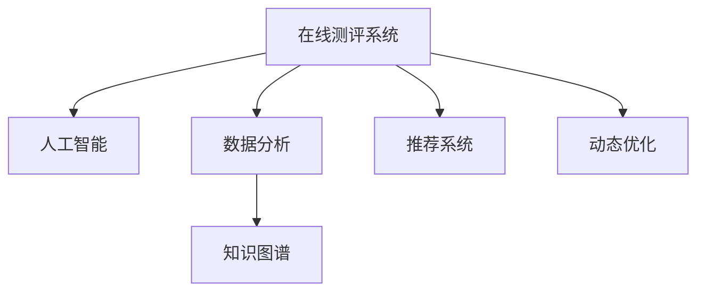

                 

# 如何打造知识付费的在线测评系统

> 关键词：知识付费, 在线测评系统, 人工智能, 数据分析, 系统架构, 知识图谱, 用户行为分析

## 1. 背景介绍

### 1.1 问题由来
随着在线教育和知识付费市场的蓬勃发展，各种课程和付费内容的数量和质量不断提升。在线测评系统作为衡量用户学习效果和课程质量的重要工具，开始受到广泛关注。然而，传统的测评系统往往存在一些不足：

- 测评过程简单，缺乏个性化和动态调整。
- 测评结果缺乏深入分析，难以为课程改进和个性化推荐提供有力支持。
- 测评数据未充分挖掘，难以挖掘出有价值的隐性知识。

为了解决这些问题，本文将介绍如何利用人工智能和数据分析技术，打造一个高效、智能、个性化的在线测评系统，帮助知识付费平台实现精准的用户画像和课程推荐，提升用户满意度和平台盈利能力。

### 1.2 问题核心关键点
一个高效、智能、个性化的在线测评系统应该具备以下核心特点：

- 个性化测评：根据用户历史行为和特征，动态调整测评题目和难度，实现个性化测评。
- 深度分析：利用人工智能技术，对测评数据进行深入分析，挖掘出用户行为模式和知识图谱。
- 智能推荐：根据用户测评结果和行为模式，提供个性化的课程推荐，提升用户粘性。
- 动态优化：持续收集用户反馈和行为数据，不断优化测评题目和推荐算法，提升系统性能。

本文将从系统架构、核心算法、项目实践和未来展望等方面，全面介绍如何构建这样一个系统。

## 2. 核心概念与联系

### 2.1 核心概念概述

为更好地理解在线测评系统的构建过程，本节将介绍几个密切相关的核心概念：

- 在线测评系统：基于网络平台，通过在线答题和智能评估的方式，衡量用户对知识内容的掌握情况的系统。
- 人工智能：利用机器学习和深度学习技术，实现数据分析、模式识别、智能推荐等功能。
- 数据分析：对大量用户数据进行统计、分析和建模，提取有价值的信息和知识，为业务决策提供支持。
- 知识图谱：以语义为核心的知识描述框架，将知识以图的形式组织起来，支持更深入的知识推理和应用。
- 推荐系统：根据用户历史行为和兴趣，推荐最相关的课程和内容，提升用户体验和平台收益。
- 动态优化：通过实时反馈和数据分析，不断优化测评题目和推荐算法，提升系统性能。

这些核心概念之间的逻辑关系可以通过以下Mermaid流程图来展示：



这个流程图展示了大语言模型的核心概念及其之间的关系：

1. 在线测评系统利用人工智能技术进行智能评估，实现个性化和动态调整。
2. 通过数据分析和知识图谱，深入挖掘用户行为模式和知识图谱。
3. 推荐系统根据测评结果和行为模式，提供个性化推荐。
4. 动态优化持续收集反馈和行为数据，不断提升系统性能。

这些概念共同构成了在线测评系统的技术框架，使其能够高效、智能、个性化地完成测评任务。

## 3. 核心算法原理 & 具体操作步骤
### 3.1 算法原理概述

在线测评系统的核心算法包括个性化测评、深度分析、智能推荐和动态优化。这些算法通常以机器学习、深度学习技术为基础，结合业务逻辑和数据特征，实现功能目标。

以深度分析算法为例，其核心思想是通过深度学习模型，对用户测评数据进行特征提取和模式识别，从而发现用户行为模式和知识图谱。常见的深度学习模型包括卷积神经网络(CNN)、循环神经网络(RNN)、长短期记忆网络(LSTM)、Transformer等。

### 3.2 算法步骤详解

#### 3.2.1 个性化测评算法

个性化测评的核心在于根据用户的历史行为和特征，动态调整测评题目和难度。通常使用协同过滤、基于规则的推荐算法、基于模型的推荐算法等方法，结合用户画像和行为数据，实现个性化推荐。

#### 3.2.2 深度分析算法

深度分析的核心在于对测评数据进行特征提取和模式识别，挖掘出用户行为模式和知识图谱。具体步骤包括：

1. 数据预处理：对原始测评数据进行清洗、归一化、特征提取等预处理操作。
2. 特征选择：选择合适的特征对进行建模，避免过拟合和欠拟合。
3. 模型训练：使用深度学习模型对数据进行训练，提取关键特征和模式。
4. 结果分析：对模型输出进行分析和解读，提取用户行为模式和知识图谱。

#### 3.2.3 智能推荐算法

智能推荐的核心在于根据用户测评结果和行为模式，推荐最相关的课程和内容。常见的推荐算法包括基于协同过滤、基于内容的推荐、基于矩阵分解的推荐等方法。

#### 3.2.4 动态优化算法

动态优化的核心在于通过实时反馈和数据分析，不断优化测评题目和推荐算法，提升系统性能。具体步骤包括：

1. 数据收集：持续收集用户反馈和行为数据，包括测评结果、推荐效果、用户互动数据等。
2. 模型优化：基于收集到的数据，不断优化推荐算法和测评模型，提升系统精度和性能。
3. 结果评估：通过A/B测试等方法，评估优化效果，确保系统性能稳定和持续提升。

### 3.3 算法优缺点

个性化测评算法具有以下优点：
- 能够实现用户个性化推荐，提升用户体验。
- 可以动态调整测评题目和难度，提高测评效果。

然而，个性化测评算法也存在一些缺点：
- 对数据量和特征提取要求较高，需要大量用户数据进行训练。
- 算法复杂度较高，实时响应性能需要优化。

深度分析算法具有以下优点：
- 能够挖掘出用户行为模式和知识图谱，为业务决策提供有力支持。
- 深度学习模型具有强大的特征提取能力，可以发现隐性知识。

然而，深度分析算法也存在一些缺点：
- 数据预处理和特征选择需要专业知识，较难实现。
- 模型训练和调参复杂，需要较高的计算资源。

智能推荐算法具有以下优点：
- 能够根据用户历史行为和兴趣，推荐最相关的课程和内容。
- 推荐效果较好，能够提升用户粘性和平台收益。

然而，智能推荐算法也存在一些缺点：
- 对数据量和用户行为模式要求较高，需要大量数据进行训练。
- 推荐效果受用户行为模式的影响较大，需要持续优化。

动态优化算法具有以下优点：
- 能够根据用户反馈和行为数据，持续优化测评题目和推荐算法。
- 可以不断提升系统性能，确保测评和推荐的准确性。

然而，动态优化算法也存在一些缺点：
- 需要持续收集和处理用户反馈数据，数据管理复杂。
- 需要不断优化推荐模型和测评模型，技术难度较高。

### 3.4 算法应用领域

在线测评系统已经在教育、培训、知识付费等多个领域得到广泛应用。例如：

- 在线教育平台：通过测评系统评估学生的学习效果，提供个性化推荐，提升学习效果。
- 企业培训系统：通过测评系统评估员工的培训效果，提供个性化的培训建议。
- 知识付费平台：通过测评系统评估用户的知识掌握情况，提供个性化的课程推荐，提升用户满意度和平台收益。
- 在线测评系统：通过测评系统评估用户对知识内容的掌握情况，提供个性化的测评结果和反馈。

除了上述这些经典应用外，在线测评系统还被创新性地应用到更多场景中，如用户行为分析、内容推荐、广告投放等，为各类平台提供了强大的数据分析支持。

## 4. 数学模型和公式 & 详细讲解  
### 4.1 数学模型构建

本节将使用数学语言对在线测评系统的核心算法进行更加严格的刻画。

记用户测评结果为 $\{x_i\}_{i=1}^N$，其中 $x_i$ 表示用户在第 $i$ 次测评中的成绩。定义用户行为特征为 $\mathbf{X} \in \mathbb{R}^d$，其中 $d$ 为特征维度。定义测评题目为 $\mathcal{X} \in \mathbb{R}^m$，其中 $m$ 为测评题目数量。

定义推荐算法为 $F(\mathbf{X}, \mathcal{X}) \in [0,1]^m$，其中 $F$ 表示推荐算法函数，输出推荐概率。定义优化目标为最小化预测误差：

$$
\min_{\theta} \sum_{i=1}^N ||x_i - F(\mathbf{X}_i, \mathcal{X})||^2
$$

其中 $\theta$ 为模型参数。在实践中，我们通常使用基于梯度的优化算法（如SGD、Adam等）来近似求解上述最优化问题。

### 4.2 公式推导过程

以下我们以协同过滤算法为例，推导推荐算法的公式及其梯度计算。

协同过滤算法通过计算用户和物品的相似度，为用户推荐相关物品。假设 $U$ 为用户集合，$I$ 为物品集合，定义用户与物品的相似度矩阵 $S \in [0,1]^{n \times m}$，其中 $n$ 为用户数，$m$ 为物品数。

协同过滤算法的推荐公式为：

$$
F(\mathbf{X}, \mathcal{X}) = \text{softmax}(S \cdot \mathbf{X})
$$

其中 $\text{softmax}$ 函数将矩阵 $S \cdot \mathbf{X}$ 中的每个元素映射到 $(0,1)$ 区间内，表示物品推荐的概率。

推荐算法的最小化误差目标函数为：

$$
\min_{\theta} \sum_{i=1}^N ||x_i - \mathbf{y}_i||^2
$$

其中 $\mathbf{y}_i = \text{softmax}(S_i \cdot \mathbf{X}_i)$，表示用户 $i$ 对物品的推荐概率。

推荐算法的梯度计算公式为：

$$
\frac{\partial \mathcal{L}}{\partial S} = -\frac{1}{N}\sum_{i=1}^N (x_i - \mathbf{y}_i) (\mathbf{X}_i - \mathbf{y}_i)^\top
$$

其中 $S$ 为相似度矩阵，$\frac{\partial \mathcal{L}}{\partial S}$ 为梯度向量，$\mathbf{X}_i$ 和 $\mathbf{y}_i$ 分别为用户 $i$ 的行为特征和推荐结果。

在得到梯度向量后，即可带入优化算法，完成推荐模型的迭代优化。重复上述过程直至收敛，最终得到适应用户推荐的最优相似度矩阵 $S^*$。

## 5. 项目实践：代码实例和详细解释说明
### 5.1 开发环境搭建

在进行测评系统开发前，我们需要准备好开发环境。以下是使用Python进行Flask开发的环境配置流程：

1. 安装Anaconda：从官网下载并安装Anaconda，用于创建独立的Python环境。

2. 创建并激活虚拟环境：
```bash
conda create -n python-env python=3.8 
conda activate python-env
```

3. 安装Flask：使用pip安装Flask框架，进行Web应用开发。

4. 安装PyTorch：根据CUDA版本，从官网获取对应的安装命令。例如：
```bash
conda install pytorch torchvision torchaudio cudatoolkit=11.1 -c pytorch -c conda-forge
```

5. 安装Flask-RESTful：用于开发RESTful风格的API接口，方便外部系统调用。

6. 安装Flask-WTF：用于开发Web表单，收集用户数据。

7. 安装Flask-SQLAlchemy：用于数据库操作，实现数据的存储和检索。

8. 安装Flask-WTF-Recaptcha：用于实现反垃圾提交功能，确保数据质量。

完成上述步骤后，即可在`python-env`环境中开始测评系统开发。

### 5.2 源代码详细实现

这里我们以协同过滤推荐算法为例，给出使用Flask实现在线测评系统的Python代码实现。

首先，定义推荐模型的训练函数：

```python
import numpy as np
from sklearn.metrics import mean_squared_error

def train_model(S, X, y, learning_rate=0.01, num_epochs=100):
    S = np.array(S, dtype=np.float32)
    X = np.array(X, dtype=np.float32)
    y = np.array(y, dtype=np.float32)
    
    for epoch in range(num_epochs):
        grad_S = -learning_rate * (y - np.dot(S, X)) * (X - np.dot(S, y))[:,None]
        S += grad_S
        
        if epoch % 10 == 0:
            y_pred = np.dot(S, X)
            mse = mean_squared_error(y, y_pred)
            print(f"Epoch {epoch+1}, MSE: {mse:.4f}")
    
    return S
```

然后，定义用户测评和推荐接口：

```python
from flask import Flask, request, jsonify
from flask_restful import Resource, Api

app = Flask(__name__)
api = Api(app)

class Recommendation(Resource):
    def get(self):
        # 获取用户行为特征和测评结果
        X = request.get_json().get('X')
        y = request.get_json().get('y')
        
        # 训练推荐模型
        S = train_model(S, X, y)
        
        # 返回推荐结果
        y_pred = np.dot(S, X)
        return jsonify({'prediction': list(y_pred)})

api.add_resource(Recommendation, '/recommend')

if __name__ == '__main__':
    app.run(host='0.0.0.0', port=5000)
```

最后，启动Flask应用：

```bash
flask run --host=0.0.0.0 --port=5000
```

### 5.3 代码解读与分析

让我们再详细解读一下关键代码的实现细节：

**train_model函数**：
- 将输入的相似度矩阵、用户行为特征和推荐结果转换为NumPy数组。
- 使用随机梯度下降算法更新相似度矩阵 $S$，最小化预测误差。
- 在每个epoch结束时输出MSE指标，监控模型训练效果。

**Recommendation类**：
- 定义了一个Flask RESTful资源类，用于处理推荐接口。
- 使用`request.get_json()`方法获取用户行为特征和测评结果，转换为NumPy数组。
- 调用`train_model`函数训练推荐模型，得到推荐结果。
- 使用`jsonify`方法将推荐结果返回为JSON格式的API响应。

**Flask应用启动**：
- 使用`flask.run()`方法启动Flask应用，设置监听地址和端口。

可以看到，通过Flask框架，我们可以方便地实现一个简单的在线测评系统API接口，收集用户行为数据并调用推荐算法进行推荐。

当然，工业级的系统实现还需考虑更多因素，如前端交互界面设计、后端负载均衡、数据库管理、缓存机制等。但核心的推荐算法基本与此类似。

## 6. 实际应用场景
### 6.1 智能教育平台

在线测评系统在智能教育平台中的应用非常广泛。例如：

- 智能课堂测评：通过测评系统评估学生的课堂表现和知识掌握情况，提供个性化反馈和建议。
- 学习路径推荐：根据学生的测评结果和学习行为，推荐最合适的学习路径和资源。
- 课程评估：对教师的课程进行测评，发现课程问题和改进建议。

通过在线测评系统，智能教育平台可以更加精确地了解学生的学习情况和需求，提升教学效果和学生满意度。

### 6.2 企业培训系统

企业培训系统中的测评系统可以帮助员工提升培训效果。例如：

- 员工培训测评：通过测评系统评估员工的培训效果，发现知识盲点和提升点。
- 培训课程推荐：根据员工的测评结果和学习行为，推荐最合适的培训课程和资源。
- 员工技能评估：对员工的业务技能进行测评，发现技能差距和提升方向。

通过在线测评系统，企业培训系统可以更加精确地了解员工的学习情况和需求，提升培训效果和员工技能。

### 6.3 知识付费平台

知识付费平台中的测评系统可以帮助用户提升学习效果。例如：

- 课程测评：通过测评系统评估用户对课程的掌握情况，提供个性化反馈和建议。
- 课程推荐：根据用户的测评结果和学习行为，推荐最合适的课程和资源。
- 付费效果评估：对课程的付费效果进行测评，发现问题和改进建议。

通过在线测评系统，知识付费平台可以更加精确地了解用户的需求和反馈，提升课程质量和用户粘性。

### 6.4 未来应用展望

随着在线测评系统的不断发展，未来将会在更多领域得到应用，为各类平台提供强大的数据分析支持。

在智慧医疗领域，测评系统可以帮助医生评估患者对疾病的理解和掌握情况，提供个性化医疗建议。

在智能教育领域，测评系统可以帮助教师评估学生的学习效果，提供个性化的学习资源和路径。

在企业培训领域，测评系统可以帮助企业评估员工的技能水平，提供个性化的培训资源和路径。

在知识付费领域，测评系统可以帮助平台评估课程效果，提供个性化的课程推荐和改进建议。

此外，在金融、物流、电商等诸多领域，测评系统都可以发挥重要作用，提升业务效果和用户体验。相信随着技术的不断进步，测评系统将在更多场景中大放异彩，为各行各业带来新的创新和突破。

## 7. 工具和资源推荐
### 7.1 学习资源推荐

为了帮助开发者系统掌握在线测评系统的技术基础和实践技巧，这里推荐一些优质的学习资源：

1. 《深度学习与Python》系列博文：由深度学习专家撰写，深入浅出地介绍了深度学习的基础知识和实践技巧。

2. 《TensorFlow深度学习》课程：由Google主导开发的深度学习课程，有Lecture视频和配套作业，带你入门深度学习领域的基本概念和经典模型。

3. 《Python网络编程》书籍：深入介绍了Flask、Django等Web框架的使用方法和实践技巧。

4. 《在线测评系统设计》书籍：详细介绍了在线测评系统的架构设计和实践技巧。

5. Kaggle在线竞赛：参加在线测评系统的Kaggle竞赛，获取实际项目经验。

通过对这些资源的学习实践，相信你一定能够快速掌握在线测评系统的核心算法和技术要点，并用于解决实际的业务问题。

### 7.2 开发工具推荐

高效的开发离不开优秀的工具支持。以下是几款用于在线测评系统开发的常用工具：

1. Python：基于解释型的编程语言，简单易学，适合快速迭代研究。
2. Flask：基于Python的Web开发框架，轻量级、易用性高，适合构建API接口。
3. Scikit-learn：Python的机器学习库，提供了多种常用的机器学习算法和工具。
4. TensorFlow：Google开发的深度学习框架，支持分布式计算，适合大规模模型训练。
5. PyTorch：Facebook开发的深度学习框架，灵活、易用性高，适合快速原型开发。
6. Jupyter Notebook：Python代码开发和数据可视化工具，适合进行数据预处理和模型调试。

合理利用这些工具，可以显著提升在线测评系统的开发效率，加快创新迭代的步伐。

### 7.3 相关论文推荐

在线测评系统的研究源于学界的持续探索。以下是几篇奠基性的相关论文，推荐阅读：

1. Hedonic Computing: A framework for online educational assessment and feedback systems：提出Hedonic Computing框架，用于在线教育测评系统的设计。

2. Recommender Systems for Multi-Modal Data：介绍基于多种数据类型的推荐系统，包括文本、图像、视频等。

3. Personalized Learning Analytics：提出个性化学习分析方法，用于在线教育平台的数据分析和推荐。

4. Knowledge-Graph-Based Personalized Recommendation：介绍基于知识图谱的推荐方法，用于提升推荐精度和效果。

5. Collaborative Filtering for Recommendation Systems：介绍协同过滤推荐算法，用于构建推荐系统。

这些论文代表了大语言模型微调技术的发展脉络。通过学习这些前沿成果，可以帮助研究者把握学科前进方向，激发更多的创新灵感。

## 8. 总结：未来发展趋势与挑战

### 8.1 总结

本文对在线测评系统的核心算法和构建过程进行了全面系统的介绍。首先阐述了在线测评系统的背景和意义，明确了测评系统在提升用户效果和平台收益方面的独特价值。其次，从系统架构、核心算法、项目实践和未来展望等方面，详细讲解了如何构建一个高效、智能、个性化的在线测评系统。同时，本文还广泛探讨了测评系统在智能教育、企业培训、知识付费等多个行业领域的应用前景，展示了测评系统的巨大潜力。此外，本文精选了测评系统的各类学习资源，力求为读者提供全方位的技术指引。

通过本文的系统梳理，可以看到，在线测评系统正在成为智能教育、企业培训、知识付费等领域的核心工具，极大地提升了用户效果和平台收益。未来，随着技术的不断进步，测评系统还将持续优化和扩展，为各行各业带来新的创新和突破。

### 8.2 未来发展趋势

展望未来，在线测评系统的发展将呈现以下几个趋势：

1. 智能推荐技术将不断提升。随着深度学习模型的进步，推荐算法将更加精准、高效，为用户提供更好的推荐效果。

2. 个性化测评方法将更加多样。通过引入更多的用户特征和行为数据，测评系统将能够实现更加个性化的推荐和测评。

3. 数据治理和隐私保护将更加严格。随着用户数据的不断增长，如何确保数据安全和隐私保护将成为测评系统的重要课题。

4. 实时反馈和动态优化将更加灵活。测评系统将能够实时收集用户反馈和行为数据，不断优化测评题目和推荐算法，提升系统性能。

5. 跨领域知识图谱的构建将更加全面。测评系统将能够整合跨领域知识图谱，提升知识推理和应用的能力。

以上趋势凸显了在线测评系统的发展方向，这些方向的探索发展，必将进一步提升测评系统的性能和应用范围，为各类平台带来新的创新和突破。

### 8.3 面临的挑战

尽管在线测评系统已经取得了瞩目成就，但在迈向更加智能化、普适化应用的过程中，它仍面临着诸多挑战：

1. 数据质量和多样性问题。如何确保用户数据的准确性和多样性，避免数据偏差和数据噪声，将是测评系统面临的重要挑战。

2. 模型复杂度和计算资源问题。随着推荐算法和测评算法的复杂度增加，如何优化模型和计算资源，提升系统性能，也是一个难题。

3. 系统稳定性和可扩展性问题。如何构建稳定、可扩展的系统架构，确保测评系统在负载高峰期能够稳定运行，也是一个重要的课题。

4. 用户隐私和安全问题。如何保护用户隐私，确保数据安全，避免数据泄露和滥用，将是测评系统面临的重大挑战。

5. 跨领域知识图谱构建问题。如何构建跨领域知识图谱，实现不同领域知识的整合和应用，也是一个重要挑战。

6. 系统可解释性和透明度问题。如何提高测评系统的可解释性和透明度，确保用户信任和满意度，也是测评系统的重要课题。

这些挑战凸显了在线测评系统的发展难度，需要业界共同努力，积极应对并寻求突破，才能实现测评系统的稳定、高效和普适化应用。

### 8.4 研究展望

面对在线测评系统所面临的种种挑战，未来的研究需要在以下几个方面寻求新的突破：

1. 探索无监督和半监督推荐方法。摆脱对大规模标注数据的依赖，利用自监督学习、主动学习等无监督和半监督范式，最大限度利用非结构化数据，实现更加灵活高效的测评。

2. 研究参数高效和计算高效的测评方法。开发更加参数高效的测评方法，在固定大部分预训练参数的同时，只更新极少量的任务相关参数。同时优化测评模型的计算图，减少前向传播和反向传播的资源消耗，实现更加轻量级、实时性的部署。

3. 融合因果和对比学习范式。通过引入因果推断和对比学习思想，增强测评系统建立稳定因果关系的能力，学习更加普适、鲁棒的语言表征，从而提升推荐效果和测评精度。

4. 引入更多先验知识。将符号化的先验知识，如知识图谱、逻辑规则等，与测评系统进行巧妙融合，引导测评过程学习更准确、合理的语言模型。同时加强不同模态数据的整合，实现视觉、语音等多模态信息与文本信息的协同建模。

5. 结合因果分析和博弈论工具。将因果分析方法引入测评系统，识别出系统决策的关键特征，增强推荐和测评结果的因果性和逻辑性。借助博弈论工具刻画人机交互过程，主动探索并规避系统的脆弱点，提高系统稳定性。

6. 纳入伦理道德约束。在测评系统训练目标中引入伦理导向的评估指标，过滤和惩罚有害的输出倾向。同时加强人工干预和审核，建立测评系统的监管机制，确保输出符合人类价值观和伦理道德。

这些研究方向的探索，必将引领在线测评系统技术迈向更高的台阶，为构建安全、可靠、可解释、可控的智能系统铺平道路。面向未来，在线测评系统还需要与其他人工智能技术进行更深入的融合，如知识表示、因果推理、强化学习等，多路径协同发力，共同推动智能测评系统的进步。只有勇于创新、敢于突破，才能不断拓展测评系统的边界，让智能技术更好地造福人类社会。

## 9. 附录：常见问题与解答

**Q1：在线测评系统如何处理缺失数据？**

A: 在线测评系统可以通过插值、均值填充等方法处理缺失数据。具体来说，可以使用KNN、插值等方法对缺失数据进行补全，确保数据完整性。同时，可以通过统计分析等方法，发现缺失数据的特征，提供更好的数据处理策略。

**Q2：在线测评系统如何保证数据安全和隐私？**

A: 在线测评系统可以通过数据加密、访问控制、匿名化等方法保证数据安全和隐私。具体来说，可以使用AES、RSA等加密算法对数据进行加密保护，防止数据泄露。同时，可以通过访问控制列表(ACL)、身份认证等方法，限制数据访问权限，确保数据安全。此外，还可以对数据进行匿名化处理，去除用户身份信息，保护用户隐私。

**Q3：在线测评系统如何处理多模态数据？**

A: 在线测评系统可以通过集成多种数据源，处理多模态数据。具体来说，可以结合文本、图像、视频等多种数据类型，构建多模态知识图谱。同时，可以通过多模态特征融合方法，将不同模态的数据进行整合，提升推荐效果和测评精度。例如，可以将文本和图像数据进行联合建模，提取更加全面的特征信息。

**Q4：在线测评系统如何进行数据治理？**

A: 在线测评系统可以通过数据清洗、数据标注、数据可视化等方法进行数据治理。具体来说，可以使用数据清洗工具对数据进行预处理，去除噪声和异常值。同时，可以通过数据标注工具，对数据进行标注和注释，提升数据质量。此外，可以使用数据可视化工具，对数据进行可视化分析，发现数据特征和规律。

**Q5：在线测评系统如何进行数据标注？**

A: 在线测评系统可以通过众包标注、专家标注、半监督标注等方法进行数据标注。具体来说，可以借助众包平台，利用众包标注工具，对数据进行标注。同时，可以邀请领域专家进行标注，提升标注质量。此外，可以使用半监督标注方法，结合少量标注数据和大量未标注数据，进行自动标注，提升数据标注效率。

这些问题是构建在线测评系统时需要重点考虑的问题，通过合理的解决策略，可以有效提升测评系统的性能和应用范围。

---

作者：禅与计算机程序设计艺术 / Zen and the Art of Computer Programming

