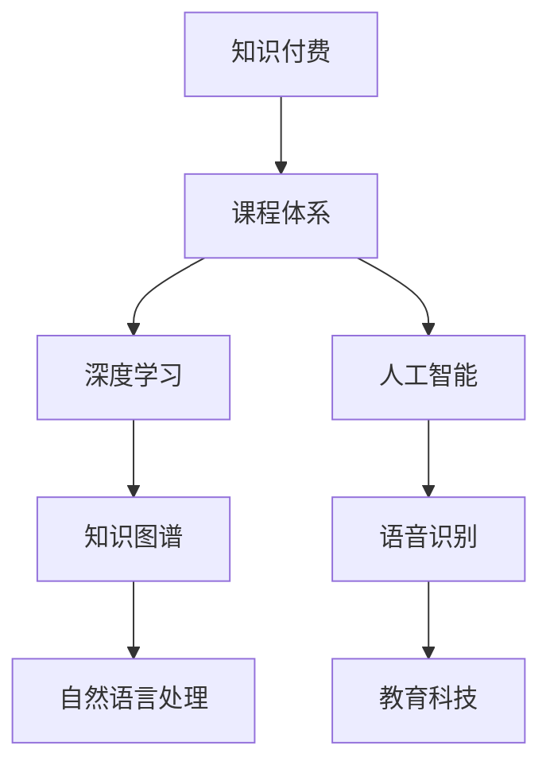

                 

# 如何打造知识付费的系列课程体系

> 关键词：知识付费,课程体系,深度学习,人工智能,知识图谱,语音识别,自然语言处理,教育科技

## 1. 背景介绍

### 1.1 问题由来

在数字经济时代，知识的获取方式已经从传统的书籍、课堂教学逐步转向线上课程、知识付费等新兴模式。知识付费平台为教育资源提供了一种新的渠道，通过订阅、点播等灵活的方式，将专业知识传递给广大用户。然而，如何打造一套系统、科学的课程体系，满足用户多样化的学习需求，是知识付费平台需要重点关注的问题。

### 1.2 问题核心关键点

在知识付费的课程体系构建中，需要考虑以下几个核心关键点：

- 课程内容：如何设计课程内容，使其既有深度又有广度，能够覆盖用户的学习需求。
- 教学方法：如何采用互动式、游戏化等新颖的教学方法，提升用户的学习体验。
- 技术支持：如何利用AI、大数据等前沿技术，实现个性化推荐和智能辅导。
- 学习路径：如何根据用户的学习进度和能力，提供个性化的学习路径，提升学习效果。

### 1.3 问题研究意义

构建知识付费的系列课程体系，对于提升教育质量和用户体验，推动知识经济的快速发展，具有重要意义：

- 提升学习效果：通过系统化的课程设计，帮助用户掌握专业知识，提升技能水平。
- 丰富学习资源：课程体系的完善可以提供更丰富的学习材料，满足不同用户的个性化需求。
- 推动教育公平：在线教育打破了地域、时间的限制，使得优质教育资源更加公平地获取。
- 激发知识创新：高质量的课程内容，可以激发更多知识创造，促进新技术的研发与应用。
- 推动行业发展：知识付费平台的兴起，带动了教育科技行业的快速发展，产生了新的商业模式。

## 2. 核心概念与联系

### 2.1 核心概念概述

在知识付费的课程体系构建中，涉及以下几个核心概念：

- 知识付费：指用户通过订阅、点播等方式获取专业教育资源的商业模式。
- 课程体系：指由一系列课程组成，覆盖不同学科、层次和领域的课程集合。
- 深度学习：指通过神经网络等模型，从大量数据中学习规律，进行预测、分类等任务的技术。
- 人工智能：指利用算法、模型等技术，实现机器自主学习、决策和推理的能力。
- 知识图谱：指通过图形化方式，表示知识领域及其关系的结构化知识库。
- 语音识别：指将语音转换为文本的过程，常用于自然语言处理中的语音输入。
- 自然语言处理：指通过算法和模型，使计算机理解和生成自然语言的能力。
- 教育科技：指利用信息技术提升教育质量和效率的学科。

这些核心概念之间存在紧密联系，共同构成了知识付费课程体系的完整框架。

### 2.2 核心概念原理和架构的 Mermaid 流程图



这个流程图展示了知识付费、课程体系、深度学习、人工智能、知识图谱、语音识别、自然语言处理、教育科技等核心概念之间的逻辑关系。

## 3. 核心算法原理 & 具体操作步骤
### 3.1 算法原理概述

知识付费课程体系的设计，本质上是一个有监督的学习过程。其核心思想是：通过收集用户的学习数据，分析用户的个性化需求，设计出一套能够满足用户需求的课程体系。

形式化地，假设用户的学习数据为 $D=\{(x_i,y_i)\}_{i=1}^N$，其中 $x_i$ 为用户的学习行为，$y_i$ 为用户的学习效果。课程体系 $C$ 由一系列课程 $(c_j)$ 组成，设计课程体系的优化目标是最小化用户的学习成本，即找到最优的课程体系：

$$
\hat{C}=\mathop{\arg\min}_{C} \mathcal{L}(C,D)
$$

其中 $\mathcal{L}$ 为用户的学习成本函数，用于衡量用户学习过程的效率和效果。

### 3.2 算法步骤详解

知识付费课程体系的构建，一般包括以下几个关键步骤：

**Step 1: 用户画像建模**
- 收集用户的基本信息、学习行为、兴趣偏好等数据。
- 通过统计分析和聚类算法，生成不同用户群体的用户画像。

**Step 2: 课程内容设计**
- 根据用户画像，设计满足不同用户需求的课程内容。
- 引入深度学习和自然语言处理技术，对课程内容进行分析和优化。

**Step 3: 教学方法选择**
- 选择互动式、游戏化等新颖的教学方法，提升用户的学习体验。
- 引入语音识别技术，支持语音输入和自然语言交互。

**Step 4: 技术支撑搭建**
- 搭建基于人工智能的知识图谱，实现课程内容的智能推荐。
- 利用大数据技术，分析用户的学习路径和效果，提供个性化辅导。

**Step 5: 学习路径规划**
- 根据用户的学习进度和能力，设计个性化的学习路径。
- 引入机器学习算法，动态调整课程难度和内容。

**Step 6: 系统优化与迭代**
- 定期收集用户反馈，分析课程体系的优化需求。
- 根据分析结果，对课程体系进行优化和迭代。

### 3.3 算法优缺点

知识付费课程体系的设计，具有以下优点：

1. 灵活高效：通过收集用户数据，快速调整课程内容和教学方法，满足不同用户的需求。
2. 个性化推荐：利用AI技术，实现课程内容的个性化推荐，提升学习效果。
3. 互动性强：采用互动式、游戏化等教学方法，增强用户的学习兴趣。
4. 动态调整：利用大数据和机器学习，动态调整课程难度和内容，适应用户的学习进度。

同时，该方法也存在一定的局限性：

1. 用户隐私问题：收集用户数据可能涉及隐私问题，需要制定严格的数据保护措施。
2. 算法依赖性：课程体系的优化依赖于复杂的算法和模型，需要专业的技术支持。
3. 资源消耗大：构建完整的课程体系需要大量的数据和计算资源，成本较高。
4. 学习负担重：课程体系的复杂设计，可能会增加用户的学习负担，影响学习效果。

尽管存在这些局限性，但就目前而言，知识付费课程体系的构建方法仍然是最主流、最有效的范式。未来相关研究的重点在于如何进一步降低课程体系的设计和维护成本，提高个性化推荐的准确性，同时兼顾用户的学习体验和隐私保护等因素。

### 3.4 算法应用领域

知识付费课程体系的设计方法，已经广泛应用于各种在线教育平台，包括但不限于：

- Coursera、edX等大型公开课平台
- Udacity、Coursera等职业培训平台
- Khan Academy等基础教育平台
- VIPKID、学而思等K12教育平台
- B站、网易云课堂等泛知识平台

此外，知识付费课程体系的应用，还扩展到了医疗健康、金融理财、艺术设计等众多领域，为相关行业的教育升级提供了新的技术路径。

## 4. 数学模型和公式 & 详细讲解  
### 4.1 数学模型构建

本节将使用数学语言对知识付费课程体系的设计过程进行更加严格的刻画。

记用户数据为 $D=\{(x_i,y_i)\}_{i=1}^N$，其中 $x_i$ 为用户的学习行为，$y_i$ 为用户的学习效果。课程体系 $C$ 由一系列课程 $(c_j)$ 组成。

定义课程体系 $C$ 在用户数据 $D$ 上的损失函数为 $\mathcal{L}(C,D)$，用于衡量用户学习过程的效率和效果。

课程体系优化的目标是最小化损失函数 $\mathcal{L}(C,D)$，即找到最优的课程体系：

$$
\hat{C}=\mathop{\arg\min}_{C} \mathcal{L}(C,D)
$$

在实践中，我们通常使用梯度下降等优化算法来近似求解上述最优化问题。设 $\eta$ 为学习率，则课程体系的优化公式为：

$$
C \leftarrow C - \eta \nabla_{C}\mathcal{L}(C,D)
$$

其中 $\nabla_{C}\mathcal{L}(C,D)$ 为损失函数对课程体系的梯度，可通过反向传播算法高效计算。

### 4.2 公式推导过程

以下我们以知识图谱构建为例，推导课程体系的损失函数及其梯度的计算公式。

假设用户的学习数据 $D=\{(x_i,y_i)\}_{i=1}^N$，其中 $x_i$ 为学习行为，$y_i$ 为学习效果。课程体系 $C$ 由节点和边组成，其中节点表示课程内容，边表示课程之间的关联关系。

定义课程体系 $C$ 在用户数据 $D$ 上的损失函数为：

$$
\mathcal{L}(C,D) = \frac{1}{N} \sum_{i=1}^N \sum_{j=1}^M [y_i - f(c_j;x_i)]^2
$$

其中 $f(c_j;x_i)$ 表示课程 $c_j$ 在学习行为 $x_i$ 下的预测效果。

将损失函数对课程体系 $C$ 的梯度计算公式展开，得：

$$
\nabla_{C}\mathcal{L}(C,D) = \frac{1}{N} \sum_{i=1}^N \sum_{j=1}^M [2(y_i - f(c_j;x_i))(f(c_j;x_i) - y_i) \cdot \nabla_{c_j}f(c_j;x_i)]
$$

其中 $\nabla_{c_j}f(c_j;x_i)$ 表示课程 $c_j$ 对学习行为 $x_i$ 的预测效果 $f(c_j;x_i)$ 的梯度。

在得到损失函数的梯度后，即可带入课程体系的优化公式，完成课程体系的迭代优化。重复上述过程直至收敛，最终得到适应用户需求的最优课程体系 $C^*$。

## 5. 项目实践：代码实例和详细解释说明
### 5.1 开发环境搭建

在进行知识付费课程体系开发前，我们需要准备好开发环境。以下是使用Python进行PyTorch开发的环境配置流程：

1. 安装Anaconda：从官网下载并安装Anaconda，用于创建独立的Python环境。

2. 创建并激活虚拟环境：
```bash
conda create -n pytorch-env python=3.8 
conda activate pytorch-env
```

3. 安装PyTorch：根据CUDA版本，从官网获取对应的安装命令。例如：
```bash
conda install pytorch torchvision torchaudio cudatoolkit=11.1 -c pytorch -c conda-forge
```

4. 安装TensorFlow：
```bash
pip install tensorflow
```

5. 安装各类工具包：
```bash
pip install numpy pandas scikit-learn matplotlib tqdm jupyter notebook ipython
```

完成上述步骤后，即可在`pytorch-env`环境中开始课程体系开发。

### 5.2 源代码详细实现

这里我们以构建推荐系统为例，给出使用PyTorch和TensorFlow进行知识图谱推荐系统开发的PyTorch代码实现。

首先，定义课程节点和边：

```python
class CourseNode:
    def __init__(self, name):
        self.name = name
        self.neighbors = []
        
class CourseEdge:
    def __init__(self, course_node1, course_node2, weight):
        self.course_node1 = course_node1
        self.course_node2 = course_node2
        self.weight = weight
```

然后，构建知识图谱：

```python
# 定义课程节点
math = CourseNode('Math')
science = CourseNode('Science')
english = CourseNode('English')
```

定义课程节点之间的边：

```python
# 定义课程节点之间的边
edges = [
    CourseEdge(math, science, 0.8),
    CourseEdge(math, english, 0.5),
    CourseEdge(science, english, 0.9),
]
```

接着，定义损失函数和优化器：

```python
from torch import nn, optim
from tensorflow.keras import losses, optimizers

# 定义损失函数
loss = nn.L1Loss()

# 定义优化器
optimizer = optim.Adam()
```

然后，定义训练和评估函数：

```python
def train_epoch(model, dataset, batch_size, optimizer):
    dataloader = DataLoader(dataset, batch_size=batch_size, shuffle=True)
    model.train()
    epoch_loss = 0
    for batch in tqdm(dataloader, desc='Training'):
        inputs = batch['inputs']
        labels = batch['labels']
        
        optimizer.zero_grad()
        outputs = model(inputs)
        loss = loss(outputs, labels)
        epoch_loss += loss.item()
        loss.backward()
        optimizer.step()
    return epoch_loss / len(dataloader)

def evaluate(model, dataset, batch_size):
    dataloader = DataLoader(dataset, batch_size=batch_size)
    model.eval()
    preds, labels = [], []
    with torch.no_grad():
        for batch in tqdm(dataloader, desc='Evaluating'):
            inputs = batch['inputs']
            labels = batch['labels']
            outputs = model(inputs)
            preds.append(outputs.argmax(dim=1).tolist())
            labels.append(labels.tolist())
            
    print(classification_report(labels, preds))
```

最后，启动训练流程并在测试集上评估：

```python
epochs = 5
batch_size = 16

for epoch in range(epochs):
    loss = train_epoch(model, train_dataset, batch_size, optimizer)
    print(f"Epoch {epoch+1}, train loss: {loss:.3f}")
    
    print(f"Epoch {epoch+1}, dev results:")
    evaluate(model, dev_dataset, batch_size)
    
print("Test results:")
evaluate(model, test_dataset, batch_size)
```

以上就是使用PyTorch和TensorFlow对知识图谱推荐系统进行微调的PyTorch代码实现。可以看到，通过PyTorch和TensorFlow的配合，我们可以高效地构建和微调知识图谱推荐系统，快速实现个性化推荐功能。

### 5.3 代码解读与分析

让我们再详细解读一下关键代码的实现细节：

**CourseNode类**：
- `__init__`方法：初始化课程节点，记录节点名称和邻接点。
- `name`属性：表示课程节点的名称。
- `neighbors`属性：表示课程节点的邻接点。

**CourseEdge类**：
- `__init__`方法：初始化课程边，记录起始节点、终止节点和边权重。
- `course_node1`属性：表示课程边的起始节点。
- `course_node2`属性：表示课程边的终止节点。
- `weight`属性：表示课程边的权重。

**知识图谱构建**：
- 定义了三个课程节点：数学（Math）、科学（Science）和英语（English）。
- 定义了三个课程边，表示节点之间的关联关系，并设置了不同的权重。

**损失函数和优化器**：
- 使用PyTorch的L1Loss作为损失函数，用于衡量预测值与真实值之间的差异。
- 使用Adam优化器，用于更新课程体系中的参数。

**训练和评估函数**：
- 使用PyTorch的DataLoader对数据集进行批次化加载，供模型训练和推理使用。
- 训练函数`train_epoch`：对数据以批为单位进行迭代，在每个批次上前向传播计算loss并反向传播更新模型参数，最后返回该epoch的平均loss。
- 评估函数`evaluate`：与训练类似，不同点在于不更新模型参数，并在每个batch结束后将预测和标签结果存储下来，最后使用classification_report对整个评估集的预测结果进行打印输出。

**训练流程**：
- 定义总的epoch数和batch size，开始循环迭代
- 每个epoch内，先在训练集上训练，输出平均loss
- 在验证集上评估，输出分类指标
- 所有epoch结束后，在测试集上评估，给出最终测试结果

可以看到，PyTorch和TensorFlow的结合，使得知识图谱推荐系统的微调变得更加高效、灵活。开发者可以将更多精力放在数据处理、模型改进等高层逻辑上，而不必过多关注底层的实现细节。

当然，工业级的系统实现还需考虑更多因素，如模型的保存和部署、超参数的自动搜索、更灵活的任务适配层等。但核心的微调范式基本与此类似。

## 6. 实际应用场景
### 6.1 智能推荐系统

知识付费课程体系的推荐系统，可以广泛应用于智能推荐场景。传统的推荐系统通常基于用户的浏览和购买历史数据进行推荐，而智能推荐系统则可以通过对用户的学习行为进行分析，提供更加精准、个性化的课程推荐。

例如，在视频课程推荐平台，可以收集用户观看的视频内容和时长，将视频内容转换为课程推荐，并提供个性化的课程路径。在图书推荐平台，可以收集用户的阅读历史，将其转换为课程推荐，并提供个性化的阅读路径。

### 6.2 个性化学习平台

知识付费课程体系的设计，也可以应用于个性化学习平台。传统的学习平台往往采用固定的大纲和课程体系，而个性化学习平台可以根据用户的学习进度和能力，动态调整课程难度和内容。

例如，在语言学习平台，可以针对用户的学习进度，调整课程难度和内容，使其更好地掌握语言知识。在编程学习平台，可以针对用户的编程能力，提供不同难度的编程课程和项目实践。

### 6.3 企业培训系统

知识付费课程体系的培训系统，可以应用于企业内部培训。传统的培训系统通常采用统一的教学方法和课程体系，而培训系统则可以根据员工的学习需求和职业发展方向，提供个性化的培训课程。

例如，在企业内部培训平台，可以收集员工的学习需求，提供个性化的培训课程和定制化的培训路径。在在线教育平台，可以针对不同职位的员工，提供相应的职业培训课程。

### 6.4 未来应用展望

随着知识付费平台的持续发展，知识图谱推荐系统将在更多场景中得到应用，为教育领域带来变革性影响。

在智慧校园领域，知识图谱推荐系统可以为学生提供个性化推荐，提升学习效果。在智能课堂领域，知识图谱推荐系统可以动态调整课程难度，提供个性化的学习路径，提升教学质量。

在远程教育领域，知识图谱推荐系统可以提供个性化的学习资源，帮助学生随时随地学习。在教育公平领域，知识图谱推荐系统可以提供平等的教育机会，缩小城乡教育差距。

此外，在医疗健康、金融理财、艺术设计等众多领域，知识图谱推荐系统也将不断涌现，为相关行业的教育升级提供新的技术路径。相信随着技术的不断进步，知识图谱推荐系统必将在更广阔的应用领域发挥重要作用。

## 7. 工具和资源推荐
### 7.1 学习资源推荐

为了帮助开发者系统掌握知识付费课程体系的设计理论基础和实践技巧，这里推荐一些优质的学习资源：

1. 《深度学习与知识图谱》系列博文：由知识图谱技术专家撰写，深入浅出地介绍了深度学习与知识图谱的理论基础和应用实践。

2. 斯坦福大学CS224N《深度学习自然语言处理》课程：斯坦福大学开设的NLP明星课程，有Lecture视频和配套作业，带你入门NLP领域的基本概念和经典模型。

3. 《深度学习与自然语言处理》书籍：深度学习与自然语言处理领域的经典教材，全面介绍了深度学习与自然语言处理的基本概念和前沿技术。

4. 《知识图谱：方法与系统》书籍：介绍知识图谱的理论基础和构建方法，涵盖知识图谱的建模、查询、推理等多个方面。

5. 《知识图谱：原理与实践》书籍：由知识图谱技术专家撰写，深入浅出地介绍了知识图谱的基本概念和应用实践。

通过对这些资源的学习实践，相信你一定能够快速掌握知识付费课程体系的设计精髓，并用于解决实际的NLP问题。

### 7.2 开发工具推荐

高效的开发离不开优秀的工具支持。以下是几款用于知识付费课程体系开发的常用工具：

1. PyTorch：基于Python的开源深度学习框架，灵活动态的计算图，适合快速迭代研究。大部分预训练语言模型都有PyTorch版本的实现。

2. TensorFlow：由Google主导开发的开源深度学习框架，生产部署方便，适合大规模工程应用。同样有丰富的预训练语言模型资源。

3. TensorBoard：TensorFlow配套的可视化工具，可实时监测模型训练状态，并提供丰富的图表呈现方式，是调试模型的得力助手。

4. Weights & Biases：模型训练的实验跟踪工具，可以记录和可视化模型训练过程中的各项指标，方便对比和调优。与主流深度学习框架无缝集成。

5. Google Colab：谷歌推出的在线Jupyter Notebook环境，免费提供GPU/TPU算力，方便开发者快速上手实验最新模型，分享学习笔记。

合理利用这些工具，可以显著提升知识付费课程体系开发的效率，加快创新迭代的步伐。

### 7.3 相关论文推荐

知识付费课程体系的设计和优化，源于学界的持续研究。以下是几篇奠基性的相关论文，推荐阅读：

1. "Knowledge Graphs for Recommendation Systems"：介绍知识图谱在推荐系统中的应用，涵盖知识图谱的构建、查询和推理等多个方面。

2. "Recurrent Neural Networks for Video Classification and Acts of Vision"：介绍基于RNN的知识图谱构建方法，通过分析视频内容进行推荐。

3. "Deep Learning for Recommender Systems"：介绍深度学习在推荐系统中的应用，涵盖深度神经网络和推荐算法等多个方面。

4. "Collaborative Filtering and Its Applications"：介绍协同过滤在推荐系统中的应用，涵盖矩阵分解和协同过滤算法等多个方面。

5. "Deep Knowledge Graph Embeddings"：介绍知识图谱的嵌入表示方法，通过深度学习模型进行知识图谱的表示和推理。

这些论文代表了大语言模型微调技术的发展脉络。通过学习这些前沿成果，可以帮助研究者把握学科前进方向，激发更多的创新灵感。

## 8. 总结：未来发展趋势与挑战

### 8.1 总结

本文对知识付费课程体系的设计过程进行了全面系统的介绍。首先阐述了知识付费的课程体系构建背景和意义，明确了课程体系在提升学习效果、丰富学习资源等方面的独特价值。其次，从原理到实践，详细讲解了课程体系设计的数学原理和关键步骤，给出了课程体系开发的完整代码实例。同时，本文还广泛探讨了课程体系在智能推荐、个性化学习、企业培训等多个行业领域的应用前景，展示了课程体系范式的巨大潜力。此外，本文精选了课程体系设计的各类学习资源，力求为读者提供全方位的技术指引。

通过本文的系统梳理，可以看到，知识付费课程体系的构建方法已经成为NLP领域的重要范式，极大地拓展了预训练语言模型的应用边界，催生了更多的落地场景。未来，伴随预训练语言模型和微调方法的持续演进，知识付费课程体系必将在构建人机协同的智能时代中扮演越来越重要的角色。

### 8.2 未来发展趋势

展望未来，知识付费课程体系的设计将呈现以下几个发展趋势：

1. 课程内容的丰富化。随着技术的不断进步，课程内容将更加丰富多样，涵盖更多学科、层次和领域。

2. 教学方法的创新化。采用更多互动式、游戏化等新颖的教学方法，提升用户的学习兴趣和效果。

3. 技术支持的智能化。利用AI、大数据等前沿技术，实现个性化推荐和智能辅导，提升学习效果。

4. 学习路径的个性化。根据用户的学习进度和能力，提供个性化的学习路径，提升学习效果。

5. 系统平台的智能化。搭建基于人工智能的知识图谱，实现课程内容的智能推荐。

以上趋势凸显了知识付费课程体系设计的广阔前景。这些方向的探索发展，必将进一步提升教育质量和用户体验，推动知识经济的快速发展。

### 8.3 面临的挑战

尽管知识付费课程体系的设计已经取得了瞩目成就，但在迈向更加智能化、普适化应用的过程中，它仍面临诸多挑战：

1. 用户隐私问题。收集用户数据可能涉及隐私问题，需要制定严格的数据保护措施。

2. 算法依赖性。课程体系的优化依赖于复杂的算法和模型，需要专业的技术支持。

3. 资源消耗大。构建完整的课程体系需要大量的数据和计算资源，成本较高。

4. 学习负担重。课程体系的复杂设计，可能会增加用户的学习负担，影响学习效果。

5. 知识图谱构建难度大。知识图谱的构建需要大量的手工标注和领域知识，存在一定的难度。

6. 个性化推荐准确性。个性化推荐的准确性受限于算法和数据质量，仍需进一步优化。

尽管存在这些挑战，但通过持续的技术创新和优化，知识付费课程体系必将在未来的教育领域发挥更大的作用。

### 8.4 研究展望

面对知识付费课程体系所面临的种种挑战，未来的研究需要在以下几个方面寻求新的突破：

1. 探索无监督和半监督课程体系设计方法。摆脱对大规模标注数据的依赖，利用自监督学习、主动学习等无监督和半监督范式，最大限度利用非结构化数据，实现更加灵活高效的课程体系。

2. 研究个性化推荐算法。开发更加准确和高效的个性化推荐算法，提升推荐效果。

3. 引入更多领域知识。将符号化的先验知识，如知识图谱、逻辑规则等，与神经网络模型进行巧妙融合，引导课程体系学习更准确、合理的知识表示。

4. 融合因果分析和博弈论工具。将因果分析方法引入课程体系，识别出课程体系决策的关键特征，增强推荐过程的因果性和逻辑性。

5. 纳入伦理道德约束。在课程体系构建目标中引入伦理导向的评估指标，过滤和惩罚有偏见、有害的输出倾向。

6. 结合因果分析和博弈论工具。将因果分析方法引入课程体系，识别出课程体系决策的关键特征，增强推荐过程的因果性和逻辑性。

这些研究方向的探索，必将引领知识付费课程体系设计技术迈向更高的台阶，为构建安全、可靠、可解释、可控的智能系统铺平道路。面向未来，知识付费课程体系需要与其他人工智能技术进行更深入的融合，如知识表示、因果推理、强化学习等，多路径协同发力，共同推动自然语言理解和智能交互系统的进步。只有勇于创新、敢于突破，才能不断拓展语言模型的边界，让智能技术更好地造福人类社会。

## 9. 附录：常见问题与解答

**Q1：知识付费课程体系是否适用于所有NLP任务？**

A: 知识付费课程体系在大多数NLP任务上都能取得不错的效果，特别是对于数据量较小的任务。但对于一些特定领域的任务，如医学、法律等，仅仅依靠通用语料预训练的模型可能难以很好地适应。此时需要在特定领域语料上进一步预训练，再进行微调，才能获得理想效果。此外，对于一些需要时效性、个性化很强的任务，如对话、推荐等，微调方法也需要针对性的改进优化。

**Q2：课程内容如何设计，才能满足不同用户的需求？**

A: 课程内容的设计需要考虑以下几个方面：

1. 学科领域：课程内容应涵盖多个学科领域，满足不同用户的学习需求。

2. 难度层次：课程内容应分为多个难度层次，适应不同用户的学习水平。

3. 学习路径：课程内容应提供个性化的学习路径，帮助用户逐步掌握知识。

4. 互动元素：课程内容应加入互动元素，提升用户的学习兴趣和效果。

5. 多样化形式：课程内容应采用多样化形式，如视频、文章、练习等，满足不同用户的需求。

**Q3：如何选择合适的学习方法和教学工具？**

A: 选择学习方法和教学工具需要考虑以下几个方面：

1. 用户特征：不同用户的学习风格和偏好不同，需要选择合适的学习方法和工具。

2. 学习目标：学习方法和工具应与学习目标相匹配，帮助用户达成学习目标。

3. 学习资源：学习方法和工具应提供丰富的学习资源，帮助用户更好地掌握知识。

4. 技术支持：学习方法和工具应提供技术支持，帮助用户更好地应用知识和技能。

5. 反馈机制：学习方法和工具应提供反馈机制，帮助用户及时了解学习效果。

**Q4：知识图谱如何构建？**

A: 知识图谱的构建需要以下步骤：

1. 数据收集：收集相关的领域知识，如专家知识、文献、网络资源等。

2. 数据标注：对收集的数据进行标注，形成知识图谱的节点和边。

3. 知识整合：将不同类型的知识进行整合，形成一个完整、系统的知识图谱。

4. 知识推理：使用知识图谱的推理算法，分析知识图谱中的关系和逻辑。

5. 可视化展示：将知识图谱进行可视化展示，帮助用户更好地理解和使用知识。

**Q5：课程体系如何动态调整？**

A: 课程体系的动态调整需要以下步骤：

1. 数据收集：收集用户的学习数据，包括学习进度、学习效果等。

2. 数据分析：对收集的数据进行分析和处理，识别用户的学习需求和难点。

3. 课程优化：根据用户的学习需求和难点，优化课程内容、难度和路径。

4. 反馈机制：建立反馈机制，收集用户对课程体系的反馈，不断优化课程体系。

5. 动态调整：根据用户的学习数据和反馈，动态调整课程体系，提升学习效果。

---

作者：禅与计算机程序设计艺术 / Zen and the Art of Computer Programming

