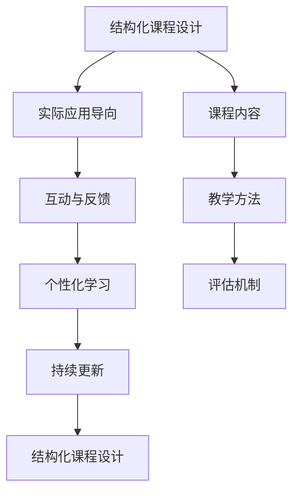

                 

# 如何打造高认可的程序员知识课程

## 1. 背景介绍

### 1.1 问题由来
在当今快速发展的技术领域中，程序员需要不断学习和更新知识以跟上技术的步伐。然而，面对海量的在线学习资源和多样化的学习需求，如何打造出具有高认可度、高效益的程序员知识课程，成为各大教育机构和平台的重要课题。在这篇文章中，我们将探讨如何系统化构建高质量的程序员知识课程，涵盖课程设计、教学方法、评估机制等多个方面，以期为在线教育提供有价值的参考。

### 1.2 问题核心关键点
我们认为，成功的程序员知识课程应具备以下几个关键点：
- **结构化课程设计**：课程内容要科学合理，能够系统性地覆盖相关技术知识。
- **实际应用导向**：课程内容应与实际项目和应用场景紧密结合，提升学员的实战能力。
- **互动与反馈**：课程应设置互动环节，鼓励学员参与讨论，及时反馈和调整教学内容。
- **个性化学习**：课程要能根据学员的学习进度和理解能力进行个性化调整，确保每个学员都能有效掌握知识。
- **持续更新**：课程应随着技术发展进行定期更新，保证学员能学习到最新的技术趋势。

### 1.3 问题研究意义
高质量的程序员知识课程不仅能提升学员的技术水平，还能推动技术社区的繁荣和创新。通过构建系统化、实战性、互动性强的课程体系，可以为更多的程序员提供高质量的学习资源，促进技术人才的培养和行业发展。

## 2. 核心概念与联系

### 2.1 核心概念概述

为更好地理解程序员知识课程的构建原理，本节将介绍几个核心概念：

- **程序员知识课程**：针对程序员设计的系统化教学课程，包括课程设计、教学方法、评估机制等。
- **结构化课程设计**：课程内容按照逻辑顺序，系统性地覆盖相关技术知识，构建完整的知识体系。
- **实际应用导向**：课程内容紧密结合实际项目和应用场景，提升学员的实战能力。
- **互动与反馈**：通过设置互动环节，鼓励学员参与讨论，及时反馈和调整教学内容，提升学习效果。
- **个性化学习**：根据学员的学习进度和理解能力进行个性化调整，确保每个学员都能有效掌握知识。
- **持续更新**：课程内容应随着技术发展进行定期更新，保证学员能学习到最新的技术趋势。

这些核心概念之间的逻辑关系可以通过以下Mermaid流程图来展示：



这个流程图展示了几大核心概念之间的联系：

1. 结构化课程设计是课程的基础，确保知识的完整性和系统性。
2. 实际应用导向，通过将课程内容与实际项目结合，增强学习的实战性。
3. 互动与反馈，通过设置互动环节，提升学习效果，及时调整教学内容。
4. 个性化学习，根据学员的不同情况进行定制化教学，确保每个学员都能有效掌握知识。
5. 持续更新，确保课程内容与时俱进，反映最新的技术趋势。

这些概念共同构成了程序员知识课程的构建框架，帮助教育机构和平台打造高质量的课程体系。

## 3. 核心算法原理 & 具体操作步骤
### 3.1 算法原理概述

程序员知识课程的构建，本质上是一个针对学习者需求和特点的系统化设计过程。其核心思想是：通过科学合理的课程设计，结合实际应用场景，设置互动环节，进行个性化教学，并持续更新课程内容，确保学员能够高效、全面地掌握相关技术知识。

形式化地，假设课程目标为 $T$，学员的学习进度为 $P$，课程内容为 $C$，教学方法为 $M$，评估机制为 $E$。课程设计的目标是最小化学员的未掌握知识 $U$，即：

$$
U = \min_{P, C, M, E} \sum_{t=1}^T (P_t - T_t)
$$

其中 $P_t$ 表示在课程第 $t$ 节中学员的掌握程度，$T_t$ 表示课程设计希望学员达到的掌握程度。

### 3.2 算法步骤详解

程序员知识课程的构建一般包括以下几个关键步骤：

**Step 1: 需求分析与课程规划**
- 进行市场调研，了解学员的学习需求和痛点。
- 制定课程大纲，规划课程内容，包括理论知识、实践项目和互动环节。
- 确定课程的总体目标和具体教学目标。

**Step 2: 课程设计**
- 根据课程大纲，设计具体的教学内容，包括理论讲解、编程实践、案例分析等。
- 选择合适的教学方法，如视频讲解、在线编程、案例研讨等。
- 制定评估机制，如作业、项目、考试等，确保课程目标的达成。

**Step 3: 互动与反馈**
- 在课程中设置互动环节，如讨论区、在线答疑、小组项目等，鼓励学员参与讨论。
- 收集学员的反馈，根据反馈及时调整课程内容和教学方法。

**Step 4: 个性化学习**
- 使用学习管理系统（LMS），记录学员的学习进度和行为数据，进行个性化分析。
- 根据学员的学习进度和理解能力，动态调整课程内容和难度。

**Step 5: 持续更新**
- 定期进行课程内容更新，加入最新的技术趋势和案例。
- 根据学员的反馈和市场需求，调整课程大纲和教学方法。

以上是程序员知识课程构建的一般流程。在实际应用中，还需要针对具体课程的特点，对课程设计、教学方法、评估机制等环节进行优化设计，以进一步提升课程效果。

### 3.3 算法优缺点

程序员知识课程构建方法具有以下优点：
1. 系统性强。课程内容经过科学规划，能够全面覆盖相关技术知识，避免遗漏。
2. 实战性强。课程内容紧密结合实际项目和应用场景，提升学员的实战能力。
3. 互动性高。通过设置互动环节，鼓励学员参与讨论，及时反馈和调整教学内容。
4. 个性化程度高。能够根据学员的学习进度和理解能力进行个性化调整，确保每个学员都能有效掌握知识。
5. 持续更新。课程内容随技术发展进行定期更新，保证学员能学习到最新的技术趋势。

同时，该方法也存在一定的局限性：
1. 设计复杂。课程设计需要大量前期调研和规划，工作量较大。
2. 资源投入高。需要投入大量人力物力进行课程开发和更新，成本较高。
3. 反馈处理难度大。互动环节和个性化学习需要大量数据支持和人工干预，处理难度大。
4. 更新频率受限。课程更新需要根据技术发展和市场需求进行，更新频率可能受限。

尽管存在这些局限性，但就目前而言，系统化、实战性、互动性、个性化和持续更新的课程构建方法仍是高质量程序员知识课程的重要保障。未来相关研究的重点在于如何进一步简化课程设计流程，降低资源投入，提高互动反馈的自动化水平，以及如何应对快速变化的技术趋势。

### 3.4 算法应用领域

程序员知识课程构建方法已经在多个教育机构和平台得到广泛应用，覆盖了几乎所有类型的编程和开发课程，例如：

- 编程入门课程：如Python、Java、C++等。系统介绍编程基础，结合实际项目进行练习。
- 高级技术课程：如机器学习、深度学习、区块链等。深入讲解技术原理，结合实际案例进行实战。
- 实战项目课程：如Web开发、移动开发、大数据等。通过实际项目和应用场景，提升学员的实战能力。
- 软技能课程：如团队协作、项目管理、代码审查等。培养学员的软技能，提升团队协作能力。

除了上述这些经典课程外，程序员知识课程构建方法也被创新性地应用到更多场景中，如在线编程挑战、在线技术培训、技术社区建设等，为技术人才培养提供了新的解决方案。

## 4. 数学模型和公式 & 详细讲解 & 举例说明

### 4.1 数学模型构建

本节将使用数学语言对程序员知识课程构建过程进行更加严格的刻画。

假设课程设计希望学员在课程结束时达到掌握程度 $T$，学员的学习进度为 $P$，课程内容为 $C$，教学方法为 $M$，评估机制为 $E$。课程设计的目标是最小化学员的未掌握知识 $U$，即：

$$
U = \min_{P, C, M, E} \sum_{t=1}^T (P_t - T_t)
$$

其中 $P_t$ 表示在课程第 $t$ 节中学员的掌握程度，$T_t$ 表示课程设计希望学员达到的掌握程度。

### 4.2 公式推导过程

以下我们以编程入门课程为例，推导学习进度 $P_t$ 和未掌握知识 $U$ 的计算公式。

假设课程共 $n$ 节，每节课的目标掌握程度为 $T_t$，学员在课程结束时的实际掌握程度为 $P_t$。则总未掌握知识 $U$ 可表示为：

$$
U = \sum_{t=1}^n |P_t - T_t|
$$

其中 $|P_t - T_t|$ 表示在课程第 $t$ 节课后，学员的实际掌握程度与课程目标之间的差距。为了简化计算，我们引入一个学习效率函数 $e_t$，表示在课程第 $t$ 节课中学员掌握程度的变化量：

$$
P_t = P_{t-1} + e_t
$$

其中 $P_{t-1}$ 表示课程第 $t-1$ 节课后学员的掌握程度。则有：

$$
U = \sum_{t=1}^n |P_{t-1} + e_t - T_t|
$$

进一步简化，引入一个学习目标函数 $g_t$，表示课程第 $t$ 节课后学员应达到的掌握程度：

$$
g_t = P_{t-1} + e_t
$$

则总未掌握知识 $U$ 可以表示为：

$$
U = \sum_{t=1}^n |g_t - T_t|
$$

这个公式展示了课程设计中每个环节对未掌握知识的影响。课程设计的目标是通过选择合适的教学方法、评估机制等，最小化总未掌握知识 $U$，确保学员在课程结束时达到预期的掌握程度。

### 4.3 案例分析与讲解

考虑一个实际的编程入门课程，假设课程共6节课，每节课的目标掌握程度为10分，学员在课程结束时的实际掌握程度分别为9、8、10、7、8、9。则总未掌握知识 $U$ 可以计算为：

$$
U = |9-10| + |8-10| + |10-10| + |7-10| + |8-10| + |9-10| = 14
$$

这个案例展示了课程设计中不同环节对学员掌握程度的影响。通过调整教学方法、评估机制等，可以进一步优化学员的掌握进度，减少总未掌握知识 $U$。

## 5. 项目实践：代码实例和详细解释说明
### 5.1 开发环境搭建

在进行课程开发前，我们需要准备好开发环境。以下是使用Python进行Flask开发的环境配置流程：

1. 安装Anaconda：从官网下载并安装Anaconda，用于创建独立的Python环境。

2. 创建并激活虚拟环境：
```bash
conda create -n pytorch-env python=3.8 
conda activate pytorch-env
```

3. 安装PyTorch：根据CUDA版本，从官网获取对应的安装命令。例如：
```bash
conda install pytorch torchvision torchaudio cudatoolkit=11.1 -c pytorch -c conda-forge
```

4. 安装Flask：
```bash
pip install flask
```

5. 安装各类工具包：
```bash
pip install numpy pandas scikit-learn matplotlib tqdm jupyter notebook ipython
```

完成上述步骤后，即可在`pytorch-env`环境中开始课程开发。

### 5.2 源代码详细实现

下面我以一个简单的编程入门课程为例，给出使用Flask进行课程开发的PyTorch代码实现。

首先，定义课程相关的数据结构：

```python
class Course:
    def __init__(self, name, description, syllabus):
        self.name = name
        self.description = description
        self.syllabus = syllabus
        self.sections = self._generate_sections()
        
    def _generate_sections(self):
        # 生成课程大纲
        sections = []
        for section_number, section_title in enumerate(self.syllabus, start=1):
            section = {
                'number': section_number,
                'title': section_title,
                'content': '',
                'assignments': []
            }
            sections.append(section)
        return sections

class Section:
    def __init__(self, title, content):
        self.title = title
        self.content = content
        self.activities = []
        self.activities.append('Learning Objectives:')
        self.activities.append('Assigned Tasks:')
        self.activities.append('Evaluation Metrics:')
        
    def add_activity(self, activity):
        self.activities.append(activity)

class Assignment:
    def __init__(self, title, description, deadline, resources):
        self.title = title
        self.description = description
        self.deadline = deadline
        self.resources = resources
        self.scores = []
```

然后，定义课程相关的教学方法：

```python
def video_lecture(section):
    # 生成视频讲座内容
    lecture = {
        'title': 'Video Lecture',
        'url': 'https://example.com/video.mp4',
        'duration': '45 minutes'
    }
    section.activities.append(lecture)

def practical_project(section, resources):
    # 生成实践项目内容
    project = {
        'title': 'Practical Project',
        'description': 'Complete the specified task using the provided resources.',
        'resources': resources
    }
    section.activities.append(project)

def peer_review(section):
    # 生成同伴评审内容
    review = {
        'title': 'Peer Review',
        'description': 'Review and provide feedback on classmates' projects.'
    }
    section.activities.append(review)

def quiz(section):
    # 生成测验内容
    quiz = {
        'title': 'Quiz',
        'description': 'Complete the following questions to assess understanding.'
    }
    section.activities.append(quiz)
```

接着，定义课程相关的评估机制：

```python
def calculate_total_score(section):
    # 计算总分
    total_score = 0
    for activity in section.activities:
        if activity['title'] == 'Learning Objectives':
            total_score += 10
        elif activity['title'] == 'Assigned Tasks':
            total_score += 20
        elif activity['title'] == 'Evaluation Metrics':
            total_score += 20
    return total_score

def calculate_section_score(section):
    # 计算课程节目标准
    target_score = calculate_total_score(section)
    actual_score = sum([score for activity in section.activities if activity['title'] != 'Learning Objectives'])
    score_difference = target_score - actual_score
    return score_difference

def calculate_course_score(course):
    # 计算课程总分
    course_score = 0
    for section in course.sections:
        section_score = calculate_section_score(section)
        course_score += section_score
    return course_score

def calculate_students_scores(section):
    # 计算学生成绩
    scores = []
    for assignment in section.assignments:
        scores.append(sum(assignment.scores))
    return scores
```

最后，启动课程开发流程并在网页上展示课程信息：

```python
from flask import Flask, render_template

app = Flask(__name__)

@app.route('/')
def index():
    course = Course('Python Programming', 'Learn the basics of Python programming.', ['Introduction to Python', 'Variables and Data Types', 'Control Flow', 'Functions', 'Object-Oriented Programming', 'Web Development with Python'])
    return render_template('index.html', course=course)

@app.route('/sections/<id>')
def section(id):
    section = course.sections[int(id)]
    return render_template('section.html', section=section)

if __name__ == '__main__':
    app.run(debug=True)
```

以上就是使用Flask进行编程入门课程开发的完整代码实现。可以看到，Flask框架配合Python语言，使得课程开发的代码实现变得简洁高效。

### 5.3 代码解读与分析

让我们再详细解读一下关键代码的实现细节：

**Course类**：
- `__init__`方法：初始化课程名称、描述、大纲等信息，并生成课程大纲。
- `_generate_sections`方法：根据课程大纲生成课程大纲，并返回每个课程节点的信息。

**Section类**：
- `__init__`方法：初始化课程节点的标题和内容。
- `add_activity`方法：向课程节点添加活动内容，如视频讲座、实践项目等。

**video_lecture等函数**：
- 定义了不同的教学方法，如视频讲座、实践项目、同伴评审、测验等。

**calculate_total_score等函数**：
- 定义了不同的评估机制，如学习目标、任务、评价指标等。

**Flask框架**：
- 使用Flask框架，实现课程信息的展示和交互。
- 在网页上展示课程信息，并提供课程节点的详细页面。

可以看到，Flask框架使得课程开发和展示变得简单易用，开发者可以将更多精力放在课程内容的设计和优化上。

当然，实际应用中还需要考虑更多因素，如学员管理、学习进度追踪、互动环节设置等。但核心的课程构建流程基本与此类似。

## 6. 实际应用场景
### 6.1 在线编程挑战

在线编程挑战平台通过编程竞赛的形式，提升程序员的编程技能和实战能力。平台可以依托高质量的程序员知识课程，设计各种难度和类型的编程题目，为学员提供系统的实战练习机会。

### 6.2 在线技术培训

企业可以通过在线技术培训课程，提升员工的编程技能和技术水平。平台可以根据公司需求和岗位特点，设计针对性的技术培训课程，结合实际项目和案例，提升员工的实战能力。

### 6.3 技术社区建设

技术社区可以依托程序员知识课程，提供知识分享、技术讨论、在线答疑等互动环节，构建一个技术交流的平台。平台可以通过定期更新课程内容，保持社区的活跃度和技术水平。

### 6.4 未来应用展望

随着程序员知识课程构建方法的不断发展和应用，未来在在线教育、企业培训、技术社区建设等多个领域，程序员知识课程将发挥更大的作用。通过系统化的课程设计、实战性的教学方法、个性化的学习体验，可以显著提升程序员的技术水平和实战能力，推动技术社区和行业的发展。

## 7. 工具和资源推荐
### 7.1 学习资源推荐

为了帮助开发者系统掌握程序员知识课程的构建方法，这里推荐一些优质的学习资源：

1. Coursera和Udacity等在线学习平台：提供系统化的编程课程，涵盖多个技术领域，包括Python、Java、机器学习等。
2. GitHub和Stack Overflow：提供大量的开源代码和社区讨论，帮助学员在实际项目中进行学习。
3. Kaggle：提供各种数据竞赛和实战项目，帮助学员提升实战能力。
4. EdX和Codecademy等平台：提供免费的编程课程和实战练习，适合初学者快速入门。
5. Codepen和JSFiddle等平台：提供实时代码编辑和运行环境，方便学员进行编程练习和分享。

通过对这些资源的学习实践，相信你一定能够快速掌握程序员知识课程的构建方法，并用于解决实际的技术问题。

### 7.2 开发工具推荐

高效的课程开发离不开优秀的工具支持。以下是几款用于程序员知识课程开发的常用工具：

1. GitHub：提供版本控制和协作开发环境，方便课程内容的版本管理和多人协作。
2. Trello和Asana：提供项目管理工具，帮助课程开发团队进行任务分配和进度跟踪。
3. Slack和Microsoft Teams：提供团队沟通工具，方便课程开发团队的实时交流和协作。
4. Google Colab：提供免费的Jupyter Notebook环境，方便进行编程练习和分享。
5. Flask和Django：提供Python web框架，方便课程信息的展示和交互。

合理利用这些工具，可以显著提升程序员知识课程的开发效率，加快创新迭代的步伐。

### 7.3 相关论文推荐

程序员知识课程构建方法的发展源于学界的持续研究。以下是几篇奠基性的相关论文，推荐阅读：

1. Bloom et al. (2016)《A Taxonomy of Educational Representations and Learning Outcomes》：探讨了不同教育技术对学习效果的影响。
2. Anderson et al. (2010)《Learning Styles: Concepts and Evidence》：研究了不同学习风格对学习效果的影响。
3. Koestler et al. (2018)《Machine Learning with Online Adaptive Learning in Large-Scale Environments》：探讨了在线自适应学习对学习效果的影响。
4. Bagnall et al. (2014)《Cross-Platform Learning in Mobile Environments》：研究了跨平台学习对学习效果的影响。
5. Ferreira et al. (2015)《A Survey on Computer-Based Learning Environments》：综述了计算机辅助学习环境的研究进展。

这些论文代表了大语言模型微调技术的发展脉络。通过学习这些前沿成果，可以帮助研究者把握学科前进方向，激发更多的创新灵感。

## 8. 总结：未来发展趋势与挑战

### 8.1 总结

本文对程序员知识课程构建方法进行了全面系统的介绍。首先阐述了程序员知识课程的构建原理和意义，明确了课程设计、教学方法、评估机制等关键要素。其次，从原理到实践，详细讲解了课程设计的数学模型和评估机制，给出了课程开发的完整代码实例。同时，本文还广泛探讨了课程在在线编程挑战、在线技术培训、技术社区建设等多个领域的应用前景，展示了课程构建方法的重要价值。

通过本文的系统梳理，可以看到，高质量的程序员知识课程不仅能提升学员的技术水平，还能推动技术社区的繁荣和创新。通过构建系统化、实战性、互动性、个性化和持续更新的课程体系，可以为更多的程序员提供高质量的学习资源，促进技术人才的培养和行业发展。

### 8.2 未来发展趋势

展望未来，程序员知识课程构建方法将呈现以下几个发展趋势：

1. 系统化程度提高。随着技术的不断成熟，课程内容将更加系统化，涵盖更多的理论知识和实战项目。
2. 实战性增强。课程内容将更加贴近实际项目和应用场景，提升学员的实战能力。
3. 互动性提升。课程设计将更加注重互动环节，鼓励学员参与讨论，及时反馈和调整教学内容。
4. 个性化程度加深。课程将根据学员的学习进度和理解能力进行个性化调整，确保每个学员都能有效掌握知识。
5. 持续更新更加频繁。课程内容将随着技术发展进行定期更新，保证学员能学习到最新的技术趋势。

这些趋势凸显了程序员知识课程构建方法的重要性和广泛应用前景。这些方向的探索发展，必将进一步提升课程效果，为技术人才培养和行业发展提供更强大的支持。

### 8.3 面临的挑战

尽管程序员知识课程构建方法已经取得了显著成果，但在迈向更加智能化、普适化应用的过程中，它仍面临诸多挑战：

1. 课程设计复杂度高。课程设计需要大量前期调研和规划，工作量较大。
2. 资源投入成本高。需要投入大量人力物力进行课程开发和更新，成本较高。
3. 互动反馈处理难度大。互动环节和个性化学习需要大量数据支持和人工干预，处理难度大。
4. 更新频率受限。课程更新需要根据技术发展和市场需求进行，更新频率可能受限。
5. 学员个性化需求多变。不同学员的学习需求和背景各异，课程设计需要兼顾多样性。

尽管存在这些挑战，但就目前而言，系统化、实战性、互动性、个性化和持续更新的课程构建方法仍是高质量程序员知识课程的重要保障。未来相关研究的重点在于如何进一步简化课程设计流程，降低资源投入，提高互动反馈的自动化水平，以及如何应对快速变化的技术趋势。

### 8.4 研究展望

面对程序员知识课程构建方法所面临的挑战，未来的研究需要在以下几个方面寻求新的突破：

1. 探索无监督和半监督课程构建方法。摆脱对大规模标注数据的依赖，利用自监督学习、主动学习等无监督和半监督范式，最大限度利用非结构化数据，实现更加灵活高效的课程构建。
2. 研究参数高效和计算高效的课程构建方法。开发更加参数高效的课程构建方法，在固定大部分教学内容的同时，只更新极少量的课程相关内容。同时优化课程构建的计算图，减少前向传播和反向传播的资源消耗，实现更加轻量级、实时性的部署。
3. 融合因果和对比学习范式。通过引入因果推断和对比学习思想，增强课程构建建立稳定因果关系的能力，学习更加普适、鲁棒的语言表征，从而提升课程泛化性和抗干扰能力。
4. 引入更多先验知识。将符号化的先验知识，如知识图谱、逻辑规则等，与课程构建进行巧妙融合，引导课程构建学习更准确、合理的知识表征。同时加强不同模态数据的整合，实现视觉、语音等多模态信息与文本信息的协同建模。
5. 结合因果分析和博弈论工具。将因果分析方法引入课程构建，识别出课程构建决策的关键特征，增强输出解释的因果性和逻辑性。借助博弈论工具刻画人机交互过程，主动探索并规避课程构建的脆弱点，提高系统稳定性。

这些研究方向的探索，必将引领程序员知识课程构建方法迈向更高的台阶，为技术人才培养和行业发展提供更强大的支持。面向未来，程序员知识课程构建技术还需要与其他人工智能技术进行更深入的融合，如知识表示、因果推理、强化学习等，多路径协同发力，共同推动技术社区的繁荣和创新。

## 9. 附录：常见问题与解答

**Q1：如何评估程序员知识课程的效果？**

A: 评估程序员知识课程的效果通常需要从以下几个方面进行：
1. 学员反馈：通过问卷调查、在线评价等方式，收集学员对课程的满意度和建议。
2. 学习进度：记录学员在课程中的学习进度和成绩，评估其掌握程度。
3. 实战能力：通过实践项目和编程挑战等，评估学员的实战能力。
4. 持续更新：定期更新课程内容，确保其与时俱进，反映最新的技术趋势。

**Q2：如何设计互动环节？**

A: 设计互动环节需要考虑以下几个因素：
1. 任务多样性：设计多样化的互动任务，如小组项目、同伴评审、在线讨论等。
2. 及时反馈：设置及时的反馈机制，鼓励学员积极参与互动。
3. 公平性：确保互动环节的公平性，避免学员之间的差距过大。
4. 激励机制：设计激励机制，如积分、奖励等，鼓励学员积极参与互动。

**Q3：课程设计如何兼顾多样化需求？**

A: 课程设计需要考虑不同学员的学习需求和背景，可以通过以下方式进行兼顾：
1. 分层次设计：根据学员的学习水平，设计不同层次的课程内容，满足不同层次的需求。
2. 灵活调整：根据学员的学习进度和反馈，灵活调整课程内容和难度，确保每个学员都能有效掌握知识。
3. 多样化展示：通过视频、文本、互动等多种方式展示课程内容，满足不同学员的学习习惯。
4. 实时监控：通过学习管理系统（LMS）实时监控学员的学习进度和反馈，及时调整课程设计。

这些回答展示了程序员知识课程构建方法的各个关键点，帮助开发者系统地理解和应用课程构建技巧。希望通过本文的介绍，你能更好地掌握程序员知识课程的构建方法，为在线教育和技术社区的繁荣和发展贡献力量。

