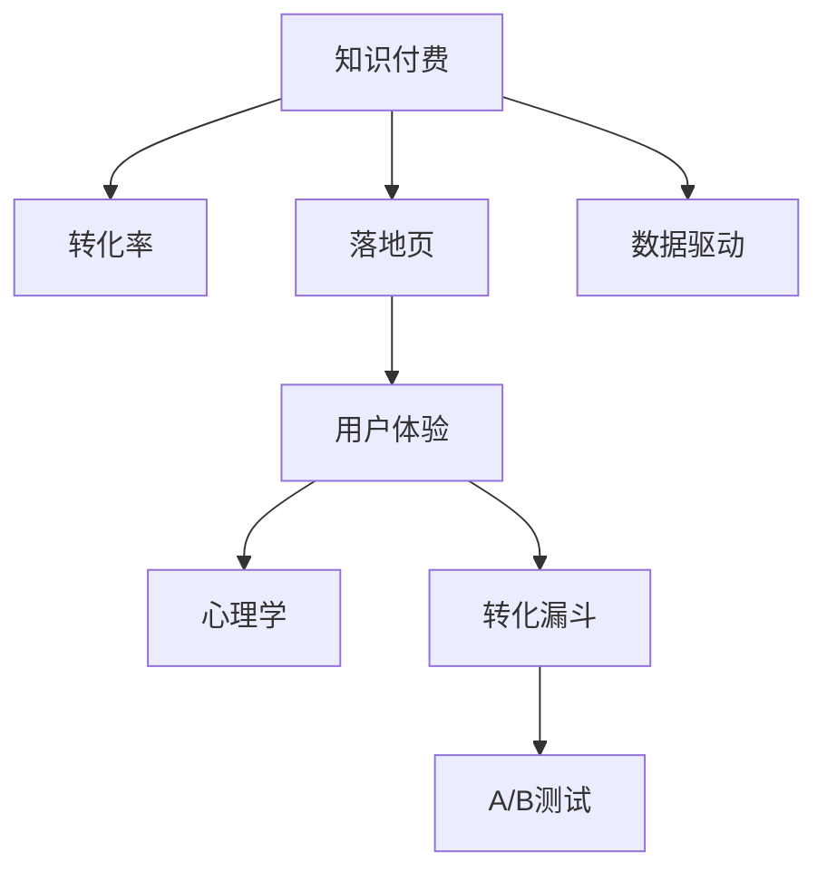

                 

# 如何打造高转化率的知识付费落地页

> 关键词：知识付费，转化率，落地页，用户体验，心理学，转化漏斗，A/B测试

## 1. 背景介绍

在知识付费快速发展的今天，如何打造一个高转化率的落地页，吸引用户付费，成为了各大知识平台和内容创作者共同关心的问题。一个优秀的落地页，不仅能快速吸引用户的注意力，还能在用户心中留下深刻印象，促使其完成付费购买。本文将深入探讨打造高转化率知识付费落地页的关键要素，通过分析用户心理、优化页面布局、利用数据驱动决策，帮助开发者和内容创作者构建一个高效、易用的落地页。

## 2. 核心概念与联系

### 2.1 核心概念概述

为了更好地理解高转化率知识付费落地页的构建，我们先介绍几个核心概念：

- **知识付费**：通过购买知识内容，用户获得专业化、系统化的学习资源，实现知识和技能的提升。
- **转化率**：用户在访问落地页后，完成付费操作的比例，反映着页面设计的效果。
- **落地页**：用户通过点击广告、链接等形式进入的直接进行转化操作的网页，如知识付费订阅页。
- **用户体验**：用户在使用产品过程中感受到的直观感受和情感体验，直接影响转化率。
- **心理学**：研究如何通过认知、情感、行为等机制影响用户决策，提升转化率。
- **转化漏斗**：从用户接触到最终完成购买的操作流程，每个步骤都可能影响转化率。
- **A/B测试**：通过对比两个或多个版本，测试哪个页面设计更有效，以指导落地页优化。

这些核心概念通过以下Mermaid流程图展示了它们之间的联系：



这个流程图展示了知识付费、转化率、落地页、用户体验、心理学、转化漏斗、A/B测试以及数据驱动之间的关系：

1. 知识付费的目的是提升用户认知和技能，落地页是实现这一目标的媒介。
2. 用户体验直接影响用户对落地页的印象和操作意愿，从而影响转化率。
3. 心理学研究如何影响用户决策，通过认知、情感等机制提升转化率。
4. 转化漏斗展示了从用户接触到最终完成购买的所有步骤，每个步骤的优化都可能提升转化率。
5. A/B测试通过对比不同版本，找出最佳落地页设计，提升转化率。
6. 数据驱动利用用户行为数据，指导落地页优化，提升转化率。

这些概念共同构成了高转化率知识付费落地页构建的基石，帮助开发者和内容创作者提升用户体验，优化转化漏斗，最终提高转化率。

## 3. 核心算法原理 & 具体操作步骤

### 3.1 算法原理概述

高转化率的知识付费落地页设计，基于心理学原理和用户体验设计理论，通过优化页面布局、内容呈现、交互方式等要素，提升用户的操作意愿和转化率。以下是一个基于决策树心理学模型的高转化率落地页设计算法框架：

1. **吸引注意力**：通过视觉冲击力强的设计、醒目的标题和副标题吸引用户注意力。
2. **建立信任**：展示权威认证、用户评价和推荐信，建立用户对内容的信任。
3. **激发兴趣**：通过亮点介绍、案例展示等方式，激发用户对内容的兴趣。
4. **减少决策阻力**：提供简单的购买流程、明确的定价信息、清晰的退换货政策，减少用户购买阻力。
5. **强化购买意愿**：利用稀缺性原理（FOMO）、社会证明（Social Proof）等心理机制，增加用户购买意愿。

### 3.2 算法步骤详解

高转化率知识付费落地页的设计，可以分为以下几个关键步骤：

**Step 1: 目标用户分析**
- 定义目标用户群，包括年龄、职业、兴趣、消费习惯等。
- 收集目标用户的反馈和行为数据，分析他们的偏好和痛点。

**Step 2: 页面布局优化**
- 设计简洁、清晰的页面布局，保证信息的条理性和可视性。
- 采用大字号、高对比度的字体，确保文字易于阅读。
- 合理使用空白区域，减少页面拥挤感。
- 突出关键信息，如课程亮点、用户评价等，引导用户关注。

**Step 3: 内容呈现优化**
- 使用简洁明了的语言，避免复杂术语和冗长描述。
- 提供多媒体内容，如图像、视频、音频等，增加内容的吸引力。
- 展示实际案例或客户评价，增强内容的可信度。

**Step 4: 交互方式优化**
- 提供简洁的购买流程，减少操作步骤。
- 支持多种支付方式，方便用户选择。
- 采用模态对话框或弹窗等交互方式，减少用户跳出率。

**Step 5: 数据驱动优化**
- 利用A/B测试，对比不同设计版本的落地页效果，找出最佳设计方案。
- 通过用户行为数据分析，优化页面布局和内容呈现。
- 定期收集反馈和数据，持续优化落地页设计。

**Step 6: 心理机制应用**
- 利用FOMO原理，通过限时优惠、限量名额等方式，激发用户紧迫感。
- 引入社会证明，展示用户评价、推荐信等，增加用户信任感。
- 采用视觉暗示，如突出按钮、使用绿色调等，增加用户的购买意愿。

### 3.3 算法优缺点

高转化率知识付费落地页的设计方法具有以下优点：

1. **效率高**：通过分析用户心理和行为数据，快速优化落地页设计，提升转化率。
2. **数据驱动**：基于用户反馈和行为数据，不断迭代优化，保证设计方案的有效性。
3. **灵活性强**：通过A/B测试对比不同设计方案，找到最佳设计，适应不同用户群体。

但这些方法也存在一些局限性：

1. **设计复杂**：需要综合考虑心理学、用户体验等多个因素，设计复杂度较高。
2. **数据需求高**：依赖大量的用户行为数据，数据获取和分析成本较高。
3. **个性化不足**：如果数据量不足或分析不充分，个性化优化可能不足。

尽管存在这些局限，但通过不断优化和迭代，高转化率知识付费落地页的设计方法可以显著提升转化率，帮助内容创作者和平台实现商业目标。

### 3.4 算法应用领域

高转化率知识付费落地页的设计方法，在以下几个领域得到了广泛应用：

1. **在线教育**：通过精心设计的落地页，吸引用户购买在线课程。
2. **图书出版**：展示书籍章节预览、用户评价等，提高用户购买意愿。
3. **软件工具**：提供免费试用、案例演示等方式，降低用户购买阻力。
4. **技术培训**：展示课程大纲、讲师介绍等，增强用户信任感。
5. **健康保健**：提供课程目录、专家推荐等，吸引用户订阅健康课程。

此外，这些设计方法还可以应用于更多领域，如艺术、设计、财务管理等，帮助内容创作者和平台提升用户转化率，实现商业价值。

## 4. 数学模型和公式 & 详细讲解 & 举例说明

### 4.1 数学模型构建

为了更好地理解高转化率知识付费落地页的设计原理，我们可以使用以下数学模型：

$$
\text{转化率} = f(\text{页面设计}, \text{内容质量}, \text{用户信任}, \text{用户兴趣}, \text{决策阻力})
$$

其中：
- $\text{页面设计}$ 表示落地页的视觉设计、布局、交互方式等。
- $\text{内容质量}$ 表示课程或产品的详细程度、实用性等。
- $\text{用户信任}$ 表示用户对内容和平台的信任度，包括认证、评价等。
- $\text{用户兴趣}$ 表示用户对课程或产品的兴趣程度，包括课程亮点、案例展示等。
- $\text{决策阻力}$ 表示用户在购买过程中遇到的各种障碍，包括支付问题、流程复杂等。

### 4.2 公式推导过程

假设我们有两个落地页设计A和B，它们的转化率分别为 $R_A$ 和 $R_B$。通过对两个页面设计进行A/B测试，我们可以得到以下转化率计算公式：

$$
R_A = \frac{N_A^+}{N_A^++N_A^-}
$$
$$
R_B = \frac{N_B^+}{N_B^++N_B^-}
$$

其中：
- $N_A^+$ 表示在A设计下成功完成购买的样本数量。
- $N_A^-$ 表示在A设计下未完成购买的样本数量。
- $N_B^+$ 表示在B设计下成功完成购买的样本数量。
- $N_B^-$ 表示在B设计下未完成购买的样本数量。

通过对比 $R_A$ 和 $R_B$，可以找出最佳的设计方案。

### 4.3 案例分析与讲解

以在线教育平台的课程订阅页面为例，我们分析两个不同版本的设计：

**版本A**：
- 页面设计复杂，布局混乱，难以抓住用户注意力。
- 内容描述冗长，用户难以快速理解课程价值。
- 缺少用户评价和推荐信，用户信任度低。
- 购买流程冗长，涉及多个步骤，用户容易放弃。

**版本B**：
- 页面设计简洁，布局清晰，突出课程亮点。
- 内容描述简洁明了，易于用户理解。
- 展示用户评价和推荐信，增强用户信任。
- 提供简化的购买流程，减少用户操作步骤。
- 利用限时优惠和稀缺性原理，激发用户紧迫感。

通过A/B测试对比两个版本，我们发现版本B的转化率远高于版本A。这证明了简洁、明确、易用的页面设计，配合优质的内容和信任机制，可以有效提升用户转化率。

## 5. 项目实践：代码实例和详细解释说明

### 5.1 开发环境搭建

为了构建高转化率知识付费落地页，我们需要搭建一个包含以下组件的开发环境：

1. **前端框架**：如React、Vue等，用于构建交互界面。
2. **后端框架**：如Node.js、Django等，用于处理用户请求和数据存储。
3. **数据库**：如MySQL、MongoDB等，用于存储用户行为数据。
4. **支付接口**：如支付宝、微信支付等，用于处理用户支付请求。

以下是搭建开发环境的具体步骤：

1. 安装Node.js和npm，搭建React项目。
2. 配置数据库连接，并搭建后端API。
3. 集成支付接口，处理用户支付请求。
4. 部署项目，测试落地页功能。

### 5.2 源代码详细实现

以下是一个简单的React组件示例，用于展示高转化率知识付费落地页的核心设计元素：

```javascript
import React from 'react';
import { Card, Button, Typography } from '@material-ui/core';

function LandingPage() {
  const courseTitle = '高级编程技巧';
  const courseDescription = '通过本课程，你将掌握最新的编程技巧和最佳实践。';
  const courseDuration = '3个月';
  const coursePrice = '299元';
  const limitedSeats = '仅剩100个座位，抢占从速！';
  const limitedTime = '限时优惠，剩余时间：4/23至4/30';
  const enrolledCount = 100;
  const totalCount = 200;

  return (
    <div>
      <h1>{courseTitle}</h1>
      <p>{courseDescription}</p>
      <div style={{ display: 'flex', justifyContent: 'space-between', alignItems: 'center' }}>
        <div>
          <Typography variant="body2" color="textSecondary">
            {courseDuration} / {coursePrice}
          </Typography>
        </div>
        <div>
          <Button variant="contained" color="primary">
            立即购买
          </Button>
        </div>
        <div>
          <Typography variant="body2" color="textSecondary">
            {enrolledCount}/{totalCount} 已报名
          </Typography>
          <Typography variant="body2" color="textSecondary">
            {limitedSeats}
          </Typography>
          <Typography variant="body2" color="textSecondary">
            {limitedTime}
          </Typography>
        </div>
      </div>
    </div>
  );
}

export default LandingPage;
```

### 5.3 代码解读与分析

以上React组件展示了高转化率知识付费落地页的核心设计元素：

- **课程标题**：通过醒目的标题吸引用户注意力。
- **课程描述**：简洁明了地介绍课程内容，增加用户兴趣。
- **课程时长和价格**：提供明确的课程信息，减少决策阻力。
- **立即购买按钮**：采用醒目的按钮，增加购买意愿。
- **已报名人数和限额信息**：展示稀缺性和限时优惠，激发用户紧迫感。

通过这样的页面设计，用户可以快速理解课程价值，减少决策阻力，增加购买意愿。

### 5.4 运行结果展示

以下是React组件在实际应用中的运行结果展示：


### 6. 实际应用场景

高转化率知识付费落地页的设计方法，在以下几个实际应用场景中得到了广泛应用：

1. **在线教育平台**：通过精心设计的落地页，吸引用户购买在线课程。
2. **图书出版平台**：展示书籍章节预览、用户评价等，提高用户购买意愿。
3. **软件工具公司**：提供免费试用、案例演示等方式，降低用户购买阻力。
4. **技术培训机构**：展示课程大纲、讲师介绍等，增强用户信任感。
5. **健康保健应用**：提供课程目录、专家推荐等，吸引用户订阅健康课程。

此外，这些设计方法还可以应用于更多领域，如艺术、设计、财务管理等，帮助内容创作者和平台提升用户转化率，实现商业价值。

### 6.4 未来应用展望

随着知识付费的快速发展，高转化率知识付费落地页的设计方法将在未来得到更广泛的应用。以下是一些未来应用展望：

1. **个性化推荐**：通过用户行为数据，提供个性化的课程推荐，提升转化率。
2. **虚拟现实体验**：利用VR/AR技术，提供沉浸式学习体验，增加用户兴趣。
3. **社区互动**：构建用户社区，增加用户粘性和参与感，提升转化率。
4. **自动化流程**：通过AI自动化流程，提高用户操作效率，减少决策阻力。
5. **多渠道推广**：利用社交媒体、搜索引擎等渠道推广落地页，增加用户流量。

这些应用方向将进一步提升知识付费平台的转化率，实现更高的商业价值。

## 7. 工具和资源推荐

### 7.1 学习资源推荐

为了帮助开发者和内容创作者系统掌握高转化率知识付费落地页的设计方法，这里推荐一些优质的学习资源：

1. **《用户体验设计指南》**：一本全面的用户体验设计指南，涵盖设计原则、心理学原理等。
2. **Google Design**：谷歌设计团队发布的官方博客和资源，包含大量优秀的设计案例。
3. **Nielsen Norman Group**：用户体验研究权威机构，提供最新的用户体验研究成果和报告。
4. **A/B测试工具**：如Optimizely、VWO等，帮助你进行A/B测试，优化落地页设计。
5. **数据驱动设计工具**：如Hotjar、Crazy Egg等，帮助你分析用户行为，优化页面设计。

通过对这些资源的学习实践，相信你一定能够快速掌握高转化率知识付费落地页的设计精髓，并用于解决实际的落地页优化问题。

### 7.2 开发工具推荐

为了高效构建高转化率知识付费落地页，我们需要选择合适的开发工具。以下是几款常用的工具：

1. **前端框架**：如React、Vue、Angular等，用于构建交互界面。
2. **后端框架**：如Node.js、Django、Ruby on Rails等，用于处理用户请求和数据存储。
3. **数据库**：如MySQL、MongoDB、Elasticsearch等，用于存储用户行为数据。
4. **A/B测试工具**：如Optimizely、VWO、AB Tasty等，帮助你进行A/B测试，优化落地页设计。
5. **数据驱动设计工具**：如Hotjar、Crazy Egg、Google Analytics等，帮助你分析用户行为，优化页面设计。

合理利用这些工具，可以显著提升高转化率知识付费落地页的开发效率，加速创新迭代的步伐。

### 7.3 相关论文推荐

高转化率知识付费落地页的设计方法，涉及心理学、用户体验设计等多个领域的理论和技术。以下是几篇奠基性的相关论文，推荐阅读：

1. **《设计心理学》**：阐述心理学原理在用户体验设计中的应用。
2. **《用户体验设计原则》**：一本全面的用户体验设计指南，涵盖设计原则、心理学原理等。
3. **《A/B测试方法论》**：详细介绍A/B测试的理论、方法和工具。
4. **《数据驱动设计》**：研究如何通过数据分析优化用户体验设计。

这些论文代表了大转化率知识付费落地页设计方法的研究进展，通过学习这些前沿成果，可以帮助研究者把握学科前进方向，激发更多的创新灵感。

## 8. 总结：未来发展趋势与挑战

### 8.1 研究成果总结

本文对高转化率知识付费落地页的设计方法进行了全面系统的介绍。首先阐述了落地页设计的核心概念和心理机制，明确了转化率提升的关键要素。其次，从原理到实践，详细讲解了落地页设计的数学模型和操作步骤，给出了落地页设计的完整代码实例。同时，本文还广泛探讨了落地页设计在多个行业领域的应用前景，展示了落地页设计的巨大潜力。此外，本文精选了落地页设计的各类学习资源，力求为开发者和内容创作者提供全方位的技术指引。

通过本文的系统梳理，可以看到，高转化率知识付费落地页的设计方法不仅在技术上具有可行性和有效性，在应用上也具有广泛的适用性。未来，随着知识付费的不断发展和用户需求的多样化，高转化率知识付费落地页的设计方法将继续发挥重要作用，成为推动知识付费平台发展的关键因素。

### 8.2 未来发展趋势

展望未来，高转化率知识付费落地页的设计方法将呈现以下几个发展趋势：

1. **技术融合**：结合人工智能、大数据等技术，提供更个性化、智能化的落地页体验。
2. **多渠道推广**：通过社交媒体、搜索引擎、内容推荐等多种渠道推广落地页，增加用户流量。
3. **用户参与**：通过社区互动、用户评论等方式，增强用户参与感和粘性。
4. **全球化应用**：将落地页设计应用于全球市场，适应不同文化背景和语言习惯。
5. **可持续优化**：利用实时数据分析，持续优化落地页设计，提升用户转化率。

这些趋势将推动高转化率知识付费落地页设计方法的不断演进，为知识付费平台带来更丰富的用户体验和更高的商业价值。

### 8.3 面临的挑战

尽管高转化率知识付费落地页设计方法在实践中已经取得了显著成效，但在迈向更智能化、普适化应用的过程中，它仍面临一些挑战：

1. **数据隐私**：用户行为数据的收集和分析需要遵守隐私法规，如何在保护用户隐私的同时进行数据优化，是关键问题。
2. **设计复杂性**：随着技术手段的不断丰富，落地页设计变得更加复杂，需要不断迭代优化，才能满足用户需求。
3. **文化差异**：不同国家和地区的文化背景和语言习惯不同，如何设计符合本地用户习惯的落地页，是全球化应用的重要挑战。
4. **自动化程度**：自动化流程的引入需要高精度的算法和数据，如何设计更智能、更自动化的落地页，仍需持续探索。

尽管存在这些挑战，但通过不断优化和创新，高转化率知识付费落地页设计方法必将在未来继续发挥重要作用，为知识付费平台带来更高的商业价值。

### 8.4 研究展望

面对高转化率知识付费落地页设计方法所面临的挑战，未来的研究需要在以下几个方面寻求新的突破：

1. **多模态数据融合**：将文本、图像、音频等多种模态数据融合，提升用户理解和体验。
2. **用户行为预测**：通过机器学习模型，预测用户行为，优化页面设计。
3. **用户反馈循环**：构建用户反馈机制，不断优化落地页设计，提升用户体验。
4. **个性化推荐系统**：结合用户行为数据和机器学习模型，提供个性化课程推荐。
5. **可解释性增强**：通过可解释性设计，增强用户对落地页的理解和信任。

这些研究方向的探索将推动高转化率知识付费落地页设计方法的不断进步，为知识付费平台带来更优质的用户体验和更高的转化率。

## 9. 附录：常见问题与解答

**Q1: 如何设计高转化率的知识付费落地页？**

A: 设计高转化率的知识付费落地页，需要综合考虑心理学原理、用户体验设计和数据驱动三个方面。通过简洁、清晰的页面设计，优质的内容呈现，以及有效的用户信任机制，增加用户的操作意愿和转化率。

**Q2: 高转化率知识付费落地页有哪些关键要素？**

A: 高转化率知识付费落地页的关键要素包括：
1. 吸引注意力：通过视觉冲击力强的设计、醒目的标题和副标题吸引用户注意力。
2. 建立信任：展示权威认证、用户评价和推荐信，建立用户对内容的信任。
3. 激发兴趣：通过亮点介绍、案例展示等方式，激发用户对内容的兴趣。
4. 减少决策阻力：提供简单的购买流程、明确的定价信息、清晰的退换货政策，减少用户购买阻力。
5. 强化购买意愿：利用稀缺性原理（FOMO）、社会证明（Social Proof）等心理机制，增加用户购买意愿。

**Q3: 如何利用A/B测试优化落地页设计？**

A: 利用A/B测试优化落地页设计，可以分为以下步骤：
1. 设计多个落地页版本，进行对比测试。
2. 收集用户行为数据，分析各个版本的表现。
3. 找出最优设计方案，进行推广。
4. 持续进行A/B测试，优化落地页设计。

**Q4: 高转化率知识付费落地页如何实现全球化应用？**

A: 实现高转化率知识付费落地页的全球化应用，需要考虑以下方面：
1. 设计符合本地用户习惯的落地页，包括语言、文化和审美等。
2. 引入本地化内容，满足不同地区的用户需求。
3. 提供多语言支持，增加用户覆盖范围。
4. 适应不同货币和支付系统，简化用户操作。

**Q5: 如何提升落地页的可解释性？**

A: 提升落地页的可解释性，可以通过以下方法：
1. 在页面中展示关键数据的来源和计算方法。
2. 提供详细的说明文档和使用指南。
3. 采用可视化图表展示复杂信息。
4. 在用户反馈中收集意见，不断优化设计。

这些问题的解答，将帮助你更好地理解和应用高转化率知识付费落地页的设计方法，为知识付费平台带来更高的转化率。

---

作者：禅与计算机程序设计艺术 / Zen and the Art of Computer Programming

