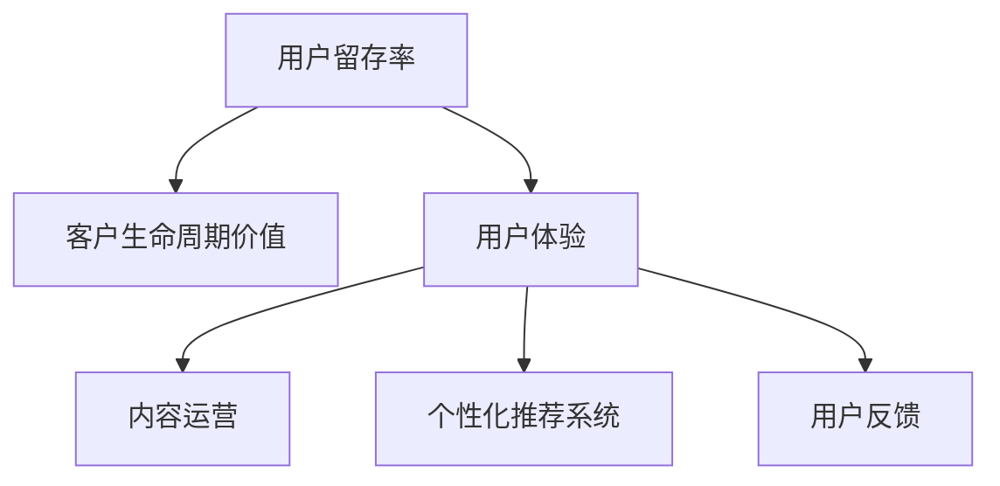

                 

# 如何提高知识付费产品的用户留存率

## 1. 背景介绍

随着知识经济时代的到来，知识付费已成为一种新型的内容消费模式，受到越来越多用户的青睐。然而，尽管知识付费市场迅速扩张，用户留存率却普遍不高。很多用户订阅付费内容后，往往在几期课程后流失，这极大地制约了知识付费平台的收入和盈利能力。因此，如何提高知识付费产品的用户留存率，成为一个亟待解决的行业问题。

### 1.1 问题由来
知识付费产品本质上是一种内容订阅服务，用户通过付费获得知识内容的持续输出。与免费内容相比，用户需要更多地考虑内容的性价比，且较难形成长期依赖。很多用户最初被平台吸引，是因为某几期高质量的内容，而一旦课程结束或后续内容质量下滑，用户便可能转向其他平台或取消订阅。

### 1.2 问题核心关键点
用户留存问题是一个复杂且多因素驱动的系统问题。从用户行为和平台策略的角度，可以归纳出以下核心关键点：

1. **内容质量**：高质量、具有吸引力的内容是用户订阅和留存的基础。课程应具有较强的实用性和价值感，能够持续满足用户的学习需求。
2. **互动体验**：良好的互动体验，如清晰的课程结构、友好的用户界面、及时的答疑服务，能提升用户的整体满意度，增强粘性。
3. **个性化推荐**：通过大数据分析，向用户推荐符合其兴趣和需求的课程，能够有效提高用户参与度，提升留存率。
4. **多渠道运营**：结合社交媒体、电子邮件、短信等多种渠道，对用户进行精准营销和提醒，保持用户的持续关注。
5. **客户服务**：提供优质的客户服务，及时解决用户的问题和疑虑，增强用户信任感。
6. **社区建设**：构建活跃的在线学习社区，通过用户之间的互动，形成学习的氛围和动力。

理解这些关键点，可以帮助我们深入分析用户流失的原因，并设计有效的策略来提升用户留存率。

## 2. 核心概念与联系

### 2.1 核心概念概述

为了更好地理解如何提高用户留存率，本节将介绍几个相关核心概念：

- **用户留存率(User Retention Rate)**：指一定时间间隔内，用户持续活跃的比率。留存率反映了用户对平台的忠诚度和长期价值。
- **客户生命周期价值(Customer Lifetime Value, CLV)**：指一个用户在平台上生命周期内，通过消费和推荐带来的总收入。提高用户留存率，能够显著提升CLV。
- **用户体验(User Experience, UX)**：指用户使用平台时的主观感受，包括内容质量、操作便捷性、互动性等多个方面。良好的UX能够显著提升用户满意度。
- **内容运营(Content Operation)**：指通过内容策划、制作、推广等环节，提升内容的曝光度和用户参与度的过程。
- **个性化推荐系统(Personalized Recommendation System)**：通过分析用户行为数据，向用户推荐其感兴趣和有价值内容的系统。
- **用户反馈(User Feedback)**：指用户在使用过程中，对内容、平台功能、服务质量等的评价和建议。及时响应和利用用户反馈，能够不断优化平台体验。

这些概念之间的逻辑关系可以通过以下Mermaid流程图来展示：



这个流程图展示了一系列关键概念及其之间的关系：

1. 用户留存率与客户生命周期价值之间存在正相关关系。
2. 用户体验是用户留存率的基础，直接影响用户满意度和忠诚度。
3. 内容运营和个性化推荐系统是提升用户体验的重要手段。
4. 用户反馈是改进用户体验和提升内容质量的重要信息来源。

这些概念共同构成了用户留存率提升的系统框架，帮助平台在各个环节进行优化。

## 3. 核心算法原理 & 具体操作步骤
### 3.1 算法原理概述

提高知识付费产品的用户留存率，本质上是一个系统工程问题，需要从内容、技术、运营等多个维度进行优化。本文主要从个性化推荐系统的角度，探讨如何通过算法优化提升用户留存率。

个性化推荐系统通过分析用户的行为数据，推荐符合其兴趣和需求的内容，从而提高用户粘性和留存率。其核心算法原理包括：

- **协同过滤(Collaborative Filtering)**：通过分析用户之间的行为相似性，推荐与用户已关注内容相似的新内容。
- **基于内容的推荐(Content-Based Filtering)**：分析内容的特征，为用户推荐与其兴趣相关的内容。
- **混合推荐(Mixed Filtering)**：综合多种推荐算法，发挥各自优势，提升推荐效果。
- **深度学习推荐**：利用深度学习模型，从用户行为数据中挖掘潜在关联，提升推荐精度。

### 3.2 算法步骤详解

个性化推荐系统的实现，通常包括以下几个关键步骤：

**Step 1: 数据准备与特征工程**
- 收集用户行为数据，包括浏览、点击、购买、评价等行为记录。
- 提取与推荐相关的特征，如用户兴趣标签、课程主题、时间戳等。
- 数据清洗和归一化处理，去除噪声和极端值，确保数据质量。

**Step 2: 相似度计算**
- 基于协同过滤或基于内容的推荐算法，计算用户与内容之间的相似度。
- 协同过滤可采用余弦相似度、皮尔逊相关系数等方法。
- 基于内容的方法可利用TF-IDF、词向量等技术。

**Step 3: 推荐模型训练**
- 选择合适的推荐算法，如ALS、SVD、矩阵分解等。
- 训练模型，使用历史行为数据进行拟合，找到用户与内容的潜在关联。
- 对深度学习推荐方法，可使用RNN、CNN、DNN等神经网络模型。

**Step 4: 推荐结果排序**
- 根据相似度计算结果和模型预测，生成推荐列表。
- 对推荐结果进行排序，优先推荐评分高、相关性强的内容。
- 结合用户偏好和互动行为，动态调整推荐策略。

**Step 5: 反馈处理与模型优化**
- 收集用户的反馈信息，分析推荐效果。
- 利用用户反馈，更新推荐模型，提升推荐精度。
- 定期重新训练模型，适应用户行为的变化。

### 3.3 算法优缺点

个性化推荐系统的优点：
1. 提升用户粘性。通过推荐符合用户兴趣的内容，能够显著提高用户活跃度和留存率。
2. 提高用户满意度。个性化推荐使得内容更加契合用户需求，提升用户满意度。
3. 增加平台收入。精准的推荐能够提升用户消费意愿，增加平台收入。

个性化推荐系统的主要缺点：
1. 数据依赖性强。需要大量高质量的用户行为数据，才能训练出有效的推荐模型。
2. 推荐效果受数据质量影响。数据偏差或不完整会导致推荐效果下降。
3. 用户隐私问题。推荐算法会涉及用户隐私信息，数据隐私保护需引起重视。
4. 冷启动问题。新用户或冷门内容的推荐效果往往较差，需要进一步改进算法。

尽管存在这些缺点，但个性化推荐系统已成为提高用户留存率的有效手段，并在实际应用中取得了显著效果。

### 3.4 算法应用领域

个性化推荐系统在知识付费产品的用户留存优化中，得到了广泛的应用，涵盖以下几个方面：

- **课程推荐**：通过分析用户浏览和购买记录，推荐符合其兴趣和需求的课程。
- **学习路径规划**：根据用户的学习进度和兴趣，推荐相关课程和学习资源，帮助用户构建学习路径。
- **用户画像构建**：通过用户行为数据分析，构建详细的用户画像，用于个性化推荐和精准营销。
- **内容营销**：根据用户偏好，推荐相关内容，提升内容的曝光度和用户参与度。

除了上述这些经典应用外，个性化推荐技术还被创新性地应用到更多场景中，如智能客服、个性化广告、电商推荐等，为不同行业带来了全新的突破。

## 4. 数学模型和公式 & 详细讲解
### 4.1 数学模型构建

本节将使用数学语言对个性化推荐系统的算法进行更加严格的刻画。

假设用户与内容之间的行为数据可以用矩阵形式表示，记为 $X \in \mathbb{R}^{N \times M}$，其中 $N$ 为用户的数量，$M$ 为内容的数量。设用户对内容的评分矩阵为 $R \in \mathbb{R}^{N \times M}$，其中 $R_{ij}$ 表示用户 $i$ 对内容 $j$ 的评分。

个性化推荐的目标是找到用户与内容之间的相似度矩阵 $S \in \mathbb{R}^{N \times M}$，使得推荐的准确度和效果最大化。常用的推荐算法模型包括矩阵分解、协同过滤、深度学习等。

### 4.2 公式推导过程

以矩阵分解为例，其基本公式为：

$$
R \approx U \times V^T
$$

其中 $U \in \mathbb{R}^{N \times k}$ 和 $V \in \mathbb{R}^{M \times k}$ 为低维矩阵分解结果，$k$ 为因子数。目标是最小化误差矩阵 $E$ 的范数：

$$
\min \| R - U \times V^T \|_F
$$

其中 $\| \cdot \|_F$ 为Frobenius范数。

矩阵分解的求解通常使用奇异值分解(SVD)算法：

$$
U, V, S \leftarrow SVD(R)
$$

通过奇异值分解，将原始评分矩阵 $R$ 分解为低维矩阵 $U$ 和 $V$ 的乘积，并得到特征值 $S$。此时，推荐结果可以表示为：

$$
\hat{R}_{ij} = U_i \times S \times V_j^T
$$

其中 $\hat{R}_{ij}$ 表示预测的用户 $i$ 对内容 $j$ 的评分。

### 4.3 案例分析与讲解

以Netflix的个性化推荐为例，分析其推荐算法的效果。

Netflix通过用户评分数据，使用SVD算法进行矩阵分解，得到了用户特征和内容特征的低维表示。通过对比预测评分与实际评分，Netflix能够计算推荐模型的误差，并不断优化模型参数。

Netflix的推荐系统不仅考虑了用户的评分行为，还结合了用户观看时间、观看次数等多种行为数据，使得推荐结果更加准确和多样化。例如，当用户频繁观看某一类型的内容时，系统会推荐同类型的高评分内容；当用户观看时间较短时，系统会推荐节奏紧凑、高互动性的内容。

## 5. 项目实践：代码实例和详细解释说明
### 5.1 开发环境搭建

在进行个性化推荐系统的开发时，需要准备好开发环境。以下是使用Python进行PyTorch和TensorFlow开发的环境配置流程：

1. 安装Anaconda：从官网下载并安装Anaconda，用于创建独立的Python环境。

2. 创建并激活虚拟环境：
```bash
conda create -n pytorch-env python=3.8 
conda activate pytorch-env
```

3. 安装PyTorch：根据CUDA版本，从官网获取对应的安装命令。例如：
```bash
conda install pytorch torchvision torchaudio cudatoolkit=11.1 -c pytorch -c conda-forge
```

4. 安装TensorFlow：
```bash
pip install tensorflow
```

5. 安装各类工具包：
```bash
pip install numpy pandas scikit-learn matplotlib tqdm jupyter notebook ipython
```

完成上述步骤后，即可在`pytorch-env`环境中开始推荐系统的开发。

### 5.2 源代码详细实现

下面我们以一个简单的基于协同过滤的推荐系统为例，给出使用PyTorch和TensorFlow实现的代码实例。

首先，定义评分矩阵 $R$ 和用户-内容相似度矩阵 $S$ 的初始化函数：

```python
import numpy as np
import torch
from torch import nn
import tensorflow as tf

def init_matrix(n, m, k):
    U = np.random.normal(0, 1, (n, k))
    V = np.random.normal(0, 1, (m, k))
    return U, V

def init_similarity_matrix(n, m, k):
    S = np.random.normal(0, 1, (n, m))
    return S
```

然后，定义协同过滤的预测函数：

```python
def predict(U, V, S, i, j):
    return np.dot(U[i], np.dot(S, V[j])) # 使用矩阵乘法计算预测评分
```

接着，定义评分误差函数和梯度下降更新函数：

```python
def loss_function(R_hat, R, i, j):
    return np.square(R_hat[i, j] - R[i, j])

def update(U, V, S, i, j, alpha):
    U[i] -= alpha * (2 * (R_hat[i, j] - R[i, j]) * S[i, j])
    V[j] -= alpha * (2 * (R_hat[i, j] - R[i, j]) * S[i, j].T
    S[i, j] -= alpha * (R_hat[i, j] - R[i, j])
```

最后，使用数据集进行训练和预测：

```python
# 创建数据集
R = np.array([[5, 1, 3], [4, 4, 2], [1, 3, 4]])
U, V = init_matrix(3, 3, 2)
S = init_similarity_matrix(3, 3, 2)

# 训练模型
for i in range(100):
    for j in range(3):
        R_hat = predict(U, V, S, 0, j)
        loss = loss_function(R_hat, R, 0, j)
        update(U, V, S, 0, j, 0.01)

# 预测评分
predict_score = predict(U, V, S, 0, 2)
print(predict_score)
```

以上就是使用PyTorch和TensorFlow进行协同过滤推荐系统代码实现的完整示例。通过这些代码，你可以理解矩阵分解的基本原理，并尝试使用更复杂的深度学习模型进行优化。

### 5.3 代码解读与分析

让我们再详细解读一下关键代码的实现细节：

**init_matrix函数**：
- 初始化用户和内容特征矩阵，使用随机高斯分布生成 $U$ 和 $V$，用于矩阵分解。

**init_similarity_matrix函数**：
- 初始化用户与内容的相似度矩阵 $S$，同样使用随机高斯分布生成。

**predict函数**：
- 根据分解后的 $U$、$V$ 和 $S$，计算用户 $i$ 对内容 $j$ 的预测评分。

**loss_function函数**：
- 计算预测评分与实际评分之间的平方误差，作为损失函数。

**update函数**：
- 使用梯度下降算法，更新 $U$、$V$ 和 $S$，以最小化损失函数。

**训练模型**：
- 使用循环迭代，对每个用户和内容组合进行预测和更新，模拟协同过滤算法。

**预测评分**：
- 使用已训练的 $U$、$V$ 和 $S$，预测用户对内容的评分。

代码的实现基于矩阵分解的协同过滤算法，相对简洁高效。在实际应用中，还需要考虑更多的优化策略，如数据增强、特征选择、模型融合等，以提升推荐效果。

## 6. 实际应用场景
### 6.1 智能客服系统

智能客服系统通过个性化推荐，能够显著提升用户体验和留存率。用户在咨询过程中，系统可以实时推荐相关问答，帮助用户快速解决问题。推荐算法能够基于用户的历史查询记录，预测其下一步可能的问题，提前准备好相应的答案，提升服务响应速度和准确性。

### 6.2 金融服务

金融服务行业需要提供精准的个性化推荐，帮助用户发现适合的理财产品和投资机会。推荐算法可以结合用户行为数据、市场行情、产品评价等多种信息，为用户推荐个性化的投资组合和理财建议。通过个性化的推荐服务，金融平台能够增强用户粘性，提升客户满意度。

### 6.3 电商平台

电商平台通过个性化推荐，能够显著提升用户购买转化率和留存率。推荐算法可以基于用户的浏览记录、购买历史、评价反馈等数据，推荐符合其兴趣和需求的商品。推荐结果的准确性，能够直接影响用户下单率和复购率。

### 6.4 教育平台

教育平台通过个性化推荐，能够帮助用户发现适合自己的课程和学习资源。推荐算法可以基于用户的学习进度、兴趣标签、互动行为等数据，推荐相关的课程和学习路径。个性化推荐能够提升学习效果和用户满意度，增强用户粘性和留存率。

## 7. 工具和资源推荐
### 7.1 学习资源推荐

为了帮助开发者系统掌握个性化推荐系统的理论基础和实践技巧，这里推荐一些优质的学习资源：

1. 《推荐系统实践》系列博文：由大模型技术专家撰写，深入浅出地介绍了推荐系统的原理、算法和工程实现。

2. Coursera《推荐系统》课程：由斯坦福大学教授讲授，涵盖推荐系统的经典算法和工程实现。

3. 《推荐系统》书籍：讲述推荐系统的理论和应用，适合初学者和进阶者阅读。

4. Kaggle推荐系统竞赛：通过实际竞赛项目，帮助开发者深入理解推荐系统算法的应用。

5. Apache Mahout：Apache基金会开源的推荐系统库，提供了丰富的算法和工程实践示例。

通过这些资源的学习实践，相信你一定能够快速掌握个性化推荐系统的精髓，并用于解决实际的应用问题。

### 7.2 开发工具推荐

高效的开发离不开优秀的工具支持。以下是几款用于个性化推荐系统开发的常用工具：

1. PyTorch：基于Python的开源深度学习框架，灵活动态的计算图，适合快速迭代研究。大量预训练语言模型和深度学习推荐模型都有PyTorch版本的实现。

2. TensorFlow：由Google主导开发的开源深度学习框架，生产部署方便，适合大规模工程应用。提供丰富的预训练语言模型资源和推荐模型实现。

3. Apache Mahout：Apache基金会开源的推荐系统库，提供多种推荐算法和工程实践示例。

4. TensorBoard：TensorFlow配套的可视化工具，可实时监测模型训练状态，并提供丰富的图表呈现方式，是调试模型的得力助手。

5. Weights & Biases：模型训练的实验跟踪工具，可以记录和可视化模型训练过程中的各项指标，方便对比和调优。

6. Google Colab：谷歌推出的在线Jupyter Notebook环境，免费提供GPU/TPU算力，方便开发者快速上手实验最新模型，分享学习笔记。

合理利用这些工具，可以显著提升个性化推荐系统的开发效率，加快创新迭代的步伐。

### 7.3 相关论文推荐

个性化推荐系统的发展源于学界的持续研究。以下是几篇奠基性的相关论文，推荐阅读：

1. Collaborative Filtering for Implicit Feedback Datasets：提出基于协同过滤的推荐系统，并详细讨论了数据处理和模型优化。

2. Fast Matrix Factorization Techniques for Recommender Systems：介绍矩阵分解算法的多种加速策略，提升推荐模型的效率。

3. Deep Collaborative Filtering with Discounted Matrix Factorization：使用深度学习模型进行协同过滤，提升推荐精度和效果。

4. Attention is All you Need：提出Transformer结构，引入自注意力机制，提升推荐模型的表达能力。

5. Matrix Factorization Techniques for Recommender Systems：全面介绍了矩阵分解算法的原理和应用，是推荐系统的经典入门教材。

这些论文代表了大规模个性化推荐系统的发展脉络。通过学习这些前沿成果，可以帮助研究者把握推荐系统的未来趋势，激发更多的创新灵感。

## 8. 总结：未来发展趋势与挑战
### 8.1 总结

本文对提高知识付费产品的用户留存率进行了全面系统的介绍。首先阐述了用户留存问题的背景和核心关键点，明确了个性化推荐系统在用户留存中的重要作用。其次，从算法原理和操作步骤的角度，详细讲解了个性化推荐系统的实现方法，并给出了完整的代码实例。同时，本文还广泛探讨了个性化推荐系统在多个行业领域的应用前景，展示了其巨大的潜力。最后，本文精选了推荐系统的各类学习资源，力求为读者提供全方位的技术指引。

通过本文的系统梳理，可以看到，个性化推荐系统在知识付费产品的用户留存优化中，已经取得了显著的效果。通过系统地收集用户行为数据，设计高效的推荐算法，能够显著提升用户粘性和留存率，为知识付费平台的持续发展提供坚实保障。未来，随着推荐技术的不断进步，个性化推荐系统将在更多场景中发挥重要作用，为各行各业带来变革性的影响。

### 8.2 未来发展趋势

展望未来，个性化推荐系统的技术将呈现以下几个发展趋势：

1. **深度学习应用的深化**：深度学习推荐算法将继续深化，结合多模态数据，提升推荐效果。通过引入图像、语音、文本等多种模态，构建更为全面和精准的推荐模型。

2. **跨领域推荐**：推荐系统将突破单一领域的限制，实现跨领域推荐。例如，将电商领域的商品推荐和医疗领域的病种推荐进行融合，提升综合推荐效果。

3. **实时推荐**：通过实时数据分析，对用户行为进行动态建模，实现实时推荐。利用流式数据处理技术，提升推荐系统的响应速度和时效性。

4. **用户隐私保护**：随着隐私保护意识的增强，推荐系统将更加注重用户数据的保护。通过差分隐私、联邦学习等技术，确保用户数据安全。

5. **多维推荐**：推荐系统将不仅仅依赖历史行为数据，还考虑用户属性、社交网络、时序特征等多维信息，提升推荐模型的全面性和准确性。

6. **推荐算法的多样化**：推荐算法将不再局限于协同过滤、基于内容的推荐，引入知识图谱、深度学习等多种算法，提升推荐效果。

以上趋势凸显了个性化推荐技术的广阔前景。这些方向的探索发展，必将进一步提升推荐系统的精度和效果，为各行业带来全新的用户体验和商业价值。

### 8.3 面临的挑战

尽管个性化推荐系统在用户留存方面取得了显著效果，但在迈向更加智能化、普适化应用的过程中，仍面临诸多挑战：

1. **数据质量问题**：推荐系统高度依赖用户行为数据，数据质量对推荐效果有直接影响。数据偏差、噪声和不完整，都会影响推荐模型的准确性和效果。

2. **模型复杂度**：深度学习模型通常具有较高的复杂度，需要大量计算资源进行训练和推理。如何在保证精度的同时，降低模型的计算成本，是一个亟待解决的问题。

3. **冷启动问题**：新用户或冷门内容的推荐效果往往较差，需要进一步改进算法，以应对冷启动问题。

4. **隐私保护**：推荐算法涉及用户隐私信息，数据隐私保护需引起重视。如何在不泄露用户隐私的前提下，进行个性化推荐，是推荐系统的重要研究方向。

5. **实时性要求**：实时推荐系统对数据处理和模型推理速度有较高要求。如何在保证推荐效果的同时，提升系统的实时性和响应速度，也是亟待解决的问题。

6. **公平性问题**：推荐算法可能会存在算法偏见，导致某些群体被忽视或歧视。如何在推荐系统中引入公平性约束，确保推荐过程的公正性，需要进一步研究。

正视推荐系统面临的这些挑战，积极应对并寻求突破，将是个性化推荐系统走向成熟的必由之路。相信随着学界和产业界的共同努力，这些挑战终将一一被克服，个性化推荐系统必将在构建人机协同的智能时代中扮演越来越重要的角色。

### 8.4 研究展望

面对个性化推荐系统所面临的种种挑战，未来的研究需要在以下几个方面寻求新的突破：

1. **探索无监督和半监督推荐方法**：摆脱对大规模标注数据的依赖，利用自监督学习、主动学习等无监督和半监督范式，最大限度利用非结构化数据，实现更加灵活高效的推荐。

2. **研究参数高效和计算高效的推荐范式**：开发更加参数高效的推荐方法，在固定大部分预训练参数的同时，只更新极少量的任务相关参数。同时优化推荐模型的计算图，减少前向传播和反向传播的资源消耗，实现更加轻量级、实时性的部署。

3. **融合因果和对比学习范式**：通过引入因果推断和对比学习思想，增强推荐模型建立稳定因果关系的能力，学习更加普适、鲁棒的用户画像。

4. **引入更多先验知识**：将符号化的先验知识，如知识图谱、逻辑规则等，与神经网络模型进行巧妙融合，引导推荐过程学习更准确、合理的用户画像。同时加强不同模态数据的整合，实现视觉、语音等多模态信息与文本信息的协同建模。

5. **结合因果分析和博弈论工具**：将因果分析方法引入推荐系统，识别出推荐决策的关键特征，增强推荐结果的因果性和逻辑性。借助博弈论工具刻画人机交互过程，主动探索并规避推荐系统的脆弱点，提高系统稳定性。

6. **纳入伦理道德约束**：在推荐目标中引入伦理导向的评估指标，过滤和惩罚有偏见、有害的推荐结果，确保推荐过程符合人类价值观和伦理道德。

这些研究方向的探索，必将引领个性化推荐系统技术迈向更高的台阶，为构建安全、可靠、可解释、可控的智能系统铺平道路。面向未来，个性化推荐系统还需要与其他人工智能技术进行更深入的融合，如知识表示、因果推理、强化学习等，多路径协同发力，共同推动智能交互系统的进步。只有勇于创新、敢于突破，才能不断拓展推荐系统的边界，让智能技术更好地造福人类社会。

## 9. 附录：常见问题与解答

**Q1：推荐系统如何处理冷启动问题？**

A: 冷启动问题是推荐系统面临的主要挑战之一，尤其是对于新用户和冷门内容。以下是一些常见的处理冷启动问题的方法：

1. **基于内容的推荐**：对于新用户，推荐系统可以基于其兴趣标签、历史行为等，推荐与其兴趣相似的内容，从而加速其熟悉过程。
2. **引入社交网络**：利用用户的社交关系，通过朋友或社区的推荐，帮助新用户快速找到感兴趣的内容。
3. **协同过滤的变体**：使用基于用户的历史行为和内容特征的变体算法，如基于内容的协同过滤、混合协同过滤等，提升对冷启动用户的推荐效果。
4. **主动学习**：在推荐过程中，不断通过用户反馈更新模型参数，增加用户对推荐内容的互动，提升推荐效果。

这些方法可以结合使用，综合考虑不同场景和用户类型，提升推荐系统的冷启动效果。

**Q2：推荐系统如何处理用户隐私问题？**

A: 推荐系统涉及用户隐私信息，因此数据隐私保护是一个重要问题。以下是一些常用的隐私保护方法：

1. **差分隐私**：通过引入噪声，确保在查询推荐结果时，不会泄露用户的个人隐私信息。
2. **联邦学习**：通过分布式训练，将模型参数更新任务分布在多个设备上，避免在中心服务器集中存储用户数据。
3. **数据脱敏**：在数据预处理阶段，对敏感信息进行匿名化或加密处理，确保用户隐私安全。
4. **用户控制权**：让用户有权决定是否共享其数据，并提供数据导出和删除功能，增强用户的数据控制权。

通过这些方法，可以在保护用户隐私的同时，实现个性化的推荐服务。

**Q3：推荐系统如何处理多维推荐问题？**

A: 推荐系统不仅仅依赖历史行为数据，还考虑用户属性、社交网络、时序特征等多维信息。以下是一些常用的多维推荐方法：

1. **用户画像构建**：通过分析用户的多维数据，构建详细的用户画像，用于推荐决策。
2. **多模态推荐**：结合图像、语音、文本等多种模态，构建更为全面和精准的推荐模型。
3. **动态推荐**：通过实时数据分析，对用户行为进行动态建模，实现动态推荐。
4. **混合推荐**：结合多种推荐算法，发挥各自优势，提升推荐效果。
5. **知识图谱推荐**：利用知识图谱进行推荐，提升推荐模型的全面性和准确性。

这些方法可以结合使用，综合考虑不同场景和用户类型，提升推荐系统的多维推荐效果。

**Q4：推荐系统如何处理实时推荐问题？**

A: 实时推荐系统对数据处理和模型推理速度有较高要求。以下是一些常用的实时推荐方法：

1. **流式数据处理**：通过实时数据流处理技术，对用户行为进行动态建模，实现实时推荐。
2. **分布式训练和推理**：利用分布式计算框架，加速推荐模型的训练和推理速度。
3. **缓存策略**：对高频访问的数据进行缓存，减少实时查询的延迟。
4. **算法优化**：优化推荐算法，降低计算复杂度，提高推理速度。

通过这些方法，可以在保证推荐效果的同时，提升系统的实时性和响应速度。

**Q5：推荐系统如何处理公平性问题？**

A: 推荐系统可能会存在算法偏见，导致某些群体被忽视或歧视。以下是一些常用的公平性处理方法：

1. **算法公平性约束**：在推荐算法中引入公平性约束，确保推荐过程的公正性。
2. **多样性推荐**：通过引入多样性约束，确保推荐结果覆盖不同类型的内容，减少算法偏见。
3. **用户反馈机制**：通过用户反馈机制，识别并纠正推荐过程中的不公平现象。
4. **透明推荐过程**：提高推荐过程的透明度，让用户了解推荐决策的依据和原因，增强信任感。

通过这些方法，可以在推荐系统中引入公平性约束，确保推荐过程的公正性。

---

作者：禅与计算机程序设计艺术 / Zen and the Art of Computer Programming

