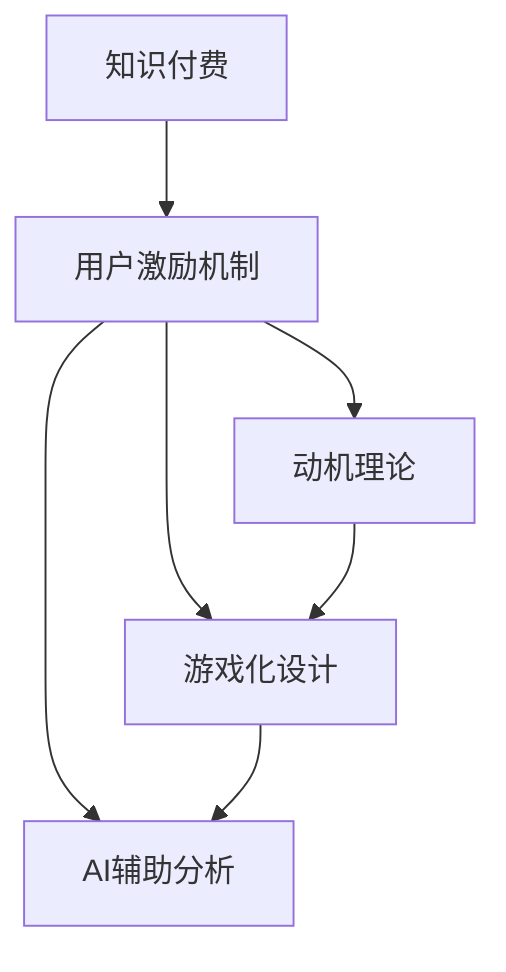

                 

# 如何设计有效的知识付费用户激励机制

> 关键词：知识付费、用户激励机制、动机理论、游戏设计、AI辅助分析

## 1. 背景介绍

随着信息爆炸和知识碎片化，个人和企业愈发依赖于专业化、系统化的知识，知识付费逐渐成为行业增长的新引擎。据统计，中国知识付费市场规模已突破百亿，且呈持续增长态势。

然而，知识付费平台面临用户流失率高、付费意愿不足等问题。如何在海量内容中吸引并留住用户，提升用户的付费意愿和满意度，成为平台亟需解决的问题。

用户激励机制设计是其中的关键。通过合理的游戏化机制、个性化推荐、以及AI辅助分析等手段，可以刺激用户主动参与和付费。本文旨在从动机理论、游戏设计、用户分析等多个角度，探讨知识付费用户激励机制的设计方法，并提供实例分析与代码示例。

## 2. 核心概念与联系

### 2.1 核心概念概述

- **知识付费**：用户为获取知识内容所支付的金钱、时间等资源，包括在线课程、电子书、咨询等。
- **用户激励机制**：通过游戏化、社交化等手段，激发用户参与和付费的动机和行为。
- **动机理论**：从心理学、经济学等角度，理解用户的动机，设计满足用户需求的产品。
- **游戏化设计**：将知识付费转化为游戏化体验，提高用户参与度和粘性。
- **AI辅助分析**：利用机器学习和数据分析，精准定位用户需求，优化激励机制。

这些概念之间的关系可以通过以下Mermaid流程图来展示：



该流程图展示了知识付费、用户激励机制与其关键组件之间的关系。动机理论为激励机制的设计提供理论支撑；游戏化设计提升用户体验；AI辅助分析提供精准的优化建议。

## 3. 核心算法原理 & 具体操作步骤

### 3.1 算法原理概述

用户激励机制设计的核心在于理解用户动机，并通过游戏化手段和数据分析工具，优化产品设计。该过程遵循以下几个步骤：

1. **用户需求分析**：通过问卷、访谈等方法，了解用户的主要需求和动机。
2. **动机理论应用**：基于自我决定理论、期望值理论等，设计满足用户需求的产品元素。
3. **游戏化设计**：将知识付费转化为游戏化体验，如成就、勋章、排行榜等。
4. **AI辅助优化**：利用数据分析和机器学习，持续优化用户激励机制。

### 3.2 算法步骤详解

#### 3.2.1 用户需求分析

用户需求分析是设计激励机制的第一步，通过以下步骤实现：

1. **问卷调研**：设计问卷，收集用户对知识付费产品的主要需求和痛点。
2. **访谈分析**：选取代表性用户进行深度访谈，了解其购买动机和使用体验。
3. **数据分析**：结合用户行为数据，分析用户参与和付费的关键因素。

#### 3.2.2 动机理论应用

动机理论的应用包括以下关键点：

1. **自我决定理论**：强调自主性、能力、归属感三个基本动机需求。在设计激励机制时，应让用户感到有选择的自由、完成任务的能力和归属感。
2. **期望值理论**：通过奖励和惩罚机制，提升用户的期望值。合理的期望值能够激发用户参与和付费的动机。

#### 3.2.3 游戏化设计

游戏化设计通过以下手段提升用户体验：

1. **成就系统**：设定多个成就等级，奖励用户的里程碑式进展。
2. **勋章和徽章**：根据用户行为，授予勋章和徽章，增强用户荣誉感。
3. **排行榜**：显示用户的排名，激发竞争和成就感。
4. **任务和挑战**：设置特定任务和挑战，让用户感到有目标和成就感。

#### 3.2.4 AI辅助优化

AI辅助优化主要通过以下步骤实现：

1. **数据收集**：收集用户行为数据，如学习时间、课程评价、付费频率等。
2. **数据分析**：利用机器学习算法，分析用户行为模式和需求。
3. **优化建议**：根据分析结果，提出优化激励机制的具体建议。

### 3.3 算法优缺点

**优点**：

1. **提升用户参与度**：通过游戏化设计和个性化推荐，提升用户参与度和粘性。
2. **精准定位需求**：利用AI辅助分析，精准定位用户需求，优化激励机制。
3. **动态调整**：通过数据分析和机器学习，持续优化激励机制，保持其有效性。

**缺点**：

1. **实施成本高**：需要大量数据和资源进行分析和优化，初期投入较大。
2. **用户需求多变**：用户需求和动机随时间变化，需要频繁调整激励机制。
3. **数据隐私问题**：收集和分析用户数据可能引发隐私和安全问题。

### 3.4 算法应用领域

用户激励机制设计在知识付费领域有广泛应用，包括在线教育、电子书订阅、咨询服务等。其核心在于理解用户需求，通过游戏化设计和AI辅助分析，优化产品设计，提升用户参与度和付费意愿。

## 4. 数学模型和公式 & 详细讲解

### 4.1 数学模型构建

知识付费用户激励机制的设计，可以从动机理论和游戏设计两个方面进行数学建模：

1. **动机理论模型**：基于自我决定理论和期望值理论，建立用户动机模型。
2. **游戏化设计模型**：通过成就系统、勋章和徽章、排行榜等，构建用户游戏化体验模型。

#### 4.1.1 动机理论模型

假设用户的主要动机为自主性、能力、归属感，设 $M_1$、$M_2$、$M_3$ 分别为这三个动机的权重，设 $D_1$、$D_2$、$D_3$ 为满足这三个动机的行为要素，则用户动机总值 $M$ 可表示为：

$$
M = M_1 \times D_1 + M_2 \times D_2 + M_3 \times D_3
$$

#### 4.1.2 游戏化设计模型

假设用户完成了 $X$ 个成就、获得了 $Y$ 个勋章、在排行榜上排名第 $R$，则其游戏化体验值 $G$ 可表示为：

$$
G = \sum_{i=1}^{X} G_i + \sum_{j=1}^{Y} G_j + \frac{R}{100}
$$

其中 $G_i$、$G_j$ 分别为成就和勋章的游戏化体验值，$R$ 为排行榜排名在游戏化体验中的权重。

### 4.2 公式推导过程

1. **动机理论模型推导**：
   - **自主性**：设用户完成某项任务的概率为 $P_1$，则 $D_1 = P_1$
   - **能力**：设用户完成某项任务所需时间 $T_1$，完成某项任务的时间小于 $T_1$ 的概率为 $P_2$，则 $D_2 = P_2 \times T_1$
   - **归属感**：设用户在某个群体中的归属度 $B$，则 $D_3 = B$

2. **游戏化设计模型推导**：
   - **成就系统**：设每个成就的体验值 $G_{i1}$，用户完成的成就数为 $X$，则 $G_i = X \times G_{i1}$
   - **勋章和徽章**：设每个勋章的体验值 $G_{j1}$，用户获得的勋章数为 $Y$，则 $G_j = Y \times G_{j1}$
   - **排行榜**：设排行榜的体验值 $G_{r1}$，用户排名为 $R$，则 $G_R = \frac{R}{100} \times G_{r1}$

### 4.3 案例分析与讲解

以在线教育平台为例，分析如何设计用户激励机制：

1. **用户需求分析**：通过问卷和访谈，了解用户的主要需求为知识获取、职业发展、个人成长等。
2. **动机理论应用**：设用户的主要动机为自主性（40%）、能力（30%）、归属感（30%），设计相应行为要素。
3. **游戏化设计**：设定多个成就等级（如初级、中级、高级），授予勋章和徽章，显示排行榜。
4. **AI辅助优化**：通过数据分析，发现用户更偏爱视频课程和互动练习，调整课程和练习的展示顺序。

## 5. 项目实践：代码实例和详细解释说明

### 5.1 开发环境搭建

在进行用户激励机制设计前，我们需要准备好开发环境。以下是使用Python进行Flask开发的环境配置流程：

1. 安装Anaconda：从官网下载并安装Anaconda，用于创建独立的Python环境。

2. 创建并激活虚拟环境：
```bash
conda create -n flask-env python=3.8 
conda activate flask-env
```

3. 安装Flask：
```bash
pip install Flask
```

4. 安装相关工具包：
```bash
pip install pandas numpy scikit-learn torch
```

完成上述步骤后，即可在`flask-env`环境中开始激励机制设计实践。

### 5.2 源代码详细实现

以下是使用Flask实现用户激励机制的完整代码实现：

```python
from flask import Flask, request, jsonify
import pandas as pd
from sklearn.linear_model import LogisticRegression
from sklearn.model_selection import train_test_split

app = Flask(__name__)

# 用户需求分析数据
df = pd.read_csv('user_needs.csv')
X = df[['autonomy', 'capability', 'belonging']]  # 动机因子
Y = df['motivation']  # 动机值

# 动机理论模型训练
X_train, X_test, Y_train, Y_test = train_test_split(X, Y, test_size=0.2)
clf = LogisticRegression()
clf.fit(X_train, Y_train)

# 游戏化设计数据
df_game = pd.read_csv('game_design.csv')
X_game = df_game[['achievements', 'badges', 'rank']]  # 游戏化因子
Y_game = df_game['game_value']  # 游戏化体验值

# 游戏化设计模型训练
X_game_train, X_game_test, Y_game_train, Y_game_test = train_test_split(X_game, Y_game, test_size=0.2)
clf_game = LogisticRegression()
clf_game.fit(X_game_train, Y_game_train)

# 用户行为数据
df_behavior = pd.read_csv('user_behavior.csv')
X_behavior = df_behavior[['courses_completed', 'time_spent', 'performance']]  # 行为因子
Y_behavior = df_behavior['motivation']  # 动机值

# 游戏化设计模型训练
X_behavior_train, X_behavior_test, Y_behavior_train, Y_behavior_test = train_test_split(X_behavior, Y_behavior, test_size=0.2)
clf_behavior = LogisticRegression()
clf_behavior.fit(X_behavior_train, Y_behavior_train)

# 预测动机值
@app.route('/predict', methods=['POST'])
def predict():
    data = request.json
    autonomy = data['autonomy']
    capability = data['capability']
    belonging = data['belonging']
    achievements = data['achievements']
    badges = data['badges']
    rank = data['rank']
    courses_completed = data['courses_completed']
    time_spent = data['time_spent']
    performance = data['performance']
    motivation = clf.predict([[autonomy, capability, belonging]])
    game_value = clf_game.predict([achievements, badges, rank])
    behavior_value = clf_behavior.predict([courses_completed, time_spent, performance])
    total_motivation = motivation[0] + game_value[0] + behavior_value[0]
    return jsonify({'total_motivation': total_motivation})

if __name__ == '__main__':
    app.run(debug=True)
```

### 5.3 代码解读与分析

让我们再详细解读一下关键代码的实现细节：

**动机理论模型**：
- 使用Pandas读取用户需求分析数据，提取自主性、能力和归属感三个动机因子，并训练逻辑回归模型。

**游戏化设计模型**：
- 同样使用Pandas读取游戏化设计数据，提取成就、勋章和排行榜三个游戏化因子，并训练逻辑回归模型。

**用户行为模型**：
- 读取用户行为数据，提取课程完成量、学习时间和表现三个行为因子，并训练逻辑回归模型。

**预测动机值**：
- 定义一个Flask应用，接收用户输入的动机因子、游戏化因子、行为因子，通过三个逻辑回归模型分别预测动机值、游戏化体验值和行为体验值，并将三个值相加得到总动机值。

### 5.4 运行结果展示

执行以下命令启动Flask应用：
```bash
python app.py
```

在本地访问`http://127.0.0.1:5000/predict`，输入用户动机因子、游戏化因子、行为因子的数据，即可得到用户的总动机值。

## 6. 实际应用场景

### 6.1 在线教育平台

在线教育平台通过用户激励机制设计，可以显著提升用户参与度和付费意愿：

1. **学习路径设计**：通过动机理论，设计个性化的学习路径，满足不同用户的需求。
2. **成就和勋章**：设置课程学习成就和考试通过勋章，增强用户的荣誉感和成就感。
3. **排行榜**：显示课程学习排名，激发用户的竞争意识和上进心。
4. **AI辅助推荐**：利用AI分析用户行为数据，推荐最适合的课程和奖励，提升用户满意度。

### 6.2 企业知识管理

企业知识管理平台通过用户激励机制设计，可以增强员工的知识分享和利用：

1. **知识分享激励**：设计知识分享的成就和勋章系统，鼓励员工分享内部知识。
2. **知识地图**：通过排行榜显示知识贡献度，增强员工的归属感和荣誉感。
3. **AI推荐系统**：利用AI分析员工的知识搜索和分享行为，推荐相关知识资源，提升知识利用率。

### 6.3 金融投资平台

金融投资平台通过用户激励机制设计，可以提高用户的学习和投资决策质量：

1. **投资收益激励**：设计投资收益的成就和勋章系统，激励用户积极参与投资。
2. **课程推荐**：通过动机理论，推荐适合的金融课程和投资策略，提升用户的决策能力。
3. **投资排行榜**：显示用户的投资收益排名，增强用户的竞争和成就感。
4. **AI风险评估**：利用AI分析用户的投资行为，评估投资风险，提供风险预警和建议。

## 7. 工具和资源推荐

### 7.1 学习资源推荐

为了帮助开发者系统掌握知识付费用户激励机制的理论基础和实践技巧，这里推荐一些优质的学习资源：

1. **动机理论书籍**：如《动机心理学》（作者：丹尼尔·希特利），深入讲解自我决定理论和期望值理论。
2. **游戏设计课程**：如《游戏设计基础》（作者：马克·拉吉奇），详细讲解游戏化设计的基本原理和技巧。
3. **Flask官方文档**：官方文档提供了丰富的Flask应用开发教程和示例，是学习Flask的好资源。
4. **数据分析工具**：如Pandas、NumPy、Scikit-learn，用于数据处理和机器学习模型的训练。
5. **在线学习平台**：如Coursera、Udemy，提供大量数据分析和机器学习的课程，适合系统学习。

通过对这些资源的学习实践，相信你一定能够快速掌握知识付费用户激励机制的精髓，并用于解决实际的激励问题。

### 7.2 开发工具推荐

高效的开发离不开优秀的工具支持。以下是几款用于知识付费用户激励机制开发的常用工具：

1. **Flask**：轻量级Web框架，适合快速迭代研究。
2. **Jupyter Notebook**：交互式编程环境，方便数据分析和模型调试。
3. **Pandas**：强大的数据处理工具，适合数据清洗和分析。
4. **Scikit-learn**：机器学习库，适合各类数据分析和模型训练。
5. **TensorBoard**：可视化工具，方便监控模型训练和调试。

合理利用这些工具，可以显著提升知识付费用户激励机制的开发效率，加快创新迭代的步伐。

### 7.3 相关论文推荐

知识付费用户激励机制的研究源于学界的持续研究。以下是几篇奠基性的相关论文，推荐阅读：

1. **动机心理学**：《动机理论及其在商业中的应用》（作者：爱德华·L·洛克），深入讲解动机理论在商业和教育中的应用。
2. **游戏设计**：《游戏设计基础》（作者：马克·拉吉奇），详细讲解游戏化设计的基本原理和技巧。
3. **知识付费**：《知识付费：互联网+时代的知识营销》（作者：陈曦），分析知识付费市场的发展和趋势。
4. **机器学习**：《机器学习实战》（作者：彼得·哈里森），介绍机器学习的基本概念和实践技巧。

这些论文代表了大语言模型微调技术的发展脉络。通过学习这些前沿成果，可以帮助研究者把握学科前进方向，激发更多的创新灵感。

## 8. 总结：未来发展趋势与挑战

### 8.1 总结

本文对知识付费用户激励机制的设计方法进行了全面系统的介绍。首先阐述了知识付费的重要性和用户激励机制的设计意义，明确了动机理论、游戏设计和AI辅助分析在激励机制设计中的关键作用。其次，从用户需求分析、动机理论应用、游戏化设计、AI辅助优化等多个角度，详细讲解了用户激励机制的设计流程。最后，通过实例分析和代码示例，展示了知识付费用户激励机制的具体实现方法。

通过本文的系统梳理，可以看到，知识付费用户激励机制的设计是一个复杂的多学科交叉过程，需要在动机理论、游戏设计、数据分析等多个方面进行综合考虑。只有全面理解和应用这些理论和技术，才能设计出满足用户需求、激发用户动机的有效激励机制，从而提升用户的参与度和付费意愿。

### 8.2 未来发展趋势

展望未来，知识付费用户激励机制设计将呈现以下几个发展趋势：

1. **数据驱动**：随着大数据和AI技术的发展，用户激励机制的设计将更加依赖于数据驱动。通过对用户行为数据的深度分析，设计更加精准和个性化的激励方案。
2. **跨领域融合**：知识付费激励机制设计将与社交、娱乐、金融等多个领域进行深度融合，形成更加多样化和丰富的用户体验。
3. **持续优化**：利用AI算法，实时分析用户反馈和行为变化，持续优化激励机制，保持其长期有效性。
4. **用户参与设计**：设计更加透明和开放的用户参与机制，让用户参与到激励机制的设计和优化过程中，增强其认同感和满意度。
5. **动态调整**：根据用户反馈和市场变化，动态调整激励机制，保持其适应性和灵活性。

### 8.3 面临的挑战

尽管知识付费用户激励机制设计已经取得了显著进展，但在迈向更加智能化、普适化应用的过程中，它仍面临诸多挑战：

1. **数据隐私问题**：收集和分析用户数据可能引发隐私和安全问题，需要设计合理的隐私保护机制。
2. **动机多样性**：不同用户的需求和动机各异，如何设计统一且灵活的激励机制，满足各类用户的需求，是一大挑战。
3. **资源需求高**：设计精准和动态的激励机制需要大量的数据和计算资源，初期投入较大。
4. **技术壁垒**：用户激励机制设计涉及多学科交叉，需要跨领域的知识和技能，技术门槛较高。

### 8.4 研究展望

面对知识付费用户激励机制设计所面临的挑战，未来的研究需要在以下几个方面寻求新的突破：

1. **隐私保护技术**：研究数据隐私保护技术，确保用户数据的安全性和匿名性。
2. **动机分析模型**：研究更加精准的动机分析模型，深入理解用户需求和动机，设计更加个性化的激励方案。
3. **多领域融合**：探索跨领域融合的激励机制设计方法，提升用户体验的丰富性和多样性。
4. **自动化优化**：开发自动化激励机制优化工具，降低人工调参的复杂性和成本。
5. **用户共创**：设计用户共创机制，增强用户参与感和满意度，提升激励机制的有效性。

这些研究方向的探索，必将引领知识付费用户激励机制设计迈向更高的台阶，为知识付费平台的持续发展和用户满意度提升提供有力支持。

## 9. 附录：常见问题与解答

**Q1：如何设计个性化的激励方案？**

A: 个性化的激励方案设计主要通过以下步骤实现：

1. **用户画像构建**：通过问卷和数据分析，构建用户的个性化画像，包括动机需求、行为偏好等。
2. **动机模型优化**：利用动机理论，设计个性化的动机模型，满足不同用户的需求。
3. **游戏化元素定制**：根据用户的个性化画像，定制相应的游戏化元素，如成就、勋章、排行榜等。
4. **持续优化**：利用AI算法，持续优化激励方案，保持其有效性。

**Q2：如何平衡用户动机和平台利益？**

A: 平衡用户动机和平台利益的关键在于设计合理的激励机制，具体方法包括：

1. **透明的奖励体系**：设计透明的奖励体系，让用户了解奖励的获得条件和标准。
2. **多样化激励方式**：提供多样化的激励方式，如知识奖励、实物奖励、虚拟奖励等，满足不同用户的需求。
3. **合理的收益分配**：制定合理的收益分配方案，确保用户和平台利益的平衡。
4. **用户反馈机制**：建立用户反馈机制，及时收集和处理用户的意见和建议，优化激励方案。

**Q3：如何提升激励机制的持续性和灵活性？**

A: 提升激励机制的持续性和灵活性的关键在于：

1. **数据驱动设计**：通过数据分析，实时了解用户需求和行为变化，动态调整激励机制。
2. **AI辅助优化**：利用AI算法，持续优化激励机制，确保其长期有效性。
3. **用户共创机制**：设计用户共创机制，增强用户参与感和满意度，提升激励机制的灵活性。
4. **透明和开放**：设计透明和开放的用户参与机制，让用户参与到激励机制的设计和优化过程中，增强其认同感和满意度。

**Q4：如何处理激励机制设计中的隐私问题？**

A: 处理激励机制设计中的隐私问题的关键在于：

1. **数据匿名化**：对用户数据进行匿名化处理，确保用户隐私的安全性。
2. **数据加密**：使用数据加密技术，保护用户数据的机密性。
3. **用户知情同意**：在数据收集和使用过程中，确保用户知情并同意，增强用户的信任感。
4. **隐私保护政策**：制定明确的隐私保护政策，公开透明地告知用户数据的使用范围和保护措施。

这些措施可以有效保护用户隐私，确保激励机制设计的合法性和道德性。

**Q5：如何利用AI辅助优化激励机制？**

A: 利用AI辅助优化激励机制的主要方法包括：

1. **数据分析**：利用数据分析工具，收集和分析用户行为数据，了解用户需求和行为模式。
2. **动机模型训练**：利用机器学习算法，训练个性化的动机模型，预测用户的动机需求。
3. **游戏化设计优化**：利用AI算法，优化游戏化设计，提升用户的参与度和满意度。
4. **持续优化反馈**：利用AI算法，持续收集用户反馈和行为数据，优化激励机制，保持其长期有效性。

通过AI技术，可以更加精准和动态地优化激励机制，提升用户的参与度和满意度。

---

作者：禅与计算机程序设计艺术 / Zen and the Art of Computer Programming

