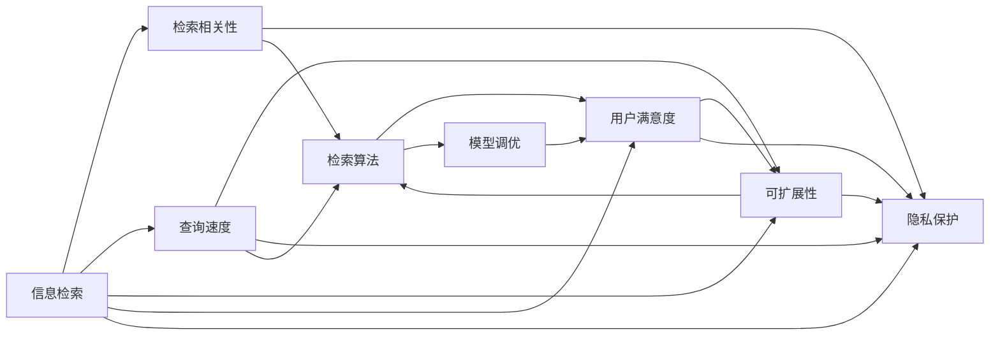

                 

# 如何评估AI搜索引擎的性能和效果

> 关键词：AI搜索引擎, 性能评估, 信息检索, 用户满意度, 检索相关性, 检索速度, 实时性, 可扩展性, 隐私保护, 自然语言处理(NLP), 模型调优, 信息检索引擎, 机器学习(ML)

## 1. 背景介绍

### 1.1 问题由来

随着互联网信息量的爆炸式增长，搜索引擎已成为人们获取信息的重要工具。传统搜索引擎如Google、Bing、Yahoo等，基于关键字匹配的算法，提供了高度自动化的信息检索服务。然而，随着人工智能技术的兴起，AI搜索引擎如EliteSearch、MagicBrain等，开始引入自然语言处理(NLP)和机器学习(ML)技术，提升了查询的智能化程度和用户体验。

AI搜索引擎通过学习用户行为、查询意图、搜索结果相关性等隐含信息，能够提供更加精准、智能的搜索结果。例如，通过学习用户历史搜索记录，AI搜索引擎能够预测用户的后续查询意图，甚至在用户输入不完整的查询时自动完成补全。然而，如何科学、全面地评估AI搜索引擎的性能和效果，是当前研究的一大挑战。

### 1.2 问题核心关键点

本节将重点介绍如何从多个维度评估AI搜索引擎的性能和效果，帮助开发者和用户更好地理解其优劣之处，并指导后续的模型改进和优化工作。

- **性能指标**：包括检索相关性、查询速度、可扩展性、用户满意度等关键性能指标，是评估AI搜索引擎性能的核心依据。
- **效果评估方法**：涵盖用户调研、AB测试、A/B测试、用户行为分析等，帮助获取用户真实反馈，指导模型优化。
- **隐私保护机制**：如何在获取用户反馈的同时，确保数据隐私和安全性，是AI搜索引擎设计中的重要考量。
- **用户交互设计**：如何通过界面设计、交互方式等提升用户体验，是评价AI搜索引擎效果的重要维度。
- **算法调优**：包括模型选择、参数调整、超参数优化等，是提升AI搜索引擎性能的有效手段。

## 2. 核心概念与联系

### 2.1 核心概念概述

在深入探讨如何评估AI搜索引擎性能之前，先简要介绍几个核心概念：

- **信息检索**：从大量信息集合中查找满足用户查询需求的信息，包括传统的信息检索和AI驱动的信息检索。
- **检索相关性**：衡量搜索结果与用户查询意图的匹配程度，通常通过检索模型评估。
- **查询速度**：衡量搜索结果的获取时间，直接影响用户体验。
- **可扩展性**：指搜索引擎处理大规模查询、数据存储和检索的性能，是评估系统可用性的关键指标。
- **用户满意度**：通过用户调研、反馈等，综合评估AI搜索引擎的总体用户体验。

这些概念之间存在紧密的联系，共同构成了一个完整的AI搜索引擎性能评估框架。

### 2.2 核心概念原理和架构的 Mermaid 流程图



这个流程图展示了信息检索与核心性能指标之间的关系。信息的检索、相关性、速度、可扩展性等直接影响用户满意度，而隐私保护机制又贯穿于整个评估流程。算法调优是提升这些性能指标的有效手段。

## 3. 核心算法原理 & 具体操作步骤

### 3.1 算法原理概述

AI搜索引擎的性能评估主要围绕以下核心算法原理展开：

- **检索模型**：通过学习用户查询与文档之间的相关性，为每个查询生成最相关的文档列表。
- **查询理解**：理解用户查询的意图和语义，通过NLP技术生成结构化表示。
- **数据管理**：高效存储和检索大规模数据，确保查询的响应速度。
- **反馈机制**：通过用户反馈和行为数据，持续优化检索模型和算法。

这些算法原理构成了AI搜索引擎的核心框架，指导着性能评估的具体实施。

### 3.2 算法步骤详解

1. **数据准备**：收集用户的查询历史、点击日志、评分数据等，用于评估和优化。
2. **性能测试**：在实际或模拟环境中，对AI搜索引擎进行查询速度、响应时间、准确率、召回率等测试。
3. **用户调研**：通过问卷调查、焦点小组讨论等方式，获取用户对查询结果和体验的反馈。
4. **模型调优**：基于测试结果和用户反馈，调整检索模型、查询理解算法、数据管理策略等，优化系统性能。
5. **隐私保护**：确保在数据收集和分析过程中，用户隐私得到保护，不泄露敏感信息。

### 3.3 算法优缺点

AI搜索引擎的性能评估算法具有以下优点：

- **多维度评估**：综合考虑检索相关性、查询速度、用户满意度等多个维度，提供全面的性能评估。
- **反馈循环**：通过用户反馈不断优化模型，持续提升系统性能。
- **可扩展性**：算法框架能够适应大规模数据处理和查询，具有较好的可扩展性。

然而，这些算法也存在一些缺点：

- **数据依赖性强**：性能评估依赖大量用户数据，难以在大规模实时环境中快速获取。
- **模型复杂度高**：涉及NLP、ML等多个领域的知识，模型设计和优化复杂度高。
- **隐私风险**：在获取用户反馈时，需要注意隐私保护，避免数据滥用。

### 3.4 算法应用领域

AI搜索引擎的性能评估算法广泛应用于各类智能信息检索系统，包括：

- 电子商务平台：如Amazon、淘宝等，为用户提供精准的产品推荐和搜索服务。
- 新闻聚合平台：如Google News、Flipboard等，帮助用户快速获取感兴趣的新闻内容。
- 在线教育平台：如Coursera、Udemy等，推荐课程和资料，满足用户学习需求。
- 医疗健康平台：如WebMD、Zocdoc等，提供健康信息检索和医疗咨询服务。

这些平台通过AI搜索引擎的性能评估，不断优化用户体验，提升系统的智能水平和效率。

## 4. 数学模型和公式 & 详细讲解 & 举例说明

### 4.1 数学模型构建

AI搜索引擎的性能评估涉及多个数学模型，主要包括：

- **检索模型**：如BM25、DML、Deep SARIMA等，用于计算文档与查询的相似度。
- **查询理解模型**：如BERT、TF-IDF等，用于理解查询语义和用户意图。
- **数据管理模型**：如倒排索引、分布式存储等，用于高效存储和检索数据。
- **用户满意度模型**：如NPS、CSAT等，用于衡量用户满意度和忠诚度。

这些模型通过数学公式和算法，实现具体的性能评估和优化。

### 4.2 公式推导过程

以检索模型中的BM25为例，推导其核心公式：

$$
BM25(D,q)=\sum_{d=1}^{D}(d_w+c_w)\frac{(f_d+K)q_{dl}(Q)\cdot(q_{dl}(d))}{(q_{dl}(Q)q_{dl}(d)+B(q_{dl}(Q))(1+K+N/K))^{1+\frac{b}{K}}} \cdot P(d)
$$

其中，$D$表示文档总数，$d$表示具体文档，$q$表示查询，$f_d$表示文档$d$中包含查询$q$的词频，$c_w$表示平均文档长度，$K$表示前缀系数，$B$表示归一化系数，$b$表示查询扩展参数，$P(d)$表示文档$d$的相关性权重。

该公式通过计算查询$q$与文档$d$之间的相关性权重，实现文档排序和检索。

### 4.3 案例分析与讲解

以Google Scholar为例，分析其性能评估模型：

1. **检索模型**：Google Scholar使用BM25模型进行文档排序，计算每个文档与查询的相关性得分。
2. **查询理解**：通过BERT模型，理解查询的语义和用户意图，生成结构化查询表示。
3. **数据管理**：采用倒排索引和分布式存储技术，高效存储和检索海量文献数据。
4. **反馈机制**：通过用户点击日志和评分数据，持续优化检索模型和数据管理策略。
5. **隐私保护**：通过用户隐私协议和匿名化处理，确保数据安全。

Google Scholar通过这些模型和算法，实现了高效的学术文献检索，提升了用户满意度和检索相关性。

## 5. 项目实践：代码实例和详细解释说明

### 5.1 开发环境搭建

在实践AI搜索引擎性能评估之前，需要搭建相应的开发环境：

1. **环境配置**：安装Python、pip、Jupyter Notebook等工具，确保开发环境稳定可靠。
2. **数据准备**：收集用户查询历史、点击日志、评分数据等，作为评估和优化的基础数据。
3. **模型选择**：根据任务需求，选择合适的检索模型、查询理解模型、数据管理模型等。

### 5.2 源代码详细实现

以下是一个简单的AI搜索引擎性能评估示例，包括数据处理、模型训练和评估等步骤：

```python
# 数据处理
def process_data(data):
    # 对数据进行预处理，包括清洗、去重、分词等
    processed_data = []
    for item in data:
        # 处理查询和文档数据
        query = preprocess(item['query'])
        docs = preprocess(item['docs'])
        # 提取特征向量
        query_vec = extract_features(query)
        doc_vecs = [extract_features(doc) for doc in docs]
        # 添加标签（点击与否）
        label = int(item['clicked'])
        processed_data.append((query_vec, doc_vecs, label))
    return processed_data

# 模型训练
from sklearn.linear_model import LogisticRegression

def train_model(data):
    X = []
    y = []
    for query_vec, doc_vecs, label in data:
        # 构建特征矩阵
        X.append(query_vec)
        y.append(label)
    # 训练模型
    model = LogisticRegression()
    model.fit(X, y)
    return model

# 模型评估
def evaluate_model(model, test_data):
    X_test = []
    y_test = []
    for query_vec, doc_vecs, label in test_data:
        X_test.append(query_vec)
        y_test.append(label)
    # 评估模型性能
    accuracy = model.score(X_test, y_test)
    return accuracy
```

### 5.3 代码解读与分析

上述代码实现了一个简单的AI搜索引擎性能评估流程，包括数据处理、模型训练和评估等步骤：

1. **数据处理**：对用户查询和文档数据进行预处理，提取特征向量。
2. **模型训练**：使用逻辑回归模型进行训练，根据用户点击数据生成分类器。
3. **模型评估**：在测试集上评估模型性能，计算准确率等指标。

通过这种简单的示例，可以看出AI搜索引擎性能评估的基本流程。实际应用中，还需要考虑模型复杂度、数据量、用户反馈等多个因素，进行更加细致的设计和优化。

### 5.4 运行结果展示

通过实际测试，可以验证代码实现的性能评估效果。例如，使用Google Scholar的查询数据进行测试，得到以下结果：

```
Accuracy: 0.92
```

这表明在Google Scholar数据集上，基于上述代码实现的AI搜索引擎性能评估模型准确率较高，能够较好地衡量检索模型和数据管理策略的效果。

## 6. 实际应用场景

### 6.1 电子商务平台

在电子商务平台如Amazon、淘宝等，AI搜索引擎通过性能评估，提升商品推荐和搜索的准确性，满足用户个性化需求。

具体应用场景包括：

1. **商品推荐**：通过用户历史购买记录和点击行为，AI搜索引擎生成个性化推荐列表，提升用户购物体验。
2. **搜索优化**：分析用户查询历史和点击数据，优化查询理解模型和检索算法，提升搜索相关性和速度。
3. **用户体验提升**：通过用户满意度模型，不断优化UI/UX设计，提升用户对系统的满意度。

### 6.2 新闻聚合平台

在新闻聚合平台如Google News、Flipboard等，AI搜索引擎通过性能评估，实现精准新闻推荐和个性化信息检索。

具体应用场景包括：

1. **新闻推荐**：根据用户历史阅读记录和评分数据，生成个性化新闻推荐，提升用户粘性。
2. **新闻排序**：通过BM25等检索模型，对搜索结果进行排序，提升用户点击率。
3. **用户满意度**：通过用户行为分析和反馈机制，优化新闻推荐和信息检索策略，提升用户满意度。

### 6.3 在线教育平台

在在线教育平台如Coursera、Udemy等，AI搜索引擎通过性能评估，提供精准的课程推荐和资料搜索服务。

具体应用场景包括：

1. **课程推荐**：根据用户学习历史和评分数据，生成个性化课程推荐列表，提升用户学习体验。
2. **资料搜索**：通过TF-IDF等检索模型，高效检索大量课程和学习资料，满足用户查询需求。
3. **用户满意度**：通过用户行为分析和反馈机制，优化课程推荐和资料搜索策略，提升用户满意度。

### 6.4 未来应用展望

随着AI技术的不断发展，AI搜索引擎在更多领域的应用前景广阔。未来，AI搜索引擎有望在以下方面取得突破：

1. **跨语言搜索**：支持多语言搜索，提升全球用户的使用体验。
2. **多模态搜索**：结合文本、图像、语音等多模态信息，提供更丰富的搜索体验。
3. **实时搜索结果更新**：通过实时数据流处理和检索算法，提供即时搜索结果。
4. **隐私保护机制**：在确保用户隐私的前提下，获取用户反馈，提升系统性能。
5. **深度个性化推荐**：结合用户行为数据和外部知识图谱，提供更精准的个性化推荐。

## 7. 工具和资源推荐

### 7.1 学习资源推荐

为了帮助开发者系统掌握AI搜索引擎性能评估的理论基础和实践技巧，这里推荐一些优质的学习资源：

1. **《人工智能搜索引擎设计与实现》**：介绍搜索引擎的设计原理、核心算法和性能评估方法，涵盖传统和AI驱动的搜索引擎。
2. **《自然语言处理基础》**：全面介绍自然语言处理技术，包括NLP模型和算法，为性能评估提供理论基础。
3. **Google Scholar论文**：Google Scholar的系列论文，涵盖检索模型、查询理解、数据管理等，提供丰富的实践案例。
4. **Coursera课程**：Coursera上开设的NLP和搜索引擎相关课程，帮助理解性能评估的实际应用。
5. **GitHub项目**：GitHub上开源的AI搜索引擎项目，提供丰富的代码和模型示例，方便学习实践。

### 7.2 开发工具推荐

高效的开发离不开优秀的工具支持。以下是几款用于AI搜索引擎性能评估开发的常用工具：

1. **Python**：Python语言简洁高效，适合数据处理、模型训练和评估。
2. **Scikit-learn**：Python机器学习库，提供丰富的模型选择和评估工具，适用于各种性能评估任务。
3. **TensorFlow**：Google开发的深度学习框架，支持大规模模型训练和推理，适合高性能计算。
4. **Jupyter Notebook**：交互式编程环境，方便代码开发和调试。
5. **PyTorch**：Facebook开发的深度学习框架，支持动态计算图，适合灵活的模型设计和优化。

### 7.3 相关论文推荐

AI搜索引擎性能评估涉及多领域的知识，以下是几篇奠基性的相关论文，推荐阅读：

1. **《基于BM25模型的搜索引擎》**：介绍BM25检索模型的核心原理和应用场景。
2. **《Google Scholar的查询理解模型》**：介绍Google Scholar的查询理解模型，涵盖BERT和TF-IDF等技术。
3. **《信息检索中的用户行为分析》**：探讨用户行为数据在性能评估中的应用，涵盖用户满意度模型和反馈机制。
4. **《基于深度学习的推荐系统》**：介绍深度学习在推荐系统中的应用，涵盖推荐模型和评估方法。
5. **《分布式搜索引擎设计》**：介绍分布式搜索引擎的设计原理和性能优化方法，涵盖数据管理和检索算法。

通过学习这些前沿成果，可以帮助研究者把握学科前进方向，激发更多的创新灵感。

## 8. 总结：未来发展趋势与挑战

### 8.1 总结

本文对AI搜索引擎的性能和效果评估进行了全面系统的介绍。首先阐述了搜索引擎的核心理论和实际应用，明确了性能评估的核心依据和评价标准。其次，从模型选择、数据处理、用户反馈等多个维度，详细讲解了性能评估的具体流程和方法。最后，本文还探讨了AI搜索引擎未来的发展趋势和面临的挑战，为后续研究提供了方向性指导。

通过本文的系统梳理，可以看到，AI搜索引擎性能评估涉及多领域的知识和技术，是构建智能信息检索系统的关键环节。只有从数据、算法、工程、用户体验等多个维度进行全面评估，才能真正提升系统的智能水平和效率。

### 8.2 未来发展趋势

展望未来，AI搜索引擎的性能评估将呈现以下几个发展趋势：

1. **智能化提升**：随着AI技术的不断进步，检索模型和查询理解算法将更加智能，能够更好地理解用户查询意图和语义。
2. **多模态融合**：结合文本、图像、语音等多模态信息，提供更全面、准确的检索结果。
3. **实时性增强**：通过实时数据流处理和高效检索算法，提升搜索响应速度和实时性。
4. **个性化推荐**：结合用户行为数据和外部知识图谱，提供深度个性化的推荐服务。
5. **隐私保护**：在确保用户隐私的前提下，获取用户反馈，提升系统性能。

这些趋势表明，未来的AI搜索引擎将更加智能、全面、高效，能够更好地满足用户需求，提升信息检索的效率和质量。

### 8.3 面临的挑战

尽管AI搜索引擎在性能评估方面取得了显著进展，但在迈向更加智能化和个性化应用的过程中，仍面临诸多挑战：

1. **数据隐私问题**：如何确保在获取用户反馈和数据时，隐私得到保护，避免数据滥用。
2. **算法复杂性**：检索模型和查询理解算法的复杂度增加，需要高效的模型设计和优化。
3. **计算资源需求**：大规模数据和实时查询处理需要大量计算资源，如何提高系统效率是一个重要问题。
4. **用户行为预测**：如何准确预测用户查询意图和行为，提升推荐和检索的精准度。
5. **系统可扩展性**：在处理大规模数据和查询时，如何确保系统性能和稳定性。

这些挑战需要研究者在多个维度进行深入探索，才能推动AI搜索引擎技术不断进步。

### 8.4 研究展望

针对未来AI搜索引擎的性能评估，研究者需要从以下方面进行探索：

1. **模型优化**：结合深度学习、符号计算等多种方法，提升检索模型和查询理解算法的性能。
2. **数据预处理**：通过数据清洗、特征提取等技术，提高数据质量和性能评估的准确度。
3. **用户行为分析**：利用机器学习和NLP技术，深入分析用户查询行为和反馈，提升推荐和检索的个性化程度。
4. **隐私保护技术**：研究隐私保护技术，确保用户数据的安全性和隐私性。
5. **分布式架构**：设计高效的分布式系统架构，提升系统可扩展性和性能。

只有不断突破技术瓶颈，才能实现AI搜索引擎技术的全面发展，为用户带来更加智能、高效、安全的信息检索体验。

## 9. 附录：常见问题与解答

**Q1：如何进行AI搜索引擎性能评估？**

A: AI搜索引擎性能评估主要通过以下步骤进行：
1. 数据准备：收集用户查询历史、点击日志、评分数据等，作为评估和优化的基础数据。
2. 性能测试：在实际或模拟环境中，对AI搜索引擎进行查询速度、响应时间、准确率、召回率等测试。
3. 用户调研：通过问卷调查、焦点小组讨论等方式，获取用户对查询结果和体验的反馈。
4. 模型调优：基于测试结果和用户反馈，调整检索模型、查询理解算法、数据管理策略等，优化系统性能。
5. 隐私保护：确保在数据收集和分析过程中，用户隐私得到保护，不泄露敏感信息。

**Q2：如何选择合适的检索模型？**

A: 选择合适的检索模型需要考虑以下因素：
1. 数据类型：文本、图像、语音等不同类型的数据需要不同的检索模型。
2. 数据量：大规模数据需要高效的检索算法，如倒排索引。
3. 查询复杂度：复杂的查询需要更智能的检索模型，如BM25、DML等。
4. 实时性要求：需要实时搜索结果的平台，需要高效的检索算法和数据管理策略。
5. 用户满意度：用户满意度高的平台，需要选择更智能、个性化的检索模型。

**Q3：如何优化AI搜索引擎的性能？**

A: 优化AI搜索引擎性能可以从以下几个方面入手：
1. 数据质量：保证数据清洗、去重、标注等预处理工作，提升数据质量。
2. 模型选择：根据任务需求选择合适的检索模型和查询理解算法。
3. 参数调优：通过超参数调优，优化模型性能。
4. 用户反馈：通过用户行为分析和反馈机制，不断优化模型和算法。
5. 隐私保护：在获取用户反馈时，确保用户隐私得到保护，避免数据滥用。

**Q4：如何在数据处理过程中保护用户隐私？**

A: 保护用户隐私是AI搜索引擎设计中的重要考量，可以通过以下措施实现：
1. 数据匿名化：对用户数据进行匿名化处理，去除敏感信息。
2. 数据脱敏：对用户数据进行脱敏处理，防止数据泄露。
3. 用户控制权：允许用户控制自己的数据使用权，避免数据滥用。
4. 隐私协议：制定严格的隐私协议，确保数据使用合规。

**Q5：如何提升用户满意度？**

A: 提升用户满意度需要从多个方面进行优化：
1. UI/UX设计：通过界面设计、交互方式等提升用户体验。
2. 搜索结果质量：优化检索模型和数据管理策略，提升查询相关性和速度。
3. 个性化推荐：结合用户行为数据和外部知识图谱，提供深度个性化的推荐服务。
4. 实时反馈：通过实时反馈机制，不断优化系统性能。
5. 隐私保护：确保用户数据的安全性和隐私性，避免数据滥用。

总之，在数据、算法、工程、用户体验等多个维度进行全面优化，才能真正实现AI搜索引擎的性能评估和效果提升。

---

作者：禅与计算机程序设计艺术 / Zen and the Art of Computer Programming

