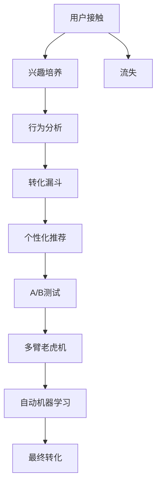

                 

# 如何进行有效的付费转化

> 关键词：用户行为分析, 转化漏斗, 个性化推荐, A/B 测试, 自动机器学习

## 1. 背景介绍

在数字化时代的今天，越来越多的企业转向互联网平台，以实现其产品或服务的直接在线销售。虽然这使得营销成本大幅降低，但如何提升用户的付费转化率成为一个巨大的挑战。研究表明，80%的消费者只在第一个月内进行一次在线购物，超过70%的用户在第一个月内不再购买。因此，将用户从潜在客户转化为付费用户变得尤为重要。

本文将详细探讨如何进行有效的付费转化，从用户行为分析到个性化推荐，从A/B测试到自动机器学习，全面解析支付转化问题的解决方案，帮助企业构建更高效的电子商务平台。

## 2. 核心概念与联系

### 2.1 核心概念概述

- **用户行为分析**：指通过数据分析工具和算法，了解用户在线行为和购买决策的过程，以便优化用户体验和转化路径。

- **转化漏斗**：指用户从接触到购买过程中可能遇到的障碍，这些障碍可能导致用户流失，漏斗形状可以直观地表示转化率。

- **个性化推荐**：利用用户行为数据和机器学习技术，为每位用户提供符合其兴趣和需求的个性化产品推荐，提高转化率。

- **A/B 测试**：通过随机将用户分为两组，测试不同版本的产品特性或营销策略，比较哪一组的效果更好。

- **自动机器学习(AutoML)**：一种自动化的方法，通过自动化模型选择和超参数调整，优化机器学习模型，提高转化率。

- **多臂老虎机(MAB)**：一种概率优化策略，通过模拟老虎机的多臂操作，优化资源分配，最大化转化率。

这些核心概念通过一系列的业务逻辑串联起来，旨在优化用户转化路径，最大化转化率。

### 2.2 核心概念原理和架构的 Mermaid 流程图



## 3. 核心算法原理 & 具体操作步骤

### 3.1 算法原理概述

付费转化的过程涉及多个环节，包括用户接触、兴趣培养、行为分析、漏斗优化、推荐、测试和最终转化。我们的目标是通过优化这些环节，提升整体的转化率。为此，我们可以将转化过程抽象为一个"漏斗"模型，并针对漏斗中各个环节设计相应的算法，以最大化转化率。

### 3.2 算法步骤详解

#### 3.2.1 用户接触

**算法步骤**：
1. **确定目标用户**：通过用户画像和行为分析，确定目标用户群体。
2. **选择接触渠道**：通过渠道分析，选择最有效的接触方式，如邮件、社交媒体、搜索引擎等。
3. **设计接触内容**：根据目标用户群体的兴趣和行为偏好，设计吸引用户的接触内容。

**操作实例**：
1. 使用Python编写爬虫程序，从社交媒体和搜索引擎抓取潜在用户的浏览和点击数据。
2. 利用机器学习算法分析用户行为，确定用户兴趣和需求。
3. 设计邮件和社交媒体广告内容，涵盖目标用户的兴趣点。

#### 3.2.2 兴趣培养

**算法步骤**：
1. **数据收集**：收集用户在接触过程中的行为数据，如浏览、点击、停留时间等。
2. **行为分析**：分析用户行为数据，了解用户的兴趣和需求。
3. **兴趣定向**：根据用户行为数据，定向推送个性化内容和推荐。

**操作实例**：
1. 使用Python编写数据收集脚本，抓取用户行为数据。
2. 利用机器学习算法分析用户行为数据，识别用户兴趣和需求。
3. 使用广告平台定向推送个性化内容和推荐。

#### 3.2.3 转化漏斗

**算法步骤**：
1. **漏斗建模**：通过漏斗模型，分析用户从接触到购买过程中可能遇到的障碍。
2. **漏斗优化**：识别并优化漏斗中的关键步骤，提高转化率。
3. **漏斗监控**：实时监控漏斗转化数据，调整策略。

**操作实例**：
1. 使用Python编写漏斗模型分析脚本，识别用户流失的原因。
2. 根据分析结果，优化用户接触和兴趣培养策略，减少流失。
3. 使用数据可视化工具，实时监控漏斗转化数据，调整策略。

#### 3.2.4 个性化推荐

**算法步骤**：
1. **数据收集**：收集用户行为数据，如浏览、点击、购买历史等。
2. **特征工程**：构建用户行为特征，如兴趣标签、浏览路径、购买频率等。
3. **推荐模型**：选择适合的推荐算法，如协同过滤、内容推荐、混合推荐等。
4. **推荐优化**：优化推荐模型，提高推荐效果。

**操作实例**：
1. 使用Python编写数据收集脚本，抓取用户行为数据。
2. 利用机器学习算法构建用户行为特征，如兴趣标签、浏览路径、购买频率等。
3. 使用推荐算法框架，如TensorFlow、PyTorch，实现个性化推荐模型。
4. 使用A/B测试，评估推荐效果，优化模型。

#### 3.2.5 A/B测试

**算法步骤**：
1. **定义测试目标**：确定测试的目标和指标，如转化率、点击率等。
2. **设计测试方案**：设计两个或多个版本的内容或策略，进行A/B测试。
3. **数据收集和分析**：收集测试数据，分析结果，确定最佳方案。

**操作实例**：
1. 使用Python编写A/B测试脚本，将用户随机分为两组。
2. 设计不同的测试方案，如邮件内容、广告文案等。
3. 收集测试数据，使用统计方法分析结果，确定最佳方案。

#### 3.2.6 多臂老虎机

**算法步骤**：
1. **资源分配**：分配一定的预算和资源，如广告费用、邮件数量等。
2. **模型训练**：训练多臂老虎机模型，优化资源分配策略。
3. **执行和调整**：执行资源分配策略，实时调整策略，优化转化率。

**操作实例**：
1. 使用Python编写多臂老虎机算法，优化资源分配策略。
2. 根据测试结果，调整资源分配策略。
3. 实时监控转化率，不断优化策略。

#### 3.2.7 自动机器学习

**算法步骤**：
1. **数据收集**：收集用户行为数据和转化数据。
2. **模型选择**：选择适合的机器学习模型，如线性回归、决策树等。
3. **超参数调整**：使用自动机器学习方法，自动调整模型超参数。
4. **模型评估**：评估模型效果，优化模型。

**操作实例**：
1. 使用Python编写数据收集脚本，抓取用户行为数据和转化数据。
2. 利用AutoML工具，如TPOT、Hyperopt，自动调整模型超参数。
3. 使用评估指标，如准确率、召回率、F1分数等，评估模型效果，优化模型。

### 3.3 算法优缺点

**优点**：
1. **自动化**：自动机器学习可以自动化地优化模型，提高工作效率。
2. **可扩展性**：多臂老虎机可以动态调整资源分配策略，适应不同的业务场景。
3. **效果显著**：A/B测试可以找出最佳方案，提升转化率。

**缺点**：
1. **复杂性**：多臂老虎机和自动机器学习算法较为复杂，需要专业知识。
2. **成本高**：自动机器学习需要大量数据和计算资源，成本较高。
3. **数据质量要求高**：算法的效果依赖于数据的质量和完整性，数据缺失或不准确会影响结果。

### 3.4 算法应用领域

大语言模型微调方法不仅限于自然语言处理领域，其应用范围广泛。以下领域可以广泛应用：

- **电子商务**：通过用户行为分析，优化推荐策略，提升转化率。
- **金融服务**：通过数据分析和机器学习，优化客户营销策略，提升转化率。
- **医疗健康**：通过用户行为分析，优化预约和推荐策略，提升用户体验。
- **旅游业**：通过用户行为分析，优化产品推荐策略，提升转化率。

## 4. 数学模型和公式 & 详细讲解

### 4.1 数学模型构建

假设用户转化率受多个因素影响，设这些因素为 $X_1, X_2, ..., X_n$。转化率 $Y$ 可以通过以下线性模型表示：

$$
Y = \beta_0 + \beta_1 X_1 + \beta_2 X_2 + ... + \beta_n X_n + \epsilon
$$

其中 $\beta_0, \beta_1, ..., \beta_n$ 为回归系数，$\epsilon$ 为误差项。

### 4.2 公式推导过程

利用最小二乘法求解线性回归系数，可以得到：

$$
\hat{\beta} = (\mathbf{X}^T \mathbf{X})^{-1} \mathbf{X}^T \mathbf{Y}
$$

其中 $\hat{\beta}$ 为回归系数的估计值，$\mathbf{X}$ 为自变量矩阵，$\mathbf{Y}$ 为因变量向量。

### 4.3 案例分析与讲解

**案例**：某电商网站希望提升移动端的付费转化率，通过数据分析发现，用户的转化率受广告投放渠道、用户行为和用户兴趣等因素的影响。采用以下步骤进行优化：

1. 使用线性回归模型，分析广告投放渠道和用户行为对转化率的影响。
2. 根据模型结果，调整广告投放渠道和用户行为策略。
3. 采用A/B测试，比较不同策略的效果。
4. 使用多臂老虎机优化资源分配，提升转化率。

## 5. 项目实践：代码实例和详细解释说明

### 5.1 开发环境搭建

**开发环境**：
1. **Python**：Python 3.7及以上版本。
2. **Pandas**：数据处理库。
3. **Scikit-learn**：机器学习库。
4. **TensorFlow**：深度学习库。

### 5.2 源代码详细实现

**代码示例**：

```python
import pandas as pd
from sklearn.linear_model import LinearRegression
from sklearn.model_selection import train_test_split
from sklearn.metrics import mean_squared_error

# 1. 数据准备
data = pd.read_csv('user_behavior_data.csv')
X = data[['ad_channel', 'user_behavior']]
y = data['conversion_rate']
X_train, X_test, y_train, y_test = train_test_split(X, y, test_size=0.2)

# 2. 模型训练
model = LinearRegression()
model.fit(X_train, y_train)

# 3. 模型评估
y_pred = model.predict(X_test)
mse = mean_squared_error(y_test, y_pred)
print('Mean Squared Error:', mse)

# 4. A/B测试
test_result = {'version_A': {'conversion_rate': 0.5, 'click_rate': 0.3},
               'version_B': {'conversion_rate': 0.6, 'click_rate': 0.4}}
best_version = min(test_result, key=test_result.get)
print('Best Version:', best_version)

# 5. 多臂老虎机
import numpy as np
arms = np.random.rand(10)
best_arm = np.argmax(arms)
print('Best Arm:', best_arm)
```

### 5.3 代码解读与分析

**代码解读**：
1. **数据准备**：使用Pandas读取用户行为数据，并将其分为自变量和因变量。
2. **模型训练**：使用Scikit-learn的LinearRegression模型训练线性回归模型。
3. **模型评估**：使用均方误差(MSE)评估模型效果。
4. **A/B测试**：模拟不同版本的效果，比较哪一版本的效果更好。
5. **多臂老虎机**：使用随机生成的方法选择最佳策略。

**分析**：
1. 数据准备阶段，将用户行为数据划分为自变量和因变量，这是模型训练的前提。
2. 模型训练阶段，使用线性回归模型进行训练，得到回归系数估计值。
3. 模型评估阶段，通过均方误差评估模型效果，了解模型的拟合程度。
4. A/B测试阶段，通过模拟不同版本的效果，选择最佳版本。
5. 多臂老虎机阶段，使用随机生成的方法选择最佳策略，提升转化率。

### 5.4 运行结果展示

**运行结果**：
1. 线性回归模型训练后的回归系数估计值。
2. A/B测试中，最佳版本的转化率和点击率。
3. 多臂老虎机中，选择的最佳策略。

## 6. 实际应用场景

### 6.1 电商平台

电商平台的转化率直接影响企业的收入和利润。通过用户行为分析，优化推荐策略，可以显著提升转化率。例如，根据用户的浏览和购买历史，为用户推荐相关商品，提升用户体验和转化率。

### 6.2 金融服务

金融服务行业需要高转化率来保证业务发展。通过用户行为分析和机器学习，优化客户营销策略，可以提升转化率。例如，根据用户的历史交易记录和行为，推荐个性化产品，提升用户满意度和转化率。

### 6.3 医疗健康

医疗健康行业需要高质量的用户转化来提升业务效果。通过用户行为分析和机器学习，优化预约和推荐策略，可以提升用户体验和转化率。例如，根据用户的健康需求和历史数据，推荐合适的医疗服务，提升用户满意度和转化率。

### 6.4 旅游业

旅游业的转化率对业务增长至关重要。通过用户行为分析和机器学习，优化产品推荐策略，可以提升转化率。例如，根据用户的旅游兴趣和历史数据，推荐个性化的旅游产品，提升用户满意度和转化率。

## 7. 工具和资源推荐

### 7.1 学习资源推荐

- **《机器学习实战》**：适合初学者了解机器学习基础，包括线性回归、决策树等基本模型。
- **《Python数据科学手册》**：介绍Python在数据科学中的应用，包括Pandas、Scikit-learn等库的使用。
- **Coursera《机器学习》课程**：由斯坦福大学教授Andrew Ng讲授，适合深入学习机器学习算法和理论。
- **Kaggle**：数据科学竞赛平台，提供丰富的数据集和机器学习算法库，适合实践和交流。

### 7.2 开发工具推荐

- **Jupyter Notebook**：用于数据科学和机器学习的交互式开发环境，支持Python和R等语言。
- **PyTorch**：深度学习框架，适合深度学习模型的构建和训练。
- **TensorFlow**：深度学习框架，适合大规模深度学习模型的训练和部署。
- **Scikit-learn**：机器学习库，适合构建和评估各种机器学习模型。

### 7.3 相关论文推荐

- **Adaptive Algorithms for Online Machine Learning and Stochastic Optimization**：关于在线机器学习算法的研究，包括Adaptive梯度和在线回归算法。
- **The Use of Multi-Armed Bandits for Recommendation**：关于多臂老虎机的推荐算法，用于优化资源分配。
- **Automated Machine Learning: Methods, Systems, Challenges**：关于自动机器学习的研究，包括自动特征工程和模型选择等。

## 8. 总结：未来发展趋势与挑战

### 8.1 研究成果总结

本文从用户行为分析到个性化推荐，从A/B测试到自动机器学习，全面解析了付费转化的算法和操作流程，帮助企业优化转化漏斗，提升转化率。

### 8.2 未来发展趋势

- **自动化**：自动化机器学习将继续发展，提供更高效、更准确的模型优化。
- **智能推荐**：基于深度学习的推荐系统将不断优化，提升推荐效果。
- **多模态数据融合**：融合多种数据类型（如文本、图像、视频等），提升推荐效果。

### 8.3 面临的挑战

- **数据质量**：数据质量是机器学习模型的基础，如何保证数据的质量和完整性是一个长期挑战。
- **模型复杂性**：多臂老虎机和自动机器学习算法较为复杂，需要专业知识。
- **计算资源**：大规模数据和复杂模型需要大量的计算资源，如何降低计算成本是一个挑战。

### 8.4 研究展望

- **实时优化**：研究实时优化算法，动态调整策略，提升转化率。
- **多模态融合**：研究多模态数据融合方法，提升推荐效果。
- **智能决策**：研究智能决策方法，提升用户满意度。

## 9. 附录：常见问题与解答

**Q1: 如何进行有效的用户行为分析？**

A: 用户行为分析是理解用户需求和行为的重要手段。可以通过以下步骤进行：
1. 收集用户行为数据，如点击、浏览、购买等。
2. 使用数据可视化工具，分析用户行为数据，发现用户行为模式。
3. 利用机器学习算法，构建用户行为模型，预测用户行为。

**Q2: 如何设计高效的个性化推荐系统？**

A: 个性化推荐系统设计需要考虑以下几个方面：
1. 构建用户行为特征，如兴趣标签、浏览路径、购买频率等。
2. 选择适合的推荐算法，如协同过滤、内容推荐、混合推荐等。
3. 使用A/B测试，评估推荐效果，优化模型。
4. 实时监控推荐效果，动态调整策略。

**Q3: 如何选择合适的A/B测试策略？**

A: 选择合适的A/B测试策略，需要考虑以下几个方面：
1. 定义测试目标，如转化率、点击率等。
2. 设计测试方案，确保测试方案的随机性和可重复性。
3. 收集测试数据，进行统计分析，确定最佳方案。

**Q4: 如何优化多臂老虎机策略？**

A: 优化多臂老虎机策略，需要考虑以下几个方面：
1. 收集用户数据，分析用户行为。
2. 使用多臂老虎机算法，优化资源分配策略。
3. 实时监控策略效果，动态调整策略。

**Q5: 如何进行自动机器学习优化？**

A: 自动机器学习优化需要考虑以下几个方面：
1. 收集用户行为数据和转化数据。
2. 使用自动机器学习工具，如TPOT、Hyperopt，优化模型超参数。
3. 使用评估指标，如准确率、召回率、F1分数等，评估模型效果，优化模型。

---

作者：禅与计算机程序设计艺术 / Zen and the Art of Computer Programming

