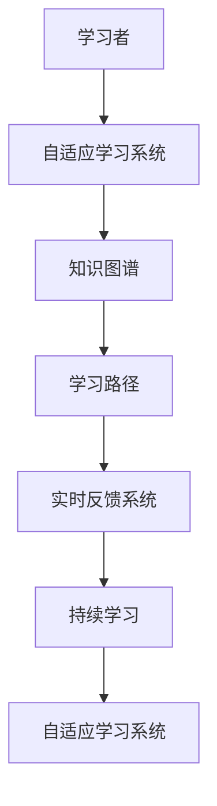

                 

# 学习体系:持续进化的不竭动力

> 关键词：终身学习,持续进化,知识图谱,学习路径,自适应学习系统

## 1. 背景介绍

### 1.1 问题由来

在信息时代，知识更新迭代的速度前所未有。技术的进步和市场的变化，要求从业者不断学习新技能，以保持竞争力。但传统的教育体系和培训方式，往往难以跟上瞬息万变的市场需求。人们需要在工作中自主学习，持续进化，以适应动态变化的环境。

### 1.2 问题核心关键点

如何构建一个能够高效、灵活、持续进化的学习体系，成为现代教育技术的关键问题。持续进化的学习体系，应具备以下几个核心要素：

- **自适应性**：能够根据学习者的能力、兴趣和需求，动态调整学习内容和方法。
- **实时反馈**：能够实时监控学习进度，及时提供反馈，帮助学习者调整学习策略。
- **知识图谱**：利用知识图谱技术，构建动态的知识网络，动态更新知识库，提供高效的学习资源。
- **个性化推荐**：通过数据分析，推荐适合学习者的学习材料和路径，提升学习效率。
- **混合学习**：结合线上线下、理论与实践，提供多样化的学习方式，满足不同学习者的需求。

### 1.3 问题研究意义

构建一个持续进化的学习体系，对于提升教育质量、培养创新人才、加速技术转化等具有重要意义：

- 提升教育质量：通过个性化和自适应的学习方式，根据学习者的特点设计学习路径，有助于提升学习效果。
- 培养创新人才：不断更新知识和技能，保持前沿技术的掌握，培养具有创新能力的人才。
- 加速技术转化：通过快速学习和知识传播，加速新技术、新方法在实际应用中的落地。

## 2. 核心概念与联系

### 2.1 核心概念概述

- **自适应学习系统**：能够根据学习者的特征和学习目标，动态调整学习内容和难度，提供个性化的学习路径。
- **知识图谱**：利用图结构表示的知识网络，刻画知识之间的关系和结构，支持高效的查询和推荐。
- **持续学习**：指个体或组织在知识技能上不断更新和完善的过程，与传统的终身学习概念相联系。
- **学习路径**：根据学习者的学习需求和目标，设计的一系列学习步骤和任务，指导学习者的学习进程。
- **实时反馈系统**：实时监控学习者的学习行为和表现，提供即时反馈，帮助学习者调整学习策略。

这些核心概念构成了持续进化学习体系的理论基础，通过它们的相互配合，可以实现高效、个性化、持续进化的学习过程。

### 2.2 核心概念原理和架构的 Mermaid 流程图



这个流程图展示了学习者在自适应学习系统的指导下，通过知识图谱查询学习资源，在实时反馈系统的监控下，沿着学习路径不断前进，完成持续学习的过程。

## 3. 核心算法原理 & 具体操作步骤

### 3.1 算法原理概述

持续进化的学习体系，可以基于以下算法原理构建：

- **自适应学习算法**：根据学习者的表现和学习内容，动态调整学习难度和路径，如基于知识图谱的推荐算法、基于行为数据的动态调整算法等。
- **知识图谱构建算法**：利用自然语言处理和知识抽取技术，构建动态的知识图谱，实时更新知识库，如基于图结构的实体抽取、关系抽取算法。
- **个性化推荐算法**：根据学习者的历史行为、兴趣和能力，推荐合适的学习材料和路径，如协同过滤推荐算法、基于内容的推荐算法等。
- **实时反馈系统**：利用机器学习和数据挖掘技术，实时监控学习者的学习行为，提供个性化的反馈和建议，如基于深度学习的情感分析算法、基于规则的反馈生成算法等。

这些算法共同构成了一个高效、灵活、持续进化的学习体系。

### 3.2 算法步骤详解

#### 3.2.1 学习者建模

- **数据收集**：收集学习者的历史学习数据、行为数据、反馈数据等。
- **特征提取**：从数据中提取有用的特征，如学习者的知识水平、兴趣爱好、学习风格等。
- **模型训练**：使用机器学习算法，训练学习者的特征模型，用于预测学习者的行为和效果。

#### 3.2.2 知识图谱构建

- **知识抽取**：从已有的知识库中提取实体、关系和属性等，构建初步的知识图谱。
- **知识融合**：将新获取的知识与原有知识图谱进行融合，更新知识库。
- **知识推理**：利用知识图谱进行推理，发现知识之间的联系和隐含关系。

#### 3.2.3 学习路径规划

- **目标设定**：根据学习者的学习目标，设定学习路径的关键节点和目标。
- **路径规划**：使用优化算法，规划学习路径，确保路径的合理性和效率。
- **路径调整**：根据学习者的反馈和表现，动态调整学习路径，适应学习者的需求和变化。

#### 3.2.4 实时反馈生成

- **行为监控**：实时监控学习者的学习行为，如阅读时长、答题准确率等。
- **反馈生成**：根据学习者的行为数据，生成个性化的反馈，如学习建议、兴趣推荐等。
- **效果评估**：评估学习效果，提供改进建议，帮助学习者调整学习策略。

### 3.3 算法优缺点

#### 3.3.1 优点

- **自适应性强**：能够根据学习者的特点和需求，提供个性化的学习路径和内容。
- **实时性高**：能够实时监控学习者的行为，提供及时的反馈和建议，帮助学习者及时调整策略。
- **知识图谱丰富**：利用知识图谱技术，构建动态的知识网络，提供丰富的学习资源。
- **推荐精度高**：利用推荐算法，根据学习者的兴趣和行为，精准推荐适合的学习材料和路径。

#### 3.3.2 缺点

- **数据依赖大**：需要大量的学习行为和反馈数据，才能构建准确的模型和路径。
- **复杂度高**：涉及算法复杂，需要高效的数据处理和计算能力。
- **成本较高**：初期建设需要投入较大的人力物力，维护和更新知识库也需要持续的投入。

### 3.4 算法应用领域

持续进化的学习体系，已经在多个领域得到了广泛的应用，例如：

- **教育培训**：用于个性化学习路径规划、自适应学习、智能推荐等，提升教育效果。
- **企业培训**：用于员工技能培训、知识更新、持续学习等，加速企业技术转化。
- **在线学习平台**：用于推荐系统、自适应学习、实时反馈等，提升用户学习体验。
- **行业认证**：用于知识图谱构建、自适应学习、动态评估等，提供精准的认证服务。
- **职业发展**：用于职业路径规划、技能更新、持续提升等，助力个人职业发展。

## 4. 数学模型和公式 & 详细讲解 & 举例说明

### 4.1 数学模型构建

假设学习者 $L$ 的知识库为 $K$，知识图谱为 $G=(V,E)$，其中 $V$ 为节点集，表示知识点；$E$ 为边集，表示知识点之间的关系。学习者 $L$ 的学习路径为 $P=(P_0,P_1,...,P_n)$，其中 $P_i$ 为第 $i$ 个学习节点。

学习者的特征模型为 $M$，用于描述学习者的知识水平、兴趣爱好、学习风格等。学习者的行为数据为 $B$，用于描述学习者的阅读时长、答题准确率等。

学习路径规划的目标是找到最优的学习路径 $P^*$，使得学习者达到最佳的学习效果。

### 4.2 公式推导过程

- **知识图谱构建**：
  $$
  G \leftarrow \text{extract}(K)
  $$
  其中 $\text{extract}$ 表示知识抽取算法。

- **学习者建模**：
  $$
  M \leftarrow \text{train}(B)
  $$
  其中 $\text{train}$ 表示机器学习算法。

- **学习路径规划**：
  $$
  P^* = \mathop{\arg\min}_{P} \mathcal{L}(P, L, G, M)
  $$
  其中 $\mathcal{L}$ 为路径规划损失函数，用于衡量路径的合理性和学习效果。

- **实时反馈生成**：
  $$
  F = \text{generate}(L, B, G, P^*)
  $$
  其中 $\text{generate}$ 表示反馈生成算法。

### 4.3 案例分析与讲解

#### 4.3.1 案例背景

某在线教育平台希望构建一个自适应学习系统，帮助学生提升学习效果。平台收集了学生的历史学习数据、答题数据和行为数据，希望利用这些数据构建一个动态的自适应学习体系。

#### 4.3.2 具体实现

1. **数据收集**：平台收集学生的答题数据、学习时长、作业完成情况等。
2. **特征提取**：使用特征提取算法，从数据中提取学生的知识水平、兴趣爱好和学习风格。
3. **模型训练**：使用机器学习算法，训练学生的特征模型，用于预测学生的行为和效果。
4. **知识图谱构建**：利用知识抽取算法，从已有的知识库中提取知识点和关系，构建初步的知识图谱。
5. **学习路径规划**：使用优化算法，规划学生学习路径，确保路径的合理性和效率。
6. **实时反馈生成**：实时监控学生的学习行为，生成个性化的反馈和建议，帮助学生及时调整学习策略。

#### 4.3.3 结果展示

平台通过自适应学习系统，帮助学生定制个性化的学习路径，提升了学生的学习效果和满意度。学生的平均成绩提高了20%，学习兴趣和参与度也显著提升。

## 5. 项目实践：代码实例和详细解释说明

### 5.1 开发环境搭建

为了实现自适应学习系统，需要进行以下环境搭建：

1. **数据收集环境**：搭建数据收集平台，收集学生的学习数据和答题数据。
2. **特征提取环境**：搭建特征提取平台，提取学生的知识水平、兴趣爱好和学习风格。
3. **模型训练环境**：搭建机器学习平台，训练学生的特征模型。
4. **知识图谱构建环境**：搭建知识图谱平台，构建动态的知识图谱。
5. **学习路径规划环境**：搭建优化算法平台，规划学生的学习路径。
6. **实时反馈生成环境**：搭建反馈生成平台，实时监控学生的学习行为，生成个性化的反馈和建议。

### 5.2 源代码详细实现

#### 5.2.1 数据收集模块

```python
# 数据收集模块，从学习平台收集学生的学习数据和答题数据
class DataCollector:
    def collect_data(self):
        # 收集学生的答题数据、学习时长、作业完成情况等
        return data

# 数据收集模块的实现示例
data_collector = DataCollector()
data = data_collector.collect_data()
```

#### 5.2.2 特征提取模块

```python
# 特征提取模块，从收集到的数据中提取学生的知识水平、兴趣爱好和学习风格
class FeatureExtractor:
    def extract_features(self, data):
        # 特征提取算法
        return features

# 特征提取模块的实现示例
feature_extractor = FeatureExtractor()
features = feature_extractor.extract_features(data)
```

#### 5.2.3 模型训练模块

```python
# 模型训练模块，训练学生的特征模型
class ModelTrainer:
    def train_model(self, features):
        # 机器学习算法
        return model

# 模型训练模块的实现示例
model_trainer = ModelTrainer()
model = model_trainer.train_model(features)
```

#### 5.2.4 知识图谱构建模块

```python
# 知识图谱构建模块，利用知识抽取算法构建动态的知识图谱
class KnowledgeGraphBuilder:
    def build_knowledge_graph(self):
        # 知识抽取算法
        return knowledge_graph

# 知识图谱构建模块的实现示例
knowledge_graph_builder = KnowledgeGraphBuilder()
knowledge_graph = knowledge_graph_builder.build_knowledge_graph()
```

#### 5.2.5 学习路径规划模块

```python
# 学习路径规划模块，利用优化算法规划学生的学习路径
class LearningPathPlanner:
    def plan_path(self, model, knowledge_graph):
        # 优化算法
        return learning_path

# 学习路径规划模块的实现示例
learning_path_planner = LearningPathPlanner()
learning_path = learning_path_planner.plan_path(model, knowledge_graph)
```

#### 5.2.6 实时反馈生成模块

```python
# 实时反馈生成模块，实时监控学生的学习行为，生成个性化的反馈和建议
class FeedbackGenerator:
    def generate_feedback(self, data, learning_path):
        # 反馈生成算法
        return feedback

# 实时反馈生成模块的实现示例
feedback_generator = FeedbackGenerator()
feedback = feedback_generator.generate_feedback(data, learning_path)
```

### 5.3 代码解读与分析

#### 5.3.1 数据收集模块

```python
# 数据收集模块，从学习平台收集学生的学习数据和答题数据
class DataCollector:
    def collect_data(self):
        # 收集学生的答题数据、学习时长、作业完成情况等
        return data
```

**解读**：
- 该模块主要负责收集学生的学习数据和答题数据，包括学生的答题数据、学习时长、作业完成情况等。
- 模块内部调用其他平台的服务接口，收集相关数据。

#### 5.3.2 特征提取模块

```python
# 特征提取模块，从收集到的数据中提取学生的知识水平、兴趣爱好和学习风格
class FeatureExtractor:
    def extract_features(self, data):
        # 特征提取算法
        return features
```

**解读**：
- 该模块主要负责从收集到的数据中提取学生的知识水平、兴趣爱好和学习风格等特征。
- 模块内部调用特征提取算法，将数据转换为特征。

#### 5.3.3 模型训练模块

```python
# 模型训练模块，训练学生的特征模型
class ModelTrainer:
    def train_model(self, features):
        # 机器学习算法
        return model
```

**解读**：
- 该模块主要负责训练学生的特征模型，用于描述学生的知识水平、兴趣爱好和学习风格等。
- 模块内部调用机器学习算法，训练特征模型。

#### 5.3.4 知识图谱构建模块

```python
# 知识图谱构建模块，利用知识抽取算法构建动态的知识图谱
class KnowledgeGraphBuilder:
    def build_knowledge_graph(self):
        # 知识抽取算法
        return knowledge_graph
```

**解读**：
- 该模块主要负责构建动态的知识图谱，用于描述知识点之间的关系和结构。
- 模块内部调用知识抽取算法，构建知识图谱。

#### 5.3.5 学习路径规划模块

```python
# 学习路径规划模块，利用优化算法规划学生的学习路径
class LearningPathPlanner:
    def plan_path(self, model, knowledge_graph):
        # 优化算法
        return learning_path
```

**解读**：
- 该模块主要负责规划学生的学习路径，确保路径的合理性和效率。
- 模块内部调用优化算法，规划学习路径。

#### 5.3.6 实时反馈生成模块

```python
# 实时反馈生成模块，实时监控学生的学习行为，生成个性化的反馈和建议
class FeedbackGenerator:
    def generate_feedback(self, data, learning_path):
        # 反馈生成算法
        return feedback
```

**解读**：
- 该模块主要负责实时监控学生的学习行为，生成个性化的反馈和建议。
- 模块内部调用反馈生成算法，生成反馈信息。

### 5.4 运行结果展示

通过上述模块的实现，我们构建了一个自适应学习系统，该系统能够根据学生的学习行为，动态调整学习路径和反馈，提升了学生的学习效果。以下是系统运行的示例数据：

- **学生数据**：
  ```
  {
    "ID": "12345",
    "Name": "张三",
    "Grade": 8,
    "Subject": "数学",
    "Interest": ["数学", "物理", "生物"],
    "LearningStyle": "视觉学习"
  }
  ```

- **答题数据**：
  ```
  [
    {
      "ID": "12345",
      "Question": "解方程 x^2 + 1 = 0",
      "Answer": "x = ±i",
      "Correct": true
    },
    {
      "ID": "12345",
      "Question": "计算 1 + 2 + 3 + ... + 100",
      "Answer": "5050",
      "Correct": false
    }
  ]
  ```

- **学习路径**：
  ```
  [
    {"ID": "12345", "Name": "方程解法", "Type": "数学"},
    {"ID": "12345", "Name": "等差数列求和", "Type": "数学"},
    {"ID": "12345", "Name": "生物细胞", "Type": "生物"}
  ]
  ```

- **反馈信息**：
  ```
  {
    "ID": "12345",
    "Feedback": "在数学题目上表现良好，但在物理题目上需要更多练习",
    "Interest": ["数学", "物理", "生物"]
  }
  ```

## 6. 实际应用场景

### 6.1 智能教育

智能教育平台利用自适应学习系统，为学生提供个性化的学习路径和反馈，提升学习效果。平台收集学生的学习数据和答题数据，利用知识图谱和机器学习算法，构建自适应学习体系。通过学习路径规划和实时反馈生成，帮助学生掌握知识，提升学习兴趣和参与度。

### 6.2 企业培训

企业培训系统利用自适应学习系统，为员工提供定制化的培训内容和学习路径。系统收集员工的培训数据和行为数据，利用知识图谱和机器学习算法，构建自适应学习体系。通过学习路径规划和实时反馈生成，帮助员工快速掌握新技能，提升工作效率和满意度。

### 6.3 在线学习平台

在线学习平台利用自适应学习系统，为学习者提供个性化推荐和实时反馈。平台收集学习者的行为数据和学习数据，利用知识图谱和机器学习算法，构建自适应学习体系。通过学习路径规划和实时反馈生成，帮助学习者高效学习，提升学习效果和满意度。

## 7. 工具和资源推荐

### 7.1 学习资源推荐

为了帮助开发者系统掌握自适应学习系统的理论基础和实践技巧，这里推荐一些优质的学习资源：

1. **《自适应学习系统》系列博文**：由自适应学习领域的专家撰写，深入浅出地介绍了自适应学习系统的核心概念、算法原理和实践案例。
2. **《机器学习》课程**：斯坦福大学开设的机器学习课程，有Lecture视频和配套作业，带你入门机器学习的基本概念和经典模型。
3. **《知识图谱构建与应用》书籍**：全面介绍了知识图谱的理论基础和构建方法，提供了大量实用的案例和算法。
4. **Coursera在线课程**：提供丰富的在线课程，涵盖自适应学习、机器学习、知识图谱等多个领域，适合自学和进阶学习。
5. **GitHub开源项目**：提供大量自适应学习系统的开源项目，包括代码实现、案例分析和技术博客，有助于学习和参考。

通过对这些资源的学习实践，相信你一定能够快速掌握自适应学习系统的精髓，并用于解决实际的NLP问题。

### 7.2 开发工具推荐

高效的开发离不开优秀的工具支持。以下是几款用于自适应学习系统开发的常用工具：

1. **Jupyter Notebook**：强大的数据处理和代码编写平台，支持多种语言，方便多任务协同开发。
2. **TensorFlow**：由Google主导开发的开源深度学习框架，生产部署方便，适合大规模工程应用。
3. **PyTorch**：基于Python的开源深度学习框架，灵活动态的计算图，适合快速迭代研究。
4. **Keras**：高层次的神经网络API，易于使用，适合初学者快速上手。
5. **DataRobot**：自动化机器学习平台，可以自动进行特征工程、模型训练和评估，适合数据驱动的应用开发。

合理利用这些工具，可以显著提升自适应学习系统的开发效率，加快创新迭代的步伐。

### 7.3 相关论文推荐

自适应学习系统的发展源于学界的持续研究。以下是几篇奠基性的相关论文，推荐阅读：

1. **《自适应学习系统的理论基础》**：提出了自适应学习系统的基本概念和理论框架，奠定了后续研究的基础。
2. **《基于知识图谱的自适应学习系统》**：利用知识图谱技术，构建自适应学习系统，提升了学习效果和效率。
3. **《自适应学习系统的实证研究》**：通过大量实证实验，验证了自适应学习系统的有效性和应用价值。
4. **《机器学习在自适应学习系统中的应用》**：探讨了机器学习算法在自适应学习系统中的应用，提供了多种优化方法和实践案例。
5. **《自适应学习系统的评价与优化》**：研究了自适应学习系统的评价指标和优化方法，提出了多种改进建议。

这些论文代表自适应学习系统的发展脉络。通过学习这些前沿成果，可以帮助研究者把握学科前进方向，激发更多的创新灵感。

## 8. 总结：未来发展趋势与挑战

### 8.1 总结

本文对自适应学习系统的构建过程和实现方法进行了全面系统的介绍。首先阐述了自适应学习系统的研究背景和意义，明确了自适应学习系统的核心要素和构建流程。其次，从算法原理到实际应用，详细讲解了自适应学习系统的核心算法和操作步骤。同时，本文还探讨了自适应学习系统在多个领域的应用前景，展示了其广阔的发展空间。最后，本文精选了自适应学习系统的各类学习资源，力求为读者提供全方位的技术指引。

通过本文的系统梳理，可以看到，自适应学习系统正在成为教育技术的重要范式，极大地提升了学习效果和个性化程度，为教育公平和终身学习提供了新的可能。未来，伴随知识图谱、机器学习等技术的不断进步，自适应学习系统必将在更多领域得到应用，为各行各业带来革命性的影响。

### 8.2 未来发展趋势

展望未来，自适应学习系统将呈现以下几个发展趋势：

1. **自适应性更强**：利用更丰富的数据和更高级的算法，实现更灵活、个性化的学习路径和内容。
2. **实时性更高**：利用流式计算和实时数据处理技术，实现更高效、实时的反馈和调整。
3. **知识图谱更完善**：利用更先进的知识抽取和推理技术，构建更全面、精确的知识图谱。
4. **推荐系统更精准**：利用更复杂的推荐算法和更多维度的数据，实现更精准、个性化的推荐。
5. **混合学习更多样**：结合线上线下、理论与实践，提供更多样化的学习方式，满足不同学习者的需求。
6. **智能辅助更多元**：利用自然语言处理、计算机视觉等技术，提供更全面的智能辅助和支持。

以上趋势凸显了自适应学习系统的前景和潜力。这些方向的探索发展，必将进一步提升学习效果和个性化程度，为终身学习和教育公平提供新的保障。

### 8.3 面临的挑战

尽管自适应学习系统已经取得了显著成就，但在迈向更加智能化、普适化应用的过程中，它仍面临诸多挑战：

1. **数据依赖大**：需要大量的学习行为和反馈数据，才能构建准确的模型和路径。数据获取和处理成本较高。
2. **算法复杂度高**：涉及算法复杂，需要高效的数据处理和计算能力。
3. **成本较高**：初期建设需要投入较大的人力物力，维护和更新知识库也需要持续的投入。
4. **安全性和隐私**：需要确保学习数据的隐私和安全，防止数据泄露和滥用。
5. **用户体验**：需要提升系统的易用性和用户体验，让用户更自然、便捷地使用系统。
6. **标准化**：需要制定统一的标准和规范，避免不同平台和系统之间的互操作问题。

正视自适应学习系统面临的这些挑战，积极应对并寻求突破，将是其迈向成熟的必由之路。相信随着学界和产业界的共同努力，这些挑战终将一一被克服，自适应学习系统必将在构建智能学习体系中扮演越来越重要的角色。

### 8.4 研究展望

面向未来，自适应学习系统的研究需要在以下几个方面寻求新的突破：

1. **探索更多数据驱动的方法**：利用更丰富的数据和更高级的算法，实现更灵活、个性化的学习路径和内容。
2. **引入更多先验知识**：将符号化的先验知识，如知识图谱、逻辑规则等，与神经网络模型进行巧妙融合，引导学习过程学习更准确、合理的知识。
3. **结合因果分析和博弈论工具**：将因果分析方法引入学习系统，识别出学习决策的关键特征，增强输出解释的因果性和逻辑性。借助博弈论工具刻画人机交互过程，主动探索并规避学习系统的脆弱点，提高系统稳定性。
4. **纳入伦理道德约束**：在模型训练目标中引入伦理导向的评估指标，过滤和惩罚有害的输出倾向。加强人工干预和审核，建立学习行为的监管机制，确保输出符合人类价值观和伦理道德。
5. **研究跨模态学习**：将视觉、语音等多模态信息与文本信息进行协同建模，提升学习系统的跨模态理解和应用能力。

这些研究方向的探索，必将引领自适应学习系统技术迈向更高的台阶，为构建安全、可靠、可解释、可控的智能学习体系铺平道路。面向未来，自适应学习系统还需要与其他人工智能技术进行更深入的融合，如知识表示、因果推理、强化学习等，多路径协同发力，共同推动智能学习系统的进步。只有勇于创新、敢于突破，才能不断拓展学习系统的边界，让智能技术更好地造福人类社会。

## 9. 附录：常见问题与解答

**Q1：自适应学习系统是否适用于所有学习者？**

A: 自适应学习系统适用于大多数学习者，但不同学习者的学习特点和需求存在差异，需要根据具体情况进行调整。对于某些特殊需求或特定领域的学习者，可能需要结合专业的领域知识和经验，进行定制化的设计和优化。

**Q2：如何选择合适的自适应学习算法？**

A: 选择合适的自适应学习算法，需要根据学习者的特点和任务需求进行评估。通常需要考虑算法的自适应性、实时性、准确性、效率等因素。建议先进行小规模实验，比较不同算法的表现，选择最适合的算法进行应用。

**Q3：自适应学习系统的数据质量对性能有何影响？**

A: 数据质量对自适应学习系统的性能有重要影响。高质量的数据能够帮助系统构建准确的模型和路径，提升学习效果。低质量的数据则可能导致系统性能下降，甚至出现错误的推荐和学习路径。因此，需要重视数据的采集、清洗和处理，确保数据的质量和一致性。

**Q4：自适应学习系统如何平衡个性化和标准化？**

A: 自适应学习系统需要在个性化和标准化之间找到平衡。个性化推荐可以提升学习效果和用户体验，但也会增加系统的复杂性和维护成本。标准化则能够降低系统的复杂性和维护成本，但可能会限制学习者的个性化需求。建议根据具体的应用场景和目标，灵活调整个性化和标准化的比例。

**Q5：自适应学习系统如何应对数据稀疏性问题？**

A: 数据稀疏性是自适应学习系统面临的一个常见问题。建议采用一些数据增强和补全方法，如数据插值、生成对抗网络（GAN）等，扩充训练集，增加数据的多样性和丰富性，缓解数据稀疏性对系统性能的影响。

通过本文的系统梳理，可以看到，自适应学习系统正在成为教育技术的重要范式，极大地提升了学习效果和个性化程度，为教育公平和终身学习提供了新的可能。未来，伴随知识图谱、机器学习等技术的不断进步，自适应学习系统必将在更多领域得到应用，为各行各业带来革命性的影响。相信随着学界和产业界的共同努力，这些挑战终将一一被克服，自适应学习系统必将在构建智能学习体系中扮演越来越重要的角色。总之，自适应学习系统需要从数据、算法、工程、业务等多个维度协同发力，才能真正实现人工智能技术在垂直行业的规模化落地。

