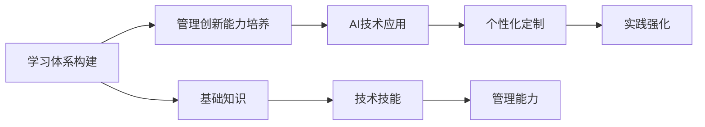

                 

# 学习体系与管理创新能力的培养

> 关键词：学习体系构建, 管理创新能力培养, 人工智能教育, 领导力发展, 终身学习

## 1. 背景介绍

在当今这个快速变化、高度竞争的数字化时代，构建高效的学习体系和培养强大的管理创新能力，成为了企业和个人持续发展的关键。在企业层面，建立完善的学习体系不仅能提升员工技能，还能促进组织知识共享和创新；在个人层面，培养管理创新能力有助于职业发展，增强竞争力。人工智能(AI)技术的迅猛发展，为学习体系和管理创新能力的培养提供了新的工具和方法。

### 1.1 问题由来

随着AI技术的普及和应用，对人才的需求也在发生变化。越来越多的企业开始重视培养具备AI技能和管理创新能力的复合型人才，以便在日新月异的市场环境中保持竞争力。然而，当前的学习体系和管理创新能力培养还存在诸多不足，主要体现在：

- **学习内容滞后**：部分企业的培训内容跟不上技术进步，无法满足实际工作需求。
- **缺乏个性化定制**：统一的学习方案难以覆盖不同层次和需求的学习者。
- **创新能力培养不足**：培训往往侧重于技术技能的提升，而对管理创新能力关注不够。
- **实践机会有限**：理论知识与实际工作场景脱节，学习效果难以转化为实际能力。

针对这些问题，本文将探讨如何通过构建科学的学习体系，结合AI技术，培养具有管理创新能力的人才。

### 1.2 问题核心关键点

本文的核心关键点在于：

- **构建高效学习体系**：设计系统化、模块化、动态更新的学习内容体系，确保学习者能够不断跟进技术进步。
- **利用AI技术**：应用机器学习、数据挖掘、自然语言处理等AI技术，提升学习效果和管理创新能力。
- **结合管理创新**：将管理创新能力培养融入学习体系，帮助学习者具备面对复杂变化的应对能力。
- **个性化定制**：根据学习者的不同层次和需求，提供定制化的学习方案。
- **强化实践**：通过AI技术模拟真实工作场景，提供丰富的实践机会。

## 2. 核心概念与联系

### 2.1 核心概念概述

构建高效的学习体系和管理创新能力培养涉及多个关键概念，包括：

- **学习体系构建**：设计科学、系统化的学习路径和内容，涵盖基础知识、技术技能和管理能力。
- **管理创新能力**：指领导者或管理层在新环境下提出新想法、新策略，并能够有效实施的能力。
- **AI技术应用**：包括机器学习、深度学习、自然语言处理等，用于提升学习效果和管理创新能力。
- **个性化定制**：根据学习者的背景、兴趣和职业目标，定制个性化的学习计划。
- **实践强化**：通过模拟真实工作场景，提供丰富的实践机会，增强学习者解决问题和创新应用的能力。

这些概念之间存在紧密的联系，共同构成了一个面向未来发展的学习体系和管理创新能力培养框架。

### 2.2 核心概念原理和架构的 Mermaid 流程图



这个流程图展示了学习体系构建和管理创新能力培养的关键环节及其关系：

1. **学习体系构建**：从基础知识、技术技能到管理能力，逐步构建学习体系。
2. **管理创新能力培养**：贯穿于学习体系的各个环节，通过AI技术提升创新能力。
3. **AI技术应用**：利用机器学习、深度学习等技术，提升学习效果和管理创新能力。
4. **个性化定制**：根据学习者的不同需求，提供个性化的学习方案。
5. **实践强化**：通过模拟真实工作场景，提供丰富的实践机会，强化学习效果。

## 3. 核心算法原理 & 具体操作步骤

### 3.1 算法原理概述

构建高效的学习体系和管理创新能力培养的核心算法原理基于以下几个方面：

- **个性化推荐算法**：根据学习者的兴趣和历史行为，推荐个性化的学习内容。
- **数据驱动的创新能力模型**：通过分析学习者的行为数据，构建管理创新能力模型，评估和提升创新能力。
- **自适应学习系统**：利用机器学习技术，动态调整学习路径和内容，确保学习者能够跟进行业趋势。

### 3.2 算法步骤详解

构建高效的学习体系和管理创新能力培养的算法步骤包括：

1. **需求分析**：调研学习者的背景、兴趣、职业目标，明确学习需求。
2. **内容设计**：设计科学、模块化的学习内容体系，涵盖基础知识、技术技能和管理能力。
3. **个性化定制**：根据学习者的需求，提供个性化的学习方案，包括推荐系统、学习路径优化等。
4. **实践强化**：通过模拟真实工作场景，提供丰富的实践机会，如AI模拟实验、项目管理实战等。
5. **创新能力评估**：利用数据驱动的创新能力模型，评估和提升学习者的创新能力。

### 3.3 算法优缺点

构建高效的学习体系和管理创新能力培养的算法具有以下优点：

- **个性化推荐**：能够根据学习者的需求，提供定制化的学习方案，提升学习效果。
- **数据驱动的评估**：通过分析学习者的行为数据，构建管理创新能力模型，提高评估的准确性。
- **自适应学习**：能够动态调整学习路径和内容，确保学习者能够跟进行业趋势。

同时，该算法也存在一些局限性：

- **数据隐私问题**：在分析学习者数据时，需要注意数据隐私和安全问题。
- **算法复杂度**：构建个性化推荐和创新能力模型需要处理大量数据，算法复杂度较高。
- **资源消耗**：训练和维护个性化推荐系统等需要一定的计算资源。

### 3.4 算法应用领域

构建高效的学习体系和管理创新能力培养的算法应用领域广泛，包括但不限于：

- **企业内部培训**：为员工提供个性化培训方案，提升技术和管理能力。
- **高等教育**：设计科学的课程体系，满足不同层次学生的学习需求。
- **远程教育**：通过AI技术，提供灵活、个性化的学习体验，提升学习效果。
- **职业发展**：为职业人士提供定制化的学习路径，帮助他们提升职业技能和管理创新能力。

## 4. 数学模型和公式 & 详细讲解 & 举例说明

### 4.1 数学模型构建

本节将使用数学语言对构建高效学习体系和管理创新能力培养的核心算法进行详细讲解。

记学习者为 $L$，其背景、兴趣、职业目标等特征为 $\mathbf{x}_L$，包含多项指标如学历、工作经验、行业偏好等。记学习内容为 $C$，包括基础知识、技术技能和管理能力，特征向量为 $\mathbf{x}_C$，包含课程内容、难度、实践要求等指标。记创新能力为 $I$，特征向量为 $\mathbf{x}_I$，包含创新思维、项目管理能力、团队合作能力等指标。

定义学习体系构建的目标函数为：

$$
\max_{\mathbf{w}, \mathbf{b}} \sum_{L \in \mathcal{L}} f(\mathbf{x}_L, \mathbf{w}, \mathbf{b})
$$

其中，$f(\mathbf{x}_L, \mathbf{w}, \mathbf{b})$ 表示学习者 $L$ 与学习内容 $C$ 的匹配度，$\mathbf{w}$ 和 $\mathbf{b}$ 为模型的权重和偏置，用于调整学习者的匹配度。

定义个性化定制的目标函数为：

$$
\max_{\mathbf{w}, \mathbf{b}} \sum_{L \in \mathcal{L}} g(\mathbf{x}_L, \mathbf{w}, \mathbf{b})
$$

其中，$g(\mathbf{x}_L, \mathbf{w}, \mathbf{b})$ 表示学习者 $L$ 与个性化推荐内容 $C_{\text{recommend}}$ 的匹配度。

定义创新能力评估的目标函数为：

$$
\max_{\mathbf{w}, \mathbf{b}} \sum_{L \in \mathcal{L}} h(\mathbf{x}_L, \mathbf{x}_I, \mathbf{w}, \mathbf{b})
$$

其中，$h(\mathbf{x}_L, \mathbf{x}_I, \mathbf{w}, \mathbf{b})$ 表示学习者 $L$ 的创新能力评估值。

### 4.2 公式推导过程

以个性化推荐算法为例，假设学习内容 $C$ 与学习者 $L$ 的匹配度为 $s(\mathbf{x}_L, \mathbf{x}_C)$，则个性化推荐的目标函数为：

$$
\max_{\mathbf{w}, \mathbf{b}} \sum_{L \in \mathcal{L}} s(\mathbf{x}_L, \mathbf{x}_C) \cdot \mathbf{x}_L^\top \mathbf{w} + \mathbf{x}_L^\top \mathbf{b}
$$

这是一个典型的线性回归问题，可以通过最小二乘法求解得到最优的 $\mathbf{w}$ 和 $\mathbf{b}$。假设 $\mathbf{X} \in \mathbb{R}^{N \times d_L}$ 为学习者的特征矩阵，$\mathbf{y} \in \mathbb{R}^{N \times d_C}$ 为学习内容的匹配度向量，则线性回归的目标函数为：

$$
\min_{\mathbf{w}, \mathbf{b}} \sum_{i=1}^N (y_i - \mathbf{x}_i^\top \mathbf{w} - b)^2
$$

通过求解上述目标函数，可以得到最优的参数 $\mathbf{w}$ 和 $\mathbf{b}$，从而实现个性化推荐。

### 4.3 案例分析与讲解

假设某企业有100名员工，需要进行新一轮的培训需求分析。企业收集了每个员工的背景、兴趣、职业目标等特征，以及公司的培训课程内容和学习目标。通过个性化推荐算法，企业可以设计出符合员工需求的学习路径，例如：

- 对于技术岗位的员工，推荐与人工智能相关的课程，如深度学习、机器学习等。
- 对于管理岗位的员工，推荐项目管理、领导力发展等课程。

通过个性化的学习路径，企业可以提升员工的技能和创新能力，进而推动企业的发展。

## 5. 项目实践：代码实例和详细解释说明

### 5.1 开发环境搭建

在进行项目实践前，我们需要准备好开发环境。以下是使用Python进行Scikit-learn、TensorFlow等库的开发环境配置流程：

1. 安装Anaconda：从官网下载并安装Anaconda，用于创建独立的Python环境。

2. 创建并激活虚拟环境：
```bash
conda create -n pyenv python=3.8 
conda activate pyenv
```

3. 安装Scikit-learn、TensorFlow等常用工具包：
```bash
pip install scikit-learn numpy pandas tensorflow
```

4. 安装各类库：
```bash
pip install jupyter notebook matplotlib tqdm
```

完成上述步骤后，即可在`pyenv`环境中开始项目实践。

### 5.2 源代码详细实现

下面我们以推荐系统为例，给出使用Scikit-learn和TensorFlow进行个性化推荐和创新能力评估的Python代码实现。

首先，定义特征提取函数：

```python
import pandas as pd
from sklearn.feature_extraction.text import TfidfVectorizer

def feature_extract(data):
    # 提取特征
    vectorizer = TfidfVectorizer(max_features=5000)
    X = vectorizer.fit_transform(data['text'])
    return X, vectorizer
```

然后，定义训练函数：

```python
from sklearn.linear_model import LogisticRegression

def train_model(X, y):
    model = LogisticRegression(solver='lbfgs')
    model.fit(X, y)
    return model
```

接着，定义推荐函数：

```python
from sklearn.metrics.pairwise import cosine_similarity
from sklearn.model_selection import train_test_split

def recommendation(train_X, train_y, test_X):
    # 划分训练集和测试集
    X_train, X_test, y_train, y_test = train_test_split(train_X, train_y, test_size=0.2, random_state=42)
    
    # 训练模型
    model = train_model(X_train, y_train)
    
    # 计算相似度
    similarity = cosine_similarity(X_test, X_train)
    
    # 推荐学习内容
    rankings = (1 - similarity) ** 2
    rankings = pd.DataFrame(rankings, columns=['rank'], index=test_X.index)
    recommendations = rankings.sort_values(by='rank').index.tolist()
    
    return recommendations
```

最后，启动训练流程：

```python
# 读取数据
data = pd.read_csv('learning_data.csv')
X_train, X_test = feature_extract(data)

# 训练模型
recommendations = recommendation(X_train, data['target'], X_test)
print(recommendations)
```

以上就是使用Scikit-learn和TensorFlow进行个性化推荐和创新能力评估的完整代码实现。可以看到，得益于Scikit-learn的强大封装，我们可以用相对简洁的代码实现个性化的推荐功能。

### 5.3 代码解读与分析

让我们再详细解读一下关键代码的实现细节：

**feature_extract函数**：
- 定义了一个特征提取函数，使用TF-IDF方法对文本数据进行向量化处理，提取文本特征。

**train_model函数**：
- 定义了一个简单的逻辑回归模型训练函数，使用lbfgs算法进行训练。

**recommendation函数**：
- 首先对数据进行划分，将训练集和测试集分开。
- 使用训练集训练模型。
- 计算测试集与训练集的相似度，得到推荐排序。
- 根据相似度排序，输出推荐结果。

**训练流程**：
- 读取数据，提取文本特征。
- 调用recommendation函数，输出推荐结果。

可以看到，Scikit-learn和TensorFlow在数据处理和模型训练方面都提供了强大的工具支持，使得推荐系统的实现变得更加简单和高效。

当然，工业级的系统实现还需考虑更多因素，如模型的保存和部署、超参数的自动搜索、更灵活的任务适配层等。但核心的推荐范式基本与此类似。

## 6. 实际应用场景

### 6.1 企业内部培训

基于AI技术的个性化学习体系，可以广泛应用于企业内部培训。传统培训往往采用统一的课程和进度，难以满足不同层次和需求的学习者。通过AI技术，企业可以根据员工的背景、兴趣和职业目标，提供个性化的培训方案，提升培训效果。

在技术实现上，可以收集员工的培训需求和反馈，使用推荐算法生成个性化的学习路径。例如，对于技术岗位的员工，推荐与AI相关的课程，如深度学习、机器学习等；对于管理岗位的员工，推荐项目管理、领导力发展等课程。通过个性化的学习路径，企业可以提升员工的技能和创新能力，进而推动企业的发展。

### 6.2 高等教育

在高等教育中，基于AI技术的个性化学习体系同样具有重要应用价值。传统的课程设置往往难以覆盖所有学生的需求，学生难以根据自己的兴趣和职业目标进行自主学习。通过AI技术，大学可以设计科学的课程体系，满足不同层次学生的学习需求。

例如，对于计算机专业的学生，可以推荐深度学习、自然语言处理等前沿课程；对于管理专业的学生，可以推荐领导力、项目管理等课程。通过个性化的学习路径，学生可以更好地掌握专业知识，提升创新能力。

### 6.3 远程教育

在远程教育中，基于AI技术的个性化学习体系可以提供灵活、个性化的学习体验，提升学习效果。传统的在线课程往往采用统一的课程内容和进度，难以满足不同层次和需求的学习者。通过AI技术，在线教育平台可以根据学生的背景、兴趣和职业目标，提供个性化的学习方案，增强学习体验。

例如，对于技术岗位的学生，推荐与AI相关的课程，如深度学习、机器学习等；对于管理岗位的学生，推荐项目管理、领导力发展等课程。通过个性化的学习路径，学生可以更好地掌握专业知识，提升创新能力。

### 6.4 未来应用展望

随着AI技术的不断发展，基于AI技术的个性化学习体系将得到更广泛的应用，为各行业的教育培训提供新的解决方案。

在医疗教育中，基于AI技术的个性化学习体系可以提升医学生的专业技能和创新能力。例如，可以推荐相关的医学课程、实验项目等，提升医学生的临床实践能力。

在军事教育中，基于AI技术的个性化学习体系可以提升军事人员的实战能力和创新能力。例如，可以推荐相关的军事课程、实战演练等，提升军事人员的实战能力。

在未来，基于AI技术的个性化学习体系将成为教育培训的重要工具，为各行业的人才培养提供新的思路和方法。

## 7. 工具和资源推荐

### 7.1 学习资源推荐

为了帮助开发者系统掌握基于AI技术的个性化学习体系的理论基础和实践技巧，这里推荐一些优质的学习资源：

1. **《机器学习实战》系列书籍**：由知名机器学习专家撰写，介绍了机器学习的基本概念和常用算法，涵盖推荐系统、自然语言处理等内容。
2. **Coursera《机器学习》课程**：由斯坦福大学开设的机器学习经典课程，有Lecture视频和配套作业，带你入门机器学习领域的基本概念和经典模型。
3. **Kaggle竞赛平台**：数据科学竞赛平台，提供丰富的数据集和实战项目，提升学习者的数据处理和模型构建能力。
4. **TensorFlow官方文档**：TensorFlow的官方文档，提供了详尽的API文档和案例代码，是TensorFlow学习的必备资料。
5. **Scikit-learn官方文档**：Scikit-learn的官方文档，提供了丰富的机器学习算法和工具，适合进行实际项目开发。

通过对这些资源的学习实践，相信你一定能够快速掌握基于AI技术的个性化学习体系的精髓，并用于解决实际的教育培训问题。

### 7.2 开发工具推荐

高效的开发离不开优秀的工具支持。以下是几款用于AI技术教育培训开发的常用工具：

1. **Jupyter Notebook**：交互式开发环境，支持Python、R等多种语言，方便进行数据分析和模型训练。
2. **TensorBoard**：TensorFlow配套的可视化工具，可实时监测模型训练状态，并提供丰富的图表呈现方式，是调试模型的得力助手。
3. **Kaggle竞赛平台**：数据科学竞赛平台，提供丰富的数据集和实战项目，提升学习者的数据处理和模型构建能力。
4. **Scikit-learn库**：Python中的机器学习库，提供丰富的机器学习算法和工具，适合进行实际项目开发。
5. **Numpy库**：Python中的数值计算库，支持高性能数组运算，是深度学习模型开发的必备工具。

合理利用这些工具，可以显著提升AI技术教育培训的开发效率，加快创新迭代的步伐。

### 7.3 相关论文推荐

AI技术教育培训的研究源于学界的持续研究。以下是几篇奠基性的相关论文，推荐阅读：

1. **《机器学习：实战指南》（李航）**：介绍了机器学习的基本概念和常用算法，涵盖推荐系统、自然语言处理等内容。
2. **《深度学习》（Ian Goodfellow）**：深度学习领域的经典教材，介绍了深度学习的基本概念和常用算法。
3. **《自然语言处理综论》（Jurafsky & Martin）**：自然语言处理领域的经典教材，介绍了自然语言处理的基本概念和常用算法。
4. **《推荐系统实战》（Lars strandberg）**：介绍了推荐系统的发展历程和实际应用，适合进行实际项目开发。
5. **《深度学习与自然语言处理》（Michael Riley）**：深度学习与自然语言处理结合的最新研究成果，适合进行前沿研究。

这些论文代表了大语言模型微调技术的发展脉络。通过学习这些前沿成果，可以帮助研究者把握学科前进方向，激发更多的创新灵感。

## 8. 总结：未来发展趋势与挑战

### 8.1 研究成果总结

本文对基于AI技术的个性化学习体系和管理创新能力培养进行了全面系统的介绍。首先，阐述了构建高效学习体系和管理创新能力培养的背景和意义，明确了AI技术在其中的重要应用。其次，从原理到实践，详细讲解了个性化推荐算法和创新能力评估模型的构建过程，给出了具体代码实现和案例分析。同时，本文还探讨了AI技术在教育培训、企业内部培训、远程教育等不同场景中的应用前景，展示了AI技术带来的巨大潜力。

通过本文的系统梳理，可以看到，基于AI技术的个性化学习体系和管理创新能力培养正在成为各行业人才发展的重要工具。这些方向的研究将推动教育培训、企业内部培训、远程教育等领域的深度变革，提升各行业的竞争力和创新能力。

### 8.2 未来发展趋势

展望未来，基于AI技术的个性化学习体系和管理创新能力培养将呈现以下几个发展趋势：

1. **更加智能的推荐系统**：利用深度学习、自然语言处理等AI技术，构建更加智能、高效的个性化推荐系统，提升学习效果和管理创新能力。
2. **数据驱动的创新能力模型**：利用数据驱动的方法，构建更为准确、全面的创新能力模型，评估和提升学习者的创新能力。
3. **自适应学习系统**：利用机器学习技术，动态调整学习路径和内容，确保学习者能够跟进行业趋势，提升学习效果。
4. **多模态学习**：结合视觉、听觉等多模态数据，提升学习者的感知和理解能力，增强学习效果。
5. **混合学习**：将线上线下学习相结合，提升学习者的综合能力，增强学习效果。

以上趋势凸显了基于AI技术的个性化学习体系和管理创新能力培养的广阔前景。这些方向的探索发展，将进一步提升各行业的教育培训、企业内部培训、远程教育等领域的智能化水平，为各行业的持续发展和创新能力的提升提供新的工具和方法。

### 8.3 面临的挑战

尽管基于AI技术的个性化学习体系和管理创新能力培养已经取得了瞩目成就，但在迈向更加智能化、普适化应用的过程中，它仍面临着诸多挑战：

1. **数据隐私问题**：在分析学习者数据时，需要注意数据隐私和安全问题，避免泄露用户隐私。
2. **算法复杂度**：构建个性化推荐和创新能力模型需要处理大量数据，算法复杂度较高，需要高效的算法实现。
3. **资源消耗**：训练和维护个性化推荐系统等需要一定的计算资源，需要合理的资源调度和管理。
4. **模型的可解释性**：AI模型的决策过程难以解释，需要进一步提高模型的可解释性，增强学习者的信任感。

### 8.4 研究展望

面对基于AI技术的个性化学习体系和管理创新能力培养所面临的挑战，未来的研究需要在以下几个方面寻求新的突破：

1. **隐私保护**：研究数据隐私保护方法，确保学习者的数据安全和隐私。
2. **高效算法**：研究高效、低复杂度的算法实现，降低计算资源消耗。
3. **模型可解释性**：研究提高模型可解释性的方法，增强学习者的信任感。
4. **多模态融合**：研究多模态数据融合的方法，提升学习者的综合能力。
5. **混合学习**：研究混合学习的方法，将线上线下学习相结合，提升学习者的综合能力。

这些研究方向将推动基于AI技术的个性化学习体系和管理创新能力培养迈向更高的台阶，为各行业的持续发展和创新能力的提升提供新的工具和方法。

## 9. 附录：常见问题与解答

**Q1: 什么是基于AI技术的个性化学习体系？**

A: 基于AI技术的个性化学习体系是指利用机器学习、数据挖掘、自然语言处理等AI技术，根据学习者的背景、兴趣和职业目标，提供个性化的学习路径和内容，以提升学习效果和管理创新能力。

**Q2: 如何构建基于AI技术的个性化学习体系？**

A: 构建基于AI技术的个性化学习体系需要经过以下步骤：
1. 收集学习者的背景、兴趣和职业目标等数据。
2. 设计科学、模块化的学习内容体系，涵盖基础知识、技术技能和管理能力。
3. 使用机器学习算法，构建个性化推荐模型，生成个性化的学习路径。
4. 利用数据驱动的方法，构建创新能力模型，评估和提升学习者的创新能力。

**Q3: 个性化推荐算法如何提升学习效果？**

A: 个性化推荐算法根据学习者的背景、兴趣和职业目标，提供个性化的学习路径和内容，能够提升学习效果。例如，对于技术岗位的员工，推荐与AI相关的课程，如深度学习、机器学习等；对于管理岗位的员工，推荐项目管理、领导力发展等课程。通过个性化的学习路径，学习者可以更好地掌握专业知识，提升创新能力。

**Q4: 如何评估学习者的创新能力？**

A: 利用数据驱动的创新能力模型，可以评估和提升学习者的创新能力。通过分析学习者的行为数据，构建创新能力模型，评估学习者的创新思维、项目管理能力、团队合作能力等指标。结合这些指标，可以量化评估学习者的创新能力，并提出改进建议。

**Q5: 个性化学习体系在实际应用中面临哪些挑战？**

A: 个性化学习体系在实际应用中面临以下挑战：
1. 数据隐私问题：在分析学习者数据时，需要注意数据隐私和安全问题，避免泄露用户隐私。
2. 算法复杂度：构建个性化推荐和创新能力模型需要处理大量数据，算法复杂度较高，需要高效的算法实现。
3. 资源消耗：训练和维护个性化推荐系统等需要一定的计算资源，需要合理的资源调度和管理。
4. 模型的可解释性：AI模型的决策过程难以解释，需要进一步提高模型的可解释性，增强学习者的信任感。

正视这些挑战，积极应对并寻求突破，将使基于AI技术的个性化学习体系和管理创新能力培养更加成熟和可靠。

---

作者：禅与计算机程序设计艺术 / Zen and the Art of Computer Programming

