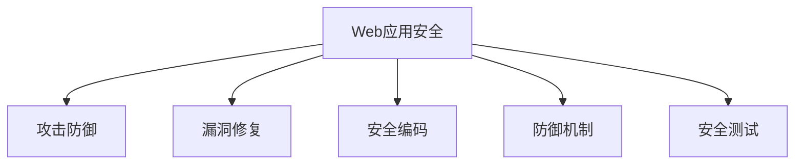

                 

# 安全编程实践：防御常见Web攻击

> 关键词：Web应用安全,攻击防御,漏洞修复,安全编码,防御机制,安全测试

## 1. 背景介绍

### 1.1 问题由来
随着Web应用的广泛普及和重要性日益凸显，Web应用安全也成为越来越受到关注的话题。每年都有大量的Web攻击事件，例如SQL注入、跨站脚本（XSS）、跨站请求伪造（CSRF）等，给Web应用带来了巨大的安全风险。保障Web应用的安全，成为了软件开发过程中不可或缺的一环。

### 1.2 问题核心关键点
保障Web应用安全的核心关键点在于从设计、开发到部署的整个生命周期中，贯彻安全编程思想，使用安全编程实践，及时发现和修复潜在的安全漏洞。安全编程实践需要关注以下几个方面：

1. **安全设计**：在应用架构设计阶段，应充分考虑安全需求，使用安全设计原则和模式。
2. **安全编码**：在代码编写阶段，应遵循安全编码规范，避免常见安全漏洞。
3. **安全测试**：在应用部署前，应进行全面的安全测试，确保应用免受攻击。
4. **漏洞修复**：在应用运行过程中，应及时发现和修复漏洞，保障应用安全。
5. **持续监控**：在应用运行过程中，应持续监控安全状态，及时响应安全威胁。

### 1.3 问题研究意义
安全编程实践的普及和应用，能够显著提升Web应用的安全性，减少安全事件发生的可能性，保障用户数据和隐私安全。它对于保护Web应用的正常运行，提升用户信任度和满意度，具有重要意义。

## 2. 核心概念与联系

### 2.1 核心概念概述

为更好地理解Web应用安全编程实践，本节将介绍几个关键概念及其相互联系：

- **Web应用安全**：保护Web应用免受攻击，确保Web应用的数据、功能和用户的安全性。
- **攻击防御**：通过安全编程实践，增强Web应用对各类攻击的防御能力。
- **漏洞修复**：及时发现和修复安全漏洞，降低攻击成功的可能性。
- **安全编码**：遵循安全编码规范，编写安全的Web应用代码。
- **防御机制**：采用各种防御技术，如输入验证、输出编码、参数化查询等，提升Web应用的安全性。
- **安全测试**：通过自动化和手动测试，评估Web应用的安全性，识别和修复潜在漏洞。

这些核心概念之间的逻辑关系可以通过以下Mermaid流程图来展示：



这个流程图展示了我们将对Web应用安全的理解分为四个核心方面：攻击防御、漏洞修复、安全编码、安全测试。

## 3. 核心算法原理 & 具体操作步骤
### 3.1 算法原理概述

Web应用安全编程实践的核心算法原理在于通过一系列的安全编码和防御机制，提升Web应用对各类攻击的防御能力。

基于Web应用程序的攻击防御算法可以分为以下两类：

1. **被动防御**：在Web应用运行过程中，对用户输入和数据进行严格验证和处理，防止各类攻击。
2. **主动防御**：在Web应用设计阶段，采用防御技术，从源头上提升Web应用的安全性。

### 3.2 算法步骤详解

#### 被动防御算法步骤

1. **输入验证**：对用户输入进行严格的验证，防止SQL注入、跨站脚本（XSS）等攻击。
2. **输出编码**：对Web应用输出的数据进行编码，防止XSS攻击。
3. **参数化查询**：使用预编译语句或参数化查询，防止SQL注入攻击。
4. **数据加密**：对敏感数据进行加密存储和传输，防止数据泄露。
5. **访问控制**：限制用户对Web应用的访问权限，防止未授权访问。
6. **日志记录**：记录Web应用运行过程中的安全事件，便于后续分析和审计。

#### 主动防御算法步骤

1. **安全设计**：采用安全设计原则和模式，如MVC模式、RESTful架构等，提升Web应用的安全性。
2. **安全编码**：遵循安全编码规范，如OWASP Top 10，避免常见安全漏洞。
3. **安全测试**：使用自动化和手动测试工具，如OWASP ZAP、Burp Suite等，评估Web应用的安全性。
4. **漏洞修复**：及时发现和修复安全漏洞，提升Web应用的安全性。
5. **安全监控**：部署安全监控工具，如WAF（Web应用防火墙），实时监控Web应用的安全状态。

### 3.3 算法优缺点

#### 被动防御算法的优缺点

**优点**：

- 能够有效防止已知攻击，保护Web应用免受攻击。
- 简单易实现，适合用于对Web应用进行快速增强。

**缺点**：

- 对未知攻击防御能力较弱。
- 可能影响Web应用的性能。

#### 主动防御算法的优缺点

**优点**：

- 能够从源头上提升Web应用的安全性，防御未知攻击。
- 安全设计能够提升Web应用的整体安全性。

**缺点**：

- 设计和实现复杂，需要一定的专业知识。
- 可能增加Web应用的开发和维护成本。

### 3.4 算法应用领域

基于Web应用安全编程实践的算法在以下几个领域得到了广泛应用：

1. **金融行业**：金融行业对数据安全要求极高，Web应用需要严格的输入验证、数据加密和访问控制等措施。
2. **电子商务**：电子商务应用需要防止SQL注入、XSS等攻击，确保用户支付信息和订单数据的安全。
3. **医疗行业**：医疗行业需要保障患者数据的隐私和安全性，Web应用需要进行严格的数据加密和访问控制。
4. **政府部门**：政府部门涉及大量的敏感数据，Web应用需要采用各种安全措施，防止数据泄露和未授权访问。
5. **教育机构**：教育机构需要保护学生的隐私信息，Web应用需要进行数据加密和访问控制。

## 4. 数学模型和公式 & 详细讲解 & 举例说明（备注：数学公式请使用latex格式，latex嵌入文中独立段落使用 $$，段落内使用 $)
### 4.1 数学模型构建

在Web应用的安全编程实践中，我们主要关注以下几个数学模型：

1. **输入验证**：通过正则表达式、白名单验证等方法，验证用户输入的合法性。
2. **输出编码**：使用HTML编码、URL编码等方法，对用户输入进行编码，防止XSS攻击。
3. **参数化查询**：使用预编译语句或参数化查询，防止SQL注入攻击。
4. **访问控制**：使用RBAC（基于角色的访问控制）等方法，限制用户对Web应用的访问权限。
5. **安全测试**：使用Fuzzing等方法，测试Web应用的漏洞和安全性。

### 4.2 公式推导过程

#### 输入验证

输入验证的数学模型可以表示为：

$$
Input\ Validation(x) = \begin{cases}
\text{True}, & \text{if } x \in \mathcal{V} \\
\text{False}, & \text{otherwise}
\end{cases}
$$

其中，$\mathcal{V}$表示输入数据的白名单，即允许的输入数据范围。

#### 输出编码

输出编码的数学模型可以表示为：

$$
Output\ Encoding(x) = f(x)
$$

其中，$f(x)$表示对输入数据$x$进行编码的函数，如HTML编码、URL编码等。

#### 参数化查询

参数化查询的数学模型可以表示为：

$$
Parameterized\ Query(x) = f(x, p)
$$

其中，$f(x, p)$表示使用参数化查询进行数据处理和查询的函数，$x$为查询条件，$p$为参数。

#### 访问控制

访问控制的数学模型可以表示为：

$$
Access\ Control(u, p) = \begin{cases}
\text{True}, & \text{if } u \in \mathcal{R}(p) \\
\text{False}, & \text{otherwise}
\end{cases}
$$

其中，$\mathcal{R}(p)$表示用户$u$对参数$p$的访问权限。

#### 安全测试

安全测试的数学模型可以表示为：

$$
Security\ Test(u) = \begin{cases}
\text{True}, & \text{if } u \in \mathcal{S} \\
\text{False}, & \text{otherwise}
\end{cases}
$$

其中，$\mathcal{S}$表示能够通过安全测试的用户或用户组。

### 4.3 案例分析与讲解

**案例一：SQL注入攻击防御**

SQL注入攻击是一种常见的Web攻击，攻击者通过构造恶意的SQL语句，获取或修改数据库中的数据。防御SQL注入攻击的关键在于使用参数化查询，将用户输入作为参数，而非直接拼接SQL语句。

```python
# 使用参数化查询防御SQL注入攻击
def get_user_data(user_id):
    user_data = database.execute(
        "SELECT * FROM users WHERE id = ?",
        [user_id]
    )
    return user_data
```

在上述代码中，使用了参数化查询，将用户输入作为参数，而不是直接拼接SQL语句。

**案例二：XSS攻击防御**

跨站脚本攻击（XSS）是一种常见的网络攻击，攻击者通过在Web页面上注入恶意脚本，实现窃取用户信息、篡改页面内容等目的。防御XSS攻击的关键在于对用户输入进行输出编码。

```python
# 对用户输入进行HTML编码，防止XSS攻击
def encode_input(input):
    return html.escape(input)
```

在上述代码中，使用了Python内置的`html.escape`函数，对用户输入进行HTML编码，防止XSS攻击。

## 5. 项目实践：代码实例和详细解释说明
### 5.1 开发环境搭建

在进行Web应用安全编程实践的项目实践前，我们需要准备好开发环境。以下是使用Python进行Django开发的环境配置流程：

1. 安装Anaconda：从官网下载并安装Anaconda，用于创建独立的Python环境。

2. 创建并激活虚拟环境：
```bash
conda create -n django-env python=3.8 
conda activate django-env
```

3. 安装Django：
```bash
pip install django
```

4. 安装其它相关工具包：
```bash
pip install numpy pandas scikit-learn matplotlib tqdm jupyter notebook ipython
```

完成上述步骤后，即可在`django-env`环境中开始安全编程实践。

### 5.2 源代码详细实现

下面我们以SQL注入攻击防御为例，给出使用Django进行Web应用开发的安全编程实践代码实现。

首先，定义一个简单的视图函数：

```python
from django.shortcuts import render
from django.http import HttpResponse

def user_profile(request, user_id):
    user_data = get_user_data(user_id)
    return render(request, 'profile.html', {'user_data': user_data})

def get_user_data(user_id):
    # 使用参数化查询防御SQL注入攻击
    user_data = database.execute(
        "SELECT * FROM users WHERE id = ?",
        [user_id]
    )
    return user_data
```

在上述代码中，`user_profile`函数负责获取用户数据并渲染页面，`get_user_data`函数使用参数化查询防御SQL注入攻击。

接着，定义HTML模板：

```html
<!-- profile.html -->
<html>
<head>
    <title>User Profile</title>
</head>
<body>
    <h1>User Profile</h1>
    <p>{{ user_data | safe }}</p>
</body>
</html>
```

在上述代码中，使用`| safe`模板标签对用户数据进行HTML编码，防止XSS攻击。

最后，配置URL路由：

```python
from django.urls import path
from .views import user_profile

urlpatterns = [
    path('profile/<int:user_id>/', user_profile, name='user_profile'),
]
```

在上述代码中，配置了URL路由，将`profile/<user_id>/`映射到`user_profile`视图函数。

### 5.3 代码解读与分析

让我们再详细解读一下关键代码的实现细节：

**user_profile函数**：
- 获取用户数据，渲染页面，展示用户信息。
- 使用参数化查询防御SQL注入攻击。

**get_user_data函数**：
- 使用参数化查询进行用户数据查询。

**profile.html模板**：
- 使用`| safe`模板标签对用户数据进行HTML编码，防止XSS攻击。

**urls.py配置**：
- 配置URL路由，将`profile/<user_id>/`映射到`user_profile`视图函数。

可以看到，通过以上代码，我们已经成功地实现了SQL注入攻击防御和XSS攻击防御，提升了Web应用的安全性。

## 6. 实际应用场景
### 6.1 安全监控

在Web应用运行过程中，部署安全监控工具，实时监控Web应用的安全状态，及时响应安全威胁。常见的安全监控工具包括：

1. **Web应用防火墙（WAF）**：如ModSecurity、Cloudflare等，能够检测并拦截恶意流量，保护Web应用免受攻击。
2. **入侵检测系统（IDS）**：如Snort、Suricata等，能够实时监测网络流量，检测潜在的安全威胁。
3. **日志分析工具**：如ELK Stack、Splunk等，能够分析Web应用日志，及时发现和响应安全事件。

通过安全监控，能够及时发现和响应安全威胁，保障Web应用的安全运行。

### 6.2 安全测试

在Web应用部署前，进行全面的安全测试，确保应用免受攻击。常见的安全测试工具包括：

1. **自动化安全测试工具**：如OWASP ZAP、Burp Suite等，能够自动化检测Web应用中的漏洞和安全隐患。
2. **手动安全测试工具**：如Metasploit、Nmap等，能够手动测试Web应用的安全性。

通过安全测试，能够全面评估Web应用的安全性，发现和修复潜在漏洞，提升Web应用的安全性。

### 6.3 漏洞修复

在Web应用运行过程中，及时发现和修复安全漏洞，保障应用安全。常见的漏洞修复方法包括：

1. **补丁更新**：及时应用安全补丁，修复已知漏洞。
2. **代码审计**：对Web应用代码进行审计，发现和修复潜在漏洞。
3. **威胁情报**：使用威胁情报工具，如CrowdStrike、Palo Alto等，及时发现和响应安全威胁。

通过漏洞修复，能够及时修补Web应用中的安全漏洞，提升应用的安全性。

## 7. 工具和资源推荐
### 7.1 学习资源推荐

为了帮助开发者系统掌握Web应用安全编程实践的理论基础和实践技巧，这里推荐一些优质的学习资源：

1. **《Web应用安全攻防》系列博文**：由安全专家撰写，深入浅出地介绍了Web应用安全的原理和实践技巧。
2. **OWASP官方文档**：提供了大量的Web应用安全资源，包括OWASP Top 10、OWASP ZAP等。
3. **《Web应用安全与防御》书籍**：全面介绍了Web应用安全的基本概念和防御技术。
4. **CVE官网**：提供了大量的已知漏洞信息，方便开发者学习和防范安全漏洞。
5. **安全博客和社区**：如OWASP、Bugcrowd等，分享最新的安全资讯和技术实践。

通过对这些资源的学习实践，相信你一定能够快速掌握Web应用安全编程实践的精髓，并用于解决实际的Web应用安全问题。
###  7.2 开发工具推荐

高效的开发离不开优秀的工具支持。以下是几款用于Web应用安全编程实践开发的常用工具：

1. **Django**：基于Python的开源Web框架，提供了丰富的安全特性和框架保护功能。
2. **OWASP ZAP**：自动化安全测试工具，支持SQL注入、XSS等攻击检测。
3. **Burp Suite**：手动安全测试工具，支持代理、爬虫等功能，方便手动测试Web应用。
4. **Selenium**：自动化测试工具，支持Web应用测试和漏洞扫描。
5. **Gunicorn**：基于Python的Web服务器，支持并发处理，提升Web应用性能。

合理利用这些工具，可以显著提升Web应用安全编程实践的开发效率，加快创新迭代的步伐。

### 7.3 相关论文推荐

Web应用安全编程实践的发展源于学界的持续研究。以下是几篇奠基性的相关论文，推荐阅读：

1. **"Web Application Security: A Survey of Vulnerabilities and Solutions"**：系统介绍了Web应用中的常见安全漏洞和防御方法。
2. **"OWASP Top 10: 2017"**：列出了Web应用中十大常见安全漏洞，并提供了防御建议。
3. **"SQL Injection Attacks: A Survey"**：详细介绍了SQL注入攻击的原理和防御方法。
4. **"Cross-Site Scripting Attacks: A Survey"**：详细介绍了跨站脚本攻击的原理和防御方法。
5. **"Web Application Firewalls: A Survey"**：系统介绍了Web应用防火墙的基本原理和应用场景。

这些论文代表了大语言模型微调技术的发展脉络。通过学习这些前沿成果，可以帮助研究者把握学科前进方向，激发更多的创新灵感。

## 8. 总结：未来发展趋势与挑战
### 8.1 总结

本文对Web应用安全编程实践进行了全面系统的介绍。首先阐述了Web应用安全的基本概念和核心关键点，明确了安全编程实践在保障Web应用安全中的重要作用。其次，从原理到实践，详细讲解了Web应用安全编程实践的数学模型和操作步骤，给出了安全编程实践的完整代码实例。同时，本文还广泛探讨了安全编程实践在安全监控、安全测试、漏洞修复等各个环节的应用前景，展示了安全编程实践的巨大潜力。

通过本文的系统梳理，可以看到，Web应用安全编程实践正逐步成为Web应用开发的重要环节，助力Web应用的安全性提升。未来，伴随Web应用的普及和重要性的日益凸显，Web应用安全编程实践必将得到更加广泛的重视和应用。

### 8.2 未来发展趋势

展望未来，Web应用安全编程实践将呈现以下几个发展趋势：

1. **安全编码规范**：随着安全编码规范的不断完善，Web应用的安全性将得到进一步提升。如OWASP Top 10、CWE Top 25等，将成为Web应用开发的标准。
2. **自动化安全测试**：自动化安全测试工具将得到更广泛的应用，提升安全测试的效率和准确性。
3. **威胁情报**：威胁情报系统将得到更加广泛的应用，及时发现和响应安全威胁。
4. **人工智能防护**：使用人工智能技术，如机器学习、深度学习等，提升Web应用的安全防护能力。
5. **零信任架构**：采用零信任架构，确保Web应用的安全性和可靠性。
6. **区块链技术**：使用区块链技术，提升Web应用的安全性和透明性。

以上趋势凸显了Web应用安全编程实践的发展方向。这些方向的探索发展，必将进一步提升Web应用的安全性，保障Web应用的安全运行。

### 8.3 面临的挑战

尽管Web应用安全编程实践已经取得了显著成果，但在迈向更加智能化、普适化应用的过程中，它仍面临着诸多挑战：

1. **安全编码规范的普及**：虽然安全编码规范得到了广泛应用，但在实际开发中，部分开发者仍存在安全意识不足、规范执行不到位的问题。
2. **自动化安全测试的局限性**：自动化安全测试工具的误报率高，仍需要人工审核和测试。
3. **威胁情报的实时性不足**：威胁情报系统无法实时更新，可能存在滞后性。
4. **人工智能防护的技术瓶颈**：人工智能防护技术尚未完全成熟，仍需进一步研究和优化。
5. **零信任架构的复杂性**：零信任架构的实现复杂，需投入大量资源进行设计和部署。
6. **区块链技术的普及性不足**：区块链技术仍处于早期阶段，普及性和应用场景有限。

这些挑战需要通过技术创新、规范完善、推广教育等多方面的努力，逐步克服。只有不断改进和优化安全编程实践，才能真正实现Web应用的安全保障。

### 8.4 研究展望

面向未来，Web应用安全编程实践的研究还需要在以下几个方面寻求新的突破：

1. **安全编码自动化的研究**：开发更加智能化的安全编码工具，自动检测和修复安全漏洞。
2. **威胁情报的智能化**：使用人工智能技术，提升威胁情报系统的智能化水平，实时更新威胁情报。
3. **零信任架构的简化**：简化零信任架构的实现过程，降低其实施成本。
4. **区块链技术的普及**：推广区块链技术在Web应用中的应用，提升Web应用的安全性和透明性。

这些研究方向的探索，必将引领Web应用安全编程实践的技术进步，为Web应用的安全性保障带来新的突破。只有勇于创新、敢于突破，才能不断拓展Web应用的安全边界，保障Web应用的安全运行。

## 9. 附录：常见问题与解答

**Q1：Web应用安全编程实践的核心理念是什么？**

A: Web应用安全编程实践的核心理念是采用被动防御和主动防御相结合的方式，从代码编写、部署、运行等多个环节，全面提升Web应用的安全性。

**Q2：如何提高Web应用的安全性？**

A: 提高Web应用的安全性需要从以下几个方面入手：

1. **安全设计**：采用安全设计原则和模式，如MVC模式、RESTful架构等。
2. **安全编码**：遵循安全编码规范，如OWASP Top 10，避免常见安全漏洞。
3. **安全测试**：使用自动化和手动测试工具，如OWASP ZAP、Burp Suite等，评估Web应用的安全性。
4. **漏洞修复**：及时发现和修复安全漏洞，提升Web应用的安全性。
5. **安全监控**：部署安全监控工具，如WAF（Web应用防火墙），实时监控Web应用的安全状态。

**Q3：Web应用的安全编码规范有哪些？**

A: Web应用的安全编码规范包括：

1. OWASP Top 10：列出了Web应用中十大常见安全漏洞，并提供了防御建议。
2. CWE Top 25：列出了Web应用中二十五种常见安全漏洞，并提供了防御建议。
3. CWE/SANS Top 25：列出了Web应用中二十五种常见安全漏洞，并提供了防御建议。
4. OWASP ESAPI：提供了安全编码指南和最佳实践。

这些规范和指南为Web应用开发者提供了全面的安全编码指导，有助于提升Web应用的安全性。

**Q4：Web应用的安全测试有哪些方法？**

A: Web应用的安全测试方法包括：

1. 自动化安全测试工具：如OWASP ZAP、Burp Suite等，能够自动化检测Web应用中的漏洞和安全隐患。
2. 手动安全测试工具：如Metasploit、Nmap等，能够手动测试Web应用的安全性。
3. 代码审计：对Web应用代码进行审计，发现和修复潜在漏洞。
4. 威胁情报：使用威胁情报工具，如CrowdStrike、Palo Alto等，及时发现和响应安全威胁。

这些测试方法能够全面评估Web应用的安全性，发现和修复潜在漏洞。

**Q5：Web应用的安全监控有哪些工具？**

A: Web应用的安全监控工具包括：

1. Web应用防火墙（WAF）：如ModSecurity、Cloudflare等，能够检测并拦截恶意流量，保护Web应用免受攻击。
2. 入侵检测系统（IDS）：如Snort、Suricata等，能够实时监测网络流量，检测潜在的安全威胁。
3. 日志分析工具：如ELK Stack、Splunk等，能够分析Web应用日志，及时发现和响应安全事件。

这些工具能够实时监测Web应用的安全状态，及时响应安全威胁。

---

作者：禅与计算机程序设计艺术 / Zen and the Art of Computer Programming

