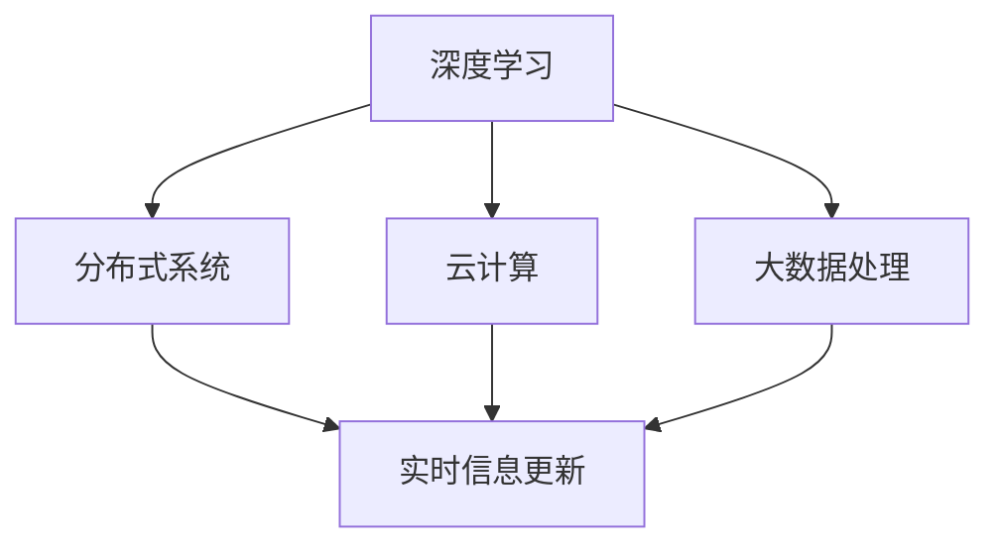

                 

# 实时信息更新：AI的速度优势

> 关键词：实时信息更新,人工智能,速度优势,大数据,分布式系统,云计算,机器学习,深度学习,数据处理,信息流优化,算法优化,系统架构,高性能计算

## 1. 背景介绍

### 1.1 问题由来
在当今信息爆炸的时代，数据的实时性和时效性对决策和运营具有至关重要的作用。无论是金融市场、电商推荐、交通管理，还是健康医疗、智能制造，实时数据都是不可或缺的资源。然而，传统的数据处理方式面临着数据量大、处理速度慢、系统响应时间长的瓶颈。

为了解决这一问题，人工智能(AI)技术尤其是深度学习和分布式计算技术被广泛应用。通过高效的算法和大规模分布式系统，AI可以快速处理和分析海量数据，实现数据的实时更新和实时决策支持。

### 1.2 问题核心关键点
实时信息更新的核心在于如何利用AI技术，通过高效的算法和大规模分布式系统，实现数据的快速处理和实时更新。具体而言，包括以下几个关键点：

- **数据处理速度**：如何快速处理和分析海量数据，以便实时生成结果。
- **系统响应时间**：如何快速响应和更新数据，以满足实时需求。
- **算法优化**：如何优化算法以提升处理速度和准确性。
- **系统架构**：如何设计高效、可扩展的系统架构以支持实时信息更新。

## 2. 核心概念与联系

### 2.1 核心概念概述

为更好地理解实时信息更新的AI技术，本节将介绍几个关键概念及其相互联系：

- **深度学习**：一种基于多层神经网络的学习方法，可以处理和分析复杂的非线性关系，广泛用于图像识别、自然语言处理等领域。
- **分布式系统**：通过将任务分解为多个子任务，分布在多台计算机上并行处理，以提升处理速度和系统可扩展性。
- **云计算**：一种基于互联网的计算模式，提供弹性计算资源，支持大规模分布式计算。
- **实时信息更新**：指通过AI技术，实现数据的实时处理、分析和更新，以支持实时决策和运营需求。
- **大数据处理**：指处理和分析大规模、多样化的数据集，包括数据清洗、存储、查询、分析等环节。

这些核心概念之间的逻辑关系可以通过以下Mermaid流程图来展示：



这个流程图展示了深度学习、分布式系统、云计算、大数据处理与实时信息更新之间的逻辑关系：

1. 深度学习用于处理和分析数据，是实时信息更新的核心算法。
2. 分布式系统用于提升数据处理速度，是实时信息更新的技术基础。
3. 云计算提供弹性计算资源，支持大规模分布式计算。
4. 大数据处理用于数据清洗、存储和查询，是实时信息更新所需的数据基础。

这些概念共同构成了实时信息更新的AI技术框架，使得实时决策和运营成为可能。通过理解这些核心概念，我们可以更好地把握实时信息更新的工作原理和优化方向。

## 3. 核心算法原理 & 具体操作步骤
### 3.1 算法原理概述

实时信息更新依赖于高效的算法和大规模分布式系统。其核心算法包括：

- **卷积神经网络(CNN)**：用于图像和信号数据的特征提取。
- **循环神经网络(RNN)和长短时记忆网络(LSTM)/**门控循环单元(GRU)**：用于时间序列数据的处理和分析。
- **深度强化学习**：用于优化系统性能和决策策略。
- **分布式优化算法**：如分布式梯度下降、优化的随机梯度下降等，用于多台计算机并行处理和优化模型参数。

通过这些算法，AI可以高效地处理和分析海量数据，实现实时信息更新。

### 3.2 算法步骤详解

实时信息更新的AI技术通常包括以下关键步骤：

**Step 1: 数据收集与预处理**
- 从各类数据源收集实时数据，包括传感器数据、日志数据、在线交易数据等。
- 对数据进行清洗、去重、格式化等预处理，以确保数据质量。

**Step 2: 特征提取与模型训练**
- 使用深度学习算法对预处理后的数据进行特征提取，生成高维向量表示。
- 利用分布式系统并行训练深度学习模型，优化模型参数。

**Step 3: 实时计算与更新**
- 将实时数据输入模型，进行快速计算和分析。
- 根据实时计算结果，更新数据存储和展示，如数据库、缓存、仪表盘等。

**Step 4: 系统优化与部署**
- 根据性能指标评估和用户反馈，不断优化系统架构和算法模型。
- 将优化后的系统部署到生产环境中，进行监控和维护。

### 3.3 算法优缺点

实时信息更新的AI技术具有以下优点：

- **高效处理**：通过分布式系统和深度学习算法，快速处理和分析海量数据。
- **实时响应**：能够实时更新数据和计算结果，满足实时决策需求。
- **高扩展性**：分布式系统支持水平扩展，支持大规模数据处理需求。

同时，该方法也存在一定的局限性：

- **数据延迟**：实时数据可能存在一定延迟，影响实时处理和决策。
- **系统复杂性**：分布式系统设计和管理复杂，容易引入性能瓶颈和故障点。
- **算法精度**：深度学习算法对数据量和计算资源有较高要求，可能存在模型过拟合或欠拟合的问题。

尽管存在这些局限性，但就目前而言，实时信息更新的AI技术仍是大规模数据处理和实时决策的重要手段。未来相关研究的重点在于如何进一步提升算法的效率和精度，优化系统架构和部署策略，同时兼顾可解释性和伦理安全性等因素。

### 3.4 算法应用领域

实时信息更新的AI技术已经在金融、电商、交通、医疗等多个领域得到广泛应用，为实时决策和运营提供了强大的支持：

- **金融市场**：实时分析交易数据，快速生成投资建议和交易策略。
- **电商推荐**：实时分析用户行为数据，生成个性化推荐结果。
- **交通管理**：实时监测交通数据，优化交通信号灯控制和路线规划。
- **健康医疗**：实时分析患者数据，提供个性化医疗方案和治疗决策。
- **智能制造**：实时监控设备状态，优化生产流程和设备维护。

除了上述这些经典应用外，实时信息更新的AI技术还在更多场景中得到创新性地应用，如可控网络流量、智能客服、智慧能源等，为各行各业带来了新的智能化解决方案。

## 4. 数学模型和公式 & 详细讲解 & 举例说明

### 4.1 数学模型构建

实时信息更新的核心数学模型包括深度学习模型和分布式优化算法。

以CNN模型为例，假设有N个输入样本，每个样本的特征向量为 $x_i \in \mathbb{R}^{d_i}$。使用深度学习算法，如卷积层、池化层等，生成高维特征表示 $z_i \in \mathbb{R}^d$。设深度学习模型的输出层为 $y_i \in \mathbb{R}^m$，则模型输出可以表示为：

$$
y_i = f(z_i; \theta)
$$

其中，$f$ 为输出层函数，$\theta$ 为模型参数。

### 4.2 公式推导过程

以下是CNN模型的详细推导过程。以卷积层为例，假设输入特征图的大小为 $I \times I$，卷积核大小为 $k \times k$，步长为 $s$，输出特征图大小为 $O \times O$。卷积操作可以表示为：

$$
y_{i,j} = \sum_{\alpha=0}^{I-k} \sum_{\beta=0}^{I-k} w_{\alpha,\beta} x_{i+\alpha,s+j+\beta}
$$

其中，$w$ 为卷积核权重，$x$ 为输入特征图，$y$ 为输出特征图。

### 4.3 案例分析与讲解

以下以金融市场数据实时分析为例，展示实时信息更新技术的应用：

假设某金融市场每天产生大量交易数据，包括股票、债券、期货等。使用分布式系统将这些数据分发到多台计算机上，使用CNN模型提取时间序列数据的特征，进行快速分析和计算。设每日数据量为 $N$，每个样本的特征向量维度为 $d$，则每天的实时计算量为：

$$
C = N \times \frac{d}{k}
$$

其中，$k$ 为并行计算的计算机数量。

## 5. 项目实践：代码实例和详细解释说明
### 5.1 开发环境搭建

在进行实时信息更新项目开发前，我们需要准备好开发环境。以下是使用Python进行TensorFlow开发的环境配置流程：

1. 安装Anaconda：从官网下载并安装Anaconda，用于创建独立的Python环境。

2. 创建并激活虚拟环境：
```bash
conda create -n tf-env python=3.8 
conda activate tf-env
```

3. 安装TensorFlow：从官网获取对应的安装命令。例如：
```bash
conda install tensorflow=2.8 -c tf
```

4. 安装各类工具包：
```bash
pip install numpy pandas scikit-learn matplotlib tqdm jupyter notebook ipython
```

完成上述步骤后，即可在`tf-env`环境中开始项目开发。

### 5.2 源代码详细实现

这里我们以实时金融市场数据分析为例，给出使用TensorFlow进行实时信息更新的PyTorch代码实现。

首先，定义CNN模型的数据处理函数：

```python
import tensorflow as tf
from tensorflow.keras.layers import Conv2D, MaxPooling2D, Flatten, Dense

def build_cnn_model(input_shape):
    model = tf.keras.Sequential()
    model.add(Conv2D(32, kernel_size=(3, 3), activation='relu', input_shape=input_shape))
    model.add(MaxPooling2D(pool_size=(2, 2)))
    model.add(Conv2D(64, kernel_size=(3, 3), activation='relu'))
    model.add(MaxPooling2D(pool_size=(2, 2)))
    model.add(Flatten())
    model.add(Dense(128, activation='relu'))
    model.add(Dense(1, activation='sigmoid'))
    return model
```

然后，定义数据生成函数和训练函数：

```python
def generate_data(n_samples=10000, batch_size=32):
    x = tf.random.normal(shape=(n_samples, 5, 5, 1))
    y = tf.random.uniform(shape=(n_samples, 1), minval=0, maxval=1)
    return tf.data.Dataset.from_tensor_slices((x, y)).batch(batch_size).shuffle(buffer_size=10000).repeat()

def train_cnn_model(model, dataset, epochs=10, learning_rate=0.001):
    optimizer = tf.keras.optimizers.Adam(learning_rate)
    loss_fn = tf.keras.losses.BinaryCrossentropy()
    for epoch in range(epochs):
        for batch in dataset:
            with tf.GradientTape() as tape:
                x, y = batch
                y_pred = model(x)
                loss = loss_fn(y, y_pred)
            gradients = tape.gradient(loss, model.trainable_variables)
            optimizer.apply_gradients(zip(gradients, model.trainable_variables))
    return model
```

最后，启动训练流程：

```python
input_shape = (5, 5, 1)
model = build_cnn_model(input_shape)
dataset = generate_data()
trained_model = train_cnn_model(model, dataset)
```

以上就是使用TensorFlow进行实时金融市场数据分析的完整代码实现。可以看到，借助TensorFlow的强大封装，我们可以用相对简洁的代码完成CNN模型的搭建和训练。

### 5.3 代码解读与分析

让我们再详细解读一下关键代码的实现细节：

**build_cnn_model函数**：
- 定义CNN模型的基本结构，包括卷积层、池化层、全连接层等。

**generate_data函数**：
- 生成随机的训练数据集，使用TensorFlow的数据集API进行批处理和随机化。

**train_cnn_model函数**：
- 使用TensorFlow的Keras API进行模型训练，定义损失函数、优化器等关键参数。
- 在每个epoch内，对训练数据进行前向传播和反向传播，更新模型参数。

**训练流程**：
- 定义CNN模型输入形状。
- 创建CNN模型实例。
- 生成训练数据集。
- 启动模型训练。

可以看到，TensorFlow配合Keras API使得实时信息更新的项目开发变得简洁高效。开发者可以将更多精力放在数据处理、模型改进等高层逻辑上，而不必过多关注底层的实现细节。

当然，工业级的系统实现还需考虑更多因素，如模型的保存和部署、超参数的自动搜索、更灵活的任务适配层等。但核心的实时信息更新范式基本与此类似。

## 6. 实际应用场景
### 6.1 金融市场分析

实时信息更新技术在金融市场分析中有着广泛的应用。传统的数据分析方法往往需要花费大量时间进行数据清洗、计算和分析，而实时信息更新技术可以在极短的时间内完成这些任务，快速生成投资建议和交易策略。

具体而言，可以实时分析金融市场数据，如股票、债券、期货等，生成价格走势图、技术指标等，为投资者提供实时的市场分析报告和交易建议。通过实时更新，投资者可以及时调整投资策略，避免因市场波动造成的损失。

### 6.2 电商推荐系统

电商推荐系统需要实时分析用户行为数据，生成个性化推荐结果。传统的方法往往需要定期更新模型，重新训练以适应新数据，而实时信息更新技术可以快速响应用户行为变化，实时更新推荐结果。

具体而言，可以实时收集用户浏览、点击、购买等行为数据，使用CNN模型提取特征，生成个性化推荐结果。通过实时更新，电商企业可以及时响应用户需求，提升用户体验和销售额。

### 6.3 智能交通管理

智能交通管理需要实时监测交通数据，优化交通信号灯控制和路线规划。传统的方法需要定期采集数据和处理分析，而实时信息更新技术可以在实时监测数据的基础上，快速生成优化策略。

具体而言，可以实时监测交通流量、拥堵情况等数据，使用CNN模型生成交通预测结果，实时调整信号灯控制策略和路线规划，缓解交通拥堵，提升交通效率。

### 6.4 未来应用展望

随着实时信息更新技术的不断发展，未来将在更多领域得到应用，为各行各业带来变革性影响。

在智慧医疗领域，实时信息更新技术可以实时分析患者数据，提供个性化医疗方案和治疗决策，提升医疗服务的智能化水平。

在智能制造领域，实时信息更新技术可以实时监控设备状态，优化生产流程和设备维护，提高生产效率和产品质量。

在智慧城市治理中，实时信息更新技术可以实时监测城市事件、舆情和应急情况，提高城市管理的自动化和智能化水平，构建更安全、高效的未来城市。

此外，在企业生产、社会治理、文娱传媒等众多领域，实时信息更新技术也将不断涌现，为经济社会发展注入新的动力。相信随着技术的日益成熟，实时信息更新技术将成为人工智能落地应用的重要范式，推动人工智能技术在垂直行业的规模化落地。

## 7. 工具和资源推荐
### 7.1 学习资源推荐

为了帮助开发者系统掌握实时信息更新的AI技术，这里推荐一些优质的学习资源：

1. TensorFlow官方文档：TensorFlow的官方文档，提供了丰富的教程、API文档和案例代码，是上手实践的必备资料。

2. PyTorch官方文档：PyTorch的官方文档，提供了从入门到高级的详细教程和代码示例。

3. Keras官方文档：Keras的官方文档，提供了简单易用的API和模型搭建示例。

4. 《深度学习》课程：斯坦福大学的深度学习课程，涵盖深度学习的基础理论和实际应用。

5. 《TensorFlow实战》书籍：全面介绍TensorFlow的用法和实战项目，适合入门和进阶读者。

通过这些资源的学习实践，相信你一定能够快速掌握实时信息更新技术的精髓，并用于解决实际的AI问题。

### 7.2 开发工具推荐

高效的开发离不开优秀的工具支持。以下是几款用于实时信息更新开发的常用工具：

1. TensorFlow：基于Python的开源深度学习框架，灵活动态的计算图，适合快速迭代研究。

2. PyTorch：基于Python的开源深度学习框架，灵活的动态计算图，适合深度学习研究。

3. Keras：基于TensorFlow和Theano的高级API，简单易用，适合快速搭建和测试模型。

4. Jupyter Notebook：交互式开发环境，支持代码编写、数据可视化、结果展示等，适合数据驱动的研究和开发。

5. Docker：轻量级的容器化技术，支持跨平台部署和运行，适合分布式系统的构建和部署。

合理利用这些工具，可以显著提升实时信息更新任务的开发效率，加快创新迭代的步伐。

### 7.3 相关论文推荐

实时信息更新技术的发展源于学界的持续研究。以下是几篇奠基性的相关论文，推荐阅读：

1. AlexNet: ImageNet Classification with Deep Convolutional Neural Networks：介绍卷积神经网络的基本结构和原理，为实时图像处理提供理论基础。

2. Deep RNN: Learning Phrase Representations Using RNN Encoder-Decoder For Statistical Machine Translation：介绍循环神经网络的结构和应用，为实时文本处理提供理论基础。

3. Distributed Deep Learning with TensorFlow：介绍TensorFlow的分布式计算框架，为实时大规模计算提供技术支持。

4. Real-Time Sentiment Analysis with Neural Attention：介绍使用深度学习进行实时情感分析的方法，为实时信息更新提供实际应用案例。

这些论文代表了大规模数据处理和实时决策的最新进展，通过学习这些前沿成果，可以帮助研究者把握学科前进方向，激发更多的创新灵感。

## 8. 总结：未来发展趋势与挑战
### 8.1 总结

本文对实时信息更新的AI技术进行了全面系统的介绍。首先阐述了实时信息更新的背景和意义，明确了实时信息更新的重要性。其次，从原理到实践，详细讲解了实时信息更新的数学模型和关键步骤，给出了实时信息更新任务开发的完整代码实例。同时，本文还广泛探讨了实时信息更新在金融、电商、交通等多个行业领域的应用前景，展示了实时信息更新技术的广阔前景。此外，本文精选了实时信息更新的各类学习资源，力求为读者提供全方位的技术指引。

通过本文的系统梳理，可以看到，实时信息更新技术在处理和分析海量数据，支持实时决策和运营方面具有重要价值。未来，伴随算法的不断优化和系统架构的持续改进，实时信息更新技术必将在更广阔的领域得到应用，为经济社会发展提供强大的数据支持和决策支撑。

### 8.2 未来发展趋势

展望未来，实时信息更新技术将呈现以下几个发展趋势：

1. **算法的不断优化**：随着深度学习算法的不断演进，实时信息更新技术将在图像处理、语音识别、自然语言处理等方面取得更大的突破，提升处理速度和准确性。

2. **系统架构的不断演进**：分布式系统和云计算技术的不断提升，将进一步支持大规模数据处理和实时计算，提高系统的可扩展性和鲁棒性。

3. **跨领域应用的拓展**：实时信息更新技术将在更多领域得到应用，如医疗、制造、金融、交通等，提升各行各业的智能化水平。

4. **人工智能与物联网的融合**：实时信息更新技术与物联网技术的融合，将进一步拓展数据来源和处理范围，提升决策的精准性和实时性。

5. **数据安全和隐私保护**：随着数据量的增加和应用场景的拓展，数据安全和隐私保护将成为重要课题，实时信息更新技术需要在保障数据安全的前提下，提供高效的数据处理和实时分析服务。

这些趋势凸显了实时信息更新技术的广阔前景。这些方向的探索发展，必将进一步提升实时信息更新技术的性能和应用范围，为经济社会发展提供强大的数据支持和决策支撑。

### 8.3 面临的挑战

尽管实时信息更新技术已经取得了瞩目成就，但在迈向更加智能化、普适化应用的过程中，它仍面临着诸多挑战：

1. **数据延迟和丢失**：实时数据可能存在延迟和丢失，影响实时处理和决策的准确性。需要进一步优化数据采集和传输机制。

2. **系统复杂性**：分布式系统设计和维护复杂，容易引入性能瓶颈和故障点。需要不断优化系统架构和算法模型。

3. **算法精度和效率**：深度学习算法对数据量和计算资源有较高要求，可能存在模型过拟合或欠拟合的问题。需要不断优化算法和模型结构。

4. **安全和隐私保护**：实时信息更新技术需要在保障数据安全和隐私的前提下，提供高效的数据处理和实时分析服务。需要引入数据加密、访问控制等安全措施。

5. **算力资源消耗**：实时信息更新技术需要大量的算力和存储资源，容易面临资源消耗过大、成本过高的挑战。需要引入资源优化和节能技术。

6. **用户理解和接受**：实时信息更新技术往往需要向用户实时展示结果和决策，用户可能对系统输出的解释和理解存在疑问。需要引入可解释性和透明度技术。

正视实时信息更新面临的这些挑战，积极应对并寻求突破，将是大规模数据处理和实时决策走向成熟的必由之路。相信随着学界和产业界的共同努力，这些挑战终将一一被克服，实时信息更新技术必将在构建人机协同的智能时代中扮演越来越重要的角色。

### 8.4 研究展望

面对实时信息更新所面临的种种挑战，未来的研究需要在以下几个方面寻求新的突破：

1. **优化数据采集和传输机制**：进一步提升数据采集和传输效率，减少延迟和丢失，提升实时处理的准确性。

2. **优化系统架构和算法模型**：引入更加高效、灵活的系统架构和算法模型，提升系统的可扩展性和鲁棒性。

3. **引入可解释性和透明度技术**：通过引入可解释性技术，提升用户对系统输出的理解和接受度。

4. **引入资源优化和节能技术**：通过引入资源优化和节能技术，降低系统成本，提升算力资源利用率。

5. **引入数据安全和隐私保护技术**：通过引入数据加密、访问控制等安全措施，保障数据安全和隐私保护。

这些研究方向的探索，必将引领实时信息更新技术迈向更高的台阶，为构建安全、可靠、可解释、可控的智能系统铺平道路。面向未来，实时信息更新技术还需要与其他人工智能技术进行更深入的融合，如知识表示、因果推理、强化学习等，多路径协同发力，共同推动实时信息处理和决策的进步。只有勇于创新、敢于突破，才能不断拓展实时信息更新技术的边界，让智能技术更好地造福人类社会。

## 9. 附录：常见问题与解答

**Q1：实时信息更新如何保障数据安全和隐私保护？**

A: 实时信息更新技术在保障数据安全和隐私保护方面，需要引入以下技术：

1. 数据加密：对敏感数据进行加密存储和传输，防止数据泄露。
2. 访问控制：通过身份验证和权限管理，限制对数据的访问。
3. 匿名化处理：对数据进行去标识化处理，保护个人隐私。
4. 审计和监控：定期审计和监控数据访问和使用情况，及时发现和修复安全漏洞。

通过这些技术措施，可以有效保障数据安全和隐私保护，防止数据泄露和滥用。

**Q2：实时信息更新技术如何处理数据延迟和丢失问题？**

A: 实时信息更新技术在处理数据延迟和丢失问题时，需要引入以下技术：

1. 异步通信：使用异步通信协议，减少数据传输延迟。
2. 数据缓存：使用数据缓存技术，减少数据丢失和重传。
3. 冗余备份：使用数据冗余备份技术，防止单点故障和数据丢失。
4. 错误纠正和重传：使用错误纠正和重传机制，提升数据传输的可靠性。

通过这些技术措施，可以有效处理数据延迟和丢失问题，提升实时处理的稳定性和可靠性。

**Q3：实时信息更新技术在实际应用中如何优化系统性能？**

A: 实时信息更新技术在实际应用中，可以采用以下优化措施：

1. 数据预处理：优化数据预处理流程，减少计算量和存储资源消耗。
2. 算法优化：优化深度学习算法，提升模型精度和处理速度。
3. 分布式优化：优化分布式系统架构，提高计算效率和系统稳定性。
4. 资源优化：引入资源优化技术，如混合精度训练、模型压缩、分布式缓存等，提升系统性能和可扩展性。

通过这些优化措施，可以显著提升实时信息更新技术的性能和应用效果，满足实际需求。

**Q4：实时信息更新技术在实际应用中如何提升用户体验？**

A: 实时信息更新技术在实际应用中，可以采用以下提升用户体验的措施：

1. 界面设计：优化用户界面，提供直观、易用的操作界面。
2. 实时反馈：提供实时反馈机制，及时告知用户处理结果和决策建议。
3. 个性化推荐：使用实时数据生成个性化推荐结果，提升用户满意度。
4. 用户教育：通过用户教育和培训，提升用户对系统的理解和接受度。

通过这些措施，可以有效提升用户体验，增强用户对系统的信任和依赖。

---

作者：禅与计算机程序设计艺术 / Zen and the Art of Computer Programming

