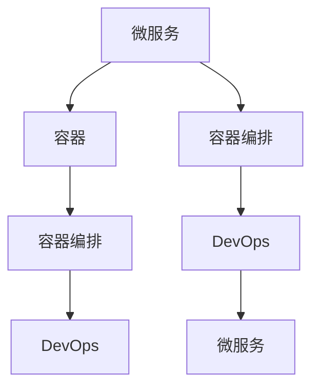

                 

# 容器化微服务：简化部署和扩展

容器化微服务已成为现代软件开发中不可或缺的一部分，其核心思想是将一个应用程序拆分成多个独立运行的服务，每个服务独立部署、独立扩展、独立维护，从而提升软件的可管理性、可扩展性和可靠性。本文将从背景介绍、核心概念、算法原理、具体操作步骤、案例分析、开发实践、实际应用、未来展望等方面，系统探讨容器化微服务的原理与应用实践。

## 1. 背景介绍

### 1.1 问题由来

在过去的几十年里，软件开发模式经历了从单体应用到微服务的演进。单体应用虽然简单，但随着系统规模的扩大，维护成本越来越高，团队协作也变得更加困难。微服务通过将系统拆分为多个独立运行的服务，使得各个服务可以独立部署、独立扩展，极大地提升了系统的可管理性和可扩展性。

然而，在微服务实践中，服务部署、网络通信、配置管理等问题仍然存在。如何在不同的微服务之间高效协作，如何保障服务的可靠性和可用性，如何实现服务的快速扩展和维护，成为微服务架构需要解决的关键问题。容器化技术作为微服务的重要组成部分，通过将服务打包到轻量级的容器中进行部署和管理，为微服务架构提供了重要的技术支撑。

### 1.2 问题核心关键点

容器化微服务技术旨在解决以下几个核心问题：

1. **服务部署简化**：通过容器技术，可以以相同的运行环境快速部署多个服务实例，简化了服务的部署和管理。
2. **服务扩展灵活**：基于容器化的服务可以动态扩展，以应对不断增长的负载。
3. **服务维护高效**：每个服务可以独立部署和维护，降低了系统维护的复杂度。
4. **服务通信优化**：通过容器编排技术，可以优化微服务之间的通信，减少网络延迟和资源浪费。
5. **服务可靠性强**：容器化服务可以提供自动化的故障检测和恢复机制，提高系统的可靠性。

这些问题的解决，使得微服务架构在应对现代软件开发中的复杂性和多样性时更具优势。

### 1.3 问题研究意义

容器化微服务技术为现代软件开发提供了高效、可靠、可扩展的解决方案，其研究意义在于：

1. **提升软件质量**：通过微服务和容器化技术，可以构建更高质量的软件系统，使其更易于维护、更稳定可靠。
2. **加速创新迭代**：容器化微服务简化了软件开发的部署和扩展过程，使得团队可以更快地进行功能和功能的迭代开发。
3. **促进云原生发展**：容器化微服务是云原生架构的重要组成部分，为云原生应用提供了坚实的基础。
4. **提高企业竞争力**：通过容器化微服务技术，企业可以快速构建和部署高质量的应用系统，从而提升市场竞争力。
5. **推动新技术普及**：容器化微服务技术的广泛应用，推动了容器化、服务网格、无服务器架构等新技术的发展和普及。

综上所述，容器化微服务技术的研究与应用，对于提升软件开发质量、加速创新迭代、推动云原生发展、提高企业竞争力等方面具有重要意义。

## 2. 核心概念与联系

### 2.1 核心概念概述

容器化微服务技术涉及以下几个核心概念：

- **微服务**：将一个大型应用拆分成多个小型服务，每个服务独立运行、独立扩展，简化了系统复杂性，提升了系统可维护性。
- **容器**：轻量级的运行环境，用于隔离应用和服务，使得各个服务可以独立部署、独立扩展、独立维护。
- **容器编排**：通过容器编排工具，如Kubernetes、Docker Swarm等，管理容器集群，实现服务的自动部署、扩展、故障恢复等。
- **DevOps**：持续集成和持续交付流程，通过自动化工具链，加速软件开发生命周期，提高软件交付效率和质量。

这些概念之间的联系和相互作用，构成了容器化微服务技术的核心架构。

### 2.2 核心概念原理和架构的 Mermaid 流程图



上述流程图展示了微服务、容器、容器编排和DevOps之间的相互作用关系。微服务被打包成容器进行部署，通过容器编排技术进行管理和调度，而DevOps流程则保障了自动化和持续交付的实现。

## 3. 核心算法原理 & 具体操作步骤

### 3.1 算法原理概述

容器化微服务技术的核心原理是通过将应用和服务打包成容器，使用容器编排工具管理容器的部署、扩展、故障恢复等，从而实现微服务的自动化和可管理性。容器编排技术通过抽象应用和服务运行环境，提供统一的接口和调度机制，使得微服务可以独立运行、独立扩展、独立维护。

### 3.2 算法步骤详解

容器化微服务技术的实施步骤包括以下几个关键环节：

1. **服务拆分**：将应用程序拆分为多个独立的服务，每个服务负责不同的业务逻辑。
2. **容器化**：将服务打包成容器，每个容器包含一个独立的应用运行环境。
3. **容器编排**：使用容器编排工具，如Kubernetes、Docker Swarm等，管理容器的部署、扩展、故障恢复等。
4. **DevOps集成**：将容器化微服务与持续集成和持续交付流程集成，实现自动化和持续交付。

### 3.3 算法优缺点

容器化微服务技术具有以下优点：

1. **部署快速**：容器化服务可以快速部署和启动，简化了服务部署过程。
2. **扩展灵活**：基于容器的服务可以动态扩展，以应对不断增长的负载。
3. **维护高效**：每个服务可以独立部署和维护，降低了系统维护的复杂度。
4. **通信优化**：通过容器编排技术，可以优化微服务之间的通信，减少网络延迟和资源浪费。
5. **可靠性强**：容器化服务可以提供自动化的故障检测和恢复机制，提高系统的可靠性。

然而，容器化微服务技术也存在一些缺点：

1. **学习成本高**：容器化和容器编排技术需要一定的学习成本，对于团队来说可能需要进行一定的培训和过渡。
2. **资源消耗高**：容器化和容器编排技术可能需要消耗更多的系统资源，尤其是在大规模部署的情况下。
3. **运维复杂**：容器编排工具和DevOps流程需要一定的运维支持，对于小型团队来说可能存在一定的运维负担。

### 3.4 算法应用领域

容器化微服务技术在多个领域得到了广泛应用，包括但不限于以下几个方面：

1. **金融科技**：银行、保险等金融机构利用容器化微服务技术，提升系统的可靠性和可扩展性，保障客户资金安全。
2. **电商**：电商企业利用容器化微服务技术，提升系统的可扩展性和快速响应能力，满足海量用户请求。
3. **物联网**：物联网企业利用容器化微服务技术，提升设备之间通信的稳定性和可靠性，优化资源利用。
4. **医疗**：医疗机构利用容器化微服务技术，提升系统的稳定性和可扩展性，保障医疗数据的安全性和可靠性。
5. **智能制造**：智能制造企业利用容器化微服务技术，提升生产系统的可扩展性和灵活性，优化生产效率。

这些应用领域展示了容器化微服务技术的广泛适用性和强大的技术优势。

## 4. 数学模型和公式 & 详细讲解 & 举例说明

### 4.1 数学模型构建

在容器化微服务技术中，主要的数学模型包括资源分配模型、调度模型和故障恢复模型。以下是一些典型的数学模型示例：

1. **资源分配模型**：假设系统中有 $n$ 个容器需要分配到 $m$ 个物理节点上，资源分配的目标是最大化资源利用率，同时满足每个容器的资源需求。可以用线性规划或整数规划来求解资源分配问题。

2. **调度模型**：调度模型用于确定容器在物理节点上的运行位置，目标是最小化容器在节点之间的通信成本，同时满足容器的资源需求。可以通过分布式算法或贪心算法来求解调度问题。

3. **故障恢复模型**：故障恢复模型用于处理容器故障和恢复机制，目标是在故障发生时最小化系统的停机时间和数据丢失，同时保障系统的可用性和稳定性。

### 4.2 公式推导过程

以下以资源分配模型为例，推导其公式：

假设系统中有 $n$ 个容器，每个容器需要的 CPU 资源为 $c_i$，物理节点有 $m$ 个，每个节点可分配的 CPU 资源为 $s_j$，目标是最小化系统资源利用率。设容器 $i$ 在节点 $j$ 上运行，则有：

$$
\min \sum_{i=1}^n c_i \\
s.t. \sum_{j=1}^m x_{ij} \leq s_j, \forall j \\
\sum_{i=1}^n x_{ij} = 1, \forall i \\
x_{ij} \geq 0, \forall i, j
$$

其中 $x_{ij}$ 表示容器 $i$ 在节点 $j$ 上运行的决策变量。

通过线性规划求解上述优化问题，可以得到最优的资源分配方案。

### 4.3 案例分析与讲解

假设某金融公司有一个分布式系统，包含多个微服务。为了提升系统的可靠性和可扩展性，公司决定将系统容器化，并使用 Kubernetes 进行容器编排。

公司首先需要将系统拆分为多个独立的服务，例如用户注册服务、订单服务、支付服务等。然后，将每个服务打包成容器，并定义容器的资源需求和运行约束。接着，使用 Kubernetes 进行容器的部署和调度，并设置自动故障检测和恢复机制。

具体实现中，可以使用 Kubernetes 的 Deployment 和 Service 资源，分别定义容器的部署策略和容器之间的通信规则。使用 Kubernetes 的 Horizontal Pod Autoscaler (HPA) 自动扩展容器的数量，以满足系统的负载需求。

此外，公司还需要使用 CI/CD 工具进行持续集成和持续交付，确保微服务的快速迭代和交付。可以集成 Jenkins、GitLab 等工具，自动化测试、构建、部署等流程，提升软件交付效率和质量。

## 5. 项目实践：代码实例和详细解释说明

### 5.1 开发环境搭建

在进行容器化微服务开发前，需要准备以下开发环境：

1. **安装 Docker**：从官网下载并安装 Docker，配置 Docker 镜像仓库，例如 Docker Hub 或港版 Docker Hub。

2. **安装 Kubernetes**：从官网下载并安装 Kubernetes，并在本地搭建 Kubernetes 集群，可以使用 Minikube、Rancher 等工具。

3. **安装 Helm**：Helm 是一个 Kubernetes 的包管理器，用于封装和管理 Kubernetes 应用。

4. **安装 Jenkins**：Jenkins 是一个流行的持续集成和持续交付工具，用于自动化构建、测试和部署流程。

### 5.2 源代码详细实现

以下是使用 Spring Boot 和 Docker 进行微服务开发的示例代码：

**pom.xml**：

```xml
<parent>
    <groupId>org.springframework.boot</groupId>
    <artifactId>spring-boot-starter-parent</artifactId>
    <version>2.7.0</version>
</parent>
<dependencies>
    <dependency>
        <groupId>org.springframework.boot</groupId>
        <artifactId>spring-boot-starter-web</artifactId>
    </dependency>
    <dependency>
        <groupId>org.springframework.boot</groupId>
        <artifactId>spring-boot-starter-data-jpa</artifactId>
    </dependency>
</dependencies>
```

**application.yml**：

```yaml
server:
  port: 8080
spring:
  application-name: my-service
  data:
    url: jdbc:mysql://localhost/my-database
    username: root
    password: password
```

**Dockerfile**：

```Dockerfile
FROM openjdk:11
COPY target/my-service.jar /usr/src/my-service.jar
JAVA_OPTS="-Djava.sql.driverClassName=com.mysql.jdbc.Driver -Djava.sql.url=jdbc:mysql://localhost/my-database -Djava.sql.username=root -Djava.sql.password=password"
RUN java $JAVA_OPTS -jar /usr/src/my-service.jar -Dspring.application.name=my-service -Dspring.profiles.active=production
```

**Helm Chart**：

```yaml
apiVersion: v2
appVersion: 1.0.0
name: my-service
helm:
  - name: mysql
  - name: redis
```

**Kubernetes Deployment**：

```yaml
apiVersion: apps/v1
kind: Deployment
metadata:
  name: my-service
  labels:
    app: my-service
spec:
  replicas: 3
  selector:
    matchLabels:
      app: my-service
  template:
    metadata:
      labels:
        app: my-service
    spec:
      containers:
      - name: my-service
        image: my-service:1.0.0
        ports:
        - containerPort: 8080
```

**Kubernetes Service**：

```yaml
apiVersion: v1
kind: Service
metadata:
  name: my-service
spec:
  selector:
    app: my-service
  ports:
    - port: 80
      targetPort: 8080
  type: LoadBalancer
```

### 5.3 代码解读与分析

在上述代码中，我们通过 Spring Boot 和 Docker 构建了一个简单的微服务应用，并使用 Kubernetes 进行容器编排。

**pom.xml**：定义项目的依赖，包括 Spring Boot 的 Web 和 JPA 模块。

**application.yml**：定义 Spring Boot 应用的配置信息，包括数据库连接信息。

**Dockerfile**：定义应用的 Docker 镜像，包括 Java 环境和应用运行命令。

**Helm Chart**：定义 Helm 包，包含应用和依赖项的信息。

**Kubernetes Deployment**：定义 Kubernetes 的 Deployment，包括应用的副本数量和标签信息。

**Kubernetes Service**：定义 Kubernetes 的服务，用于暴露应用的端口，使其可以被外部访问。

## 6. 实际应用场景

### 6.1 智能制造

在智能制造领域，容器化微服务技术可以用于构建灵活、高效的生产系统。通过容器化微服务，生产设备、监控系统、控制系统等可以独立部署、独立扩展，提升了系统的可维护性和灵活性。

具体实现中，可以使用 Kubernetes 进行容器编排，自动调度和管理生产设备容器，实时监控生产系统的状态，并根据需求动态扩展资源，优化生产效率。

### 6.2 智慧医疗

在智慧医疗领域，容器化微服务技术可以用于构建高可用、高可扩展的医院信息系统。通过容器化微服务，医院的各个信息系统可以独立部署、独立扩展，提高了系统的可靠性和可用性。

具体实现中，可以使用 Kubernetes 进行容器编排，自动调度和管理医院的信息系统容器，实时监控系统的运行状态，并根据需求动态扩展资源，保障医院信息系统的稳定性和可用性。

### 6.3 电商平台

在电商平台领域，容器化微服务技术可以用于构建高效、可扩展的电商系统。通过容器化微服务，电商平台的各个服务（如商品管理、订单处理、支付服务等）可以独立部署、独立扩展，提升了系统的可维护性和灵活性。

具体实现中，可以使用 Kubernetes 进行容器编排，自动调度和管理电商服务的容器，实时监控系统的运行状态，并根据需求动态扩展资源，提升电商系统的性能和可靠性。

### 6.4 未来应用展望

随着容器化微服务技术的不断成熟和普及，其在未来的应用前景广阔。以下是一些可能的未来应用方向：

1. **边缘计算**：容器化微服务技术可以用于边缘计算，将应用和服务部署到边缘节点，减少网络延迟，提升应用的响应速度和可靠性。

2. **无服务器架构**：容器化微服务技术可以与无服务器架构结合，根据实际需求动态扩展服务，减少计算资源的浪费，提升系统的效率和成本效益。

3. **多云管理**：容器化微服务技术可以用于多云管理，将应用和服务部署到多个云平台上，实现跨云容灾和资源优化，提升系统的可靠性和扩展性。

4. **混合云架构**：容器化微服务技术可以用于混合云架构，将应用和服务部署到公有云和私有云混合的架构中，实现资源共享和优化，提升系统的灵活性和成本效益。

5. **云原生平台**：容器化微服务技术可以与云原生平台结合，提供完整的云原生解决方案，涵盖容器编排、自动扩展、服务网格、微服务治理等。

总之，容器化微服务技术在未来将继续发挥重要作用，推动更多行业和领域的数字化转型和智能化升级。

## 7. 工具和资源推荐

### 7.1 学习资源推荐

为了帮助开发者系统掌握容器化微服务技术，以下是一些优质的学习资源：

1. **Kubernetes 官方文档**：Kubernetes 的官方文档详细介绍了容器编排技术的实现原理和使用场景，是学习容器化微服务技术的必备资料。

2. **Spring Boot 官方文档**：Spring Boot 的官方文档介绍了微服务开发的实现方式，包括容器化、微服务治理、API 网关等技术。

3. **Docker 官方文档**：Docker 的官方文档介绍了 Docker 容器技术的使用方式和最佳实践，是学习容器化微服务技术的基础。

4. **Docker 官方博客**：Docker 的官方博客介绍了 Docker 技术的最新进展和应用案例，可以帮助开发者了解最新的容器化微服务技术趋势。

5. **Jenkins 官方文档**：Jenkins 的官方文档介绍了持续集成和持续交付的实现方式和最佳实践，是学习 DevOps 流程的重要资料。

### 7.2 开发工具推荐

以下是一些常用的容器化微服务开发工具：

1. **Jenkins**：持续集成和持续交付工具，用于自动化测试、构建和部署流程。

2. **Helm**：Kubernetes 的包管理器，用于封装和管理 Kubernetes 应用。

3. **Kubernetes**：容器编排工具，用于管理和调度容器集群。

4. **Docker**：容器化技术，用于打包和管理应用和服务。

5. **Prometheus**：监控和告警工具，用于实时监控容器和微服务的运行状态。

6. **Grafana**：数据可视化工具，用于展示监控数据和告警信息。

### 7.3 相关论文推荐

容器化微服务技术的研究涉及多个领域，以下是一些具有代表性的相关论文：

1. **Kubernetes: Container Orchestration for Cloud-Native Applications**：Kubernetes 的官方论文，详细介绍了 Kubernetes 的架构设计和实现原理。

2. **Design Principles Behind the Design of the Kubernetes API**：Kubernetes API 的设计原则和技术细节，帮助开发者更好地理解 Kubernetes 的内部机制。

3. **Spring Boot with Docker**：Spring Boot 和 Docker 的结合使用，介绍了微服务开发和容器化技术的应用。

4. **Google's Cloud Production-Ready Kubernetes**：Google 的 Kubernetes 实现细节和最佳实践，提供了 Kubernetes 应用的案例分析。

5. **Docker Compose File Reference**：Docker Compose 的文件结构和用法，帮助开发者快速搭建和部署微服务系统。

通过学习这些资源，相信你可以系统掌握容器化微服务技术的核心概念和实践方法，将微服务技术应用于实际项目中。

## 8. 总结：未来发展趋势与挑战

### 8.1 研究成果总结

本文系统介绍了容器化微服务技术的原理和应用实践，涵盖了微服务拆分、容器化、容器编排、DevOps 流程等多个方面。通过详细讲解容器化微服务的核心概念和技术实现，展示了其广泛的应用场景和实际效果。

### 8.2 未来发展趋势

容器化微服务技术将继续在多个领域得到广泛应用，未来发展趋势包括：

1. **云原生生态系统**：容器化微服务技术将与云原生生态系统深度融合，提供完整的云原生解决方案，涵盖容器编排、自动扩展、服务网格、微服务治理等。

2. **混合云和边缘计算**：容器化微服务技术将拓展到混合云和边缘计算领域，提供更加灵活和高效的应用部署方式。

3. **智能运维和自动化**：容器化微服务技术将结合智能运维和自动化技术，提供更加智能和高效的系统管理和运维支持。

4. **区块链和分布式账本**：容器化微服务技术将与区块链和分布式账本技术结合，提供更加安全、可靠的应用系统。

### 8.3 面临的挑战

尽管容器化微服务技术在应用中取得了显著成效，但仍面临一些挑战：

1. **复杂度提升**：容器化和容器编排技术虽然提升了系统的可扩展性和灵活性，但同时也增加了系统的复杂度，运维难度提升。

2. **资源消耗高**：容器化和容器编排技术可能需要消耗更多的系统资源，尤其是在大规模部署的情况下，资源消耗成为一个瓶颈。

3. **安全性问题**：容器化和容器编排技术需要更多的安全机制，如网络隔离、访问控制等，以保障系统的安全性。

4. **性能问题**：容器化和容器编排技术可能会带来一定的性能开销，如网络延迟、服务间通信等，需要优化和改进。

5. **学习成本高**：容器化和容器编排技术需要一定的学习成本，对于团队来说可能需要进行一定的培训和过渡。

### 8.4 研究展望

未来，容器化微服务技术需要进一步探索和改进，以应对复杂的应用场景和新的技术挑战。研究展望包括：

1. **微服务治理**：如何构建高效、可扩展的微服务治理体系，提升微服务的生命周期管理和运维效率。

2. **智能运维**：如何结合智能运维技术，提供更加智能和高效的系统管理和运维支持。

3. **混合云和边缘计算**：如何拓展到混合云和边缘计算领域，提供更加灵活和高效的应用部署方式。

4. **区块链和分布式账本**：如何与区块链和分布式账本技术结合，提供更加安全、可靠的应用系统。

5. **安全性**：如何结合安全性机制，保障系统的安全性和可靠性。

总之，容器化微服务技术将继续在多个领域得到广泛应用，未来需进一步探索和改进，以应对复杂的应用场景和新的技术挑战。相信通过持续的创新和优化，容器化微服务技术将进一步提升软件开发的质量和效率，推动更多行业的数字化转型和智能化升级。

## 9. 附录：常见问题与解答

**Q1：微服务拆分和容器化部署有什么区别？**

A: 微服务拆分是将一个大应用拆分为多个独立的服务，每个服务负责不同的业务逻辑。容器化部署是将微服务打包成容器，每个容器包含一个独立的应用运行环境。微服务拆分的目的是简化系统复杂性，提升系统的可维护性；容器化部署的目的是实现服务的快速部署和扩展，提升系统的可靠性和可扩展性。

**Q2：容器编排和 DevOps 流程有什么区别？**

A: 容器编排是使用容器编排工具（如 Kubernetes）管理和调度容器的部署、扩展、故障恢复等，实现服务的自动化部署和运维。DevOps 流程包括持续集成和持续交付，用于自动化测试、构建、部署等流程，提升软件交付效率和质量。容器编排和 DevOps 流程是微服务架构的重要组成部分，共同构成完整的微服务系统。

**Q3：容器编排和容器化部署如何实现自动扩展？**

A: 容器编排和容器化部署通过自动扩展工具（如 Kubernetes 的 Horizontal Pod Autoscaler）实现服务的自动扩展。自动扩展工具会根据系统的负载情况，动态调整容器的数量，以满足系统的负载需求。通过自动扩展，容器化微服务可以实现快速扩展和动态调整，提升系统的性能和可靠性。

**Q4：容器编排和 DevOps 流程如何实现持续集成和持续交付？**

A: 容器编排和 DevOps 流程通过持续集成和持续交付工具（如 Jenkins、GitLab CI/CD）实现自动化构建、测试和部署。持续集成和持续交付工具可以自动化地执行代码审查、构建、测试、部署等流程，提升软件的交付效率和质量。通过持续集成和持续交付，微服务系统可以实现快速迭代和快速交付，提高开发效率和软件质量。

**Q5：容器化微服务技术在哪些场景下最有优势？**

A: 容器化微服务技术在以下场景下具有显著优势：

1. 分布式系统：需要高度可扩展性和高可用性的分布式系统。

2. 高并发场景：需要支持高并发访问的系统，如电商、在线游戏等。

3. 复杂系统：需要高可维护性和高可扩展性的复杂系统，如银行、金融、医疗等。

4. 高可靠性系统：需要高可靠性和高稳定性的系统，如企业级应用、物联网等。

总之，容器化微服务技术在需要高可扩展性、高可用性、高可维护性、高可靠性的系统场景下具有显著优势。

通过本文的系统梳理，相信你已对容器化微服务技术有了全面的了解，掌握了其实现原理、操作步骤和实际应用。希望本文能够为你提供有益的参考，助你在微服务开发中取得更大的进展。

