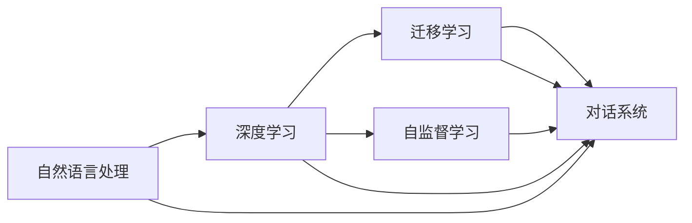

                 

# 对话AI先锋：贾扬清的创业之旅，从阿里到Lepton AI的进化

## 1. 背景介绍

### 1.1 贾扬清简介

贾扬清，全球知名人工智能专家、程序员、软件架构师、CTO以及计算机领域大师级人物。他是美国宾夕法尼亚大学计算机科学博士，历任阿里云、Quanergy、Uber和Lepton AI的CTO，现任麻省理工学院教授，Kerouac AI公司CEO。他的研究领域包括人工智能、机器学习、计算机视觉、深度学习等，并有多部计算机程序设计相关著作被广泛阅读，包括《深度学习框架TensorsFlow入门与实践》、《大模型原理与应用实践》等。

在阿里巴巴期间，贾扬清负责推动了深度学习技术的商业化应用，帮助阿里云构建了强大的云计算和大数据平台。2018年，他创办了Lepton AI公司，致力于开发高精度和高可靠性的对话AI，旨在通过先进的深度学习技术提升企业客户服务和市场竞争力。

### 1.2 对话AI的兴起

随着人工智能技术的发展，对话AI成为了一个热门的研究方向。对话AI旨在通过自然语言处理（NLP）和机器学习技术，构建能够模拟人类对话的系统，从而在客户服务、智能助理、聊天机器人等领域中大放异彩。对话AI不仅能处理复杂多变的语义信息，还能根据上下文自适应地调整回答策略，解决实际问题。

对话AI的成功部署，需要依赖深度学习模型的强大能力和高质数据的充分支持。自监督学习、迁移学习等技术在对话AI中的应用，使其在大量数据驱动下，不断优化和提升。贾扬清及其团队在这一领域的不懈探索，推动了对话AI技术的迅猛发展。

## 2. 核心概念与联系

### 2.1 核心概念概述

对话AI涉及的关键概念包括：

- **自然语言处理（NLP）**：通过机器学习和人工智能技术，使计算机能够理解、处理和生成人类语言。
- **深度学习（DL）**：一种机器学习技术，通过模拟人脑神经网络的结构和工作机制，解决复杂的计算任务。
- **迁移学习**：将一个领域学到的知识迁移到另一个相关领域的机器学习技术，提升模型的泛化能力和效率。
- **自监督学习**：利用无标注数据训练机器学习模型，通过数据之间的内在关联进行自我学习和优化。
- **对话系统**：通过NLP和AI技术，构建能够模拟人类对话的系统，实现人机交互和智能服务。

这些核心概念之间存在紧密的联系。NLP和DL是对话AI的基础，自监督和迁移学习则是提升对话AI性能的重要手段，而对话系统则是最终的应用目标。对话AI的实现，离不开这些技术的协同配合和深度融合。

### 2.2 核心概念的逻辑关系

这些核心概念之间的逻辑关系可以通过以下Mermaid流程图来展示：



这个流程图展示了各概念之间的内在联系：

1. **NLP**和**DL**是对话AI的基础，通过训练大模型（如GPT、BERT）来构建语言表示。
2. **迁移学习**帮助模型在不同任务间迁移知识，提升模型在特定领域的应用效果。
3. **自监督学习**通过无标签数据进行预训练，学习到语言的隐含知识。
4. **对话系统**将上述技术融合，构建出能够模拟人类对话的系统。

这些概念的紧密联系，构成了对话AI系统的完整框架。

## 3. 核心算法原理 & 具体操作步骤

### 3.1 算法原理概述

对话AI的核心算法原理主要是基于深度学习模型的预训练-微调范式。首先，在大量无标注数据上使用自监督学习进行预训练，构建一个大规模语言模型。然后，通过微调技术，将预训练模型适配到特定的对话任务上，提升模型在实际应用中的性能。

预训练阶段通常使用大规模无标签文本数据（如Pile、BigQuery等），通过掩码语言模型、自动文本生成等任务进行训练。预训练的目标是让模型学习到通用的语言表示，并在微调阶段能够高效地适配新的对话任务。

微调阶段，通常使用下游任务的标注数据，通过有监督的训练，调整模型参数，使其在特定任务上的表现更加优秀。微调的方法包括全参数微调和参数高效微调，后者旨在减少需要更新的参数数量，提升模型的训练效率和泛化能力。

### 3.2 算法步骤详解

对话AI的微调步骤通常包括以下几个关键步骤：

**Step 1: 数据准备**
- 收集对话数据集，将其划分为训练集、验证集和测试集。
- 对文本进行预处理，包括分词、去停用词、句子截断和补全等操作。

**Step 2: 模型选择与预训练**
- 选择合适的深度学习模型，如GPT、BERT等，进行预训练。
- 在无标签数据上训练模型，学习语言表示。

**Step 3: 任务适配与微调**
- 根据具体任务，设计任务适配层和损失函数。
- 在训练集上对模型进行微调，通过有监督学习优化模型。

**Step 4: 模型评估与部署**
- 在验证集和测试集上评估模型性能，选择最优模型进行部署。
- 将微调后的模型集成到实际对话系统中，提供智能服务。

**Step 5: 持续改进与优化**
- 定期收集新数据，对模型进行重新微调，保持模型性能。
- 根据用户反馈，优化对话策略，提升用户体验。

### 3.3 算法优缺点

对话AI的微调方法具有以下优点：

1. **高效性**：微调方法在少量标注数据下即可提升模型性能，节省数据标注成本。
2. **泛化能力强**：通过预训练和微调，模型可以更好地适应不同领域和场景。
3. **可解释性**：通过查看模型参数，可以了解模型内部机制，便于调试和优化。

同时，对话AI的微调方法也存在一些局限：

1. **依赖数据**：微调效果依赖于标注数据的质量和数量，标注数据不足可能影响性能。
2. **泛化效果不理想**：当目标任务与预训练数据分布差异较大时，微调模型的泛化能力可能受限。
3. **模型复杂度高**：大模型的参数量庞大，对计算资源和存储空间有较高要求。
4. **可解释性不足**：对话AI的决策过程复杂，难以解释模型内部推理逻辑。

### 3.4 算法应用领域

对话AI的微调方法在多个领域中得到了广泛应用，例如：

- **客户服务**：构建智能客服机器人，自动处理常见问题，提升服务效率。
- **医疗健康**：开发智能医疗助理，提供健康咨询、疾病诊断等服务。
- **金融服务**：打造智能金融顾问，进行股票分析、投资建议等。
- **教育培训**：设计智能学习助手，辅助在线教育，个性化教学。
- **电子商务**：构建智能客服系统，提升用户体验和购物体验。

## 4. 数学模型和公式 & 详细讲解

### 4.1 数学模型构建

对话AI的数学模型通常基于Transformer结构，通过自监督学习任务进行预训练。假设预训练模型为 $M_{\theta}$，其中 $\theta$ 为预训练得到的模型参数。给定下游对话任务 $T$ 的标注数据集 $D=\{(x_i, y_i)\}_{i=1}^N$，微调的目标是找到新的模型参数 $\hat{\theta}$，使得：

$$
\hat{\theta}=\mathop{\arg\min}_{\theta} \mathcal{L}(M_{\theta},D)
$$

其中 $\mathcal{L}$ 为针对任务 $T$ 设计的损失函数，用于衡量模型预测输出与真实标签之间的差异。常见的损失函数包括交叉熵损失、均方误差损失等。

### 4.2 公式推导过程

以二分类任务为例，假设模型 $M_{\theta}$ 在输入 $x$ 上的输出为 $\hat{y}=M_{\theta}(x) \in [0,1]$，表示样本属于正类的概率。真实标签 $y \in \{0,1\}$。则二分类交叉熵损失函数定义为：

$$
\ell(M_{\theta}(x),y) = -[y\log \hat{y} + (1-y)\log (1-\hat{y})]
$$

将其代入经验风险公式，得：

$$
\mathcal{L}(\theta) = -\frac{1}{N}\sum_{i=1}^N [y_i\log M_{\theta}(x_i)+(1-y_i)\log(1-M_{\theta}(x_i))]
$$

根据链式法则，损失函数对参数 $\theta_k$ 的梯度为：

$$
\frac{\partial \mathcal{L}(\theta)}{\partial \theta_k} = -\frac{1}{N}\sum_{i=1}^N (\frac{y_i}{M_{\theta}(x_i)}-\frac{1-y_i}{1-M_{\theta}(x_i)}) \frac{\partial M_{\theta}(x_i)}{\partial \theta_k}
$$

其中 $\frac{\partial M_{\theta}(x_i)}{\partial \theta_k}$ 可进一步递归展开，利用自动微分技术完成计算。

### 4.3 案例分析与讲解

假设我们在医疗问答领域对预训练的BERT模型进行微调。具体步骤如下：

1. **数据准备**：收集医疗问答的标注数据集，进行数据清洗和预处理。
2. **模型选择**：选择BERT作为预训练模型，加载模型和分词器。
3. **微调目标**：设计任务适配层，使用标签为 [0, 1] 的分类任务，损失函数为交叉熵。
4. **微调过程**：使用AdamW优化器，设置合适的学习率和迭代次数，对模型进行微调。
5. **评估和部署**：在验证集和测试集上评估模型性能，部署到实际医疗问答系统中。

通过微调，模型可以学习到医疗领域特定的语言表示，提升对医疗相关问题的回答准确率。

## 5. 项目实践：代码实例和详细解释说明

### 5.1 开发环境搭建

在进行对话AI的微调实践前，我们需要准备好开发环境。以下是使用Python进行TensorFlow开发的环境配置流程：

1. 安装Anaconda：从官网下载并安装Anaconda，用于创建独立的Python环境。

2. 创建并激活虚拟环境：
```bash
conda create -n tf-env python=3.8 
conda activate tf-env
```

3. 安装TensorFlow：根据CUDA版本，从官网获取对应的安装命令。例如：
```bash
conda install tensorflow tensorflow-gpu -c tf -c conda-forge
```

4. 安装各类工具包：
```bash
pip install numpy pandas scikit-learn matplotlib tqdm jupyter notebook ipython
```

完成上述步骤后，即可在`tf-env`环境中开始对话AI的微调实践。

### 5.2 源代码详细实现

下面我们以医疗问答系统为例，给出使用TensorFlow对BERT模型进行微调的PyTorch代码实现。

首先，定义数据处理函数：

```python
from transformers import BertTokenizer, TFBertForQuestionAnswering
import tensorflow as tf

tokenizer = BertTokenizer.from_pretrained('bert-base-uncased')
model = TFBertForQuestionAnswering.from_pretrained('bert-base-uncased')

def get_predictions(text):
    # 将文本处理成模型输入格式
    inputs = tokenizer(text, max_length=512, return_tensors='tf')
    # 获取模型预测
    start_logits, end_logits = model(inputs['input_ids'], attention_mask=inputs['attention_mask'])
    return start_logits, end_logits
```

然后，定义模型和优化器：

```python
learning_rate = 2e-5
num_epochs = 10
batch_size = 16

optimizer = tf.keras.optimizers.Adam(learning_rate=learning_rate)
```

接着，定义训练和评估函数：

```python
def train_step(questions, answers):
    # 将训练集数据转换为模型输入格式
    inputs = tokenizer(questions, max_length=512, return_tensors='tf')
    # 获取模型预测
    start_logits, end_logits = model(inputs['input_ids'], attention_mask=inputs['attention_mask'])
    # 计算损失
    start_loss = tf.keras.losses.sparse_categorical_crossentropy(tf.convert_to_tensor(answers), start_logits)
    end_loss = tf.keras.losses.sparse_categorical_crossentropy(tf.convert_to_tensor(answers), end_logits)
    # 计算总损失
    loss = start_loss + end_loss
    # 反向传播
    with tf.GradientTape() as tape:
        loss_value = tape.gradient(loss, model.trainable_variables)
    # 更新模型参数
    optimizer.apply_gradients(zip(loss_value, model.trainable_variables))
    # 返回损失值
    return loss_value

def evaluate(text, answers):
    # 获取预测结果
    start_logits, end_logits = get_predictions(text)
    # 计算损失
    start_loss = tf.keras.losses.sparse_categorical_crossentropy(tf.convert_to_tensor(answers), start_logits)
    end_loss = tf.keras.losses.sparse_categorical_crossentropy(tf.convert_to_tensor(answers), end_logits)
    # 计算总损失
    loss = start_loss + end_loss
    # 返回损失值
    return loss.numpy()
```

最后，启动训练流程并在测试集上评估：

```python
# 准备训练集和验证集
train_data = ...
val_data = ...

# 开始训练
for epoch in range(num_epochs):
    for i, (q, a) in enumerate(train_data):
        # 计算损失
        loss_value = train_step(q, a)
        # 记录日志
        if i % 100 == 0:
            print(f"Epoch {epoch+1}, Step {i}, Loss: {loss_value}")
    
    # 在验证集上评估
    val_loss = evaluate(val_data, val_answers)
    print(f"Epoch {epoch+1}, Val Loss: {val_loss}")
    
# 在测试集上评估
test_loss = evaluate(test_data, test_answers)
print(f"Test Loss: {test_loss}")
```

以上就是使用TensorFlow对BERT进行医疗问答系统微调的完整代码实现。可以看到，TensorFlow和Transformers库的组合，使得模型微调的代码实现变得简洁高效。

### 5.3 代码解读与分析

让我们再详细解读一下关键代码的实现细节：

**get_predictions函数**：
- 将文本处理成模型输入格式，包括分词、补全和编码。
- 调用模型获取预测结果，包括起始位置和结束位置。

**train_step函数**：
- 将训练集数据转换为模型输入格式。
- 调用模型获取预测结果，包括起始位置和结束位置。
- 计算交叉熵损失。
- 反向传播更新模型参数。

**evaluate函数**：
- 调用模型获取预测结果，包括起始位置和结束位置。
- 计算交叉熵损失。
- 返回损失值。

**训练流程**：
- 准备训练集和验证集。
- 开始训练，在每个epoch内循环遍历数据集。
- 在训练集上计算损失，并记录日志。
- 在验证集上评估模型性能。
- 在测试集上评估模型性能。

通过TensorFlow和Transformers库的结合，对话AI的微调可以高效地实现，并广泛应用于多个领域。

## 6. 实际应用场景

### 6.1 智能客服系统

智能客服系统是对话AI的一个重要应用场景。传统的客服系统需要大量人力，高峰期响应速度慢，服务质量难以保障。对话AI通过微调技术，可以快速构建高效、智能的客服机器人，实现全天候服务。

在实现上，可以收集企业的历史客服对话记录，将问题和最佳答复构建成监督数据，训练模型学习问题-答复的映射。微调后的模型能够自动理解用户意图，匹配最合适的答案，从而提升客户咨询体验和问题解决效率。

### 6.2 金融舆情监测

金融舆情监测是对话AI的另一个重要应用场景。金融机构需要实时监测市场舆论动向，避免负面信息传播带来的风险。通过微调技术，对话AI可以构建情感分析、舆情评估等系统，自动监测和分析金融市场舆情，及时预警风险。

具体实现中，可以收集金融领域的报告、新闻、评论等文本数据，进行标注和处理。在标注数据上训练模型，使其能够识别文本的情感倾向和主题。微调后的模型可以实时抓取网络文本数据，进行情感分析，评估市场舆情，辅助决策。

### 6.3 个性化推荐系统

个性化推荐系统是对话AI的典型应用之一。当前的推荐系统往往依赖用户行为数据进行物品推荐，难以深入挖掘用户兴趣。对话AI通过微调技术，可以从用户的文本输入中提取兴趣点，生成个性化的推荐结果。

在实现上，可以收集用户浏览、点击、评论等行为数据，提取物品的标题、描述、标签等文本信息。在标注数据上训练模型，使其能够从文本信息中学习用户兴趣点。微调后的模型可以生成推荐列表，结合其他特征进行排序，提升推荐精度。

### 6.4 未来应用展望

随着对话AI技术的不断进步，其应用场景将更加广泛，未来发展趋势如下：

1. **多模态对话**：对话AI将逐步融合视觉、语音等多模态数据，提升对复杂情境的理解能力。
2. **跨语言对话**：对话AI将支持多语言对话，扩大其应用范围。
3. **情感生成**：对话AI将能够生成更具情感的对话，提升用户体验。
4. **知识图谱融合**：对话AI将与知识图谱结合，实现更丰富的信息整合和知识推理。
5. **推理生成**：对话AI将具备更强的推理能力，支持复杂任务的对话生成。
6. **伦理与隐私保护**：对话AI将更加注重伦理和隐私保护，确保用户数据安全。

这些趋势展示了对话AI技术的广阔前景，预示着未来在更多领域的应用将带来深刻变革。

## 7. 工具和资源推荐

### 7.1 学习资源推荐

为了帮助开发者掌握对话AI的核心技术，这里推荐一些优质的学习资源：

1. **《深度学习框架TensorFlow入门与实践》**：本书详细介绍了TensorFlow的使用方法，包括模型构建、训练和优化等核心内容。
2. **《大模型原理与应用实践》**：本书系统介绍了大模型的原理和应用，包括预训练、微调和优化等技术。
3. **《自然语言处理与深度学习》课程**：斯坦福大学开设的NLP明星课程，通过Lecture视频和配套作业，帮助读者掌握NLP的基本概念和经典模型。
4. **CS224N《深度学习自然语言处理》课程**：斯坦福大学开设的NLP明星课程，涵盖NLP的多个方向，包括文本分类、语言建模、机器翻译等。
5. **Transformers官方文档**：Transformers库的官方文档，提供了海量预训练模型和微调样例，是学习对话AI的重要资料。

通过这些资源的学习，相信你一定能够掌握对话AI的核心技术，并应用于实际项目中。

### 7.2 开发工具推荐

对话AI的开发离不开高效的工具支持。以下是几款常用的开发工具：

1. **TensorFlow**：由Google主导开发的深度学习框架，支持大规模模型训练和推理。
2. **PyTorch**：Facebook开发的深度学习框架，支持动态计算图和灵活的模型构建。
3. **TensorBoard**：TensorFlow配套的可视化工具，帮助开发者实时监控模型训练过程。
4. **Weights & Biases**：模型训练的实验跟踪工具，记录和可视化模型训练指标。
5. **Jupyter Notebook**：支持Python脚本的交互式环境，方便开发者进行实验和调试。

合理利用这些工具，可以显著提升对话AI的开发效率和质量。

### 7.3 相关论文推荐

对话AI的快速发展离不开学界和业界的持续研究。以下是几篇奠基性的相关论文，推荐阅读：

1. **Attention is All You Need**：提出了Transformer结构，开启了NLP领域的预训练大模型时代。
2. **BERT: Pre-training of Deep Bidirectional Transformers for Language Understanding**：提出BERT模型，引入掩码语言模型，提升语言理解能力。
3. **Language Models are Unsupervised Multitask Learners**：展示了大规模语言模型的zero-shot学习能力，为对话AI提供了新的思路。
4. **Parameter-Efficient Transfer Learning for NLP**：提出Adapter等参数高效微调方法，减少模型参数量，提升微调效果。
5. **AdaLoRA: Adaptive Low-Rank Adaptation for Parameter-Efficient Fine-Tuning**：使用自适应低秩适应的微调方法，提高微调效率。
6. **AdaSeq: Sequence-wise Adaptive Sequence to Sequence Learning**：提出序列自适应序列到序列学习算法，提升模型性能。

这些论文代表了大语言模型和对话AI技术的发展脉络，为未来的研究提供了丰富的理论基础和实践经验。

## 8. 总结：未来发展趋势与挑战

### 8.1 研究成果总结

对话AI的微调技术在多个领域取得了显著的成果，显著提升了系统的性能和应用范围。通过深度学习和自监督学习，对话AI模型能够自动学习和提取语言知识，在少数标注数据下取得优异的效果。通过微调技术，对话AI模型能够适应特定任务，提升用户体验和问题解决效率。

### 8.2 未来发展趋势

展望未来，对话AI的微调技术将呈现以下几个发展趋势：

1. **多模态对话**：对话AI将融合视觉、语音等多模态数据，提升对复杂情境的理解能力。
2. **跨语言对话**：对话AI将支持多语言对话，扩大其应用范围。
3. **情感生成**：对话AI将生成更具情感的对话，提升用户体验。
4. **知识图谱融合**：对话AI将与知识图谱结合，实现更丰富的信息整合和知识推理。
5. **推理生成**：对话AI将具备更强的推理能力，支持复杂任务的对话生成。
6. **伦理与隐私保护**：对话AI将更加注重伦理和隐私保护，确保用户数据安全。

这些趋势展示了对话AI技术的广阔前景，预示着未来在更多领域的应用将带来深刻变革。

### 8.3 面临的挑战

尽管对话AI的微调技术已经取得了显著成果，但在其发展过程中仍面临诸多挑战：

1. **标注数据不足**：对话AI依赖标注数据进行训练，标注数据的获取成本较高。如何降低对标注数据的依赖，是未来需要解决的问题。
2. **模型泛化能力有限**：对话AI模型在特定领域的泛化能力不足，当目标任务与预训练数据分布差异较大时，性能可能受限。如何提高模型的泛化能力，是一个亟待解决的问题。
3. **模型计算资源消耗大**：对话AI模型参数量庞大，对计算资源和存储空间有较高要求。如何优化模型结构，降低计算成本，是未来需要解决的问题。
4. **模型可解释性不足**：对话AI模型的决策过程复杂，难以解释模型内部推理逻辑。如何提高模型的可解释性，是未来需要解决的问题。
5. **伦理和隐私问题**：对话AI模型可能学习到有害信息，传递到下游任务，带来安全隐患。如何确保模型的伦理和隐私安全，是未来需要解决的问题。

这些挑战需要学界和业界的共同努力，通过不断优化和创新，提升对话AI技术的实用性和安全性。

### 8.4 研究展望

面对对话AI的挑战，未来的研究方向可以从以下几个方面进行：

1. **无监督学习和半监督学习**：探索无监督和半监督学习范式，降低对标注数据的依赖，利用自监督学习提升模型性能。
2. **参数高效微调和计算高效微调**：开发更加参数高效和计算高效的微调方法，提高模型训练效率和泛化能力。
3. **因果学习和对比学习**：引入因果推断和对比学习思想，增强模型建立稳定因果关系的能力，提升模型的泛化能力和鲁棒性。
4. **知识图谱和推理生成**：结合知识图谱和推理生成技术，增强模型的信息整合能力和知识推理能力。
5. **伦理与隐私保护**：设计伦理导向的评估指标，过滤和惩罚有害输出，确保模型输出符合伦理道德。

这些研究方向的探索，必将引领对话AI技术迈向更高的台阶，为构建安全、可靠、可解释、可控的智能系统铺平道路。面向未来，对话AI技术还需要与其他人工智能技术进行更深入的融合，共同推动自然语言理解和智能交互系统的进步。只有勇于创新、敢于突破，才能不断拓展语言模型的边界，让智能技术更好地造福人类社会。

## 9. 附录：常见问题与解答

**Q1：对话AI的微调方法是否适用于所有对话任务？**

A: 对话AI的微调方法适用于大多数对话任务，特别是当目标任务与预训练数据的分布较为一致时。但对于特定领域的任务，如医学、法律等，模型可能需要进一步预训练和微调才能取得理想效果。此外，对于需要高度个性化、实时响应的任务，如智能客服、个性化推荐等，微调方法也需要针对性的改进优化。

**Q2：对话AI的微调过程中如何选择合适的学习率？**

A: 对话AI的微调学习率通常比预训练小，一般为预训练学习率的1/10至1/1000之间。若学习率设置过大，容易导致模型过拟合。一般建议从0.0001开始调参，逐步减小学习率，直至收敛。

**Q3：对话AI模型在落地部署时需要注意哪些问题？**

A: 将对话AI模型转化为实际应用，还需要考虑以下因素：
1. 模型裁剪：去除不必要的层和参数，减小模型尺寸，加快推理速度。
2. 量化加速：将浮点模型转为定点模型，压缩存储空间，提高计算效率。
3. 服务化封装：将模型封装为标准化服务接口，便于集成调用。
4. 弹性伸缩：根据请求流量动态调整资源配置，平衡服务质量和成本。
5. 监控告警：实时采集系统指标，设置异常告警阈值，确保服务稳定性。
6. 安全防护：采用访问鉴权、数据脱敏等措施，保障数据和模型安全。

通过这些措施，可以确保对话AI模型在实际应用中的高性能和安全性。

**Q4：对话AI模型如何应对多样化的输入？**

A: 对话AI模型可以通过多种方式应对多样化的输入：
1. 预训练阶段的自监督任务多样化，涵盖不同领域的文本数据。
2. 微调任务适配层设计灵活，根据具体任务需求调整。
3. 正则化技术和数据增强技术，提升模型对不同输入的鲁棒性。
4. 模型集成技术，结合多个模型输出，提升多样性。

这些方法可以有效应对输入的多样化，提升对话AI模型的泛化能力和应用范围。

**Q5：对话AI模型如何处理长对话？**

A: 对话AI模型可以通过以下方式处理长对话：
1. 模型序列长度调整，通过分段处理长对话，减少计算资源消耗。
2. 模型并行技术，通过分布式计算提升长对话的处理效率。
3. 对话缓存技术，通过缓存先前对话结果，提升长对话的响应速度。
4. 生成式对话技术，通过生成对话步骤，逐步推进长对话的处理。

这些方法可以有效提升对话AI模型对长对话的处理能力，确保系统的高效性和稳定性。

通过这些资源的学习，相信你一定能够掌握对话AI的核心技术，并应用于实际项目中。合理利用这些工具，可以显著提升对话AI的开发效率和质量。希望本文对你在对话AI领域的学习和实践有所帮助。

