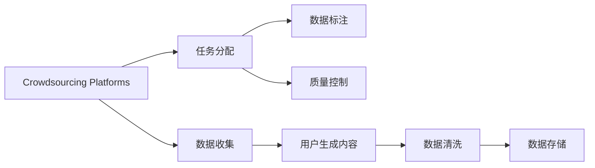

                 

# 对话数据收集策略：众包和在线论坛

> 关键词：对话数据收集，众包平台，在线论坛，用户生成内容，数据质量控制

## 1. 背景介绍

在人工智能的诸多应用场景中，对话数据收集扮演着举足轻重的角色。无论是智能客服系统、智能助手、对话式界面还是虚拟主播，优质的对话数据是构建高质量语言模型的关键。然而，对话数据的收集和整理是一项耗时耗力且昂贵的工作，传统的用户调查、客服录音等方式已无法满足大规模应用的需求。本文将介绍两种主要的对话数据收集策略：众包和在线论坛，并探讨其在智能对话系统中的实际应用。

## 2. 核心概念与联系

### 2.1 核心概念概述

为理解这些策略的精髓，我们先介绍几个核心概念：

- **众包平台（Crowdsourcing Platforms）**：在线平台将微小任务分发给全球成千上万的自由职业者（众包工作者）完成，目的是快速低成本地收集数据。
- **在线论坛（Online Forums）**：用户在论坛中发表和交流，生成大量自然语言对话数据。论坛数据主要来自用户自发生成，无需人工干预。
- **用户生成内容（User-Generated Content, UGC）**：用户通过网络平台主动生成并发布的内容，包括文本、图片、视频等形式。
- **数据质量控制（Data Quality Control）**：通过一定的机制确保收集到的数据准确、完整、一致，满足特定的应用需求。

这些概念之间具有紧密的联系，共同构成了对话数据收集的生态系统。

### 2.2 核心概念原理和架构的 Mermaid 流程图



该流程图展示了众包平台和在线论坛在对话数据收集中的基本流程：

1. **任务分配**：众包平台将小规模任务（如对话生成、问答等）分配给众包工作者。
2. **数据收集**：众包工作者完成指定任务，产生对话数据。
3. **数据标注**：根据任务需求，对收集到的对话数据进行标注，确保数据的正确性和一致性。
4. **质量控制**：对标注后的数据进行质量检查，确保数据符合预期标准。
5. **数据清洗**：对不符合要求的数据进行清洗和修正。
6. **数据存储**：将清洗后的数据存储到数据库或数据仓库中，供后续使用。

## 3. 核心算法原理 & 具体操作步骤

### 3.1 算法原理概述

对话数据收集的核心算法原理主要基于分布式计算和自然语言处理（NLP）技术。具体来说，通过将任务分解为可管理的小单元，并将其分配给多个工人，以实现大规模数据收集和处理。同时，通过NLP技术对对话数据进行预处理、标注和质量控制，确保数据的准确性和一致性。

### 3.2 算法步骤详解

#### 3.2.1 众包平台数据收集

1. **任务定义**：在众包平台上定义清晰的任务描述，确保每个工人都明白任务的目标和预期输出。
2. **任务分配**：根据工人的专业技能和可用时间，将任务动态分配给合适的工人。
3. **任务执行**：工人在指定的期限内完成任务，提交相应的输出结果。
4. **结果审核**：平台管理员对提交结果进行审核，筛选出高质量的数据。
5. **数据整合**：将合格的数据整合、存储，形成统一的数据集。

#### 3.2.2 在线论坛数据收集

1. **论坛选择**：选择活跃度高、用户参与度强的在线论坛作为数据来源。
2. **数据抓取**：使用爬虫技术从论坛中抓取用户发布的对话数据。
3. **数据筛选**：根据对话质量、主题相关性等标准筛选高质量数据。
4. **数据清洗**：去除无关信息、错误数据等，确保数据质量。
5. **数据标注**：人工或自动对数据进行标注，标注结果用于后续的模型训练。
6. **数据存储**：将清洗、标注后的数据存储到数据仓库中。

### 3.3 算法优缺点

#### 3.3.1 众包平台

**优点**：
- **高效性**：快速收集大量数据，可处理多样化的任务。
- **灵活性**：可以根据需求动态调整任务分配和资源配置。
- **低成本**：利用自由职业者的空闲时间，降低人力成本。

**缺点**：
- **数据质量不稳定**：数据质量依赖于工人技能和责任心，存在噪声数据和错误标注的风险。
- **成本波动**：工人的工作时间和效率不稳定，导致数据收集成本波动。
- **隐私风险**：可能涉及用户隐私问题，需严格控制用户信息的使用。

#### 3.3.2 在线论坛

**优点**：
- **真实性**：论坛对话更接近自然语言环境，反映真实用户行为。
- **多样性**：论坛用户背景多样，数据具有广泛代表性。
- **低成本**：不涉及人工干预，自动抓取数据，成本较低。

**缺点**：
- **数据噪音大**：论坛数据质量参差不齐，可能包含大量无意义、无关的信息。
- **标注困难**：部分论坛数据无标准答案或分类标签，标注难度大。
- **时效性差**：论坛数据更新较慢，不适合处理实时性要求高的应用。

### 3.4 算法应用领域

这两种数据收集策略广泛应用于以下领域：

- **智能客服**：通过众包平台和在线论坛收集客户与客服之间的对话数据，用于训练智能客服系统。
- **虚拟助手**：利用众包平台数据生成虚拟助手对话，提升用户体验。
- **情感分析**：从论坛数据中提取用户情感倾向，进行市场舆情监测。
- **知识图谱构建**：通过论坛数据发现用户生成的事实信息，构建领域知识图谱。
- **智能推荐**：收集论坛用户行为数据，训练推荐模型，为用户推荐个性化内容。

## 4. 数学模型和公式 & 详细讲解 & 举例说明

### 4.1 数学模型构建

假设众包平台收集的数据集为 $D_{\text{crowd}}=\{(x_i, y_i)\}_{i=1}^N$，其中 $x_i$ 是用户输入的对话，$y_i$ 是对应的系统输出或用户回复。在线论坛收集的数据集为 $D_{\text{forum}}=\{x_j\}_{j=1}^M$，其中 $x_j$ 是论坛用户发布的对话。

对于众包数据，我们引入标注者 $T$，标注结果 $y_i$ 由标注者根据对话内容标注。在线论坛数据不需要标注，直接由用户生成。

### 4.2 公式推导过程

假设标注者 $T$ 的标注结果为随机变量 $T_i$，众包平台数据的质量由标注结果的准确性 $P(T_i=y_i)$ 决定。对于论坛数据，设 $P(x_j)$ 表示论坛对话内容的真实性概率。

- **众包数据质量评估**：
  $$
  P(T_i=y_i) = \frac{\sum_{t=1}^n P(T_i=t|y_i=t) P(T_i=t)}{\sum_{t=1}^n P(T_i=t)}
  $$
  其中 $P(T_i=t|y_i=t)$ 为标注结果 $T_i=t$ 在 $y_i=t$ 下的条件概率，$n$ 为不同标注的总数。

- **论坛数据质量评估**：
  $$
  P(x_j) = \frac{\sum_{j=1}^M P(x_j|x_i)}{\sum_{j=1}^M P(x_j)}
  $$
  其中 $P(x_j|x_i)$ 为论坛对话内容 $x_j$ 在用户输入 $x_i$ 下的真实性概率。

### 4.3 案例分析与讲解

以智能客服为例，考虑以下对话数据收集场景：

**场景1**：众包平台上的客服对话数据

1. **任务描述**：给定用户问题，生成一个合适的回复。
2. **数据收集**：平台将问题随机分配给若干工人在限定时间内完成。
3. **数据标注**：工人的回复经过系统自动标注，并由管理员审核。
4. **数据清洗**：去除格式错误、不相关回复等。
5. **数据整合**：将清洗后的对话数据整合到统一的数据库中。

**场景2**：在线论坛上的用户对话数据

1. **论坛选择**：选择与智能客服相关的技术论坛。
2. **数据抓取**：使用爬虫抓取论坛上的对话记录。
3. **数据筛选**：根据对话主题和内容筛选出与客服相关的高质量对话。
4. **数据清洗**：去除无关对话、广告、噪声等。
5. **数据标注**（可选）：对筛选出的对话进行人工标注，以便后续模型训练。
6. **数据存储**：将清洗、标注后的对话数据存储到数据仓库中。

## 5. 项目实践：代码实例和详细解释说明

### 5.1 开发环境搭建

为了高效地进行对话数据收集，我们推荐使用以下工具和环境：

- **Python**：作为开发语言，Python的生态系统和库丰富，适合数据处理和机器学习任务。
- **AWS云平台**：提供强大的计算和存储资源，支持大规模数据处理。
- **Amazon Mechanical Turk**：众包平台，方便快速收集数据。
- **Scrapy**：Python爬虫框架，支持高效抓取在线论坛数据。

### 5.2 源代码详细实现

以下是一个使用Python和Scrapy框架从在线论坛抓取对话数据的示例：

```python
import scrapy
from scrapy.spiders import CrawlSpider, Rule
from scrapy.linkextractors import LinkExtractor
from pymongo import MongoClient

class ForumSpider(CrawlSpider):
    name = "forum_spider"
    start_urls = ['https://www.example.com/forum']

    rules = (
        Rule(LinkExtractor(allow=(r'/topic/\d+/',)), callback='parse_item', follow=True),
    )

    def parse_item(self, response):
        item = {}
        item['title'] = response.css('h2::text').extract_first()
        item['content'] = response.css('div.content::text').extract()
        item['url'] = response.url
        
        client = MongoClient('mongodb://localhost:27017/')
        db = client['forum_data']
        collection = db['topics']
        collection.insert_one(item)
```

### 5.3 代码解读与分析

1. **Spider定义**：使用Scrapy框架定义Spider，指定起始URL和规则。
2. **规则匹配**：使用LinkExtractor匹配特定URL，并定义回调函数parse_item来处理抓取的数据。
3. **数据提取**：在parse_item函数中，使用CSS选择器提取论坛帖子的标题、内容和URL，并将其存储到MongoDB数据库中。
4. **MongoDB存储**：使用MongoDB存储抓取的数据，便于后续的数据分析和处理。

### 5.4 运行结果展示

执行上述代码后，可以将论坛对话数据抓取并存储到MongoDB中，用于后续的数据分析和模型训练。

## 6. 实际应用场景

### 6.1 智能客服

智能客服系统的构建依赖于大量高质量的对话数据。通过众包平台和在线论坛收集客服对话数据，可以加速模型训练，提升客服系统的准确性和响应速度。

#### 6.1.1 众包平台

- **数据收集**：使用众包平台收集客服与用户之间的对话数据，涵盖常见问题和常见场景。
- **数据处理**：对收集到的数据进行标注和清洗，确保数据质量。
- **模型训练**：将清洗后的数据用于训练对话生成模型，如Seq2Seq模型、Transformer模型等。

#### 6.1.2 在线论坛

- **数据抓取**：从相关技术论坛抓取用户与客服的对话数据。
- **数据筛选**：筛选出质量高、相关性强的对话记录。
- **模型训练**：将筛选后的数据用于模型训练和优化，提升客服系统的互动质量。

### 6.2 虚拟助手

虚拟助手如智能音箱、智能手机助手等需要大量的对话数据来训练。通过众包平台和在线论坛收集对话数据，可以为虚拟助手提供更加真实、多样化的对话样本。

#### 6.2.1 众包平台

- **数据收集**：利用众包平台收集用户与虚拟助手之间的对话数据。
- **数据处理**：对收集到的数据进行标注和清洗，确保数据质量。
- **模型训练**：将清洗后的数据用于训练虚拟助手对话生成模型。

#### 6.2.2 在线论坛

- **数据抓取**：从相关技术论坛抓取虚拟助手对话数据。
- **数据筛选**：筛选出质量高、相关性强的对话记录。
- **模型训练**：将筛选后的数据用于模型训练和优化，提升虚拟助手的对话能力。

### 6.3 情感分析

情感分析是市场舆情监测的重要工具，通过收集论坛用户对话，可以分析用户对产品、服务的情感倾向。

#### 6.3.1 众包平台

- **数据收集**：使用众包平台收集论坛用户的情感评论数据。
- **数据标注**：对收集到的数据进行情感标注，如正面、负面、中性。
- **模型训练**：将标注后的数据用于训练情感分析模型，如LSTM、BERT等。

#### 6.3.2 在线论坛

- **数据抓取**：从相关技术论坛抓取用户评论数据。
- **数据筛选**：筛选出包含情感倾向的评论。
- **模型训练**：将筛选后的数据用于模型训练和优化，提升情感分析的准确性。

## 7. 工具和资源推荐

### 7.1 学习资源推荐

为了深入理解对话数据收集策略，以下是一些推荐的资源：

- **《Python网络爬虫开发实战》**：介绍如何使用Python和Scrapy框架进行网络数据抓取。
- **《Crowdsourcing: A peasant's perspective》**：介绍了众包平台的运作机制和最佳实践。
- **《Human Computation: Collective Intelligence in the Service of Science》**：探讨了在线论坛在科学研究中的作用和潜力。
- **《Natural Language Processing with Python》**：使用Python进行自然语言处理任务的教程。
- **Kaggle竞赛**：提供丰富的数据集和竞赛题目，实践数据收集和处理技能。

### 7.2 开发工具推荐

- **Python**：作为主要开发语言，Python具有丰富的第三方库和框架。
- **AWS云平台**：提供强大的计算和存储资源，支持大规模数据处理。
- **Amazon Mechanical Turk**：众包平台，方便快速收集数据。
- **Scrapy**：Python爬虫框架，支持高效抓取在线论坛数据。
- **MongoDB**：NoSQL数据库，适合存储和查询大规模数据。

### 7.3 相关论文推荐

为了深入理解对话数据收集策略的最新研究进展，以下是一些推荐的论文：

- **《Crowdsourcing Mechanism Design: Theory and Applications》**：探讨了众包平台的机制设计问题。
- **《A Survey on Data Collection for Online Forums》**：综述了在线论坛数据收集的研究现状和技术挑战。
- **《User-Generated Content for Understanding and Enhancing the Quality of Online Product Reviews》**：探讨了用户生成内容在产品评论质量提升中的应用。
- **《A Survey on Data Collection and Labeling from the Crowd》**：综述了众包数据收集和标注的技术和方法。

## 8. 总结：未来发展趋势与挑战

### 8.1 研究成果总结

对话数据收集策略在智能对话系统中的应用已经取得了显著进展，众包平台和在线论坛成为了获取大规模对话数据的重要手段。这些策略不仅提升了对话数据的质量和多样性，也推动了智能对话系统的快速发展。

### 8.2 未来发展趋势

未来的对话数据收集将呈现以下几个趋势：

1. **自动化数据标注**：结合NLP技术和人工智能，自动标注论坛数据，减少人工标注的负担。
2. **跨平台数据融合**：利用众包平台和在线论坛数据，结合社交媒体、博客等平台，获取更全面的对话数据。
3. **实时数据收集**：通过流式数据处理技术，实时收集论坛和社交媒体上的对话数据，满足实时性需求。
4. **多语言数据收集**：收集多语言论坛数据，支持跨语言对话系统的构建。
5. **数据隐私保护**：采用数据匿名化、去标识化等技术，保护用户隐私。

### 8.3 面临的挑战

尽管对话数据收集策略在实践中取得了显著成效，但未来仍然面临以下挑战：

1. **数据隐私和安全**：大量对话数据涉及用户隐私，需严格保护数据安全。
2. **数据质量控制**：在线论坛数据质量参差不齐，需要自动化和人工结合的方式进行严格筛选和标注。
3. **数据分布不均衡**：不同论坛和平台的数据分布不均衡，需要设计合理的采样策略。
4. **用户参与度下降**：论坛用户活跃度下降可能导致数据收集效果降低。
5. **技术复杂度**：对话数据收集涉及多方面的技术，需要综合运用数据收集、处理、标注和分析技术。

### 8.4 研究展望

未来研究应着重解决上述挑战，推动对话数据收集策略的进一步发展。具体方向包括：

1. **自动化标注技术**：结合机器学习和深度学习技术，自动化标注论坛数据。
2. **跨平台数据采集**：利用多种数据来源，构建全面的对话数据集。
3. **实时数据处理**：采用流式数据处理技术，实现实时对话数据收集。
4. **多语言数据采集**：构建多语言对话数据集，支持全球范围的智能对话系统。
5. **数据隐私保护**：采用隐私保护技术，确保数据收集过程中的隐私安全。

## 9. 附录：常见问题与解答

**Q1: 如何选择合适的众包平台？**

A: 选择合适的众包平台需要考虑以下几个因素：
1. **任务类型**：选择与任务需求相匹配的众包平台。
2. **任务难度**：选择适合任务难度的平台，确保工人能够高效完成任务。
3. **平台信誉**：选择信誉好、评价高的平台，保证数据质量。
4. **成本效益**：比较不同平台的成本和效益，选择性价比最高的平台。

**Q2: 如何控制在线论坛的数据质量？**

A: 控制在线论坛数据质量主要通过以下几个步骤：
1. **论坛筛选**：选择活跃度高、用户参与度强的论坛。
2. **数据抓取**：使用爬虫抓取高质量对话数据。
3. **数据筛选**：根据对话质量、主题相关性等标准筛选高质量数据。
4. **数据清洗**：去除无关信息、错误数据等。
5. **人工审核**：对筛选后的数据进行人工审核，确保数据准确性。

**Q3: 如何保护用户隐私？**

A: 保护用户隐私主要通过以下几个措施：
1. **数据匿名化**：对数据进行去标识化处理，保护用户隐私。
2. **数据加密**：采用加密技术保护数据传输和存储安全。
3. **访问控制**：严格控制数据访问权限，防止数据泄露。
4. **隐私协议**：制定并遵守数据隐私协议，明确数据使用和保护范围。

**Q4: 如何处理多语言数据？**

A: 处理多语言数据需要考虑以下几个步骤：
1. **数据收集**：从多个语言论坛收集对话数据。
2. **数据清洗**：去除无关信息和噪声数据。
3. **数据标注**：对标注语言进行标注，确保数据质量。
4. **数据融合**：将不同语言的对话数据进行融合，构建统一的数据集。
5. **多语言模型**：使用多语言模型进行训练，提升跨语言对话系统的性能。

---

作者：禅与计算机程序设计艺术 / Zen and the Art of Computer Programming

