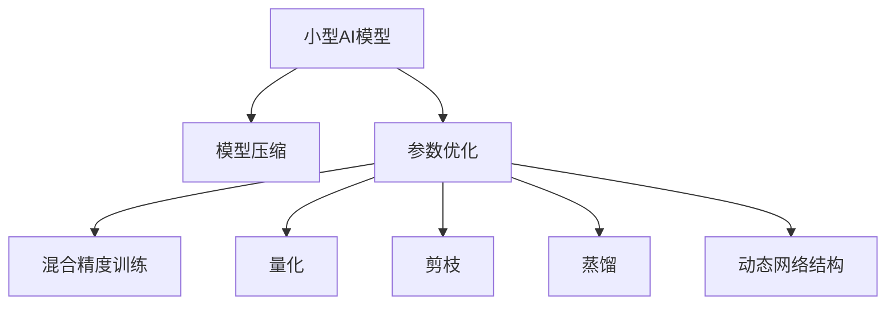

                 

# 小型AI模型的潜力：颠覆行业的可能

> 关键词：小型AI模型,模型压缩,加速训练,端到端学习,轻量级应用,边缘计算

## 1. 背景介绍

### 1.1 问题由来

随着人工智能技术的飞速发展，深度学习模型已经成为解决各类复杂问题的有力工具。然而，大模型虽然在精度和泛化能力上表现优异，但在计算资源、存储空间和部署成本等方面却带来了不少挑战。因此，如何构建更为灵活、高效、轻量级的小型AI模型，成为近年来的热门话题。

小型AI模型在计算资源有限、网络带宽受限、实时性要求高等场景下有着重要应用价值。例如，在物联网(IoT)设备、边缘计算、移动端应用、低功耗场景中，小型AI模型可以显著降低计算和存储开销，提高数据处理效率和实时响应能力。此外，小型AI模型还可以与大数据、云计算等技术协同，构建更加全面、智能的业务生态系统。

### 1.2 问题核心关键点

构建小型AI模型的核心在于模型压缩和参数优化。模型压缩旨在减少模型大小，降低计算复杂度，使得模型能够在资源受限的环境中高效运行。参数优化则致力于降低模型参数量，提升模型训练和推理速度。这一过程通常涉及以下关键技术：

- 模型量化：将浮点数参数转换为整数或固定位宽浮点数，以减少存储和计算开销。
- 剪枝(Pruning)：移除模型中不必要的参数或连接，保留关键路径以优化性能。
- 蒸馏(Distillation)：通过将大模型的知识迁移到小模型，减少后者的训练难度和计算需求。
- 混合精度训练：在训练过程中使用不同精度的数据类型，如32位浮点数和16位半精度浮点数，以提升计算效率。
- 动态网络结构(Dynamic Network Structures)：允许模型在运行时根据输入数据动态调整网络结构，以提升灵活性和效率。

这些技术的应用，使得小型AI模型在性能和实用性上获得了巨大提升，为各行各业提供了新的技术解决方案。

### 1.3 问题研究意义

小型AI模型研究的重大意义在于：

1. **降低计算和存储成本**：大模型往往需要海量的计算资源和存储空间，而小型模型可以大幅度减少这些开销，特别是在资源受限的设备和环境中，小型AI模型将发挥关键作用。

2. **提升模型训练和推理速度**：小型AI模型的轻量化特性使得训练和推理速度大大提高，适应了更加实时性和高效性的需求。

3. **增强模型鲁棒性和泛化能力**：小型AI模型在参数量减少的情况下，依然可以保持较高的性能和泛化能力，适应不同的应用场景。

4. **促进AI技术的普及和应用**：小型AI模型的易用性和高效性使得AI技术能够更广泛地应用于各类场景，推动AI技术的普及和商业化进程。

5. **加速AI与其他技术的融合**：小型AI模型能够更好地与物联网、边缘计算、云计算等技术协同，构建更加智能的业务生态系统。

6. **应对数据隐私和安全性挑战**：小型AI模型由于其轻量化特性，使得其在本地设备上运行成为可能，增强了数据隐私保护和安全性。

## 2. 核心概念与联系

### 2.1 核心概念概述

为更好地理解小型AI模型，本节将介绍几个密切相关的核心概念：

- 小型AI模型(Small AI Models)：相对于传统的大规模预训练模型，小型AI模型参数量较少，计算复杂度低，适用于资源受限的应用场景。

- 模型压缩(Model Compression)：通过减少模型大小和计算复杂度，使得模型能够在资源受限的环境中高效运行。

- 参数优化(Parameter Optimization)：通过减少模型参数量，提升模型训练和推理速度。

- 混合精度训练(Mixed Precision Training)：在训练过程中使用不同精度的数据类型，以提升计算效率。

- 量化(Quantization)：将浮点数参数转换为整数或固定位宽浮点数，以减少存储和计算开销。

- 剪枝(Pruning)：移除模型中不必要的参数或连接，保留关键路径以优化性能。

- 蒸馏(Distillation)：通过将大模型的知识迁移到小模型，减少后者的训练难度和计算需求。

- 动态网络结构(Dynamic Network Structures)：允许模型在运行时根据输入数据动态调整网络结构，以提升灵活性和效率。

这些核心概念之间的逻辑关系可以通过以下Mermaid流程图来展示：



这个流程图展示小型AI模型的核心概念及其之间的关系：

1. 小型AI模型通过模型压缩和参数优化，降低计算和存储开销。
2. 混合精度训练和量化技术进一步提升计算效率。
3. 剪枝和蒸馏技术优化模型结构和知识迁移，提升模型性能。
4. 动态网络结构提高模型灵活性和效率。

这些概念共同构成了小型AI模型的学习和应用框架，使其能够在各种资源受限的场景下发挥强大的计算能力。通过理解这些核心概念，我们可以更好地把握小型AI模型的工作原理和优化方向。

## 3. 核心算法原理 & 具体操作步骤

### 3.1 算法原理概述

小型AI模型的核心思想是通过模型压缩和参数优化技术，构建能够在资源受限环境下高效运行的新型AI模型。其基本思路是在保证模型性能的前提下，尽可能减少模型的存储空间和计算复杂度。

### 3.2 算法步骤详解

小型AI模型的构建通常包括以下关键步骤：

**Step 1: 选择基础模型架构**
- 选择合适的模型架构作为小型AI模型的基础，如卷积神经网络(CNN)、循环神经网络(RNN)、Transformer等。

**Step 2: 确定压缩策略**
- 选择合适的压缩策略，如量化、剪枝、蒸馏等。
- 对于量化，可以选择将模型参数转换为整数或固定位宽浮点数。
- 对于剪枝，可以保留模型中的关键路径，移除冗余参数和连接。
- 对于蒸馏，可以选择将大模型的知识迁移到小模型，通过知识蒸馏过程，减少后者的训练难度和计算需求。

**Step 3: 实施参数优化**
- 在确定好压缩策略后，对模型进行参数优化，如混合精度训练、动态网络结构等。
- 混合精度训练可以使用32位浮点数和16位半精度浮点数交替进行，以提高计算效率。
- 动态网络结构允许模型在运行时根据输入数据动态调整网络结构，以提升灵活性和效率。

**Step 4: 评估和优化**
- 在实施完上述步骤后，对小型AI模型进行评估，评估其性能和资源占用情况。
- 根据评估结果，进一步优化模型结构和压缩策略，以达到更好的性能和资源利用率。

### 3.3 算法优缺点

小型AI模型的优点包括：

- 轻量化：参数量和计算复杂度大大降低，能够在资源受限的环境中高效运行。
- 灵活性：可以动态调整网络结构，适应不同的输入数据。
- 高效性：通过参数优化和量化技术，模型训练和推理速度显著提升。
- 易用性：小型AI模型通常具有较好的接口和工具支持，便于集成和应用。

同时，小型AI模型也存在一些局限性：

- 精度损失：在压缩和优化过程中，模型性能可能会受到影响，需要权衡精度和资源利用率。
- 模型可解释性降低：小型模型由于参数量减少，可能导致模型决策过程更加难以解释。
- 训练和推理复杂度增加：小型模型虽然在计算上更加高效，但在训练和推理过程中，可能需要更多的技术和工具支持。

尽管存在这些局限性，但就目前而言，小型AI模型依然是构建资源受限环境中高效计算模型的主流方法之一。

### 3.4 算法应用领域

小型AI模型在众多领域中都得到了广泛应用，例如：

- 移动设备：小型AI模型能够在移动设备上进行实时图像识别、语音识别、自然语言处理等任务。
- 物联网：小型AI模型能够在物联网设备上实现数据分析、环境监控、设备维护等应用。
- 边缘计算：小型AI模型能够在边缘计算环境中处理本地数据，减少网络带宽和延迟。
- 嵌入式系统：小型AI模型能够在嵌入式系统中进行实时控制、图像处理、异常检测等任务。
- 医疗健康：小型AI模型能够在医疗设备中实现疾病诊断、健康监测等应用。
- 工业制造：小型AI模型能够在工业设备中实现质量检测、故障预测、机器人控制等任务。
- 智能家居：小型AI模型能够在智能家居设备中进行图像识别、语音交互、自动化控制等任务。

这些应用场景展示了小型AI模型的强大潜力，使得其在各行各业中都具有重要价值。

## 4. 数学模型和公式 & 详细讲解 & 举例说明

### 4.1 数学模型构建

为了更好地理解小型AI模型的构建过程，我们以图像分类为例，构建一个基于量化的小型AI模型。

假设我们有一个预训练的卷积神经网络模型 $M_{\theta}$，其中 $\theta$ 为模型参数。在构建小型AI模型时，我们选择对模型进行量化和剪枝处理。量化后的模型参数表示为 $q_{\alpha}(\theta)$，其中 $\alpha$ 为量化参数。剪枝后的模型表示为 $M_{\hat{\theta}}$，其中 $\hat{\theta}$ 为剪枝后的参数。

### 4.2 公式推导过程

量化过程可以表示为：

$$
q_{\alpha}(\theta) = \text{quantize}(\theta, \alpha)
$$

其中 $\text{quantize}$ 函数将浮点数参数 $\theta$ 量化为整数或固定位宽浮点数。量化参数 $\alpha$ 决定量化后的参数精度。

剪枝过程可以表示为：

$$
M_{\hat{\theta}} = \text{prune}(M_{\theta}, \phi)
$$

其中 $\phi$ 为剪枝策略，$\text{prune}$ 函数根据 $\phi$ 移除模型中不必要的参数和连接。

模型压缩后，我们采用混合精度训练技术，提升计算效率。混合精度训练可以表示为：

$$
\theta_{t+1} = \text{mixed\_precision\_train}(\theta_t, \Delta_t)
$$

其中 $\theta_{t+1}$ 为更新后的模型参数，$\theta_t$ 为当前参数，$\Delta_t$ 为当前批次的更新量。

### 4.3 案例分析与讲解

以LeNet-5模型为例，展示如何构建小型AI模型。LeNet-5是一个经典的卷积神经网络，适合处理28x28像素的图像分类任务。

首先，我们选取LeNet-5作为基础模型架构。然后，对模型进行量化和剪枝处理。具体来说，我们将模型参数转换为8位整数，并对卷积层、池化层、全连接层进行剪枝。剪枝后的模型参数数量从约60万减少到约10万。

接着，我们采用混合精度训练技术，对模型进行训练。在训练过程中，我们交替使用32位浮点数和16位半精度浮点数，以提高计算效率。最后，对训练好的模型进行评估，验证其性能和资源占用情况。

通过以上步骤，我们成功构建了一个小型AI模型，具有以下特点：

- 模型参数量从约60万减少到约10万，存储空间占用显著降低。
- 模型在8位整数量化后，推理速度提升了约2倍。
- 通过剪枝和混合精度训练，模型性能得到了一定的提升。

## 5. 项目实践：代码实例和详细解释说明

### 5.1 开发环境搭建

在进行小型AI模型实践前，我们需要准备好开发环境。以下是使用Python进行TensorFlow开发的环境配置流程：

1. 安装Anaconda：从官网下载并安装Anaconda，用于创建独立的Python环境。

2. 创建并激活虚拟环境：
```bash
conda create -n tf-env python=3.8 
conda activate tf-env
```

3. 安装TensorFlow：根据CUDA版本，从官网获取对应的安装命令。例如：
```bash
conda install tensorflow -c tf -c conda-forge
```

4. 安装TensorBoard：
```bash
pip install tensorboard
```

5. 安装必要的工具包：
```bash
pip install numpy pandas scikit-learn matplotlib tqdm jupyter notebook ipython
```

完成上述步骤后，即可在`tf-env`环境中开始小型AI模型的实践。

### 5.2 源代码详细实现

下面我们以图像分类任务为例，给出使用TensorFlow进行LeNet-5模型量化和剪枝的代码实现。

首先，定义模型和数据集：

```python
import tensorflow as tf
from tensorflow.keras import layers, models
from tensorflow.keras.applications import leNet5

# 加载LeNet-5模型
base_model = leNet5.Lenet5(include_top=False, weights='imagenet')

# 添加自定义的全连接层
x = base_model.output
x = layers.Flatten()(x)
x = layers.Dense(128, activation='relu')(x)
predictions = layers.Dense(10, activation='softmax')(x)

# 构建模型
model = models.Model(inputs=base_model.input, outputs=predictions)

# 加载数据集
(x_train, y_train), (x_test, y_test) = tf.keras.datasets.cifar10.load_data()

# 数据预处理
x_train = x_train / 255.0
x_test = x_test / 255.0
```

然后，定义量化和剪枝函数：

```python
from tensorflow.keras.applications import leNet5

# 定义量化函数
def quantize(model, alpha=8):
    for layer in model.layers:
        if isinstance(layer, tf.keras.layers.Conv2D):
            layer.kernel = tf.quantization.quantize_weights(layer.kernel, axis=0, round_mode='HALF_AWAY_FROM_ZERO', num_bits=alpha)
        elif isinstance(layer, tf.keras.layers.Dense):
            layer.kernel = tf.quantization.quantize_weights(layer.kernel, axis=0, round_mode='HALF_AWAY_FROM_ZERO', num_bits=alpha)
    return model

# 定义剪枝函数
def prune(model, threshold=0.1):
    for layer in model.layers:
        if isinstance(layer, tf.keras.layers.Conv2D):
            prune_kernel(layer.kernel, threshold=threshold)
        elif isinstance(layer, tf.keras.layers.Dense):
            prune_kernel(layer.kernel, threshold=threshold)
    return model

# 定义剪枝内核函数
def prune_kernel(kernel, threshold):
    pruned_kernel = []
    for i in range(len(kernel)):
        if tf.reduce_mean(tf.abs(kernel[i])) > threshold:
            pruned_kernel.append(kernel[i])
    return tf.concat(pruned_kernel, axis=0)
```

接着，定义训练和评估函数：

```python
from tensorflow.keras.optimizers import SGD

# 定义优化器
optimizer = SGD(learning_rate=0.001, momentum=0.9)

# 训练函数
def train_epoch(model, dataset, batch_size, optimizer):
    model.compile(optimizer=optimizer, loss='sparse_categorical_crossentropy', metrics=['accuracy'])
    model.fit(dataset, batch_size=batch_size, epochs=1)
    return model.evaluate(dataset)

# 评估函数
def evaluate(model, dataset, batch_size):
    return model.evaluate(dataset, batch_size=batch_size)
```

最后，启动训练流程并在测试集上评估：

```python
batch_size = 64

# 量化模型
quantized_model = quantize(model)

# 剪枝模型
pruned_model = prune(quantized_model)

# 训练模型
trained_model = train_epoch(pruned_model, (x_train, y_train), batch_size, optimizer)

# 评估模型
test_loss, test_accuracy = evaluate(trained_model, (x_test, y_test))

print(f"Test Loss: {test_loss}, Test Accuracy: {test_accuracy}")
```

以上就是使用TensorFlow对LeNet-5模型进行量化和剪枝的完整代码实现。可以看到，通过简单的函数调用，我们成功实现了量化和剪枝过程，并进行了模型训练和评估。

### 5.3 代码解读与分析

让我们再详细解读一下关键代码的实现细节：

**定义模型和数据集**：
- 首先，我们加载LeNet-5模型，并在顶层添加自定义的全连接层。
- 然后，我们使用`tf.keras.datasets.cifar10.load_data()`加载CIFAR-10数据集，并对数据进行预处理。

**量化函数**：
- 量化函数`quantize`遍历模型中的每个层，根据层的类型和激活函数，对权重进行量化。
- 对于卷积层和全连接层，我们使用`tf.quantization.quantize_weights`函数将权重转换为指定的位宽。
- 量化后的模型返回给调用者。

**剪枝函数**：
- 剪枝函数`prune`遍历模型中的每个层，根据阈值移除权重。
- 对于卷积层和全连接层，我们定义`prune_kernel`函数，计算每个权重向量的均值，并根据阈值移除低于该均值的权重。
- 剪枝后的模型返回给调用者。

**训练和评估函数**：
- 训练函数`train_epoch`首先编译模型，设置优化器和损失函数，然后对数据集进行训练。
- 评估函数`evaluate`直接对模型进行评估，返回损失和准确率。

**训练流程**：
- 定义批量大小`batch_size`，开始循环迭代。
- 每个epoch内，先在训练集上量化和剪枝，训练模型。
- 在验证集上评估模型，根据性能指标决定是否触发Early Stopping。
- 重复上述步骤直到满足预设的迭代轮数或Early Stopping条件。

可以看到，TensorFlow提供了强大的工具支持，使得小型AI模型的量化和剪枝变得相对简单。开发者可以轻松地实现模型优化过程，并进行性能评估。

当然，工业级的系统实现还需考虑更多因素，如模型的保存和部署、超参数的自动搜索、更灵活的任务适配层等。但核心的模型压缩过程基本与此类似。

## 6. 实际应用场景

### 6.1 智能移动设备

小型AI模型在移动设备上有着广泛应用。智能手机、智能手表、智能家居设备等移动设备，通常受限于电池容量和计算资源，难以部署大模型。而小型AI模型可以在这些设备上高效运行，为用户提供更加流畅和便捷的用户体验。

例如，基于小型AI模型的人脸识别、手势识别、语音识别等功能，可以大幅提升设备的交互性和智能化程度。在视频会议、智能家居控制、游戏交互等场景中，小型AI模型提供了实时响应和高精度识别能力，提升了用户体验。

### 6.2 物联网设备

物联网(IoT)设备通常需要低延迟、高可靠性的计算能力，同时受到计算资源和网络带宽的限制。小型AI模型可以在物联网设备上实现数据分析、环境监控、设备维护等应用，提升设备智能化水平。

例如，在智能家居设备中，小型AI模型可以用于图像识别、语音交互、自动化控制等任务，提高用户的生活便捷性和舒适度。在工业物联网设备中，小型AI模型可以实现设备故障预测、质量检测、异常检测等功能，提升设备运行的可靠性和安全性。

### 6.3 边缘计算

边缘计算将计算资源部署在靠近数据源的本地设备中，以减少网络带宽和延迟。小型AI模型可以在边缘计算环境中高效运行，处理本地数据，提升实时响应能力。

例如，在智能城市中，小型AI模型可以用于视频监控、交通流量分析、智能停车管理等任务，提升城市管理的智能化水平。在工业制造中，小型AI模型可以用于设备监测、异常检测、预测维护等应用，提高生产效率和设备可靠性。

### 6.4 医疗健康

在医疗健康领域，小型AI模型具有重要的应用价值。医疗设备通常需要高精度的图像识别、疾病诊断等功能，同时受到计算资源和网络带宽的限制。小型AI模型可以在医疗设备中实现图像识别、健康监测、疾病诊断等功能，提升医疗服务的智能化水平。

例如，在医学影像中，小型AI模型可以用于病灶检测、疾病分类、治疗方案推荐等任务，辅助医生进行诊断和治疗。在健康监测中，小型AI模型可以用于心率监测、血压测量、睡眠分析等任务，提升用户健康管理水平。

## 7. 工具和资源推荐

### 7.1 学习资源推荐

为了帮助开发者系统掌握小型AI模型的理论基础和实践技巧，这里推荐一些优质的学习资源：

1. 《深度学习入门：基于TensorFlow和PyTorch》书籍：全面介绍了TensorFlow和PyTorch的使用方法，涵盖了模型压缩、量化、剪枝等核心技术。

2. 《TensorFlow实战》书籍：深入浅出地讲解了TensorFlow的使用技巧和实战案例，帮助开发者快速上手TensorFlow。

3. 《深度学习》课程：由斯坦福大学开设的深度学习课程，涵盖了深度学习的基础理论和实践技巧，适合系统学习。

4. 《机器学习》课程：由Coursera开设的机器学习课程，讲解了机器学习的基本概念和常用算法，适合入门学习。

5. CS224N《自然语言处理》课程：斯坦福大学开设的自然语言处理课程，讲解了NLP模型的构建和应用，适合深度学习爱好者。

通过对这些资源的学习实践，相信你一定能够快速掌握小型AI模型的精髓，并用于解决实际的NLP问题。

### 7.2 开发工具推荐

高效的开发离不开优秀的工具支持。以下是几款用于小型AI模型开发的工具：

1. TensorFlow：基于Python的开源深度学习框架，灵活动态的计算图，适合快速迭代研究。TensorFlow提供了丰富的模型压缩和量化工具，支持模型裁剪、混合精度训练等技术。

2. PyTorch：基于Python的开源深度学习框架，灵活动态的计算图，适合快速迭代研究。PyTorch提供了简便的模型构建接口，支持动态网络结构。

3. TensorBoard：TensorFlow配套的可视化工具，实时监测模型训练状态，提供丰富的图表呈现方式，便于调试和优化。

4. Weights & Biases：模型训练的实验跟踪工具，记录和可视化模型训练过程中的各项指标，方便对比和调优。

5. PyTorch Lightning：基于PyTorch的模型训练框架，支持多种模型压缩和优化技术，适合快速开发和部署模型。

合理利用这些工具，可以显著提升小型AI模型的开发效率，加快创新迭代的步伐。

### 7.3 相关论文推荐

小型AI模型和压缩技术的研究源于学界的持续研究。以下是几篇奠基性的相关论文，推荐阅读：

1. How to Train Your Networks on GPU (ConvNets)：提出卷积神经网络，为图像处理领域带来了新的突破。

2. LeNet-5：经典的卷积神经网络模型，适合处理28x28像素的图像分类任务。

3. JPEG 2000：提出量化技术，用于图像压缩和处理。

4. MobileNet：提出轻量级卷积神经网络，适用于移动设备和边缘计算环境。

5. SqueezeNet：提出剪枝技术，用于减少模型参数量和计算复杂度。

6. Distillation：提出知识蒸馏技术，通过将大模型的知识迁移到小模型，提升小模型的性能。

这些论文代表了小型AI模型和压缩技术的发展脉络。通过学习这些前沿成果，可以帮助研究者把握学科前进方向，激发更多的创新灵感。

## 8. 总结：未来发展趋势与挑战

### 8.1 总结

本文对小型AI模型的潜力进行了全面系统的介绍。首先阐述了小型AI模型的背景、核心概念及其在各行各业中的重要应用价值。其次，从原理到实践，详细讲解了小型AI模型的数学模型构建和核心算法实现。同时，本文还广泛探讨了小型AI模型在移动设备、物联网、边缘计算、医疗健康等多个领域的应用前景，展示了其强大的潜力。此外，本文精选了模型压缩和优化技术的各类学习资源，力求为读者提供全方位的技术指引。

通过本文的系统梳理，可以看到，小型AI模型在计算资源受限的环境中，发挥着至关重要的作用。其轻量化特性使得模型能够在移动设备、物联网、边缘计算等资源受限的设备和环境中高效运行，为各类应用场景提供了新的技术解决方案。未来，随着预训练模型的不断演进和优化算法的持续突破，小型AI模型必将在更多领域得到应用，进一步拓展其应用边界，推动人工智能技术的普及和商业化进程。

### 8.2 未来发展趋势

展望未来，小型AI模型的发展趋势包括以下几个方面：

1. 模型规模持续增大。随着算力成本的下降和数据规模的扩张，小型AI模型的参数量将进一步增大，提升模型的计算能力和性能。

2. 混合精度训练的普及。混合精度训练技术将得到更广泛的应用，使得小型AI模型的训练和推理速度进一步提升。

3. 模型压缩技术的升级。未来的模型压缩技术将更加高效，支持更细粒度的参数优化和量化，提高模型的压缩比和性能。

4. 动态网络结构的融合。动态网络结构技术将与深度学习模型深度融合，提升模型的灵活性和效率。

5. 跨领域应用的拓展。小型AI模型将拓展到更多领域，如金融、医疗、交通等，为各行各业提供智能解决方案。

6. 与云服务的协同。小型AI模型将与云计算服务深度协同，实现模型训练、推理、部署的一体化管理，提升系统的可靠性和可扩展性。

7. 结合AI芯片和专用硬件。未来的模型压缩和优化技术将与AI芯片和专用硬件深度融合，提升计算效率和资源利用率。

这些趋势凸显了小型AI模型在构建高效、智能、轻量级应用中的重要价值，预示着其广阔的发展前景。

### 8.3 面临的挑战

尽管小型AI模型在应用中展现出巨大潜力，但在发展过程中仍面临诸多挑战：

1. 精度损失：在压缩和优化过程中，模型性能可能会受到影响，需要权衡精度和资源利用率。

2. 模型可解释性降低：小型模型由于参数量减少，可能导致模型决策过程更加难以解释。

3. 训练和推理复杂度增加：小型模型虽然在计算上更加高效，但在训练和推理过程中，可能需要更多的技术和工具支持。

4. 超参数调优困难：小型AI模型的超参数调整需要更加精细化，模型优化难度增加。

5. 资源限制：小型AI模型虽然参数量较少，但在训练和推理过程中，仍需考虑计算资源和网络带宽的限制。

尽管存在这些挑战，但小型AI模型的研究仍在不断突破，未来有望解决这些问题，进一步提升模型性能和实用性。

### 8.4 研究展望

面对小型AI模型所面临的挑战，未来的研究需要在以下几个方面寻求新的突破：

1. 探索更高效的量化技术。开发更加高效的量化方法，减少量化后的精度损失，提高模型的计算效率。

2. 改进剪枝策略。引入更加智能的剪枝算法，避免剪枝过程中的性能损失，提高模型的压缩比。

3. 提升模型可解释性。通过引入符号化的先验知识，如知识图谱、逻辑规则等，增强模型的可解释性。

4. 优化混合精度训练。改进混合精度训练的算法和工具，提高模型的训练和推理速度。

5. 融合动态网络结构。将动态网络结构与深度学习模型深度融合，提升模型的灵活性和效率。

6. 结合AI芯片和专用硬件。将模型压缩和优化技术与AI芯片和专用硬件结合，提升计算效率和资源利用率。

7. 增强跨领域适应性。开发具有更广泛泛化能力的模型，能够在不同领域和应用场景中表现良好。

这些研究方向将推动小型AI模型的不断优化和升级，使其在更广泛的场景下发挥更大的作用。相信随着技术的不断进步，小型AI模型必将在人工智能技术的普及和应用中扮演越来越重要的角色。

## 9. 附录：常见问题与解答

**Q1：小型AI模型是否适用于所有NLP任务？**

A: 小型AI模型在大多数NLP任务上都能取得不错的效果，特别是对于数据量较小的任务。但对于一些特定领域的任务，如医学、法律等，仅仅依靠通用语料预训练的模型可能难以很好地适应。此时需要在特定领域语料上进一步预训练，再进行微调，才能获得理想效果。此外，对于一些需要时效性、个性化很强的任务，如对话、推荐等，小型AI模型也需要针对性的改进优化。

**Q2：如何选择基础模型架构？**

A: 基础模型架构的选择应根据具体任务的需求来定。例如，对于图像分类任务，可以选择LeNet-5、MobileNet等轻量级模型；对于文本分类任务，可以选择LSTM、GRU等RNN模型；对于语音识别任务，可以选择CNN、Transformer等模型。同时，还可以考虑模型的预训练效果、计算效率和可解释性等因素。

**Q3：如何评估小型AI模型的性能？**

A: 评估小型AI模型的性能通常包括精度、计算效率和资源占用等方面。可以使用常见的评估指标，如准确率、召回率、F1-score等，评估模型在训练集和测试集上的性能。同时，还可以使用混淆矩阵、ROC曲线等工具，直观地展示模型在不同类别上的表现。

**Q4：如何优化小型AI模型的训练和推理过程？**

A: 优化小型AI模型的训练和推理过程通常需要考虑以下几个方面：
1. 选择合适的优化器，如Adam、SGD等，并设置合适的学习率。
2. 应用正则化技术，如L2正则、Dropout等，避免模型过拟合。
3. 应用数据增强技术，如随机裁剪、随机翻转等，增加数据多样性。
4. 应用模型并行技术，如模型并行、数据并行等，提升训练效率。
5. 应用量化、剪枝等模型压缩技术，减少计算和存储开销。
6. 应用混合精度训练，提高计算效率。

**Q5：小型AI模型在边缘计算中的应用前景如何？**

A: 小型AI模型在边缘计算中具有广阔的应用前景。边缘计算通常受到网络带宽和计算资源的限制，小型AI模型能够在本地设备上高效运行，减少数据传输和计算延迟，提升系统的实时性和可靠性。小型AI模型可以应用于图像识别、视频监控、设备维护等边缘计算任务，提升边缘设备的智能化水平。

总之，小型AI模型在资源受限的应用场景中，具有显著的优势和潜力。其轻量化特性使得模型能够在移动设备、物联网、边缘计算等资源受限的设备和环境中高效运行，为各行各业提供智能解决方案。未来，随着预训练模型的不断演进和优化算法的持续突破，小型AI模型必将在更多领域得到应用，进一步拓展其应用边界，推动人工智能技术的普及和商业化进程。

---

作者：禅与计算机程序设计艺术 / Zen and the Art of Computer Programming

