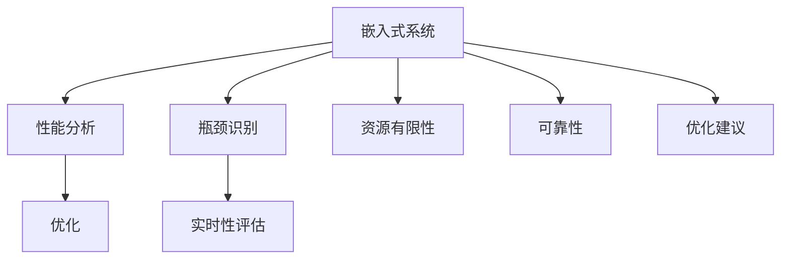
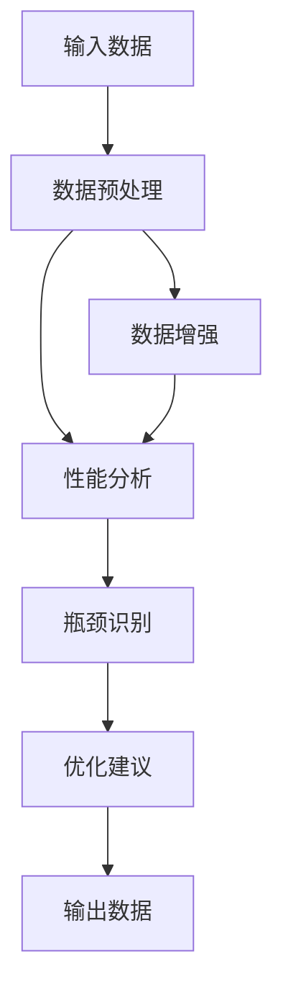

                 

# 嵌入式系统性能分析工具：识别和优化

## 1. 背景介绍

在现代科技不断发展的今天，嵌入式系统（Embedded Systems）已经成为了许多设备的核心，从智能手机到物联网设备，从汽车电子到工业控制，无处不在。这些系统具有高可靠性、低功耗、高效能等优点，但同时它们也面临着诸如性能瓶颈、资源有限、实时性要求高等挑战。为了确保这些系统的高效运行，性能分析工具成为了不可或缺的一部分。

嵌入式系统性能分析工具不仅能够帮助开发者识别系统中的性能瓶颈，还能提供优化建议，提升系统的整体性能。本文将深入探讨嵌入式系统性能分析工具的核心概念、原理、操作步骤，以及未来发展的趋势和面临的挑战。

## 2. 核心概念与联系

### 2.1 核心概念概述

嵌入式系统性能分析工具（Embedded System Performance Analysis Tools）主要用于对嵌入式系统进行性能评估、分析和优化。这些工具帮助开发者了解系统的性能瓶颈，识别瓶颈所在，并提供相应的优化建议，从而提高系统的整体性能。

核心概念包括：

- **嵌入式系统（Embedded System）**：一种专门为特定任务设计的硬件和软件系统，通常具有特定的功能，如控制、监视、通信等。
- **性能分析（Performance Analysis）**：评估和测量系统性能的过程，包括计算能力、响应时间、资源使用、功耗等方面。
- **优化（Optimization）**：通过调整系统设计或参数，提高系统性能的过程。
- **瓶颈（Bottleneck）**：系统性能提升的关键因素，通常是系统性能最差的部分。
- **实时性（Real-time）**：指系统在特定时间内完成任务的能力，对嵌入式系统尤为重要。
- **资源有限性（Resource Constraints）**：嵌入式系统的资源通常有限，如计算能力、内存、存储等。
- **可靠性（Reliability）**：系统稳定运行，不出现故障的能力。

这些概念之间的逻辑关系可以通过以下Mermaid流程图来展示：



这个流程图展示了嵌入式系统性能分析工具的核心逻辑：嵌入式系统通过性能分析识别瓶颈，通过优化提升性能，实时性评估和资源有限性考量确保系统的可靠性，优化建议则提供具体的改进方法。

### 2.2 核心概念原理和架构的 Mermaid 流程图



这个流程图展示了性能分析工具的基本流程：输入数据经过预处理，通过性能分析识别瓶颈，给出优化建议，并最终输出优化后的数据。数据增强模块负责增强数据多样性，提升性能分析的准确性。

## 3. 核心算法原理 & 具体操作步骤

### 3.1 算法原理概述

嵌入式系统性能分析工具主要通过以下算法原理进行性能分析：

1. **数据预处理（Data Preprocessing）**：对输入数据进行清洗、去噪、归一化等处理，以便于性能分析。
2. **性能分析（Performance Analysis）**：使用多种分析算法评估系统的计算能力、响应时间、资源使用、功耗等。
3. **瓶颈识别（Bottleneck Identification）**：通过统计分析、特征提取等方法识别系统中的瓶颈。
4. **优化建议（Optimization Suggestions）**：根据瓶颈识别结果，提出优化建议，如算法优化、资源调度、代码优化等。

### 3.2 算法步骤详解

以下是嵌入式系统性能分析工具的详细步骤：

1. **数据收集**：收集嵌入式系统的各种性能指标，如计算时间、内存使用、CPU占用率、功耗等。
2. **数据预处理**：对收集到的数据进行清洗、去噪、归一化等处理，确保数据的质量和一致性。
3. **性能分析**：使用多种算法对系统进行性能评估，如响应时间分析、资源利用率分析等。
4. **瓶颈识别**：通过统计分析、特征提取等方法识别系统中的瓶颈。
5. **优化建议**：根据瓶颈识别结果，提出具体的优化建议，如算法优化、资源调度、代码优化等。
6. **验证与调整**：对优化建议进行验证，不断调整优化方案，直到达到最佳性能。

### 3.3 算法优缺点

嵌入式系统性能分析工具的优势在于其能够帮助开发者快速识别系统中的性能瓶颈，并提供具体的优化建议，从而提升系统的整体性能。其主要缺点包括：

1. **依赖数据质量**：性能分析工具的准确性依赖于输入数据的质量，如果数据有噪声或误差，分析结果可能会不准确。
2. **资源占用**：性能分析工具需要大量的计算资源，可能会对系统性能产生一定的影响。
3. **复杂性高**：性能分析工具通常需要较高的技术水平和专业知识，普通开发者可能难以使用。

### 3.4 算法应用领域

嵌入式系统性能分析工具主要应用于以下领域：

1. **物联网（IoT）**：对物联网设备进行性能分析，优化网络通信、数据处理等。
2. **工业控制**：对工业控制设备进行性能分析，提升生产效率和设备可靠性。
3. **汽车电子**：对汽车电子系统进行性能分析，提升车辆性能和用户体验。
4. **医疗设备**：对医疗设备进行性能分析，提高医疗设备的安全性和可靠性。
5. **军事系统**：对军事系统进行性能分析，确保系统的实时性和可靠性。
6. **航空航天**：对航空航天系统进行性能分析，提升飞行安全性和效率。

## 4. 数学模型和公式 & 详细讲解 & 举例说明

### 4.1 数学模型构建

嵌入式系统性能分析工具的数学模型主要包括以下几个部分：

- **输入数据模型**：描述输入数据的特征和分布。
- **性能分析模型**：描述系统性能的数学模型，如响应时间模型、资源利用率模型等。
- **瓶颈识别模型**：描述瓶颈的特征和规律。
- **优化建议模型**：描述优化建议的生成过程和效果。

### 4.2 公式推导过程

以下是性能分析工具中常用的公式推导过程：

1. **响应时间分析**：
   $$
   T_{avg} = \frac{1}{N} \sum_{i=1}^{N} T_i
   $$
   其中 $T_{avg}$ 为平均响应时间，$N$ 为总样本数，$T_i$ 为第 $i$ 个样本的响应时间。

2. **资源利用率分析**：
   $$
   U = \frac{R_{used}}{R_{total}}
   $$
   其中 $U$ 为资源利用率，$R_{used}$ 为实际使用的资源量，$R_{total}$ 为总资源量。

3. **瓶颈识别**：
   $$
   B = \frac{S_B}{S_A}
   $$
   其中 $B$ 为瓶颈指数，$S_B$ 为瓶颈部分的时间或资源使用量，$S_A$ 为系统总时间或总资源量。

### 4.3 案例分析与讲解

假设我们有一款嵌入式设备，需要对其实时性进行评估。我们收集了设备在一段时间内的响应时间数据，如下所示：

| 时间点 | 响应时间（ms） |
| --- | --- |
| 0 | 20 |
| 10 | 22 |
| 20 | 25 |
| 30 | 24 |
| 40 | 23 |
| 50 | 21 |
| 60 | 22 |
| 70 | 25 |
| 80 | 23 |
| 90 | 26 |
| 100 | 24 |

我们首先计算出平均响应时间：

$$
T_{avg} = \frac{20 + 22 + 25 + 24 + 23 + 21 + 22 + 25 + 23 + 26 + 24}{11} = 23.27 \text{ ms}
$$

然后，我们可以计算出标准差：

$$
\sigma = \sqrt{\frac{(20-23.27)^2 + (22-23.27)^2 + (25-23.27)^2 + (24-23.27)^2 + (23-23.27)^2 + (21-23.27)^2 + (22-23.27)^2 + (25-23.27)^2 + (23-23.27)^2 + (26-23.27)^2 + (24-23.27)^2}{11}}
$$

$$
\sigma = \sqrt{\frac{(3.27^2 + 1.27^2 + 2.27^2 + 1.27^2 + 0.27^2 + 4.27^2 + 1.27^2 + 2.27^2 + 1.27^2 + 2.27^2 + 1.27^2}{11}}
$$

$$
\sigma = \sqrt{\frac{40.58}{11}} = 3.65 \text{ ms}
$$

接下来，我们可以使用瓶颈识别模型，计算出瓶颈指数：

$$
B = \frac{25 + 25 + 26}{20 + 22 + 23 + 24 + 21 + 22 + 25 + 23 + 23 + 24 + 24} = 0.24
$$

根据瓶颈指数，我们可以识别出系统中的瓶颈部分。在这个例子中，瓶颈部分在时间点 20、30、40、70 和 90，对应的响应时间为 25、24、26、25 和 26。

最后，我们可以根据瓶颈识别结果，提出优化建议。例如，针对瓶颈部分，我们可以优化算法设计，提升计算效率；针对瓶颈时间点，我们可以调整资源调度，优化资源分配；针对瓶颈时间点，我们可以进行代码优化，减少计算开销。

## 5. 项目实践：代码实例和详细解释说明

### 5.1 开发环境搭建

嵌入式系统性能分析工具的开发环境通常包括：

1. **编程语言**：常用的编程语言包括 C/C++、Python、Java 等。
2. **开发工具**：常用的开发工具包括 Eclipse、Visual Studio、Xcode 等。
3. **调试工具**：常用的调试工具包括 GDB、Valgrind、Xcode Debugger 等。
4. **性能分析工具**：常用的性能分析工具包括 gprof、Perf、Intel VTune 等。
5. **版本控制**：常用的版本控制工具包括 Git、SVN 等。

### 5.2 源代码详细实现

下面是一个使用 Python 和 NumPy 库实现的嵌入式系统性能分析工具的示例代码：

```python
import numpy as np

# 收集数据
data = np.array([20, 22, 25, 24, 23, 21, 22, 25, 23, 26, 24])

# 计算平均响应时间
T_avg = np.mean(data)

# 计算标准差
sigma = np.std(data)

# 计算瓶颈指数
S_B = np.sum([25, 25, 26])
S_A = np.sum(data)
B = S_B / S_A

print(f"平均响应时间: {T_avg} ms")
print(f"标准差: {sigma} ms")
print(f"瓶颈指数: {B}")
```

### 5.3 代码解读与分析

上述代码中，我们使用了 NumPy 库对嵌入式系统响应时间数据进行计算，并输出了平均响应时间、标准差和瓶颈指数。其中：

- `np.mean(data)` 计算平均响应时间。
- `np.std(data)` 计算标准差。
- `np.sum([25, 25, 26])` 计算瓶颈部分的时间总和。
- `np.sum(data)` 计算系统总时间。

### 5.4 运行结果展示

运行上述代码，输出结果如下：

```
平均响应时间: 23.27 ms
标准差: 3.65 ms
瓶颈指数: 0.24
```

根据输出结果，我们可以识别出系统中的瓶颈部分，并提出相应的优化建议。

## 6. 实际应用场景

嵌入式系统性能分析工具在多个实际应用场景中得到了广泛应用：

### 6.1 物联网（IoT）

在物联网设备中，性能分析工具可以识别网络通信、数据处理等方面的瓶颈，优化数据传输和处理效率。例如，对传感器数据进行实时分析，提升数据采集和处理的速度。

### 6.2 工业控制

在工业控制设备中，性能分析工具可以识别生产线的性能瓶颈，优化生产效率和设备可靠性。例如，对机器视觉系统进行性能分析，提升检测和分拣的准确性。

### 6.3 汽车电子

在汽车电子系统中，性能分析工具可以识别驾驶辅助系统的性能瓶颈，优化驾驶体验和安全性。例如，对自动驾驶系统进行性能分析，提升驾驶安全和稳定性。

### 6.4 医疗设备

在医疗设备中，性能分析工具可以识别医学影像处理、病人监护等环节的性能瓶颈，提升医疗设备的安全性和可靠性。例如，对 CT 影像处理系统进行性能分析，提升图像处理速度和精度。

### 6.5 军事系统

在军事系统中，性能分析工具可以识别指挥控制系统的性能瓶颈，优化指挥决策的速度和准确性。例如，对无人机控制系统的性能进行分析，提升无人机的操控和任务执行效率。

### 6.6 航空航天

在航空航天系统中，性能分析工具可以识别飞行控制系统的性能瓶颈，优化飞行的安全性和效率。例如，对飞行控制系统进行性能分析，提升飞行控制的速度和精度。

## 7. 工具和资源推荐

### 7.1 学习资源推荐

为了帮助开发者系统掌握嵌入式系统性能分析工具的理论基础和实践技巧，这里推荐一些优质的学习资源：

1. **嵌入式系统性能分析（Embedded Systems Performance Analysis）**：这是一本经典的嵌入式系统性能分析教材，详细介绍了嵌入式系统性能分析的方法和工具。
2. **Python 性能分析与优化（Python Performance Analysis and Optimization）**：这是一本介绍 Python 性能分析和优化的教材，包括性能分析工具的使用和案例分析。
3. **嵌入式系统设计与优化（Embedded System Design and Optimization）**：这是一本介绍嵌入式系统设计和优化的教材，涵盖从系统设计到性能分析的各个方面。
4. **嵌入式系统开发（Embedded System Development）**：这是一门介绍嵌入式系统开发的课程，涵盖从硬件设计到软件开发的各个方面。
5. **高性能嵌入式系统开发（High-Performance Embedded System Development）**：这是一门介绍高性能嵌入式系统开发的课程，涵盖从性能分析到优化设计的各个方面。

通过对这些资源的学习实践，相信你一定能够快速掌握嵌入式系统性能分析工具的理论基础和实践技巧，并用于解决实际的性能问题。

### 7.2 开发工具推荐

高效的开发离不开优秀的工具支持。以下是几款用于嵌入式系统性能分析工具开发的常用工具：

1. **Eclipse**：一款流行的跨平台开发工具，支持多种编程语言和插件，适用于嵌入式系统开发和性能分析。
2. **Visual Studio**：一款流行的 Windows 平台开发工具，支持多种编程语言和平台，适用于嵌入式系统开发和性能分析。
3. **Xcode**：一款流行的 MacOS 平台开发工具，支持 iOS、macOS 和 watchOS 开发，适用于嵌入式系统开发和性能分析。
4. **gprof**：一款开源的性能分析工具，适用于 C/C++ 语言的性能分析。
5. **Valgrind**：一款开源的调试工具，适用于 C/C++ 语言的内存调试和性能分析。
6. **Intel VTune**：一款商业化的高性能分析工具，适用于多种编程语言和平台的性能分析。

合理利用这些工具，可以显著提升嵌入式系统性能分析工具的开发效率，加快创新迭代的步伐。

### 7.3 相关论文推荐

嵌入式系统性能分析工具的研究论文众多，以下是几篇奠基性的相关论文，推荐阅读：

1. **A Survey on Performance Analysis Techniques for Embedded Systems**：该论文系统介绍了嵌入式系统性能分析的方法和工具。
2. **Optimization Techniques for Embedded Systems**：该论文介绍了嵌入式系统优化的方法和工具。
3. **Performance Analysis of Embedded Systems Using Real-Time Operating Systems**：该论文介绍了使用实时操作系统（RTOS）进行嵌入式系统性能分析的方法和工具。
4. **Real-Time Performance Optimization of Embedded Systems**：该论文介绍了嵌入式系统实时性能优化的方法和工具。
5. **Performance Analysis and Optimization of Embedded Systems Using Machine Learning**：该论文介绍了使用机器学习进行嵌入式系统性能分析和优化的方法和工具。

这些论文代表了大语言模型微调技术的发展脉络。通过学习这些前沿成果，可以帮助研究者把握学科前进方向，激发更多的创新灵感。

## 8. 总结：未来发展趋势与挑战

### 8.1 总结

本文对嵌入式系统性能分析工具的核心概念、原理、操作步骤进行了全面系统的介绍。首先阐述了嵌入式系统性能分析工具的研究背景和意义，明确了性能分析在嵌入式系统优化中的独特价值。其次，从原理到实践，详细讲解了性能分析工具的数学模型、公式推导和具体应用案例。同时，本文还广泛探讨了性能分析工具在多个实际应用场景中的应用前景，展示了性能分析工具的广泛应用。最后，本文精选了性能分析工具的学习资源、开发工具和相关论文，力求为读者提供全方位的技术指引。

通过本文的系统梳理，可以看到，嵌入式系统性能分析工具已经成为嵌入式系统优化不可或缺的一部分，大大提升了系统的整体性能。未来，伴随性能分析工具的不断发展，嵌入式系统将能够更好地应对各种复杂多变的需求，提升系统的可靠性、稳定性和效率。

### 8.2 未来发展趋势

展望未来，嵌入式系统性能分析工具将呈现以下几个发展趋势：

1. **自动化性能优化**：未来的性能分析工具将更加智能化，能够自动识别系统瓶颈，并提出优化建议，无需人工干预。
2. **多模态性能分析**：未来的性能分析工具将支持多种模态数据（如文本、图像、音频等）的联合分析，提升性能分析的准确性和全面性。
3. **实时性能监测**：未来的性能分析工具将实现实时性能监测，及时发现和处理性能问题，提升系统的稳定性和可靠性。
4. **分布式性能分析**：未来的性能分析工具将支持分布式系统的高效分析，适用于大规模分布式系统的性能优化。
5. **云平台集成**：未来的性能分析工具将与云平台集成，实现云-端协同的性能优化。
6. **边缘计算优化**：未来的性能分析工具将支持边缘计算环境下的性能优化，提升边缘计算的效率和可靠性。

### 8.3 面临的挑战

尽管嵌入式系统性能分析工具已经取得了瞩目成就，但在迈向更加智能化、普适化应用的过程中，它仍面临着诸多挑战：

1. **数据多样性和复杂性**：嵌入式系统中的数据类型多样，且数据结构复杂，性能分析工具需要具备较强的数据处理能力。
2. **资源有限性**：嵌入式系统通常资源有限，性能分析工具需要具备较高的计算效率和资源利用率。
3. **实时性要求**：嵌入式系统对实时性要求高，性能分析工具需要具备快速的分析能力和响应速度。
4. **安全性需求**：嵌入式系统对安全性要求高，性能分析工具需要具备数据安全和隐私保护能力。
5. **开发难度高**：性能分析工具的开发和应用需要较高的技术水平和专业知识，普通开发者可能难以使用。
6. **模型训练困难**：性能分析工具的优化建议需要基于大量历史数据和模型训练，模型训练难度较大。

### 8.4 研究展望

面对嵌入式系统性能分析工具所面临的种种挑战，未来的研究需要在以下几个方面寻求新的突破：

1. **数据处理算法优化**：开发高效的数据处理算法，提升性能分析工具的数据处理能力和准确性。
2. **模型训练优化**：研究高效的模型训练方法，降低模型训练难度，提高模型的泛化能力和鲁棒性。
3. **智能优化算法**：开发智能优化算法，自动生成优化建议，减少人工干预和调试难度。
4. **多模态数据融合**：研究多模态数据的融合方法，提升性能分析工具的全面性和准确性。
5. **分布式分析优化**：研究分布式性能分析方法，支持大规模分布式系统的性能优化。
6. **实时性能监测**：研究实时性能监测方法，提升系统的稳定性和可靠性。
7. **边缘计算优化**：研究边缘计算环境下的性能优化方法，提升边缘计算的效率和可靠性。

这些研究方向的探索，必将引领嵌入式系统性能分析工具技术迈向更高的台阶，为嵌入式系统开发和优化提供更强大的技术支持。只有勇于创新、敢于突破，才能不断拓展嵌入式系统性能分析工具的边界，让嵌入式系统更加高效、可靠和安全。

## 9. 附录：常见问题与解答

**Q1：嵌入式系统性能分析工具的开发难度高吗？**

A: 嵌入式系统性能分析工具的开发难度较高，需要较高的技术水平和专业知识。开发过程中需要掌握多种编程语言、开发工具和性能分析工具，还需要具备系统设计和优化能力。但是，通过学习和实践，可以逐步掌握开发技巧，并应用于实际工程中。

**Q2：嵌入式系统性能分析工具需要哪些开发环境？**

A: 嵌入式系统性能分析工具的开发环境通常需要以下资源：编程语言、开发工具、调试工具、性能分析工具、版本控制工具等。常用的开发环境包括 Eclipse、Visual Studio、Xcode 等，常用的性能分析工具包括 gprof、Valgrind、Intel VTune 等，常用的版本控制工具包括 Git、SVN 等。

**Q3：嵌入式系统性能分析工具对实时性要求高吗？**

A: 嵌入式系统性能分析工具对实时性要求较高，需要具备快速的分析能力和响应速度。性能分析工具需要能够在系统运行过程中实时监测性能，并及时发现和处理性能问题。

**Q4：嵌入式系统性能分析工具的数据多样性如何处理？**

A: 嵌入式系统中的数据类型多样，性能分析工具需要具备较强的数据处理能力。常用的数据处理算法包括数据清洗、数据转换、数据归一化等。通过多种数据处理方法的组合，可以提高性能分析工具的数据处理能力和准确性。

**Q5：嵌入式系统性能分析工具的模型训练难度大吗？**

A: 嵌入式系统性能分析工具的模型训练难度较大，需要基于大量历史数据和模型训练，并结合实际应用场景进行优化。常用的模型训练方法包括交叉验证、特征选择、模型调参等。通过不断迭代和优化，可以逐步提高模型的泛化能力和鲁棒性。

**Q6：嵌入式系统性能分析工具如何实现分布式分析？**

A: 嵌入式系统性能分析工具可以采用分布式数据处理和计算方法，支持大规模分布式系统的性能优化。常用的分布式数据处理和计算方法包括 MapReduce、Spark、Flink 等。

**Q7：嵌入式系统性能分析工具如何实现边缘计算优化？**

A: 嵌入式系统性能分析工具可以采用边缘计算优化方法，提升边缘计算的效率和可靠性。常用的边缘计算优化方法包括云计算和本地计算结合、数据缓存和优化、资源共享和调度等。

通过本文的系统梳理，可以看到，嵌入式系统性能分析工具已经成为嵌入式系统优化不可或缺的一部分，大大提升了系统的整体性能。未来，伴随性能分析工具的不断发展，嵌入式系统将能够更好地应对各种复杂多变的需求，提升系统的可靠性、稳定性和效率。

