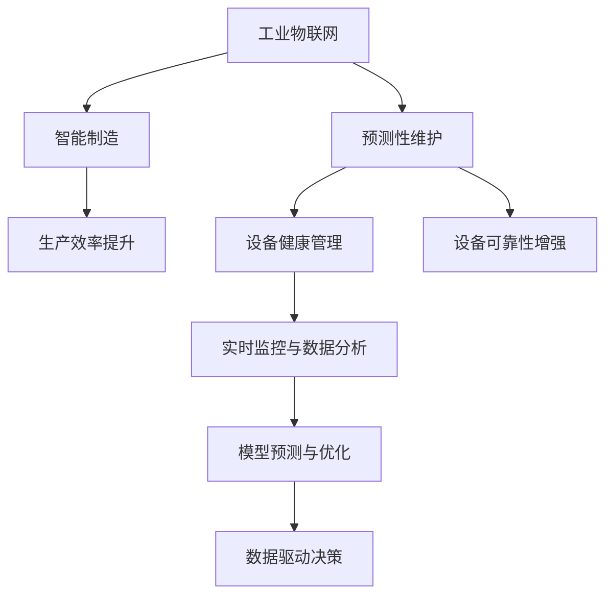

                 

# 工业物联网：智能制造和预测性维护

> 关键词：工业物联网(IoT)、智能制造、预测性维护、设备健康管理、数据驱动决策、实时监控、模型预测、可靠性分析、资源优化

## 1. 背景介绍

### 1.1 问题由来
随着工业化和信息化深度融合，工业物联网(IoT)日益成为推动工业制造业智能化升级的重要引擎。物联网技术将设备、系统和人员无缝连接，使得海量数据实时产生并传输，为工业生产带来了前所未有的效率提升和智能化管理可能。然而，数据孤岛、信息碎片化、数据处理与分析能力不足等问题也随之浮出水面。

工业物联网的挑战不仅仅局限于技术层面，更体现在如何整合这些海量数据，并转化为实际的业务价值。这一过程中，智能制造和预测性维护成为了关键突破口。智能制造通过整合自动化、数字化和智能化技术，提升生产效率和产品质量。而预测性维护则借助物联网采集的设备数据，预测设备故障并提前进行维护，减少生产停机时间，提升设备运行可靠性。

### 1.2 问题核心关键点
智能制造和预测性维护的核心在于如何高效利用工业物联网数据，进行智能决策和预测性分析。这一过程可以概括为以下几个关键点：
1. **数据采集与传输**：工业设备在生产过程中产生的海量数据，需要被实时采集并通过网络传输到数据中心。
2. **数据存储与管理**：海量数据的存储和管理，是数据价值提取的前提。
3. **数据处理与分析**：实时数据流的处理与分析，是智能决策的基础。
4. **智能决策与优化**：基于数据分析结果，进行实时决策与优化，提升生产效率与设备可靠性。
5. **模型预测与预警**：预测性维护的核心在于构建模型，对设备健康状态进行预测，实现预警。

这些关键点涵盖了从数据采集到智能决策的完整流程，是工业物联网和智能制造技术应用的基础。

### 1.3 问题研究意义
智能制造和预测性维护技术在工业物联网中的应用，对于提升制造业的生产效率、质量、灵活性和竞争力具有重要意义：

1. **提升生产效率**：通过物联网数据驱动的智能决策，优化生产流程，减少浪费和瓶颈，提升整体生产效率。
2. **提高产品质量**：利用实时数据分析，及时发现生产中的异常，提高产品质量和一致性。
3. **增强灵活性**：通过数据驱动的决策，快速响应市场变化，增强生产系统的灵活性和适应性。
4. **降低运营成本**：预测性维护减少了设备故障和维护成本，降低了生产停机时间和经济损失。
5. **促进可持续发展**：数据驱动的资源优化和能源管理，有助于实现绿色制造和可持续发展。

## 2. 核心概念与联系

### 2.1 核心概念概述

为更好地理解智能制造和预测性维护的原理，本节将介绍几个密切相关的核心概念：

- **工业物联网(IoT)**：通过网络将传感器、设备、软件系统与人连接起来，实现实时数据的采集、传输、存储和管理。
- **智能制造**：基于物联网数据的智能决策和优化，提升生产效率和产品质量，实现个性化定制和柔性制造。
- **预测性维护**：基于设备运行数据，预测设备故障，提前进行维护，避免意外停机，提升设备可靠性。
- **设备健康管理**：利用实时数据监控设备状态，评估设备健康度，进行健康管理和维护。
- **实时监控与数据分析**：通过传感器和网络设备对生产过程进行实时监控，采集海量数据，并通过数据分析提取有用信息。
- **模型预测与优化**：构建统计模型和机器学习模型，对设备健康状态进行预测，进行实时决策与优化。

这些核心概念之间的逻辑关系可以通过以下Mermaid流程图来展示：



这个流程图展示了几大核心概念及其之间的关系：

1. 工业物联网技术为智能制造和预测性维护提供了数据采集和传输的基础。
2. 智能制造通过实时数据分析和智能决策，优化生产流程，提升效率和质量。
3. 预测性维护通过模型预测设备健康状态，实现故障预警和提前维护。
4. 设备健康管理实时监控设备状态，评估设备健康度。
5. 实时监控与数据分析提取设备运行数据，供模型预测和优化使用。
6. 模型预测与优化基于数据分析结果，进行预测和决策。
7. 数据驱动决策用于指导生产优化和设备维护。

这些概念共同构成了智能制造和预测性维护的完整框架，使其能够高效运行。

## 3. 核心算法原理 & 具体操作步骤
### 3.1 算法原理概述

智能制造和预测性维护的核心算法原理基于统计学习、机器学习和大数据技术，旨在通过分析设备运行数据，进行实时决策和预测性维护。具体而言，包括：

- **数据采集与传输**：利用传感器和物联网设备采集设备运行状态数据，并通过网络传输到数据中心。
- **数据存储与管理**：将海量数据进行结构化和非结构化存储，建立数据湖，支持实时查询和分析。
- **数据处理与分析**：利用数据清洗、特征提取和数据建模等技术，处理和分析设备数据，提取有用信息。
- **模型预测与优化**：构建基于统计学习或机器学习的预测模型，对设备健康状态进行预测，指导实时决策与优化。

### 3.2 算法步骤详解

智能制造和预测性维护的主要操作步骤包括以下几个关键步骤：

**Step 1: 数据采集与传输**
- 安装传感器和物联网设备，采集设备运行状态数据。
- 通过网络将采集数据传输到数据中心或云平台，确保数据的实时性和可靠性。

**Step 2: 数据存储与管理**
- 使用分布式文件系统或数据库，建立数据湖，支持海量数据的存储和管理。
- 采用数据冗余和备份机制，确保数据的安全性和可恢复性。

**Step 3: 数据处理与分析**
- 对采集数据进行清洗和预处理，去除噪声和异常值。
- 通过特征提取技术，提取对设备健康状态有贡献的关键特征。
- 使用统计学习或机器学习算法，构建预测模型。
- 对模型进行训练和验证，选择最优模型，进行实时预测和决策。

**Step 4: 模型预测与优化**
- 利用预测模型，对设备健康状态进行实时预测。
- 根据预测结果，进行实时决策和优化，如调整生产参数、提前维护设备等。
- 持续监控预测结果和设备状态，进行动态调整和优化。

### 3.3 算法优缺点

智能制造和预测性维护的算法具有以下优点：
1. **高效性**：通过实时数据分析和预测，可以及时发现和解决问题，提高生产效率和设备可靠性。
2. **准确性**：基于大规模数据建模和分析，模型预测准确度较高，减少误判和误操作。
3. **灵活性**：数据驱动的决策和优化，使得系统具备较强的灵活性和适应性，能够快速响应市场变化。
4. **可扩展性**：利用分布式计算和存储技术，系统可以轻松扩展，支持更大规模的数据处理和分析。

同时，该算法也存在一定的局限性：
1. **数据质量依赖**：模型预测的准确性高度依赖于数据质量和完整性。
2. **模型复杂度**：构建复杂模型需要进行大量计算和存储，可能导致性能瓶颈。
3. **维护复杂性**：模型和系统的维护需要专业知识和技术支持，增加运营成本。
4. **隐私与安全**：大量设备数据涉及敏感信息，需要采取严格的隐私保护和安全措施。

尽管存在这些局限性，但就目前而言，基于智能制造和预测性维护的算法，仍然是提升工业制造业智能化和高效化的重要方法。未来相关研究的重点在于如何进一步优化数据采集、存储、处理和分析流程，提高模型的准确性和效率，同时兼顾隐私保护和安全性。

### 3.4 算法应用领域

基于智能制造和预测性维护的算法已经在制造业的多个领域得到广泛应用，例如：

- **生产流程优化**：利用实时数据，优化生产流程，减少生产中的瓶颈和浪费。
- **设备健康管理**：通过传感器数据，实时监控设备状态，预测设备故障，提前进行维护。
- **质量控制**：利用数据分析技术，实时检测产品质量，发现异常，及时调整生产参数。
- **供应链管理**：通过物联网数据，优化供应链管理，实现资源优化和库存管理。
- **能源管理**：利用设备运行数据，进行能耗分析和优化，实现绿色制造。

除了上述这些经典应用外，智能制造和预测性维护技术还被创新性地应用到更多场景中，如个性化定制、智能仓储、智能物流等，为工业制造业带来了新的突破。

## 4. 数学模型和公式 & 详细讲解 & 举例说明

### 4.1 数学模型构建

为更好地理解智能制造和预测性维护的数学模型构建，本节将介绍几个关键概念：

- **时间序列模型**：用于预测设备状态随时间的变化，如ARIMA、LSTM等。
- **多模态融合模型**：将不同模态的数据融合到一个模型中，如温度、振动、噪声等多维数据融合。
- **基于深度学习的模型**：利用神经网络进行特征提取和预测，如CNN、RNN、Transformer等。

假设设备运行数据为 $\{(x_t, y_t)\}_{t=1}^N$，其中 $x_t$ 为设备运行状态特征，$y_t$ 为设备健康状态标签，$t$ 为时间序列。建立时间序列模型 $y_t = f(x_t; \theta)$，其中 $f$ 为时间序列模型，$\theta$ 为模型参数。

### 4.2 公式推导过程

以ARIMA模型为例，时间序列模型的推导过程如下：

1. **ARIMA模型**：假设设备运行数据 $y_t$ 遵循ARIMA(p,d,q)模型，其自回归项和移动平均项分别为 $\phi(x_t)$ 和 $\theta(y_{t-1})$，则模型可以表示为：
   $$
   y_t = \phi(x_t) + \theta(y_{t-1}) + \epsilon_t
   $$
   其中 $\epsilon_t$ 为随机误差项。

2. **最小二乘法**：通过最小二乘法对模型参数 $\theta$ 进行估计，求解 $\theta$ 使 $\sum_{t=1}^N (y_t - f(x_t; \theta))^2$ 最小。

3. **模型训练与预测**：使用历史数据对模型进行训练，得到最优参数 $\theta$。利用训练好的模型，对新数据进行预测，评估设备健康状态。

### 4.3 案例分析与讲解

以预测设备故障为例，假设收集到设备振动数据 $\{(x_t, y_t)\}_{t=1}^N$，其中 $x_t$ 为振动数据，$y_t \in \{0,1\}$ 表示设备状态正常或故障。

- **数据预处理**：对原始数据进行归一化处理，去除噪声和异常值，提取关键特征。
- **模型建立**：利用LSTM模型建立预测模型 $y_t = f(x_t; \theta)$，其中 $f$ 为LSTM网络，$\theta$ 为网络参数。
- **模型训练**：使用历史数据对模型进行训练，优化参数 $\theta$。
- **模型预测**：利用训练好的模型对新数据进行预测，评估设备状态，及时进行维护。

## 5. 项目实践：代码实例和详细解释说明

### 5.1 开发环境搭建

在进行智能制造和预测性维护的实践前，我们需要准备好开发环境。以下是使用Python进行PyTorch开发的环境配置流程：

1. 安装Anaconda：从官网下载并安装Anaconda，用于创建独立的Python环境。

2. 创建并激活虚拟环境：
```bash
conda create -n pytorch-env python=3.8 
conda activate pytorch-env
```

3. 安装PyTorch：根据CUDA版本，从官网获取对应的安装命令。例如：
```bash
conda install pytorch torchvision torchaudio cudatoolkit=11.1 -c pytorch -c conda-forge
```

4. 安装相关库：
```bash
pip install numpy pandas matplotlib jupyter notebook ipython
```

完成上述步骤后，即可在`pytorch-env`环境中开始项目实践。

### 5.2 源代码详细实现

下面我们以预测设备故障为例，给出使用PyTorch实现LSTM模型的代码实现。

首先，定义时间序列数据的处理函数：

```python
import numpy as np
from torch.utils.data import TensorDataset, DataLoader
import torch

class TimeSeriesDataset(TensorDataset):
    def __init__(self, X, y, seq_len):
        self.X = X
        self.y = y
        self.seq_len = seq_len
        
    def __len__(self):
        return len(self.X)
    
    def __getitem__(self, idx):
        x = self.X[idx, :]
        y = self.y[idx]
        
        # 构建时间序列数据
        x = np.array([x[i:i+self.seq_len] for i in range(len(x)-self.seq_len+1)])
        y = np.array(y[-self.seq_len:])
        
        return torch.tensor(x, dtype=torch.float), torch.tensor(y, dtype=torch.long)
```

然后，定义LSTM模型：

```python
from torch import nn

class LSTMModel(nn.Module):
    def __init__(self, input_size, hidden_size, output_size, seq_len):
        super(LSTMModel, self).__init__()
        
        self.hidden_size = hidden_size
        self.lstm = nn.LSTM(input_size, hidden_size, batch_first=True)
        self.fc = nn.Linear(hidden_size, output_size)
        
    def forward(self, x):
        h0 = torch.zeros(1, x.size(0), self.hidden_size).to(x.device)
        c0 = torch.zeros(1, x.size(0), self.hidden_size).to(x.device)
        
        out, _ = self.lstm(x, (h0, c0))
        out = self.fc(out[:, -1, :])
        return out
```

接着，定义训练和评估函数：

```python
def train_epoch(model, train_loader, optimizer):
    model.train()
    train_loss = 0
    for batch in train_loader:
        x, y = batch
        optimizer.zero_grad()
        preds = model(x)
        loss = nn.CrossEntropyLoss()(preds, y)
        train_loss += loss.item()
        loss.backward()
        optimizer.step()
    
    return train_loss / len(train_loader)

def evaluate(model, test_loader):
    model.eval()
    test_loss = 0
    correct = 0
    with torch.no_grad():
        for batch in test_loader:
            x, y = batch
            preds = model(x)
            loss = nn.CrossEntropyLoss()(preds, y)
            test_loss += loss.item()
            preds = preds.argmax(dim=1)
            correct += (preds == y).sum().item()
    
    acc = correct / len(test_loader.dataset)
    return test_loss / len(test_loader), acc
```

最后，启动训练流程并在测试集上评估：

```python
epochs = 50
batch_size = 64
seq_len = 10
hidden_size = 64
input_size = 10
output_size = 2

train_dataset = TimeSeriesDataset(X_train, y_train, seq_len)
test_dataset = TimeSeriesDataset(X_test, y_test, seq_len)

model = LSTMModel(input_size, hidden_size, output_size, seq_len)
optimizer = torch.optim.Adam(model.parameters(), lr=0.001)

for epoch in range(epochs):
    train_loss = train_epoch(model, DataLoader(train_dataset, batch_size=batch_size))
    print(f"Epoch {epoch+1}, train loss: {train_loss:.3f}")
    
    test_loss, acc = evaluate(model, DataLoader(test_dataset, batch_size=batch_size))
    print(f"Epoch {epoch+1}, test loss: {test_loss:.3f}, accuracy: {acc:.3f}")
    
print("Final test loss: {:.3f}, accuracy: {:.3f}".format(test_loss, acc))
```

以上就是使用PyTorch对LSTM模型进行设备故障预测的完整代码实现。可以看到，利用PyTorch的高级API，模型的构建和训练变得非常简单。

### 5.3 代码解读与分析

让我们再详细解读一下关键代码的实现细节：

**TimeSeriesDataset类**：
- `__init__`方法：初始化训练和测试数据集，定义时间序列长度。
- `__len__`方法：返回数据集的样本数量。
- `__getitem__`方法：对单个样本进行处理，构建时间序列数据。

**LSTMModel类**：
- `__init__`方法：定义模型的参数和结构，包括LSTM层和全连接层。
- `forward`方法：前向传播计算，使用LSTM层处理输入数据，通过全连接层输出预测结果。

**训练和评估函数**：
- `train_epoch`函数：对训练集数据以批为单位进行迭代，计算损失并反向传播更新模型参数。
- `evaluate`函数：对测试集数据进行评估，计算损失和准确率，返回评估结果。

**训练流程**：
- 定义总的epoch数和batch size，开始循环迭代
- 每个epoch内，先在训练集上训练，输出平均loss
- 在测试集上评估，输出平均loss和准确率
- 所有epoch结束后，输出最终的测试结果

可以看到，PyTorch配合LSTM模型使得设备故障预测的代码实现变得简洁高效。开发者可以将更多精力放在模型改进和数据处理上，而不必过多关注底层的实现细节。

当然，工业级的系统实现还需考虑更多因素，如模型的保存和部署、超参数的自动搜索、更灵活的任务适配层等。但核心的微调范式基本与此类似。

## 6. 实际应用场景
### 6.1 智能制造系统

智能制造系统通过物联网技术，实现了对生产设备的实时监控和优化。利用传感器数据，系统可以实时检测设备的运行状态，预测设备故障，提前进行维护，从而提升生产效率和设备可靠性。

例如，某智能制造工厂利用IoT设备实时采集设备振动数据，构建LSTM模型对设备健康状态进行预测。系统根据预测结果，及时调整生产参数，避免设备故障，减少停机时间。同时，系统还可以根据实时数据，优化生产流程，提升产品质量和一致性。

### 6.2 设备健康管理系统

设备健康管理系统是智能制造的核心组件之一，通过实时监控设备状态，预测设备故障，指导设备维护。系统利用IoT设备采集的设备运行数据，建立时间序列模型，对设备健康状态进行预测。

例如，某设备健康管理系统利用ARIMA模型对设备振动数据进行分析，实时预测设备健康状态。系统根据预测结果，自动调度维护计划，提前进行设备维护，避免意外停机，提升设备运行可靠性。

### 6.3 供应链管理系统

供应链管理系统通过物联网技术，实现了对供应链的实时监控和优化。利用传感器数据，系统可以实时检测供应链各环节的状态，优化资源配置，提高供应链效率。

例如，某供应链管理系统利用IoT设备实时采集供应链各环节的数据，建立多模态融合模型，对供应链状态进行实时监控和预测。系统根据预测结果，优化资源配置，提升供应链效率，减少库存和运输成本。

### 6.4 未来应用展望

随着物联网技术的不断进步和智能制造的深入发展，基于智能制造和预测性维护的技术将在更多领域得到应用，为工业制造业带来新的突破。

在智慧工厂中，物联网设备将实现更广泛的部署，涵盖生产设备、仓储设施、质量检测等多个环节，实现全流程的智能化和数字化。智能制造系统将具备更高的自适应能力和资源优化能力，更好地适应生产需求变化。

在智能仓储中，物联网设备将实现对仓储物流的实时监控和优化，实现仓库智能化和物流自动化，提升仓储效率和物流速度。

在智能物流中，物联网设备将实现对运输车辆的实时监控和调度，优化运输路径和运输效率，实现运输过程的智能化和可视化。

此外，在智能建筑、智能医疗、智能交通等领域，基于智能制造和预测性维护的技术也将不断涌现，为各行各业带来新的变革和创新。

## 7. 工具和资源推荐
### 7.1 学习资源推荐

为了帮助开发者系统掌握智能制造和预测性维护的理论基础和实践技巧，这里推荐一些优质的学习资源：

1. **《智能制造与物联网》系列博文**：由工业互联网领域专家撰写，深入浅出地介绍了智能制造和物联网技术的应用，适合初学者和进阶开发者。

2. **《预测性维护技术》课程**：由知名大学开设的机器学习课程，涵盖预测性维护的基本概念和算法，适合对预测性维护感兴趣的开发者。

3. **《Python深度学习》书籍**：深入浅出地介绍了深度学习在智能制造和预测性维护中的应用，适合想要深入学习深度学习的开发者。

4. **《工业物联网平台设计与实现》论文**：详细介绍了工业物联网平台的构建方法，适合对平台设计和实现感兴趣的开发者。

5. **《工业智能制造的未来》报告**：由工业制造领域知名研究机构发布，详细分析了工业智能制造的发展趋势和未来前景，适合对行业发展感兴趣的研究人员。

通过对这些资源的学习实践，相信你一定能够快速掌握智能制造和预测性维护的精髓，并用于解决实际的工业物联网问题。

### 7.2 开发工具推荐

高效的开发离不开优秀的工具支持。以下是几款用于智能制造和预测性维护开发的常用工具：

1. **PyTorch**：基于Python的开源深度学习框架，灵活动态的计算图，适合快速迭代研究。支持构建各种神经网络模型，适合进行深度学习开发。

2. **TensorFlow**：由Google主导开发的开源深度学习框架，生产部署方便，适合大规模工程应用。支持构建各种神经网络模型，适合进行深度学习开发。

3. **Keras**：基于TensorFlow的高级API，使得深度学习模型的构建更加简洁高效，适合初学者和快速原型开发。

4. **Amazon SageMaker**：亚马逊提供的云机器学习平台，支持模型训练、部署和监控，适合进行大规模模型开发和部署。

5. **Google Cloud AI Platform**：谷歌提供的云机器学习平台，支持模型训练、部署和监控，适合进行大规模模型开发和部署。

合理利用这些工具，可以显著提升智能制造和预测性维护任务的开发效率，加快创新迭代的步伐。

### 7.3 相关论文推荐

智能制造和预测性维护技术的发展源于学界的持续研究。以下是几篇奠基性的相关论文，推荐阅读：

1. **《工业物联网架构设计》**：介绍工业物联网平台的架构设计，涵盖数据采集、存储、处理、分析和应用。

2. **《预测性维护：基于时间序列模型的方法》**：详细介绍了时间序列模型在预测性维护中的应用，适合对预测性维护感兴趣的开发者。

3. **《工业智能制造的物联网应用》**：讨论了物联网技术在智能制造中的应用，适合对工业物联网应用感兴趣的研究人员。

4. **《基于深度学习的工业物联网分析》**：介绍了深度学习在工业物联网数据分析中的应用，适合对深度学习感兴趣的研究人员。

5. **《工业物联网的资源优化与调度》**：详细介绍了工业物联网系统的资源优化和调度方法，适合对资源优化感兴趣的研究人员。

这些论文代表了大规模工业物联网和智能制造技术的发展脉络。通过学习这些前沿成果，可以帮助研究者把握学科前进方向，激发更多的创新灵感。

## 8. 总结：未来发展趋势与挑战

### 8.1 总结

本文对智能制造和预测性维护技术进行了全面系统的介绍。首先阐述了智能制造和预测性维护的背景和意义，明确了其在提升工业制造业智能化和高效化方面的重要价值。其次，从原理到实践，详细讲解了智能制造和预测性维护的数学模型构建和算法操作步骤，给出了模型预测的代码实现。同时，本文还广泛探讨了智能制造和预测性维护技术在工业物联网中的应用场景，展示了其广阔的应用前景。此外，本文精选了智能制造和预测性维护技术的各类学习资源，力求为读者提供全方位的技术指引。

通过本文的系统梳理，可以看到，智能制造和预测性维护技术在工业物联网中的应用，对于提升制造业的生产效率、质量、灵活性和竞争力具有重要意义。未来，伴随工业物联网技术的不断成熟和智能化制造的深入发展，基于智能制造和预测性维护的技术将在更多领域得到应用，为传统行业带来变革性影响。

### 8.2 未来发展趋势

展望未来，智能制造和预测性维护技术将呈现以下几个发展趋势：

1. **智能化和自动化水平提升**：随着深度学习和大数据技术的发展，智能制造和预测性维护系统的智能化和自动化水平将进一步提升，实现更高效的决策和优化。

2. **数据融合与多模态分析**：未来的系统将更加注重多模态数据的融合与分析，充分利用设备运行数据、传感器数据、环境数据等多种信息源，提升系统决策的全面性和准确性。

3. **边缘计算与分布式处理**：随着边缘计算技术的普及，智能制造和预测性维护系统将更多地利用边缘计算资源，实现数据本地处理和实时决策。

4. **模型轻量化与高效化**：未来的系统将更加注重模型的轻量化和高效化，通过模型压缩、量化加速等技术，提高系统的实时响应和计算效率。

5. **智能化运维与自主管理**：未来的系统将具备更强的智能化运维能力，能够进行自我诊断和故障恢复，提高系统的稳定性和可靠性。

6. **生态系统建设与行业协同**：未来的系统将更多地与行业上下游生态系统进行协同，实现更广泛的数据共享和应用，促进工业生态的数字化转型。

以上趋势凸显了智能制造和预测性维护技术的广阔前景。这些方向的探索发展，必将进一步提升系统的智能化水平，为工业制造业带来更高的生产效率和更低的运营成本。

### 8.3 面临的挑战

尽管智能制造和预测性维护技术已经取得了显著成效，但在迈向更加智能化、高效化应用的过程中，仍然面临以下挑战：

1. **数据质量与隐私**：智能制造和预测性维护依赖于高质量的数据，数据质量直接影响系统的预测精度。同时，海量数据采集和存储也涉及隐私保护问题，需要采取严格的隐私保护措施。

2. **模型复杂性与可解释性**：深度学习模型虽然强大，但也复杂难以解释。如何提高模型的可解释性，使其具备更高的透明度和可信度，是未来需要解决的重要问题。

3. **硬件资源限制**：智能制造和预测性维护系统对计算和存储资源的需求较高，尤其是大规模数据处理和深度学习模型训练。如何在有限的硬件资源下，提升系统的性能和效率，仍然是一大难题。

4. **系统稳定性与可靠性**：系统需要在高并发和高负载条件下保持稳定和可靠，避免系统故障和数据丢失。如何提高系统的稳定性和可靠性，是未来需要解决的重要问题。

5. **安全与威胁防护**：智能制造和预测性维护系统涉及大量的敏感信息，易受到网络攻击和数据泄露的风险。如何构建安全可靠的防护体系，保障系统安全，是未来需要解决的重要问题。

6. **标准化与互操作性**：智能制造和预测性维护系统需要在多厂商、多平台之间实现标准化与互操作，避免数据孤岛和系统集成困难。如何构建统一的标准和互操作体系，是未来需要解决的重要问题。

尽管存在这些挑战，但相信通过学界和产业界的共同努力，这些难题终将一一被攻克，智能制造和预测性维护技术将更好地服务于工业制造业的智能化和高效化。

### 8.4 研究展望

面向未来，智能制造和预测性维护技术的研究应在以下几个方面继续推进：

1. **数据质量与隐私保护**：推动数据质量提升和隐私保护技术的创新，构建高质量的数据采集和存储体系，保障数据安全。

2. **模型可解释性与透明性**：研究可解释性模型构建方法，提高模型的透明度和可信度，构建用户友好的决策支持系统。

3. **高效化与轻量化**：研究模型压缩和量化技术，提升模型的计算效率和资源利用率，构建轻量化和高效化的智能制造和预测性维护系统。

4. **分布式与边缘计算**：推动边缘计算技术的普及和应用，构建分布式智能制造和预测性维护系统，提升系统的实时响应和处理能力。

5. **智能化运维与自主管理**：研究智能化运维技术，提升系统的自主诊断和故障恢复能力，构建高可靠性的智能制造和预测性维护系统。

6. **生态系统建设与行业协同**：构建工业物联网生态系统，推动行业上下游协同，实现更广泛的数据共享和应用，促进工业生态的数字化转型。

以上研究方向将推动智能制造和预测性维护技术的进一步发展，为工业制造业带来更多的智能化和高效化潜力。只有勇于创新、敢于突破，才能不断拓展智能制造和预测性维护的边界，为人类社会带来更多福祉。

## 9. 附录：常见问题与解答

**Q1：智能制造和预测性维护的技术难点有哪些？**

A: 智能制造和预测性维护的技术难点主要包括以下几点：
1. **数据质量**：智能制造和预测性维护依赖于高质量的数据，数据质量直接影响系统的预测精度。数据噪声、缺失和不一致等问题可能导致模型预测不准确。
2. **模型复杂性**：深度学习模型虽然强大，但也复杂难以解释。如何提高模型的可解释性，使其具备更高的透明度和可信度，是未来需要解决的重要问题。
3. **硬件资源限制**：智能制造和预测性维护系统对计算和存储资源的需求较高，尤其是大规模数据处理和深度学习模型训练。如何在有限的硬件资源下，提升系统的性能和效率，仍然是一大难题。
4. **系统稳定性与可靠性**：系统需要在高并发和高负载条件下保持稳定和可靠，避免系统故障和数据丢失。如何提高系统的稳定性和可靠性，是未来需要解决的重要问题。
5. **安全与威胁防护**：智能制造和预测性维护系统涉及大量的敏感信息，易受到网络攻击和数据泄露的风险。如何构建安全可靠的防护体系，保障系统安全，是未来需要解决的重要问题。

**Q2：如何构建智能制造和预测性维护系统？**

A: 构建智能制造和预测性维护系统需要以下关键步骤：
1. **数据采集与传输**：安装传感器和物联网设备，采集设备运行状态数据，并通过网络传输到数据中心。
2. **数据存储与管理**：使用分布式文件系统或数据库，建立数据湖，支持海量数据的存储和管理。
3. **数据处理与分析**：对采集数据进行清洗和预处理，去除噪声和异常值，提取关键特征。使用统计学习或机器学习算法，构建预测模型。
4. **模型预测与优化**：利用预测模型，对设备健康状态进行实时预测，根据预测结果，进行实时决策和优化。
5. **系统部署与监控**：将训练好的模型部署到实际生产环境中，进行实时监控和优化，持续评估模型效果。

**Q3：智能制造和预测性维护在实际应用中面临哪些挑战？**

A: 智能制造和预测性维护在实际应用中面临以下挑战：
1. **数据质量与隐私**：智能制造和预测性维护依赖于高质量的数据，数据质量直接影响系统的预测精度。同时，海量数据采集和存储也涉及隐私保护问题，需要采取严格的隐私保护措施。
2. **模型复杂性与可解释性**：深度学习模型虽然强大，但也复杂难以解释。如何提高模型的可解释性，使其具备更高的透明度和可信度，是未来需要解决的重要问题。
3. **硬件资源限制**：智能制造和预测性维护系统对计算和存储资源的需求较高，尤其是大规模数据处理和深度学习模型训练。如何在有限的硬件资源下，提升系统的性能和效率，仍然是一大难题。
4. **系统稳定性与可靠性**：系统需要在高并发和高负载条件下保持稳定和可靠，避免系统故障和数据丢失。如何提高系统的稳定性和可靠性，是未来需要解决的重要问题。
5. **安全与威胁防护**：智能制造和预测性维护系统涉及大量的敏感信息，易受到网络攻击和数据泄露的风险。如何构建安全可靠的防护体系，保障系统安全，是未来需要解决的重要问题。

**Q4：智能制造和预测性维护技术的未来发展方向有哪些？**

A: 智能制造和预测性维护技术的未来发展方向包括：
1. **数据融合与多模态分析**：未来的系统将更加注重多模态数据的融合与分析，充分利用设备运行数据、传感器数据、环境数据等多种信息源，提升系统决策的全面性和准确性。
2. **边缘计算与分布式处理**：随着边缘计算技术的普及，智能制造和预测性维护系统将更多地利用边缘计算资源，实现数据本地处理和实时决策。
3. **模型轻量化与高效化**：未来的系统将更加注重模型的轻量化和高效化，通过模型压缩、量化加速等技术，提高系统的实时响应和计算效率。
4. **智能化运维与自主管理**：未来的系统将具备更强的智能化运维能力，能够进行自我诊断和故障恢复，提高系统的稳定性和可靠性。
5. **生态系统建设与行业协同**：未来的系统将更多地与行业上下游生态系统进行协同，实现更广泛的数据共享和应用，促进工业生态的数字化转型。

通过以上技术的不断发展和应用，智能制造和预测性维护技术将为工业制造业带来更多的智能化和高效化潜力，推动产业的可持续发展。

---

作者：禅与计算机程序设计艺术 / Zen and the Art of Computer Programming

