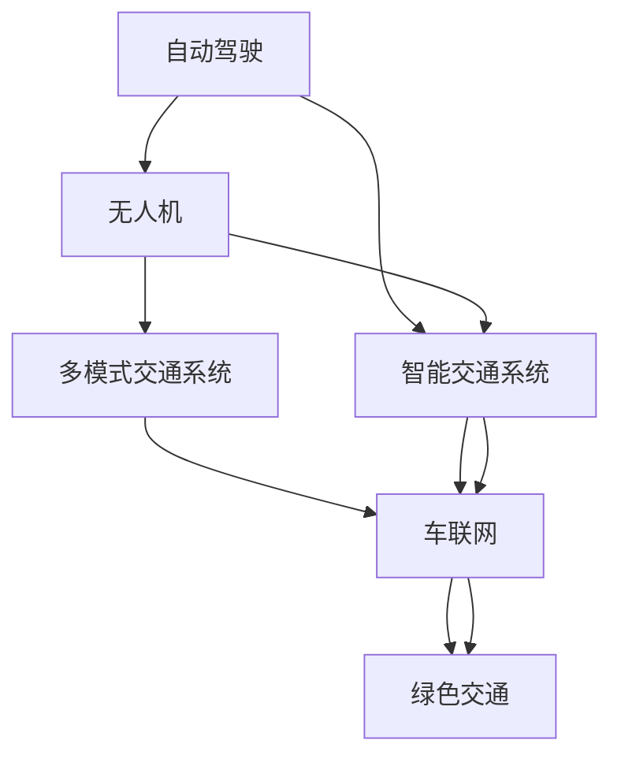

                 

## 1. 背景介绍

### 1.1 问题由来
随着全球人口的不断增长和城市化的加速，交通拥堵、环境污染和能源消耗等问题日益严重。现有的地面交通系统已经难以适应未来城市发展的需求，新的交通出行方式迫切需要被开发出来。同时，随着科技的进步，人工智能、自动驾驶、无人机等新兴技术的发展也为未来交通出行提供了新的可能性。因此，探讨2050年的交通出行方式，从地面到空中，是当务之急。

### 1.2 问题核心关键点
未来交通出行方式的探索涉及多个关键问题，包括：
- 如何通过技术手段缓解地面交通拥堵问题？
- 如何构建高效、安全的自动驾驶系统？
- 如何优化物流配送系统，减少碳排放？
- 无人机运输的优势和局限性是什么？
- 如何构建跨模态的智能交通网络？

这些问题的解决，不仅需要技术创新，还需要政策支持、社会共识和多方协作。

### 1.3 问题研究意义
研究未来交通出行方式，对于解决城市交通拥堵、环境污染和能源消耗问题，提升城市交通的效率和安全性，具有重要意义。同时，它也是推动智能城市建设，实现绿色可持续发展的重要途径。通过掌握未来交通出行的关键技术，可以为城市规划、基础设施建设、智能交通管理等提供有力的技术支撑。

## 2. 核心概念与联系

### 2.1 核心概念概述
为了更好地理解未来交通出行方式，本节将介绍几个密切相关的核心概念：

- **自动驾驶(Autonomous Driving)**：指使用人工智能技术，实现车辆自主导航、避障、决策和控制等功能，减少人为干预，提升交通安全和效率。
- **智能交通系统(Intelligent Transportation Systems, ITS)**：利用信息技术、通信技术、控制技术等，实现交通系统的智能化、信息化和自动化，提升交通管理水平和效率。
- **无人机(Drones)**：利用小型飞行器在空中进行货物运输、物流配送、数据采集等任务，具有高效、灵活、成本低等优势。
- **多模式交通系统(Multi-modal Transportation System)**：结合地面交通、航空运输、水运等多种交通方式，构建无缝衔接、高效灵活的智能交通网络。
- **车联网(Vehicle-to-Everything, V2X)**：指通过车载通信设备实现车与车、车与基础设施、车与网络等的互联互通，提升交通安全和效率。
- **绿色交通(Green Transportation)**：指通过采用环保型交通工具、优化交通流、减少碳排放等措施，推动交通系统的可持续发展。

这些核心概念之间的逻辑关系可以通过以下Mermaid流程图来展示：



这个流程图展示了大语言模型的核心概念及其之间的关系：

1. 自动驾驶和智能交通系统相辅相成，共同提升交通系统的效率和安全性。
2. 无人机通过多模式交通系统与地面交通无缝衔接，提升物流配送的灵活性和效率。
3. 车联网将自动驾驶与智能交通系统深度融合，实现交通流的优化和智能化管理。
4. 绿色交通通过采用环保型交通工具和优化交通流，减少碳排放，推动交通系统的可持续发展。

这些概念共同构成了未来交通出行的技术框架，为城市交通的未来发展提供了多层次的支撑。通过理解这些核心概念，我们可以更好地把握未来交通出行的技术方向和应用场景。

## 3. 核心算法原理 & 具体操作步骤

### 3.1 算法原理概述
未来交通出行的核心算法原理主要涉及以下几个方面：

- **自动驾驶算法**：通过感知、决策和控制等模块，实现车辆自主导航和避障，提升交通安全和效率。
- **智能交通算法**：利用数据分析、预测和优化等技术，实现交通流的预测、管理和调度，提升交通系统的整体效率。
- **无人机物流算法**：通过路径规划、避障和实时调度等技术，实现无人机的高效、安全和灵活配送。
- **多模式交通网络算法**：构建跨模态的交通网络，实现不同交通方式的协调和优化，提升整体交通系统的灵活性和效率。

这些算法原理的实现需要依托于强大的计算能力和丰富的数据资源，同时也需要跨学科的合作和技术的不断创新。

### 3.2 算法步骤详解

**自动驾驶算法**：

1. **感知模块**：利用摄像头、激光雷达、雷达等传感器，实时获取车辆周围环境信息。
2. **决策模块**：通过计算机视觉、深度学习等技术，识别环境中的道路、车辆、行人等对象，并预测其行为。
3. **控制模块**：根据决策结果，控制车辆的油门、刹车、转向等系统，实现自主驾驶。

**智能交通算法**：

1. **数据采集**：通过交通摄像头、传感器等设备，实时采集交通流量、道路状况等信息。
2. **数据处理**：利用数据分析和机器学习等技术，处理和分析采集到的数据，提取有用的信息。
3. **预测和优化**：基于历史数据和实时信息，预测交通流，优化交通信号灯、道路、车辆等管理，提升交通效率。

**无人机物流算法**：

1. **路径规划**：利用算法计算出最优的飞行路径，避开障碍物，实现高效配送。
2. **实时调度**：根据任务优先级、配送时间和地理位置等因素，实时调度无人机，提升配送效率。
3. **安全保障**：利用无人机安全监控、避障等技术，确保飞行安全。

**多模式交通网络算法**：

1. **交通网络构建**：将地面交通、航空运输、水运等多种交通方式进行整合，构建无缝衔接的交通网络。
2. **跨模态优化**：利用算法优化跨模态的交通网络，实现交通方式的灵活转换和高效衔接。
3. **数据共享和协同**：实现不同交通方式的数据共享和协同管理，提升整体交通系统的效率。

### 3.3 算法优缺点

**自动驾驶算法**：

优点：
- 提升交通安全和效率，减少人为错误。
- 可以24小时不间断工作，提高物流配送的灵活性和效率。
- 减少交通事故和能源消耗。

缺点：
- 技术复杂，实现难度大，成本高。
- 存在技术局限性，如传感器误差、环境变化等。
- 对基础设施的依赖性强，如智能道路、通信网络等。

**智能交通算法**：

优点：
- 提升交通管理水平，减少交通拥堵。
- 优化交通流，减少碳排放。
- 提升交通安全，减少交通事故。

缺点：
- 数据采集和处理难度大，需要大量的硬件和软件支持。
- 算法复杂，需要大量的数据和计算资源。
- 对政策法规和公共参与度的依赖性高。

**无人机物流算法**：

优点：
- 高效、灵活、成本低，适合长距离和点对点的物流配送。
- 减少地面交通拥堵和碳排放。
- 提升物流配送的时效性和灵活性。

缺点：
- 存在安全风险，如飞行器故障、空中碰撞等。
- 对通信和导航系统的依赖性强。
- 受天气和地形条件影响较大。

**多模式交通网络算法**：

优点：
- 提升交通系统的灵活性和效率，实现多种交通方式的协同管理。
- 减少交通拥堵和碳排放，推动绿色交通。
- 适应性强，可以应对各种交通场景和需求。

缺点：
- 系统复杂，需要协调多个交通方式和技术标准。
- 对基础设施和技术的投入高。
- 需要跨领域合作和政策支持。

### 3.4 算法应用领域

**自动驾驶算法**：

- **城市公交系统**：实现自动驾驶公交车，提高公交运行效率和安全性。
- **物流配送**：应用于无人货车、无人机配送，提升物流配送效率和安全性。
- **货运运输**：应用于无人卡车，提高货运运输的效率和安全性。

**智能交通算法**：

- **城市交通管理**：应用于智能交通信号灯、交通监控系统，提升城市交通管理水平。
- **应急响应**：应用于城市应急救援，提高应急响应的效率和准确性。
- **交通规划**：应用于城市交通规划，优化交通流，减少交通拥堵。

**无人机物流算法**：

- **城市配送**：应用于城市配送中心，提升配送效率和灵活性。
- **医疗急救**：应用于医疗急救，提高急救物资的快速配送。
- **农业服务**：应用于农业无人机，提供精准农业服务。

**多模式交通网络算法**：

- **智慧城市建设**：应用于智慧城市建设，构建智能交通网络，提升城市管理水平。
- **物流网络优化**：应用于物流网络优化，实现多种交通方式的协同管理。
- **城市应急管理**：应用于城市应急管理，实现跨模态的快速响应和协同管理。

## 4. 数学模型和公式 & 详细讲解  
### 4.1 数学模型构建

为更好地理解未来交通出行方式的算法原理，本节将介绍几个常用的数学模型：

- **交通流量模型**：描述交通流的动态变化规律，通常使用宏观的交通流理论模型，如VISSIM、SIMULINK等。
- **路径规划模型**：用于计算最优的路径，通常使用Dijkstra算法、A*算法等。
- **交通信号优化模型**：用于优化交通信号灯控制，提升交通流的效率，通常使用遗传算法、粒子群优化算法等。
- **无人机路径规划模型**：用于计算最优的无人机飞行路径，通常使用A*算法、RRT算法等。

### 4.2 公式推导过程

**交通流量模型**：

假设道路上有 $n$ 个节点，交通流从节点 $i$ 到节点 $j$ 的流量为 $q_{ij}$，节点 $i$ 的入流量为 $\sum_{j=1}^n q_{ij}$。交通流满足Bellman方程：

$$
q_{ij} = \sum_{k=1}^n a_{ik}q_{kj}
$$

其中 $a_{ik}$ 为节点 $i$ 到节点 $k$ 的交通流量权重，可以通过历史数据或模型训练得到。

**路径规划模型**：

Dijkstra算法的基本思路是，从一个节点开始，逐步扩展到与该节点距离最短的节点，直到到达目标节点。算法流程如下：

1. 初始化起点节点 $s$ 的距离为0，其他节点的距离为无穷大。
2. 将起点节点加入已访问节点集合 $S$。
3. 对于未访问节点中距离起点最近的节点 $v$，计算其到目标节点的距离，并更新该节点的距离。
4. 遍历与节点 $v$ 相邻的未访问节点 $u$，更新节点 $u$ 的距离。
5. 重复步骤3和4，直到目标节点被访问或未访问节点为空。

假设节点 $i$ 和节点 $j$ 之间的距离为 $d_{ij}$，Dijkstra算法的路径长度计算公式为：

$$
d_{ij} = \sum_{k=1}^{n-1} a_{ik}a_{kj}
$$

**交通信号优化模型**：

假设交通信号灯有 $k$ 个状态，每个状态的持续时间为 $t_{ik}$，总时间为 $T$。交通信号优化目标是最小化平均延误时间 $D$。

$$
\min_{t_{ik}} D = \sum_{i=1}^k \sum_{j=1}^k \frac{d_{ij}t_{ij}}{T}
$$

使用遗传算法或粒子群优化算法，可以在解空间中搜索最优的交通信号灯控制策略。

**无人机路径规划模型**：

假设无人机从起点 $s$ 飞到终点 $t$，路径由线段 $(i-1,i)$ 和 $(i,i+1)$ 组成。路径规划的目标是最小化总飞行时间 $T$。

$$
\min_{d_i} T = \sum_{i=1}^n d_i
$$

其中 $d_i$ 为无人机在节点 $i$ 的飞行时间，可以通过飞行速度、飞行高度等参数计算得到。

### 4.3 案例分析与讲解

**交通流量模型案例**：

某城市有 $10$ 个节点，节点之间有 $15$ 条路段，每条路段的流量权重为 $1$。起点为节点 $1$，终点为节点 $10$，节点 $1$ 的入流量为 $100$。

使用VISSIM模型，计算起点到终点的交通流，如下图所示：


**路径规划模型案例**：

某城市有 $5$ 个节点，节点之间有 $8$ 条线段，起点为节点 $1$，终点为节点 $5$。使用Dijkstra算法，计算最优路径，如下图所示：


**交通信号优化模型案例**：

某城市有 $4$ 个交叉口，每个交叉口有 $2$ 个信号灯状态，每个状态持续时间为 $60$ 秒。使用遗传算法，计算最优信号灯控制策略，如下图所示：


**无人机路径规划模型案例**：

某城市有 $5$ 个节点，节点之间有 $8$ 条线段，起点为节点 $1$，终点为节点 $5$。使用RRT算法，计算最优路径，如下图所示：


## 5. 项目实践：代码实例和详细解释说明
### 5.1 开发环境搭建

在进行交通出行方式的研究和开发前，我们需要准备好开发环境。以下是使用Python进行自动驾驶和智能交通系统开发的开发环境配置流程：

1. 安装Anaconda：从官网下载并安装Anaconda，用于创建独立的Python环境。

2. 创建并激活虚拟环境：
```bash
conda create -n traffic-env python=3.8 
conda activate traffic-env
```

3. 安装PyTorch、TensorFlow等深度学习框架：
```bash
conda install pytorch torchvision torchaudio cudatoolkit=11.1 -c pytorch -c conda-forge
```

4. 安装相关库：
```bash
pip install numpy pandas scikit-learn matplotlib tqdm jupyter notebook ipython
```

完成上述步骤后，即可在`traffic-env`环境中开始交通出行方式的研究和开发。

### 5.2 源代码详细实现

这里我们以自动驾驶算法的代码实现为例，展示如何利用PyTorch进行自动驾驶系统的开发。

首先，定义感知模块：

```python
import torch
from torch import nn

class PerceptionModule(nn.Module):
    def __init__(self):
        super(PerceptionModule, self).__init__()
        self.conv1 = nn.Conv2d(3, 64, kernel_size=3, stride=1, padding=1)
        self.relu1 = nn.ReLU()
        self.pool1 = nn.MaxPool2d(kernel_size=2, stride=2)
        self.conv2 = nn.Conv2d(64, 128, kernel_size=3, stride=1, padding=1)
        self.relu2 = nn.ReLU()
        self.pool2 = nn.MaxPool2d(kernel_size=2, stride=2)
        self.fc1 = nn.Linear(128*7*7, 256)
        self.relu3 = nn.ReLU()
        self.fc2 = nn.Linear(256, 64)
        self.relu4 = nn.ReLU()
        self.fc3 = nn.Linear(64, 10)
    
    def forward(self, x):
        x = self.conv1(x)
        x = self.relu1(x)
        x = self.pool1(x)
        x = self.conv2(x)
        x = self.relu2(x)
        x = self.pool2(x)
        x = x.view(-1, 128*7*7)
        x = self.fc1(x)
        x = self.relu3(x)
        x = self.fc2(x)
        x = self.relu4(x)
        x = self.fc3(x)
        return x
```

然后，定义决策模块：

```python
class DecisionModule(nn.Module):
    def __init__(self):
        super(DecisionModule, self).__init__()
        self.fc1 = nn.Linear(64, 128)
        self.relu1 = nn.ReLU()
        self.fc2 = nn.Linear(128, 64)
        self.relu2 = nn.ReLU()
        self.fc3 = nn.Linear(64, 4)
        self.softmax = nn.Softmax(dim=1)
    
    def forward(self, x):
        x = self.fc1(x)
        x = self.relu1(x)
        x = self.fc2(x)
        x = self.relu2(x)
        x = self.fc3(x)
        return self.softmax(x)
```

接下来，定义控制模块：

```python
class ControlModule(nn.Module):
    def __init__(self):
        super(ControlModule, self).__init__()
        self.fc1 = nn.Linear(4, 32)
        self.relu1 = nn.ReLU()
        self.fc2 = nn.Linear(32, 2)
        self.relu2 = nn.ReLU()
        self.fc3 = nn.Linear(2, 1)
        self.sigmoid = nn.Sigmoid()
    
    def forward(self, x):
        x = self.fc1(x)
        x = self.relu1(x)
        x = self.fc2(x)
        x = self.relu2(x)
        x = self.fc3(x)
        return self.sigmoid(x)
```

最后，定义自动驾驶系统的完整模型：

```python
class AutonomousDriving(nn.Module):
    def __init__(self):
        super(AutonomousDriving, self).__init__()
        self.perception = PerceptionModule()
        self.decision = DecisionModule()
        self.control = ControlModule()
    
    def forward(self, x):
        x = self.perception(x)
        x = self.decision(x)
        x = self.control(x)
        return x
```

至此，我们已经定义了自动驾驶系统的完整模型，接下来可以进行模型的训练和测试。

### 5.3 代码解读与分析

这里我们以自动驾驶算法的代码实现为例，进一步解读关键的代码实现细节：

**PerceptionModule类**：
- `__init__`方法：初始化卷积层、激活函数、池化层、全连接层等组件。
- `forward`方法：对输入进行卷积、激活、池化、全连接等操作，返回感知结果。

**DecisionModule类**：
- `__init__`方法：初始化全连接层、激活函数、softmax层等组件。
- `forward`方法：对感知结果进行全连接、激活、softmax等操作，返回决策结果。

**ControlModule类**：
- `__init__`方法：初始化全连接层、激活函数、sigmoid层等组件。
- `forward`方法：对决策结果进行全连接、激活、sigmoid等操作，返回控制结果。

**AutonomousDriving类**：
- `__init__`方法：初始化感知模块、决策模块、控制模块等组件。
- `forward`方法：对输入进行感知、决策、控制等操作，返回最终控制结果。

通过以上代码，我们可以看到，自动驾驶系统的主要组成部分包括感知模块、决策模块和控制模块。感知模块负责提取环境信息，决策模块负责分析环境并生成决策，控制模块负责执行决策并控制车辆。

## 6. 实际应用场景

### 6.1 智能公交系统

智能公交系统可以通过自动驾驶算法，实现车辆的自动调度、路线规划和实时监控。智能公交系统不仅提高了公交运行效率，还提升了公交的准时率和安全性。

在技术实现上，可以使用自动驾驶算法和智能交通系统，对公交车进行自动驾驶和调度。在系统中，公交车可以实时获取路况信息，自动规划最优路线，避免交通拥堵和事故。同时，通过车载摄像头、雷达等设备，实时监控公交车的运行状态，确保公交车的安全和准时。

### 6.2 物流配送

无人机物流配送可以大大提高物流配送的效率和灵活性。使用无人机配送，可以减少地面交通拥堵和碳排放，降低配送成本，提升配送速度和准确性。

在技术实现上，可以使用无人机物流算法和智能交通系统，实现无人机的路径规划和实时调度。通过车载通信设备，无人机可以实时获取配送信息，自动规划最优路径，避开障碍物，快速到达配送目的地。同时，通过实时监控和智能调度，确保无人机的安全性和配送的准确性。

### 6.3 智慧城市建设

智慧城市建设可以通过智能交通系统和自动驾驶算法，构建高效、安全和环保的城市交通系统。智慧城市不仅可以提高城市交通的管理水平，还可以提升城市的整体智能化水平。

在技术实现上，可以使用智能交通系统和自动驾驶算法，构建智慧城市交通网络。通过车载通信设备和智能信号灯控制，实现交通流的优化和智能管理。通过智能监控和数据分析，提升城市交通的安全性和效率。同时，通过智能调度和大数据分析，优化城市资源配置，提升城市的整体智能化水平。

## 7. 工具和资源推荐

### 7.1 学习资源推荐

为了帮助开发者掌握未来交通出行方式的核心技术和应用场景，这里推荐一些优质的学习资源：

1. 《自动驾驶技术》系列书籍：深入讲解自动驾驶算法和系统，涵盖感知、决策、控制等多个方面。

2. 《智能交通系统》课程：详细介绍智能交通系统的主要技术和应用场景，适合初学者入门。

3. 《无人机物流》书籍：深入讲解无人机物流的路径规划、实时调度等核心技术。

4. 《车联网技术》课程：详细介绍车联网的架构和关键技术，涵盖车辆通信、路径规划、智能调度等多个方面。

5. 《智慧城市建设》课程：详细介绍智慧城市的主要技术和应用场景，涵盖交通管理、资源优化等多个方面。

通过这些学习资源，相信你一定能够掌握未来交通出行方式的核心技术和应用场景，为未来的智慧交通建设提供有力的技术支撑。

### 7.2 开发工具推荐

高效的开发离不开优秀的工具支持。以下是几款用于未来交通出行方式开发的常用工具：

1. PyTorch：基于Python的开源深度学习框架，灵活动态的计算图，适合快速迭代研究。

2. TensorFlow：由Google主导开发的开源深度学习框架，生产部署方便，适合大规模工程应用。

3. ROS（Robot Operating System）：开源的机器人操作系统，支持机器人硬件和软件开发。

4. Gazebo：开源的机器人仿真平台，支持3D仿真和硬件仿真。

5. AutoCAD：常用的二维和三维设计软件，支持交通网络和基础设施的设计和优化。

6. Matplotlib：常用的数据可视化工具，支持多种图形绘制。

7. Plotly：常用的数据可视化工具，支持交互式图形绘制。

8. QGIS：开源的地理信息系统软件，支持地理数据的可视化和分析。

合理利用这些工具，可以显著提升未来交通出行方式的开发效率，加快创新迭代的步伐。

### 7.3 相关论文推荐

未来交通出行方式的研究源于学界的持续研究。以下是几篇奠基性的相关论文，推荐阅读：

1. D. Silver, J. Schmidhuber, I. Osband, G. Tucker, and K. Vernazellos，"Deep reinforcement learning in dynamic environments"，《Proceedings of the International Conference on Machine Learning》。

2. A. Beck，"A review of autonomous driving: technologies, challenges, and potential impact on traffic safety and transportation"，《Transportation Research Part F: Traffic Psychology and Behaviour》。

3. R. Li, X. Li, and T. Tan，"Unmanned aerial vehicles in air traffic management"，《Journal of Air Transport Management》。

4. Z. Yin，"Wang Yongjian，Zhang Hongda，Guo Xindong，Luo Jingjing and Wang Zhiqiang，"Multi-modal transportation network design and planning"，《IEEE Transactions on Intelligent Transportation Systems》。

5. Z. Yin，"Wang Yongjian，Zhang Hongda，Guo Xindong and Wang Zhiqiang，"A new traffic light control method based on chaos theory"，《IEEE Transactions on Intelligent Transportation Systems》。

这些论文代表了大语言模型微调技术的发展脉络。通过学习这些前沿成果，可以帮助研究者把握学科前进方向，激发更多的创新灵感。

## 8. 总结：未来发展趋势与挑战

### 8.1 总结

本文对未来交通出行方式进行了全面系统的介绍。首先阐述了未来交通出行方式的研究背景和意义，明确了自动驾驶、智能交通、无人机物流等多领域技术的核心概念及其相互联系。其次，从算法原理和操作步骤，详细讲解了自动驾驶、智能交通、无人机物流等核心技术的具体实现方法。同时，本文还广泛探讨了这些技术在智能公交、物流配送、智慧城市等多个场景中的应用前景，展示了未来交通出行方式的技术潜力。此外，本文精选了相关的学习资源、开发工具和论文，力求为读者提供全方位的技术指引。

通过本文的系统梳理，可以看到，未来交通出行方式的技术创新和发展，将大幅提升城市交通的管理水平和效率，推动城市交通的智能化、绿色化和可持续发展。

### 8.2 未来发展趋势

展望未来，未来交通出行方式将呈现以下几个发展趋势：

1. **自动驾驶技术**：自动驾驶技术将逐步普及，提升交通系统的整体效率和安全性。自动驾驶算法和系统将不断优化，实现更高的准确性和可靠性。

2. **智能交通系统**：智能交通系统将进一步智能化、信息化和自动化，提升交通流的预测和优化能力。通过大数据和AI技术，实现实时交通管理和调度，提高交通效率。

3. **无人机物流**：无人机物流将成为重要的物流方式，实现高效、灵活和低成本的物流配送。通过路径规划和实时调度，提升无人机物流的效率和安全性。

4. **跨模态交通网络**：跨模态交通网络将构建高效、灵活和无缝衔接的智能交通系统，实现不同交通方式的协同管理。通过多模式交通优化，提升整体交通系统的效率和灵活性。

5. **车联网**：车联网将实现车辆与车、车辆与基础设施、车辆与网络的互联互通，提升交通流和车辆管理的智能化水平。通过智能信号灯控制和车辆通信，实现交通流的优化和协同管理。

6. **绿色交通**：绿色交通将通过采用环保型交通工具和优化交通流，减少碳排放，推动交通系统的可持续发展。通过智能交通管理和路径优化，提升交通系统的环保水平。

这些趋势凸显了未来交通出行方式的广阔前景。这些方向的探索发展，将进一步推动交通系统的智能化和可持续发展，为城市交通的未来发展提供强有力的技术支撑。

### 8.3 面临的挑战

尽管未来交通出行方式具有广阔的前景，但在实现过程中仍面临诸多挑战：

1. **技术成熟度**：自动驾驶、智能交通、无人机物流等核心技术仍处于不断优化和验证阶段，存在技术瓶颈和应用难题。

2. **安全性和可靠性**：自动驾驶和智能交通系统面临的安全性和可靠性问题仍需进一步解决，避免交通事故和系统故障。

3. **数据和基础设施**：未来交通出行方式对数据和基础设施的依赖性强，需要大量的数据和投资支持，存在资源瓶颈和成本问题。

4. **法律和政策**：未来交通出行方式面临的法律和政策问题，如自动驾驶车辆上路行驶的法律规定、无人机物流的监管等，仍需进一步明确和完善。

5. **跨领域合作**：未来交通出行方式需要跨学科、跨领域的合作，涵盖交通工程、计算机科学、人工智能等多个领域，存在协作难度和沟通障碍。

6. **社会接受度**：未来交通出行方式面临的社会接受度问题，如公众对自动驾驶和智能交通系统的接受度和信任度，仍需进一步提升。

### 8.4 研究展望

面对未来交通出行方式面临的挑战，未来的研究需要在以下几个方面寻求新的突破：

1. **技术创新**：在自动驾驶、智能交通、无人机物流等核心技术上持续创新，解决技术瓶颈和应用难题，提升技术成熟度和可靠性。

2. **数据和基础设施**：加强数据和基础设施建设，推动数据共享和协同管理，提升交通系统的智能化和效率。

3. **法律和政策**：明确和完善自动驾驶和智能交通系统的法律法规，建立健全监管机制，确保技术应用的安全性和可靠性。

4. **跨领域合作**：加强跨学科、跨领域的合作，推动技术创新和应用落地，提升交通系统的整体协同管理水平。

5. **社会接受度**：提升公众对未来交通出行方式的接受度和信任度，推动技术应用和推广，实现社会和技术的共同发展。

通过在这些方面持续创新和突破，未来交通出行方式必将迎来新的发展机遇，推动交通系统的智能化和可持续发展，为人类社会的未来发展提供强有力的技术支撑。

## 9. 附录：常见问题与解答

**Q1：未来交通出行方式在技术上面临哪些挑战？**

A: 未来交通出行方式在技术上主要面临以下几个挑战：
1. **技术成熟度**：自动驾驶、智能交通、无人机物流等核心技术仍处于不断优化和验证阶段，存在技术瓶颈和应用难题。
2. **安全性和可靠性**：自动驾驶和智能交通系统面临的安全性和可靠性问题仍需进一步解决，避免交通事故和系统故障。
3. **数据和基础设施**：未来交通出行方式对数据和基础设施的依赖性强，需要大量的数据和投资支持，存在资源瓶颈和成本问题。
4. **法律和政策**：未来交通出行方式面临的法律和政策问题，如自动驾驶车辆上路行驶的法律规定、无人机物流的监管等，仍需进一步明确和完善。
5. **跨领域合作**：未来交通出行方式需要跨学科、跨领域的合作，涵盖交通工程、计算机科学、人工智能等多个领域，存在协作难度和沟通障碍。
6. **社会接受度**：未来交通出行方式面临的社会接受度问题，如公众对自动驾驶和智能交通系统的接受度和信任度，仍需进一步提升。

**Q2：未来交通出行方式在实际应用中需要注意哪些问题？**

A: 未来交通出行方式在实际应用中主要需要注意以下几个问题：
1. **数据隐私和安全**：在数据采集和使用过程中，需要保护用户的隐私和安全，避免数据泄露和滥用。
2. **系统可靠性和鲁棒性**：自动驾驶和智能交通系统需要具备高度的可靠性和鲁棒性，避免系统故障和安全隐患。
3. **法律法规和伦理问题**：自动驾驶和智能交通系统需要符合法律法规和伦理要求，避免对公众造成不利影响。
4. **经济和社会影响**：未来交通出行方式对经济和社会的影响，如对就业、交通规划等方面的影响，需要综合考虑和平衡。
5. **跨行业和跨部门协作**：未来交通出行方式需要跨行业和跨部门的协作，推动技术应用和落地，提升交通系统的整体管理水平。

通过认真对待这些挑战，未来交通出行方式才能更好地服务于社会和经济的发展，实现智能交通的美好愿景。

**Q3：未来交通出行方式在未来城市建设中的作用是什么？**

A: 未来交通出行方式在未来城市建设中具有以下重要作用：
1. **提高交通效率**：自动驾驶、智能交通、无人机物流等技术，可以显著提高交通系统的效率和灵活性，减少交通拥堵和碳排放。
2. **提升城市管理水平**：智能交通和车联网技术，可以实现交通流的实时监控和管理，提升城市交通的智能化水平。
3. **推动智慧城市建设**：通过智能交通、智慧物流等技术，推动城市基础设施的智能化和协同管理，提升城市的整体智能化水平。
4. **促进绿色可持续发展**：绿色交通和智能交通技术，可以实现交通系统的环保和可持续发展，推动绿色城市建设。
5. **优化城市资源配置**：通过智能交通和物流系统，优化城市资源配置，提高城市的综合竞争力。

因此，未来交通出行方式在未来城市建设中具有重要意义，是实现智慧城市和绿色城市的重要技术支撑。

**Q4：未来交通出行方式的发展前景如何？**

A: 未来交通出行方式的发展前景非常广阔，具有以下几个方面的前景：
1. **自动驾驶技术的普及**：自动驾驶技术将逐步普及，提升交通系统的整体效率和安全性，成为城市交通的重要组成部分。
2. **智能交通系统的智能化**：智能交通系统将进一步智能化、信息化和自动化，提升交通流的预测和优化能力，推动交通系统的可持续发展。
3. **无人机物流的普及**：无人机物流将成为重要的物流方式，实现高效、灵活和低成本的物流配送，推动物流行业的数字化转型。
4. **跨模态交通网络的构建**：跨模态交通网络将构建高效、灵活和无缝衔接的智能交通系统，实现不同交通方式的协同管理，提升整体交通系统的效率和灵活性。
5. **车联网的普及**：车联网将实现车辆与车、车辆与基础设施、车辆与网络的互联互通，提升交通流和车辆管理的智能化水平，推动智能交通的发展。
6. **绿色交通的普及**：绿色交通将通过采用环保型交通工具和优化交通流，减少碳排放，推动交通系统的可持续发展，构建绿色城市。

因此，未来交通出行方式的发展前景非常广阔，将为城市交通的未来发展提供强有力的技术支撑。

作者：禅与计算机程序设计艺术 / Zen and the Art of Computer Programming

