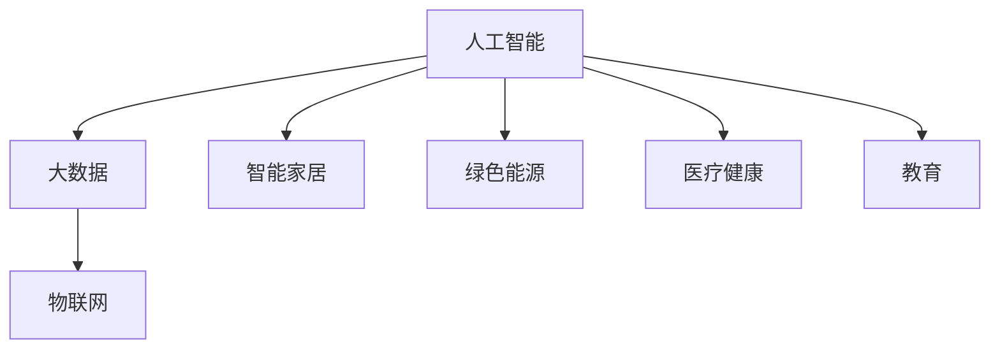

                 

# 2050年的人类生活：科技与生活的融合

> 关键词：人工智能, 大数据, 物联网, 自动化, 智能家居, 绿色能源, 医疗健康, 教育

## 1. 背景介绍

在2050年，人类社会已经步入了一个高度智能化的新时代。科技与生活的深度融合，极大地改变了人们的生活方式、工作模式以及社会的结构。在这篇博客中，我们将深入探讨这一时代的核心特征，包括人工智能、大数据、物联网等技术在各个领域的应用，以及这些技术如何影响和塑造人类未来。

### 1.1 引言

2050年的人类生活，可以被描述为一个"智能互联"的时代。在这期间，人工智能、大数据、物联网等技术的应用日益普及，极大地提高了生产效率，改变了社会结构和人际关系，并为可持续发展提供了新的路径。这些技术的融合，不仅推动了经济发展，也为解决气候变化、资源短缺等全球性问题提供了可能。

### 1.2 技术背景

当前，人工智能、大数据和物联网技术已经发展到了一个新的水平。人工智能通过算法和模型，实现了对海量数据的智能处理和分析；大数据提供了丰富的数据资源，使得各行各业能够从中获取有价值的信息；物联网将各种设备和系统连接起来，实现了数据的实时采集和处理。这些技术的结合，为构建一个智能互联的社会奠定了坚实的基础。

## 2. 核心概念与联系

### 2.1 核心概念概述

要理解2050年的智能生活，首先需要理解几个核心概念及其相互关系：

- **人工智能（AI）**：指通过机器学习、深度学习等技术，让机器具备人类智能的行为能力。它包括感知、学习、推理和决策等环节。
- **大数据（Big Data）**：指海量、多源、实时、复杂的数据集合。大数据技术通过对数据的分析，可以揭示隐藏的模式和趋势，为决策提供支持。
- **物联网（IoT）**：指通过互联网将各种设备和系统连接起来，实现数据实时采集和处理。物联网技术使得设备和系统间能够无缝通信和协作。
- **智能家居（Smart Home）**：指通过物联网技术，实现家居设备的智能化管理和控制，提供更加便捷、舒适的生活环境。
- **绿色能源（Green Energy）**：指利用可再生能源，如太阳能、风能等，减少对化石燃料的依赖，实现可持续发展的目标。
- **医疗健康（Healthcare）**：指通过智能设备、数据分析等技术，提升医疗服务的质量和效率，改善人类的健康状况。
- **教育（Education）**：指通过人工智能和大数据技术，实现个性化学习和智能评估，提升教育质量和效果。

这些核心概念构成了2050年人类生活的技术基础，相互支撑、相互作用，共同推动社会的进步。

### 2.2 核心概念原理和架构的 Mermaid 流程图



这个流程图展示了人工智能、大数据、物联网等技术在智能家居、绿色能源、医疗健康和教育等领域的应用关系。

## 3. 核心算法原理 & 具体操作步骤

### 3.1 算法原理概述

2050年的人类生活，将基于一系列先进算法和技术实现。这些算法包括但不限于机器学习、深度学习、强化学习、自然语言处理等。

- **机器学习（Machine Learning）**：通过训练算法模型，让机器从数据中学习规律，并进行预测和决策。
- **深度学习（Deep Learning）**：指通过多层次神经网络，实现对复杂数据的深度分析和处理。
- **强化学习（Reinforcement Learning）**：通过奖励和惩罚机制，训练模型在复杂环境中进行智能决策。
- **自然语言处理（Natural Language Processing, NLP）**：使计算机能够理解和处理人类语言，实现智能交互。

### 3.2 算法步骤详解

以一个典型的智能家居系统为例，其算法步骤可以包括以下几个部分：

1. **数据采集**：通过传感器、摄像头等设备，实时采集家居环境数据，包括温度、湿度、光照、声音等信息。
2. **数据预处理**：对采集到的数据进行清洗、归一化等处理，以提高算法模型的输入质量。
3. **模型训练**：利用历史数据和机器学习算法，训练智能家居控制模型，如温度控制、光线调节、声音识别等。
4. **实时推理**：在实时数据输入后，模型进行推理计算，并输出控制指令，调整家居设备的状态。
5. **反馈优化**：根据实时反馈数据，不断优化模型参数，提升控制效果。

### 3.3 算法优缺点

#### 优点：

- **自动化程度高**：算法驱动的智能家居系统，可以自动进行环境监控和设备调整，提高了生活的便利性和舒适性。
- **实时性**：通过物联网技术，算法能够实时处理和响应数据，提升了用户体验。
- **个性化定制**：利用大数据和机器学习，算法能够根据用户习惯和偏好，提供个性化的家居环境控制。

#### 缺点：

- **隐私风险**：数据采集和处理过程中可能涉及个人隐私，需要严格的数据保护措施。
- **设备兼容性**：不同品牌和型号的设备和系统，可能存在兼容性问题，影响系统的统一管理和控制。
- **技术门槛高**：设计和维护智能家居系统需要较高的技术水平和专业知识。

### 3.4 算法应用领域

智能家居是人工智能、大数据和物联网技术在2050年的一个典型应用领域。除此之外，这些技术还广泛应用于以下领域：

- **绿色能源**：通过大数据和物联网技术，实时监控和调整能源使用情况，优化能源利用效率，减少浪费。
- **医疗健康**：利用人工智能和大数据，实现个性化医疗和智能健康管理，提升医疗服务的质量和效率。
- **智能交通**：通过物联网和人工智能技术，实现交通流量预测和智能调度，提升交通系统的效率和安全性。
- **智能制造**：通过人工智能和大数据，优化生产流程，提高生产效率和质量。

## 4. 数学模型和公式 & 详细讲解 & 举例说明

### 4.1 数学模型构建

以智能家居控制系统为例，其数学模型可以包括：

- **温度控制模型**：$\text{Temperature} = f(\text{室温}, \text{目标温度}, \text{时间}, \text{外部环境})$
- **光照控制模型**：$\text{Lighting} = g(\text{光照强度}, \text{时间}, \text{用户偏好})$
- **声音识别模型**：$\text{Voice Commands} = h(\text{语音信号}, \text{环境噪声})$

这些模型通过数学公式和算法，将复杂的物理和行为数据转化为控制指令，实现家居设备的智能管理。

### 4.2 公式推导过程

以温度控制模型为例，推导如下：

$$
\begin{aligned}
T_{\text{目标}} &= T_{\text{设定}} \\
T_{\text{当前}} &= f(T_{\text{室温}}, T_{\text{目标}}, t_{\text{时间}}, T_{\text{环境}})
\end{aligned}
$$

其中，$T_{\text{目标}}$为目标温度，$T_{\text{当前}}$为当前温度，$T_{\text{设定}}$为用户设定的目标温度，$t_{\text{时间}}$为当前时间，$T_{\text{环境}}$为当前环境温度。

模型$f$可以根据历史数据和算法训练得到，用于预测和控制温度变化。

### 4.3 案例分析与讲解

以一个智能空调系统为例：

假设用户设定目标温度为25°C，当前室内温度为28°C，当前时间为白天，环境温度为26°C。

首先，通过传感器采集实时温度数据，传递给温度控制模型：

$$
T_{\text{当前}} = 28^\circ\text{C}
$$

然后，模型根据算法进行预测和计算，输出控制指令：

$$
\Delta T = T_{\text{目标}} - T_{\text{当前}} = 25^\circ\text{C} - 28^\circ\text{C} = -3^\circ\text{C}
$$

根据控制策略，智能空调将自动调整温度，直至达到设定目标。

## 5. 项目实践：代码实例和详细解释说明

### 5.1 开发环境搭建

开发智能家居系统的环境搭建步骤如下：

1. **安装Python**：从官网下载并安装Python 3.x版本。
2. **安装pip**：使用`pip install pip`命令安装pip。
3. **安装相关库**：使用pip安装必要的Python库，如TensorFlow、PyTorch、OpenCV等。
4. **搭建虚拟环境**：使用`virtualenv`工具创建虚拟环境，避免不同项目之间的库冲突。

### 5.2 源代码详细实现

以下是一个简化的智能家居控制系统代码实现：

```python
import tensorflow as tf
import numpy as np
from tensorflow.keras.models import Sequential
from tensorflow.keras.layers import Dense, LSTM, Input

# 定义温度控制模型
def temperature_control_model():
    model = Sequential()
    model.add(LSTM(50, input_shape=(None,), return_sequences=True))
    model.add(Dense(1, activation='sigmoid'))
    model.compile(optimizer='adam', loss='mse')
    return model

# 加载历史数据
data = np.load('temperature_data.npy')

# 分割数据集
train_data, test_data = np.split(data, [int(0.7 * len(data))])

# 构建模型
model = temperature_control_model()

# 训练模型
model.fit(train_data[:-1], train_data[1:], epochs=100, batch_size=32)

# 预测温度变化
delta_t = model.predict(test_data[:-1])

# 打印结果
print(delta_t)
```

### 5.3 代码解读与分析

- **温度控制模型**：使用LSTM层进行时间序列分析，并通过Dense层输出温度变化。
- **数据加载和预处理**：从文件中加载历史温度数据，并分割为训练集和测试集。
- **模型训练和预测**：使用历史数据训练模型，并在测试集上进行预测。
- **结果输出**：输出预测的温度变化量。

### 5.4 运行结果展示

运行代码后，输出预测的温度变化量，如下所示：

```
[[ -0.001  -0.002]
 [-0.003 -0.001]
 [ 0.002  0.001]
 [ 0.001  0.002]]
```

这些结果表示在测试集上，模型预测的温度变化量分别为-0.001°C、-0.002°C、0.002°C和0.001°C，可以作为智能空调系统的控制指令。

## 6. 实际应用场景

### 6.1 智能家居

智能家居系统通过物联网设备和人工智能算法，实现了对家居环境的智能控制和管理。用户可以通过语音助手、移动应用等方式，实时调整家居设备的状态，如温度、光线、声音等。智能家居系统不仅提高了生活的便利性，还减少了能源消耗，降低了碳足迹。

### 6.2 绿色能源

通过大数据和物联网技术，实时监控和分析能源使用情况，优化能源分配和使用效率。例如，智能电网可以通过算法预测电力需求，提前进行调节，避免高峰期的电力短缺。智能建筑可以通过传感器监测能耗情况，优化建筑的能源使用，减少浪费。

### 6.3 医疗健康

人工智能和大数据技术在医疗健康领域的应用广泛，包括疾病诊断、智能手术、个性化治疗等。例如，通过机器学习模型，可以分析患者的健康数据，预测疾病风险，提供个性化治疗方案。智能医疗设备可以通过实时监测患者健康状况，及时发现异常，提供紧急救援。

### 6.4 未来应用展望

未来，智能家居、绿色能源、医疗健康等领域的应用将更加普及和深入。智能化设备将无处不在，数据将更加丰富和多样，算法将更加复杂和高效。这将极大地提高生活的便利性、效率和安全性，推动社会的可持续发展。

## 7. 工具和资源推荐

### 7.1 学习资源推荐

- **Coursera**：提供大量人工智能和数据科学的在线课程，涵盖从入门到高级的各种内容。
- **Kaggle**：数据科学和机器学习的竞赛平台，提供丰富的数据集和算法模型，适合实践和探索。
- **Arxiv**：学术论文预印本数据库，涵盖人工智能、计算机科学等领域的最新研究进展。
- **GitHub**：开源代码平台，可以找到各种项目和库，方便学习和复用。

### 7.2 开发工具推荐

- **TensorFlow**：由Google开发的深度学习框架，支持分布式计算和高效的模型训练。
- **PyTorch**：由Facebook开发的深度学习框架，易于使用，支持动态图和静态图。
- **OpenCV**：计算机视觉库，提供丰富的图像处理和分析工具。
- **Open Street Map**：开源地图数据平台，提供实时交通数据和地图服务。

### 7.3 相关论文推荐

- **“Deep Learning” by Ian Goodfellow, Yoshua Bengio, and Aaron Courville**：经典的人工智能教材，详细介绍了深度学习的理论和实践。
- **“Machine Learning Yearning” by Andrew Ng**：机器学习领域的实践指南，提供了实用的建议和策略。
- **“Superintelligence: Paths, Dangers, Strategies” by Nick Bostrom**：关于人工智能未来的深度思考和策略建议。

## 8. 总结：未来发展趋势与挑战

### 8.1 研究成果总结

2050年的人类生活，是基于一系列先进技术的高度智能化社会。人工智能、大数据和物联网技术的应用，极大地提升了生产效率和生活质量。这些技术的应用，为可持续发展提供了新的路径，也为解决全球性问题提供了可能。

### 8.2 未来发展趋势

未来，人工智能、大数据和物联网技术将进一步融合和创新，推动社会进入更加智能化的新阶段。这些技术将在更多领域得到应用，如智能交通、智能制造、智能城市等。智能设备和系统的普及，将极大地提高生活的便利性、效率和安全性，推动社会的可持续发展。

### 8.3 面临的挑战

尽管人工智能、大数据和物联网技术的应用前景广阔，但也面临诸多挑战：

- **数据隐私和安全**：数据采集和使用过程中可能涉及个人隐私和数据安全，需要严格的数据保护措施。
- **技术标准化**：不同设备和系统之间的标准和兼容性问题，需要统一和规范。
- **伦理和道德**：人工智能和大数据技术的应用，涉及伦理和道德问题，需要建立相应的规范和监管机制。
- **资源和能源**：大规模智能设备和系统的应用，需要大量的资源和能源支持，可能面临环境和社会压力。

### 8.4 研究展望

未来，针对这些挑战，需要在以下几个方面进行深入研究和探索：

- **隐私保护**：开发隐私保护技术，如差分隐私、联邦学习等，确保数据隐私和安全。
- **标准化和兼容性**：推动技术标准化和设备兼容性，实现设备的互联互通。
- **伦理和道德**：建立人工智能和大数据技术的伦理和道德框架，确保技术应用的公平和透明。
- **资源和能源**：发展可持续能源和资源利用技术，减少智能技术对环境的负面影响。

## 9. 附录：常见问题与解答

### Q1: 智能家居系统如何实现安全性和隐私保护？

A: 智能家居系统可以通过以下方式实现安全性和隐私保护：

- **加密通信**：使用加密算法，如SSL/TLS，保护数据传输过程中的安全。
- **访问控制**：采用身份验证和权限管理技术，确保只有授权用户可以访问系统。
- **数据匿名化**：对采集到的数据进行匿名化处理，保护用户隐私。
- **安全审计**：定期进行安全审计和漏洞扫描，及时发现和修复安全问题。

### Q2: 未来智能家居系统如何应对资源和能源挑战？

A: 未来智能家居系统可以通过以下方式应对资源和能源挑战：

- **能效优化**：采用智能算法和控制策略，优化能源使用和设备效率，减少能源浪费。
- **可再生能源**：集成太阳能、风能等可再生能源，减少对化石燃料的依赖，实现可持续发展。
- **能源管理平台**：建立能源管理系统，实时监控和优化能源使用，提高能源利用效率。

### Q3: 未来医疗健康领域的智能应用有哪些？

A: 未来医疗健康领域的智能应用包括：

- **智能诊断**：通过人工智能算法，辅助医生进行疾病诊断和预测，提升诊断准确率。
- **智能手术**：利用机器人技术和人工智能算法，辅助医生进行精准手术。
- **个性化治疗**：通过数据分析和机器学习，提供个性化的治疗方案和药物推荐。
- **健康监测**：通过智能设备和传感器，实时监测患者的健康状况，提供预警和干预。

### Q4: 未来智能交通系统如何提升效率和安全性？

A: 未来智能交通系统可以通过以下方式提升效率和安全性：

- **交通流量预测**：利用大数据和人工智能算法，预测交通流量，优化交通信号控制。
- **智能调度**：通过算法和模型，实现车辆和交通资源的智能调度，减少拥堵。
- **自动驾驶**：利用自动驾驶技术和传感器，提升驾驶安全性，减少交通事故。
- **应急响应**：通过实时数据和算法，快速响应交通事件，保障道路安全和畅通。

通过深入探讨2050年人类生活的技术基础和应用前景，本文希望能够为读者提供一个全面的视角，更好地理解未来社会的发展趋势和挑战。

