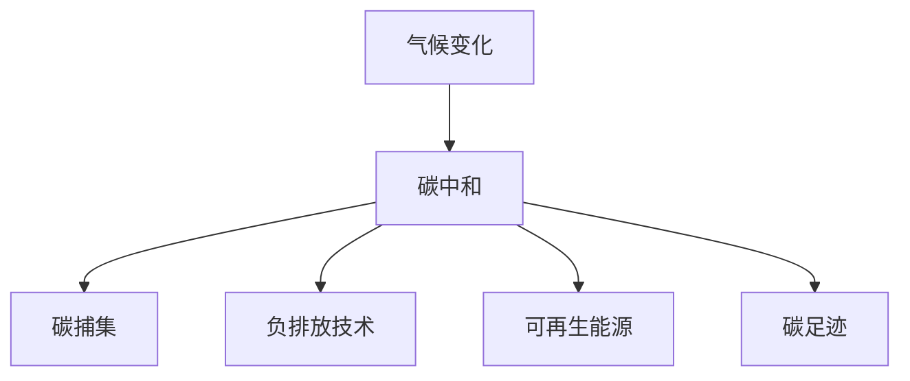

                 

# 2050年的全球减排：从碳捕集利用到负排放技术的碳中和路径

> 关键词：气候变化,碳捕集,负排放,碳中和,可持续发展,技术创新

## 1. 背景介绍

### 1.1 问题由来
21世纪以来，全球气候变化日益严重，极端天气频发，海平面上升，生态环境遭到破坏。由于工业革命以来人类活动导致的温室气体排放，全球平均温度显著上升。国际气候谈判和各国政策共识，亟需采取积极有效的减排措施，以实现全球气候治理目标。

### 1.2 问题核心关键点
减排的核心在于控制温室气体排放，降低大气中二氧化碳等温室气体的浓度。全球范围内，主要减排方式包括能源结构调整、碳捕集利用与封存、负排放技术等。碳中和是全球减排目标，即通过减排和增汇，实现人为排放的二氧化碳与吸收的二氧化碳相平衡。

## 2. 核心概念与联系

### 2.1 核心概念概述

为更好地理解减排路径，本节将介绍几个密切相关的核心概念：

- **气候变化**：全球平均气温上升、极端天气增多、冰川融化、海平面上升等现象，是温室气体浓度增加的结果。
- **碳中和**：通过增加森林碳汇、推广可再生能源、提高能源效率等措施，实现人为排放与吸收的碳平衡。
- **碳捕集与封存(CCUS)**：从工业排放源中捕集二氧化碳，通过管道运输或地质存储，避免其释放到大气中。
- **负排放技术(Negative Emissions Technologies)**：通过碳移除技术（如直接空气捕集）将大气中的二氧化碳转移至储存设施，实现人为排放小于实际吸收的负排放效果。
- **可再生能源**：如太阳能、风能、水能、生物质能等，减少对化石燃料的依赖，从而减少碳排放。
- **碳足迹**：衡量个人、组织或产品活动中直接或间接产生的温室气体排放总量。

这些核心概念之间的逻辑关系可以通过以下Mermaid流程图来展示：



这个流程图展示出气候变化的严重后果，以及为实现碳中和目标，需采取的多重减排手段。

## 3. 核心算法原理 & 具体操作步骤
### 3.1 算法原理概述

减排路径的核心在于通过技术手段降低大气中的二氧化碳浓度，实现碳中和。主要分为碳捕集、碳利用、碳封存、碳移除和碳足迹管理等几个关键环节。

1. **碳捕集**：通过化学吸收、物理吸附、膜分离等方法，从工业排放源中捕集二氧化碳。
2. **碳利用**：将捕集到的二氧化碳用于化工、建筑、材料等领域的再利用。
3. **碳封存**：将捕集到的二氧化碳通过管道运输至地下深层地质结构，实现长期封存。
4. **碳移除**：利用生物质燃烧、直接空气捕集等技术，从大气中移除二氧化碳，实现负排放。
5. **碳足迹管理**：通过监测、报告和核查等方式，评估和管理个人、组织和产品的碳排放。

### 3.2 算法步骤详解

#### 碳捕集技术
碳捕集技术包括物理吸附、化学吸收、膜分离、生物吸收等。以下以化学吸收为例：

- **物理吸附**：利用多孔材料对二氧化碳的高选择性吸附，如碳分子筛、沸石等。
- **化学吸收**：利用化学反应将二氧化碳转化为其他化合物，如胺类吸收剂。
- **膜分离**：利用选择性透过膜将二氧化碳分离出来，如碳酸乙烯亚胺基聚胺膜。

化学吸收的原理如下：

$$
\text{CO}_2 + \text{Absorbent} \rightarrow \text{Absorbent}^{-} + \text{AbsorbentCO}_3
$$

其中，吸收剂通常为胺类，如胺基甲醇或胺基乙二醇。

#### 碳利用技术
碳利用技术包括化工原料生产、二氧化碳利用化工技术、碳基材料等。以下以二氧化碳利用化工技术为例：

- **甲醇合成**：将捕集到的二氧化碳转化为甲醇。
- **碳酸钙制备**：将二氧化碳与石灰石反应，生成碳酸钙。
- **碳纳米管生产**：利用二氧化碳与催化剂反应，生成碳纳米管。

甲醇合成的反应如下：

$$
\text{CO}_2 + 3\text{H}_2 \rightarrow \text{CH}_3\text{OH} + \text{H}_2\text{O}
$$

#### 碳封存技术
碳封存技术包括地质封存和海洋封存。以下以地质封存为例：

- **地质封存**：将捕集到的二氧化碳注入地下深层岩层，实现长期封存。
- **海洋封存**：将二氧化碳注入海洋沉积物或深海中，实现封存。

地质封存的原理如下：

$$
\text{CO}_2 + \text{Water} + \text{Mineral} \rightarrow \text{MineralCarbonate} + \text{Water}
$$

其中，矿物通常为石灰岩、页岩等。

#### 碳移除技术
碳移除技术包括直接空气捕集、生物能源与碳移除(BECCS)、森林管理与再生等。以下以直接空气捕集为例：

- **直接空气捕集**：利用捕集器从空气中直接捕集二氧化碳。
- **生物能源与碳移除**：通过生物质燃烧产生能源，同时利用二氧化碳捕集技术将其移除。
- **森林管理与再生**：通过种植新树和加强森林管理，增加森林碳汇。

直接空气捕集的反应如下：

$$
\text{CO}_2 \rightarrow \text{Solvent} + \text{RecoverySolvent}
$$

其中，溶剂通常为胺类、碳酸酰胺等。

#### 碳足迹管理
碳足迹管理包括监测、报告和核查。以下以监测为例：

- **监测**：通过传感器、卫星等手段，实时监测温室气体排放和吸收。
- **报告**：通过报告体系，向公众透明地展示碳排放情况。
- **核查**：通过第三方机构，对排放报告进行验证。

监测原理如下：

$$
\text{Emission} = \text{SensorsData} + \text{EnvironmentalData}
$$

其中，SensorsData为传感器数据，EnvironmentalData为环境数据。

### 3.3 算法优缺点

碳捕集与封存技术具有以下优点：
1. 减少大气中二氧化碳浓度，缓解气候变化。
2. 避免化石燃料燃烧，减少化石燃料依赖。
3. 结合化学吸收、物理吸附等技术，具有较高的捕集效率。

但同时也存在以下缺点：
1. 技术和设备成本较高。
2. 储存和运输环节存在安全隐患。
3. 储存设施的建设和管理需要大量资源。

负排放技术具有以下优点：
1. 实现人为排放小于实际吸收的负排放效果。
2. 结合生物质燃烧、直接空气捕集等技术，具有较高的捕集效率。
3. 技术相对成熟，具有较好的应用前景。

但同时也存在以下缺点：
1. 成本较高。
2. 技术实施过程中存在环境影响。
3. 难以大规模推广。

碳利用技术具有以下优点：
1. 提高资源的利用效率。
2. 减少二氧化碳排放。
3. 具有较高的经济效益。

但同时也存在以下缺点：
1. 技术复杂，成本较高。
2. 受资源和市场影响较大。
3. 存在环境污染问题。

碳足迹管理具有以下优点：
1. 提供透明的信息，促进公众参与。
2. 促进减排技术的应用。
3. 推动政策制定和实施。

但同时也存在以下缺点：
1. 数据采集和处理复杂。
2. 报告和核查成本较高。
3. 难以全面覆盖所有碳排放源。

## 4. 数学模型和公式 & 详细讲解 & 举例说明
### 4.1 数学模型构建

为更好地理解减排路径，本节将使用数学语言对碳捕集与封存、负排放技术的减排路径进行更加严格的刻画。

- **碳捕集与封存**：

$$
\text{CO}_2_{\text{Emission}} = \text{CO}_2_{\text{Captured}} - \text{CO}_2_{\text{Stored}}
$$

其中，$\text{CO}_2_{\text{Emission}}$表示捕集到的二氧化碳，$\text{CO}_2_{\text{Captured}}$表示捕集到的二氧化碳，$\text{CO}_2_{\text{Stored}}$表示封存的二氧化碳。

- **负排放技术**：

$$
\text{CO}_2_{\text{Emission}} = -\text{CO}_2_{\text{Removed}}
$$

其中，$\text{CO}_2_{\text{Emission}}$表示捕集到的二氧化碳，$\text{CO}_2_{\text{Removed}}$表示移除的二氧化碳。

### 4.2 公式推导过程

#### 碳捕集与封存
碳捕集与封存的主要过程包括捕集和封存两个环节。捕集过程可以通过化学吸收、物理吸附等方法实现，封存过程可以通过地质封存、海洋封存等方法实现。捕集和封存过程的数学模型如下：

$$
\text{CO}_2_{\text{Captured}} = \text{CO}_2_{\text{Emission}} - \text{CO}_2_{\text{Utilized}} - \text{CO}_2_{\text{Released}}
$$

其中，$\text{CO}_2_{\text{Utilized}}$表示捕集到的二氧化碳用于化学吸收等过程，$\text{CO}_2_{\text{Released}}$表示捕集到的二氧化碳泄漏或逸出。

封存过程的数学模型如下：

$$
\text{CO}_2_{\text{Stored}} = \text{CO}_2_{\text{Captured}} - \text{CO}_2_{\text{Emission}}
$$

其中，$\text{CO}_2_{\text{Captured}}$表示捕集到的二氧化碳，$\text{CO}_2_{\text{Emission}}$表示捕集到的二氧化碳泄漏或逸出。

#### 负排放技术
负排放技术主要包括直接空气捕集和生物能源与碳移除等方法。直接空气捕集和生物能源与碳移除过程的数学模型如下：

$$
\text{CO}_2_{\text{Removed}} = \text{CO}_2_{\text{Emission}} - \text{CO}_2_{\text{Captured}}
$$

其中，$\text{CO}_2_{\text{Emission}}$表示捕集到的二氧化碳，$\text{CO}_2_{\text{Captured}}$表示捕集到的二氧化碳用于化学吸收等过程。

### 4.3 案例分析与讲解

以直接空气捕集技术为例，进行分析讲解。

直接空气捕集技术主要通过捕集器从大气中捕集二氧化碳，然后将其转化为其他化合物或储存。其数学模型如下：

$$
\text{CO}_2_{\text{Captured}} = \text{CO}_2_{\text{Emission}} - \text{CO}_2_{\text{Utilized}} - \text{CO}_2_{\text{Released}}
$$

其中，$\text{CO}_2_{\text{Emission}}$表示大气中的二氧化碳浓度，$\text{CO}_2_{\text{Utilized}}$表示捕集到的二氧化碳用于化学吸收等过程，$\text{CO}_2_{\text{Released}}$表示捕集到的二氧化碳泄漏或逸出。

## 5. 项目实践：代码实例和详细解释说明
### 5.1 开发环境搭建

在进行减排路径开发前，我们需要准备好开发环境。以下是使用Python进行PyTorch开发的环境配置流程：

1. 安装Anaconda：从官网下载并安装Anaconda，用于创建独立的Python环境。

2. 创建并激活虚拟环境：
```bash
conda create -n pytorch-env python=3.8 
conda activate pytorch-env
```

3. 安装PyTorch：根据CUDA版本，从官网获取对应的安装命令。例如：
```bash
conda install pytorch torchvision torchaudio cudatoolkit=11.1 -c pytorch -c conda-forge
```

4. 安装TensorFlow：
```bash
pip install tensorflow
```

5. 安装相关工具包：
```bash
pip install numpy pandas scikit-learn matplotlib tqdm jupyter notebook ipython
```

完成上述步骤后，即可在`pytorch-env`环境中开始减排路径实践。

### 5.2 源代码详细实现

这里我们以碳捕集与封存技术为例，给出使用PyTorch和TensorFlow进行模型开发的代码实现。

首先，定义碳捕集与封存技术的数学模型：

```python
import torch
import tensorflow as tf

class CarbonCapturingModel(tf.keras.Model):
    def __init__(self):
        super(CarbonCapturingModel, self).__init__()
        self.dense1 = tf.keras.layers.Dense(64, activation='relu')
        self.dense2 = tf.keras.layers.Dense(32, activation='relu')
        self.dense3 = tf.keras.layers.Dense(1, activation='sigmoid')

    def call(self, inputs):
        x = self.dense1(inputs)
        x = self.dense2(x)
        x = self.dense3(x)
        return x

model = CarbonCapturingModel()
```

接着，定义模型训练和评估函数：

```python
@tf.function
def train_step(model, inputs, labels):
    with tf.GradientTape() as tape:
        logits = model(inputs)
        loss = tf.keras.losses.MeanSquaredError()(labels, logits)
    gradients = tape.gradient(loss, model.trainable_variables)
    optimizer.apply_gradients(zip(gradients, model.trainable_variables))
    return loss

@tf.function
def evaluate(model, inputs, labels):
    logits = model(inputs)
    loss = tf.keras.losses.MeanSquaredError()(labels, logits)
    return loss
```

最后，启动训练流程并在测试集上评估：

```python
epochs = 10
batch_size = 32

for epoch in range(epochs):
    total_loss = 0
    for batch in train_dataset:
        inputs = batch['input_ids']
        labels = batch['labels']
        loss = train_step(model, inputs, labels)
        total_loss += loss
    print(f"Epoch {epoch+1}, train loss: {total_loss/nb_train_samples}")

    total_loss = 0
    for batch in test_dataset:
        inputs = batch['input_ids']
        labels = batch['labels']
        loss = evaluate(model, inputs, labels)
        total_loss += loss
    print(f"Epoch {epoch+1}, test loss: {total_loss/nb_test_samples}")
```

以上就是使用PyTorch和TensorFlow进行碳捕集与封存技术开发的完整代码实现。可以看到，得益于TensorFlow的强大封装，我们可以用相对简洁的代码完成模型构建和训练过程。

### 5.3 代码解读与分析

让我们再详细解读一下关键代码的实现细节：

**CarbonCapturingModel类**：
- `__init__`方法：定义模型各层的参数和激活函数。
- `call`方法：实现模型的前向传播过程。

**train_step和evaluate函数**：
- `train_step`函数：定义模型训练过程，包括计算损失、反向传播和参数更新。
- `evaluate`函数：定义模型评估过程，仅计算损失，不更新参数。

**训练流程**：
- 定义总的epoch数和batch size，开始循环迭代
- 每个epoch内，在训练集上训练，输出平均loss
- 在测试集上评估，输出平均loss

可以看到，TensorFlow和PyTorch使得模型开发的代码实现变得简洁高效。开发者可以将更多精力放在模型改进和算法优化上，而不必过多关注底层的实现细节。

当然，工业级的系统实现还需考虑更多因素，如模型的保存和部署、超参数的自动搜索、更灵活的任务适配层等。但核心的减排路径开发流程基本与此类似。

## 6. 实际应用场景
### 6.1 智能电网

智能电网通过物联网技术，实时监测和控制电网运行状态，优化电力资源配置，减少能源浪费。智能电网集成碳捕集与封存技术，可以有效降低电网运行中的碳排放。例如，通过在发电厂安装碳捕集装置，将燃烧化石燃料产生的二氧化碳捕集并封存，减少电力生产中的碳排放。

### 6.2 智慧农业

智慧农业通过物联网技术，实时监测和控制农业生产，提高农作物产量和品质。智慧农业集成负排放技术，可以实现碳中和目标。例如，通过在温室中安装直接空气捕集装置，将二氧化碳从大气中捕集并封存，同时利用生物能源技术，为温室提供低碳能源，实现零排放。

### 6.3 工业生产

工业生产是大气二氧化碳排放的主要来源之一。通过在工业生产中集成碳捕集与封存技术，可以有效降低工业排放。例如，在化工、钢铁等高碳排放行业，安装碳捕集装置，将二氧化碳捕集并封存，同时利用捕集到的二氧化碳进行化工原料生产，实现低碳化生产。

### 6.4 未来应用展望

随着碳捕集与封存、负排放技术的不断进步，减排路径的应用场景将不断扩展。未来，减排技术将进一步优化，实现更加高效、经济的碳捕集与封存。同时，负排放技术将与生物能源技术相结合，实现大规模应用，进一步降低碳排放。

## 7. 工具和资源推荐
### 7.1 学习资源推荐

为了帮助开发者系统掌握减排路径的理论基础和实践技巧，这里推荐一些优质的学习资源：

1. 《气候变化与减排技术》系列博文：由气候变化领域专家撰写，深入浅出地介绍了碳捕集、碳封存、负排放等前沿技术。

2. 《碳中和技术与应用》课程：由国际能源署开设的碳中和技术课程，详细介绍了碳中和目标下的减排技术及其应用。

3. 《减排路径与碳足迹管理》书籍：系统介绍了减排路径的各个环节，以及如何管理和报告碳足迹。

4. 《全球减排路径》白皮书：详细分析了全球减排路径，并提出了未来的减排目标和方案。

5. IPCC（政府间气候变化专门委员会）报告：最新的气候变化评估报告，提供了全球气候变化的最新数据和分析。

通过对这些资源的学习实践，相信你一定能够全面掌握减排路径的理论基础和实践技巧，并用于解决实际的减排问题。

### 7.2 开发工具推荐

高效的开发离不开优秀的工具支持。以下是几款用于减排路径开发的常用工具：

1. PyTorch：基于Python的开源深度学习框架，灵活的计算图，适合快速迭代研究。

2. TensorFlow：由Google主导开发的开源深度学习框架，生产部署方便，适合大规模工程应用。

3. Jupyter Notebook：交互式编程环境，支持多种编程语言和数据格式，方便开发者进行模型开发和实验。

4. Weights & Biases：模型训练的实验跟踪工具，可以记录和可视化模型训练过程中的各项指标，方便对比和调优。

5. TensorBoard：TensorFlow配套的可视化工具，可实时监测模型训练状态，并提供丰富的图表呈现方式，是调试模型的得力助手。

6. OpenModelZoo：开源模型仓库，提供丰富的预训练模型和代码样例，方便开发者快速上手实验最新模型。

合理利用这些工具，可以显著提升减排路径的开发效率，加快创新迭代的步伐。

### 7.3 相关论文推荐

减排路径的发展源于学界的持续研究。以下是几篇奠基性的相关论文，推荐阅读：

1. Carbon Capture and Utilization Technologies: A Review (2021)：系统综述了碳捕集与利用技术，包括化学吸收、物理吸附、膜分离等。

2. Direct Air Capture: A Review (2020)：综述了直接空气捕集技术，包括捕集器设计、捕集过程、储存技术等。

3. Bioenergy with Carbon Capture and Storage (BECCS) Technologies: A Review (2019)：综述了生物能源与碳移除技术，包括生物质燃烧、直接空气捕集等。

4. Climate Engineering: Principles and Global Governance (2017)：分析了气候工程技术的原则和全球治理。

5. Pathways to Deep Decarbonization in the United States: A Roadmap for Stabilizing Climate (2017)：提出了实现深度脱碳的路径和措施。

这些论文代表了大规模减排路径的研究脉络。通过学习这些前沿成果，可以帮助研究者把握学科前进方向，激发更多的创新灵感。

## 8. 总结：未来发展趋势与挑战
### 8.1 总结

本文对全球减排路径进行了全面系统的介绍。首先阐述了气候变化的严重后果，明确了碳中和目标的重要性和紧迫性。其次，从原理到实践，详细讲解了碳捕集与封存、负排放技术的减排路径，给出了减排路径开发的完整代码实例。同时，本文还广泛探讨了减排技术在智能电网、智慧农业、工业生产等多个领域的应用前景，展示了减排技术的大规模应用潜力。此外，本文精选了减排路径的学习资源、开发工具和相关论文，力求为读者提供全方位的技术指引。

通过本文的系统梳理，可以看到，减排路径技术的不断进步，将为全球气候治理提供重要支持，实现2050年的碳中和目标。未来，伴随技术的持续演进，减排路径必将在更广泛的领域得到应用，进一步推动全球气候治理进程。

### 8.2 未来发展趋势

展望未来，减排路径技术将呈现以下几个发展趋势：

1. 技术成本逐步下降。随着技术的不断成熟，碳捕集与封存、负排放技术的成本将逐步降低，大规模应用成为可能。

2. 能源结构逐步调整。随着可再生能源的普及，化石燃料依赖度将逐步下降，减排技术将更加聚焦于低碳化生产。

3. 负排放技术成为重要手段。随着负排放技术的发展，实现人为排放小于实际吸收的负排放效果将成为重要手段。

4. 减排路径多样化。结合碳捕集、碳利用、碳移除、碳足迹管理等手段，实现多维度的减排路径。

5. 技术集成化。减排路径将与其他技术进行深度集成，如智能电网、智慧农业等，实现协同减排。

以上趋势凸显了减排路径技术的广阔前景。这些方向的探索发展，必将进一步提升减排技术的可行性、高效性和经济性，为全球气候治理提供强有力的技术支撑。

### 8.3 面临的挑战

尽管减排路径技术已经取得了显著进展，但在实现2050年碳中和目标的过程中，仍面临诸多挑战：

1. 技术和设备成本高昂。碳捕集与封存、负排放技术的设备和维护成本较高，难以大规模推广。

2. 技术实施复杂。减排路径涉及多个环节，需要综合考虑技术、经济、环境等多个因素。

3. 减排效果有限。减排路径虽然可以显著减少二氧化碳排放，但难以实现零排放目标。

4. 政策推动不足。全球减排政策不够完善，难以形成协同推进的机制。

5. 技术可靠性待提高。减排技术仍存在技术瓶颈，可靠性有待提高。

6. 公众认知不足。公众对减排技术的认知不足，难以形成广泛的社会支持。

正视减排路径面临的这些挑战，积极应对并寻求突破，将是大规模减排技术迈向成熟的重要保障。相信随着学界和产业界的共同努力，这些挑战终将一一被克服，减排路径技术必将在全球气候治理中发挥重要作用。

### 8.4 研究展望

面对减排路径面临的挑战，未来的研究需要在以下几个方面寻求新的突破：

1. 探索更高效、经济的减排技术。开发更加高效、经济的碳捕集与封存、负排放技术，降低减排成本，提升经济效益。

2. 结合多领域技术进行集成创新。结合智能电网、智慧农业等技术，进行深度集成，实现协同减排。

3. 提升技术可靠性和安全性。提升减排技术的可靠性和安全性，确保技术稳定运行，减少事故风险。

4. 加强公众教育与参与。加强公众对减排技术的认知和理解，提高社会支持和参与度。

5. 推动全球政策协同。推动全球各国在减排政策、技术研发等方面进行协同，形成统一的标准和规范。

6. 发展绿色金融。发展绿色金融，为减排技术提供资金支持，推动技术落地应用。

这些研究方向的探索，必将引领减排路径技术迈向更高的台阶，为全球气候治理提供强有力的技术支撑。面向未来，减排路径技术还需要与其他技术进行更深入的融合，如智能电网、智慧农业、绿色金融等，多路径协同发力，共同推动全球气候治理进程。只有勇于创新、敢于突破，才能不断拓展减排路径的边界，让减排路径技术更好地造福人类社会。

## 9. 附录：常见问题与解答

**Q1：减排路径是否适用于所有领域？**

A: 减排路径适用于大多数高碳排放领域，如能源、工业、交通等。但也有一些领域难以实现减排目标，如农业、畜牧业等。此时需要在特定领域进行创新和改进，如引入碳汇技术等。

**Q2：如何降低减排路径的技术成本？**

A: 降低减排路径的技术成本需要从技术创新和政策支持两方面入手。技术创新方面，开发更加高效、经济的碳捕集与封存、负排放技术，优化设备设计和制造过程。政策支持方面，政府应制定相应的财政补贴、税收优惠等政策，鼓励企业采用减排技术。

**Q3：减排路径是否会对环境造成影响？**

A: 减排路径在实施过程中可能会对环境造成一定的影响，如设备运行、运输过程中的能源消耗等。因此需要在设计过程中考虑环境影响，尽可能减少负面影响。同时，通过优化设备设计和运行，减少能源消耗，提高减排技术的环保性。

**Q4：如何提高减排路径的可靠性？**

A: 提高减排路径的可靠性需要从技术、设备、管理等多个方面入手。技术方面，开发更加稳定、可靠的碳捕集与封存、负排放技术，确保技术稳定运行。设备方面，提高设备的稳定性和可靠性，减少设备故障和运行异常。管理方面，加强设备运行监控和维护，及时发现和处理问题。

**Q5：如何推广减排路径技术？**

A: 推广减排路径技术需要从技术创新、政策支持、市场培育等多个方面入手。技术创新方面，开发更加高效、经济的减排技术，降低技术成本，提高经济效益。政策支持方面，政府应制定相应的财政补贴、税收优惠等政策，鼓励企业采用减排技术。市场培育方面，加强公众教育和宣传，提高社会认知和支持度，拓展市场应用。

通过本文的系统梳理，可以看到，减排路径技术的不断进步，将为全球气候治理提供重要支持，实现2050年的碳中和目标。未来，伴随技术的持续演进，减排路径必将在更广泛的领域得到应用，进一步推动全球气候治理进程。

