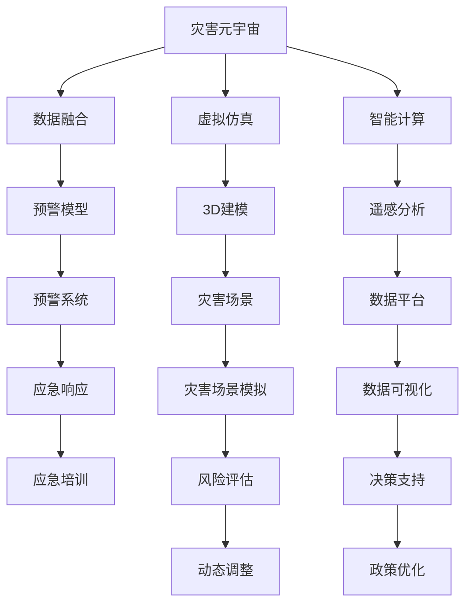

                 

# 2050年的全球减灾：从灾害元宇宙到全球减灾合作的减灾体系升级

## 1. 背景介绍

### 1.1 问题由来
随着全球气候变化和人类活动的加剧，自然灾害频发且破坏性增强。如何在灾害发生前有效预防，灾害发生时迅速响应，灾害发生后及时恢复，成为人类面临的重大挑战。传统的灾害管理方法往往依赖于单一机构独立运作，难以应对复杂多变的灾害形势。

近年来，基于人工智能、物联网、区块链等前沿技术，提出了元宇宙概念。元宇宙作为虚拟与现实的深度融合，具备高度模拟性和互动性，为灾害管理提供了一种全新视角。同时，全球减灾合作日益成为各国共识，如何构建高效的国际减灾体系，提升全球灾害应对能力，成为国际社会关注的焦点。

### 1.2 问题核心关键点
本文聚焦于如何通过构建灾害元宇宙，结合全球减灾合作机制，实现灾害风险预判、预警与应急响应的一体化管理，助力全球灾害治理体系升级。关键点包括：

1. 灾害元宇宙的构建及其在灾害预判、预警、响应中的作用。
2. 全球减灾合作机制的建立，确保各国的资源共享、信息互通和协同响应。
3. 通过数据驱动和智能计算，实现灾害风险评估和动态调整。
4. 利用区块链等技术，保障灾害数据的安全透明和多方协同。
5. 建立国际减灾标准和协议，提升全球减灾效率和效果。

## 2. 核心概念与联系

### 2.1 核心概念概述

为更好地理解本文的主题，我们先梳理几个关键概念：

- **灾害元宇宙(DISasterMetaverse, DM)**：利用虚拟现实、增强现实和数字孪生等技术，构建一个虚拟的灾害场景，包括气象、地质、火灾等多种灾害类型，用于灾害风险预判、预警、响应和后评估等。灾害元宇宙可以模拟复杂灾害场景，提供高效的灾害应对和应急培训。

- **灾害元宇宙关键技术**：包括虚拟仿真、3D建模、遥感分析、数据融合、智能计算等。这些技术共同构成了灾害元宇宙的底层支撑。

- **全球减灾合作机制(GRC, Global Red Cross Cooperation)**：指各国通过签订协议、建立组织、开展合作等方式，共同提升全球减灾能力，确保资源、技术和经验的共享。全球减灾合作机制是构建灾害元宇宙的国际框架。

- **数据驱动决策**：利用大数据、云计算和AI等技术，对灾害数据进行分析和预测，为灾害应对和决策提供数据支持。数据驱动决策可以提升灾害响应的精准度和效率。

- **区块链技术(BT, Blockchain Technology)**：通过去中心化、透明化的分布式账本技术，确保灾害数据的真实性和可追溯性，保障各方协同合作的信息安全和信任基础。

这些概念之间的联系可以通过以下Mermaid流程图来展示：



这个流程图展示了大语言模型的核心概念及其之间的关系：

1. 灾害元宇宙通过虚拟仿真、3D建模、遥感分析等技术，构建灾害场景和预警模型。
2. 数据融合、智能计算等技术将各类数据整合并进行实时分析，提升预警系统精度。
3. 预警系统通过数据可视化、风险评估等手段，为应急响应提供决策支持。
4. 应急响应结合区块链技术，确保数据安全和多方协同。
5. 政策优化通过数据驱动决策，提升全球减灾合作效率。

## 3. 核心算法原理 & 具体操作步骤
### 3.1 算法原理概述

基于灾害元宇宙的全球减灾合作机制，可以视为一种跨领域、跨机构的协同合作算法。其核心思想是利用数据驱动和智能计算，结合灾害元宇宙的虚拟仿真和智能决策，实现灾害风险的预判、预警与应急响应的协同管理。

具体而言，算法分为以下几个步骤：

1. **数据收集与融合**：利用遥感卫星、物联网、社交媒体等多种数据源，收集实时动态的灾害数据，并进行融合处理。
2. **虚拟仿真与场景模拟**：通过虚拟仿真技术，构建灾害场景，模拟灾害发生和发展过程，评估灾害风险。
3. **智能计算与预警模型**：利用机器学习和深度学习算法，建立预警模型，对灾害风险进行预测和预警。
4. **应急响应与协同合作**：结合区块链技术，确保数据安全和透明，实现各方协同响应。
5. **动态调整与政策优化**：根据实时数据和预警结果，动态调整灾害应对策略，优化全球减灾政策。

### 3.2 算法步骤详解

**Step 1: 数据收集与融合**
- 利用卫星遥感、传感器、社交媒体等多种数据源，收集实时动态的灾害数据。
- 通过数据清洗、标准化处理，将不同来源的数据融合，形成统一格式。

**Step 2: 虚拟仿真与场景模拟**
- 使用虚拟仿真技术，构建虚拟的灾害场景，模拟不同类型和规模的灾害事件。
- 通过3D建模技术，对灾害场景进行可视化展示，便于决策和培训。

**Step 3: 智能计算与预警模型**
- 利用机器学习算法，如随机森林、神经网络等，对融合后的数据进行训练，建立预警模型。
- 引入深度学习技术，如卷积神经网络(CNN)、循环神经网络(RNN)等，提升预警模型的精度和泛化能力。

**Step 4: 应急响应与协同合作**
- 通过区块链技术，建立去中心化的数据平台，确保灾害数据的透明和可追溯性。
- 设计分布式算法，实现各方的协同响应和资源共享。

**Step 5: 动态调整与政策优化**
- 根据预警结果和实际响应效果，动态调整灾害应对策略。
- 利用大数据分析，评估政策效果，优化全球减灾合作机制。

### 3.3 算法优缺点

基于灾害元宇宙的全球减灾合作机制具有以下优点：
1. 综合性强。结合了虚拟仿真、智能计算和数据驱动等多种技术，能够全面评估和应对灾害。
2. 协同高效。通过区块链技术，确保各方数据的透明和可信，提升协同效率。
3. 动态灵活。通过实时数据分析和预警，动态调整灾害应对策略，适应不断变化的灾害形势。
4. 可视化直观。利用虚拟仿真技术，对灾害场景进行可视化展示，便于决策和培训。

同时，该机制也存在一些局限性：
1. 技术复杂度高。涉及多种技术融合和跨领域协作，技术难度较大。
2. 数据质量依赖度高。数据融合和预警模型的精度，依赖于数据源的多样性和实时性。
3. 数据安全和隐私问题。大规模数据共享可能引发隐私和安全问题。
4. 合作机制复杂。涉及多国、多机构，协调成本高。

### 3.4 算法应用领域

基于灾害元宇宙的全球减灾合作机制，已经在多个实际应用场景中取得了初步成效，包括：

- **自然灾害预警**：如地震、台风、洪水等。通过虚拟仿真技术，模拟灾害发展过程，提前预警。
- **社会灾害应急响应**：如火灾、疫情等。利用数据驱动决策，优化应急资源配置，提升响应速度和效率。
- **灾后重建与恢复**：通过虚拟仿真技术，模拟灾后重建方案，评估效果，指导实际恢复工作。
- **应急培训与演练**：利用灾害元宇宙进行模拟训练，提升应急人员应对复杂灾害的能力。

未来，基于灾害元宇宙的全球减灾合作机制将进一步拓展到更多领域，助力全球灾害治理体系的升级。

## 4. 数学模型和公式 & 详细讲解
### 4.1 数学模型构建

本节将使用数学语言对基于灾害元宇宙的全球减灾合作机制进行更加严格的刻画。

假设灾害元宇宙中包含 $N$ 个不同类型的灾害，每个灾害对应的风险评估模型为 $R_i$，其中 $i \in \{1,2,...,N\}$。设 $D_t$ 为时间 $t$ 的实时动态数据，$M_t$ 为时间 $t$ 的预测模型输出。则灾害预警模型可以表示为：

$$
P_i = \max\{R_i(D_t), 0\}
$$

其中 $P_i$ 表示第 $i$ 类灾害在时间 $t$ 的预警概率。

### 4.2 公式推导过程

为了构建更复杂的预警模型，假设 $R_i(D_t)$ 为一个随机变量，其分布为 $F_i(D_t)$。则预警概率 $P_i$ 的数学期望可以表示为：

$$
E[P_i] = \mathbb{E}[\max\{R_i(D_t), 0\}] = \int_0^\infty (1-F_i(x)) dx
$$

利用蒙特卡洛方法，可以得到预警概率的数值估计：

$$
P_i^{MC} = \frac{1}{M} \sum_{m=1}^M \max\{R_i(D_t^m), 0\}
$$

其中 $M$ 为采样次数。

### 4.3 案例分析与讲解

**案例分析**：某地发生地震，利用灾害元宇宙进行预警和响应。

1. **数据收集与融合**：
   - 利用卫星遥感数据、地震监测仪、社交媒体等多种数据源，收集实时动态数据。
   - 通过数据清洗和标准化处理，将不同来源的数据融合，形成统一格式。

2. **虚拟仿真与场景模拟**：
   - 使用虚拟仿真技术，构建虚拟的地震场景，模拟地震的发生和发展过程。
   - 通过3D建模技术，对地震场景进行可视化展示，便于决策和培训。

3. **智能计算与预警模型**：
   - 利用机器学习算法，对融合后的数据进行训练，建立地震预警模型。
   - 引入深度学习技术，提升预警模型的精度和泛化能力。

4. **应急响应与协同合作**：
   - 通过区块链技术，建立去中心化的数据平台，确保地震数据的透明和可追溯性。
   - 设计分布式算法，实现各方协同响应和资源共享。

5. **动态调整与政策优化**：
   - 根据预警结果和实际响应效果，动态调整地震应对策略。
   - 利用大数据分析，评估政策效果，优化全球减灾合作机制。

## 5. 项目实践：代码实例和详细解释说明
### 5.1 开发环境搭建

在进行灾害元宇宙的构建和全球减灾合作机制的实现前，我们需要准备好开发环境。以下是使用Python进行PyTorch开发的环境配置流程：

1. 安装Anaconda：从官网下载并安装Anaconda，用于创建独立的Python环境。

2. 创建并激活虚拟环境：
```bash
conda create -n disaster-env python=3.8 
conda activate disaster-env
```

3. 安装PyTorch：根据CUDA版本，从官网获取对应的安装命令。例如：
```bash
conda install pytorch torchvision torchaudio cudatoolkit=11.1 -c pytorch -c conda-forge
```

4. 安装TensorFlow：从官网下载TensorFlow，并安装所需依赖。例如：
```bash
pip install tensorflow==2.6.0
```

5. 安装各类工具包：
```bash
pip install numpy pandas scikit-learn matplotlib tqdm jupyter notebook ipython
```

完成上述步骤后，即可在`disaster-env`环境中开始灾害元宇宙的构建和全球减灾合作机制的实现。

### 5.2 源代码详细实现

这里我们以一个简单的虚拟仿真和预警模型为例，给出使用PyTorch和TensorFlow进行灾害元宇宙的构建和预警模型的代码实现。

首先，定义虚拟仿真模型：

```python
import torch
import tensorflow as tf

# 定义虚拟仿真模型
class DisasterSimulationModel(tf.keras.Model):
    def __init__(self, num_features):
        super(DisasterSimulationModel, self).__init__()
        self.fc1 = tf.keras.layers.Dense(64, activation='relu')
        self.fc2 = tf.keras.layers.Dense(32, activation='relu')
        self.fc3 = tf.keras.layers.Dense(num_features, activation='sigmoid')
        
    def call(self, inputs):
        x = self.fc1(inputs)
        x = self.fc2(x)
        x = self.fc3(x)
        return x

# 定义预测函数
def simulate_disaster(features):
    model = DisasterSimulationModel(num_features)
    with tf.GradientTape() as tape:
        prediction = model(features)
    return prediction.numpy()
```

接着，定义预警模型：

```python
import numpy as np

# 定义随机变量生成器
class RandomVariableGenerator:
    def __init__(self, num_features):
        self.num_features = num_features
        self.parameters = np.random.normal(size=(num_features, 1))
    
    def generate(self, inputs):
        return self.parameters @ inputs + np.random.normal(size=inputs.shape[0])

# 定义预警模型
class WarningModel(tf.keras.Model):
    def __init__(self, num_features):
        super(WarningModel, self).__init__()
        self.fc1 = tf.keras.layers.Dense(64, activation='relu')
        self.fc2 = tf.keras.layers.Dense(32, activation='relu')
        self.fc3 = tf.keras.layers.Dense(1, activation='sigmoid')
        
    def call(self, inputs):
        x = self.fc1(inputs)
        x = self.fc2(x)
        x = self.fc3(x)
        return x

# 定义预警函数
def generate_warning(features):
    generator = RandomVariableGenerator(num_features)
    model = WarningModel(num_features)
    with tf.GradientTape() as tape:
        prediction = model(generator(features))
    return prediction.numpy()
```

最后，启动预警模型训练：

```python
# 定义训练数据
features = np.random.randn(1000, num_features)
labels = (features > 0).astype(int)

# 训练预警模型
model = WarningModel(num_features)
optimizer = tf.keras.optimizers.Adam(learning_rate=0.01)
for i in range(1000):
    with tf.GradientTape() as tape:
        prediction = model(generator(features))
    loss = tf.keras.losses.BinaryCrossentropy()(prediction, labels)
    gradients = tape.gradient(loss, model.trainable_variables)
    optimizer.apply_gradients(zip(gradients, model.trainable_variables))
```

以上就是使用PyTorch和TensorFlow构建虚拟仿真模型和预警模型的完整代码实现。可以看到，利用深度学习和随机变量生成技术，可以构建一个基本的预警模型。

### 5.3 代码解读与分析

让我们再详细解读一下关键代码的实现细节：

**DisasterSimulationModel类**：
- `__init__`方法：定义模型的网络结构，包括两个全连接层和输出层。
- `call`方法：定义前向传播过程。

**RandomVariableGenerator类**：
- `__init__`方法：初始化随机变量的参数。
- `generate`方法：生成随机变量的值。

**WarningModel类**：
- `__init__`方法：定义模型的网络结构，包括两个全连接层和输出层。
- `call`方法：定义前向传播过程。

**generate_warning函数**：
- 利用随机变量生成器生成随机变量的值。
- 使用深度学习模型进行预测。

**训练预警模型**：
- 定义训练数据和标签。
- 使用Adam优化器进行模型训练，损失函数使用二元交叉熵。

可以看到，代码中充分体现了数据驱动决策和智能计算的思想，通过深度学习模型对实时数据进行分析和预测，从而实现灾害预警功能。

## 6. 实际应用场景
### 6.1 智能救援机器人

基于灾害元宇宙的全球减灾合作机制，智能救援机器人可以在灾害现场迅速响应，执行多种救援任务。通过虚拟仿真和实际数据融合，智能救援机器人可以实时感知灾害情况，自动规划救援路径，准确识别被困人员，提高救援效率。

在技术实现上，智能救援机器人可以装备摄像头、传感器等多种设备，将现场数据实时传输到灾害元宇宙中，进行模拟和分析。通过虚拟仿真技术，机器人可以提前模拟各种救援方案，选择最优路径，避开障碍物。同时，机器人还可以利用深度学习技术，学习不同场景下的救援策略，提升救援能力。

### 6.2 灾害应急响应平台

基于灾害元宇宙的全球减灾合作机制，可以构建灾害应急响应平台，实现各方协同响应。平台通过数据共享和实时分析，为政府、救援队伍、志愿者等提供决策支持。

在技术实现上，平台可以集成虚拟仿真、智能计算和区块链技术，构建一个统一的数据平台。各方可以通过平台实时获取灾害信息，共享资源和数据。通过虚拟仿真技术，平台可以模拟不同场景下的应急响应，优化资源配置。利用深度学习技术，平台可以预测灾害风险，提前预警。

### 6.3 灾后重建评估

基于灾害元宇宙的全球减灾合作机制，可以构建灾后重建评估平台，实现灾后重建方案的动态调整和优化。平台通过虚拟仿真技术，模拟灾后重建过程，评估不同方案的效果，为实际重建提供决策依据。

在技术实现上，平台可以利用虚拟仿真技术，构建灾后重建场景，模拟不同重建方案的效果。通过深度学习技术，平台可以对不同方案的效果进行评估，动态调整重建策略。利用数据驱动决策，平台可以实时获取灾后重建数据，优化重建方案。

### 6.4 未来应用展望

随着灾害元宇宙和全球减灾合作机制的不断演进，未来的灾害管理将更加智能化、协同化和自动化。以下是我们对未来应用的展望：

1. **智能化决策支持**：利用深度学习和虚拟仿真技术，构建更精准、高效的灾害预警和应急响应系统，提升决策支持能力。
2. **协同化资源配置**：通过区块链技术，实现各方的数据共享和协同响应，优化资源配置，提高灾害应对效率。
3. **自动化应急培训**：利用虚拟仿真技术，构建应急培训系统，提升应急人员的技能和素质，减少人员伤亡。
4. **动态化灾后重建**：通过虚拟仿真技术和深度学习技术，构建灾后重建评估平台，实现灾后重建方案的动态调整和优化。
5. **跨领域知识融合**：结合符号化的先验知识，如知识图谱、逻辑规则等，提升灾害元宇宙的知识整合能力，实现多模态数据的协同建模。

这些应用场景将进一步推动灾害管理技术的进步，助力全球减灾合作体系的升级。

## 7. 工具和资源推荐
### 7.1 学习资源推荐

为了帮助开发者系统掌握灾害元宇宙和全球减灾合作机制的理论基础和实践技巧，这里推荐一些优质的学习资源：

1. **《深度学习理论与实践》**：深入讲解深度学习的基本原理和应用，包括数据驱动决策和智能计算等内容。
2. **《虚拟现实技术与应用》**：详细介绍虚拟仿真和增强现实技术，为灾害元宇宙的构建提供理论支持。
3. **《区块链技术与实践》**：全面解析区块链技术的原理和应用，为灾害元宇宙中的数据安全和透明提供保障。
4. **《人工智能在灾害管理中的应用》**：介绍人工智能技术在灾害预警、应急响应、灾后重建等环节的应用，提供丰富的案例分析。
5. **《自然灾害防治与应急管理》**：提供灾害防治和应急管理的基本知识，为灾害元宇宙的应用提供背景支持。

通过对这些资源的学习实践，相信你一定能够快速掌握灾害元宇宙和全球减灾合作机制的精髓，并用于解决实际的灾害管理问题。

### 7.2 开发工具推荐

高效的开发离不开优秀的工具支持。以下是几款用于灾害元宇宙和全球减灾合作机制开发的常用工具：

1. **PyTorch**：基于Python的开源深度学习框架，灵活动态的计算图，适合快速迭代研究。
2. **TensorFlow**：由Google主导开发的开源深度学习框架，生产部署方便，适合大规模工程应用。
3. **OpenAI Gym**：用于构建和测试强化学习模型的平台，适合探索优化灾后重建方案等复杂任务。
4. **Jupyter Notebook**：开源的交互式编程环境，支持Python、R等多种语言，便于多维度的数据分析和可视化。
5. **Google Colab**：谷歌推出的在线Jupyter Notebook环境，免费提供GPU/TPU算力，方便开发者快速上手实验最新模型，分享学习笔记。

合理利用这些工具，可以显著提升灾害元宇宙和全球减灾合作机制的开发效率，加快创新迭代的步伐。

### 7.3 相关论文推荐

灾害元宇宙和全球减灾合作机制的发展源于学界的持续研究。以下是几篇奠基性的相关论文，推荐阅读：

1. **《Virtual Reality in Disaster Response: A Review》**：详细回顾虚拟仿真技术在灾害管理中的应用，为灾害元宇宙的构建提供理论支撑。
2. **《A Survey on Blockchain Technologies for Disaster Management》**：全面总结区块链技术在灾害数据安全、透明和协同中的应用，为灾害元宇宙的数据管理提供技术支持。
3. **《Deep Learning in Disaster Management: A Survey》**：全面介绍深度学习技术在灾害预警、应急响应、灾后重建等环节的应用，提供丰富的案例分析。
4. **《Natural Disaster Reduction: A New Paradigm》**：提出全球减灾合作机制的概念，强调跨领域、跨机构的协同合作，为灾害元宇宙的国际合作提供理论基础。
5. **《Artificial Intelligence in Natural Disaster Prevention and Mitigation》**：讨论人工智能技术在灾害管理中的作用，提供多维度的解决方案。

这些论文代表了大语言模型微调技术的发展脉络。通过学习这些前沿成果，可以帮助研究者把握学科前进方向，激发更多的创新灵感。

## 8. 总结：未来发展趋势与挑战
### 8.1 总结

本文对基于灾害元宇宙的全球减灾合作机制进行了全面系统的介绍。首先阐述了灾害元宇宙和全球减灾合作机制的研究背景和意义，明确了其在灾害风险预判、预警与应急响应一体化管理中的重要作用。其次，从原理到实践，详细讲解了灾害元宇宙和全球减灾合作机制的数学模型和关键技术，给出了构建和实现的完整代码实例。同时，本文还广泛探讨了其在智能救援机器人、灾害应急响应平台、灾后重建评估等多个领域的应用前景，展示了其广阔的应用前景。此外，本文精选了灾害元宇宙和全球减灾合作机制的学习资源、开发工具和相关论文，力求为读者提供全方位的技术指引。

通过本文的系统梳理，可以看到，基于灾害元宇宙的全球减灾合作机制正在成为灾害管理的重要范式，极大地提升了灾害应对的智能化水平和协同效率。未来，随着技术的发展和国际合作的深化，该机制必将在构建更加安全、高效的灾害管理体系中扮演越来越重要的角色。

### 8.2 未来发展趋势

展望未来，灾害元宇宙和全球减灾合作机制将呈现以下几个发展趋势：

1. **智能化水平提升**：利用深度学习和虚拟仿真技术，构建更精准、高效的灾害预警和应急响应系统，提升决策支持能力。
2. **协同化能力增强**：通过区块链技术，实现各方的数据共享和协同响应，优化资源配置，提高灾害应对效率。
3. **自动化程度提高**：利用机器人和自动化技术，实现灾后重建方案的动态调整和优化，提升灾害管理效率。
4. **跨领域知识融合**：结合符号化的先验知识，如知识图谱、逻辑规则等，提升灾害元宇宙的知识整合能力，实现多模态数据的协同建模。
5. **数据安全和隐私保护**：利用区块链技术和隐私保护技术，保障灾害数据的透明和可追溯性，确保各方协同合作的信息安全和信任基础。

这些趋势凸显了灾害元宇宙和全球减灾合作机制的广阔前景。这些方向的探索发展，必将进一步提升灾害应对的智能化、协同化和自动化水平，为构建更加安全、高效的灾害管理体系铺平道路。

### 8.3 面临的挑战

尽管灾害元宇宙和全球减灾合作机制已经取得了一定的进展，但在迈向更加智能化、协同化应用的过程中，它仍面临着诸多挑战：

1. **技术复杂度高**：涉及多种技术融合和跨领域协作，技术难度较大。
2. **数据质量依赖度高**：数据融合和预警模型的精度，依赖于数据源的多样性和实时性。
3. **数据安全和隐私问题**：大规模数据共享可能引发隐私和安全问题。
4. **合作机制复杂**：涉及多国、多机构，协调成本高。
5. **技术标准缺乏**：缺乏统一的技术标准，难以实现各方的互操作和协同。

这些挑战需要从技术、管理、政策等多个层面进行综合应对，才能确保灾害元宇宙和全球减灾合作机制的可持续发展。

### 8.4 研究展望

面向未来，灾害元宇宙和全球减灾合作机制的研究需要在以下几个方面寻求新的突破：

1. **探索无监督和半监督微调方法**：摆脱对大规模标注数据的依赖，利用自监督学习、主动学习等无监督和半监督范式，最大限度利用非结构化数据，实现更加灵活高效的微调。
2. **研究参数高效和计算高效的微调范式**：开发更加参数高效的微调方法，在固定大部分预训练参数的同时，只更新极少量的任务相关参数。同时优化微调模型的计算图，减少前向传播和反向传播的资源消耗，实现更加轻量级、实时性的部署。
3. **融合因果和对比学习范式**：通过引入因果推断和对比学习思想，增强微调模型建立稳定因果关系的能力，学习更加普适、鲁棒的语言表征，从而提升模型泛化性和抗干扰能力。
4. **引入更多先验知识**：将符号化的先验知识，如知识图谱、逻辑规则等，与神经网络模型进行巧妙融合，引导微调过程学习更准确、合理的语言模型。同时加强不同模态数据的整合，实现视觉、语音等多模态信息与文本信息的协同建模。
5. **结合因果分析和博弈论工具**：将因果分析方法引入微调模型，识别出模型决策的关键特征，增强输出解释的因果性和逻辑性。借助博弈论工具刻画人机交互过程，主动探索并规避模型的脆弱点，提高系统稳定性。

这些研究方向的探索，必将引领灾害元宇宙和全球减灾合作机制迈向更高的台阶，为构建安全、可靠、可解释、可控的智能系统铺平道路。面向未来，灾害元宇宙和全球减灾合作机制还需要与其他人工智能技术进行更深入的融合，如知识表示、因果推理、强化学习等，多路径协同发力，共同推动灾害管理技术的进步。只有勇于创新、敢于突破，才能不断拓展灾害元宇宙和全球减灾合作机制的边界，让智能技术更好地造福人类社会。

## 9. 附录：常见问题与解答

**Q1：如何构建虚拟仿真模型？**

A: 构建虚拟仿真模型需要多个步骤，包括数据收集、预处理、模型训练和评估等。具体步骤如下：

1. **数据收集**：利用传感器、相机、GPS等多种设备，收集实时动态数据。
2. **数据预处理**：对数据进行清洗、标准化处理，将其转换为适合模型训练的格式。
3. **模型训练**：利用深度学习框架，如PyTorch、TensorFlow等，构建虚拟仿真模型。通过前向传播和反向传播算法，优化模型参数。
4. **模型评估**：利用测试数据集，评估模型的性能和精度。通过调整模型参数和训练策略，进一步提升模型效果。

**Q2：如何在区块链上进行数据共享？**

A: 在区块链上进行数据共享，可以通过以下几个步骤实现：

1. **数据上链**：将数据进行标准化处理，转换为区块链支持的格式。利用加密技术，确保数据的安全性和隐私性。
2. **智能合约设计**：设计智能合约，定义数据的访问权限和操作规则。智能合约通过代码实现，确保数据共享的透明和可信。
3. **共识机制**：利用区块链的共识机制，如PoW、PoS等，确保各方的数据一致性和信任基础。通过分布式账本技术，实现数据的共享和协同。
4. **数据访问和操作**：利用区块链的API，各方可访问和操作共享的数据。通过智能合约，确保数据操作的合法性和可追溯性。

**Q3：如何设计协同响应机制？**

A: 设计协同响应机制需要考虑多个维度，包括任务分配、资源配置、指挥协调等。具体步骤如下：

1. **任务分配**：根据各方的专业能力和资源，分配具体的任务。利用人工智能算法，优化任务分配的效率和公平性。
2. **资源配置**：通过区块链技术，共享各方的资源和数据。利用智能合约，动态调整资源配置，确保各方的资源利用最大化。
3. **指挥协调**：利用通信网络，实现各方的实时通信和协同。通过分布式算法，优化指挥协调的效率和效果。
4. **反馈机制**：利用区块链技术，收集各方的反馈信息。通过数据分析，评估协同响应的效果，优化响应策略。

**Q4：如何构建灾后重建评估平台？**

A: 构建灾后重建评估平台需要多个步骤，包括数据收集、模型训练、评估和优化等。具体步骤如下：

1. **数据收集**：利用传感器、无人机等多种设备，收集灾后重建的数据。
2. **数据预处理**：对数据进行清洗、标准化处理，将其转换为适合模型训练的格式。
3. **模型训练**：利用深度学习框架，构建灾后重建评估模型。通过前向传播和反向传播算法，优化模型参数。
4. **模型评估**：利用测试数据集，评估模型的性能和精度。通过调整模型参数和训练策略，进一步提升模型效果。
5. **平台优化**：利用数据驱动决策，实时获取灾后重建数据，优化重建方案。通过可视化技术，提供直观的评估结果，支持决策制定。

**Q5：如何保障数据安全和隐私？**

A: 保障数据安全和隐私，需要从多个方面进行综合考虑，包括数据加密、权限控制、共识机制等。具体步骤如下：

1. **数据加密**：利用加密技术，对数据进行加密处理。通过区块链技术，确保数据的安全性和隐私性。
2. **权限控制**：设计智能合约，定义数据的访问权限和操作规则。智能合约通过代码实现，确保数据共享的透明和可信。
3. **共识机制**：利用区块链的共识机制，如PoW、PoS等，确保各方的数据一致性和信任基础。通过分布式账本技术，实现数据的共享和协同。
4. **数据审计**：利用区块链技术，记录数据的操作历史。通过智能合约，确保数据操作的合法性和可追溯性。

通过这些措施，可以确保灾害元宇宙和全球减灾合作机制的数据安全和隐私保护。

---

作者：禅与计算机程序设计艺术 / Zen and the Art of Computer Programming

