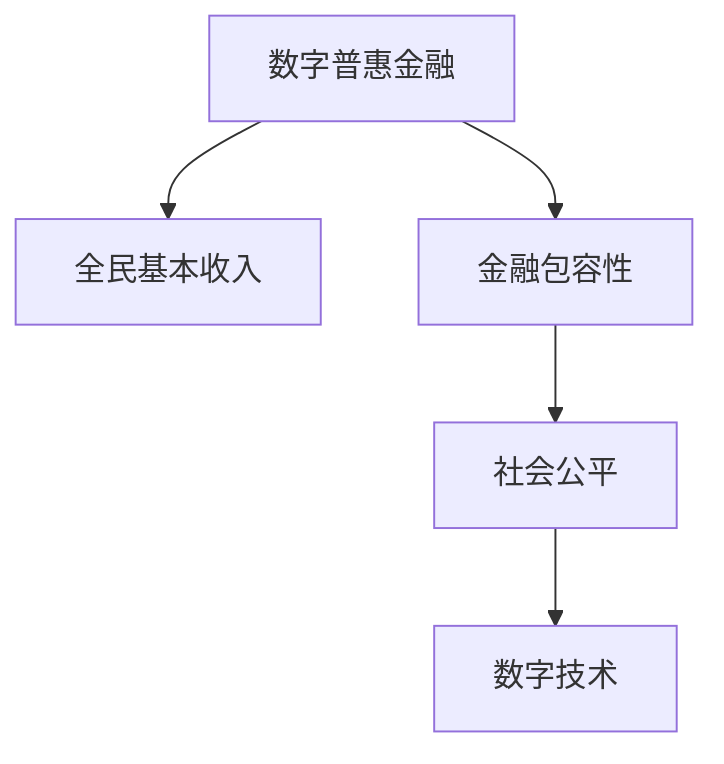

                 

## 1. 背景介绍

### 1.1 问题由来
全球贫困问题是一个持续了几个世纪的历史难题，20世纪下半叶以来，众多国家和地区在减贫方面取得了显著进展，但贫困依然存在于全球各个角落。尤其是在疫情和全球经济波动的影响下，全球贫困问题更加凸显。如何在2050年实现全球范围内的减贫，成为摆在我们面前的一项重要挑战。

近年来，科技和金融的迅猛发展为全球减贫提供了新的希望。数字普惠金融（Digital Inclusive Finance, DIF）和全民基本收入（Universal Basic Income, UBI）等新模式不断涌现，为实现全球减贫提供了新的可能性。

### 1.2 问题核心关键点
数字普惠金融和全民基本收入是两种从根本上改变贫困现状的创新模式。

- 数字普惠金融：利用数字技术和金融服务手段，通过移动支付、在线贷款、小额保险等形式，降低贫困人群获得金融服务的门槛，提升其经济独立性。
- 全民基本收入：无条件为所有公民提供定期的、无差别的基本收入，保障每个人的基本生活需求，实现社会的公平与正义。

本文将围绕这两种模式，深入探讨其原理和应用，分析其优缺点，展望其未来发展方向，并探讨二者如何协同作用，共同助力2050年全球减贫。

### 1.3 问题研究意义
在全球经济和社会结构发生深刻变化的背景下，通过数字普惠金融和全民基本收入等创新模式的结合，可以为全球减贫带来新的突破。研究这两种模式的优势和不足，并提出针对性的政策建议，对于推动全球减贫进程具有重要意义。

## 2. 核心概念与联系

### 2.1 核心概念概述

为更好地理解数字普惠金融和全民基本收入，本节将介绍几个密切相关的核心概念：

- 数字普惠金融：指利用数字技术，使金融服务覆盖到未被银行体系覆盖的人群，包括低收入家庭、小微企业和农村地区等。主要手段包括移动支付、数字账户、小额贷款、保险等。

- 全民基本收入：指政府定期向所有公民无条件发放基本收入，用于满足其基本生活需求。旨在保障每个人的基本生活，减少贫困和促进社会公平。

- 金融包容性：指确保所有人群都能够获得和使用金融服务，无论其经济状况、地理位置、性别等因素。

- 数字技术：包括互联网、移动通信、人工智能、区块链等技术，为数字普惠金融和全民基本收入提供了技术支撑。

- 社会公平：通过消除经济不平等、缩小贫富差距，实现人人享有平等的机会和资源。

这些核心概念之间的逻辑关系可以通过以下Mermaid流程图来展示：



这个流程图展示了几者之间的逻辑关系：

1. 数字普惠金融通过提供金融服务覆盖更多人，提升其经济独立性，是实现社会公平的必要手段。
2. 全民基本收入直接保障每个人的基本生活需求，是实现社会公平的直接方式。
3. 金融包容性和数字技术是数字普惠金融和全民基本收入的基础和支撑。

## 3. 核心算法原理 & 具体操作步骤

### 3.1 算法原理概述

数字普惠金融和全民基本收入均基于以下几个关键原则：

- **普惠性**：确保金融服务或基本收入的覆盖面尽可能广泛，尤其是覆盖到低收入群体。
- **可及性**：降低金融服务的获取门槛，使更多人能够轻松地访问和使用。
- **包容性**：不因经济、社会地位等因素区分对待，保障所有人群享有平等权利。
- **可持续性**：金融服务或基本收入需长期稳定运行，能够适应市场和环境的变化。

在具体操作上，数字普惠金融和全民基本收入分别从不同角度切入，实现以上目标。

### 3.2 算法步骤详解

#### 数字普惠金融的具体操作流程如下：

1. **金融基础设施建设**：搭建覆盖广泛的网络设施，确保移动支付、数字账户、小额贷款等服务的可靠运行。

2. **合作伙伴选择与合作**：选择信誉良好的金融机构、非政府组织等作为合作伙伴，共同推动数字普惠金融项目。

3. **产品设计与推广**：根据目标人群需求，设计简单易用的金融产品，并通过各种渠道进行推广。

4. **风险管理与监管**：建立风险管理体系，确保金融服务的稳定性，同时进行合规性监管。

5. **评估与改进**：定期评估金融服务的覆盖面和效果，收集用户反馈，不断改进金融产品和服务。

#### 全民基本收入的具体操作流程如下：

1. **基本收入设计**：确定基本收入的标准、发放周期和支付方式，确保其能够满足人们基本生活需求。

2. **资金筹集**：通过税收、财政支出、社会资本等多种渠道筹集资金，保证基本收入的持续稳定。

3. **收入发放**：使用数字技术实现快速、高效的基本收入发放，避免人为操作带来的风险。

4. **监督与管理**：建立监督机制，确保资金使用透明，防止滥用和浪费。

5. **效果评估**：定期评估全民基本收入的实施效果，收集数据进行分析和改进。

### 3.3 算法优缺点

#### 数字普惠金融的优点：

1. **提升经济独立性**：使贫困人口能够更轻松地获得金融服务，增加其经济活动和收入来源。
2. **提高金融包容性**：降低金融服务的门槛，使更多人能够享有金融服务带来的便利和利益。
3. **促进就业**：金融服务可以支持小微企业的发展，创造更多的就业机会。

#### 数字普惠金融的缺点：

1. **成本较高**：建立和维护金融基础设施需要大量的资金和技术投入。
2. **风险管理复杂**：金融服务涉及高风险交易，需建立完善的监管体系。
3. **数据隐私问题**：金融数据的收集和使用涉及个人隐私保护问题。

#### 全民基本收入的优点：

1. **保障基本生活**：无条件保障每个人的基本生活需求，减少贫困人口。
2. **促进社会公平**：通过消除经济不平等，实现人人享有平等的机会和资源。
3. **提高生活质量**：基本收入可以用于健康、教育等，提高人们的生活质量。

#### 全民基本收入的缺点：

1. **财政压力**：大规模的基本收入发放需要大量财政资金支持，可能给政府财政带来压力。
2. **激励问题**：基本收入可能降低人们的劳动积极性，带来社会激励问题。
3. **社会适应性**：基本收入的普及可能带来社会适应性问题，需逐步推广。

### 3.4 算法应用领域

数字普惠金融和全民基本收入均具有广泛的应用场景，尤其在以下领域：

- **农村地区**：通过数字普惠金融，提供金融服务覆盖更多农村人口，促进农业现代化。
- **低收入家庭**：通过数字普惠金融，提供小额贷款、保险等服务，提升其经济独立性。
- **边缘化人群**：通过全民基本收入，保障边缘化人群的基本生活需求，促进社会公平。
- **灾害应急**：在灾害发生时，通过全民基本收入和数字普惠金融，提供紧急救助。

## 4. 数学模型和公式 & 详细讲解 & 举例说明

### 4.1 数学模型构建

#### 数字普惠金融的数学模型构建：

假设金融服务覆盖率为 $C$，金融服务获取成本为 $C_0$，每个人通过金融服务获得的收入增加为 $I$。则数字普惠金融的收益 $R$ 可以表示为：

$$
R = C \times I - C \times C_0
$$

#### 全民基本收入的数学模型构建：

假设全民基本收入为 $U$，每个人的月生活成本为 $L$，每个人获得的基本收入总额为 $T$。则全民基本收入的收益 $R$ 可以表示为：

$$
R = T - C \times L
$$

### 4.2 公式推导过程

#### 数字普惠金融的收益推导：

假设 $N$ 为总人口，$F$ 为金融服务覆盖率，$I$ 为每个人通过金融服务获得的收入增加。则金融服务的收益 $R$ 可以表示为：

$$
R = N \times F \times I - N \times F \times C_0 = N \times F \times (I - C_0)
$$

其中 $C_0$ 为金融服务获取成本。

#### 全民基本收入的收益推导：

假设每个人每月生活成本为 $L$，全民基本收入总额为 $T$，则全民基本收入的收益 $R$ 可以表示为：

$$
R = T - N \times L = (N \times U) - N \times L = N \times (U - L)
$$

### 4.3 案例分析与讲解

#### 数字普惠金融的案例：

孟加拉国在数字普惠金融方面取得了显著成就。通过移动支付和数字账户，使数百万农村人口能够便捷地进行金融交易，降低了金融服务的成本，提高了经济独立性。

#### 全民基本收入的案例：

芬兰的Oulu市自2017年开始实施全民基本收入项目，向所有居民每月发放500欧元的无条件基本收入。尽管项目存在争议，但其在保障基本生活、促进就业和社会公平方面的效果值得深入研究。

## 5. 项目实践：代码实例和详细解释说明

### 5.1 开发环境搭建

在进行数字普惠金融和全民基本收入的开发和实践时，需要以下开发环境：

1. **Python**：选择Python作为主要编程语言，Python生态系统丰富，便于开发和调试。
2. **Web框架**：选择Flask、Django等Web框架，实现金融服务的在线化管理和操作。
3. **数据库**：选择MySQL、MongoDB等关系型/非关系型数据库，存储和管理金融数据。
4. **数据可视化工具**：选择Tableau、Power BI等工具，进行数据分析和可视化。
5. **服务器环境**：搭建Linux服务器环境，确保系统稳定运行。

### 5.2 源代码详细实现

#### 数字普惠金融的代码实现：

```python
from flask import Flask, request, jsonify

app = Flask(__name__)

@app.route('/payment', methods=['POST'])
def payment():
    # 获取用户支付信息
    user_id = request.json.get('user_id')
    amount = request.json.get('amount')
    
    # 处理支付请求
    # 将支付信息存入数据库
    # 返回支付结果
    return jsonify({'status': 'success', 'message': 'Payment successful'})

if __name__ == '__main__':
    app.run(debug=True)
```

#### 全民基本收入的代码实现：

```python
from flask import Flask, request, jsonify

app = Flask(__name__)

@app.route('/income', methods=['POST'])
def income():
    # 获取用户基本收入信息
    user_id = request.json.get('user_id')
    income_amount = request.json.get('income_amount')
    
    # 处理收入发放请求
    # 将收入信息存入数据库
    # 返回收入发放结果
    return jsonify({'status': 'success', 'message': 'Income issued'})

if __name__ == '__main__':
    app.run(debug=True)
```

### 5.3 代码解读与分析

**数字普惠金融的代码解读**：

- **Flask框架**：使用Flask框架搭建Web服务，提供支付接口。
- **支付信息处理**：从请求中获取用户ID和支付金额，并进行处理。
- **数据库存储**：将支付信息存入数据库，确保数据安全。
- **响应结果**：返回支付成功的JSON响应。

**全民基本收入的代码解读**：

- **Flask框架**：使用Flask框架搭建Web服务，提供收入发放接口。
- **收入信息处理**：从请求中获取用户ID和收入金额，并进行处理。
- **数据库存储**：将收入信息存入数据库，确保数据安全。
- **响应结果**：返回收入发放成功的JSON响应。

### 5.4 运行结果展示

通过上述代码，数字普惠金融和全民基本收入的Web服务已经搭建完成。可以通过Postman等工具，向服务端发送支付和收入发放请求，查看服务响应结果。

## 6. 实际应用场景

### 6.1 智能农业

数字普惠金融和全民基本收入在智能农业领域具有重要应用。通过数字普惠金融，提供农业保险、贷款等服务，提升农民的收入和生产积极性。同时，通过全民基本收入，保障农民的基本生活需求，促进农村地区的整体发展。

### 6.2 灾后重建

在自然灾害发生后，数字普惠金融和全民基本收入可以提供紧急救助和重建资金，帮助受灾群众恢复生产生活。数字普惠金融提供快速、便捷的资金支持，全民基本收入直接保障受灾群众的基本生活。

### 6.3 教育普及

通过数字普惠金融和全民基本收入，提高教育普及率和教育质量。数字普惠金融提供教育贷款、助学金等服务，全民基本收入保障学生的基本生活需求，降低其学习负担。

### 6.4 未来应用展望

未来，数字普惠金融和全民基本收入将在更多领域得到应用，为全球减贫带来新的突破。通过两者的协同作用，可以实现更加全面、精准的减贫方案，为实现2050年全球减贫目标提供有力支撑。

## 7. 工具和资源推荐

### 7.1 学习资源推荐

为了帮助开发者系统掌握数字普惠金融和全民基本收入的理论基础和实践技巧，这里推荐一些优质的学习资源：

1. **《数字普惠金融与创新模式》**：深入分析数字普惠金融的模式和应用，结合实际案例进行讲解。
2. **《全民基本收入：理论、实践与未来》**：探讨全民基本收入的理论基础和实际应用，分析其优缺点和未来发展方向。
3. **《Python金融编程》**：介绍Python在金融领域的编程方法和应用，涵盖数字普惠金融的开发实践。
4. **《数字普惠金融：案例与实践》**：通过实际案例，展示数字普惠金融的成功实践，提供操作指导。

### 7.2 开发工具推荐

以下是几款用于数字普惠金融和全民基本收入开发的常用工具：

1. **Flask**：轻量级的Web框架，易于上手，适合搭建简单的Web服务。
2. **Django**：功能强大的Web框架，支持ORM、数据库迁移等功能，适合开发复杂应用。
3. **MySQL**：稳定可靠的关系型数据库，适合存储和管理金融数据。
4. **MongoDB**：灵活的NoSQL数据库，适合处理海量非结构化数据。
5. **Tableau**：强大的数据可视化工具，支持复杂的交互式报表和分析。
6. **Power BI**：微软推出的一款数据可视化工具，支持实时数据连接和报告。

### 7.3 相关论文推荐

数字普惠金融和全民基本收入的发展离不开学界的持续研究。以下是几篇奠基性的相关论文，推荐阅读：

1. **《数字普惠金融：现状、挑战与未来》**：分析数字普惠金融的现状和未来发展方向，探讨其在全球减贫中的作用。
2. **《全民基本收入：理论和实践》**：全面介绍全民基本收入的理论基础和实施方法，分析其优缺点和实际效果。
3. **《数字普惠金融与金融包容性》**：探讨数字普惠金融与金融包容性之间的关系，提出优化金融服务的策略。

## 8. 总结：未来发展趋势与挑战

### 8.1 总结

本文对数字普惠金融和全民基本收入进行了全面系统的介绍。首先阐述了这两种模式的研究背景和意义，明确了其在全球减贫中的重要价值。其次，从原理到实践，详细讲解了两种模式的具体操作流程，给出了代码实例和详细解释说明。同时，本文还探讨了两种模式的优缺点，展望了其未来发展方向，并讨论了二者如何协同作用，共同助力2050年全球减贫。

通过本文的系统梳理，可以看到，数字普惠金融和全民基本收入在解决全球贫困问题上具有巨大潜力。这些模式的成功应用，将为全球减贫带来新的希望。

### 8.2 未来发展趋势

展望未来，数字普惠金融和全民基本收入将呈现以下几个发展趋势：

1. **技术创新**：随着人工智能、区块链等技术的发展，数字普惠金融和全民基本收入将实现更加智能化、高效化的运作。
2. **国际合作**：全球范围内加强合作，共享数据、技术和经验，提升全球减贫的协同效应。
3. **政策支持**：各国政府加大政策支持力度，为数字普惠金融和全民基本收入的普及提供保障。
4. **社会认同**：逐步提升社会对数字普惠金融和全民基本收入的认同感，推动其广泛应用。
5. **可持续发展**：实现数字普惠金融和全民基本收入的可持续发展，确保其长期稳定运行。

### 8.3 面临的挑战

尽管数字普惠金融和全民基本收入在减贫方面具有巨大潜力，但在迈向更加智能化、普适化应用的过程中，仍面临诸多挑战：

1. **数据隐私和安全**：数字普惠金融和全民基本收入涉及大量个人数据，如何保障数据隐私和安全是首要问题。
2. **技术基础设施建设**：在欠发达地区，缺乏必要的技术基础设施，难以实现数字普惠金融和全民基本收入。
3. **社会接受度**：数字普惠金融和全民基本收入在一些地区可能面临社会接受度不高的问题，需进行广泛宣传和教育。
4. **资金筹集和管理**：大规模的基本收入发放和金融服务提供需要大量资金支持，如何高效管理和筹集资金是一大挑战。
5. **国际协调**：不同国家在数字普惠金融和全民基本收入的政策和实施方式存在差异，需加强国际协调和合作。

### 8.4 研究展望

面对数字普惠金融和全民基本收入面临的挑战，未来的研究需要在以下几个方面寻求新的突破：

1. **数据隐私和安全**：开发更加安全、高效的数据加密和隐私保护技术，确保个人数据的安全性。
2. **技术基础设施**：推动技术基础设施的普及和升级，缩小数字鸿沟。
3. **社会接受度**：通过广泛宣传和教育，提高社会对数字普惠金融和全民基本收入的认同感。
4. **资金筹集和管理**：创新资金筹集方式，提高资金使用效率，确保其稳定运行。
5. **国际协调**：加强国际合作，制定统一的减贫标准和政策，推动全球减贫进程。

这些研究方向的探索，必将引领数字普惠金融和全民基本收入的发展，为全球减贫带来新的突破。面向未来，数字普惠金融和全民基本收入需要与其他减贫手段协同发力，共同构建更加公平、包容、可持续的全球减贫体系。

## 9. 附录：常见问题与解答

**Q1: 数字普惠金融和全民基本收入是否存在冲突？**

A: 数字普惠金融和全民基本收入虽然出发点不同，但并不存在根本冲突。数字普惠金融通过提供金融服务，提升贫困人口的经济独立性，全民基本收入通过无条件发放基本收入，保障每个人的基本生活需求。二者可以协同作用，共同实现减贫目标。

**Q2: 数字普惠金融和全民基本收入的实施成本如何控制？**

A: 实施成本的控制主要通过以下几个方面：

1. **技术优化**：通过技术创新和优化，降低金融服务提供和基本收入发放的成本。
2. **政府投入**：政府通过财政支持和政策引导，提供必要的资金支持。
3. **合作伙伴**：与信誉良好的金融机构、非政府组织等合作，共同分担成本。
4. **社会捐赠**：通过社会捐赠和慈善活动，筹集更多资金支持。

**Q3: 如何衡量数字普惠金融和全民基本收入的效果？**

A: 衡量数字普惠金融和全民基本收入的效果，主要通过以下几个指标：

1. **覆盖率**：衡量金融服务或基本收入的覆盖面，确保更多人受益。
2. **收入增长**：衡量通过金融服务或基本收入提升的收入水平。
3. **贫困率变化**：衡量实施前后的贫困率变化情况，评估减贫效果。
4. **社会公平**：衡量实施前后的社会公平程度，确保人人享有平等的机会和资源。
5. **满意度调查**：通过问卷调查等方式，了解用户对金融服务或基本收入的满意度。

**Q4: 如何推动数字普惠金融和全民基本收入的国际合作？**

A: 推动数字普惠金融和全民基本收入的国际合作，主要通过以下几个方面：

1. **建立合作机制**：各国政府和国际组织建立合作机制，制定统一的减贫标准和政策。
2. **共享数据和技术**：通过数据共享和技术交流，提升全球减贫的协同效应。
3. **资金支持**：国际援助机构提供资金支持，帮助欠发达地区实施数字普惠金融和全民基本收入。
4. **经验交流**：通过经验交流和分享，提升各国实施数字普惠金融和全民基本收入的能力。

**Q5: 如何保障数字普惠金融和全民基本收入的可持续发展？**

A: 保障数字普惠金融和全民基本收入的可持续发展，主要通过以下几个方面：

1. **技术升级**：通过技术创新和升级，提高系统的稳定性和安全性。
2. **资金管理**：建立健全的资金管理体系，确保资金使用的透明度和高效性。
3. **政策支持**：政府提供长期稳定的政策支持，保障项目的持续运行。
4. **社会监督**：建立社会监督机制，确保项目实施的公平性和公正性。
5. **持续评估**：定期评估项目实施效果，及时发现和解决问题，确保项目的长期稳定运行。

---

作者：禅与计算机程序设计艺术 / Zen and the Art of Computer Programming

