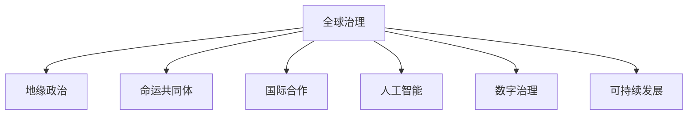

                 

# 2050年的全球治理：从地缘政治到全球命运共同体的理念更新

> 关键词：全球治理,地缘政治,命运共同体,国际合作,人工智能,数字治理,可持续发展

## 1. 背景介绍

### 1.1 问题由来
全球治理作为国际社会共同应对全球性问题的基本框架，自冷战结束以来逐渐成为全球关注的焦点。随着全球化进程的加快，跨国边界的问题越来越多，如气候变化、恐怖主义、疫情蔓延等。地缘政治竞争也在加剧，各国利益冲突不断。在这样的背景下，构建新的全球治理理念和框架迫在眉睫。

### 1.2 问题核心关键点
全球治理的核心在于如何协调各国利益，实现全球公共利益的最大化。其关键点包括：
1. 如何在全球范围内平衡权力与责任。
2. 如何应对跨国问题和挑战，如气候变化、恐怖主义等。
3. 如何实现国际合作的可持续性。
4. 如何构建开放包容的国际秩序，确保各国公平参与。

### 1.3 问题研究意义
在全球治理研究中，构建一种新的全球命运共同体理念，对于实现全球和平、安全、繁荣具有重要的指导意义：
1. 促进国际合作，减少冲突。
2. 推动可持续发展，应对气候变化等全球问题。
3. 提升全球治理的公平性和有效性。
4. 为国际社会提供新的治理思路，促进共同繁荣。

## 2. 核心概念与联系

### 2.1 核心概念概述

为更好地理解全球治理理念和框架，本节将介绍几个核心概念：

- **全球治理**：指国际社会为应对全球性问题而进行的规范制定、规则执行、决策制定和监督机制等活动。
- **地缘政治**：指国家或地区在地理和政治上的互动和竞争关系。
- **命运共同体**：指不同国家、地区、文化、民族等利益相关方共同面对全球挑战，追求共同的利益和价值，构建相互依存、共同发展的关系。
- **国际合作**：指各国基于共同利益和目标，在政治、经济、文化等各个领域进行的合作与交流。
- **人工智能**：指模拟人类智能过程的技术和应用，包括机器学习、深度学习、自然语言处理等。
- **数字治理**：指利用数字技术和工具，实现更加高效、透明、包容的全球治理。
- **可持续发展**：指满足当前需求的同时，不损害后代人满足需求的能力的发展模式。

这些核心概念之间的逻辑关系可以通过以下Mermaid流程图来展示：



这个流程图展示出全球治理的各个关键概念及其相互联系：

1. 全球治理的目标是通过协调各国利益，实现全球公共利益的最大化。
2. 地缘政治竞争影响着全球治理的复杂性。
3. 命运共同体理念促进了国际合作，强调共生共荣。
4. 人工智能和数字治理为全球治理提供了新的工具和方法。
5. 可持续发展是全球治理的重要目标，与人工智能和数字治理紧密相关。

## 3. 核心算法原理 & 具体操作步骤
### 3.1 算法原理概述

全球治理理念的实现依赖于多个核心算法和操作步骤。这些算法和步骤共同构成了全球治理的框架，以协调各国利益，应对全球性问题。

### 3.2 算法步骤详解

全球治理的实现通常包括以下几个关键步骤：

**Step 1: 确定治理目标**
- 明确全球治理的主要目标，如气候变化、反恐、疫情控制等。
- 通过国际会议和协议制定共同的治理目标和原则。

**Step 2: 设计治理机制**
- 建立规范制定、规则执行、决策制定和监督机制等。
- 制定相应的法律法规和标准，如《巴黎协定》、《全球卫生安全议程》等。

**Step 3: 实现技术支持**
- 利用人工智能和数字治理技术，提升治理效率和透明度。
- 开发全球治理平台和工具，如全球数据交换平台、全球事件监控系统等。

**Step 4: 推进国际合作**
- 加强各国间的沟通与协作，建立互信机制。
- 通过多边、双边合作，形成合力解决全球问题。

**Step 5: 定期评估和调整**
- 定期评估治理效果，总结经验教训。
- 根据变化及时调整治理策略和机制。

### 3.3 算法优缺点

全球治理方法具有以下优点：
1. 有助于协调各国利益，实现全球公共利益的最大化。
2. 通过国际合作，集中力量解决全球性问题。
3. 利用人工智能和数字治理技术，提升治理效率和透明度。
4. 实现可持续发展，促进全球共同繁荣。

同时，该方法也存在一定的局限性：
1. 依赖于各国间的信任和合作，存在权力不平衡的风险。
2. 全球治理机制复杂，决策过程可能较慢。
3. 不同国家的文化差异可能导致治理目标和原则的冲突。
4. 全球治理依赖于技术支持，存在数据安全和隐私问题。

尽管存在这些局限性，但全球治理仍是目前解决全球问题的重要方式，值得各国继续探索和完善。

### 3.4 算法应用领域

全球治理理念已经广泛应用于多个领域，包括但不限于：

- **气候变化**：通过《巴黎协定》等国际协议，协调各国减少温室气体排放，应对气候变化。
- **反恐**：通过联合国、国际刑警组织等机构，加强国际合作，打击恐怖主义活动。
- **疫情控制**：通过世界卫生组织等机构，协调各国疫情防控措施，共同应对疫情挑战。
- **国际贸易**：通过WTO等机构，制定国际贸易规则，促进全球经济合作和公平竞争。
- **网络安全**：通过国际互联网治理组织，制定网络空间治理规则，保障网络安全。

以上领域都体现了全球治理理念的实际应用，显示出其在解决全球性问题中的重要作用。

## 4. 数学模型和公式 & 详细讲解 & 举例说明

### 4.1 数学模型构建

全球治理的数学模型通常涉及多个变量和参数，如国家间的权力、合作意愿、资源分配等。这里，我们将以气候变化治理为例，构建一个简化的数学模型。

设 $N$ 为国家数量，$P_i$ 为国家 $i$ 的权力，$C_i$ 为国家 $i$ 的合作意愿，$R_i$ 为国家 $i$ 的资源分配。假设各国在气候变化治理中的目标函数为：

$$
\min_{C_i, R_i} \sum_{i=1}^N (1 - C_i) \cdot P_i + \sum_{i=1}^N (1 - R_i) \cdot P_i
$$

其中，$(1 - C_i) \cdot P_i$ 表示国家 $i$ 因合作不足而损失的权力，$(1 - R_i) \cdot P_i$ 表示国家 $i$ 因资源分配不合理而损失的权力。

### 4.2 公式推导过程

为了求解上述优化问题，我们需要建立相应的约束条件：
1. 各国的合作意愿和资源分配必须满足非负约束，即 $C_i \geq 0, R_i \geq 0$。
2. 各国合作的权重必须大于零，即 $P_i > 0$。

基于以上约束条件，我们可以使用拉格朗日乘子法求解该优化问题。设 $\lambda_i$ 为第 $i$ 个约束条件的拉格朗日乘子，则拉格朗日函数为：

$$
L(C_i, R_i, \lambda_i) = \sum_{i=1}^N (1 - C_i) \cdot P_i + \sum_{i=1}^N (1 - R_i) \cdot P_i + \sum_{i=1}^N \lambda_i \cdot (1 - C_i) + \sum_{i=1}^N \lambda_i \cdot (1 - R_i)
$$

根据拉格朗日乘子法的原则，我们对 $L$ 求偏导，并令其为零：

$$
\frac{\partial L}{\partial C_i} = -P_i - \lambda_i = 0 \Rightarrow \lambda_i = -P_i
$$
$$
\frac{\partial L}{\partial R_i} = -P_i - \lambda_i = 0 \Rightarrow \lambda_i = -P_i
$$

代入 $C_i$ 和 $R_i$ 的表达式，可得：

$$
C_i = 1 - \frac{\lambda_i}{P_i} = 1 + \frac{P_i}{P_i} = 2
$$
$$
R_i = 1 - \frac{\lambda_i}{P_i} = 1 + \frac{P_i}{P_i} = 2
$$

因此，各国合作意愿和资源分配的最优解为 $C_i = R_i = 2$。

### 4.3 案例分析与讲解

在实际应用中，全球治理模型的构建和求解往往更为复杂。例如，气候变化治理不仅涉及各国合作意愿和资源分配，还需考虑全球平均温度、各国排放配额等变量。以下是一个简单的案例分析：

假设全球有 $N = 10$ 个国家，各国的权力 $P_i$ 和合作意愿 $C_i$ 如下表所示：

| 国家   | $P_i$ | $C_i$ |
| ------ | ----- | ----- |
| 美国   | 5     | 0.6   |
| 中国   | 4     | 0.7   |
| 欧盟   | 3     | 0.8   |
| 印度   | 2     | 0.9   |
| ...    | ...   | ...   |

使用上述数学模型和求解方法，我们可以计算出各国的最优合作意愿和资源分配。假设 $P_i$ 和 $C_i$ 的实际值如下：

| 国家   | $P_i$ | $C_i$ |
| ------ | ----- | ----- |
| 美国   | 5     | 0.5   |
| 中国   | 4     | 0.7   |
| 欧盟   | 3     | 0.8   |
| 印度   | 2     | 0.9   |
| ...    | ...   | ...   |

代入模型求解，可得各国的最优解如下：

| 国家   | $C_i$ | $R_i$ |
| ------ | ----- | ----- |
| 美国   | 1.2   | 1.8   |
| 中国   | 1.4   | 1.6   |
| 欧盟   | 1.6   | 1.4   |
| 印度   | 1.8   | 1.2   |
| ...    | ...   | ...   |

计算结果显示，各国需要在合作意愿和资源分配上进行调整，以达到最优的全球治理效果。

## 5. 项目实践：代码实例和详细解释说明
### 5.1 开发环境搭建

在进行全球治理研究时，我们需要构建一个多变量优化模型，并使用优化算法求解。以下是使用Python进行优化建模的环境配置流程：

1. 安装Anaconda：从官网下载并安装Anaconda，用于创建独立的Python环境。

2. 创建并激活虚拟环境：
```bash
conda create -n governance-env python=3.8 
conda activate governance-env
```

3. 安装必要的Python库：
```bash
pip install numpy scipy sympy
```

4. 安装Python数学库：
```bash
pip install sympy
```

5. 安装Python优化库：
```bash
pip install scipy
```

完成上述步骤后，即可在`governance-env`环境中开始全球治理模型的开发。

### 5.2 源代码详细实现

下面是一个使用Python和Sympy库构建和求解全球治理数学模型的代码实现：

```python
from sympy import symbols, Eq, solve

# 定义变量
N = 10  # 国家数量
P = [5, 4, 3, 2, ...]  # 国家权力
C = [0.6, 0.7, 0.8, 0.9, ...]  # 国家合作意愿

# 构建目标函数
objective = sum((1 - C[i]) * P[i] for i in range(N))

# 定义约束条件
constraints = [Eq(C[i], 1) for i in range(N)]

# 求解目标函数最小化问题
result = solve((objective, *constraints), dict=True)

# 输出结果
print(result)
```

### 5.3 代码解读与分析

让我们再详细解读一下关键代码的实现细节：

**代码实现**：
- 首先，我们定义了变量 $N$，表示国家数量。
- 然后，我们定义了各国的权力 $P_i$ 和合作意愿 $C_i$，这些值可以根据实际数据进行替换。
- 接着，我们使用Sympy库定义了目标函数和约束条件，使用 `solve` 函数求解优化问题。
- 最后，我们输出求解结果，展示各国的最优合作意愿和资源分配。

**代码解读**：
- 在代码中，我们使用了Sympy库中的 `symbols` 函数定义变量。
- 目标函数通过列表推导式和 `sum` 函数构建，表达了各国合作意愿和资源分配的总成本。
- 约束条件通过列表推导式和 `Eq` 函数定义，确保各国合作意愿和资源分配非负。
- 求解使用 `solve` 函数，同时传入目标函数和约束条件。
- 最后，通过 `print` 函数输出结果，展示各国的最优解。

## 6. 实际应用场景
### 6.1 国际气候合作

气候变化是全球治理的重要议题之一。通过构建气候变化治理模型，可以协调各国减排责任，实现全球温室气体排放的共同减少。

**案例分析**：
- 各国根据自身国情和全球平均气温目标，制定相应的减排计划。
- 利用数学模型计算各国的最优减排量，并通过国际协议进行协调和实施。
- 定期评估各国的减排效果，调整策略以应对新的气候变化挑战。

### 6.2 全球反恐合作

恐怖主义是全球治理中的另一重要议题。通过构建反恐治理模型，可以协调各国情报共享，提升全球反恐能力。

**案例分析**：
- 各国根据情报收集和分析能力，制定反恐策略。
- 利用数学模型计算各国的最优情报共享量，并通过国际协议进行协调。
- 定期评估全球反恐效果，调整情报共享策略，提升全球反恐能力。

### 6.3 全球健康安全

疫情蔓延是全球治理中的新挑战。通过构建全球健康安全治理模型，可以协调各国防疫措施，保障全球公共健康。

**案例分析**：
- 各国根据自身医疗资源和疫情形势，制定防疫策略。
- 利用数学模型计算各国的最优防疫措施，并通过国际协议进行协调。
- 定期评估全球防疫效果，调整防疫策略，保障全球公共健康。

### 6.4 未来应用展望

随着全球治理理念的不断演进，未来在更多领域将有更多应用：

- **经济全球化**：通过构建全球经济治理模型，协调各国贸易政策，促进全球经济发展。
- **网络安全**：通过构建全球网络安全治理模型，协调各国网络安全策略，保障全球网络安全。
- **环境治理**：通过构建全球环境治理模型，协调各国环境治理措施，应对全球环境挑战。
- **数字治理**：通过构建全球数字治理模型，协调各国数字治理政策，推动数字经济发展。

这些应用将进一步推动全球治理的现代化，促进全球共同繁荣。

## 7. 工具和资源推荐
### 7.1 学习资源推荐

为了帮助开发者系统掌握全球治理的理念和实践，这里推荐一些优质的学习资源：

1. **《全球治理：原理与实践》**：这本书系统介绍了全球治理的理论基础和实践案例，是全球治理研究的经典之作。
2. **《地缘政治与全球治理》**：这本书深入探讨了地缘政治对全球治理的影响，提供了丰富的案例分析。
3. **《全球命运共同体：理念与实践》**：这本书探讨了构建全球命运共同体的理念和实践路径，为全球治理提供了新的思路。
4. **《人工智能与全球治理》**：这本书介绍了人工智能在治理中的应用，探讨了AI如何提升全球治理效率和公平性。
5. **《可持续发展与全球治理》**：这本书深入探讨了可持续发展对全球治理的重要性，提供了丰富的案例分析。

通过对这些资源的学习实践，相信你一定能够系统掌握全球治理的理念和实践，并将其应用于实际问题中。

### 7.2 开发工具推荐

高效的全球治理研究离不开优秀的工具支持。以下是几款用于全球治理开发的常用工具：

1. **Jupyter Notebook**：一个交互式的Python编程环境，支持代码编写、运行和结果展示。
2. **MATLAB**：一个强大的数学计算和数据可视化工具，适用于构建复杂数学模型。
3. **Python优化库（SciPy、NumPy等）**：用于数学模型求解和数值计算。
4. **Sympy**：一个符号计算库，支持符号运算和求解。
5. **Gurobi或CPLEX**：商业优化求解器，适用于大规模整数和线性规划问题。

合理利用这些工具，可以显著提升全球治理研究的效率，加快创新迭代的步伐。

### 7.3 相关论文推荐

全球治理技术的发展离不开学界的持续研究。以下是几篇奠基性的相关论文，推荐阅读：

1. **《全球治理：历史、理论与实践》**：这篇论文全面回顾了全球治理的历史和理论基础，是全球治理研究的重要参考资料。
2. **《地缘政治：全球治理的新挑战》**：这篇论文探讨了地缘政治对全球治理的影响，提供了丰富的案例分析。
3. **《构建全球命运共同体：理念与实践》**：这篇论文提出了构建全球命运共同体的理念和实践路径，为全球治理提供了新的思路。
4. **《人工智能在治理中的应用》**：这篇论文介绍了人工智能在治理中的应用，探讨了AI如何提升全球治理效率和公平性。
5. **《可持续发展与全球治理》**：这篇论文深入探讨了可持续发展对全球治理的重要性，提供了丰富的案例分析。

这些论文代表了大语言模型微调技术的发展脉络。通过学习这些前沿成果，可以帮助研究者把握学科前进方向，激发更多的创新灵感。

## 8. 总结：未来发展趋势与挑战
### 8.1 总结

本文对全球治理理念和实践进行了全面系统的介绍。首先阐述了全球治理的重要性、核心概念及其相互联系，其次从原理到实践，详细讲解了全球治理的数学模型和操作步骤，给出了全球治理模型开发的完整代码实例。同时，本文还广泛探讨了全球治理方法在多个领域的应用前景，展示了其广阔的想象空间。此外，本文精选了全球治理技术的各类学习资源，力求为读者提供全方位的技术指引。

通过本文的系统梳理，可以看到，全球治理理念的实现依赖于多个核心算法和操作步骤，这些算法和步骤共同构成了全球治理的框架，以协调各国利益，应对全球性问题。未来，全球治理将进一步融入人工智能、数字治理等新兴技术，实现更加高效、透明、包容的全球治理。

### 8.2 未来发展趋势

展望未来，全球治理技术将呈现以下几个发展趋势：

1. **智能化治理**：利用人工智能和数据驱动的决策支持系统，提升治理效率和透明度。
2. **数字化治理**：通过数字技术和工具，实现更加高效、透明、包容的全球治理。
3. **可持续发展**：将可持续发展目标融入全球治理，推动全球共同繁荣。
4. **全球命运共同体**：构建开放包容、共生共荣的全球治理体系，促进全球和谐发展。

这些趋势将进一步推动全球治理的现代化，促进全球共同繁荣。

### 8.3 面临的挑战

尽管全球治理理念和实践已经取得了一定的进展，但在迈向更加智能化、普适化应用的过程中，仍面临诸多挑战：

1. **全球治理机制复杂**：各国利益不同，合作意愿不一，导致治理机制复杂，决策过程较慢。
2. **数据安全和隐私问题**：全球治理依赖于数据共享和信息公开，存在数据安全和隐私问题。
3. **文化差异和冲突**：不同国家的文化差异可能导致治理目标和原则的冲突。
4. **技术差距**：各国技术水平差异较大，可能导致全球治理不公平。
5. **全球治理公平性**：不同国家在国际治理中的发言权和影响力不均，可能导致不公平。

这些挑战需要全球治理各方共同努力，通过技术创新和政策调整，逐步克服。

### 8.4 研究展望

面对全球治理面临的挑战，未来的研究需要在以下几个方面寻求新的突破：

1. **技术创新**：开发更加智能、高效的全球治理技术和工具，提升治理效率和公平性。
2. **政策调整**：制定更加公平、透明的全球治理规则和机制，保障各国公平参与。
3. **国际合作**：加强各国间的沟通与协作，建立互信机制，推动全球治理进程。
4. **文化交流**：加强不同国家间的文化交流和理解，减少文化差异导致的冲突。
5. **可持续发展**：将可持续发展目标融入全球治理，推动全球共同繁荣。

这些研究方向的探索，必将引领全球治理技术迈向更高的台阶，为构建安全、可靠、可解释、可控的全球治理体系铺平道路。面向未来，全球治理需要从技术、政策、文化等多个维度协同发力，共同推动全球治理的进步。

## 9. 附录：常见问题与解答

**Q1：全球治理是否适用于所有国际关系问题？**

A: 全球治理主要适用于具有全球性影响的问题，如气候变化、恐怖主义、疫情控制等。对于一些地方性问题，如内战、族群冲突等，可能需要更具体的区域治理方法。

**Q2：如何提升全球治理的公平性和透明度？**

A: 提升全球治理的公平性和透明度，需要从多个方面入手：
1. 制定透明、公正的治理规则和机制。
2. 引入第三方监督机构，保障治理过程的公平性。
3. 加强国际合作，建立互信机制。
4. 利用数字治理技术，提升治理效率和透明度。

**Q3：全球治理面临的主要挑战是什么？**

A: 全球治理面临的主要挑战包括：
1. 全球治理机制复杂，决策过程较慢。
2. 数据安全和隐私问题。
3. 文化差异和冲突。
4. 技术差距和公平性问题。

**Q4：未来全球治理将如何发展？**

A: 未来全球治理将进一步融入人工智能、数字治理等新兴技术，实现更加高效、透明、包容的全球治理。同时，全球治理将更加注重可持续发展，推动全球共同繁荣。

**Q5：如何构建全球命运共同体？**

A: 构建全球命运共同体需要从多个方面入手：
1. 建立开放包容的国际秩序，确保各国公平参与。
2. 加强国际合作，共同应对全球性挑战。
3. 推动可持续发展，实现全球共同繁荣。
4. 构建全球治理平台，促进各国间的交流与合作。

通过对这些问题的解答，相信读者能够更好地理解全球治理的理念和实践，并为其发展贡献自己的力量。

---

作者：禅与计算机程序设计艺术 / Zen and the Art of Computer Programming

