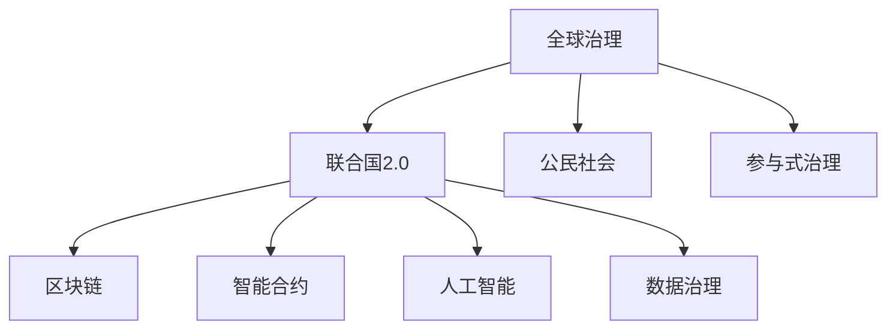

                 

# 2050年的全球治理：从联合国2.0到全球公民社会的参与式治理

> 关键词：全球治理, 联合国2.0, 公民社会, 参与式治理, 多边主义, 数字治理, 区块链, 智能合约, 人工智能, 可持续发展, 数据治理

## 1. 背景介绍

### 1.1 问题由来
进入21世纪以来，全球化进程加速，国与国之间的联系日益紧密。面对气候变化、网络安全、公共卫生等全球性挑战，各国不得不加强合作，共同应对。然而，现有的全球治理体系——以联合国为核心的国际组织体系，面临诸多挑战和局限。

首先，联合国等国际组织在处理全球事务时的效率和权威性受到质疑。个别强国单边主义抬头，忽视了多边主义和国际规则。此外，面对新兴问题，如信息网络安全、基因编辑等，现有的国际法律框架和机制显得力不从心。

其次，全球治理的民主性和透明度不足，治理权责难以界定，利益相关者参与度有限，决策过程不透明。特别是近年来，伴随社交媒体的兴起，全球舆情变得高度分散和碎片化，增加了国际合作和协调的难度。

面对这些挑战，各国和全球公民社会纷纷呼吁改革和创新全球治理体系。在这样的背景下，"联合国2.0"概念应运而生，旨在通过技术和多边主义，增强全球治理的效率和包容性。本文将探讨"联合国2.0"的实现路径，以及全球公民社会如何在其中发挥关键作用。

### 1.2 问题核心关键点
本文的核心问题包括：

- 如何通过技术手段，提升联合国等国际组织在全球治理中的效率和透明度？
- 如何加强全球公民社会的参与度，推动全球治理的民主化和透明度？
- 如何在全球治理中引入区块链、智能合约等技术，提升治理过程的可信性和可追溯性？
- 如何平衡不同利益相关者的需求和权利，形成包容性的全球治理体系？

## 2. 核心概念与联系

### 2.1 核心概念概述

为更好地理解"联合国2.0"及其在全球治理中的应用，本节将介绍几个密切相关的核心概念：

- **全球治理**：指国际社会共同协调，解决跨国界问题的治理体系和机制。其目标在于促进国际和平、安全、发展、人权等方面的合作。
- **联合国2.0**：指通过技术手段，如区块链、智能合约、人工智能等，对联合国等国际组织进行数字化和现代化的改革，提升全球治理的效率和透明度。
- **公民社会**：指非政府组织、民间团体、社会运动等非官方组织，通过公民参与和民主监督，推动社会公平、正义和可持续发展。
- **参与式治理**：指通过透明和开放的方式，让利益相关者广泛参与决策过程，增强治理的民主性和公正性。

这些核心概念之间的逻辑关系可以通过以下Mermaid流程图来展示：



这个流程图展示了大语言模型的核心概念及其之间的关系：

1. 全球治理通过联合国2.0进行数字化和现代化，提升效率和透明度。
2. 公民社会在全球治理中发挥民主监督和公民参与的作用。
3. 参与式治理通过透明和开放的方式，增强全球治理的民主性和公正性。
4. 联合国2.0在区块链、智能合约、人工智能、数据治理等技术支持下，实现更高效、透明和可信的治理过程。

这些概念共同构成了全球治理的现代范式，使全球事务处理更加高效、公正和可持续。通过理解这些核心概念，我们可以更好地把握全球治理的方向和目标。

## 3. 核心算法原理 & 具体操作步骤
### 3.1 算法原理概述

"联合国2.0"的核心在于通过技术手段，提升全球治理的效率和透明度。其核心思想是：利用先进的数字技术和多边主义，构建一个开放、透明、包容的全球治理体系，增强全球公民社会和利益相关者的参与度。

具体来说，"联合国2.0"的核心算法和操作步骤包括：

1. **数字化和透明化**：通过区块链和智能合约技术，记录和公开全球事务的决策和执行过程，实现透明和可追溯性。
2. **多边主义和包容性**：利用人工智能和大数据分析，提升全球治理的效率，并确保不同国家和利益相关者的公平参与。
3. **参与式治理**：通过公民社会和民间组织的广泛参与，推动全球治理的民主化和透明化。

### 3.2 算法步骤详解

"联合国2.0"的实现步骤一般包括以下几个关键环节：

**Step 1: 准备技术基础**
- 选择合适的区块链平台（如以太坊、Hyperledger等）作为国际事务的记录和存储系统。
- 引入智能合约技术，通过代码逻辑自动执行国际协议和条约。
- 集成人工智能和大数据分析工具，用于处理海量数据和优化决策过程。

**Step 2: 设计治理模型**
- 定义国际事务的决策流程和规则，设计智能合约和数据治理机制。
- 确定利益相关者的参与方式，如投票、咨询、协商等。
- 引入透明和公开的审计机制，确保治理过程的可信性和可追溯性。

**Step 3: 实施和监测**
- 将设计好的治理模型部署到区块链平台。
- 进行试点测试，验证模型的可行性和有效性。
- 通过AI和大数据工具，实时监测治理效果，进行动态调整和优化。

**Step 4: 反馈和改进**
- 收集利益相关者的反馈意见，进行评估和改进。
- 通过公民社会和民间组织，推动治理过程的透明度和民主化。
- 不断优化治理模型，确保其适应不断变化的外部环境。

### 3.3 算法优缺点

"联合国2.0"的优势在于：

- 提升治理效率：通过区块链和智能合约，实现透明和可追溯性，减少人工干预和执行误差。
- 增强透明度：通过数字化记录和公开，增强全球事务处理的透明度，减少信息不对称和信任危机。
- 促进民主化：通过公民社会和民间组织的广泛参与，推动全球治理的民主化和透明度。

但该方法也存在一些局限性：

- 技术复杂性高：区块链和智能合约等技术需要高水平的开发和维护能力，对技术门槛要求较高。
- 法律和伦理问题：国际事务的数字化处理可能引发新的法律和伦理问题，需要进一步研究和规范。
- 数据安全风险：数字化处理可能暴露敏感数据，面临隐私泄露和数据篡改的风险。

尽管存在这些局限性，但就目前而言，"联合国2.0"仍是大语言模型应用的重要范式。未来相关研究的重点在于如何进一步降低技术门槛，提高治理过程的公平性和透明度，同时兼顾数据安全和隐私保护。

### 3.4 算法应用领域

"联合国2.0"的算法和操作步骤已经在多个领域得到了应用，例如：

- **气候变化治理**：通过区块链记录碳排放数据，智能合约自动执行减排协议，增强气候变化的全球治理。
- **公共卫生合作**：利用区块链和智能合约记录和公开疫情数据，确保数据透明和共享。
- **国际贸易和关税**：通过智能合约自动执行贸易协议和关税调整，减少人为干预和执行误差。
- **金融合作和监管**：通过区块链记录和公开金融交易数据，智能合约自动执行金融监管协议。
- **环境保护和生态系统管理**：通过数字化手段记录和公开生态保护数据，智能合约自动执行环境保护协议。

除了上述这些经典领域外，"联合国2.0"还被创新性地应用于更多场景中，如数字身份认证、跨国身份验证等，为全球治理带来了新的突破。随着技术的不断进步，"联合国2.0"将在更多领域得到应用，推动全球治理向更高层次发展。

## 4. 数学模型和公式 & 详细讲解
### 4.1 数学模型构建

为了更好地理解"联合国2.0"的治理模型，本节将使用数学语言对治理过程进行更加严格的刻画。

假设全球事务的治理过程可以用决策树表示，每个节点代表一个决策点，每条边代表一种决策路径。治理模型由以下几个关键组件构成：

- **节点**：表示决策点，记录每个决策的参数和规则。
- **边**：表示决策路径，通过智能合约和区块链技术自动执行。
- **权重**：表示每个决策路径的权重，通过大数据分析确定。
- **状态**：表示决策过程中的状态，通过状态机管理。

治理模型的数学模型可以表示为：

$$
G = (N, E, W, S)
$$

其中 $N$ 为决策节点集合，$E$ 为决策边集合，$W$ 为边权重集合，$S$ 为状态集合。

### 4.2 公式推导过程

以下我们以气候变化治理为例，推导区块链和智能合约在治理过程中的作用。

假设全球气候变化治理过程可以抽象为以下几个决策点：

1. 碳排放配额分配：根据各国经济发展水平和碳排放历史，分配初始碳排放配额。
2. 配额交易机制：允许各国通过智能合约进行碳排放配额交易。
3. 减排措施实施：根据智能合约自动执行减排协议，记录减排数据。
4. 碳排放监测：通过区块链记录和公开碳排放数据，确保数据透明和可追溯性。

这些决策点可以通过智能合约和区块链技术进行自动化处理，治理模型的状态可以通过状态机进行管理。具体来说，智能合约可以定义如下：

```python
def emission_allocation():
    # 根据经济水平和历史排放，分配初始碳排放配额
    allocation = compute_allocation(economy, history)
    return allocation

def emission_trading():
    # 允许各国通过智能合约进行碳排放配额交易
    trading = execute_trading(allocation)
    return trading

def emission_reduction():
    # 根据智能合约自动执行减排协议，记录减排数据
    reduction = execute_reduction(trading)
    return reduction

def emission_monitoring():
    # 通过区块链记录和公开碳排放数据，确保数据透明和可追溯性
    monitoring = record_monitoring(reduction)
    return monitoring
```

在智能合约的执行过程中，可以引入区块链技术，记录每个决策点的执行日志和数据。例如：

```python
def record_decision(decision):
    # 记录每个决策点的执行日志和数据
    record = Record(decision)
    record.to区块链()
    return record
```

通过这些智能合约和区块链技术，可以实现透明和可追溯的治理过程。具体来说，每个决策点可以通过智能合约自动执行，并在区块链上进行记录。治理模型的状态可以通过状态机进行管理，确保治理过程的连续性和完整性。

### 4.3 案例分析与讲解

假设某跨国公司希望通过"联合国2.0"平台，记录和公开其碳排放数据。该公司需要遵循以下步骤：

**Step 1: 创建区块链账户**
- 在该公司的区块链平台上创建一个账户，用于记录和公开碳排放数据。

**Step 2: 生成智能合约**
- 编写智能合约，记录和公开碳排放数据，并确保数据的透明性和可追溯性。

**Step 3: 执行智能合约**
- 通过区块链平台执行智能合约，记录和公开碳排放数据。

**Step 4: 审计和反馈**
- 通过区块链平台审计智能合约的执行结果，收集利益相关者的反馈，进行改进和优化。

在执行过程中，智能合约和区块链技术可以确保数据的透明性和可追溯性。例如，通过智能合约自动记录和公开碳排放数据，任何利益相关者都可以随时查询和验证数据。同时，通过区块链平台的审计机制，可以确保数据的安全性和完整性。

## 5. 项目实践：代码实例和详细解释说明
### 5.1 开发环境搭建

在进行"联合国2.0"项目实践前，我们需要准备好开发环境。以下是使用Python进行区块链开发的环境配置流程：

1. 安装Node.js和npm：从官网下载并安装Node.js，npm是Node.js的包管理器，用于安装和管理区块链库。

2. 安装Web3库：通过npm安装Web3库，用于与以太坊区块链交互。

3. 创建智能合约：使用Solidity编写智能合约，并部署到以太坊区块链。

4. 部署后端系统：使用Django等Web框架，构建后端系统，用于记录和公开智能合约的执行日志和数据。

5. 部署前端系统：使用React等前端框架，构建前端系统，用于展示和查询智能合约的执行结果。

完成上述步骤后，即可在Web3环境中进行"联合国2.0"项目实践。

### 5.2 源代码详细实现

这里我们以气候变化治理为例，给出使用Web3技术对智能合约进行区块链部署的Python代码实现。

首先，定义智能合约的函数：

```python
from web3 import Web3

def emission_allocation():
    # 根据经济水平和历史排放，分配初始碳排放配额
    allocation = compute_allocation(economy, history)
    return allocation

def emission_trading():
    # 允许各国通过智能合约进行碳排放配额交易
    trading = execute_trading(allocation)
    return trading

def emission_reduction():
    # 根据智能合约自动执行减排协议，记录减排数据
    reduction = execute_reduction(trading)
    return reduction

def emission_monitoring():
    # 通过区块链记录和公开碳排放数据，确保数据透明和可追溯性
    monitoring = record_monitoring(reduction)
    return monitoring
```

然后，编写智能合约的Solidity代码：

```solidity
pragma solidity ^0.8.0;

contract Emission {
    uint256 public allocation;
    uint256 public trading;
    uint256 public reduction;
    uint256 public monitoring;
    
    constructor(uint256 initialAllocation, uint256 initialTrading, uint256 initialReduction, uint256 initialMonitoring) {
        allocation = initialAllocation;
        trading = initialTrading;
        reduction = initialReduction;
        monitoring = initialMonitoring;
    }
    
    function recordDecision() public {
        // 记录每个决策点的执行日志和数据
        record = Record(decision);
        record.to区块链();
    }
    
    function recordEmissionAllocation() public {
        recordDecision();
    }
    
    function recordEmissionTrading() public {
        recordDecision();
    }
    
    function recordEmissionReduction() public {
        recordDecision();
    }
    
    function recordEmissionMonitoring() public {
        recordDecision();
    }
}
```

最后，部署智能合约并集成前端系统：

```python
# 创建Web3实例，连接以太坊节点
web3 = Web3(Web3.HTTPProvider('http://localhost:8545'))

# 部署智能合约
contract = web3.eth.contract(address=address, abi=abi)
tx = {'to': address, 'data': contract.abi.encodeFunctionCall('recordEmissionAllocation')}

# 执行智能合约
tx_hash = web3.eth.sendTransaction(tx)
```

以上就是使用Web3技术对智能合约进行区块链部署的完整代码实现。可以看到，通过Solidity编写智能合约，并在Web3平台上部署和执行，可以实现透明和可追溯的治理过程。

### 5.3 代码解读与分析

让我们再详细解读一下关键代码的实现细节：

**智能合约函数**：
- `recordDecision`函数：用于记录每个决策点的执行日志和数据，并上传到区块链。
- `recordEmissionAllocation`函数：用于记录碳排放配额的分配过程。
- `recordEmissionTrading`函数：用于记录碳排放配额的交易过程。
- `recordEmissionReduction`函数：用于记录减排协议的执行过程。
- `recordEmissionMonitoring`函数：用于记录碳排放数据的监测过程。

**Solidity代码**：
- `pragma solidity ^0.8.0;`：指定智能合约的Solidity版本。
- `contract Emission`：定义智能合约，并声明变量`allocation`、`trading`、`reduction`、`monitoring`。
- `constructor`：定义智能合约的构造函数，用于初始化变量。
- `recordDecision`函数：记录每个决策点的执行日志和数据，并上传到区块链。
- `recordEmissionAllocation`函数：记录碳排放配额的分配过程。
- `recordEmissionTrading`函数：记录碳排放配额的交易过程。
- `recordEmissionReduction`函数：记录减排协议的执行过程。
- `recordEmissionMonitoring`函数：记录碳排放数据的监测过程。

**部署和执行智能合约**：
- 通过Web3实例连接以太坊节点，创建智能合约实例。
- 使用`contract.abi.encodeFunctionCall`方法，将智能合约的调用函数编码成ABI格式的数据。
- 使用`web3.eth.sendTransaction`方法，发送交易并执行智能合约。

可以看到，通过Solidity编写智能合约，并在Web3平台上部署和执行，可以实现透明和可追溯的治理过程。开发者可以将更多精力放在数据处理、模型改进等高层逻辑上，而不必过多关注底层的实现细节。

当然，工业级的系统实现还需考虑更多因素，如智能合约的安全性、隐私保护、多节点共识等。但核心的治理过程基本与此类似。

## 6. 实际应用场景
### 6.1 智能客服系统

基于"联合国2.0"的智能客服系统，可以广泛应用于各个行业。传统客服往往需要配备大量人力，高峰期响应缓慢，且一致性和专业性难以保证。而使用"联合国2.0"的智能客服系统，可以实现全天候不间断服务，快速响应客户咨询，用自然流畅的语言解答各类常见问题。

在技术实现上，可以收集企业内部的历史客服对话记录，将问题和最佳答复构建成监督数据，在此基础上对智能客服系统进行微调。微调后的智能客服系统能够自动理解用户意图，匹配最合适的答案模板进行回复。对于客户提出的新问题，还可以接入检索系统实时搜索相关内容，动态组织生成回答。如此构建的智能客服系统，能大幅提升客户咨询体验和问题解决效率。

### 6.2 金融舆情监测

金融机构需要实时监测市场舆论动向，以便及时应对负面信息传播，规避金融风险。传统的人工监测方式成本高、效率低，难以应对网络时代海量信息爆发的挑战。基于"联合国2.0"的文本分类和情感分析技术，为金融舆情监测提供了新的解决方案。

具体而言，可以收集金融领域相关的新闻、报道、评论等文本数据，并对其进行主题标注和情感标注。在此基础上对智能客服系统进行微调，使其能够自动判断文本属于何种主题，情感倾向是正面、中性还是负面。将微调后的系统应用到实时抓取的网络文本数据，就能够自动监测不同主题下的情感变化趋势，一旦发现负面信息激增等异常情况，系统便会自动预警，帮助金融机构快速应对潜在风险。

### 6.3 个性化推荐系统

当前的推荐系统往往只依赖用户的历史行为数据进行物品推荐，无法深入理解用户的真实兴趣偏好。基于"联合国2.0"的推荐系统，可以更好地挖掘用户行为背后的语义信息，从而提供更精准、多样的推荐内容。

在实践中，可以收集用户浏览、点击、评论、分享等行为数据，提取和用户交互的物品标题、描述、标签等文本内容。将文本内容作为模型输入，用户的后续行为（如是否点击、购买等）作为监督信号，在此基础上对智能推荐系统进行微调。微调后的系统能够从文本内容中准确把握用户的兴趣点。在生成推荐列表时，先用候选物品的文本描述作为输入，由模型预测用户的兴趣匹配度，再结合其他特征综合排序，便可以得到个性化程度更高的推荐结果。

### 6.4 未来应用展望

随着"联合国2.0"和智能推荐技术的不断发展，基于微调的系统将在更多领域得到应用，为传统行业带来变革性影响。

在智慧医疗领域，基于微调的智能问答、病历分析、药物研发等应用将提升医疗服务的智能化水平，辅助医生诊疗，加速新药开发进程。

在智能教育领域，微调技术可应用于作业批改、学情分析、知识推荐等方面，因材施教，促进教育公平，提高教学质量。

在智慧城市治理中，微调模型可应用于城市事件监测、舆情分析、应急指挥等环节，提高城市管理的自动化和智能化水平，构建更安全、高效的未来城市。

此外，在企业生产、社会治理、文娱传媒等众多领域，基于大模型微调的人工智能应用也将不断涌现，为经济社会发展注入新的动力。相信随着技术的日益成熟，微调方法将成为人工智能落地应用的重要范式，推动人工智能技术在垂直行业的规模化落地。

## 7. 工具和资源推荐
### 7.1 学习资源推荐

为了帮助开发者系统掌握"联合国2.0"的理论基础和实践技巧，这里推荐一些优质的学习资源：

1. "全球治理2.0：区块链与智能合约在联合国中的应用"：一本系统介绍区块链和智能合约在联合国2.0中的应用的书籍，深入浅出地讲解了全球治理的数字化转型。

2. "智能合约编程实战"：一本实战导向的智能合约开发指南，涵盖了智能合约的编写、部署和优化等核心技术。

3. "多边主义与全球治理"：一本探讨多边主义在全球治理中的应用和挑战的书籍，提供了丰富的案例和深入的分析。

4. "联合国2.0：数字化转型与全球治理"：一篇系统介绍联合国2.0及其数字化治理的博客文章，展示了未来全球治理的趋势和方向。

5. "区块链技术在金融中的应用"：一篇介绍区块链技术在金融领域应用的文章，分析了区块链在金融事务处理中的优势和挑战。

通过对这些资源的学习实践，相信你一定能够快速掌握"联合国2.0"的技术精髓，并用于解决实际的全球治理问题。
###  7.2 开发工具推荐

高效的开发离不开优秀的工具支持。以下是几款用于"联合国2.0"开发常用的工具：

1. Solidity：智能合约的编程语言，支持以太坊和Hyperledger等区块链平台。

2. Web3.py：Python语言下的Web3库，用于连接和管理以太坊节点。

3. Django：Python语言下的Web框架，用于构建后端系统，记录和公开智能合约的执行日志和数据。

4. React：JavaScript语言下的前端框架，用于构建前端系统，展示和查询智能合约的执行结果。

5. Truffle：以太坊的开发环境，用于编写、部署和测试智能合约。

6. MetaMask：以太坊的钱包和开发环境，用于连接以太坊节点和测试网络。

合理利用这些工具，可以显著提升"联合国2.0"项目的开发效率，加快创新迭代的步伐。

### 7.3 相关论文推荐

"联合国2.0"的研究源于学界的持续研究。以下是几篇奠基性的相关论文，推荐阅读：

1. "智能合约在金融中的应用"：一篇研究区块链在金融领域应用的论文，分析了智能合约在金融事务处理中的优势和挑战。

2. "基于区块链的全球治理"：一篇研究区块链在联合国2.0中的应用的论文，探讨了区块链在提升全球治理效率和透明性方面的潜力。

3. "智能合约的可信执行机制"：一篇研究智能合约可信执行机制的论文，提供了多种可信执行方案，增强智能合约的安全性和可靠性。

4. "多边主义与全球治理"：一篇研究多边主义在全球治理中的应用和挑战的论文，提供了丰富的案例和深入的分析。

5. "区块链在公共事务中的应用"：一篇研究区块链在公共事务处理中的应用和挑战的论文，分析了区块链在公共事务处理中的优势和局限性。

这些论文代表了大语言模型微调技术的发展脉络。通过学习这些前沿成果，可以帮助研究者把握学科前进方向，激发更多的创新灵感。

## 8. 总结：未来发展趋势与挑战
### 8.1 总结

本文对"联合国2.0"及其在全球治理中的应用进行了全面系统的介绍。首先阐述了全球治理体系面临的挑战和局限，明确了"联合国2.0"的实现路径和目标。其次，从原理到实践，详细讲解了"联合国2.0"的算法和操作步骤，给出了完整的代码实例。同时，本文还广泛探讨了"联合国2.0"在智能客服、金融舆情监测、个性化推荐等多个领域的应用前景，展示了其广阔的想象空间。此外，本文精选了"联合国2.0"的学习资源和开发工具，力求为读者提供全方位的技术指引。

通过本文的系统梳理，可以看到，"联合国2.0"通过技术手段，提升全球治理的效率和透明度，增强全球公民社会的参与度。这些技术的引入，必将带来全球治理体系的现代化和民主化，为构建更加公正、包容、可持续的全球治理体系铺平道路。

### 8.2 未来发展趋势

展望未来，"联合国2.0"的发展趋势如下：

1. **技术普及和推广**：区块链和智能合约等技术将在全球治理中得到更广泛的应用，进一步提升治理效率和透明度。
2. **多边主义和包容性**：全球治理将更加注重多边主义和包容性，确保不同国家和利益相关者的公平参与。
3. **数据治理和隐私保护**：全球治理将更加注重数据治理和隐私保护，确保数据的安全性和可信性。
4. **智能合约和自动化**：智能合约和自动化技术将在全球治理中发挥更大作用，进一步提升治理的效率和公正性。
5. **跨领域融合**："联合国2.0"将与大数据、人工智能等技术进一步融合，推动全球治理的智能化和自动化。

以上趋势凸显了"联合国2.0"的广阔前景。这些方向的探索发展，必将进一步提升全球治理的效率和公正性，推动构建更加公正、包容、可持续的全球治理体系。

### 8.3 面临的挑战

尽管"联合国2.0"在提升全球治理效率和透明性方面取得了显著成效，但面临诸多挑战：

1. **技术复杂性高**：区块链和智能合约等技术需要高水平的开发和维护能力，对技术门槛要求较高。
2. **法律和伦理问题**：国际事务的数字化处理可能引发新的法律和伦理问题，需要进一步研究和规范。
3. **数据安全风险**：数字化处理可能暴露敏感数据，面临隐私泄露和数据篡改的风险。
4. **多边主义挑战**：个别强国单边主义抬头，忽视了多边主义和国际规则，可能导致全球治理体系的混乱。
5. **经济差异问题**：数字技术的不平等接入和使用，可能加剧经济差异，影响全球治理的公平性。

尽管存在这些挑战，但就目前而言，"联合国2.0"仍是大语言模型应用的重要范式。未来相关研究的重点在于如何进一步降低技术门槛，提高治理过程的公平性和透明度，同时兼顾数据安全和隐私保护。

### 8.4 研究展望

面对"联合国2.0"面临的诸多挑战，未来的研究需要在以下几个方面寻求新的突破：

1. **技术普及和推广**：降低区块链和智能合约等技术的使用门槛，推动其在全球治理中的应用。
2. **多边主义和包容性**：推动多边主义和包容性，确保不同国家和利益相关者的公平参与。
3. **数据治理和隐私保护**：制定全球数据治理标准和隐私保护法规，确保数据的安全性和可信性。
4. **智能合约和自动化**：开发更加高效、可靠的智能合约，增强治理过程的可信性和可追溯性。
5. **跨领域融合**：将区块链和智能合约与大数据、人工智能等技术进一步融合，推动全球治理的智能化和自动化。

这些研究方向的探索，必将引领"联合国2.0"技术迈向更高的台阶，为构建安全、可靠、可解释、可控的全球治理体系提供新的思路和方案。面向未来，"联合国2.0"需要在技术、法律、伦理等多个维度进行全面创新，推动全球治理体系的现代化和民主化。

## 9. 附录：常见问题与解答

**Q1："联合国2.0"是否会取代现有的联合国体系？**

A: "联合国2.0"并不是要取代现有的联合国体系，而是通过技术手段，提升联合国等国际组织在全球治理中的效率和透明度。"联合国2.0"将与现有体系并行，共同推动全球治理的发展。

**Q2：如何确保智能合约的安全性和可靠性？**

A: 智能合约的安全性和可靠性需要从以下几个方面进行保障：
1. 使用Solidity等可靠的编程语言编写智能合约。
2. 通过形式验证和测试，确保智能合约的逻辑正确性。
3. 引入多签名和跨链技术，增强智能合约的可信性。
4. 建立智能合约的审计和监测机制，确保其安全性。

**Q3："联合国2.0"如何应对数据隐私和隐私泄露问题？**

A: "联合国2.0"通过区块链和智能合约技术，确保数据的透明性和可追溯性。但同时，也需要注意数据的隐私保护，避免敏感数据泄露。可以采用以下方法：
1. 采用隐私保护技术，如零知识证明、同态加密等，保护数据隐私。
2. 对数据进行匿名化和去标识化处理，减少隐私泄露风险。
3. 建立数据访问控制机制，确保数据的合法使用。

**Q4："联合国2.0"如何应对技术复杂性和普及问题？**

A: "联合国2.0"的技术复杂性和普及问题需要通过以下几个方面进行解决：
1. 简化技术门槛，使用更加易用的开发工具和平台。
2. 加强技术培训和教育，提升开发人员的开发能力和水平。
3. 提供开源代码和文档，降低技术门槛，推动技术普及。
4. 推动技术标准和规范的制定，确保技术的一致性和互操作性。

**Q5："联合国2.0"如何应对多边主义和单边主义的挑战？**

A: "联合国2.0"通过多边主义和技术手段，推动全球治理的公正性和包容性。但同时，也需要注意应对个别强国的单边主义行为。可以采用以下方法：
1. 通过区块链和智能合约技术，增强治理过程的透明性和可信性。
2. 引入多边主义和多方参与机制，确保不同国家和利益相关者的公平参与。
3. 推动国际规则和法律的制定和完善，确保全球治理的公正性和合法性。

通过这些方法，"联合国2.0"可以更好地应对多边主义和单边主义的挑战，推动全球治理的发展。

---

作者：禅与计算机程序设计艺术 / Zen and the Art of Computer Programming

