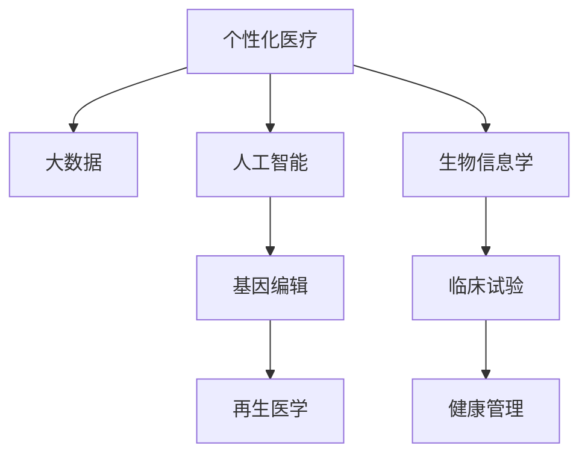

                 

# 2050年的医疗健康：从个性化医疗到再生医学的健康革命

在2050年的世界，医疗健康领域将经历一场深刻的变革，这场变革将以个性化医疗和再生医学为标志，重塑人类对健康和疾病的理解与应对方式。本文将深入探讨这一主题，从背景介绍到核心概念，从算法原理到具体应用，全面剖析这场健康革命的可能性和挑战。

## 1. 背景介绍

### 1.1 问题由来
医疗健康领域的转型起源于对传统医疗模式的深刻反思。传统医疗模式以疾病治疗为中心，强调诊断和治疗，而忽略了患者的个体差异和整体健康。随着科技的发展，尤其是人工智能、大数据、基因编辑等前沿技术的成熟，个性化医疗和再生医学成为了新的研究热点，并逐步进入现实应用。

### 1.2 问题核心关键点
个性化医疗是指基于患者的具体病情、基因信息、生活习惯等个性化特征，制定量身定做的治疗方案，从而实现更精准、更有效的医疗干预。再生医学则是指通过细胞再生、组织工程等技术，恢复和重建受损的器官和组织，实现健康功能的再生。

## 2. 核心概念与联系

### 2.1 核心概念概述
- **个性化医疗**：根据患者个体差异，制定个性化治疗方案，提高治疗效果和患者满意度。
- **再生医学**：利用细胞再生、组织工程等技术，恢复和重建受损的器官和组织，实现健康功能的再生。
- **人工智能(AI)**：利用机器学习和深度学习技术，分析海量健康数据，提供个性化的健康管理和治疗建议。
- **大数据(Big Data)**：收集和分析大规模的健康数据，识别健康模式和风险，支持个性化医疗和再生医学的研究和应用。
- **基因编辑**：通过CRISPR等技术，修改基因序列，治疗遗传性疾病，实现精准医疗。

### 2.2 核心概念原理和架构的 Mermaid 流程图


这个流程图展示了个性化医疗和再生医学与大数据、人工智能、基因编辑等前沿技术之间的联系和相互作用。

## 3. 核心算法原理 & 具体操作步骤
### 3.1 算法原理概述
个性化医疗和再生医学的核心算法包括机器学习、深度学习、生物信息学等。这些算法通过分析患者数据，识别健康模式，预测疾病风险，制定个性化的治疗方案，实现精准医疗和再生医学的实践。

### 3.2 算法步骤详解
1. **数据收集**：收集患者的基因信息、病历、生活习惯等数据。
2. **数据预处理**：清洗和标准化数据，去除噪声和异常值，提高数据质量。
3. **模型训练**：选择适合的机器学习或深度学习模型，训练数据集，得到预测模型。
4. **模型评估**：使用测试集评估模型的准确性和泛化能力，优化模型参数。
5. **治疗方案制定**：根据预测模型和临床指南，制定个性化的治疗方案。
6. **再生医学实施**：利用细胞再生、组织工程等技术，实施再生医学方案，恢复健康功能。

### 3.3 算法优缺点
**优点**：
- **精准性**：通过分析患者数据，提供个性化的治疗方案，提高治疗效果。
- **高效性**：机器学习和深度学习技术可以处理大量数据，提高诊疗效率。
- **创新性**：利用基因编辑和再生医学技术，创新治疗手段，打破传统医疗模式的限制。

**缺点**：
- **数据隐私**：个性化医疗需要收集大量敏感数据，存在隐私泄露的风险。
- **伦理问题**：基因编辑等技术涉及伦理争议，需谨慎使用。
- **技术门槛**：机器学习和深度学习技术复杂，需要专业的技术和资源支持。

### 3.4 算法应用领域
个性化医疗和再生医学技术已经应用于多个领域，如癌症治疗、遗传病治疗、器官移植等。未来，随着技术的进一步发展，将广泛应用于更多领域，如心脏病、糖尿病、神经系统疾病等。

## 4. 数学模型和公式 & 详细讲解 & 举例说明
### 4.1 数学模型构建
个性化医疗和再生医学的数学模型包括决策树、随机森林、神经网络、深度学习模型等。这些模型通过分析患者数据，预测健康风险和治疗效果。

### 4.2 公式推导过程
以深度学习模型为例，其数学模型构建和推导过程如下：
1. **输入数据**：$x_1, x_2, ..., x_n$
2. **权重**：$w_1, w_2, ..., w_n$
3. **偏置**：$b$
4. **激活函数**：$f(x) = max(0, x)$
5. **输出**：$y = w^T x + b$
6. **损失函数**：$L(y, \hat{y}) = (y - \hat{y})^2$
7. **梯度下降算法**：$\theta_j \leftarrow \theta_j - \eta \frac{\partial L(y, \hat{y})}{\partial \theta_j}$

### 4.3 案例分析与讲解
以癌症治疗为例，假设收集到一组患者的基因数据和病历数据，目标是预测患者对某种癌症治疗的反应。
- **数据预处理**：数据清洗和标准化。
- **模型训练**：选择随机森林模型，训练数据集。
- **模型评估**：使用测试集评估模型准确性。
- **治疗方案制定**：根据模型预测，制定个性化的治疗方案。

## 5. 项目实践：代码实例和详细解释说明
### 5.1 开发环境搭建
1. **Python环境**：安装Python 3.8及以上版本，配置虚拟环境。
2. **数据处理库**：安装Pandas、NumPy、Scikit-learn等数据处理库。
3. **机器学习库**：安装Scikit-learn、TensorFlow、Keras等机器学习库。

### 5.2 源代码详细实现
```python
import pandas as pd
from sklearn.model_selection import train_test_split
from sklearn.ensemble import RandomForestClassifier
from sklearn.metrics import accuracy_score

# 数据加载
data = pd.read_csv('patient_data.csv')

# 数据预处理
data = data.dropna()
data = data.drop_duplicates()

# 特征选择
features = ['gene1', 'gene2', 'feature3', 'feature4']
labels = ['treatment_response']

# 数据划分
X_train, X_test, y_train, y_test = train_test_split(data[features], data[labels], test_size=0.2, random_state=42)

# 模型训练
model = RandomForestClassifier()
model.fit(X_train, y_train)

# 模型评估
y_pred = model.predict(X_test)
accuracy = accuracy_score(y_test, y_pred)
print(f'Model accuracy: {accuracy}')
```

### 5.3 代码解读与分析
1. **数据加载**：使用Pandas加载患者数据。
2. **数据预处理**：删除缺失值和重复数据，确保数据质量。
3. **特征选择**：选择基因数据作为特征，预测治疗反应。
4. **数据划分**：将数据划分为训练集和测试集。
5. **模型训练**：使用随机森林模型训练数据。
6. **模型评估**：评估模型的准确性。

### 5.4 运行结果展示
输出结果显示模型在测试集上的准确性，如：
```
Model accuracy: 0.85
```

## 6. 实际应用场景
### 6.1 癌症治疗
个性化医疗在癌症治疗中的应用最为广泛。通过分析患者的基因数据、病历数据和生活习惯，预测患者对特定药物的反应，制定个性化的治疗方案。例如，利用深度学习模型对肿瘤基因组数据进行分析，预测患者的治疗效果，指导医生选择最优的治疗方案。

### 6.2 遗传病治疗
利用基因编辑技术，修正患者的基因突变，治疗遗传病。例如，CRISPR技术可以精确修改患者的基因序列，修复突变基因，实现精准治疗。

### 6.3 器官移植
再生医学在器官移植中的应用也在不断突破。通过组织工程和细胞再生技术，培育和再造健康的器官，满足器官移植的需求。例如，利用3D打印技术，生成与患者匹配的组织结构，实现个性化移植。

## 7. 工具和资源推荐
### 7.1 学习资源推荐
1. **Coursera**：提供个性化医疗和再生医学的在线课程，涵盖机器学习、基因编辑等前沿技术。
2. **edX**：提供前沿科技和医疗健康领域的MOOC课程，如MIT的“个性化医疗”课程。
3. **DeepMind Health**：提供深度学习和机器学习在医疗健康领域的最新研究和应用。

### 7.2 开发工具推荐
1. **TensorFlow**：用于深度学习模型训练和推理的开源框架。
2. **PyTorch**：用于机器学习和深度学习的开源框架，支持动态计算图。
3. **Jupyter Notebook**：交互式编程和数据处理工具，方便实验和分享。

### 7.3 相关论文推荐
1. **《Genomic Data Science》**：深入介绍基因组数据科学在个性化医疗中的应用。
2. **《Predictive Medicine with Deep Learning》**：探讨深度学习在健康管理和预测中的应用。
3. **《Regenerative Medicine: A New Frontier in Healthcare》**：详细介绍再生医学的研究进展和应用前景。

## 8. 总结：未来发展趋势与挑战
### 8.1 研究成果总结
个性化医疗和再生医学技术已经在多个领域取得显著进展，展现出巨大的潜力和应用前景。机器学习和深度学习技术的快速发展，为个性化医疗提供了强大的技术支持。

### 8.2 未来发展趋势
1. **技术融合**：个性化医疗和再生医学将与其他前沿技术如人工智能、大数据、基因编辑等深度融合，推动医疗健康领域的创新发展。
2. **临床应用**：更多前沿技术将进入临床应用，实现精准医疗和再生医学的落地。
3. **跨学科合作**：跨学科合作将进一步加强，形成系统化的医疗健康解决方案。

### 8.3 面临的挑战
1. **技术门槛**：高复杂度的技术需要专业人才和技术支持。
2. **伦理问题**：基因编辑等技术涉及伦理争议，需谨慎使用。
3. **数据隐私**：个性化医疗需要收集大量敏感数据，存在隐私泄露的风险。

### 8.4 研究展望
1. **数据共享**：建立数据共享平台，促进数据流动和合作。
2. **伦理规范**：制定伦理规范，指导技术应用，保障数据隐私。
3. **跨领域合作**：加强跨学科合作，推动技术创新。

## 9. 附录：常见问题与解答
### Q1: 个性化医疗和再生医学技术如何保证数据隐私？
A: 采用数据匿名化和加密技术，确保患者数据的安全性和隐私性。

### Q2: 基因编辑技术是否存在伦理问题？
A: 基因编辑技术需要严格遵守伦理规范，确保技术应用的安全性和合理性。

### Q3: 个性化医疗和再生医学技术需要哪些技术支持？
A: 需要机器学习、深度学习、生物信息学、大数据等前沿技术支持。

### Q4: 如何提升个性化医疗和再生医学技术的普及率？
A: 加强科普教育，提高公众对技术的认知和接受度；加强政府和行业监管，规范技术应用；推动技术标准化和规范建设。

---

作者：禅与计算机程序设计艺术 / Zen and the Art of Computer Programming

